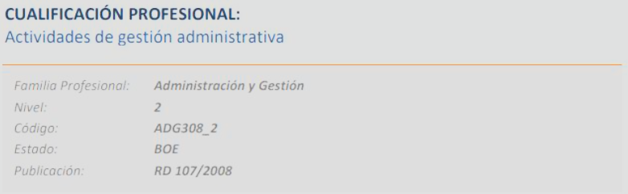
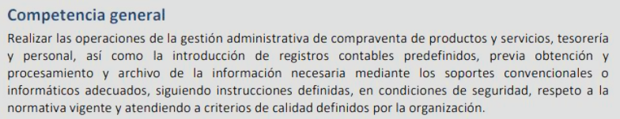
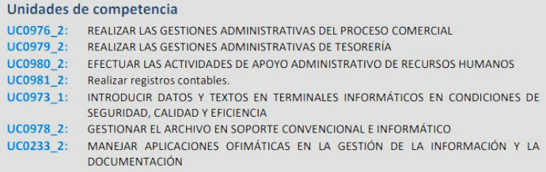
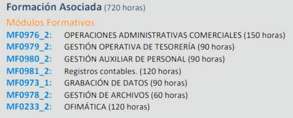
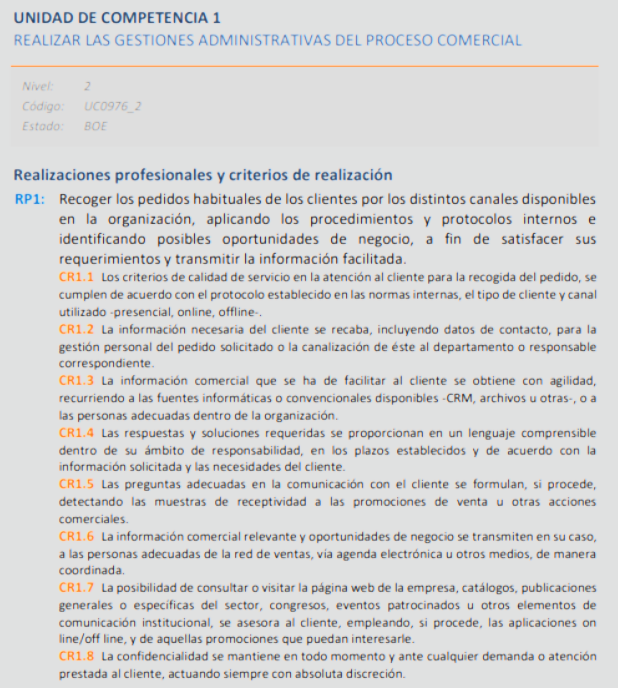
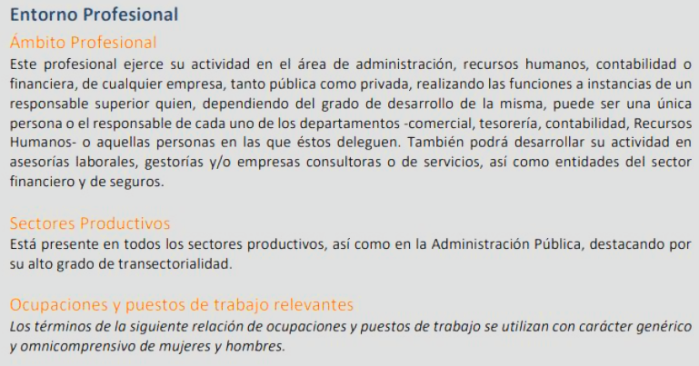

[TOC]

# MF1442 - Unidad 1 – Estructura de la Formación Profesional

## Introducción
En esta unidad se estudia cómo está organizada la **Formación Profesional en España** y los cambios introducidos por la **Ley Orgánica 3/2022**.  
Antes de esta ley, la FP estaba dividida en dos subsistemas: **FP Reglada** (sistema educativo) y **FP para el Empleo** (ámbito laboral).  
Con la nueva normativa se crea un **Sistema Único de Formación Profesional**, más flexible y adaptado a las necesidades actuales.

También cambia la terminología:
- Unidad de Competencia → Estándar de Competencia.  
- Realización Profesional → Elemento de Competencia.  
- Módulo Formativo → Módulo Profesional.  
- Capacidad → Resultado de Aprendizaje.  
- Certificado de Profesionalidad → Certificado Profesional.  

La ley introduce **cinco grados de formación** que permiten desde acreditaciones parciales hasta cursos de especialización (Grados A a E).  

---

## 1. Sistema Nacional de las Cualificaciones (previo a la Ley 3/2022)
Antes de 2022, la FP se basaba en el **Sistema Nacional de Cualificaciones y Formación Profesional (SNCFP)**.  
Este sistema definía qué debía saber hacer un profesional para poder trabajar en cada ocupación, y utilizaba esas definiciones como referencia para crear los títulos de FP y los certificados de profesionalidad.

- **Cualificación profesional**: conjunto de competencias relevantes para un empleo.  
- **Unidad de competencia (UC)**: parte mínima de una cualificación, formada por conocimientos, destrezas y criterios de realización.  
- **INCUAL**: Instituto Nacional de las Cualificaciones, responsable de diseñar y actualizar las calificaciones profesionales. Puedes acceder en https://incual.educacion.gob.es/. 
- **Catálogo Nacional de Cualificaciones Profesionales (CNCP)**: listado oficial de todas las cualificaciones, organizadas por familias y niveles.

### 1.1. El Catálogo Nacional de Cualificaciones Profesionales
El CNCP servía para (**objetivos**):
- Adaptar la formación a lo que pedía el mercado de trabajo.  
- Integrar la oferta de FP y garantizar su calidad.  
- Permitir la formación a lo largo de toda la vida.  
- Facilitar la movilidad laboral en toda España.  

Cada cualificación en el catálogo incluye:
- Denominación, familia y nivel de cualificación.

  

- Competencia general (qué debe lograr un profesional).

  

- Unidades de competencia con sus **realizaciones profesionales** (tareas) y **criterios de realización** (cómo comprobar que están bien hechas). 

  

- Propuesta de módulos formativos asociados.

  

- Desarrollo de cada unidad de competencia:

  

  

- Información sobre sectores y puestos relacionados.

  

>  [!important] 
>  Las cualificaciones **no eran títulos**. Solo servían de base para crear ciclos de FP o certificados de profesionalidad.

### 1.2. Formación modular
La FP es **modular y por competencias**.  
Cada módulo formativo corresponde a una unidad de competencia.  
- Superar un módulo → se acredita una parte de la cualificación.  
- Acumular módulos → se obtiene un certificado o título.  

El **Catálogo Modular de FP** organiza estos módulos y permite que puedan cursarse de manera independiente.

> [!tip]
>
> Funciona así:
>
> - Cada **unidad de competencia (UC)** es la “pieza mínima” que se puede acreditar oficialmente.
> - Una **UC** está vinculada a uno o varios **módulos formativos**.
> - Cuando superas ese módulo (o te acreditas la UC por experiencia laboral), la UC queda registrada como conseguida.
> - Esa **misma UC puede formar parte de distintos certificados profesionales o ciclos formativos**.
>
> 👉 Resultado:
>  Si ya la tienes acreditada, no tienes que volver a cursarla. Es decir, **sí, se convalida automáticamente** entre diferentes formaciones oficiales.

> [!note]
>
> **Ejemplo real:**
>
> - En el certificado de profesionalidad de **Gestión administrativa** y en el de **Comercio y marketing** aparece la UC0976_2 “Realizar las gestiones administrativas del proceso comercial”.
> - Si ya la superaste en uno de los certificados, cuando curses el otro **no tienes que repetirla**: se te convalida y se incorpora a tu expediente.

### 1.3. Niveles de cualificación
Los niveles de cualificación indican la complejidad de las tareas, la autonomía de la persona y la responsabilidad que asume.  
En España había cinco niveles, aunque la FP se centra en los tres primeros:

- **Nivel 1**: tareas simples y rutinarias.  
- **Nivel 2**: tareas variadas con cierta autonomía y dominio de técnicas básicas.  
- **Nivel 3**: dominio de varias técnicas, con capacidad de coordinación y supervisión.  

> [!note]
>
> Los niveles 4 y 5 se corresponden con estudios universitarios y de posgrado.  

En Europa, el **Marco Europeo de Cualificaciones (MEC)** tiene ocho niveles. España adaptó esa referencia mediante el **Marco Español de Cualificaciones (MECU)**.

### 1.4. Familias profesionales
Las cualificaciones también se agrupan en **familias profesionales**: un total de 26 que cubren todos los sectores productivos (sanidad, informática, hostelería, transporte, etc.).  

Cada familia cuenta con **Centros de Referencia Nacional**, especializados en innovación y experimentación de la FP.

### 1.5. Sistema Nacional de Cualificaciones Profesionales (resumen)
El SNCFP era la herramienta de la Administración para:
- Describir las competencias necesarias en cada profesión.  
- Diseñar títulos de FP y certificados de profesionalidad.  
- Evaluar y acreditar competencias adquiridas en el trabajo o en formación no formal.  

Todo ello estaba recogido en el **CNCP** y en el **Catálogo Modular de FP**.  
Las **unidades de competencia** eran la mínima parte acreditable, y acumulándolas se podía obtener una cualificación completa.  

## 2. Modificación de la normativa de formación profesional desde 2022
La **Ley Orgánica 3/2022, de 31 de marzo**, ha supuesto un cambio importante.  
Hasta entonces existían **dos subsistemas**:
- **FP Reglada**, gestionada por el Ministerio de Educación y las comunidades autónomas, con títulos oficiales (básico, medio y superior).  
- **FP para el Empleo**, dependiente del Ministerio de Trabajo y el SEPE, con certificados de profesionalidad y programas para trabajadores ocupados o desempleados.  

Con la nueva ley, desaparece esa división y se establece un **Sistema Único de Formación Profesional**, que integra toda la oferta.  
Durante un tiempo de transición, siguen siendo válidos los catálogos y títulos anteriores, hasta que se publiquen los nuevos desarrollos reglamentarios.

---

## 3. Subsistema de Formación Profesional Reglada (legislación anterior)
Este subsistema era la rama educativa de la FP. Su finalidad era acreditar un nivel de formación dentro del sistema educativo y proporcionar un perfil profesional.  
La oferta se organizaba en **ciclos formativos** con estructura modular y de duración variable.  

### 3.1. Programas y ciclos formativos
- **Formación Profesional Básica**: sustituyó a los antiguos Programas de Cualificación Profesional Inicial (PCPI). Estaba destinada a jóvenes que no habían finalizado la ESO. Al superarla, se obtenía el título de **Técnico Profesional Básico** y una cualificación de nivel 1 del CNCP.  
- **Ciclos Formativos de Grado Medio**: conducían al título de **Técnico**, dentro de la Educación Secundaria Posobligatoria.  
- **Ciclos Formativos de Grado Superior**: daban acceso al título de **Técnico Superior**, perteneciente a la Educación Superior.  
- **Cursos de especialización**: permitían a quienes ya tenían un título de FP ampliar o actualizar competencias.  
- **Otros programas**: adaptados a alumnado con necesidades educativas especiales o a personas mayores de 17 años que habían abandonado el sistema educativo sin cualificación.

---

## 4. Subsistema de la Formación Profesional para el Empleo (legislación anterior)
Este subsistema era la rama laboral de la FP. Dependía del Ministerio de Trabajo y del SEPE, y su objetivo era **formar a personas ocupadas y desempleadas** para mejorar su empleabilidad y su cualificación a lo largo de la vida.  

Su oferta principal eran los **Certificados de Profesionalidad**, títulos oficiales vinculados a cualificaciones del CNCP.

### 4.1. Características y destinatarios
- Se dirigía a toda la población activa, tanto ocupada como en desempleo.  
- La formación estaba orientada a la adquisición, mejora y actualización permanente de competencias.  
- Se buscaba adaptarse a las necesidades de las empresas, los sectores productivos y los territorios.

### 4.2. Evolución de modelos
- **Plan FIP (1993)**: diferenciaba entre formación continua (para trabajadores) y formación ocupacional (para desempleados).  
- **Modelo de 2007**: organizaba la FP para el Empleo en cuatro tipos de iniciativas:  
  1. Formación de demanda (acciones de las empresas y permisos individuales).  
  2. Formación de oferta (programas ofrecidos por la administración para ocupados y desempleados).  
  3. Formación en alternancia con el empleo (contratos de formación y programas mixtos).  
  4. Acciones de apoyo y acompañamiento a la formación.  

- **Modelo de 2017**: ponía a la empresa y a la persona trabajadora en el centro del sistema, distinguiendo:  
  1. Formación programada por las empresas.  
  2. Oferta formativa para ocupados.  
  3. Oferta formativa para desempleados.  
  4. Otras iniciativas (PIF, formación dual, formación de empleados públicos, militares en tránsito, personas privadas de libertad, etc.).  

### 4.3. Acreditación de competencias
Además de la formación, existía la opción de obtener acreditaciones oficiales a través de la **experiencia laboral** o de la formación no formal.  
Hasta ahora, este proceso dependía de convocatorias puntuales abiertas por la Administración.  
Con la nueva ley, el sistema será más activo: cualquier persona podrá solicitar la acreditación en cualquier momento, sin esperar a convocatorias específicas.

---

## 5. Sistema Único de Formación Profesional (legislación actual)

La **Ley Orgánica 3/2022** crea un **sistema único** que integra toda la FP, eliminando la separación entre subsistemas.  
Este modelo busca simplificar la organización, acercarla a Europa y dar más importancia al aprendizaje a lo largo de la vida.

### 5.1. Principios del sistema único
- **Unificación** de la FP y convergencia con Europa.  
- **Centralidad en la persona**: igualdad de acceso, eliminación de sesgos y apoyo a colectivos vulnerables.  
- **Actualización constante** ante cambios tecnológicos y sociales.  
- **Formación flexible y modular**, acumulable en distintos niveles.  
- **Reconocimiento de competencias** adquiridas en el trabajo o por vías no formales.  
- **Orientación profesional** como acompañamiento continuo.  
- Impulso a la formación **dual** (parte en centro, parte en empresa).

### 5.2. Catálogo Nacional de Estándares de Competencia
Sustituye al antiguo Catálogo de Cualificaciones.  
- Ordena las competencias profesionales por niveles y familias.  
- Cada estándar incluye elementos de competencia y sus indicadores de calidad.  
- Es la referencia para acreditar competencias y diseñar la formación.  

Mientras no se apruebe su reglamento, sigue vigente el Catálogo Nacional de Cualificaciones.

### 5.3. Grados de formación
El sistema único organiza la oferta en cinco grados:
- **Grado A**: microformaciones → acreditaciones parciales de competencia.  
- **Grado B**: certificados de competencia → acreditan un módulo profesional.  
- **Grado C**: certificados profesionales (niveles 1, 2 y 3).  
- **Grado D**: ciclos formativos de FP (básico, medio y superior).  
- **Grado E**: cursos de especialización (nivel especialista o máster profesional).  

### 5.4. Catálogo de Ofertas de FP
Reúne todas las acciones formativas oficiales, indicando grado y nivel.  
Incluye:
- FP en la educación básica.  
- FP en el sistema educativo.  
- Formación vinculada a estándares de competencia.  
- Formación dirigida a colectivos específicos.  

Las pueden impartir centros acreditados (públicos o privados), centros integrados, centros de referencia nacional, organismos con convenios, empresas y otros agentes autorizados.

> [!tip]
>
> Se puede consultar toda la oferta de ciclos formativos en https://www.todofp.es/que-estudiar/familias-profesionales.html

### 5.5. Registros del sistema
Se crean varios registros interconectados:
- Registro Estatal de Formación Profesional (vida formativa de cada persona).  
- Registro de Acreditaciones de Competencias por experiencia.  
- Registro de Centros Docentes no Universitarios.  
- Registro de Entidades Acreditadas de FP.  

### 5.6. Formación dual
Todos los programas de Grado C, D y E serán duales, es decir, combinarán teoría en el centro y prácticas en empresa.  
- **Dual genérica**: entre 25–35% del tiempo en empresa, sin contrato laboral.  
- **Dual intensiva**: más del 35% en empresa, con contrato remunerado.  

> [!note]  
> **Existe la figura del tutor/a dual** tanto en el centro educativo como en la empresa. El tutor/a dual del centro coordina con el tutor/a de la empresa el plan formativo, prepara al alumno para su incorporación y vela por la igualdad de trato y la no discriminación.

### 5.7. Orientación profesional
Se refuerza como un servicio permanente.  
- Acompaña a las personas en sus decisiones de itinerario formativo.  
- Facilita información actualizada sobre empleo y formación.  
- Incluye una estrategia general de orientación en todo el sistema.

### 5.8 Iniciativas de Formación para el Empleo desde el SEPE

El **Sistema Único de Formación Profesional** organiza la formación en cinco grados (A, B, C, D y E). Los centros deben estar inscritos en el **Registro General de Centros de Formación Profesional**.

Las acciones formativas pueden proceder de los propios **centros de formación** o de programas de **formación para el empleo**, que ya no funcionan como un subsistema aparte, sino como parte del **Sistema Nacional de Empleo**, gestionado por el **SEPE** y los servicios autonómicos.

#### 5.8.1 Formación programada por las empresas

Permite a las empresas:

- Responder rápido a los cambios del sector y reforzar su innovación.
- Ayudar a los trabajadores a mejorar su adaptación, cualificación y empleabilidad.

#### 5.8.2 Oferta formativa para trabajadores ocupados

Complementa la formación que ofrecen las empresas. Se organiza en:

- **Programas sectoriales:** centrados en un sector concreto.
- **Programas transversales:** útiles para distintos ámbitos.

Además, se impulsa el acceso a los **certificados de profesionalidad** mediante:

- Formación modular (acumulable por partes).
- Reconocimiento oficial de competencias adquiridas por la experiencia laboral.

#### 5.8.3 Oferta formativa para trabajadores desempleados

Se adapta al perfil de cada persona y a lo que necesita el mercado, priorizando a quienes tienen baja cualificación. Incluye:

- **Programas de los Servicios Públicos de Empleo:** cubren necesidades detectadas en itinerarios de inserción, ofertas de empleo e informes anuales. Buscan facilitar la inserción o reinserción laboral.
- **Programas específicos de formación:** para personas con necesidades especiales o dificultades de inserción; pueden incluir proyectos complementarios y compromisos de contratación.
- **Programas con compromisos de contratación:** formación vinculada directamente a un empleo asegurado.

#### 5.8.4 Otras iniciativas de formación

- **Permisos individuales de formación (PIF):** la empresa autoriza formación externa del trabajador (no obligatoria).
- **Formación en alternancia con el empleo:** combina estudio y trabajo, incluyendo la **formación dual** con contratos de formación o programas mixtos.
- **Formación en centros penitenciarios.**
- **Formación de militares de tropa y marinería** con contrato temporal.
- **Formación de empleados públicos:** mediante programas acordados en la Administración.
- **Formación privada para certificados de profesionalidad (sin fondos públicos):**
  - Acceso para personas que cumplan los requisitos.
  - Acceso también para quienes los incumplan, si realizan previamente formación en **competencias clave**.

---

## 6. Programas formativos: estructura (legislación anterior)
Un **programa formativo** describe una especialidad de formación. Incluye datos como:  
- Familia y área profesional.  
- Denominación y código.  
- Objetivo general.  
- Duración y número de participantes.  
- Requisitos de espacios, instalaciones y equipamiento.  
- Contenidos formativos.  

Existen programas:
- Dirigidos a certificados profesionales (con duración y contenidos definidos en la normativa).  
- No dirigidos a certificados, que pueden ser de uso general, específicos o complementarios.

---

## 7. Proyectos formativos en la formación en alternancia con el empleo (legislación anterior)
La **formación en alternancia** combina estudio y práctica laboral. Se materializaba en:
- **Contratos de formación y aprendizaje**: para jóvenes y colectivos específicos, con duración entre 1 y 3 años, salario proporcional y formación oficial.  
- **Programas públicos mixtos**: Escuelas Taller, Casas de Oficios y Talleres de Empleo.  
  - **Escuelas Taller**: para menores de 25 años, con una primera etapa de formación y otra de trabajo en proyectos sociales, culturales o medioambientales.  
  - **Casas de Oficios**: similares, pero de un año de duración.  
  - **Talleres de Empleo**: para mayores de 25 años, directamente con contrato y trabajo desde el inicio.

---

## 8. Otros programas formativos (Ley 3/2022)
Además de la oferta general, la nueva ley contempla programas específicos:
- Para mayores de 16 años sin titulación.  
- Para personas con dificultades de acceso al sistema educativo.  
- Para colectivos en riesgo de exclusión social.  

También se prevé que puedan desarrollarse programas directamente en empresas u organismos equiparados, siempre alineados con el Catálogo de Estándares y los resultados de aprendizaje.

---

## Resumen
La evolución de la FP en España ha sido la siguiente:
- **2002**: sistema integral basado en cualificaciones, con dos subsistemas (Reglada y Empleo).  
- **2022**: sistema único que integra toda la FP, con cinco grados formativos y nuevos catálogos.  

Principales novedades:
- Terminología renovada (unidad de competencia → estándar de competencia, etc.).  
- Formación acumulable y flexible.  
- Reconocimiento de la experiencia laboral.  
- Formación dual obligatoria.  
- Orientación profesional reforzada.  

El sistema actual busca ser más sencillo, adaptado al mercado y centrado en las personas, garantizando que cualquiera pueda formarse y acreditarse a lo largo de toda su vida laboral.

---

## 🧑‍🏫EJERCICIOS

### Evaluación diagnóstica

**1) La cualificación profesional es:**

a) El conjunto de instrumentos y acciones para analizar las diferentes profesiones, diseñar la oferta de formación profesional y evaluar y acreditar las competencias profesionales correspondientes a cada cualificación.  
b) El conjunto de competencias profesionales con significación para el empleo.  
c) El conjunto de conocimientos y capacidades que permitan el ejercicio de la actividad profesional, conforme a las exigencias de la producción y el empleo.  
d) El instrumento del Sistema Nacional de Cualificaciones y Formación Profesional (SNCFP) que reúne de forma actualizada todas las cualificaciones profesionales.  

**2) Las unidades de competencia son:**

a) El conjunto de instrumentos y acciones para analizar las diferentes profesiones, diseñar la oferta de formación profesional y evaluar y acreditar las competencias profesionales correspondientes a cada cualificación.  
b) El conjunto de competencias profesionales con significación para el empleo.  
c) El conjunto de conocimientos y capacidades que permitan el ejercicio de la actividad profesional, conforme a las exigencias de la producción y el empleo.  
d) El instrumento del Sistema Nacional de Cualificaciones y Formación Profesional (SNCFP) que reúne de forma actualizada todas las cualificaciones profesionales.  

**3) Los niveles de cualificación diferencian:**

a) Los requisitos de capacidad para la realización de actividades productivas con arreglo a criterios de: conocimientos, iniciativa, autonomía, responsabilidad y complejidad.  
b) Las afinidades entre las competencias profesionales de cada cualificación.  
c) Sectores de actividad con los que están familiarizados los alumnos.  
d) La estructura de competencias y capacidades a desarrollar por parte de los alumnos.  

**4) El proceso de certificación hace referencia al:**

a) Proceso directo en el que al cursar una formación oficial asociada a una cualificación profesional se obtenía la misma.  
b) Proceso abierto por la Administración Pública para valorar la experiencia laboral y la formación de las personas a fin de identificar si reunían los requisitos de una cualificación profesional.  
c) Proceso indirecto en el que al cursar una formación oficial asociada a una cualificación profesional se accede a un proceso de acreditación.  
d) Proceso abierto por la Administración Pública para cursar una acción formativa conducente a un certificado de profesionalidad.  

**5) ¿En cuántas partes se estructuran los certificados de profesionalidad?:**

a) 3.  
b) 4.  
c) 5.  
d) 26.  

**6) ¿En qué modalidad se considera que se ha realizado una acción formativa si el 50% ha sido presencial?:**

a) Modalidad presencial.  
b) Modalidad de teleformación.  
c) Modalidad mixta.  
d) Modalidad dual.  

**7) Las partes específicas en que se divide un objetivo superior se conocen como:**

a) Objetivos generales.  
b) Objetivos específicos.  
c) Objetivos operativos.  
d) Objetivos académicos.  

**8) Los criterios de evaluación profesionalizadores responden:**

a) A la dimensión del saber.  
b) A la dimensión del hacer.  
c) A la dimensión del comportarse.  
d) A la dimensión del estar.  

**9) La secuenciación de los contenidos:**

a) La decide el docente.  
b) Está prevista en cada certificado de profesionalidad.  
c) No se puede alterar.  
d) Requiere de un consentimiento por parte del alumnado.  

**10) La actualización de los contenidos depende:**

a) Del Ministerio de Educación.  
b) De cada certificado de profesionalidad.  
c) Del Consejo General de Formación Profesional.  
d) De cada docente.  

#### Soluciones

1. **b) El conjunto de competencias profesionales con significación para el empleo.**  
   Una cualificación profesional describe lo que una persona debe saber y saber hacer para ejercer un empleo con valor en el mercado.  

2. **c) El conjunto de conocimientos y capacidades que permitan el ejercicio de la actividad profesional.**  
   Las unidades de competencia son los bloques mínimos que describen lo necesario para realizar una función profesional concreta.  

3. **a) Los requisitos de capacidad para la realización de actividades productivas con arreglo a criterios de: conocimientos, iniciativa, autonomía, responsabilidad y complejidad.**  
   Los niveles de cualificación diferencian las exigencias de las tareas y la autonomía con la que se realizan.  

4. **a) Proceso directo en el que al cursar una formación oficial asociada a una cualificación profesional se obtenía la misma.**  
   La certificación se refiere a obtener la cualificación a través de formación oficial; no es lo mismo que la acreditación por experiencia.  

5. **c) 5.**  
   Los certificados de profesionalidad se estructuran en cinco apartados: datos identificativos, perfil profesional, formación asociada, requisitos del formador y requisitos de instalaciones/equipos.  

6. **c) Modalidad mixta.**  
   Cuando la mitad de la formación se imparte presencialmente y la otra mitad a distancia, se considera modalidad mixta.  

7. **b) Objetivos específicos.**  
   Los objetivos específicos concretan y dividen los generales en metas más precisas y alcanzables.  

8. **c) A la dimensión del comportarse.**  
   Los criterios de evaluación profesionalizadores valoran el “saber estar” profesional: actitudes, responsabilidad, trabajo en equipo, puntualidad…  

9. **a) La decide el docente.**  
   La secuenciación didáctica corresponde al formador en su programación, aunque respetando los contenidos y tiempos oficiales.  

10. **d) De cada docente.**  
    La actualización de contenidos (ejemplos, recursos, casos actuales) depende del formador, que debe mantener el temario adaptado al contexto real.  

---

### Ejercicio 2: Estructura de la formación profesional

Distingue qué elementos de la Formación Profesional se corresponden con el sistema de la Ley Orgánica 5/2002, de 19 de junio, de las Cualificaciones y de la Formación Profesional y cuáles con la Ley Orgánica 3/2022, de 31 de marzo, de ordenación e integración de la Formación Profesional:

| **Elemento**                                                 | **Ley**    | **Explicación**                                              |
| ------------------------------------------------------------ | ---------- | ------------------------------------------------------------ |
| Subsistema de formación profesional                          | Ley 5/2002 | División de la FP en dos ramas: Reglada (educación) y Empleo (laboral). Desaparece en 2022. |
| Catálogo Nacional de Cualificaciones Profesionales (CNCP)    | Ley 5/2002 | Herramienta central del SNCFP que recoge todas las cualificaciones por familias y niveles. |
| Catálogo Nacional de Estándares de Competencias Profesionales | Ley 3/2022 | Nuevo catálogo que sustituye al CNCP, organizado en estándares de competencia. |
| Realizaciones profesionales y criterios de realización       | Ley 5/2002 | Elementos que describen las tareas y cómo se valoran dentro de una unidad de competencia. |
| Elementos de competencia e indicadores de calidad            | Ley 3/2022 | Sustituyen a las realizaciones y criterios; definen cada estándar de competencia y su nivel de calidad. |
| Módulos formativos                                           | Ley 5/2002 | Formación asociada a cada unidad de competencia; acreditable de forma acumulable. |
| Módulos profesionales                                        | Ley 3/2022 | Sustituyen a los módulos formativos; se basan en resultados de aprendizaje y estándares de competencia. |

---

### Ejercicio 3: Estructura de la formación profesional

Relaciona los diferentes grados con las acciones formativas de FP:

- Acreditación parcial de competencia ➡️ Micro formaciones. Un resultado de aprendizaje incluido en una oferta superior.
- Certificado de competencia ➡️ Un módulo profesional incluido en una oferta superior.
- Certificado profesional ➡️ Certificados de nivel 1, 2 y 3.
- Ciclo Formativo de Formación Profesional ➡️ Grado Básico (técnico básico), Medio (técnico) y Superior (técnico superior).
- Cursos de especialización ➡️ Grado Medio (especialista) y Grado Superior (máster profesional).

---

### Ejercicio 4: Actividad asociada a CE3.1

¿Con qué iniciativas de Formación Profesional para el Empleo se corresponden las siguientes acciones formativas?:

| Acción formativa                                             | Iniciativa FPE (SEPE)                                        | Explicación                                                  |
| ------------------------------------------------------------ | ------------------------------------------------------------ | ------------------------------------------------------------ |
| Programa de formación de directivos de la empresa Adams Formación. | **5.8.1 Formación programada por las empresas**              | Es formación interna para personal propio (directivos) de una empresa concreta; encaja en la formación bonificada organizada por la empresa. |
| Programas de formación en herramientas de teleformación para el sector de educación. | **5.8.2 Oferta para ocupados – Programas sectoriales**       | Atiende necesidades específicas de un **sector** (educación) y no de una empresa concreta; complementa la formación y mejora competencias del colectivo ocupado. |
| AFD Atención sociosanitaria en instituciones.                | **5.8.3 Oferta para desempleados – Programas de los Servicios Públicos de Empleo** | “AFD” (Andalucía) identifica acciones para **desempleados**, normalmente vinculadas a certificados de profesionalidad y gestionadas por el SPE. |
| Programa de formación transversal en competencias digitales para el sector de transporte. | **5.8.2 Oferta para ocupados – Programas transversales**     | Las **competencias digitales** son transversales (válidas en múltiples sectores), aunque el destinatario sea el transporte. |
| Formación en Panadería en un centro penitenciario.           | **5.8.4 Otras iniciativas – Formación de personas en situación de privación de libertad** | Es formación dirigida a internos en centros penitenciarios, prevista como iniciativa específica. |

### MF1442_3 E2. Práctica asociada a los CE1.1, CE2.1 y CE3.2 (Unidad de aprendizaje 1, Caso Práctico 1)

#### Enunciado

Un centro de formación quiere realizar una acción formativa de Asesoría de imagen personal, por lo que necesita la documentación básica de la cualificación profesional Asesoría integral de imagen personal.

Localiza la cualificación en el INCUAL e indica los siguientes datos:

- Denominación.
- Enlace al documento oficial del INCUAL.
- Nivel.
- Código.
- Unidades de competencia.
- Módulos formativos asociados.
- Finalmente, haz una reflexión personal sobre la correspondencia entre unidades de competencia y módulos formativos.

---

#### Solución

En INCUAL, por la familia profesional de Imagen Personal, tengo que escribir en la URL directamente https://incual.educacion.gob.es/imagen_cualificaciones para poder acceder, ya que no encuentro ningún enlace a las cualificaciones para poder encontrar “Asesoría integral de imagen personal”.

- **Denominación**: Asesoría integral de imagen personal.
- **Enlace al INCUAL**: https://incual.educacion.gob.es/documents/20195/94271/IMP395_3_RV_18%20-%20Q_Documento%20publicado.pdf/ad73ea1d-0504-a60d-93a1-fe4adebd491e?version=1.0&t=1732266231539
- **Nivel**: 3.
- **Código**: IMP395_3.
- **Unidades de competencia:** 
  - UC1248_3: Realizar el estudio de la imagen personal para proponer proyectos de cambio personalizados 
  - UC1249_3: Asesorar sobre cambios en su imagen personal mediante el cuidado y transformación estética del cabello y pelo facial 
  - UC1250_3: Asesorar sobre cambios en su imagen personal mediante cuidados estéticos 
  - UC1251_3: Asesorar sobre cambios en la imagen personal mediante la indumentaria y los complementos 
  - UC1252_3: Asesorar en las actuaciones de protocolo, usos sociales y etiqueta relacionados con la imagen personal 
  - UC1253_3: Asesorar en técnicas de comunicación relacionadas con la imagen personal
- **Módulos formativos asociados:**
  - MF1248_3: Estudio de la imagen personal y propuesta de cambios personalizados (150 horas) 
  - MF1249_3: Asesoramiento sobre cambios en la imagen personal mediante el cuidado y transformación estética del cabello y pelo facial (240 horas) 
  - MF1250_3: Asesoramiento sobre cambios en la imagen personal mediante cuidados estéticos (240 horas) 
  - MF1251_3: Asesoramiento sobre cambios en la imagen personal mediante la indumentaria y los complementos (90 horas) 
  - MF1252_3: Asesoramiento en las actuaciones de protocolo, usos sociales y etiqueta relacionados con la imagen personal (150 horas) 
  - MF1253_3: Asesoramiento en técnicas de comunicación relacionadas con la imagen personal (120 horas)
- **Reflexión:** Cada módulo formativo consta de un única unidad de competencia, en la que coinciden en el código (UC1248_3 -> MF1248_3). Esto facilitaría el desarrollo de cualquier acción formativa y acreditaciones parciales al ser tan lineal.

Captura del documento de CUALIFICACION PROFESIONAL de Asesoría integral de imagen personal.

### Test final

1. El Sistema Nacional de Cualificaciones y Formación Profesional (SNCFP) hasta 2022 era:

   a) El conjunto de instrumentos y acciones para analizar las diferentes profesiones, diseñar la oferta de formación profesional y evaluar y acreditar las competencias profesionales correspondientes a cada cualificación.  
   b) El conjunto de competencias profesionales con significación para el empleo.  
   c) El conjunto de conocimientos y capacidades que permitan el ejercicio de la actividad profesional, conforme a las exigencias de la producción y el empleo.  
   d) El conjunto de catálogos de acciones de Formación Profesional.

2. El Catálogo Nacional de Estándares de Competencias Profesionales es:

   a) El instrumento del Sistema Nacional de Cualificaciones y Formación profesional (SNCFP) que reúne de forma actualizada todas las cualificaciones profesionales.  
   b) El instrumento del Sistema Nacional de Formación Profesional que ordena los estándares de competencias profesionales.  
   c) El instrumento del Sistema Nacional de Formación Profesional que incorporará todas las ofertas de formación profesional reconocidas y acreditables.  
   d) El instrumento con capacidad e independencia que apoya al Consejo General de Formación Profesional para analizar y actualizar las cualificaciones.

3. Los niveles de cualificación diferencian:

   a) Los requisitos de capacidad para la realización de actividades productivas con arreglo a criterios de: conocimientos, iniciativa, autonomía, responsabilidad y complejidad.  
   b) Las afinidades entre las competencias profesionales de cada cualificación.  
   c) Sectores de actividad con los que están familiarizados los alumnos.  
   d) La estructura de competencias y capacidades a desarrollar por parte de los alumnos.

4. El nivel 3 de cualificación requiere:

   a) Competencia en un conjunto reducido de actividades de trabajo relativamente simples correspondientes a procesos normalizados.  
   b) Competencia en un conjunto de actividades profesionales bien determinadas con la capacidad de utilizar los instrumentos y técnicas propias.  
   c) Competencia en un conjunto de actividades profesionales que requieren el dominio de diversas técnicas y puede ser ejecutado de forma autónoma, comporta responsabilidad de coordinación y supervisión de trabajo técnico y especializado.  
   d) Competencia en un amplio conjunto de actividades profesionales complejas realizadas en una gran variedad de contextos que requieren conjugar variables de tipo técnico, científico, económico u organizativo.

5. Hasta el desarrollo de la Ley Orgánica 3/2022, de 31 de marzo, de ordenación e integración de la Formación Profesional, el Subsistema de Formación Profesional reglada:

   a) Dependía del Ministerio de Educación y Formación Profesional y de las Comunidades Autónomas, cuya oferta formativa eran los Títulos de formación profesional.  
   b) Estaba vinculado al Ministerio de Trabajo, Migraciones y Seguridad Social y a las Comunidades Autónomas, cuya oferta formativa eran los certificados de profesionalidad.  
   c) Dependía del Ministerio de Economía y Asuntos Sociales y contemplaba el Registro de los Certificados de Profesionalidad.  
   d) Se vinculaba al Servicio Público de Empleo para la orientación laboral de las personas en situación de desempleo.

6. Los elementos de competencia incluyen:

   a) Estándares de calidad.  
   b) Criterios de realización.  
   c) Unidades de competencia.  
   d) Cualificaciones profesionales.

7. El grado B de Formación Profesional lo componen:

   a) La acreditación parcial de competencias.  
   b) Los certificados de competencia.  
   c) Los certificados profesionales.  
   d) Los ciclos formativos de formación profesional.

8. El grado E de Formación Profesional lo componen:

   a) Los certificados de competencia.  
   b) Los certificados profesionales.  
   c) Los ciclos formativos de formación profesional.  
   d) Los cursos de especialización.

9. Las microformaciones de formación profesional hacen referencia a:

   a) Cursos de especialización de Grado Medio o Superior.  
   b) Acreditaciones parciales de competencia.  
   c) Certificados profesionales.  
   d) Ciclos formativos.

10. Las casas de oficios son:

    a) Proyectos de carácter temporal en los que el aprendizaje y la cualificación se alternan con un trabajo productivo en actividades relacionadas con el mantenimiento y cuidado de entornos urbanos, rurales o del medio ambiente.  
    b) Proyectos de carácter temporal en los que el aprendizaje y la cualificación se alternan con un trabajo productivo en actividades relacionadas con la recuperación o promoción del patrimonio artístico, histórico, cultural o natural.  
    c) Proyectos de carácter temporal en los que el aprendizaje y la cualificación se alternan con el trabajo productivo en actividades de interés público o social.  
    d) Proyectos de innovación para la generación de oportunidades laborales.

---

Soluciones

1) **a)**  El SNCFP (con validez hasta 2022) es el conjunto de instrumentos y acciones para analizar las diferentes profesiones, diseñar la oferta de formación profesional y evaluar y acreditar las competencias profesionales correspondientes a cada cualificación.

2) **b)**  El Catálogo Nacional de Estándares de Competencias Profesionales es un instrumento del Sistema Nacional de Formación Profesional que ordena los estándares de competencias profesionales identificados en el sistema productivo, en función de las competencias apropiadas y el estándar de calidad requerido para el ejercicio profesional, susceptibles de reconocimiento y acreditación.

3) **a)**  Las cualificaciones profesionales se dividen en niveles atendiendo a la competencia profesional requerida por las actividades productivas con arreglo a criterios de: conocimientos, iniciativa, autonomía, responsabilidad y complejidad. Estos niveles se definen en el Real Decreto 1128/2003, de 5 de septiembre, por el que se regulaba el Catálogo Nacional de Cualificaciones Profesionales.

4) **c)**  El nivel 3 de cualificación requiere competencia en un conjunto de actividades profesionales que requieren el dominio de diversas técnicas y puede ser ejecutado de forma autónoma, comporta responsabilidad de coordinación y supervisión de trabajo técnico y especializado. Exige la comprensión de los fundamentos técnicos y científicos de las actividades y la evaluación de los factores del proceso y de sus repercusiones económicas.

5) **a)**  Hasta el desarrollo de la Ley Orgánica 3/2022, de 31 de marzo, de ordenación e integración de la Formación Profesional, el Subsistema de Formación Profesional reglada dependía del Ministerio de Educación y Formación Profesional y de las Comunidades Autónomas, cuya oferta formativa eran los títulos de Formación Profesional.

6) **a)**  Los estándares de competencia se componen de elementos de competencia (anteriores realizaciones profesionales), que identifican las realizaciones profesionales incluidas en ellos y estos elementos de competencia incluirán estándares de calidad (anteriores criterios de realización).

7) **b)**  El grado B de Formación Profesional lo componen los certificados de competencia.

8) **d)**  El grado E de Formación Profesional lo componen los cursos de especialización.

9) **b)**  Las microformaciones de formación profesional hacen referencia a acreditaciones parciales de competencia.

10) **a)**  Las casas de oficios son proyectos de carácter temporal en los que el aprendizaje y la cualificación se alternan con un trabajo productivo en actividades relacionadas con el mantenimiento y cuidado de entornos urbanos, rurales o del medioambiente, con la mejora de las condiciones de vida de pueblos y ciudades a través de la prestación de servicios sociales y comunitarios, así como con cualquier otra actividad de utilidad pública o social que permita la inserción a través de la profesionalización y adquisición de experiencia de las personas participantes menores de 25 años.

