[TOC]

# MF1442 - Unidad 2 - Certificados de profesionalidad

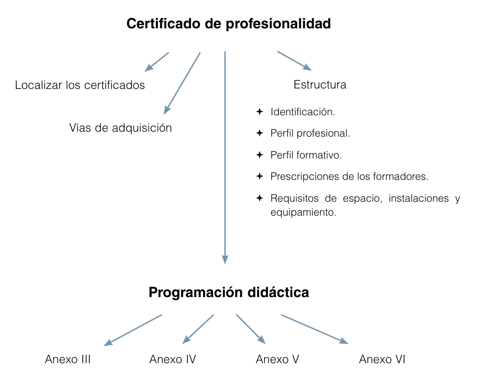

## 1. Certificado de profesionalidad
Un **certificado de profesionalidad** es un título oficial que acredita que una persona tiene las competencias necesarias para realizar un trabajo concreto.  

Estos certificados forman parte de la **Formación Profesional para el Empleo** y están vinculados al **Catálogo Nacional de Cualificaciones Profesionales (CNCP)**, lo que garantiza que responden a las necesidades reales del mercado laboral.  

### 1.1 Características principales
- **Son oficiales** y los expide el SEPE o las comunidades autónomas.  
- **Tienen validez en toda España** y son reconocidos a nivel europeo mediante el Marco Europeo de Cualificaciones.  
- Están pensados para mejorar la **empleabilidad** y facilitar la **movilidad laboral** para los mayores de 15 años.  
- Se organizan de forma **modular**, lo que permite ir superando partes y acumularlas hasta obtener el certificado completo.  
- Incluyen siempre un **módulo de prácticas profesionales no laborales**, que garantiza la aplicación de lo aprendido en un entorno real de trabajo.  
- Se pueden localizar a través de la sede electrónica del Portal de la Formación Profesional: https://todofp.es/inicio.html.

  

### 1.2 Vías de obtención
Existen dos formas de conseguir un certificado de profesionalidad:  
1. **Superando la formación oficial** en un centro acreditado, completando todos los módulos teóricos y las prácticas.  
2. **A través de la acreditación de competencias**, que reconoce la experiencia laboral y la formación no formal.

   El procedimiento de acreditación se organiza en **cinco fases**:

   1. **Tramitación**  
      El candidato presenta la solicitud y la documentación requerida para iniciar el procedimiento.

   2. **Asesoramiento**  
      Un asesor analiza la experiencia y formación de la persona, le ayuda a identificar qué unidades de competencia puede acreditar y a preparar su dossier.

   3. **Evaluación**  
      Se verifica si el candidato demuestra las competencias exigidas mediante entrevistas, observaciones, pruebas prácticas o revisión documental.

   4. **Acreditación y registro**  
      Las unidades de competencia superadas se reconocen oficialmente y se inscriben en el registro correspondiente. Son acumulables hasta obtener un certificado de profesionalidad.

   5. **Formación**  
      Si no se acreditan todas las competencias, se ofrece un plan de formación complementaria para completarlas y alcanzar el certificado completo.

   > [!note]  
   > Con la **Ley 3/2022** el procedimiento de acreditación de competencias cambia de forma importante:  
   > - Pasa a ser **abierto y permanente**, ya no depende de convocatorias puntuales de las administraciones.  
   > - Se reconoce cualquier **competencia adquirida por experiencia laboral o formación no formal**, vinculada al Catálogo de Estándares de Competencias Profesionales.  
   > - El proceso sigue las fases de tramitación, asesoramiento, evaluación, acreditación y registro, y formación complementaria en caso necesario.  
   > - Esto facilita que cualquier persona pueda acreditar sus competencias en cualquier momento de su vida laboral, acumulando unidades de competencia hasta completar un certificado o título de FP.  

En ambos casos, el resultado es el mismo: la persona obtiene un **título oficial que certifica su competencia profesional** en la ocupación correspondiente.

---

## 2. Estructura del certificado de profesionalidad
Todos los certificados de profesionalidad tienen una **estructura común**, definida por normativa estatal. Esto asegura que sean comparables entre sí y que cualquier persona que lo obtenga pueda demostrar de manera oficial las mismas competencias en todo el país.

### 2.1. Partes de un certificado
Un certificado se organiza en cinco bloques principales:

1. **Datos identificativos**  
   Incluye el nombre del certificado, familia profesional, área profesional, nivel de cualificación, código y duración total de la formación.

   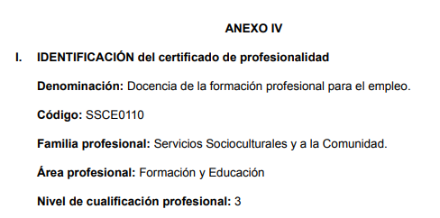

2. **Perfil profesional**  

   - **Competencia general**: describe de forma global qué sabe y puede hacer la persona acreditada.  

   - **Unidades de competencia**: desglosan esa competencia en tareas concretas y verificables.  

   - **Entorno profesional**: detalla los sectores y puestos de trabajo a los que da acceso el certificado.

     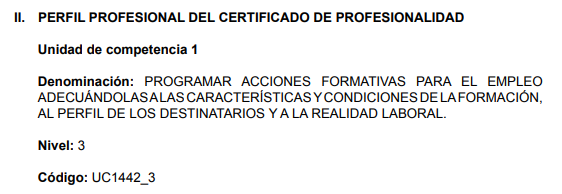

3. **Formación asociada al perfil profesional**: Es el más importante ya que detalla los módulos, las capacidades y los contenidos a impartir.

   - Relación de **módulos formativos (MF)** que corresponden a cada unidad de competencia.

   - Cada MF puede dividirse en **unidades formativas (UF)** más pequeñas, lo que facilita el reconocimiento parcial.  

   - Incluye el **módulo de prácticas profesionales no laborales (MPNL)**, que es obligatorio para obtener el certificado.

   - Incluyen los **criterios de acceso para los alumnos**, para asegurar que puedan seguir los contenidos de la formación (p.e: competencia digital y matemáticas).

     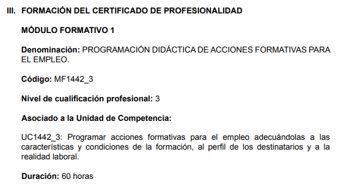

4. **Prescripciones del personal formador**  
   Establece los requisitos mínimos de los docentes: titulación académica, experiencia profesional y, en algunos casos, formación pedagógica específica.  

   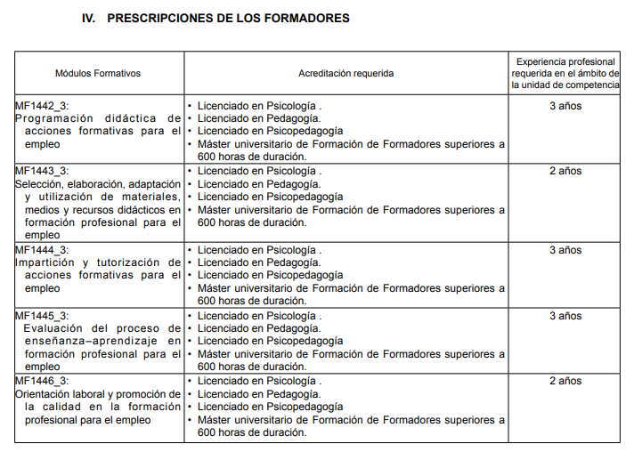

5. **Prescripciones de instalaciones y equipamiento**  
   Define los espacios y recursos necesarios: aulas, talleres, equipos y materiales para garantizar una formación de calidad. 

   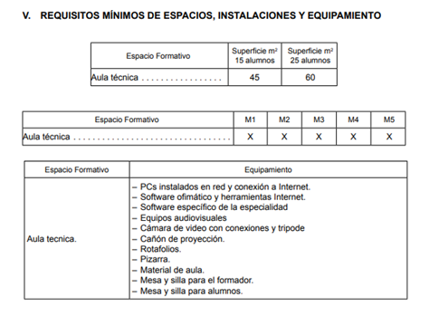

   

### 2.2. Duración
La duración total depende del número de unidades de competencia incluidas. Cada módulo formativo y el módulo de prácticas tienen una duración específica. La suma de todos ellos constituye la carga horaria del certificado.  

### 2.3. Modularidad y acumulación
El sistema es **modular y acumulable**:  
- Superar un módulo da derecho a una acreditación parcial de la unidad de competencia correspondiente.  
- Al completar todas las unidades de competencia, se obtiene el certificado completo.  

### 2.4. Validez
- Los certificados son **títulos oficiales y válidos en todo el Estado**.  
- Se expiden en formato electrónico por el SEPE o las comunidades autónomas.  
- Además, se reconocen en el marco europeo de cualificaciones, lo que favorece la movilidad internacional.

---

## 3. Programación didáctica vinculada a Certificado de profesionalidad

La programación didáctica es el documento en el que el formador organiza la impartición de un certificado de profesionalidad.  
No se trata de inventar el programa desde cero, sino de **adaptar a la práctica docente lo que ya viene regulado en los anexos oficiales** de cada certificado.  

Estos anexos garantizan una estructura común y sirven de guía obligatoria para planificar, impartir y evaluar la formación.  
A continuación, se describen los principales anexos que regulan esta programación.

### 3.1. Anexo III – Planificación didáctica
Este anexo recoge la **planificación global de cada módulo formativo** (y de sus unidades formativas si las hubiera).  

En él se debe indicar:

- **Identificación del módulo**: código, denominación, duración en horas.  
- **Distribución temporal**: fechas de impartición y calendario previsto para cada unidad formativa.  
- **Organización de la teleformación** (si la hubiera): fechas de tutorías presenciales obligatorias y pruebas presenciales.  
- **Módulo de prácticas profesionales no laborales (MPNL)**: periodo aproximado en que se llevará a cabo en las empresas colaboradoras.  

La finalidad de este anexo es tener una **visión global de toda la acción formativa**, de modo que se pueda prever la secuencia de impartición y garantizar que todo el alumnado complete los módulos en el orden y tiempos adecuados.

### 3.2. Anexo IV – Programación didáctica de cada módulo formativo
Aquí se entra en detalle. El anexo IV desarrolla **la programación específica de cada módulo formativo** y, en su caso, de cada unidad formativa.

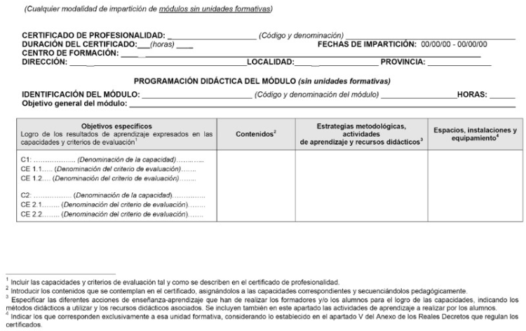

Incluye los siguientes apartados:

- **Capacidades y criterios de evaluación**: qué debe lograr el alumnado y cómo se comprobará.  
- **Contenidos formativos**: conocimientos teóricos, procedimientos prácticos y actitudes profesionales.  
- **Metodología didáctica**: estrategias de enseñanza, actividades, uso de recursos didácticos y TIC.  
- **Temporalización**: horas destinadas a cada parte del módulo.  
- **Requisitos de espacios e instalaciones**: aulas, talleres, equipos, materiales necesarios.  

Tres de estos apartados (capacidades, contenidos y requisitos de espacios) **ya vienen definidos en la normativa del certificado**, por lo que el docente no puede modificarlos.  
El papel del formador consiste en desarrollar los aspectos metodológicos y la planificación de actividades.  

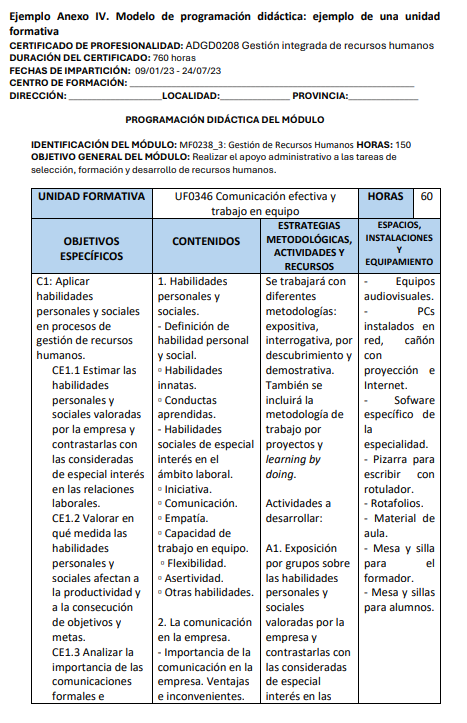

Como referencia práctica, se recomienda incluir **aproximadamente una actividad de aprendizaje por cada cinco horas de formación**, aunque esto puede variar según el módulo y la modalidad de impartición.

También hay que detallar las actividades, sus capacidades y los criterios de evaluación para el alumnado.

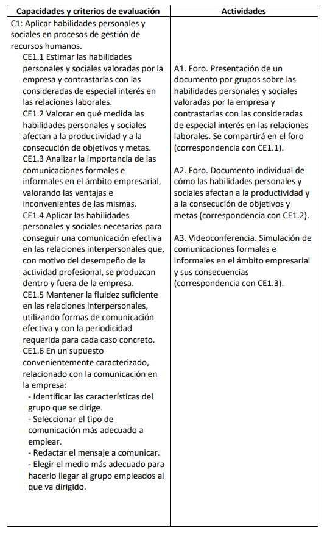

### 3.3. Anexo V – Evaluación del aprendizaje
En este anexo se concreta **cómo se evaluará al alumnado en cada módulo formativo o unidad formativa**.

**Ejemplo:**

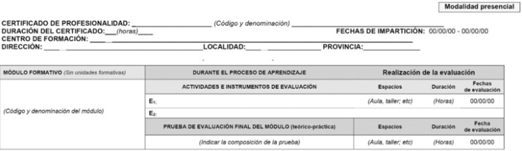

En caso de que existan **unidades formativas**, se deben indicar las **actividades de evaluación** para cada una de ellas.

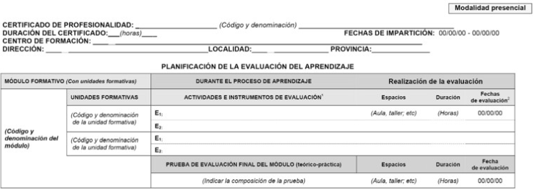

Contempla dos partes:

- **Evaluación durante el proceso de aprendizaje**.
- **Evaluación final del módulo**.

Debe quedar reflejado:

- **Instrumentos de evaluación**: pruebas escritas, ejercicios prácticos, observaciones en el aula o en el taller, simulaciones, etc.  
- **Momentos de evaluación**:  
  - Evaluación inicial (diagnóstico de nivel de partida).  
  - Evaluación formativa (durante el proceso de enseñanza-aprendizaje).  
  - Evaluación final (verifica si se alcanzaron las capacidades y criterios establecidos).  
- **Condiciones de aplicación**: espacio donde se realiza la prueba, duración y fecha prevista.  

En modalidad de teleformación, este anexo especifica también la **evaluación de las tutorías y pruebas presenciales obligatorias**.  

El objetivo es garantizar que la evaluación sea **objetiva, transparente y acorde a lo que marca la normativa del certificado**.

### 3.4. Anexo VIII – Programa formativo del módulo de prácticas profesionales en centros de trabajo
El módulo de prácticas en empresa (MPNL) tiene su propio programa formativo, recogido en el anexo VIII.  

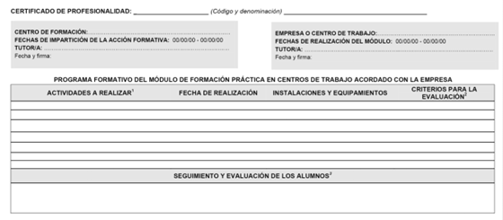

Aquí se describen:

- **Actividades concretas que el alumno debe realizar en la empresa** relacionadas con las unidades de competencia del certificado.  
- **Criterios de seguimiento**: cómo el tutor del centro y el tutor de la empresa van a controlar y apoyar la actividad del alumno.  
- **Criterios de evaluación**: qué indicadores demostrarán que el alumno ha adquirido la competencia en un entorno laboral real.  

Este módulo es obligatorio para obtener el certificado, salvo que el alumno pueda acreditar experiencia profesional suficiente que justifique la exención.  
Su finalidad es **trasladar los aprendizajes del aula al puesto de trabajo real**, garantizando que la formación está conectada con la práctica profesional.

**Ejemplo parcial:**

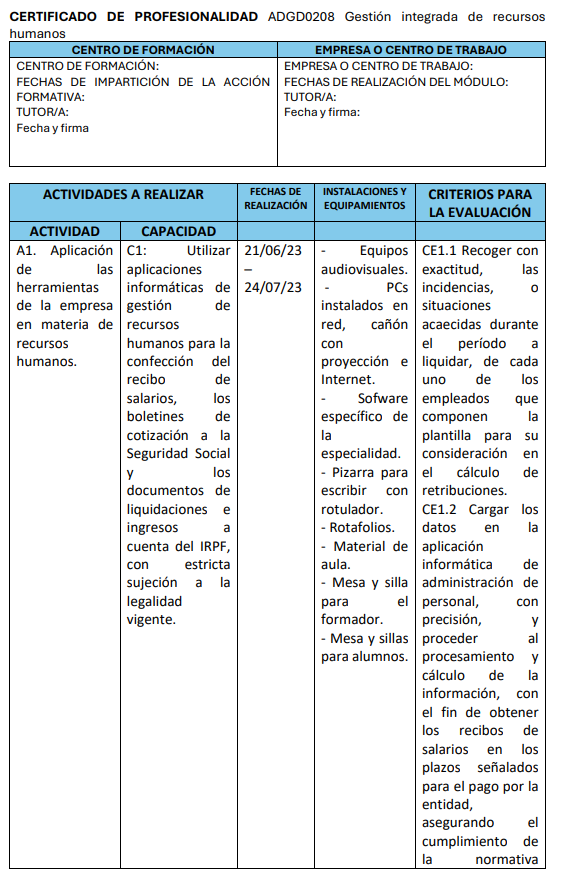

---

## Resumen

- Un **certificado de profesionalidad** es un título oficial que acredita las competencias necesarias para ejercer una profesión.  
- Tienen validez en todo el territorio nacional y están vinculados al **Catálogo Nacional de Cualificaciones Profesionales**, lo que asegura su utilidad en el mercado laboral.  
- Se pueden obtener por dos vías:  
  1. Superando la **formación oficial** (módulos teóricos y prácticas).  
  2. Mediante la **acreditación de competencias** adquiridas por experiencia laboral o formación no formal.  
- La **estructura** de un certificado incluye: datos identificativos, perfil profesional, formación asociada, requisitos del formador y de las instalaciones.  
- El sistema es **modular y acumulable**: cada módulo completado supone un paso hacia la obtención del certificado completo.  
- La **programación didáctica** es la herramienta del docente para adaptar lo que marca el certificado a la realidad del aula, garantizando objetivos, contenidos, actividades, recursos y evaluación coherentes.  

En conjunto, los certificados de profesionalidad constituyen una vía fundamental para reconocer competencias, mejorar la empleabilidad y favorecer la movilidad profesional en España y Europa.

---

# Glosario oficial – Unidad 2

- **Certificado de profesionalidad**: instrumento de acreditación oficial de las cualificaciones profesionales del Catálogo Nacional de Cualificaciones Profesionales en el ámbito de la administración laboral.  
- **Competencia general**: descripción de los cometidos profesionales que deberá cumplir una persona con el certificado, así como el nivel de autonomía y responsabilidad que se requiere.  
- **Unidad de competencia**: agregado mínimo de competencias profesionales susceptibles de reconocimiento y acreditación parcial.  
- **Módulo formativo**: bloque coherente de formación asociado a cada unidad de competencia.  
- **Módulo de prácticas profesionales no laborales**: módulo obligatorio para completar el certificado, destinado a aplicar lo aprendido en un entorno real de trabajo.  
- **Entorno profesional**: sector o sectores en los que la persona cualificada puede ejercer su actividad.  
- **Perfil profesional**: conjunto de competencias que definen el ejercicio profesional de una persona con el certificado.  
- **Programación didáctica**: planificación de la acción formativa que concreta objetivos, contenidos, metodología, actividades, recursos y evaluación.  

---

# Glosario alternativo (versión sencilla)

- **Certificado de profesionalidad**: título oficial que demuestra que una persona está preparada para un trabajo concreto.  
- **Competencia general**: frase que resume qué sabe hacer la persona con ese certificado y qué responsabilidad tiene.  
- **Unidad de competencia**: la pieza mínima en que se divide una cualificación, como una tarea concreta que se puede reconocer oficialmente.  
- **Módulo formativo**: parte de un curso que enseña lo necesario para superar una unidad de competencia.  
- **Módulo de prácticas profesionales no laborales**: prácticas obligatorias en una empresa para poner en práctica lo aprendido.  
- **Entorno profesional**: los sectores y puestos de trabajo en los que se puede trabajar con ese certificado.  
- **Perfil profesional**: la “ficha” que resume qué sabe y puede hacer la persona cualificada.  
- **Programación didáctica**: el plan que prepara el profesor para organizar la formación y que los alumnos alcancen los objetivos.  

# Ejercicios

## MF1442_3: Práctica asociada al CE2.1 (Unidad de aprendizaje 2, Epígrafe 1.4)

### Enunciado

El centro de formación para el que trabajas va a realizar la acción formativa (COMT0112) Actividades de gestión del pequeño comercio. Hay varios candidatos que han llamado para poder participar.

¿Cuál de ellos podría realizarlo y por qué?

- Andrés Gutiérrez Silva tiene 24 años y título de bachiller. Le gusta la informática y quiere abrir un pequeño negocio.
- Jaime Rocamayor Negro tiene 57 años y no tiene titulación académica, pero ha estado trabajando en hostelería durante toda su vida y quiere abrir su propio local.
- Sonia Álvarez Caso tiene 30 años y es licenciada en Derecho. Quiere dejar la abogacía y abrir un local comercial de moda.
- Eva García Moncayola tiene 55 años, no tiene la ESO, pero sí un certificado de profesionalidad de Actividades Auxiliares de comercio.
- Inés Lazcoz Arnau tiene 60 años y dirige una tienda familiar. No tiene estudios, pero conoce el funcionamiento del pequeño comercio.
- Sabela Vals Domínguez tiene el título de ESO y no ha trabajado nunca.

---

### Solución

**Los requisitos de acceso a un certificado de profesionalidad de nivel 2** (como es el COMT0112), según la normativa, se puede acceder si se cumple alguno de estos criterios:

- Tener el título de **ESO** (o equivalente).
- Tener un **certificado de profesionalidad de nivel 1 de la misma familia y área profesional**.
- Haber superado la **prueba de acceso a ciclo formativo de grado medio**.
- Haber superado la **prueba de acceso a la universidad para mayores de 25 años**.
- Tener las **competencias clave necesarias en lengua y matemáticas** (se pueden acreditar o realizar mediante prueba).

Por lo que:

| **Candidato**              | **Datos relevantes**                                         | **Requisitos cumplidos (nivel 2)**                      | **Conclusión**                                               |
| -------------------------- | ------------------------------------------------------------ | ------------------------------------------------------- | ------------------------------------------------------------ |
| **Andrés Gutiérrez Silva** | 24 años, Bachiller, quiere abrir negocio                     | Tiene Bachiller (superior a ESO)                        | **Puede acceder**, cumple requisito académico (nivel superior a ESO). |
| **Jaime Rocamayor Negro**  | 57 años, sin titulación, experiencia en hostelería           | No tiene ESO ni otros títulos; solo experiencia laboral | **No puede acceder directamente**. Necesitaría superar pruebas de competencias clave o una prueba de acceso. |
| **Sonia Álvarez Caso**     | 30 años, Licenciada en Derecho                               | Titulación universitaria                                | **Puede acceder**, su titulación es superior y cumple con los requisitos. |
| **Eva García Moncayola**   | 55 años, sin ESO, con certificado nivel 1 en la misma familia profesional | CP de nivel 1 de Actividades Auxiliares de Comercio     | **Puede acceder**, porque tiene un certificado de nivel 1 de la misma familia profesional. |
| **Inés Lazcoz Arnau**      | 60 años, experiencia dirigiendo comercio familiar, sin estudios | Sin ESO, sin certificado, solo experiencia              | **No puede acceder directamente**. Debería acreditar competencias clave o superar pruebas de acceso. |
| **Sabela Vals Domínguez**  | Título de ESO, sin experiencia laboral                       | Tiene ESO                                               | **Puede acceder**, cumple requisito académico mínimo.        |

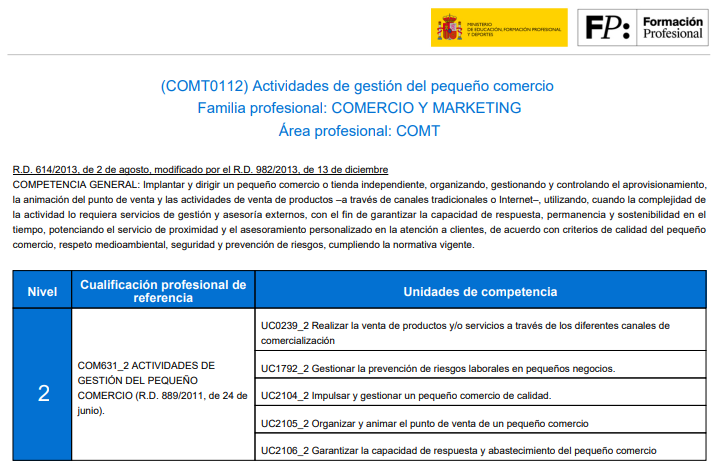

---

## Relaciona cada fase con su descripción

| **Fase**                            | **Descripción**                                              |
| ----------------------------------- | ------------------------------------------------------------ |
| **Fase de tramitación**             | Las administraciones competentes garantizarán un servicio abierto y permanente que facilite información y orientación. |
| **Fase de asesoramiento**           | Se inicia con la publicación de la lista de personas aspirantes admitidas en el procedimiento. |
| **Fase de evaluación**              | Se realizará analizando el informe de la persona asesora y toda la documentación aportada por la persona candidata. |
| **Fase de acreditación y registro** | A las personas candidatas que superen el proceso de evaluación se les expedirá una acreditación de cada una de las unidades de competencia en las que hayan demostrado su competencia profesional. |
| **Fase de formación**               | Todas las personas participantes reciben un plan de formación elaborado por la comisión de evaluación con orientaciones sobre la formación complementaria que deberían cursar para obtener un Título Oficial de Formación Profesional o Certificado de Profesionalidad. |

## Ejercicio completa el texto

En el siguiente texto hay unos desplegables con cantidades. Son los números que están en negrita.

En el caso de los formadores-tutores en la modalidad de teleformación se exige una acreditación de experiencia en la modalidad de teleformación y en la utilización de las tecnologías de la información y comunicación de, al menos, **`60`** horas de impartición en esta modalidad. El número máximo de alumnos por tutor-formador será de **`80`**, cuando su dedicación sea de **`40`**, horas semanales o de las horas semanales equivalentes establecidas en el correspondiente convenio. Para jornadas inferiores, se reducirá proporcionalmente el número máximo de alumnos, de forma que el mínimo de dedicación del personal tutor equivalga a **`10`** horas semanales por cada **`20`** alumnos, incluyendo las tutorías presenciales.

## MF1442_3: Actividad Colaborativa a través de Foro asociada al CE1.5 y CE3.2 (Unidad de aprendizaje 2, Epígrafe 2.7) (Alojamientos rurales)

### Enunciado

Al centro de formación en el que trabajas le han pedido que realice una formación profesional para alojamientos rurales. Necesita identificar el referente profesional (unidades de competencia) y el referente formativo (módulos formativos) del certificado de profesionalidad Alojamiento rural (HOTU0109).

Indica cuáles son las unidades de competencia que componen el referente profesional y cuáles son los módulos formativos que componen el referente formativo.

---

### Solución

- Toda la información extraída del anexo del certificado: https://www.todofp.es/dam/todofp/certificados-profesionales/anexos/hotu0109.pdf
- Se encontró el anexo mediante el buscador de certificados de todofp: https://www.todofp.es/buscadorcertificados/buscador.

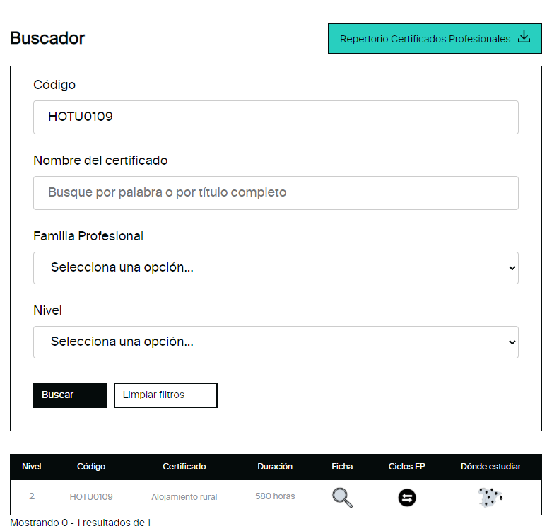

**Relación de unidades de competencia:**

- UC1042_2: Gestionar y comercializar servicios propios del alojamiento rural. 
- UC1043_2: Gestionar y realizar el servicio de recepción en alojamientos propios de entornos rurales y/o naturales. 
- UC1044_2: Preparar y servir desayunos, elaboraciones culinarias sencillas y platos significativos de la zona. 
- UC1045_2: Asegurar el mantenimiento y condiciones de uso de espacios, instalaciones y dotación en alojamientos rurales. 
- UC0711_2: Actuar bajo normas de seguridad, higiene y protección ambiental en hostelería.

**Relación de módulos formativos:** 

- MF1042_2: Gestión y comercialización de alojamientos rurales. (180 horas) 
- MF1043_2: Recepción y atención al cliente en alojamientos propios de entornos rurales y/o naturales. (90 horas) 
- MF1044_2: Restauración en alojamientos ubicados en entornos rurales y/o naturales. (120 horas)
- MF1045_2: Mantenimiento y limpieza en alojamientos rurales. (90 horas) 
- MF0711_2: (Transversal) Seguridad, higiene y protección ambiental en hostelería. (60 horas)
- MP0143: Módulo de prácticas profesionales no laborales de Alojamiento rural. (40 horas)

## MF1442_3 E3. Práctica asociada al CE1.2, CE1.4, CE1.6, CE3.5, CE3.7 y CE3.13 (Unidad de aprendizaje 2, Caso Práctico 2)

Está en carpeta aparte.

`ejercicios\MF1442\MF1442_3 E3 Anexo III Mantenimiento de electrodomésticos`

## 🧑‍🏫Test Unidad 2

1. Con la nueva ley de Formación Profesional, ¿cómo pasarán a llamarse los certificados de profesionalidad?:
   a) Certificados profesionales.  
   b) Acreditación de competencias.  
   c) Grados de formación profesional D.  
   d) Certificados laborales.

2. ¿Con qué se corresponde un módulo formativo?:
   a) Con una realización profesional.  
   b) Con una unidad de competencia.  
   c) Con un criterio de realización.  
   d) Con una unidad didáctica.

3. ¿En cuántas familias se dividen los certificados de profesionalidad?:
   a) 26 familias.  
   b) 16 familias.  
   c) 3 familias.  
   d) 36 familias.

4. El proceso de certificación hace referencia a:
   a) Al proceso directo en el que al cursar una formación oficial asociada a una cualificación profesional se obtenía la misma.  
   b) Al proceso abierto por la Administración Pública para valorar la experiencia laboral y la formación de las personas a fin de identificar si reunían los requisitos de una cualificación profesional.  
   c) Al proceso indirecto en el que al cursar una formación oficial asociada a una cualificación profesional se accede a un proceso de acreditación.  
   d) Al proceso abierto por la Administración Pública para cursar una acción formativa conducente a un certificado de profesionalidad.

5. ¿Con qué fase del proceso de acreditación se corresponde la orientación previa al procedimiento?:
   a) Fase de tramitación.  
   b) Fase de asesoramiento.  
   c) Fase de evaluación.  
   d) Fase de formación.

6. ¿Qué registro se creará con la nueva Ley Orgánica 3/2022 de ordenación e integración de la Formación Profesional?:
   a) Registro Estatal de Acreditaciones de Competencias adquiridas por experiencia laboral y vías no formales.  
   b) Registro Nacional de Acreditaciones de Competencias adquiridas por experiencia laboral y vías no formales.  
   c) Registro Estatal de Certificación de Competencias adquiridas por experiencia laboral y vías no formales.  
   d) Registro Nacional de Certificación de Competencias adquiridas por experiencia laboral y vías no formales.

7. ¿En qué parte de la estructura del certificado de profesionalidad se indica la familia profesional a la que pertenece?:
   a) Perfil profesional/referente ocupacional.  
   b) Formación del certificado/referente formativo.  
   c) Identificación del certificado.  
   d) Requisitos mínimos de espacio, instalaciones y equipamiento.

8. ¿En qué parte de la estructura del certificado de profesionalidad se indican las unidades de competencia y las realizaciones profesionales de referencia?
   a) Identificación del certificado.  
   b) Formación del certificado/referente formativo.  
   c) Prescripciones de los formadores.  
   d) Perfil profesional/referente ocupacional.

9. ¿En qué modalidad se considera que se ha realizado una acción formativa si el 10% ha sido presencial?:
   a) Modalidad presencial.  
   b) Modalidad mixta.  
   c) Modalidad de teleformación.  
   d) Modalidad dual.

10. ¿A qué hace referencia el Anexo III?:
    a) Programación didáctica.  
    b) Planificación didáctica.  
    c) Evaluación del aprendizaje.  
    d) Programa formativo del módulo de formación práctica en centros de trabajo.

---

Respuestas

1. **a** — La LO 3/2022 renombra los certificados de profesionalidad como **certificados profesionales** (Grado C).
2. **b** — Un **módulo formativo** se vincula a una **unidad de competencia** (formación asociada, normalmente 1:1).
3. **a** — Se organizan por **26 familias profesionales**, igual que el catálogo.
4. **a** — La **certificación** es la vía **directa**: superar la **formación oficial** asociada te otorga la credencial.
5. **a** — La **orientación previa** se ubica en la **fase de tramitación** (información/orientación inicial antes del asesoramiento).
6. **a** — Se crea el **Registro Estatal de Acreditaciones de Competencias** adquiridas por experiencia y vías no formales.
7. **c** — La **Identificación del certificado** indica **familia profesional**, área, nivel, código, etc.
8. **d** — El **perfil profesional/referente ocupacional** recoge **UC** y **realizaciones profesionales** de referencia.
9. **c** — Con un **10% presencial**, la acción se considera **teleformación** (predomina la modalidad online).
10. **b** — El **Anexo III** corresponde a la **planificación didáctica** (calendario, temporalización, metodología, evaluación).

