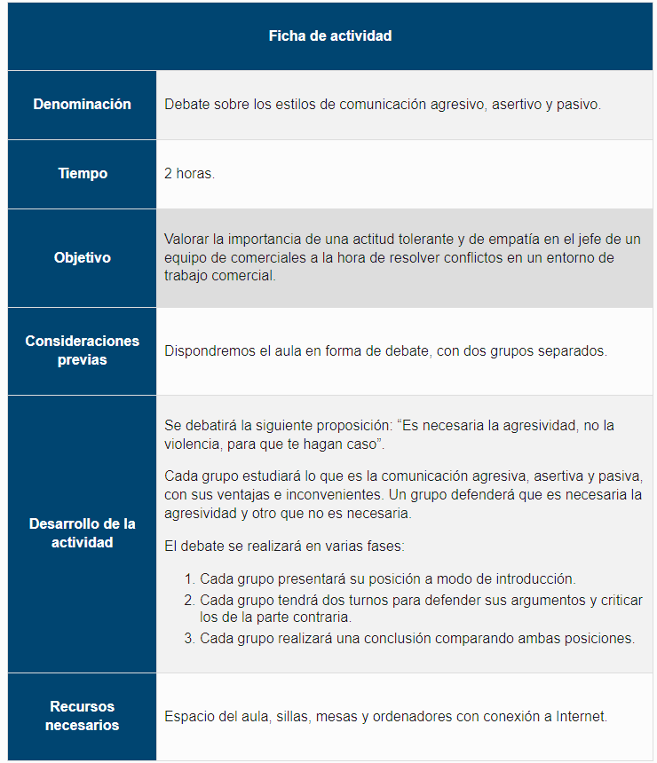
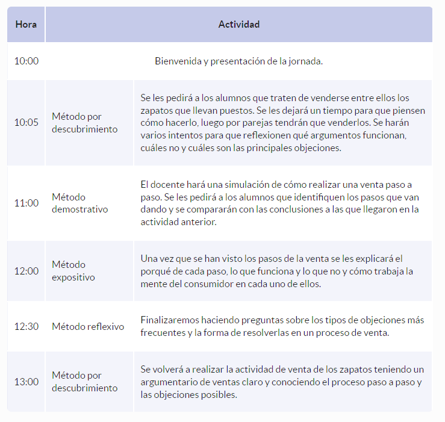
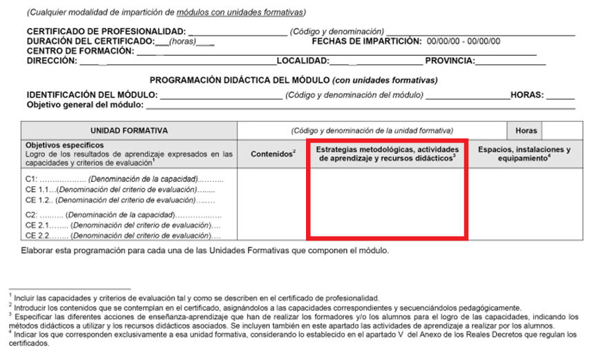
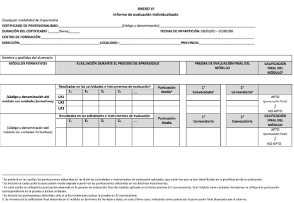
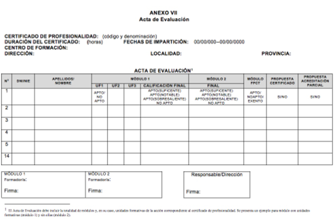

[TOC]

# MF1442 - Unidad 3 - Elaboración de la programación didáctica de una acción formativa en formación para el empleo

## 1. La formación por competencias
La formación profesional actual se basa en el **enfoque por competencias**.  
Esto significa que el objetivo no es solo transmitir conocimientos teóricos, sino asegurar que la persona **sabe aplicar lo aprendido en situaciones reales de trabajo**.

> [!important]
>
> La **competencia profesional** es “el conjunto de conocimientos y destrezas que permiten el ejercicio de la actividad profesional conforme a las exigencias de la producción y el empleo” (Ley Orgánica 3/2022, de 31 de marzo, de ordenación e integración de la Formación Profesional).

### 1.1. Concepto de competencia
Una **competencia** es la combinación de las siguientes **dimensiones**:
- **Conocimientos** (saber).  
- **Habilidades** (saber hacer).  
- **Actitudes** (saber estar).  

Todo ello orientado al **desempeño eficaz de una actividad profesional**.

### 1.2. Competencias profesionales
En el ámbito de la formación para el empleo, las competencias profesionales se definen en el **Catálogo Nacional de Cualificaciones Profesionales (CNCP)**.  
Cada competencia se organiza en **unidades de competencia**, que son las piezas mínimas que se pueden acreditar oficialmente.  

### 1.3. Implicaciones en la formación
Trabajar por competencias supone que:
- Los objetivos de aprendizaje se expresan en términos de **resultados observables** (lo que el alumno es capaz de hacer al final).  
- La enseñanza se organiza en **módulos formativos**, cada uno vinculado a una unidad de competencia.  
- La evaluación no se limita a comprobar conocimientos, sino que valora si el alumno **demuestra las competencias en la práctica**.  

### 1.4. Ventajas del enfoque por competencias
- Conecta directamente la formación con las **necesidades reales del mercado laboral**.  
- Permite una **acreditación oficial y acumulable** (sumando unidades de competencia se llega a un certificado completo).  
- Favorece la **empleabilidad** y la **movilidad profesional**.  

---

## 2. Características generales de la programación de acciones formativas

La **programación didáctica** es el documento que organiza cómo se va a impartir una acción formativa.  
En él se concreta **qué se va a enseñar, cómo, con qué recursos y cómo se evaluará**.  

Su finalidad es **garantizar que la formación se desarrolle de forma ordenada y coherente** con los objetivos y competencias que marca el certificado.

### 2.1. Funciones de la programación
- **Planificar**: anticipar lo que se va a hacer en cada fase del curso.  
- **Coordinar**: servir de guía común para el equipo docente y el centro.  
- **Orientar**: dar al alumnado una idea clara de qué va a aprender y cómo se le evaluará.  
- **Controlar y evaluar**: ser la referencia para revisar el desarrollo del curso y mejorarlo en futuras ediciones.  

### 2.2. Elementos de la programación
Toda programación debe incluir:

- **Nombre de la acción formativa:** denominación para referirse a la acción formativa.
- **Objetivos formativos**: lo que el alumnado debe alcanzar al finalizar la formación. Se identifican con un verbo. Ejemplo: *“Aplicar técnicas de atención al cliente en situaciones de queja o reclamación”*.
- **Contenidos**: conocimientos, habilidades y actitudes que se van a trabajar.  
- **Secuenciación**: orden en que se impartirán los contenidos.  
- **Metodología**: estrategias didácticas que se van a emplear.  
- **Actividades**: propuestas prácticas para aplicar lo aprendido.  
- **Recursos pedagógicos**: materiales, herramientas, espacios y equipos necesarios.  
- **Evaluación**: criterios, instrumentos y momentos para comprobar el aprendizaje.  

### 2.3. Importancia de la programación
- Evita la improvisación.  
- Garantiza que se cumplen los **estándares de calidad y normativa oficial**.  
- Permite ajustar el curso a las características del alumnado, sin perder de vista los resultados obligatorios que se deben alcanzar.  

> [!tip]
>
> **Resumen:** La programación es la **hoja de ruta del formador**: un plan organizado que asegura la coherencia entre los objetivos, los contenidos, la metodología y la evaluación.

---

## 3. Los objetivos

Los **objetivos** son las metas que se persiguen con una acción formativa.  
Indican **qué debe lograr el alumnado al finalizar** el proceso de enseñanza-aprendizaje.

### 3.1. Función de los objetivos
- Orientan el trabajo del formador y del alumnado.  
- Sirven como referencia para **seleccionar contenidos, actividades y metodología**.  
- Permiten diseñar los **criterios de evaluación** que comprobarán si se alcanzaron los resultados previstos.  

### 3.2. Tipos de objetivos
Se distinguen varios niveles:

1. **Objetivos generales**  
   - Son amplios y globales.  
   - Describen lo que se espera del alumnado al terminar el curso completo.  
   - Ejemplo: *“Gestionar un pequeño comercio aplicando técnicas de organización, venta y atención al cliente”*.  

2. **Objetivos específicos**  
   - Derivan de los generales y son más concretos.  
   - Se centran en resultados parciales que el alumnado debe ir alcanzando.  
   - Ejemplo: *“Aplicar técnicas de atención al cliente en situaciones de queja o reclamación”*.  

3. **Objetivos operativos**  
   - Son los más detallados y medibles.  
   - Expresan conductas observables, utilizando verbos de acción (analizar, aplicar, diseñar, elaborar…).  
   - Ejemplo: *“El alumno será capaz de elaborar un inventario de existencias en el comercio utilizando una hoja de cálculo”*.  

### 3.3. Recomendaciones para formular objetivos
- Usar **verbos de acción claros** y observables.  
- Redactar frases sencillas, evitando expresiones vagas como “comprender” o “aprender”.  
- Asegurar que sean **realistas y alcanzables** en el tiempo y duración del curso.  
- Establecerlos de forma que sean **evaluables**, es decir, que se pueda comprobar si se lograron o no.  

> [!important]
>
> Un objetivo debe ser capaz de responder lo siguiente:
>
> - **¿Quién?** → la persona o el rol que lo llevará a cabo.
>    *Ejemplo: el **responsable de ventas**, el **equipo de marketing**, el **director de formación**.*
> - **¿Qué hace?** → debe empezar con un **verbo de acción**.
>    *Ejemplo: **elaborar**, **investigar**, **programar**, **ordenar**, **diseñar**, **evaluar**.*
> - **¿Sobre qué?** → el objeto de la acción.
>    *Ejemplo: elaborar un **informe de ventas**, programar un **curso online**, investigar la **satisfacción de los clientes**.*
> - **¿Cómo?** → las condiciones en que se realizará la acción.
>    *Ejemplo: elaborar el informe de ventas **siguiendo el modelo oficial**, impartir el curso online **usando la plataforma Moodle**, investigar la satisfacción de los clientes **mediante encuestas anónimas**.*
> - **¿Cuánto?** → el resultado mínimo esperado (cantidad, calidad, tiempo).
>    *Ejemplo: elaborar un informe de ventas **mensual**, programar un curso online **de al menos 20 horas**, investigar la satisfacción de los clientes con **un mínimo de 100 encuestas válidas**.*

> [!tip]
>
> **Resumen:** Los objetivos marcan el **rumbo de la programación didáctica** y deben estar alineados con las competencias profesionales que se pretenden desarrollar.

---

## 4. Los contenidos formativos

Los **contenidos** son el conjunto de saberes, destrezas y actitudes que el alumnado debe adquirir para alcanzar los objetivos de la acción formativa.  
Constituyen la materia prima de la enseñanza y están directamente vinculados a las **competencias profesionales** del certificado.

### 4.1. Tipos de contenidos
Se clasifican en tres grandes categorías (llamadas dimensiones):

1. **Conceptuales (saber)**  
   - Son los conocimientos teóricos.  
   - Incluyen hechos, datos, principios, normas, conceptos y sistemas que el alumno debe conocer.  
   - Ejemplo: *“Concepto de marketing, normativa sobre prevención de riesgos laborales”*.  

2. **Procedimentales (saber hacer)**  
   - Son las habilidades prácticas que se aplican en la resolución de tareas.  
   - Se aprenden a través de la acción y la práctica.  
   - Ejemplo: *“Manejar una herramienta informática de gestión de stock”*.  

3. **Actitudinales (saber estar)**  
   - Son las actitudes y valores relacionados con la conducta profesional.  
   - Incluyen responsabilidad, puntualidad, trabajo en equipo, trato al cliente, etc.  
   - Ejemplo: *“Mantener una actitud positiva frente a las quejas de los clientes”*.  

### 4.2. Selección de contenidos
Para elegir qué contenidos incluir en la programación se deben considerar:
- Los **objetivos de aprendizaje** fijados en el certificado.  
- La **duración del curso**, ajustando el nivel de profundidad.  
- Las **necesidades del alumnado** y su nivel de partida.  
- La **aplicación práctica en el entorno laboral**.  

### 4.3. Características de los contenidos
- Deben ser **relevantes**: útiles para el desempeño profesional.  
- **Actualizados**: acordes a la normativa y a la realidad tecnológica del sector.  
- **Organizados**: estructurados de forma lógica y progresiva.  
- **Adecuados al nivel**: ni demasiado básicos ni excesivamente avanzados para el grupo.  

### 4.4. Relación con los objetivos
Los contenidos se seleccionan y organizan en función de los objetivos planteados:  
- Los contenidos **conceptuales** respaldan los objetivos generales.  
- Los **procedimentales** permiten cumplir los objetivos específicos.  
- Los **actitudinales** refuerzan la profesionalidad y la empleabilidad del alumnado.  

> [!tip]
>
> **Resumen:** Los contenidos formativos son la **base sobre la que se construye la enseñanza**, y deben estar siempre en coherencia con los objetivos y competencias que se pretenden desarrollar.

---

## 5. Secuenciación

Los contenidos de las acciones formativas deben estar **actualizados y ser aplicables** en el ámbito laboral. Una vez definidos, es necesario **ordenarlos y secuenciarlos** de forma que favorezcan un aprendizaje progresivo y adaptado al alumnado.

### 5.1. Actualización y aplicabilidad
- Los contenidos se basan en el **Catálogo Nacional de Cualificaciones Profesionales (CNCP)** mientras se implantan los nuevos catálogos previstos por la Ley 3/2022.  
- La formación por competencias busca que lo aprendido sea **útil en contextos profesionales reales**, combinando conocimientos, habilidades y actitudes.  
- Esto implica que los contenidos deben servir para **resolver situaciones de trabajo**, movilizando recursos de manera eficaz.

### 5.2. Secuenciación de contenidos
- Los contenidos se organizan en **bloques numerados**, que agrupan los elementos de aprendizaje que se trabajarán en cada parte del curso.  
- Este orden facilita el aprendizaje progresivo y evita saltos o repeticiones innecesarias.  
- La secuencia debe mostrar claramente la **relación entre teoría y práctica**, de manera que los conocimientos se apliquen a lo largo del proceso.

### 5.3. Particularidades en la modalidad de teleformación
En la teleformación, además de ordenar los contenidos, se deben tener en cuenta aspectos específicos:
- La **duración de la formación** se calcula como la media de los tiempos de estudio y de realización de actividades.  
- El aprendizaje se mide por el **tiempo de lectura de pantallas**, el trabajo en las actividades propuestas y la **participación en la plataforma virtual** (foros, tutorías, comunicaciones).  
- Es necesario garantizar un **equilibrio entre la parte teórica y la práctica**, programando actividades que permitan comprobar que el alumnado desarrolla las competencias, aunque trabaje a distancia.  
- Se deben prever los **momentos presenciales obligatorios** (tutorías y pruebas de evaluación), que forman parte de la secuencia global del curso.  

> [!tip]
>
> **Resumen:** la secuenciación organiza los contenidos para que el alumnado avance de manera coherente, asegurando que lo aprendido sea aplicable en el entorno laboral y que, en cualquier modalidad —presencial o teleformación—, se logren las competencias profesionales previstas.

---

## 6. Las actividades

Las actividades son las tareas que realiza el alumnado para favorecer el aprendizaje y comprobar que se alcanzan los objetivos de la acción formativa.  
Son esenciales en la programación didáctica y deben planificarse de manera coherente con los contenidos y la metodología.

### 6.1. Relación de actividades
En la formación se pueden emplear distintos tipos de actividades, entre ellas:  
- 🎤 **Exposición magistral**: explicación detallada del formador, base teórica de un tema.  
- 🗣️ **Exposición**: presentación breve de un contenido, por el docente o el alumnado.  
- 📽️ **Visionado de vídeos**: material audiovisual para ilustrar conceptos o ejemplos prácticos.  
- 🤝 **Puesta en común**: compartir ideas o conclusiones tras una actividad.  
- 💡 **Brainstorming (lluvia de ideas)**: generar propuestas creativas en poco tiempo.  
- 🧭 **Discusión guiada**: intercambio de opiniones moderado por el formador.  
- ⚖️ **Debate**: confrontación de posturas a favor y en contra de un tema.  
- 🎭 **Simulación**: recreación de situaciones reales en un entorno controlado.  
- 👥 **Role playing**: representación de papeles en una situación ficticia.  
- 📑 **Estudio de casos**: análisis detallado de una situación real o ficticia.  
- 👩‍👩‍👧‍👦 **Trabajo por grupos**: equipos que desarrollan tareas conjuntas (ej.: técnica Phillips 6/6).  
- 📝 **Resolución de problemas individuales**: aplicación de lo aprendido a un caso concreto.  

### 6.2. Tipología
Las actividades pueden clasificarse en varias categorías:  

- 📘 **Actividades de aprendizaje**  
  - 🔎 **De introducción o diagnósticas**: para conocer nivel inicial e intereses del alumnado.  
  - 📚 **De desarrollo**: explicaciones, prácticas, debates o simulaciones.  
  - 🏁 **De cierre**: sirven para estructurar y dar sentido global a lo aprendido.  

- 🔄 **Actividades de repetición y refuerzo**  
  - Consolidar lo aprendido y reforzar los contenidos más difíciles.  

- ✅ **Actividades de evaluación**  
  - Comprobar si se alcanzaron los objetivos y detectar avances o dificultades.  

### Ejemplos de actividades en una formación de Lenguaje HTML

- 📘 **Actividad de aprendizaje – introducción**  
  👉 El alumnado responde a un cuestionario inicial sobre conocimientos básicos de páginas web y etiquetas HTML.  

- 📚 **Actividad de aprendizaje – desarrollo**  
  👉 Los alumnos crean una página simple con título, párrafo y una imagen utilizando etiquetas `<h1>`, `
` y ``.  

- 🏁 **Actividad de aprendizaje – cierre**  
  👉 Debate en grupo sobre cómo organizar el código para que sea más legible y accesible, con puesta en común de buenas prácticas.  

- 🔄 **Actividad de repetición y refuerzo**  
  👉 Ejercicio extra: añadir listas ordenadas y no ordenadas (`<ol>` y `<ul>`) a la página creada, practicando hasta que todos lo dominen.  

- ✅ **Actividad de evaluación**  
  👉 Práctica final: cada alumno diseña una página personal con al menos un encabezado, un párrafo, una lista, un enlace y una imagen. Se evalúa si se aplican correctamente las etiquetas básicas.

### 6.3. Estructura
Cada actividad debe describirse en la programación con los siguientes elementos:  
- 🎯 **Objetivo** de la actividad.  
- 📖 **Contenidos** asociados.  
- 🛠️ **Recursos y materiales** necesarios.  
- ⏱️ **Duración** o temporalización.  
- 👥 **Organización**: individual, en parejas o grupos.  
- ✅ **Criterios de evaluación** relacionados.  

**Ejemplo:**

### 6.4. Criterios de redacción
Para que una actividad quede bien planteada es importante:  
- ✍️ Usar un lenguaje claro y sencillo.  
- 🎯 Formular objetivos en términos de acciones observables.  
- 🛠️ Detallar materiales y recursos necesarios.  
- ⏱️ Indicar duración y condiciones de realización.  
- 🔗 Mantener coherencia con los objetivos y contenidos de la acción formativa.  

### 6.5. Relación con los contenidos
Toda actividad debe estar vinculada a los **contenidos del programa**.  
Esto garantiza que no existan tareas aisladas, sino que cada actividad contribuya a la adquisición de las competencias profesionales previstas.  

**Ejemplo:**

- 🎯 **Objetivo**  
  El alumnado será capaz de **crear una página web sencilla** utilizando etiquetas básicas de HTML para estructurar texto, imágenes y enlaces.  

- 📖 **Contenidos**  
  - Concepto de etiqueta y estructura básica de un documento HTML.  
  - Etiquetas de texto: `<h1>`, `<h2>`, `
`.  
  - Inserción de imágenes: ``.  
  - Creación de enlaces: `<a>`.  

- 📝 **Actividades posibles**  
  - Realizar una **exposición magistral** sobre la estructura de un documento HTML (`<html>`, `<head>`, `<body>`).  
  - Proyectar un **vídeo explicativo** sobre el uso de etiquetas de texto e imágenes.  
  - Ejercicio práctico: los alumnos crean una **página simple** con un encabezado, un párrafo, una imagen y un enlace.  
  - **Puesta en común** de los trabajos para comentar errores y buenas prácticas.  
  - **Actividad de refuerzo**: añadir una segunda página enlazada a la primera mediante `<a>`.  

### 6.6. Dinámicas de trabajo en equipo

> [!important]
>
> **Definición:** La dinámica de grupos es la interpretación de las relaciones entre los miembros del grupo.

Las dinámicas de grupo son actividades diseñadas para:  
- 🤝 Mejorar la cohesión y comunicación del grupo.  
- 👩‍👩‍👧‍👦 Fomentar la colaboración y el aprendizaje cooperativo.  
- 🌱 Desarrollar actitudes como empatía, confianza y responsabilidad compartida.  

**Ejemplos de dinámicas:**  

- 🙋‍♂️ Presentaciones y juegos de conocimiento.  
- 🎲 Juegos de cooperación.  
- 🎭 Ejercicios de roles.  
- 🧩 Resolución conjunta de problemas.  

> [!note]  
> Existen dos marcos teóricos clásicos:  
>
> - 📈 **Fases de Tuckman**: los equipos pasan por etapas de evolución —*Formación*, *Conflicto*, *Normalización*, *Desempeño* y *Disolución* (en inglés *Forming, Storming, Norming y Performing*)—. Cada fase implica necesidades y dinámicas distintas.  
> - 👥 **Roles de Belbin**: dentro de un equipo, cada persona suele asumir un rol característico (ej.: *coordinador, implementador, investigador de recursos, creativo, evaluador, cohesionador, finalizador, especialista*). Reconocerlos ayuda a equilibrar el trabajo en grupo y aprovechar mejor el potencial de cada miembro.  
>
> Estos modelos permiten diseñar actividades y dinámicas que favorezcan la cohesión y el rendimiento de los equipos en la formación.

> [!tip]
>
> **Resumen:** Las actividades son la **herramienta práctica** que convierte los contenidos en competencias profesionales reales.

---

## 7. Metodología

La metodología es el conjunto de estrategias y procedimientos que se aplican para organizar la enseñanza y facilitar el aprendizaje.  

> [!important]
>
> **Definición:** La metodología es el conjunto de mecanismos o procedimientos racionales, empleados para el logro de un objetivo.

Existen diferentes formas de aplicar la metodología, que se recogen en los siguientes apartados.

### 7.1. Tipos de metodología

- 📖 **Método expositivo**: el formador transmite los contenidos de manera oral y estructurada.  
  👉 *Ejemplo: el docente explica los elementos básicos de una página web en una clase teórica.*  

- 🛠️ **Método demostrativo**: el docente muestra cómo se realiza una tarea o procedimiento, y el alumnado lo reproduce.  
  👉 *Ejemplo: el formador enseña paso a paso cómo insertar una tabla en Word y luego los alumnos lo hacen en sus ordenadores.*  

- ❓ **Método interrogativo**: se basa en preguntas para estimular la participación, la reflexión y comprobar la comprensión.  
  👉 *Ejemplo: el profesor plantea preguntas sobre qué etiquetas HTML sirven para dar formato al texto, y los alumnos responden.*  

- 🔎 **Método por descubrimiento**: el alumnado llega a conclusiones a través de la investigación y la práctica, con orientación del formador.  
  👉 *Ejemplo: los alumnos reciben fragmentos de código HTML y deben deducir para qué sirve cada etiqueta, comentándolo después en grupo.*  

### 7.2. Técnicas didácticas

Cada método puede desarrollarse a través de diferentes técnicas que facilitan el aprendizaje.  

**🛠️ Método demostrativo**

- 🎭 **Simulación por parte del docente**: el formador reproduce cómo se realiza una tarea paso a paso para que el alumnado observe.  
- 📽️ **Vídeo práctico**: se proyecta un material audiovisual en el que se muestra el procedimiento a seguir.  
- 📘 **Tutorial**: guía escrita o en formato digital que detalla cómo ejecutar una actividad o manejar una herramienta.   

**❓ Método interrogativo**

- ❓ **Preguntas para generar conocimiento**: el docente plantea cuestiones que guían al alumno hacia el descubrimiento de la respuesta.  
- 🤝 **Puesta en común**: compartir opiniones y conclusiones con el resto del grupo.  
- 💡 **Lluvia de ideas**: generar un gran número de propuestas en poco tiempo sobre un tema concreto.  
- 🧭 **Debate guiado**: intercambio de opiniones en el que el docente modera y orienta la discusión.  

**🔎 Método por descubrimiento**

- 🎭 **Simulación por parte del alumnado**: los estudiantes recrean la actividad para aprender por ensayo y error.  
- 👥 **Role playing**: los alumnos asumen diferentes roles en una situación ficticia para experimentar distintas perspectivas.  
- 🗣️ **Exposición por parte del alumnado**: cada estudiante explica sus conclusiones o aprendizajes al grupo.  
- 📝 **Actividades prácticas**: ejercicios diseñados para que el alumnado descubra los contenidos por sí mismo.  
- 🤝 **Técnicas de grupo**: dinámicas cooperativas que fomentan la reflexión y el intercambio de ideas. 

Por ejemplo, en una sesión que se desarrolla de 10:00 a 14:00 sobre argumentarios de  venta, podríamos tener el siguiente guion:

> [!important]
>
> No hay un único modelo o esquema que sirva para todo el mundo. Podemos combinar distintos métodos y en el orden que mejor se ajuste. La elección dependerá de nuestras habilidades y preferencias como docentes.

### 7.3. Modalidad de teleformación
En la modalidad de teleformación, la metodología debe adaptarse al entorno virtual, garantizando el mismo nivel de competencias que en la formación presencial.  
Para ello se tienen en cuenta:  
- 💻 La utilización de una plataforma de teleformación como espacio de aprendizaje.  
- 📚 Materiales preparados para el autoestudio.  
- 🤝 Participación en actividades online y comunicación con el tutor.  
- 📝 Realización de actividades y pruebas a través de la plataforma.  
- 👨‍🏫 Seguimiento y orientación del tutor-formador.  
- 🏁 Tutorías y pruebas presenciales obligatorias que complementan la formación.  

> **Resumen:** La metodología debe ser **activa, participativa y práctica**, garantizando que el alumnado adquiera no solo conocimientos, sino también habilidades y actitudes aplicables en el mundo laboral.

---

## 8. Características metodológicas de las modalidades de impartición de los certificados de profesionalidad

Son un apartado del Anexo IV y tienen que ser apropiadas a la formación, que puede ser presencial, teleformación o mixta.

En este apartado debemos de señalar tanto los tipos de metodologías que vamos a emplear (explicativo, demostrativo, por descubrimiento e interrogativo), como las actividades concretas que vamos a desarrollar.

---

## 9. Recursos pedagógicos

Ya sabemos **qué queremos conseguir** (objetivos), **qué debemos aprender** (contenidos) y **cómo lo haremos** (metodología y actividades). Ahora toca ver **con qué recursos contamos** para desarrollar la formación.  

> [!important]
>
> **Definición**: Los recursos son el conjunto de elementos necesarios para realizar una determinada actividad.

Siguiendo el guion que presentábamos anteriormente, tendríamos que ver qué necesitamos para cada actividad:

| Hora  | Actividad                                | Recursos                                                     |                                                              |
| ----- | ---------------------------------------- | ------------------------------------------------------------ | ------------------------------------------------------------ |
| 10:00 | Bienvenida y presentación de la jornada. | -                                                            |                                                              |
| 10:05 | Método por descubrimiento                | Se les pedirá a los alumnos que traten de venderse entre ellos los zapatos que llevan puestos. | Papel o dispositivo informático para apuntar lo que les funciona y lo que no. |
| 11:00 | Método demostrativo                      | El docente hará una simulación de cómo realizar una venta paso a paso. | Pizarra digital u ordenador con proyector.Presentación o esquema del protocolo de venta. |
| 12:00 | Método expositivo                        | Una vez que se han visto los pasos de la venta se les explicará el porqué de cada paso, lo que funciona y lo que no y cómo trabaja la mente del consumidor en cada uno de ellos. | Pizarra digital u ordenador con proyector.Presentación sobre el proceso de venta y la mente de los consumidores. |
| 12:30 | Método reflexivo                         | Finalizaremos haciendo preguntas sobre los tipos de objeciones más frecuentes y la forma de resolverlas en un proceso de venta. | Pizarra digital, pizarra blanca o rotafolios para apuntar respuestas. |
| 13:00 | Método por descubrimiento                | Se volverá a realizar la actividad de venta de los zapatos teniendo un argumentario de ventas claro y conociendo el proceso paso a paso y las objeciones posibles. | Papel o dispositivo informático para apuntar lo que les funciona y lo que no. |

### 9.1 Relación de recursos
Un recurso pedagógico puede ser cualquier instrumento u objeto que facilite el aprendizaje o permita el desarrollo de una función formativa.  
En los certificados de profesionalidad se marcan unos mínimos, a los que cada docente puede añadir lo que considere necesario.

**Tipos principales:**
1. 🏫 **Espacio**  
2. 🏢 **Instalaciones**  
3. 💻 **Equipamiento**  
4. 📚 **Bibliografía**  
5. 📑 **Anexos**  

### 9.2 Instalaciones, espacios y equipamiento
Los requisitos de espacios y equipamientos deben cumplir normas de **accesibilidad** y **seguridad**.  
Se diferencian dos tipos de materiales:

- **Material didáctico**: apoyo al aprendizaje (libros, presentaciones, dosieres, etc.).
- **Material de consumo**: se gasta durante la actividad (papel, cartón, yeso, etc.).

### 9.3 Bibliografía y referencias
Cada módulo debe incluir las referencias usadas para elaborar los contenidos.  
Se recomienda presentarlas en orden alfabético y siguiendo las **normas APA**.  

Ejemplos:
- **Libros**: APELLIDO, Inicial. *Título*. Editorial, año.  
- **Artículos**: APELLIDO, Inicial. “Título del artículo”. *Nombre de la revista*. Año, número, páginas.  
- **Webs**: AUTOR/Organismo. *Título*. Recuperado de: dirección web.  
- **Legislación**: Nombre de la norma, publicación oficial, fecha, número y páginas.

### 9.4 Anexos
Son documentos complementarios al contenido del curso: fichas de trabajo, informes o glosarios.  

> [!tip]
>
> **Resumen:** Los recursos pedagógicos son el *“con qué”* de la formación. Sin ellos, los objetivos, contenidos y metodologías quedarían incompletos.

---

## 10. Criterios de evaluación

Ya sabemos los **objetivos**, **contenidos**, **actividades**, **metodología** y **recursos**. Ahora necesitamos comprobar si realmente se han logrado: eso es la **evaluación**.

> [!important]
>
> **Definición**: Evaluar es atribuir o determinar el valor de un conocimiento o de un desempeño teniendo en cuenta diversos criterios.

### 10.1 Tipos de criterios
Los criterios de evaluación se relacionan con las tres dimensiones del aprendizaje:

- 📘 **Teóricos (saber)** → validan conocimientos conceptuales.  
- 🛠️ **Prácticos (hacer)** → validan destrezas y procedimientos.  
- 🤝 **Profesionalizadores (comportarse)** → validan actitudes y conductas en el entorno laboral.  

Se reconocen fácilmente por el verbo que usan:
- *Identificar, describir, analizar* → teóricos.  
- *Simular, determinar* → prácticos.  
- *Valorar* → profesionalizadores.  

### 10.2 Momentos de la evaluación
Se diferencian **evaluación** (validación) y **calificación** (nota):

- 📝 **Evaluación inicial** → antes de empezar, para conocer conocimientos previos.  
- 🔄 **Evaluación continua** → durante el curso, refuerzo y seguimiento.  
- 🎯 **Evaluación final** → al terminar el módulo, comprobando todas las capacidades.

> [!note]
>
> Para las evaluaciones finales existen los siguientes requisitos:
>
> - En la **modalidad presencial** es obligatoria una asistencia de al menos el 75% de las horas totales del módulo.
> - En la **modalidad de teleformación** es obligatorio haber realizado todas las actividades de aprendizaje establecidas para dicho módulo.

📊 La calificación es la puntuación formal y hay dos momentos:  

- Evaluación continua = **30%** de la nota final.  
- Evaluación final = **70%** de la nota final.  

### 10.3 Instrumentos de evaluación
Según el tipo de objetivo, se usan distintos instrumentos:

- **Teóricos** → cuestionarios, preguntas de desarrollo, exposiciones.  
- **Prácticos** → ejercicios, actividades, simulaciones.  
- **Profesionalizadores** → observación de comportamientos en prácticas.  

🔍 Cada instrumento debe ser **objetivo, válido y fiable**, con criterios de corrección definidos de antemano.

### 10.4 Actas y documentos
El proceso de evaluación debe quedar documentado oficialmente:

- 📄 **Anexo VI** → Informe de evaluación individualizado (puntuaciones y correcciones de cada alumno).

  

- 📄 **Anexo VII** → Acta de evaluación (resultados finales: “apto” o “no apto”).  

  

Escalas de calificación:
- **Apto (Suficiente)** → 5,0 a 6,9.  
- **Apto (Notable)** → 7,0 a 8,9.  
- **Apto (Sobresaliente)** → 9,0 a 10.  
- **No apto** → menos de 5.  

### 10.5 Requisitos de superación
- En **presencial**: mínimo 75% de asistencia.  
- En **teleformación**: completar todas las actividades de la plataforma.  
- La prueba final de cada módulo siempre es **presencial**, sea cual sea la modalidad.

👉 **Idea clave**: La evaluación valida si se han alcanzado los **objetivos operativos**, y por extensión, los específicos y generales. No basta con intuir: hay que medir con criterios claros y documentados ✅.

> [!tip]
>
> **Resumen:** Los criterios de evaluación son la **regla de medida** que asegura que la valoración del aprendizaje sea justa, coherente y centrada en las competencias profesionales.

---

### 10.6 Documentación

El centro que imparte un **certificado de profesionalidad** debe conservar y entregar toda la documentación relacionada con la evaluación.  

**Documentos obligatorios:**
1. 📑 **Planificación de la evaluación** (cómo, cuándo y con qué instrumentos se evaluará).  
2. 📝 **Instrumentos de evaluación** utilizados, junto con los criterios de corrección y puntuación.  
3. 📄 **Informe de evaluación individualizado** (Anexo VI).  
4. 📄 **Actas de evaluación** (Anexo VII).  

📌 Plazo: el centro debe entregar estas actas y documentos a la **Administración competente** en un máximo de **3 meses** desde la finalización del módulo.  

⚖️ Esta documentación es la base para que la Administración expida los **certificados de profesionalidad** o las **acreditaciones parciales acumulables** que correspondan.

---

## 11. Observaciones para la revisión, actualización y mejora de la programación

Una vez elaborada la **programación didáctica**, no debe quedarse estática. Es necesario **revisarla, actualizarla y mejorarla** periódicamente para garantizar su calidad y adaptación a la realidad laboral y educativa.

👉 La idea es plantearse preguntas críticas sobre cada elemento de la programación:

### Elementos a revisar

- 🎯 **Objetivos**  
  - ¿Son concretos?  
  - ¿Son medibles y alcanzables?  

- 📚 **Contenidos**  
  - ¿Han cambiado conceptos importantes?  
  - ¿Existen nuevos procedimientos?  
  - ¿Se requieren nuevas actitudes en el mundo laboral?  

- 🧑‍🏫 **Metodología**  
  - ¿Se están combinando bien los diferentes métodos?  
  - ¿Hay nuevas metodologías que puedan incorporarse?  

- 📝 **Actividades**  
  - ¿Conducen realmente al aprendizaje?  
  - ¿Se podrían añadir nuevas actividades más efectivas?  

- 🛠️ **Recursos**  
  - ¿Son suficientes y están disponibles?  
  - ¿Existen recursos nuevos que convenga utilizar?  

- ✅ **Evaluación**  
  - ¿Es válida y fiable?  
  - ¿Permite valorar de forma efectiva el aprendizaje?  
  - ¿Hay otras formas de evaluar que sean más convenientes?  

> [!tip]
>
> 👉 **Idea clave**: La revisión continua de la programación asegura que los cursos no se queden obsoletos, se adapten a cambios en el sector laboral y mantengan una metodología moderna y eficaz.

---

## Resumen
- La formación profesional actual se basa en el **enfoque por competencias**, que combina saber, saber hacer y saber estar.  
- La **programación didáctica** es la herramienta que organiza la acción formativa: fija objetivos, contenidos, actividades, metodología, recursos y criterios de evaluación.  
- Los **objetivos** pueden ser generales, específicos u operativos, y guían todo el proceso.  
- Los **contenidos** se dividen en conceptuales, procedimentales y actitudinales, y deben estar actualizados, organizados y adaptados al alumnado.  
- La **secuenciación** asegura que los contenidos se imparten en un orden lógico y progresivo.  
- Las **actividades** convierten los contenidos en experiencias de aprendizaje reales, fomentando la participación y la práctica.  
- La **metodología** debe ser activa, participativa y adaptada al grupo, utilizando diferentes estrategias (exposición, casos, proyectos, TIC…).  
- Según la modalidad (presencial, teleformación o mixta), se aplican características metodológicas específicas.  
- Los **recursos pedagógicos** incluyen materiales, TIC, espacios, equipamiento y el propio formador.  
- Los **criterios de evaluación** determinan qué debe demostrar el alumnado y cómo se valorará su progreso.  
- La programación debe revisarse y actualizarse continuamente para mantener su calidad y vigencia.  

---

## Glosario oficial

- **Competencia**: conjunto de conocimientos, habilidades y actitudes que permiten desempeñar una actividad profesional.  
- **Objetivo general**: meta amplia que expresa lo que se pretende lograr al finalizar la acción formativa.  
- **Objetivo específico**: concreción de los objetivos generales en logros parciales y más precisos.  
- **Objetivo operativo**: formulación detallada y medible de lo que el alumno debe ser capaz de hacer.  
- **Contenido conceptual**: conocimientos teóricos que sustentan la formación.  
- **Contenido procedimental**: destrezas prácticas que se aplican en la actividad profesional.  
- **Contenido actitudinal**: comportamientos, valores y actitudes propios del ámbito laboral.  
- **Secuenciación**: ordenación lógica y progresiva de los contenidos y actividades.  
- **Metodología**: estrategias, técnicas y recursos que emplea el formador para facilitar el aprendizaje.  
- **Recurso pedagógico**: material, herramienta o medio utilizado para apoyar el proceso formativo.  
- **Criterio de evaluación**: referencia objetiva que indica lo que el alumnado debe demostrar para acreditar una competencia.  

---

## Glosario alternativo (versión sencilla)

- **Competencia**: lo que una persona sabe, sabe hacer y cómo se comporta en el trabajo.  
- **Objetivo general**: lo que se quiere conseguir en todo el curso.  
- **Objetivo específico**: pasos concretos que llevan al objetivo general.  
- **Objetivo operativo**: acción muy clara y medible que demuestra el aprendizaje.  
- **Contenido conceptual**: lo que hay que saber en teoría.  
- **Contenido procedimental**: lo que hay que saber hacer en la práctica.  
- **Contenido actitudinal**: cómo hay que comportarse en el trabajo.  
- **Secuenciación**: el orden en que se enseñan los temas y actividades.  
- **Metodología**: la forma de enseñar para que los alumnos aprendan.  
- **Recurso pedagógico**: cualquier material o herramienta que ayuda a aprender.  
- **Criterio de evaluación**: la regla que dice si un alumno ha aprendido lo que debía.  

---

# Ejercicios

## Ejercicio 8: Objetivos teóricos o prácticos

En el módulo formativo de “Fermentación, maduración y acabado de la cerveza” del certificado de profesionalidad “Elaboración de cerveza” (INAH0210) aparecen, dentro de la capacidad C2 y C3, algunos de los siguientes objetivos. Indica cuáles de ellos son teóricos y cuáles prácticos:

- **a)** Describir las funciones de la fase de maduración y guarda… → **Teórico** (verbo “describir”: conocimiento conceptual).
- **b)** Identificar las transformaciones físico-químicas… La estabilidad coloidal → **Teórico** (reconocimiento de fenómenos y principios).
- **c)** Analizar los parámetros fisicoquímicos y microbiológicos… en tanques de preenvasado → **Práctico** (toma de muestras, medidas y tratamiento de datos).
- **d)** Llevar a cabo el autocontrol de calidad interpretando y contrastando resultados → **Práctico** (ejecución de procedimientos y verificación contra referencias).
- **e)** Explicar el proceso e instalaciones de refrigeración y su importancia → **Teórico** (explicación de procesos y fundamentos).
- **f)** Controlar caudales y turbidez de la cerveza → **Práctico** (manejo de equipos de medida y ajuste operativo).
- **g)** Establecer curvas de rendimiento durante el ciclo de filtración → **Práctico** (obtención de datos experimentales y elaboración de curvas).

---

## Ejercicio 9: Identificar los contenidos conceptuales

En la unidad formativa 2 “La calidad en los procesos gráficos” (UF0242) del certificado de profesionalidad “Impresión digital” (ARGI0209) aparece la capacidad C1: Reconocer y analizar los parámetros y medidas del color utilizados en las artes gráficas. Esta capacidad se operativiza en una serie de objetivos.

- CE1.1 Describir los espacios cromáticos: RGB, CMYK, HSB, CIE Lab.
- CE1.2 Describir los aparatos de medida utilizados en el color: colorímetro y espectrofotómetro.
- CE1.3 Describir las distintas fuentes de iluminación, temperatura de color y condiciones de observación.
- CE1.4 A partir de las muestras de color:
  - Identificar los parámetros de color: brillo, saturación, tono e índice de metamería.
  - Representar los valores colorimétricos en los espacios cromáticos.
  - Evaluar las diferencias de color y su posibilidad de reproducción en el sistema gráfico.
- CE1.5 Manejar los útiles e instrumentos de medición: higrómetro, termómetro, balanza de precisión, densímetro, viscosímetro y microscopio, para obtener los valores de: humedad, temperatura, densidad, variaciones de dimensión de soportes, materiales y materias primas.

**¿Cuáles son contenidos conceptuales?:**

- **a)** Identificar los parámetros de color.
- **b)** RGB, CMYK, HSB, CIE Lab.
- **c)** Evaluar las diferencias de color.
- **d)** Colorímetro y espectrofotómetro.
- **e)** Manejar los útiles e instrumentos de medición.

### Solución

**Respuesta:** **b** y **d**.

**Por qué:** los **contenidos conceptuales** son saberes “de qué es” (hechos, conceptos, modelos, nomenclaturas).

- **b) RGB, CMYK, HSB, CIE Lab** → sistemas/espacios de color (conceptos).
- **d) Colorímetro y espectrofotómetro** → instrumentos como conceptos a conocer.

En cambio:

- **a) Identificar…**, **c) Evaluar…**, **e) Manejar…** son **procedimentales** (saber hacer).

---

## Ejercicio 10: Relacionar actividades con su nombre técnico

Relaciona las siguientes actividades con el nombre técnico que reciben:

| #    | Actividad descrita                                           | Nombre técnico                  |
| ---- | ------------------------------------------------------------ | ------------------------------- |
| 1    | Técnicas de creatividad para resolver un problema partiendo de diferentes ideas y llegar a una solución. | Brainstorming (lluvia de ideas) |
| 2    | Exposición por parte del docente de una determinada materia. | Exposición magistral            |
| 3    | Intercambio de ideas e información por parte del grupo sobre un determinado tema. | Puesta en común                 |
| 4    | Representación de una actividad profesional en la que se indica a cada participante el rol que tiene que desarrollar. | Role playing                    |
| 5    | Representación de una actividad profesional lo más similar posible a la realidad. | Simulación                      |
| 6    | Análisis pormenorizado de un caso concreto.                  | Estudio de caso                 |

## Ejercicio 11: Asociar técnicas a métodos

Arrastra cada técnica didáctica a cada uno de los métodos:

| Método expositivo   | Método demostrativo                | Método por descubrimiento | Método interrogativo |
| ------------------- | ---------------------------------- | ------------------------- | -------------------- |
| • Lección magistral | • Simulación por parte del docente | • Role playing            | • Lluvia de ideas    |
| • Conferencia       |                                    | • Técnicas de grupo       | • Debate guiado      |

## MF1442_3 E4: Orientación laboral básica universitarios

En PDF aparte.

## MF1442_3 E5: Anexo IV

En PDF aparte.

## MF1442_3 E6: Bibliografía y actividades

En PDF aparte.

## 🧑‍🏫Test final

1) **El conjunto de conocimientos y destrezas que permiten el ejercicio de la actividad profesional conforme a las exigencias de la producción y el empleo es:**  
a) La competencia profesional.  
b) El estándar de competencia.  
c) El elemento de competencia.  
d) La unidad didáctica de competencia.  

2) **El fin último que se quiere desarrollar es:**  
a) El objetivo general.  
b) El objetivo específico.  
c) El objetivo operativo.  
d) El objetivo académico.  

3) **Las normas de redacción a la hora de formular o redactar objetivos en los certificados de profesionalidad son:**  
a) Finalidad + infinitivo + objeto.  
b) Finalidad + objeto + infinitivo.  
c) Infinitivo + objeto + finalidad.  
d) No existen normas.  

4) **Los comportamientos profesionales que debemos mostrar son:**  
a) Contenidos conceptuales.  
b) Contenidos procedimentales.  
c) Contenidos actitudinales.  
d) Contenidos operativos.  

5) **Aquellas acciones realizadas por los alumnos para demostrar sus conocimientos:**  
a) Actividades de aprendizaje.  
b) Actividades de repetición y refuerzo.  
c) Actividades de evaluación.  
d) Actividades modulares.  

6) **La interpretación de las relaciones entre los miembros del grupo se conoce como:**  
a) Dinámicas de grupo.  
b) Técnicas de grupo.  
c) Estilos de grupo.  
d) Análisis grupal.  

7) **Al dirigir a los alumnos hacia el conocimiento con cuestiones en el aula, estamos aplicando:**  
a) Metodología expositiva.  
b) Metodología interrogativa.  
c) Metodología demostrativa.  
d) Metodología por descubrimiento.  

8) **Atribuir o determinar el valor de un conocimiento o de un desempeño teniendo en cuenta diversos criterios:**  
a) Evaluación.  
b) Calificación.  
c) Certificación.  
d) Acreditación.  

9) **¿Qué requisitos se exigen para acceder a la evaluación final en la modalidad de teleformación?:**  
a) Haber realizado el 90% de las actividades de aprendizaje.  
b) Haber realizado el 80% de las actividades de aprendizaje.  
c) Haber realizado el 75% de las actividades de aprendizaje.  
d) Haber realizado todas las actividades de aprendizaje.  

10) **Una simulación es un instrumento de evaluación para objetivos:**  
a) Teóricos.  
b) Prácticos.  
c) Profesionalizadores.  
d) Competenciales.  

---

Respuestas y justificación

1) **a) La competencia profesional.** → Porque define el conjunto de conocimientos y destrezas para ejercer la actividad profesional.  

2) **a) El objetivo general.** → Es el fin último o meta global de la acción formativa.  

3) **c) Infinitivo + objeto + finalidad.** → Es la norma de redacción de objetivos en los certificados.  

4) **c) Contenidos actitudinales.** → Representan los comportamientos, actitudes y valores en el entorno profesional.  

5) **c) Actividades de evaluación.** → Son las que permiten comprobar si el alumnado demuestra lo aprendido.  

6) **a) Dinámicas de grupo.** → Implican la interpretación de las relaciones y roles dentro del grupo.  

7) **b) Metodología interrogativa.** → Consiste en guiar al alumnado mediante preguntas en el aula.  

8) **a) Evaluación.** → Es el proceso de valorar conocimientos o desempeños aplicando criterios.  

9) **d) Haber realizado todas las actividades de aprendizaje.** → En teleformación, es requisito entregar todas para acceder a la evaluación final.  

10) **b) Prácticos.** → La simulación reproduce situaciones reales para evaluar la aplicación práctica de los aprendizajes.  

