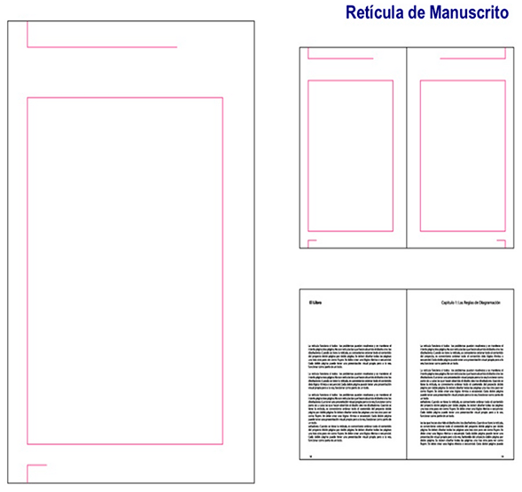
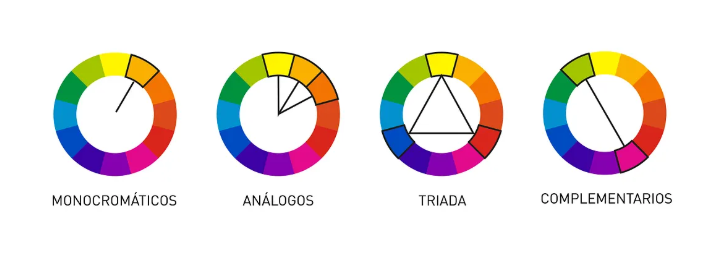

[TOC]

# MF1443 - Unidad 1 - Diseño y elaboración de material didáctico impreso

## Introducción
En esta primera unidad vamos a conocer los **aspectos básicos** necesarios para diseñar y elaborar material didáctico impreso.  

Veremos:  
1. Cómo **seleccionar** los materiales impresos según la finalidad didáctica.  
2. Qué **características de diseño gráfico** deben cuidarse (tipografía, párrafos, formato de página y color).  
3. Qué **elementos** son necesarios para elaborar un **guion didáctico**.  
4. Cómo seleccionar materiales impresos en función de los objetivos, respetando la **propiedad intelectual**.  
5. Qué **medidas de prevención de riesgos laborales y protección medioambiental** aplicar en el diseño y elaboración de materiales.  

> [!tip]
>
> **Objetivo general**:  Que el alumnado sepa **seleccionar, adaptar y elaborar materiales gráficos** en diferentes soportes, atendiendo a criterios técnicos y didácticos.  

---

## 1. Finalidad didáctica y criterios de selección de los materiales impresos

Los **materiales didácticos** son el medio que une a alumnado, contenidos y docencia.  
Incluyen la información necesaria para alcanzar los objetivos del curso y aportan
actividades y experiencias de aprendizaje.

### Material didáctico impreso 🖨️

Se caracteriza por usar sobre todo **códigos verbales** (texto) y, en menor medida, **gráficos** (dibujos, diagramas, fotografías).  
Todos ellos se reproducen mediante **procedimientos de impresión**.

### Tratamiento didáctico
Para que un material impreso pueda considerarse didáctico debe incluir:  
- Organizadores previos.  
- Objetivos de aprendizaje.  
- Ejercicios y actividades prácticas.  
- Evaluaciones.  
- Bibliografía.  
- Otros materiales complementarios.  

Ejemplos: carteles, folletos, publicaciones periódicas, libros y cuadernos didácticos.

### Criterios de selección
La selección de materiales impresos se realiza atendiendo a sus **características**:  
- **Técnicas**: equilibrio entre texto e imagen, uso de color, formatos y soportes.  
- **Pedagógicas**: adaptación al ritmo individual, posibilidad de análisis y síntesis,
consulta permanente y visión global del tema, aplicables a distintas modalidades de enseñanza.

---

## 2. Características del diseño gráfico

El **diseño gráfico** de los materiales impresos influye directamente en la **lectura, comprensión y asimilación** de los contenidos.  
Para ello se deben cuidar varios aspectos:

### 2.1 Tipografía
La elección de la tipografía condiciona la **legibilidad**.  
Se recomienda un diseño **claro y sencillo**, evitando abusar de adornos.

> [!tip]
>
> - **Usar tipografías legibles** y sencillas como Arial, Verdana o Calibri
>
> - **Evitar fuentes recargadas** o decorativas que dificulten la lectura (comic sans)
>
> - **Mantener un tamaño adecuado**: en presentaciones mínimo 24 pt, en documentos impresos 11–12 pt
>
> - **No abusar** de mayúsculas, cursivas o subrayados, ya que cansan la vista
>
> - **Emplear la negrita solo para resaltar** ideas clave
>
> - **Mantener coherencia tipográfica** y no utilizar más de dos tipos de letra en un mismo material
>
> - **Asegurar buen contraste entre texto y fondo**, preferiblemente texto oscuro sobre fondo claro o al contrario
>
> - **⚠️¡Cuida la ortografía!⚠️**: provoca una mala percepción de la calidad. 
>
>   

### 2.2 Párrafos
- Deben estar **bien estructurados**, con frases claras y concisas.  
- Conviene dejar **espacios** para facilitar la lectura.  
- El uso de **títulos, subtítulos y destacados** ayuda a guiar al lector.

### 2.3 Páginas
- Es importante mantener un **equilibrio** entre texto e imagen.  
- La **maquetación** debe ser ordenada y facilitar el seguimiento del contenido.  
- Conviene respetar márgenes y espacios en blanco.

> [!note]  
> Las **retículas** son esquemas de base que sirven para organizar el contenido de la página.  
> Ayudan a mantener una disposición **coherente y armónica** entre texto e imágenes.
>
> Ejemplo de retícula de manuscrito (hay de más tipos):
> 

### 2.4 Color
- El color debe usarse con **criterio didáctico**, no solo estético.  
- Ayuda a **resaltar ideas clave** y a mejorar la comprensión.  
- Un exceso de colores puede dificultar la lectura.

> [!note]
> **Modos de color**  
>
> - **RGB**: “colores luz” (pantallas). Adecuado para documentos que **no** se imprimirán en imprenta.  
> - **CMYK**: “colores opacos” (artes gráficas). Impresión en **cuatricromía**.  

> [!note]  
> **Círculo cromático** 🎨  
> El círculo cromático es una representación ordenada de los colores básicos y sus mezclas.  
> Sirve para entender cómo se relacionan y combinan:  
>
> - **Colores primarios**: rojo, azul y amarillo.  
> - **Colores secundarios**: verde, naranja y violeta (mezcla de dos primarios).  
> - **Colores terciarios**: resultado de combinar un primario con un secundario.  
>
> Según su posición en el círculo se obtienen combinaciones habituales:  
> - **Complementarios** → opuestos en el círculo (ej. rojo y verde).  
> - **Análogos** → contiguos en el círculo (ej. azul, azul verdoso y verde).  
> - **Tríada equidistante** → tres colores separados a la misma distancia (ej. rojo, azul y amarillo).  
>
> 

> [!warning]
>
> Un buen diseño gráfico facilita que el material impreso sea más **legible, atractivo y eficaz** para el aprendizaje.

---

## 3. Elementos del guion didáctico

El diseño de contenidos y la estructura del guion didáctico favorecen el aprendizaje y sirven de apoyo en las sesiones formativas. A partir del guion se elabora la **guía didáctica**, que especifica: objetivos, contenidos, actividades, metodología y recursos materiales.

### 3.1 Recursos generales
- **Índice**: sitúa al alumnado en la unidad didáctica que se trabaja.
- **Glosario**: relación de conceptos clave con definiciones breves y precisas.
- **Anexos**: esquemas, gráficos, fotografías u otros recursos que enriquecen y aclaran el contenido; se sitúan al final y no siguen la paginación del contenido.
- **Bibliografía**: listado de fuentes citadas o consultadas para que el alumnado pueda profundizar.

> [!note]
> **Estilos bibliográficos**
> - APA (American Psychological Association): ver *apastyle.org*.
> - ISO 690-1987 (documentos impresos y audiovisuales) e ISO 690-2 (documentos electrónicos).

### 3.2 Recursos específicos
1. **Introducción**: presentación resumida de la unidad y de sus contenidos para dar una visión global.
2. **Objetivos**: lo que se pretende conseguir en cada unidad.
   - Atender a su **formulación**, **adecuación al alumnado** y a la **naturaleza de las capacidades** (conocimientos, destrezas y actitudes).
4. **Contenidos**: información especializada organizada en unidades didácticas.
   - Comenzar por los **más sencillos o generales** y presentar progresivamente informaciones más complejas.
5. **Redacción del guion**: lenguaje claro y correcto, predominio de la **segunda persona del plural** (vosotros, vosotras), uso de **ejemplos y analogías**, **párrafos directos** e **interrogativos** cuando sea necesario.
6. **Resúmenes**: versión breve que enfatiza los puntos importantes; puede ir al **principio** o al **final** de un bloque.
7. **Infografías**: exponen ideas complejas de manera atractiva y facilitan compartirlas.
8. **Actividades**: claras, graduadas, adaptadas, significativas y representativas del contenido.
   - **Introducción**: presentan la unidad.
   - **Consolidación**: afianzan y refuerzan la asimilación.
   - **Ampliación**: profundizan en aspectos concretos.
   - **Autoevaluación**: al final de la unidad; información inmediata sobre el aprendizaje; suele permitir **varios intentos** para releer el material, consultar al profesorado y repensar respuestas.

> [!tip]
>
> El guion didáctico asegura que el material impreso no sea solo “información”, sino una **herramienta de enseñanza-aprendizaje estructurada**.

---

## 4. Selección de materiales didácticos impresos en función de los objetivos a conseguir y respetando la normativa sobre propiedad intelectual

La selección de materiales didácticos debe hacerse siempre pensando en su **utilidad para el aprendizaje** y en que se adapten a los **objetivos de la acción formativa** y a las **características del alumnado**.  

Un aspecto fundamental es el **respeto a la propiedad intelectual**:  
- Se deben citar las **fuentes utilizadas**.  
- Solo pueden emplearse materiales con la **autorización correspondiente**.  
- Están permitidos los materiales de **dominio público** o con **licencias abiertas** (como Creative Commons).  
- No se deben reproducir ni distribuir obras sin permiso expreso de la persona autora o de la entidad titular de los derechos. 

> [!important]
>
> Seleccionar un material didáctico no es solo elegir lo más útil o atractivo, sino también asegurarse de que se respeta la **legalidad en materia de propiedad intelectual**.

> [!caution]  
> **Respeto a los derechos de autor**  
> Usar materiales sin autorización puede acarrear **sanciones económicas** (multas que pueden ir desde cientos hasta miles de euros) e incluso **responsabilidad legal** para la entidad o el formador.  
> Siempre es obligatorio citar fuentes y utilizar materiales con licencia adecuada (propios, de dominio público o con licencias abiertas como Creative Commons).

---

## 5. Medidas de prevención de riesgos laborales. Protección del medioambiente

### 5.1 Medidas de seguridad y salud 🦺

1. ⚡**Riesgos eléctricos**
   - Verificar que el equipo eléctrico está en perfecto estado antes de usarlo.
   - Cuidar el uso de alargadores y la forma de desconectar de la toma.
   - Operar solo con los mandos previstos por el fabricante (atascos de impresoras/fotocopiadoras, etc.); si no se tiene formación, no “hacer de técnico”.
   - Ante una avería: desconectar la corriente e informar a mantenimiento/técnico.

2. 🚧**Riesgos de caídas al mismo nivel**
   - Mantener **orden y limpieza**: zonas de paso **libres**.
   - Iluminación **adecuada** en zonas de trabajo y de paso.
   - Avisar de **irregularidades** en el suelo.

3. 🌡️**Riesgos derivados del medio ambiente**
   - Ubicar zonas de trabajo **alejadas del ruido** para poder concentrarse.
   - **Temperatura** óptima: **20–22 ºC**; **humedad** relativa: **30–70%**.
   - **Iluminación** en torno a **500 lux**; se puede añadir un foco en el área concreta.
   - **Renovación** periódica del aire; preferible **ventilación natural**.

4. 💆‍♀️**Riesgos relacionados con la carga de trabajo**
   - Vigilar **posturas mantenidas**; hacer **pausas breves**; ejercicios de **relajación** (cuello, tronco, cara).
   - Mantener **buena forma física** y **colaboración** con otros docentes.
   - Estrategias de manejo del **estrés**: relajación, control de respiración, relajación mental; realizar **actividades de satisfacción personal**.

### 5.2 Medidas de protección medioambiental 🌍

- Los impactos ambientales pueden deberse a:
  - **Entrada de recursos** (consumo de productos, agua, energía…).
  - **Salida** (contaminación y **residuos**).
  - **Acción directa** sobre el territorio (impactos sobre el espacio).

> [!important]
> En la edición de materiales impresos debe asumirse una **responsabilidad** activa para mejorar el entorno y la **sostenibilidad**, exigiendo esos valores también al sector editorial.

**Recomendaciones para prevenir el impacto**

1. **Impresión digital** cuando sea idónea o si no es posible transmitir la información en soporte digital.
2. **Buenas prácticas de formato** (tintas, colores, encuadernación, gramaje, márgenes):
   - Ajustar la **tirada** a la demanda (no hacer más copias de las que se necesitan).
   - Evitar **hojas en blanco** y márgenes innecesarios.
   - Elegir **tapa blanda/rústica** frente a **tapa dura** cuando sea posible.
   - Considerar la **densidad del texto**.
   - Valorar el **n.º de tintas** y los **colores**: los **fluorescentes** y **metálicos** no están en tintas de base vegetal; los metálicos contienen **metales pesados**. En **serigrafía**, las tintas más líquidas emiten más **COV**.
   - Equilibrar **utilidad/resistencia** con el **peso del papel** (menos gramos = menos recursos).
   - Reducir el **área cubierta por tinta** (fondos sólidos, fotos con fondo negro) para usar menos pigmento y facilitar la **reutilización**.
   - Diseñar para poder **actualizar** sin reimprimir todo ni desechar material desfasado.
3. **Papel**: atender al **origen de fibras** (virgen vs. reciclado) y al **blanqueo** (recomendable **TCF**). Verificar **ecoetiquetas**: **FSC** y **PEFC**.
4. **Tintas y consumibles**
   - Preferir tintas de **base acuosa** y bajo solvente; **aceites vegetales** o **tintas recicladas**.
   - Evitar pigmentos con **metales pesados**.
   - Usar **cartuchos/tóner reciclados** y depositar los usados en **contenedores específicos**.
5. **Embalaje y distribución**
   - Emplear **materiales reciclables** en el embalaje.
   - Optimizar la **logística** (más productos por viaje).
   - Valorar **ecomensajería** o **economía social**.

---

## Resumen

- Los **materiales didácticos impresos** son un recurso clave en la formación, porque unen a alumnado, contenidos y docencia.  
- Para ser verdaderamente **didácticos**, deben incluir: organizadores previos, objetivos, actividades, evaluaciones y bibliografía.  
- El **diseño gráfico** influye en la comprensión: tipografía clara, párrafos bien estructurados, páginas equilibradas y uso adecuado del color.  
- El **guion didáctico** sirve como base para elaborar materiales impresos e incluye elementos generales (índice, glosario, anexos, bibliografía) y específicos (introducción, objetivos, contenidos, actividades, resúmenes, etc.).  
- En la **selección de materiales** se debe garantizar su adecuación a los objetivos y al alumnado, y sobre todo, respetar la **propiedad intelectual**.  
- En el diseño y elaboración es necesario aplicar medidas de **seguridad y salud laboral** (riesgos eléctricos, caídas, medio ambiente, carga de trabajo) y de **protección medioambiental** (impresión digital, uso racional de papel y tintas, reciclaje y distribución sostenible).

> [!tip]
>
> Diseñar y elaborar materiales impresos implica no solo aspectos técnicos y pedagógicos, sino también legales (propiedad intelectual), de seguridad laboral y medioambientales.

---

## Glosario

- **Material didáctico**: medio que une a alumnado, contenidos y docencia, incluyendo información, actividades y experiencias de aprendizaje.  
- **Material impreso**: recurso didáctico basado principalmente en texto y gráficos, reproducido mediante procedimientos de impresión.  
- **Tratamiento didáctico**: adaptación de un material para incluir objetivos, actividades, evaluaciones y bibliografía, convirtiéndolo en recurso de aprendizaje.  
- **Guion didáctico**: esquema previo que orienta la elaboración de materiales, con elementos generales y específicos para garantizar su valor pedagógico.  
- **Propiedad intelectual**: conjunto de normas que protegen los derechos de autor sobre obras y materiales, impidiendo su reproducción o distribución sin permiso.  
- **Retícula**: esquema de base que organiza los elementos de la página (texto, imágenes, gráficos) para mantener coherencia y armonía.  
- **RGB**: sistema de color para pantallas, basado en luz (rojo, verde, azul).  
- **CMYK**: sistema de color para impresión, basado en tintas (cian, magenta, amarillo, negro).

---

# Ejercicios

## Ejercicio 1: Clasifica características en técnicas o pedagógicas

| **Características técnicas**                                 | **Características pedagógicas**                              |
| ------------------------------------------------------------ | ------------------------------------------------------------ |
| Permiten diversidad de soportes                              | Facilitan procesos de análisis y síntesis                    |
| Admiten color                                                | Permiten la consulta permanente y una visión completa del tema |
| Permiten diferentes formatos                                 | Se adaptan a las distintas modalidades de enseñanza          |
| Presentan de forma equilibrada información en texto, gráficos, fotos, diagramas, etc. | Facilitan el ritmo individual de aprendizaje                 |

## Ejercicio 2: Tipografía. Verdadero o falso

| Afirmación                                                   | Respuesta |
| ------------------------------------------------------------ | --------- |
| Una fuente tipográfica es un grupo de signos tipográficos que comparten rasgos de diseño comunes, conformando todas ellas una unidad tipográfica, pero conservando rasgos propios diferenciadores | Falso     |
| Una familia tipográfica es el conjunto de caracteres que componen un tipo de letra | Falso     |
| Usamos las cursivas para enfatizar y señalar palabras que, sin ser nombres propios, no tienen un uso conforme al léxico español | Verdadero |
| La cursiva es la forma básica de letra y la que se usa por norma en el cuerpo del texto | Falso     |
| El estilo regular resulta adecuado cuando se pretende que la persona que lee encuentre con facilidad un punto del texto | Falso     |
| El tipo es un objeto físico, un bloque paralelepipédico de metal que tiene en su cara superior, en relieve e invertida, la imagen de una letra o signo para la impresión por sistema tipográfico | Verdadero |

## Ejercicio 3: Ordenar los pasos de creación de una retícula

| Paso | Acción                                                       |
| ---- | ------------------------------------------------------------ |
| 1    | Primero valoraremos las características informativas y los requisitos de producción del contenido |
| 2    | Creamos la retícula elegida y comenzamos a maquetar (diagramar). La retícula no debe limitarnos y, en ocasiones, será necesario romperla |
| 3    | Definimos el formato de la página                            |
| 4    | Definimos los márgenes del documento                         |
| 5    | Establecemos la cantidad y el tamaño de las columnas según el documento |
| 6    | Establecemos el espacio entre columnas                       |
| 7    | Establecemos la ubicación de los marcadores                  |
| 8    | Si vamos a trabajar con múltiples tipos de información, debemos valorar si establecer un sistema modular |

## Ejercicio 5: Completa el texto

Completa el siguiente texto:

Debemos **`seleccionar`** los materiales en función de su papel motivador, como recursos que puedan **`incrementar`** el grado de compromiso de las personas participantes con los objetivos de la acción formativa. Además, han de **`servir`** de elementos de recuperación de lo ya aprendido (evocación de experiencias o contenidos que ya se poseen) al mismo tiempo que estimulen la adquisición de los nuevos conocimientos y deben **`contener`** la información básica y de desarrollo necesaria para favorecer la **`comprensión`** de los contenidos y la **`orientación`** del participante en su trabajo.

## Ejercicio 6: Utilizar materiales ajenos

| Opción                                                       | Correcto/Incorrecto | Explicación                                                  |
| ------------------------------------------------------------ | ------------------- | ------------------------------------------------------------ |
| a) Cumplimiento del derecho de cita                          | ✅                   | Es la base legal para usar fragmentos de obras ajenas en docencia |
| b) Una obra ajena no podrá ser objeto de valoraciones        | ❌                   | Claro que se pueden hacer valoraciones y análisis, forman parte del aprendizaje |
| c) Junto al fragmento debe identificarse el nombre del autor y la fuente | ✅                   | Es obligatorio indicar autoría y procedencia                 |
| d) No se podrán hacer cambios o modificaciones en la obra ajena | ✅                   | La obra debe respetarse íntegra, salvo usos permitidos como la parodia |
| e) No se debe utilizar material bibliográfico de monografías y manuales para apoyar y documentar las clases a impartir | ❌                   | Sí se pueden usar, siempre dentro del derecho de cita        |
| f) Para que pueda usarse la obra ajena, es necesario que se trate de una obra ya divulgada | ✅                   | Solo se pueden citar obras divulgadas públicamente           |

---

## 🧑‍🏫Test Unidad 1

**1) Los materiales didácticos constituyen el nexo de unión entre:**
 a) La estructura del material y las características del contenido.
 b) Los participantes, los contenidos y el docente.
 c) Las teorías del aprendizaje y los participantes.
 d) Ninguna es correcta.

**2) ¿Cómo se denomina al estilo gráfico que tiene forma de mayúsculas pero mantiene un tamaño cercano a las minúsculas?:**
 a) Versalita.
 b) Regular.
 c) Negrita.
 d) Cambria.

**3) ¿Cuál es la alineación más utilizada en libros de narrativa?:**
 a) Alineación a la izquierda.
 b) Alineación a la derecha.
 c) Alineación centrada.
 d) Alineación justificada.

**4) El tratamiento de los contenidos de un material impreso resultan determinantes para atribuirles el carácter de didáctico:**
 a) Verdadero.
 b) Falso.

**5) El conjunto de caracteres que componen un tipo de letra se denomina:**
 a) Familia tipográfica.
 b) Tipo.
 c) Fuente tipográfica.
 d) Tracking.

**6) ¿Cómo se denomina a la riqueza cromática de un color?:**
 a) Tono.
 b) Saturación.
 c) Brillo.
 d) Luz.

**7) Una recomendación en el uso de los tipos es que el tamaño del cuerpo de un texto oscile entre:**
 a) 12-14 puntos.
 b) 10 y 12 puntos.
 c) 8 y 10 puntos.
 d) Menos de 12 puntos.

**8) El párrafo que no lleva sangría en ninguna línea y para saber cuando empieza o termina un párrafo, se suele dejar un espacio entre párrafos equivalente a la mitad de la interlínea se denomina:**
 a) Párrafo ordinario.
 b) Párrafo español.
 c) Párrafo alemán.
 d) Párrafo inglés.

**9) Una línea corta de un párrafo que queda aislada como primera línea de la siguiente columna se denomina:**
 a) Línea hermana.
 b) Línea viuda.
 c) Línea huérfana.
 d) No se produce esta situación porque el texto está justificado.

**10) Cuando en una página estoy utilizando una línea horizontal que sirve para delimitar recuadros, ilustraciones o señalar diferentes partes del texto se denomina:**
 a) Pie de texto.
 b) Subtítulo.
 c) Filete.
 d) Cuerpo de texto.

------

 
Mostrar soluciones

1. **b)** Los participantes, los contenidos y el docente.
    *El material media entre alumno, contenido y formador.*
2. **a)** Versalita.
    *Mayúsculas con tamaño de minúscula.*
3. **d)** Alineación justificada.
    *Es la más usada en narrativa para dar uniformidad.*
4. **a)** Verdadero.
    *Un material solo es didáctico si el contenido está adaptado.*
5. **c)** Fuente tipográfica.
    *Conjunto de caracteres de un mismo diseño.*
6. **b)** Saturación.
    *Indica la pureza o intensidad del color.*
7. **b)** 10 y 12 puntos.
    *Tamaño estándar para texto corrido.*
8. **c)** Párrafo alemán.
    *No lleva sangría y separa con espacio entre párrafos.*
9. **b)** Línea viuda.
    *Primera línea de un párrafo que queda sola al inicio de página o columna.*
10. **c)** Filete.
     *Línea fina usada como recurso gráfico para separar o delimitar.*

