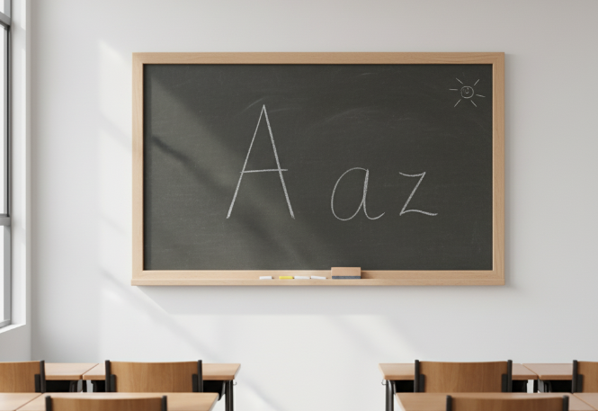
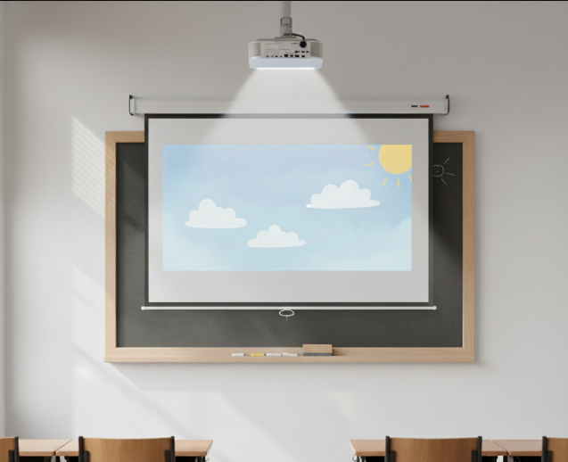

[TOC]

# MF1443 - Unidad 2 - Planificación y utilización de medios y recursos gráficos

## Introducción
En esta unidad, aprenderemos a planificar y utilizar **medios y recursos gráficos** que sirvan de apoyo a los contenidos didácticos. Se verán los siguientes puntos:
* Qué es un recurso didáctico.
* Los tipos de recursos didácticos según su soporte.
* Cómo ubicar y usar cada recurso.
* La elaboración de indicaciones para el uso de recursos durante una sesión formativa.

> [!note]
>
> El objetivo es que el alumnado sepa utilizar medios y recursos gráficos con criterios de **eficiencia** y **metodología**.

---

## 1. Características y finalidad didáctica

Un **recurso didáctico** es cualquier ayuda utilizada para facilitar el acceso a la información, la adquisición de habilidades y la formación de valores. Los recursos gráficos varían según la modalidad de enseñanza.

> [!important]
>
> **Definición:** Recurso didáctico es *"cualquier ayuda que es utilizada con una finalidad didáctica o para facilitar el desarrollo de actividades en los procesos de enseñanza-aprendizaje, y por lo tanto, facilita el acceso a la información, la adquisición de habilidades, destrezas y estrategias y la formación de actitudes y valores."*
>
> Dr. Pere Marqués Graells, 2000.

| Modalidad Presencial                                    | Modalidad e-learning                                         |
| :------------------------------------------------------ | :----------------------------------------------------------- |
| Se utilizan recursos en un espacio físico como el aula. | Los recursos se apoyan en un _software_ que los reproduce o muestra. El _software_ puede ser gratuito o de pago, elegido según necesidades y presupuesto. |

### 1.1 Tipos de recursos didácticos

Los recursos gráficos más habituales en la formación son la **pizarra**, el **rotafolios** y el **retroproyector**. Son populares por su bajo coste y la facilidad de manejo, ya que no requieren conocimientos técnicos ni un lenguaje audiovisual complejo.

Los medios didácticos se pueden clasificar en dos grandes grupos: 

| | **Pretecnológicos** | **Tecnológicos** |
| :--- | :--- | :--- |
| **Definición** | No necesitan soporte técnico para transmitir la información. | Necesitan un instrumento técnico para transmitir el mensaje. |
| **Ejemplos** | Libros, mapas, láminas, pizarra, etc. | Audiovisuales, medios informáticos, TIC. |

#### 1.1.1 Pizarra
Es un tablero donde se escribe o dibuja para que varias personas lo vean al mismo tiempo.

* **Tipos de Pizarra**:
    * **De tiza**: Tablero oscuro donde se escribe con tizas. Puede ser fijo, móvil o tríptico.
    * **Blanca**: Superficie de plástico donde se escribe con rotuladores de tinta fácil de borrar.
    * **Electrónica**: Pizarra blanca que permite hacer copias en papel de lo que se escribe.

#### 1.1.2 Retroproyector
Es un medio de proyección fija que presenta imágenes en pantallas de gran formato.

* **Tipos de Retroproyector**:
    * **Portátil**: Fácil de transportar y usar en cualquier lugar.
    * **Fijo**: Ideal para salas grandes debido a su potencia lumínica.

#### 1.1.3 Rotafolios
Similar a un cuaderno grande (70x90 cm) con grandes láminas de papel, que se cuelga en un caballete. Su uso busca apoyar una exposición con dibujos, frases, láminas o textos que sinteticen ideas. Existen diferentes tipos, como el simple, de hojas invertidas, doble y tipo libro.

### 1.2. Tipos de medios gráficos

Los medios textuales y gráficos más comunes son las **transparencias**, las **infografías**, el **cartel**, el **folleto**, la **publicación periódica**, el **libro** y el **cuaderno didáctico**.

#### 1.2.1. Transparencias
Es una lámina de acetato que plasma la esencia del mensaje que el formador quiere transmitir.

* **Elaboración**: Se pueden hacer a mano con láminas de acetato y rotuladores, y se proyectan con un retroproyector.
* **Uso**: Se utilizan solo en modalidad presencial, ya que en la modalidad en línea se sustituyen por presentaciones de diapositivas.

#### 1.2.2. Infografías
Son representaciones visuales que pueden incluir texto y que explican descripciones, relatos o procesos de forma gráfica para hacer comprensibles ideas complejas o abstractas.

* **Tipos de Infografías**:
    * El esquema gráfico: Muestra las partes de un todo y sus relaciones.
    * La imagen esquemática: Sintetiza un gran número de ideas en un mínimo de trazos.
    * El esquema textual: Representación sintética y ordenada de las ideas esenciales de un texto. Es la más utilizada en formación porque permite una visión rápida de la estructura del tema.
    * El croquis: Dibujo a mano alzada que aporta frescura.
    * El mapa conceptual: Representación gráfica de la información sobre un tema, organizada jerárquicamente.

* **Elementos del mapa conceptual**:
    * **Conceptos**: Objetos, abstracciones o situaciones representadas con círculos u otras figuras geométricas.
    * **Proposiciones**: Unen dos o más conceptos con una palabra enlace que muestra la relación entre ellos, representadas con líneas.

* **Utilidad**: Facilitan la visualización, el recuerdo y el aprendizaje organizado de los contenidos.

* **Creación de una infografía**:
    1.  Planificar el objetivo.
    2.  Recopilar los datos.
    3.  Contar una historia y elegir un personaje que la guíe.
    4.  Decidir el diseño (existen herramientas gratuitas como Visual.ly, Easel.ly y EWC Presenter).
    5.  Usar la teoría del color para generar curiosidad.
    6.  Pedir una segunda opinión antes de la versión final.

#### 1.2.3. El Cartel
Es una lámina de papel, cartón u otro material que anuncia o da información. Se compone de imágenes y textos breves que forman una unidad estética.

* **Partes del cartel**:
    * **Encabezado**: Título breve, conciso y con fuente de mayor tamaño.
    * **Imagen**: Ilustra y complementa el mensaje del texto.
    * **Pie**: Aclara y profundiza en el mensaje con detalles secundarios.

#### 1.2.4. El Folleto
Un impreso no periódico de pocas hojas y sin encuadernar, que sirve como herramienta divulgativa. Es útil como catálogo de equipos o manual de instrucciones.

#### 1.2.5. El Libro
Obra impresa o manuscrita no periódica que tiene más de 49 páginas.

* **Tipos de libro**:
    * **Libro de texto**: Representa un plan completo de enseñanza.
    * **Libro de ejercicios**: Complementa al libro de texto.

#### 1.2.6. El Cuaderno Didáctico
Material impreso que el formador crea para apoyar sus sesiones y facilitar el aprendizaje del alumnado.

---

## 2. Ubicación en el espacio

### 2.1. Pizarra
* El tamaño debe ser el adecuado para el aula y estar ubicada en un lugar visible para todos.
* La parte superior debe estar al alcance del formador y la inferior, a la altura de los ojos del alumnado.
* La colocación será frontal y se deben evitar los reflejos en la pizarra.

### 2.2. Rotafolios
* El tamaño debe ser el adecuado para el aula y estar ubicado en un lugar visible para todos.
* La parte superior debe estar al alcance del formador y la inferior, a la altura de los ojos del alumnado.
* La colocación será frontal y se deben evitar los reflejos.

### 2.3. Retroproyector
* Se debe colocar de forma que no sea un obstáculo para la visualización.
* La pantalla debe estar perpendicular al proyector para evitar distorsiones en la imagen.
* Se recomienda que el ángulo de visión del alumnado con respecto a la pantalla sea inferior a 40º.

> [!note]
>
> La pizarra, el rotafolios y el retroproyector son los tres recursos que requieren de una colocación específica en el aula, el resto de recursos normalmente se distribuyen en función de las necesidades de la actividad formativa que se vaya a desarrollar.

---

## 3. Recomendaciones de utilización

Los recursos gráficos deben usarse según su propósito, eligiendo el más apropiado para cada momento. Sus propósitos son:

* Apoyar la labor docente para facilitar el objetivo.
* Aumentar los canales de percepción.
* Crear un ambiente agradable durante las actividades.

> [!warning]
>
> Los recursos no deben sustituir la interacción humana entre el docente y el alumnado, ni servir como "chuleta" para el docente.

### 3.1. Uso de la pizarra

* Planificar su uso con un esquema previo.
* Distribuir la información para que sea fácil de leer y comprender, borrando lo que ya no es necesario.
* Usarla para destacar lo más importante, palabras nuevas, referencias o explicaciones.
* Resaltar los puntos clave con colores, subrayados y recuadros.
* Evitar dar la espalda al alumnado o tapar lo que se está escribiendo.
* Usar letras minúsculas (siempre que sean legibles).
* Sincronizar la exposición oral con la visual.
* Utilizar síntesis y esquemas en lugar de textos largos.

### 3.2. Uso del rotafolios

* Adecuado para grupos pequeños.
* Permite llevar el material preparado de antemano.
* Exige una buena caligrafía.
* Permite el contacto visual con el alumnado.
* Ayuda a recordar lo anterior y a dirigir la atención.
* No es adecuado para desarrollos largos.
* Distribuir la información para que sea fácil de leer y comprender.

### 3.3. Retroproyector

* Usar una superficie de proyección de 1,5 x 1,5 metros.
* Evitar la claridad excesiva.
* Mantener la imagen solo durante la explicación para no perder interés.
* Situarse a un lado para no tapar la imagen.
* Mantener las lentes limpias.

### 3.4. Uso de las transparencias

* Organizar las transparencias por temas y de lo general a lo particular.
* Proyectarlas después de una introducción oral para estimular al alumnado.
* Si la atención decae, interrumpir la exposición con preguntas o actividades.
* Si es un resumen, mantenerla en pantalla durante toda la exposición.
* Usar la superposición de transparencias para ir complementando un tema.

### 3.5 Uso de la videoconferencia

- Se recomienda su uso para mantener comunicaciones de cualquier tipo con grupos de personas que se encuentran situados en diferentes puntos geográficos mediante la transmisión bidireccional y simultánea de imágenes en color y de voz de cada una de las personas participantes.

### 3.6. Material audiovisual

* **Radio y Televisión**: Son medios buenos para los estudios reglados a distancia, ya que llegan a muchas personas.
* **CD-ROM / DVD:** En formación presencial sirven para **ilustrar la teoría con ejemplos prácticos** o apoyar la exposición de un tema. En formación a distancia se usan para **entregar el contenido del curso** o **aportar material complementario**.

---

## 4. Diseño de un guion con la estructura de uso en una sesión formativa

El **guion** es una herramienta imprescindible para planificar con detalle la utilización de los medios y recursos didácticos a lo largo de una sesión. Su finalidad es asegurar la **coherencia** entre los recursos elegidos y los objetivos de la formación.

### 4.1. Elementos clave del guion

El guion debe especificar exactamente cómo se integrará cada recurso. Los elementos fundamentales a incluir son:

* **Unidad didáctica / Tema**: La materia o el contenido formativo que se está desarrollando.
* **Duración**: El tiempo estimado que se dedicará a la actividad o al uso del recurso.
* **Recurso/Medio**: El material específico que se va a utilizar (pizarra, infografía, transparencia, etc.).
* **Objetivo**: La finalidad didáctica concreta del uso de ese recurso (por ejemplo: presentar un concepto, reforzar una idea, iniciar un debate).
* **Contenido**: La información específica (texto, gráfico, imagen) que se transmitirá a través de ese recurso.
* **Observaciones**: Cualquier consideración técnica o ambiental necesaria para su uso (ej. apagar luces, colocar el rotafolios, tamaño del grupo).

### 4.2. Proceso de diseño

El diseño del guion de recursos sigue las etapas lógicas de la planificación didáctica:

1.  **Definición del objetivo**: ¿Qué se quiere conseguir con el recurso?
2.  **Selección del contenido**: ¿Qué información se va a enseñar?
3.  **Elección de la metodología**: ¿Cómo se va a presentar?
4.  **Selección de los recursos**: ¿Qué herramientas se van a usar?
5.  **Evaluación**: ¿Cómo se va a comprobar que el uso del recurso ha sido efectivo?

### 4.3. Ejemplo Ficha de actividad

<table>
    <thead>
        <tr>
            <td>Sesión: 3</td>
            <td>Técnica: Debate</td>
            <td>Fecha: </td>
        </tr>
    </thead>
    <tbody>
        <tr>
            <td colspan="2"> Duración prevista: 120 min</td>
            <td>Duración real: </td>
        </tr>
        <tr>
            <td colspan="3">
                
<strong>OBJETIVOS:</strong>

                <ul>
                    <li>Respetar el derecho a opinar de todos los formandos.</li>
                    <li>Respetar los turnos de palabra de los demás.</li>
                    <li>Defender la postura asignada aunque no se esté de acuerdo con ella.</li>
                    <li>Llevar a cabo un diálogo entre los formandos.</li>
                    <li>Argumentar las propias opiniones.</li>
                    <li>Llegar a una conclusión sobre la "posibilidad de la comunicación perfecta".</li>
                </ul> 
            </td>
        </tr>
        <tr>
            <td colspan="3">
                
<strong>DESARROLLO:</strong>

                <ul>
                    <li>Se expondrán claramente las dos posturas a defender en el debate. Que son:
                        <ul>
                            <li>La comunicación perfecta es posible.</li>
                            <li>La comunicación perfecta es imposible.</li>
                        </ul>
                    </li>
                    <li>Se divide el grupo de formación en dos subgrupos, lo cual se hará al azar.</li>
                    <li>Se elige al moderador que, en nuestro caso, será el propio formador. Sus funciones serán:
                        <ol>
                            <li>Orientar la discusión.</li>
                            <li>Mantener la corrección.</li>
                            <li>Impedir los distanciamientos del tema.</li>
                        </ol>
                    </li>
                    <li>Se entrega a cada grupo el texto correspondiente de su postura a defender en el debate, que son:
                        <ol>
                            <li>Se reúne cada grupo para preparar los argumentos y se elige al secretario de cada grupo, que se encargará de recogerlos. También se ocupará de anotar las ideas más relevantes surgidas en el debate.</li>
                            <li>Se designa en cada sector de opinión a los representantes del mismo. Se ocuparán de rebatir la postura contraria y defender la suya, conforme a lo acordado en su grupo de trabajo.</li>
                            <li>Se realiza el debate, para lo cual:
                                <ul>
                                    <li>Se exponen los argumentos (secretarios).</li>
                                    <li>Se rebaten los argumentos contrarios (representantes).</li>
                                    <li>Participación de todos en la discusión respetando el turno de palabra.</li>
                                </ul>
                            </li>
                            <li>Los secretarios leen las ideas principales surgidas en el debate y, entre todo el grupo de formación, se llegan a unas conclusiones finales sobre el tema.</li>
                        </ol>
                    </li>
                </ul>
            </td>
        </tr>
        <tr>
            <td colspan="3">
                
<strong>MATERIALES:</strong>

                <ul>
                    <li>Fungibles:
                        <ul>
                            <li>Rotuladores para rotafolio.</li>
                            <li>Cinta de vídeo.</li>
                            <li>Hojas DIN A-4.</li>
                            <li>Bolígrafos.</li>
                            <li>Fotocopias de los textos sobre las dos posturas.</li>
                        </ul>
                    </li>
                    <li>Inventariables:
                        <ul>
                            <li>Rotafolios.</li>
                            <li>Vídeo.</li>
                            <li>Televisor.</li>
                            <li>Cámara de vídeo.</li>
                            <li>Adaptador para cinta de vídeo.</li>
                        </ul>
                    </li>
                </ul>
            </td>
        </tr>
        <tr>
            <td colspan="3">
                
<strong>EVALUACION:</strong>

                <ul>
                    <li>Del nivel de participación hubo.</li>
                    <li>Qué tipo de contenidos aparecieron.</li>
                    <li>A qué conclusiones se llegaron.</li>
                    <li>Cómo actúan los formandos cuando hay desacuerdo./li>
                </ul>
            </td>
        </tr>
    </tbody>
</table>

### 4.4. Ejemplo de cronograma

Creando el cronograma de la sesión formativa siempre tendremos planificados lo que queda por hacer y controlado lo que ya se ha hecho en clase, evitando la posibilidad de olvido de lo que se hizo en la última sesión o lo que se pidió a los alumnos/as que hicieran para preparar la sesión siguiente.

| TIEMPO        | CONTENIDO                                                    | TÉCNICA                                      | MATERIALES                                                   | ACTIVIDADES                                                  | OBJETIVOS                                                    |
| ------------- | ------------------------------------------------------------ | -------------------------------------------- | ------------------------------------------------------------ | ------------------------------------------------------------ | ------------------------------------------------------------ |
| 9:00 a 9:30   | Conocer las experiencias vividas de los padres con sus hijos adolescentes durante la semana. | Interrogatorio.                              | Rotafolios. Rotulador.                                  | Puesta en común en el gran grupo.                            | Comentar y analizar las experiencias vividas por los padres durante la semana con sus hijos.  Conocer y analizar si se han visto reflejados los contenidos dados en la sesión anterior, en la propia experiencia. |
| 9:30 a 10:00  | Elementos claves de la comunicación.Modelos de comunicación. | Lección magistral. Interrogatorio.           | Transparencias (sesión-3, transparencias-1,2,3,).            |                                                              | Conocer los elementos claves de la comunicación y su importancia.  Conocer y analizar los modelos de comunicación. |
| 10:00 a 12:00 | La posibilidad de la comunicación perfecta.                  | Debate.  Grabación del debate en video. | Fotocopias (sesión-3, fotocópias-1,2). Cámara y cinta de vídeo. | Definición de las dos posturas. Elección de representantes y secretarios. Discusión en pequeño grupo. Discusión en gran grupo. Conclusiones. | Respetar el derecho a opinar de todos los formandos.  Respetar los turnos de palabra.  Defender la postura asignada aunque no se esté de acuerdo con ella.  Llevar a cabo un diálogo entre los formandos.  Argumentar las propias opiniones.  Llegar a una conclusión sobre la “posibilidad de la comunicación perfecta”. |
| 12:00 a 12:20 | DESCANSO                                                     |                                              |                                                              |                                                              |                                                              |
| 12:20 a 12:40 | Habilidades sociales para la comunicación: -Escucha activa. -Hacer preguntas. -Empatizar. | Interrogatorio. Lección magistral.      | Rotafolios. Rotulador. Transparencias (sesión-3, transparencias-4,5,6,7,8,9). |                                                              | Conocer las habilidades sociales para la comunicación (escucha activa, hacer preguntas, empatizar).  Conocer como se pueden llevar a la práctica las habilidades sociales para la comunicación (escucha activa, hacer preguntas, empatizar). |
| 12:40 a 13:00 | DESCANSO                                                     |                                              |                                                              |                                                              |                                                              |
| 13:00 a 13:30 | Puesta en práctica de las habilidades sociales para la comunicación (escucha activa, hacer preguntas, empatizar) por parte de los formandos. | Videoforum.                                  | TV. Vídeo. Cinta de vídeo.                         | Visionado del video. Discusión en gran grupo.           | Formador: analizar la puesta en práctica de la escucha activa, hacer preguntas y la empatía, por parte de los formandos, a través del visionado del vídeo. |

---

## Ejercicios

### Ejercicio 9: Tipos de infografía

| Tipo de infografía | Definición                                                   |
| ------------------ | ------------------------------------------------------------ |
| Esquema gráfico    | Permite mostrar las partes dentro de un todo y sus relaciones |
| Imagen esquemática | Representación visual que sintetiza y contiene muchas ideas en pocos trazos |
| Esquema textual    | Representación sintética de las ideas esenciales de un texto didáctico de forma ordenada, gráfica y visual |
| Croquis            | Dibujo a mano alzada que esboza un objeto                    |
| Mapa conceptual    | Representación gráfica de la información sobre un tema       |

---

### MF1443_3: E3. Actividad Individual Supervisada por el Tutor asociada al CE1.1 (Unidad de Aprendizaje 2, Epígrafe 1.3.4) Actividad evaluable

PDF aparte.

---

### Ejercicio 10: Medios gráficos y su definición

| Tipo de medio gráfico     | Definición                                                   |
| ------------------------- | ------------------------------------------------------------ |
| **El cartel**             | Lámina de papel, cartón u otro material que sirve para anunciar o dar información. Se compone de imágenes y textos breves que forman una unidad estética. |
| **El folleto**            | Impreso de pocas hojas, sin encuadernar, con función divulgativa. Su publicación no es periódica. |
| **El libro**              | Obra impresa o manuscrita no periódica con más de 49 páginas (definición UNESCO), normalmente encuadernada para proteger y organizar el contenido. |
| **El cuaderno didáctico** | Material impreso elaborado por el formador para apoyar sus sesiones y facilitar el aprendizaje del alumnado; sirve de guía y consulta. |
| **Material audiovisual**  | Recursos que utilizan voz, imagen en movimiento y/o sonido para transmitir aprendizaje a través de la vista o el oído, de forma interactiva o estática. |

---

### MF1443_3: E4. Actividad Colaborativa a través del Foro, asociada al CE2.1 (Unidad de Aprendizaje 2, Epígrafe 3) Actividad evaluable

PDF aparte.

---

### Ejercicio 11: Planificación y utilización de medios y recursos

| Afirmación                                                   | ¿Correcta? | Justificación                                                |
| ------------------------------------------------------------ | ---------- | ------------------------------------------------------------ |
| a) Un recurso gráfico es aquel que por sí mismo es capaz de lograr que se alcance un objetivo. | ❌          | El recurso por sí solo no garantiza el aprendizaje, depende de la metodología y del uso que le dé el formador. |
| b) El uso de la pizarra y el rotafolios necesita de una planificación previa en la cual se esquematice cuándo y cómo los vamos a utilizar. | ✅          | La planificación es esencial para integrarlos de forma didáctica y no improvisada. |
| c) Los recursos gráficos deben representar una chuleta para el desarrollo de la actividad docente. | ❌          | No son chuletas, son apoyos visuales que complementan la explicación. |
| d) Durante el uso de la pizarra, tendremos en cuenta la tonalidad de su fondo a la hora de elegir los colores de tizas que se van a emplear. | ✅          | El contraste es fundamental para asegurar la legibilidad.    |
| e) Cuando no usemos el rotafolios (o papelógrafo) sobrepondremos una hoja en blanco para ocultar la información y evitar, así, que los alumnos/as se distraigan. | ✅          | Evita distracciones y mantiene la atención en lo que toca.   |
| f) Al utilizar el retroproyector, mantendremos la imagen únicamente durante la explicación, pues si la mantenemos durante mucho más tiempo el interés disminuye. | ✅          | Mantener la imagen sin explicación hace perder atención.     |
| g) En el uso de la pizarra y el rotafolios, usaremos caracteres en letra mayúscula que se asimilan más rápidamente que los escritos con minúscula, siempre que sean legibles desde cualquier posición del aula. | ❌          | Las minúsculas se recuerdan mejor que las mayúsculas (aunque las mayúsculas se entiendan mejor) |
| h) Tanto en la pizarra como en el rotafolios, destacaremos los puntos clave con colores, subrayados y recuadros. | ✅          | Los elementos gráficos ayudan a resaltar y recordar la información más importante. |

---

### MF1443_3: E5. Actividad Individual Supervisada por el Tutor asociada al CE2.3 y CE4.5 (Unidad de Aprendizaje 2, Epígrafe 4)

PDF aparte.

---

### MF1443_3: E6. Actividad Colaborativa a través del Foro asociada al CE2.5 (Unidad de Aprendizaje 2, Epígrafe Resumen) Actividad evaluable

PDF aparte.

---

### Ponte a prueba 2: PLANIFICACIÓN Y UTILIZACIÓN DE MEDIOS Y RECURSOS GRÁFICOS

**Pregunta 1:**
Carlos se dispone hoy a impartir clases utilizando uno de los recursos más empleados en formación: la pizarra. El tema de esta sesión requiere del diseño de mapas conceptuales por lo que Carlos ha seleccionado este medio para ilustrar dichos mapas a su alumnado. El aula de formación dispone, entre otros recursos, de una pizarra blanca. Carlos se ha asegurado de que en aula también se cuenta con un borrador y con rotuladores de tinta deleble de distintos colores. Igualmente, ha comprobado que la pizarra está ubicada en un lugar visible para todo el alumnado y que su tamaño es adecuado para la capacidad del aula. Así que Carlos ya lo tiene todo listo para empezar su clase.
**¿Cómo crees que debe ser el uso que Carlos le dé a la pizarra?**

**Opción 1**
Carlos sabe de sus dotes en el dibujo. Hará unos mapas conceptuales que dejarán boquiabierto a su alumnado. Así que, al iniciar la clase, Carlos coge un rotulador y dibuja el primer mapa conceptual, tarea en la que emplea unos cinco minutos aproximadamente.

**Opción 2**
Carlos dibuja el primer concepto y explica el objetivo del mapa conceptual, después dibuja un segundo nivel e igualmente lo explica y así sucesivamente, siempre intentando que su letra sea legible y cuente con el tamaño adecuado.

**Opción 3**
Carlos empieza a dibujar el primer mapa conceptual mientras va explicando el contenido del mismo utilizando una letra adecuada y altamente legible. El problema es que Carlos no puede dibujar de cara al alumnado así que tiene que darle la espalda en repetidas ocasiones. ¡Todavía no se ha inventado la pizarra en la que se escriba de frente!

- ❌**Opción 1 → Incorrecta.** Dedicar varios minutos a dibujar sin explicación hace que el alumnado pierda la atención.
- ✅**Opción 2 → Correcta.** Es la forma más didáctica: construir el mapa paso a paso, explicando cada parte y manteniendo la letra legible y con buen tamaño.
- ❌**Opción 3 → Incorrecta.** Aunque es realista (hay que dar la espalda), no es lo ideal porque interrumpe la comunicación con el alumnado.

✔ Respuesta correcta: **Opción 2**.

**Pregunta 2:**
Para una sesión posterior, Carlos ha elaborado un material gráfico en su ordenador incluyendo una letra de tamaño 12 e ilustraciones de un banco de imágenes libres de derechos. Cuando va a imprimir el material para dárselo a sus alumnos/as se da cuenta de que son muchas hojas y, atendiendo a criterios medioambientales, reduce el tipo de letra a 10 y reduce la separación entre párrafos. Aun así le parecen muchas hojas y decide imprimir en formato horizontal a dos hojas por carilla. Así, el número de hojas queda reducido drásticamente.
**¿Ha hecho bien su labor como docente Carlos?**

**Opción 1**
Sí, porque ha dado preferencia al criterio medioambiental.

**Opción 2**
No, porque el material impreso es ilegible por parte de los alumnos.

**Opción 3**
Sí, porque ha escogido el tamaño adecuado y las imágenes de un banco libre.

- ❌**Opción 1 → Incorrecta.** El criterio medioambiental es importante, pero no puede primar sobre la legibilidad del material.
- ✅**Opción 2 → Correcta.** Al reducir demasiado el tamaño y comprimir el texto, el resultado es poco legible para los alumnos.
- ❌**Opción 3 → Incorrecta.** Aunque las imágenes sean libres, el problema principal es la falta de legibilidad.

✔ Respuesta correcta: **Opción 2**.

**Pregunta 3:**
Durante la sesión en la que los alumnos/as van a aprender a diferenciar entre contenidos conceptuales, procedimentales y actitudinales, Carlos ha decidido realizar un esquema gráfico en la que presentar unos y otros y sus interrelaciones. Para ello, deberá realizar:

**Opción 1**
Un diagrama de Venn.

**Opción 2**
Un diagrama de flujo.

**Opción 3**
Un organigrama.

- ✅**Opción 1 → Correcta.** El diagrama de Venn permite mostrar de manera clara los diferentes conjuntos (conceptuales, procedimentales y actitudinales) y sus interrelaciones.
- ❌**Opción 2 → Incorrecta.** El diagrama de flujo se utiliza para representar procesos paso a paso, no para comparar tipos de contenidos.
- ❌**Opción 3 → Incorrecta.** El organigrama refleja jerarquías o estructuras organizativas, no relaciones entre tipos de contenidos.

✔ Respuesta correcta: **Opción 1**.

---

### 🧑‍🏫Test final Unidad 2

**1) Los recursos más habituales son la pizarra, el rotafolios y el retroproyector, ya que:**
 a) La mayoría de las aulas suelen contar con ellos.
 b) Son de bajo coste económico.
 c) Su manejo no requiere conocimientos técnicos ni de un lenguaje audiovisual complejo.
 d) Todas son correctas.

**2) El retroproyector permite la proyección de imágenes en movimiento en pantalla:**
 a) Verdadero.
 b) Falso.

**3) Su utilización busca apoyar la exposición de un contenido con dibujos, frases, láminas o textos ilustrativos que sintetizan las ideas:**
 a) Pizarra.
 b) Retroproyector.
 c) Transparencia.
 d) Rotafolios.

**4) Resulta un recurso muy adecuado para utilizarlo como manual de instrucciones:**
 a) El cartel.
 b) El cuaderno didáctico.
 c) El folleto.
 d) El libro.

**5) La representación gráfica de la información de un tema es la definición de:**
 a) Croquis.
 b) Mapa conceptual.
 c) Infografía.
 d) Cartel.

**6) En el uso de las transparencias debemos de tener en cuenta:**
 a) Que las transparencias son materiales muy duraderos, que nos permitirán modificar sucesivamente la información contenida.
 b) Que no permiten el uso de colores.
 c) Contienen de forma adecuada varias ideas en una misma presentación.
 d) Ha de tener un significado claro, de fácil interpretación y asequible al grupo.

**7) Los elementos que configuran el mapa conceptual son:**
 a) Conceptos, ideas y relaciones.
 b) Conceptos, enlaces.
 c) Idea principal, conceptos, proposiciones, enlaces.
 d) Idea principal, proposiciones y conceptos.

**8) El rotafolios:**
 a) Resulta adecuado para grupos grandes.
 b) Es adecuado para desarrollos largos.
 c) No permite el contacto visual con los participantes.
 d) Permite volver a recordar información anterior.

**9) En cuanto al retroproyector debemos utilizar una superficie de proyección de:**
 a) 1 m x 1 m.
 b) 1,5 m x 1,5 m.
 c) 2 m x 2 m.
 d) 2,5 m x 2,5 m.

**10) En cuanto al uso de las transparencias:**
 a) La proyección de la primera trasparencia la haremos después de una introducción oral.
 b) Si observamos que la atención del grupo decae, conviene interrumpir la exposición oral planteando alguna pregunta o actividad.
 c) Si la transparencia presentada es un resumen o pensamiento, conviene mantenerla en pantalla el tiempo que dure la exposición.
 d) Todas son correctas.

------

 
✅ Respuestas correctas y justificación

**1) d) Todas son correctas.**
Son recursos habituales en el aula, económicos y fáciles de manejar.

**2) b) Falso.**
El retroproyector solo proyecta imágenes fijas (transparencias), no en movimiento.

**3) d) Rotafolios.**
Sirve para apoyar la exposición con frases, esquemas o dibujos que sintetizan ideas. Se diferencia de la transparencia en que el rotafolios permite conservar lo escrito y revisarlo más tarde.

**4) c) El folleto.**
Por su formato breve y claro, es el recurso más adecuado como manual de instrucciones.

**5) d) Mapa conceptual.**
Según el material oficial, la definición de “representación gráfica de la información de un tema” corresponde al mapa conceptual.

**6) d) Ha de tener un significado claro, de fácil interpretación y asequible al grupo.**

- a) ❌ No son materiales modificables sucesivamente.
- b) ❌ Sí permiten el uso de colores.
- c) ❌ No deben incluir demasiadas ideas, solo las principales.
- d) ✅ Deben ser claras y comprensibles.

**7) c) Idea principal, conceptos, proposiciones, enlaces.**
Son los cuatro elementos básicos de un mapa conceptual.

**8) d) Permite volver a recordar información anterior.**
Una de sus ventajas es poder conservar hojas previas para revisarlas.

**9) b) 1,5 m x 1,5 m.**
Es el tamaño recomendado para asegurar visibilidad adecuada en el aula.

**10) d) Todas son correctas.**
Las buenas prácticas incluyen introducir con explicación oral, dinamizar con preguntas y mantener visibles resúmenes o ideas clave.

