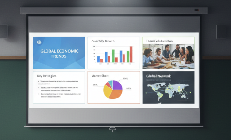

[TOC]

# MF1443 - Unidad 3 - Diseño y elaboración de materiales y presentaciones multimedia

## Introducción

Esta unidad se centra en el uso del **proyector multimedia** como recurso didáctico. Explica su manejo, ubicación adecuada y recomendaciones de uso, además de las **presentaciones multimedia** como herramienta de apoyo en el aula. También incluye pautas sobre **prevención de riesgos laborales** y **protección del medioambiente** en relación con estos medios.

{img-preview}

**Objetivo**
El objetivo es que el alumnado adquiera la capacidad de:

- 📽️ Manejar el proyector multimedia en contextos formativos.
- 🖥️ Diseñar y utilizar presentaciones multimedia como recurso didáctico.
- ⚠️ Aplicar medidas básicas de seguridad laboral y medioambiental en el uso de estos recursos.

**Duración**
La unidad tiene una duración de **15 horas**.

**Relación de contenidos**

1. 📽️ El proyector multimedia.
2. 🏫 Ubicación en el espacio y recomendaciones de uso.
3. 🖥️ Presentación multimedia.
4. 🌱 Medidas de prevención de riesgos laborales y protección del medioambiente.

---

## 1. El proyector multimedia

El proyector multimedia es una herramienta que permite trasladar al aula contenidos digitales de manera clara y compartida. Su utilidad principal es facilitar que todo el grupo pueda visualizar, al mismo tiempo, información procedente de un ordenador u otros dispositivos.

### 1.1. Características principales

Entre sus rasgos más destacados se encuentran:  

- 📽️ Capacidad para mostrar en pantalla imágenes fijas y en movimiento.  
- 🔎 Proyección de contenidos digitales con buena visibilidad para el conjunto del alumnado.  
- 🎛️ Posibilidad de ajustar parámetros como brillo, enfoque o contraste.  
- 🔌 Necesidad de conexión eléctrica y enlace a un equipo externo (ordenador, reproductor, etc.).

### 1.2. Finalidad didáctica 

En el ámbito formativo, el proyector cumple una función clave al:  

- 🎓 Apoyar la exposición de contenidos de forma visual, favoreciendo la comprensión.  
- 👀 Captar y mantener la atención del grupo gracias al refuerzo multimedia.  
- 🖼️ Permitir la integración de diferentes recursos (texto, gráficos, animaciones, sonido).  
- 🤝 Potenciar la participación del alumnado mediante ejemplos mostrados en directo.

### 1.3. Recomendaciones de ubicación  

La correcta instalación del proyector multimedia es fundamental para garantizar una buena visibilidad de la proyección y evitar problemas técnicos o de seguridad. La ubicación influye directamente en la comodidad del alumnado y en la calidad de la imagen proyectada.

- 🏫 Colocar el proyector en un lugar estable, con superficie firme y nivelada.  
- 📏 Situarlo a una distancia adecuada de la pantalla para obtener el tamaño correcto de la imagen.  
- 🌅 Procurar que no haya luz solar directa sobre la pantalla, ya que reduce la visibilidad.  
- 👁️ Asegurarse de que toda la clase pueda ver la proyección sin obstáculos visuales.  
- 🌬️ Dejar espacio suficiente para la ventilación, evitando cubrir las rejillas.  
- 🔌 Verificar que los cables de alimentación y conexión no queden en zonas de paso para prevenir accidentes.  
- 🖼️ Utilizar una superficie blanca, lisa y mate como pantalla para una mejor calidad de imagen.  
- ⬜ Si la pantalla no se encuentran en un ángulo de 90º, podemos corregir el efecto trapezoide con la función *keystone* que disponen la mayoría de proyectores.

### 1.4. Recomendaciones de uso  

- ⏳ Encender el proyector con antelación para que la lámpara alcance el brillo óptimo.  
- 🔄 Apagarlo siguiendo el procedimiento adecuado y dejar que el ventilador enfríe la lámpara antes de desenchufar.  
- 🧹 Mantener los filtros y lentes limpios para evitar pérdida de luminosidad.  
- ⚠️ No mover el aparato mientras esté encendido o recién apagado.  
- 💡 Sustituir la lámpara siguiendo siempre las indicaciones del fabricante.
- ⏱️ No se debe proyectar más de 20 minutos seguidos. Puede distraer mucho.

> [!caution]
>
> **Evitaremos**
>
> - Manipular la lámpara cuando esté caliente.  
> - Encender y apagar el proyector de forma continua en periodos muy cortos.  
> - Mover el proyector mientras esté encendido o recién apagado.  

> [!tip]
>
> **Recuerda**
>
> - Dejar enfriar el proyector antes de cambiar la lámpara.  
> - Mantener limpios los filtros y ranuras de ventilación.  
> - Sustituir la lámpara cuando muestre signos de desgaste o indique el aviso correspondiente.

---

## 2. La presentación multimedia

La presentación multimedia es un recurso didáctico que combina distintos elementos —texto, imágenes, gráficos, animaciones, sonido o vídeo— para transmitir información de forma clara y atractiva. Su diseño y uso correcto son fundamentales para captar la atención del alumnado y facilitar el aprendizaje.

### 2.1. Objetivos

Antes de diseñar la presentación, hay que **clarificar su propósito**, teniendo presentes el **objetivo del módulo**, el de la **unidad didáctica** y el de **cada sesión**. Para concretarlo, formula estas preguntas:

- ❓ **¿Qué espero lograr con la presentación?**
- 🎯 **¿Qué aspectos son más importantes para la consecución de los objetivos?**
- 🧭 **¿Qué contenidos son realmente importantes y cuáles son secundarios?**

### 2.2. Contenidos

El guion de contenidos debe ajustarse a criterios didácticos y a la programación del curso. Para decidir **qué mostrar** y **con qué profundidad**, pregúntate:

- 📦 **¿Qué contenidos vamos a transmitir?**
- 👩‍🏫 **¿Qué saben los alumnos?**
- ⏱️ **¿Qué profundidad daremos a los contenidos y cuánto tiempo tenemos?**
- 🧱 **¿Podemos estructurarlos de lo general a lo particular, cronológicamente, etc.?**

> [!note] 
> La técnica **Pecha Kucha** ayuda a evitar presentaciones demasiado largas y diapositivas con exceso de información: ~20 diapositivas × ~20 segundos cada una (≈7 minutos en total).

### 2.3. Diseño de diapositivas

Al diseñar las diapositivas debemos prestar atención a varios aspectos: **composición, texto, color, imagen, animación y sonido**.

#### 2.3.1. Composición
La composición consiste en organizar adecuadamente los elementos gráficos dentro de la diapositiva, de manera que su relación aporte significado y transmita un mensaje claro al alumnado.  
Aspectos clave:  
- 📏 **Claridad**: cuanto menor sea el número de elementos, más atractivo resultará. El exceso de información dificulta la lectura y comprensión.  
- 🔗 **Unidad**: los elementos deben ordenarse en función del todo, de la idea principal.  
- ✨ **Énfasis**: destacar un elemento dentro del conjunto (con tamaño, color o espacio).  
- ⚖️ **Equilibrio**: armonía en la distribución. Los elementos a la derecha y arriba tienen mayor peso visual, mientras que los de la izquierda o abajo aportan ligereza.  

#### 2.3.2. Texto
Aspectos relevantes sobre el uso del texto en las diapositivas:  
- 🔤 Se recomienda tipografía **sans serif** (palo seco).  
- 📝 Limitarse a un máximo de **tres tipos de fuente** (encabezados, elementos principales y secundarios).  
- 📏 Tamaños habituales: **18–25 pt** para cuerpo de texto, **30–35 pt** para títulos.  
- ✂️ Cada diapositiva debe centrarse en **una sola idea** y no superar **ocho líneas**.  
- 🚫 Evitar versales y mayúsculas en todo el texto; usarlas solo para resaltar. También evitar cursivas prolongadas.  

#### 2.3.3. Color
El color define el fondo y contribuye a resaltar palabras o frases importantes:  
- 🎨 Puede usarse para **identificar contenidos** y facilitar la comprensión.  
- 🖼️ Los programas traen **plantillas y combinaciones** que pueden aprovecharse.  
- ⚠️ Evitar diapositivas muy coloreadas, que generan rechazo visual.  

#### 2.3.4. Imagen fija y en movimiento
Las imágenes cumplen una doble función:  
- 🧠 **Cognitiva**, al sintetizar contenidos.  
- 📝 **Mnemotécnica**, al facilitar el recuerdo.  
Formatos habituales: `.jpg`, `.bmp` y `.gif` (estos últimos pueden ser animados, pero no conviene abusar de ellos).  

#### 2.3.5. Animación
Las animaciones deben usarse con mesura:  
- ⏱️ No abusar de transiciones ni efectos; emplearlos solo cuando aporten valor.  
- 🚫 Evitar efectos llamativos que distraigan.  
- 🎯 Usarlas para que los elementos aparezcan en el momento adecuado de la explicación.  

#### 2.3.6. Sonido
El sonido puede reforzar la presentación, pero debe usarse con cuidado:  
- 🎶 La música puede crear un clima positivo, pero su uso abusivo dificulta la atención.  
- 🎤 Las **narraciones o voz en off** son un recurso útil: pueden sustituir la explicación del docente o ejemplificar aspectos (ej. pronunciación en idiomas).

### 2.4 Estructuración

La estructuración consiste en **ordenar los contenidos de una unidad didáctica** para que tengan sentido y sean fáciles de seguir.  

#### Partes de una presentación 
- **📖 Introducción**: presenta el tema y conecta con lo que ya saben los alumnos.  
- **🛠️ Desarrollo**: aquí se trabajan los contenidos principales.  
- **✅ Conclusión**: sirve para resumir y reforzar lo aprendido.  

#### Formas de estructurar una presentación
- **➡️ Lineal**: los temas se presentan uno tras otro, en orden.  
- **⭐ En estrella**: se parte de un núcleo central y se ramifican distintos subtemas.  
- **🌳 En árbol**: parte de una idea general que se va desglosando en ideas más específicas.  

> [!tip]
>
> - Ordenar las diapositivas para que el contenido nuevo sea fácil de asimilar.
> - Evitar **saltos atrás** que mezclen o confundan contenidos.
> - Evitar **saltos paralelos** que interrumpan con temas ajenos al que se está trabajando.

### 2.5. Secuenciación de la presentación

La secuenciación consiste en organizar las diapositivas de forma que la información se presente de manera clara, lógica y accesible para el alumnado. Es fundamental evitar confusiones y planificar la progresión de contenidos.

**Aspectos clave a tener en cuenta**

- 📑 Ordenar las diapositivas para que el alumnado pueda asimilar los contenidos sin dificultad.  
- ⛔ Evitar los **“saltos atrás”**, que generan confusión al retroceder sobre lo ya expuesto.  
- ⛔ Evitar los **“saltos paralelos”**, que interrumpen la explicación con temas que no corresponden.  
- 🧾 Numerar temas y subtemas ayuda a visualizar el conjunto de la presentación.  

**Formas de esquematización**

- 🔄 De lo general a lo particular.  
- 🔼 De lo particular a lo general.  
- 🧩 Presentando las partes del todo.  
- ⏳ De forma cronológica.  
- 🧠 Mediante mapas mentales.  

**Momentos de ejecución de la presentación**
1. 🚀 **Comienzo**: diapositivas introductorias, llamativas y poco densas, que capten la atención y presenten la unidad.  
2. 📚 **Desarrollo**: se presentan los contenidos con mayor nivel de abstracción. Se incorporan actividades para comprobar la comprensión y reforzar el aprendizaje.  
3. 🎯 **Conclusión**: una diapositiva final que recapitule el contenido trabajado y ofrezca una visión de conjunto. También puede servir como reflexión final de los contenidos.

### 2.6. Elaboración de presentaciones multimedia respetando la normativa sobre propiedad intelectual

Al diseñar presentaciones multimedia es imprescindible respetar los derechos de autor y la legislación vigente en materia de propiedad intelectual. El uso inadecuado de materiales puede tener consecuencias legales y éticas.

**Aspectos clave**

- ⚖️ No se pueden utilizar materiales de terceros (textos, imágenes, gráficos, vídeos, música) sin autorización expresa de su autor o sin la correspondiente licencia.  
- 📢 Siempre que se empleen recursos ajenos, se deben **citar las fuentes** de manera clara.  
- 🆓 Es recomendable utilizar materiales procedentes de bancos de recursos con licencias abiertas (ej. Creative Commons).  
- 📑 Los documentos y materiales elaborados en el contexto de la formación deben ser originales, o bien emplear recursos libres de derechos.  
- 🚫 Queda prohibido el plagio o la reproducción total/parcial de obras sin permiso.  

> [!caution]
> Respetar la propiedad intelectual no solo es una obligación legal, también fomenta la honestidad académica y profesional.

####  Licencia Creative Commons

> [!important]
>
> **Creative Commons**, fundada en 2001, es una organización sin ánimo de lucro que surgió para responder a la necesidad de muchos desarrolladores y creadores de contenido que querían **compartir su trabajo libremente**, sin las limitaciones que imponían los derechos de autor automáticos.
>
> Su lema es: **"Compartir, Volver a mezclar, Reutilizar-Legalmente"**.

### 2.7. Utilización de aplicaciones informáticas para diseño de presentaciones multimedia
Hoy en día existen múltiples herramientas, tanto de escritorio como online, que permiten crear presentaciones atractivas e interactivas. Algunas de las más utilizadas son:  

- **PowerPoint** → La aplicación clásica de Microsoft Office para crear presentaciones. Muy extendida en el ámbito académico y profesional.  
  👉 [Microsoft PowerPoint](https://www.microsoft.com/microsoft-365/powerpoint) (de pago, dentro de Office 365).  

- **Prezi** → Ofrece un estilo de presentación dinámico y no lineal, con zooms y desplazamientos entre ideas. Ideal para exposiciones más visuales.  
  👉 [Prezi](https://prezi.com) (versión gratuita limitada).  

- **Canva** → Herramienta online muy versátil, con plantillas modernas y fáciles de personalizar. Permite crear presentaciones, pósters, infografías y más.  
  👉 [Canva](https://www.canva.com) (gratuita con opción premium).  

- **Google Slides** → Alternativa gratuita a PowerPoint, basada en la nube. Permite trabajar en equipo en tiempo real desde cualquier dispositivo.  
  👉 [Google Slides](https://www.google.com/slides/about/) (gratis con cuenta de Google).  

- **Genially** → Plataforma española que permite crear presentaciones, infografías y materiales interactivos con elementos animados.  
  👉 [Genially](https://genial.ly) (gratuita con versión premium).  

- **Piktochart** → Centrada en la creación de infografías, pero también permite generar presentaciones con un enfoque muy visual.  
  👉 [Piktochart](https://piktochart.com) (gratuita con opción premium).  

- **Emaze** → Herramienta online para crear presentaciones animadas y visualmente atractivas con plantillas predefinidas.  
  👉 [Emaze](https://www.emaze.com) (gratuita con versión premium).  

- **Teetree Office** → Menos conocida; es una suite de oficina gratuita y de código abierto. Su herramienta de presentaciones es sencilla, similar a PowerPoint básico.  
  👉 [Teetree Office](https://teetreeoffice.com) (gratis).  

- **Visme** → Plataforma para diseñar presentaciones, informes y contenido visual interactivo. Ofrece plantillas modernas y elementos gráficos.  
  👉 [Visme](https://www.visme.co) (gratuita con opción premium).  

---

## 3. Medidas de prevención de riesgos laborales y protección del medioambiente

El uso de proyectores y presentaciones multimedia conlleva una serie de riesgos asociados al trabajo docente:

### 3.1. Contenido de las presentaciones multimedia
En el diseño de materiales debemos cuidar la presentación de los textos y gráficos en pantalla:  
- 🔤 Configurar el tamaño de letra de modo que sea claramente visible y no provoque fatiga visual.  
- 🎨 Emplear colores poco brillantes y que no parpadeen.  

### 3.2. Utilización de pantallas de visualización de datos
Para prevenir problemas derivados del uso continuado de pantallas conviene seguir estas pautas:  
- 🪑 Evitar mantener posturas estáticas durante largos periodos. Sentarse erguido, con un asiento estable y regulable en altura.  
- 📐 Disponer de un puesto de trabajo con espacio suficiente para variar de postura y realizar movimientos cómodos.  
- 💡 Ajustar el nivel de iluminación a la tarea, evitando reflejos directos sobre la pantalla.  
- 🔆 Configurar adecuadamente el brillo y el contraste.  
- 🖱️ Usar alfombrillas con apoyo para la muñeca, reduciendo la tensión al manejar el ratón.  

### 3.3. Contactos eléctricos
Las normas básicas en el manejo de equipos eléctricos son:  
- ⚡ Mantener los cables sujetos por paredes o techos, sin que crucen zonas de paso.  
- 🔍 Comprobar siempre que el equipo está en buen estado antes de usarlo.  
- 🚫 No utilizar aparatos o instalaciones con defectos visibles; comunicar cualquier incidencia.  
- 🔌 Asegurarse de que la toma de corriente es adecuada antes de conectar un equipo.  
- ⛔ Desconectar tirando de la clavija, nunca del cable.  

### 3.4. Estrés laboral
El estrés es otro riesgo a considerar, ya que puede generar síntomas físicos y psicológicos. Para prevenirlo, podemos actuar en dos frentes:  
1. 🗂️ Reducir las fuentes de estrés (por ejemplo, una mala organización del trabajo).  
2. 💪 Aumentar la resistencia personal al estrés y la capacidad de controlarlo una vez aparezca.  

> [!important]  
> Para prevenir la fatiga física, mental y visual, además del estrés, es recomendable hacer **pequeñas pausas frecuentes** y practicar **ejercicios de relajación muscular**.  

### 3.5. La calidad ambiental
La calidad ambiental en centros de formación debe cuidarse a diario, buscando reducir impactos negativos. Los objetivos principales son:  
- 🌍 Preservar los recursos naturales reduciendo consumos innecesarios y la contaminación.  
- ♻️ Disminuir costes y volumen de residuos mediante reducción, reutilización y reciclaje.  

Aspectos prácticos a tener en cuenta:  
- 💡 Fomentar el ahorro energético: usar equipos de bajo consumo, aprovechar la luz natural, instalar LFC o LED en lugar de fluorescentes.  
- 📦 Vigilar el consumo de materiales: papel, productos de limpieza, cartuchos de tinta, memorias USB.  
- 🔇 Controlar el ruido ambiental y aplicar medidas de aislamiento si es necesario.  
- 🌬️ Mantener ventilación adecuada; cerrar ventanas cuando funcione la calefacción.  
- 📑 Priorizar el uso de archivos electrónicos frente a la impresión en papel.  
- ✅ Escoger productos respetuosos con el medioambiente (limpiadores de pantallas, rotuladores, tóners, etc.).  
- 🖥️ Configurar ordenadores y proyectores para que entren en modo reposo tras periodos de inactividad.  
- 🔋 Utilizar pilas o baterías recargables.  
- 🔌 Desconectar cargadores y transformadores cuando no se utilicen.  
- 💻 Priorizar el uso de portátiles frente a ordenadores de sobremesa por su menor consumo.  
- ☁️ Valorar el uso de **cloud computing** para optimizar recursos y reducir gasto energético.

---

## Resumen

- 📽️ Los **proyectores multimedia o cañones** son equipos electrónicos que, conectados a un ordenador, permiten mostrar imágenes en gran tamaño sobre una superficie clara (pared blanca, tela, papel).  
- 🎓 Su **finalidad didáctica** en la modalidad presencial incluye:  
  1. Adaptarse al ritmo de aprendizaje del alumnado.  
  2. Facilitar la secuenciación de la información.  
  3. Ofrecer flexibilidad en distintos usos y contenidos.  
  4. Dar una respuesta rápida, con acceso a recursos de Internet o documentos (Word, Excel, etc.).  
  5. Resultar muy eficaz en la exposición de la información.  
  6. Asegurar calidad en la representación de los contenidos.  
- 🏫 El proyector puede colocarse **en el techo, sobre una mesa o en un atril**, proyectando sobre una pantalla opaca (proyección) o translúcida (retroproyección).  
- 🖥️ Para diseñar una **presentación multimedia** se deben considerar:  
  - Los objetivos.  
  - Los contenidos.  
  - El diseño de las diapositivas.  
  - La estructura de la presentación.  
- 🎨 En el diseño de diapositivas se deben cuidar aspectos de: **composición, texto, color, imagen, animación y sonido**.  
- 📂 La estructura básica de una presentación es: **introducción, desarrollo y conclusión**.  
- ⏳ En la práctica docente, es necesario planificar qué diapositivas se mostrarán en cada momento y evaluar los resultados una vez finalizada la sesión.  
- ⚖️ La creación de materiales multimedia a partir de obras de otros autores tiene implicaciones legales:  
  - El **Texto Refundido de la Ley de Propiedad Intelectual (art. 32)** permite ciertos usos educativos (cita, análisis, uso docente, obras ya divulgadas, mención expresa de autoría).  
  - **Creative Commons** ofrece licencias que facilitan la difusión de creaciones (textos, música, audiovisuales, materiales educativos, etc.), garantizando tanto el uso como los derechos de autoría.

---

## Glosario

**Animación**  
Efecto visual aplicado a objetos de una diapositiva (texto, imágenes, gráficos) que permite mostrar, mover o resaltar elementos durante la presentación.

**Cloud computing**  
Modelo de uso de recursos informáticos (programas, archivos, servicios) a través de internet, sin necesidad de instalarlos ni almacenarlos localmente.

**Composición**  
Distribución de los elementos dentro de una diapositiva, cuidando aspectos de claridad, unidad, énfasis y equilibrio para facilitar la comprensión.

**Creative Commons (CC)**  
Sistema de licencias que permite a los autores compartir sus obras con distintos niveles de permisos de uso, reutilización y modificación, siempre respetando su autoría.

**Equilibrio (visual)**  
Armonía en la colocación de los elementos en una diapositiva. Los situados arriba o a la derecha transmiten mayor peso visual que los situados abajo o a la izquierda.

**Énfasis**  
Técnica para destacar un elemento dentro de una diapositiva mediante el uso de tamaño, color, posición u otros recursos visuales.

**Keystone (corrección trapezoidal)**  
Función de los proyectores que corrige la distorsión de la imagen cuando el proyector no está perfectamente alineado con la pantalla.

**Licencia de propiedad intelectual**  
Normativa que regula los derechos de uso, copia, distribución y modificación de las obras (textos, imágenes, vídeos, música, etc.).

**Pecha Kucha**  
Técnica de exposición que consiste en presentar aproximadamente 20 diapositivas durante 20 segundos cada una, evitando presentaciones demasiado largas o sobrecargadas.

**Proyector multimedia**  
Equipo electrónico que proyecta en gran tamaño la imagen de un ordenador u otro dispositivo sobre una superficie clara (pared, pantalla, tela).

**Sans serif (tipografía de palo seco)**  
Fuente tipográfica sin remates en los extremos de las letras. Se recomienda en presentaciones por su claridad y legibilidad.

**Secuenciación**  
Ordenación lógica de las diapositivas para que los contenidos se presenten de forma clara y progresiva, evitando confusión en el alumnado.

**Unidad**  
Relación de coherencia entre los elementos de una diapositiva, de modo que todos se orienten hacia la idea principal.

---

# Ejercicios

## Ejercicio 12: Completa el texto. Proyector.

Los **`proyectores multimedia`** o "cañones" son **`equipos electrónicos`** que, conectados a **`un ordenador`**, permiten mostrar imágenes en un tamaño más grande que en **`la televisión`**, o en una cámara. Para ello precisan de una **`superficie lisa y clara`** que podemos improvisar con una tela, un papel o, simplemente, con una **`pared de color claro`**.

---

## MF1443_3:E8. Actividad Individual  Supervisada por el Tutor asociada al CE1.3 y  CE3.4 (Unidad de Aprendizaje 3, Epígrafe 2.4.6)  Actividad evaluable

PDF aparte.

---

## MF1443_3: E9. Práctica asociada al CE3.7 (Unidad de Aprendizaje 3, Videoactividad a continuación del Epígrafe 2.4.6) Actividad evaluable

PDF aparte.

---

## Ejercicio 13: Completa el texto. Funciones de la presentación

En una presentación, las imágenes van a cumplir una función **`cognitiva`** al permitir sintetizar los contenidos y una función **`mnemotécnica`** al facilitar el recuerdo en las personas destinatarias.

---

## MF1443_3: E10. Actividad Individual Supervisada por el Tutor asociada al CE3.3, CE3.5, CE4.3 y CE4.4 (Unidad de Aprendizaje 3, Epígrafe 2.8.2) Actividad evaluable

PDF aparte.

---

## 🧑‍🏫Test final - Unidad 3

**1) La función Keystone o trapecio es:**  
a) Es la función de que disponen los proyectores multimedia para corregir la geometría de la proyección.  
b) Es la función que permite realizar una proyección desde atrás en una pantalla traslúcida.  
c) Es una función que en los proyectores más modernos no existe.  
d) Es la función por la que el proyector se sitúa a una distancia determinada de la pantalla.  

**2) El color es uno de los aspectos a los que prestar atención para el diseño de diapositivas porque:**  
a) Permite llamar la atención sobre palabras o frases.  
b) Cumple una función cognitiva al fijar en la retina las imágenes.  
c) Resulta recomendable el uso de colores oscuros.  
d) Las diapositivas con muchos colores resultan más efectivas.  

**3) Esta licencia Creative Commons permite a otros realizar trabajos derivados pero únicamente bajo una licencia idéntica:**  
a) Atribución.  
b) Igualmente compartido.  
c) No Comercial.  
d) No derivación del trabajo.  

**4) A la hora de determinar la secuencia de diapositivas o la estructura de nuestra presentación debemos:**  
a) Ordenar las diapositivas.  
b) Evitar dar "saltos atrás".  
c) Evitar los "saltos paralelos".  
d) Todas son correctas.  

**5) El tamaño para el cuerpo del texto de las diapositivas suele oscilar entre:**  
a) Los 10-12 puntos.  
b) Los 18-25 puntos.  
c) Los 20-22 puntos.  
d) Los 25-30 puntos.  

**6) En esta estructura de una diapositiva podemos acceder a todas las demás y regresar a la primera:**  
a) De forma lineal.  
b) En forma de estrella.  
c) En forma de árbol.  
d) Ninguna es correcta.  

**7) ¿Qué significa el símbolo utilizado en Creative Commons que representa un signo de igual dentro de un círculo?:**  
a) Atribución.  
b) No Comercial.  
c) No derivación del trabajo.  
d) Igualmente compartido.  

**8) Una de las medidas preventivas que podemos adoptar en relación a los riesgos de fatiga física, mental y visual es:**  
a) Evitar posturas estáticas mantenidas durante un tiempo excesivo.  
b) Realizar con frecuencia pequeñas pausas.  
c) Contar con un puesto de trabajo con una buena iluminación.  
d) Contar con un puesto de trabajo con dimensiones suficientes para variar de postura.  

**9) Cuando prestamos atención a la composición de una diapositiva atendemos a:**  
a) El color y la imagen.  
b) La claridad, unidad, énfasis y equilibrio.  
c) Al texto, la imagen y la animación y sonido.  
d) Ninguna es correcta.  

**10) En cuanto a la calidad ambiental tenemos que tener en cuenta:**  
a) El consumo eléctrico.  
b) El nivel de ruido.  
c) Vigilar la utilización de recursos y materiales.  
d) Todas son correctas.  

---

✅ Respuestas correctas y justificación

**1) a) Es la función de que disponen los proyectores multimedia para corregir la geometría de la proyección.**  
Corrige la distorsión trapezoidal de la imagen.  

**2) a) Permite llamar la atención sobre palabras o frases.**  
El color se usa para resaltar lo importante, no para saturar.  

**3) b) Igualmente compartido.**  
La cláusula *Share Alike (SA)* obliga a mantener la misma licencia en los trabajos derivados.  

**4) d) Todas son correctas.**  
Ordenar, evitar retrocesos y saltos paralelos son reglas básicas de secuenciación.  

**5) b) Los 18-25 puntos.**  
Es el rango recomendable para asegurar legibilidad en proyección.  

**6) b) En forma de estrella.**  
Desde la diapositiva central se puede ir a cualquier otra y regresar.  

**7) c) No derivación del trabajo.**  
El símbolo “=” indica que no se pueden hacer obras derivadas.  

**8) b) Realizar con frecuencia pequeñas pausas.**  
Las pausas ayudan a evitar fatiga física, mental y visual.  

**9) b) La claridad, unidad, énfasis y equilibrio.**  
Son los principios básicos de la composición de diapositivas.  

**10) d) Todas son correctas.**  
La calidad ambiental abarca ruido, consumo eléctrico y uso de recursos.  

