[TOC]

# MF1444 - Impartición y tutorización de acciones formativas para el empleo

# UF1645 - Impartición de acciones formativas para el empleo

# Unidad 01 - Aspectos psicopedagógicos del aprendizaje en formación profesional para el empleo

## Introducción

En esta primera unidad aprenderás cómo funciona el proceso de enseñanza–aprendizaje y cuáles son los elementos que intervienen en él.

El objetivo es comprender cómo aprenden las personas adultas y qué papel juega el formador o la formadora en ese proceso.

Para lograrlo:

- 🔍 Analizaremos el perfil del alumnado adulto y sus características más relevantes.  
- 💡 Estudiaremos las principales técnicas de motivación que pueden aplicarse en el aula.  
- 💬 Veremos la importancia de la comunicación como herramienta esencial para el éxito de la formación.  

> [!note]
>
> **Objetivo de la unidad:**  
> Identificar estrategias que faciliten el aprendizaje en personas adultas antes y durante la acción formativa.

---

## 1. Aspectos generales

> [!important]
> La formación continua es un pilar fundamental para cualquier profesional. Gracias a ella, las personas pueden mantener actualizadas sus competencias, mejorar las que ya tienen y adquirir otras nuevas que les permitan adaptarse a los cambios del entorno laboral.

En la **Formación Profesional para el Empleo (FPE)**, las personas adultas son las verdaderas protagonistas del proceso. A través de la formación, desarrollan sus conocimientos, habilidades y actitudes profesionales, al mismo tiempo que contribuyen al progreso económico, social y cultural de la sociedad.

La Formación Profesional para el Empleo tiene varias finalidades importantes:

- 🎯 Favorecer la formación a lo largo de toda la vida, tanto de las personas trabajadoras ocupadas como de las que están en desempleo.  
- 💡 Proporcionar los conocimientos y competencias que demanda el mercado de trabajo actual.  
- 🚀 Mejorar la **empleabilidad**, es decir, las posibilidades de acceder, mantenerse y progresar en el empleo.  
- 🧩 Promover que las competencias profesionales puedan ser **acreditadas oficialmente**, reconociendo la experiencia y los aprendizajes adquiridos.

> [!tip]
> Estas finalidades permiten que la formación se convierta en una herramienta de desarrollo personal y profesional, impulsando una cultura de **aprendizaje permanente** y de adaptación continua a las nuevas realidades del trabajo.

---

## 2. El proceso de enseñanza–aprendizaje de la formación de personas adultas

### 2.1. Binomio enseñar y aprender

#### 2.1.1. Introducción

En muchos contextos educativos se habla del **proceso de enseñanza–aprendizaje**, destacando la relación que existe entre ambos conceptos. Por ello, es necesario analizar qué significan y cómo se complementan.

Según Tom (1984), *“la enseñanza es una actividad intencional, diseñada para dar lugar al  aprendizaje de los alumnos”*. Esto significa que no se trata solo de dar instrucciones, sino de crear relaciones y acciones dentro de un contexto educativo que conduzcan realmente al aprendizaje.

Tradicionalmente se ha entendido la enseñanza como un proceso centrado en el docente, que transmite conocimientos y el alumnado recibe de forma pasiva. Sin embargo, esta idea ha ido cambiando con el tiempo: hoy se entiende que **enseñar y aprender no siempre son consecuencias directas una de la otra**.  

Fenstermacher señaló que *no siempre que alguien enseña, alguien aprende*, y que solo podemos hablar realmente de enseñanza cuando existe una reacción de aprendizaje en el alumno o alumna.

> [!note] 
> Enseñar y aprender forman un binomio inseparable, pero no automático. Enseñar no garantiza que se produzca aprendizaje; depende de la implicación, el contexto y las estrategias empleadas.

---

#### 2.1.2. La enseñanza

La función principal de la enseñanza es **facilitar que el alumnado aprenda**.

Fenstermacher (1989) la definió como:  
> *“Un acto entre dos o más personas —una de las cuales sabe o es capaz de hacer más que la otra— comprometidas en una relación con el propósito de transmitir conocimiento o habilidades.”*

Esto implica que la enseñanza es un proceso intencional y social, donde se intercambian saberes, experiencias y valores.  
El papel del docente no es solo transmitir información, sino **crear las condiciones adecuadas para que el aprendizaje ocurra**: planificar, guiar, acompañar, motivar y evaluar el progreso del alumnado.

> [!tip]
> El verdadero objetivo de enseñar no es “explicar bien”, sino lograr que el alumnado aprenda con sentido y pueda aplicar lo aprendido.

---

#### 2.1.3. El aprendizaje

##### 2.1.3.1. Conceptos

El aprendizaje puede definirse como el **proceso mediante el cual el alumno responde a la acción de la enseñanza**, produciendo un cambio respecto a su estado anterior.  
Ese cambio puede manifestarse en:

- 📖 Conocimientos  
- 🧩 Comprensión  
- ⚙️ Hábitos
- 🛠️ Destrezas
- 💭 Intereses  
- 🎯 Aptitudes
- 🧠 Percepción

Según Contreras (1991), *“el aprendizaje es el resultado de asumir y desempeñar el papel de alumno, no un efecto que se sigue de la enseñanza como causa”*.  
Esto significa que aprender requiere una **implicación activa** por parte del estudiante: no se “recibe” el conocimiento, sino que se **construye**.

Existen distintas teorías del aprendizaje —conductismo, cognitivismo y constructivismo— que ayudan a explicar cómo se produce este proceso (y que veremos más adelante). En la actualidad, la **perspectiva constructivista** es la más utilizada en formación de adultos, porque considera que el alumno aprende **construyendo su propio conocimiento** a partir de su experiencia previa.

| Paradigma       | Aprendizaje                  | Enseñanza                               | Foco instruccional                                           | Resultados                                 |
| --------------- | ---------------------------- | --------------------------------------- | ------------------------------------------------------------ | ------------------------------------------ |
| Conductista     | Adquisición de respuestas    | Suministro de feedback                  | Centrado en los contenidos (conductas correctas)             | Cuantitativos (fuerza de las asociaciones) |
| Cognitivista    | Adquisición de conocimientos | Transmisión de la información           | Centrado en los contenidos y la enseñanza (información apropiada) | Cuantitativos (cantidad de información)    |
| Constructivista | Adquisición de significado   | Orientación del procesamiento cognitivo | Centrado en el estudiante (procesamiento significativo)      | Cualitativos (estructura del conocimiento) |

> [!note]
> En la formación de personas adultas, el aprendizaje se basa en la participación activa, la reflexión y la relación con la experiencia laboral o vital del alumnado.

---

##### 2.1.3.2. Proceso formativo

El aprendizaje es un **proceso de construcción personal y progresiva**.  
Cada participante en la formación aporta sus conocimientos previos, que sirven de base para integrar los nuevos aprendizajes. Por eso, el protagonismo del proceso recae más en el aprendizaje que en la enseñanza.

El proceso formativo se entiende como un conjunto de acciones que dan lugar a una **transformación**:

- 🔄 Permite construir una nueva perspectiva sobre los contenidos, procedimientos y actitudes que ya se conocían.  
- 📚 Incluye la transmisión de conocimientos **teóricos**, **prácticos** y **actitudinales**.  

> [!important]
> Aprender no es acumular información, sino integrar lo nuevo en lo que ya sabemos, dándole sentido y aplicación práctica.

---

##### 2.1.3.3. Procesos de enseñanza–aprendizaje

Contreras (1991) define los procesos de enseñanza–aprendizaje como:  
> *“Sistemas de comunicación intencional que se producen en un marco institucional y en los que se generan estrategias encaminadas a provocar el aprendizaje.”*

A partir de esta definición, se destacan tres ideas clave:

1. 🏫 Ocurren dentro de un **contexto institucional** (ya sea formal, no formal o informal).  
2. 💬 Son **sistemas de comunicación humana**, donde intervienen docente y alumnado.  
3. 🎯 Su finalidad principal es **hacer posible el aprendizaje**.

> [!important]
> La importancia del proceso formativo no reside en enseñar mucho, sino en **favorecer que el alumnado aprenda de verdad**, entendiendo, aplicando y reflexionando sobre lo aprendido.

El modelo actual de formación se basa en el concepto de **aprendizaje a lo largo de la vida**, que se apoya en los siguientes principios:

- 👩‍🏫 El docente actúa como **mediador del conocimiento**.  
- 🧠 Las personas adultas **aprenden haciendo**.  
- 👥 Se aprende **en grupo** y **de los demás**.  
- 🔍 La **evaluación** sirve para orientar nuevas estrategias de aprendizaje.  
- 🧾 Se elaboran **planes de aprendizaje individualizados**.  
- 🧑‍💻 Los docentes también son **aprendices permanentes**, actualizando su formación.  
- 🌱 El aprendizaje es un proceso **continuo y accesible** durante toda la vida.

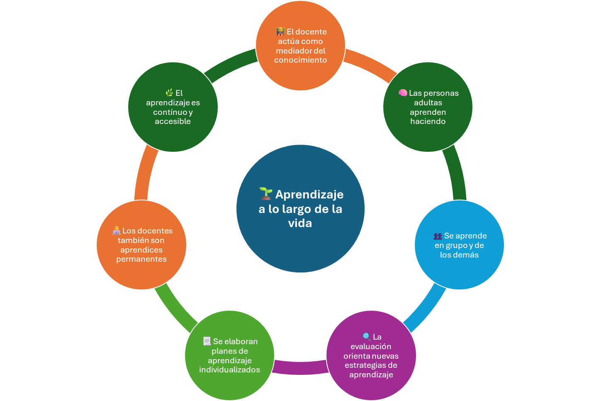

---

##### 2.1.3.4. Aprendizaje permanente

> [!note]
>
> La **Comisión Europea** define el aprendizaje permanente como:
>
> *toda actividad de aprendizaje realizada a lo largo de la vida, con el fin de mejorar los conocimientos, las competencias y las cualificaciones*.

La **educación permanente** considera que la educación es un proceso continuo que dura toda la vida, y que permite a las personas seguir aprendiendo en cualquier etapa.  

Según sus **objetivos**, puede clasificarse en:

- 🧰 **Educación profesional**: orientada a la mejora de la cualificación, la adaptación tecnológica y la movilidad laboral.  
- 🗳️ **Educación política**: dirigida a la comprensión de los derechos y deberes, la participación social y el análisis crítico de la información.  
- ⚖️ **Educación general**: busca la igualdad de oportunidades y la compensación de desigualdades sociales o culturales.  

> [!important]
> La educación permanente implica aprovechar todos los recursos disponibles en la sociedad para favorecer el aprendizaje.  
> Se concibe como una **intervención educativa y social** que ayuda a las personas a ser protagonistas de su propio desarrollo y del de su entorno, con el objetivo final de mejorar su calidad de vida.

Dependiendo de los **recursos y actividades**, la educación permanente incluye acciones de tipo:

- 🎓 **Formativas**: favorecen el desarrollo de la capacidad crítica y la adquisición de conductas positivas en las personas.  
  *Ejemplo:* debates, foros o talleres participativos.  

- 📢 **De difusión**: facilitan el acceso a determinados bienes culturales propios de la comunidad donde se desarrollan.  
  *Ejemplo:* salidas a museos o exposiciones.  

- 🎨 **Artísticas**: fomentan la expresión en todos los sentidos y constituyen una forma de iniciación en los distintos lenguajes creativos.  
  *Ejemplo:* actividades de expresión corporal o artes plásticas.  

- 🎯 **Lúdicas**: promueven el desarrollo corporal, la cooperación y la socialización.  
  *Ejemplo:* excursiones o juegos grupales.  

- 🤝 **Sociales**: impulsan la vida asociativa y responden a las necesidades colectivas de aprendizaje o convivencia.  
  *Ejemplo:* programas de alfabetización o actividades comunitarias.

El aprendizaje permanente abarca **tres tipos** de aprendizaje:

1. 🏫 **Formal**: el que se desarrolla en instituciones educativas regladas y conduce a titulaciones oficiales.  
2. 📘 **No formal**: el que se realiza fuera del sistema educativo formal, como cursos de formación, talleres o seminarios.  
3. 🌍 **Informal**: el que se adquiere de manera espontánea en la vida diaria, en el trabajo o en la convivencia social.

> [!note]
> En la Formación Profesional para el Empleo, el principio del aprendizaje permanente es esencial: cada acción formativa debe entenderse como parte de un proceso continuo de desarrollo personal y profesional.

---

### 2.2. Elementos del proceso formativo: alumnado, docente, materia a impartir, métodos, interacción y contexto

#### 2.2.1. Introducción

En el proceso de enseñanza–aprendizaje intervienen diferentes elementos que se relacionan entre sí.

Estos **elementos** son:

- 👩‍🎓 **El alumnado**  
- 👨‍🏫 **El docente**  
- 📘 **Los contenidos**  
- 🧩 **Los métodos de trabajo**  
- 💬 **La interacción**  
- 🌍 **El contexto** donde se desarrolla la formación

Cada uno de estos elementos influye directamente en el resultado del aprendizaje, por lo que deben analizarse de forma conjunta para lograr una acción formativa eficaz.

> [!note]
> El éxito del proceso de enseñanza–aprendizaje depende del equilibrio entre todos sus elementos: quién enseña, quién aprende, qué se enseña, cómo se enseña y en qué condiciones se hace.

---

#### 2.2.2. Participantes (alumnado)

##### 2.2.2.1. Conceptos generales

Los participantes de los cursos de FPE serán siempre **personas adultas**; por ese motivo, a continuación profundizamos en sus características.

> [!important]
>
> **Definición**  
> El término **adulto** (del latín *adultum*, derivado de *adolescere*) se refiere al individuo que ya ha crecido. 
>
> Podemos entender por **persona adulta** a aquella que ha adquirido un estatus de edad, cierta madurez y autonomía.

**Persona adulta, según distintos enfoques:**

| Enfoque         |                                                              |
| --------------- | ------------------------------------------------------------ |
| **Jurídico**    | A efectos jurídicos el término adulto se corresponde con la llamada “mayoría de edad”, de modo que deja de estar en la sociedad bajo la tutela de otra persona. |
| **Sociología**  | Desde un punto de vista sociológico, el adulto es aquella persona que se encuentra integrada en la sociedad con el ejercicio de sus derechos y deberes. |
| **Psicológico** | Desde la Psicología, el adulto es identificado por la madurez de la personalidad, en cuanto a la estructura de juicio, responsabilidad y dominio de sí misma. |

---

##### 2.2.2.2. Etapas de la adultez

La edad adulta constituye un periodo muy extenso del ciclo vital que, de acuerdo con Levinson (1986), puede subdividirse en cuatro etapas:

- 🧒 **Preadultez (hasta los 17 años):**  
  Rápido cambio **biopsicosocial**: la persona pasa de un desvalimiento total a la capacidad de vivir y comportarse como un adulto libre y responsable.

- 🧑 **Adultez temprana (17–45 años):**  
  Se caracteriza por una **gran vitalidad** (máxima potencialidad) y por un mayor **grado de tensión y estrés**. Supone la **culminación biológica** del periodo vital.  
  En lo **social y psicológico**, es el momento propicio para materializar los deseos e ilusiones juveniles: tener un lugar en la sociedad, crear la propia familia, lograr una función laboral adecuada y un **estatus** valorado. También puede ser la etapa de grandes satisfacciones (amor, sexualidad, vida familiar, vida profesional, creatividad, logro de objetivos).  
  A la vez, es un periodo de **tensiones**: responsabilidades familiares, cargas laborales y económicas, y **decisiones clave** sobre el futuro (matrimonio, religión, trabajo, estilo de vida).

- 👤 **Adultez intermedia (45–65 años):**  
  A nivel **biológico** hay una **disminución** de capacidades físicas respecto a la etapa anterior, aunque se conserva suficiente **vitalidad y energía** para una vida personal y social satisfactoria.  
  En lo **psíquico y social**, es la etapa de la **“generación dominante”** (Ortega): liderazgo en ámbitos **políticos, industriales, científicos, religiosos y artísticos**.

- 👴 **Adultez tardía (65 años en adelante):**  
  Levinson no llega a describirla en su obra; en general, se caracteriza por un **declive gradual** del funcionamiento de los sistemas corporales.

> [!caution]
> Suele intentarse aplicar la **misma metodología** que en la enseñanza escolar, pero la formación de personas adultas exige tener en cuenta sus **características bio-psico-sociales** y sus **experiencias** anteriores, presentes y futuras.

---

##### 2.2.2.3. Características

Al planificar una acción formativa debemos tener en cuenta una serie de **características propias de las personas adultas**. 

- 👶 **La edad:**  
  Cada etapa de la vida adulta presenta unas particularidades que deben considerarse al diseñar la formación. La experiencia, la madurez o los cambios físicos y emocionales influyen en cómo se aprende.

- 💭 **La personalidad:**  
  Las capacidades físicas y sensoriales, junto con las cualidades intelectuales, las motivaciones, los intereses y las actitudes de cada persona, condicionan tanto la planificación de la formación como la actuación del formador o formadora.

- 🎯 **Responsabilidad en su aprendizaje y trabajo:**  
  El adulto genera sus propias pautas y estrategias para aprender. Suele buscar soluciones prácticas y desarrollar métodos personales para enfrentarse a los problemas o tareas que surgen durante la formación.

- 🙋 **Autonomía:**  
  La persona adulta es la protagonista de su propio proceso de aprendizaje. Aprende mejor cuando se le permite decidir, participar y asumir un papel activo en su desarrollo.

> [!note]
> La enseñanza de personas adultas requiere reconocer estas características y adaptar la planificación a sus necesidades, motivaciones y experiencias previas.

> [!tip] 
>
> La **Andragogía**, según *Knowles (1970)*, es la disciplina que se ocupa del estudio del aprendizaje adulto.  
> Haz clic en el siguiente vídeo para ver la explicación de este concepto:
>
> <iframe width="100%" height="315" src="https://www.youtube.com/embed/s9thbe9q2XY?si=MuPHk2KwO1HKz5bU" title="YouTube video player" frameborder="0" allow="accelerometer; autoplay; clipboard-write; encrypted-media; gyroscope; picture-in-picture; web-share" referrerpolicy="strict-origin-when-cross-origin" allowfullscreen></iframe>

---

##### 2.2.2.4. Actitudes

Las personas adultas que participan en acciones de Formación Profesional para el Empleo muestran distintos **intereses, actitudes y motivaciones**.  
Detectar las razones por las que desean aprender es fundamental, ya que condicionará los **objetivos, contenidos y metodologías** que se utilicen.

A continuación se describen algunas de las actitudes más comunes en el alumnado adulto:

- 🚫 **Resistencia:**  
  A menudo, el adulto percibe la novedad como una amenaza y puede mostrar resistencia al cambio.

- 💡 **Interés:**  
  Habitualmente, cuando una persona adulta inicia una acción formativa, lo hace por **iniciativa propia** y con **gran motivación**.

- 🔍 **Curiosidad limitada:**  
  La formación es una herramienta para satisfacer una necesidad concreta.  
  Por eso, el adulto suele querer conocer la **relación entre lo que aprende y su aplicación práctica**.

- ⏳ **Impaciencia:**  
  Puede mostrar **dificultades ante estrategias de aprendizaje** que requieran más tiempo o esfuerzo, prefiriendo resultados visibles a corto plazo.

- 🎯 **Responsabilidad:**  
  Al participar por iniciativa propia, la persona adulta siente un **mayor compromiso e implicación** en su proceso de formación.

- 🤬 **Emotividad:**  
  El **miedo a la frustración o al ridículo** puede aparecer con más intensidad, sobre todo en quienes tienen menos experiencia formativa.

- 🌟 **Motivación:**  
  Las motivaciones son muy diversas: desde el **deseo de promoción profesional** hasta la **satisfacción personal**.

- ✅ **Verificación o evaluación:**  
  El adulto tiende a **comprobar la eficacia de su aprendizaje**, valorando los resultados y su utilidad práctica.

> [!important]
>
> El formador debe conocer también las posibles **barreras de aprendizaje** que puede presentar el alumnado adulto, con el fin de **minimizar su impacto** y favorecer el logro de los objetivos formativos.
>
> Para que el aprendizaje se produzca, el estudiante debe:
>
> - 💭 **Querer aprender:** estar motivado y dispuesto.  
> - 💪 **Poder aprender:** tener la capacidad y los recursos para hacerlo.  
> - 🎓 **Tener un objeto de conocimiento:** saber qué se desea aprender y con qué propósito.

  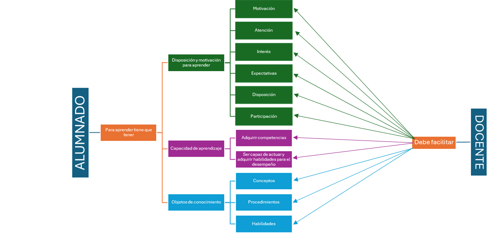{.img-preview} 

---

#### 2.2.3. Docente

##### 2.2.3.1. Conceptos generales

Otro elemento del proceso de enseñanza–aprendizaje es el **docente**. Su función es **hacer posible el aprendizaje**, generando dinámicas y situaciones en las que el alumnado pueda aprender.

> [!tip]
>
> Para ampliar, consulta el RD del certificado en el siguiente enlace:
> https://sede.sepe.gob.es/es/portaltrabaja/resources/pdf/especialidades/SSCE0110.pdf

##### 2.2.3.2. Evolución del docente

En la actualidad, el **rol del docente** ha evolucionado desde una función centrada únicamente en **transmitir conocimientos**, hacia un papel más activo como **facilitador del proceso de aprendizaje**.  
Esto implica que, antes de cada sesión formativa, el formador o formadora **planifica y prepara la sesión** adaptándola a las **características y conocimientos del grupo**.

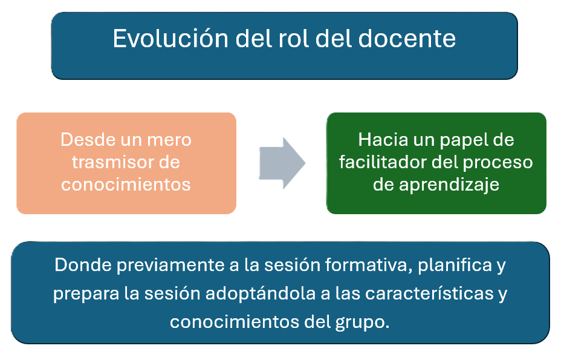

Las actitudes del docente condicionan su influencia pedagógica sobre los participantes.  
El formador se convierte, además, en **transmisor de valores**, entre los que destacan:

- 🤝 **Valores sociales y morales:** orientador y conocedor del grupo; promueve la tolerancia, la autoevaluación, la ayuda mutua y la cooperación.  
- 💼 **Valores profesionales:** actualización constante, dominio de la materia y compromiso con la calidad del proceso formativo.  
- 🎓 **Valores pedagógicos:** uso de metodologías adecuadas, recursos tecnológicos y orientación al aprendizaje.

> [!important]
> Hoy en día es imprescindible que los docentes centren su acción pedagógica en el **apoyo continuado** y en una atención **integral** al alumnado.  
> Un enfoque centrado en el aprendizaje y en el diseño de **escenarios prácticos** permite que las personas adultas adquieran las competencias asociadas a su cualificación profesional.

---

##### 2.2.3.3. Perfil del docente

El perfil del docente para un desempeño eficaz y eficiente se basa en tres grandes bloques: **conocimientos**, **habilidades y destrezas**, y **actitudes**.

- 🎓 **Conocimientos:**  
  El docente debe poseer conocimientos en tres ámbitos:  
  - **Pedagógicos:** conocimientos básicos sobre el grupo y las dinámicas de grupo; sobre el proceso de evaluación, sus técnicas y claves; y conocimientos generales de la empresa y del mundo laboral.  
  - **Técnicos:** dominio de la materia o especialidad que imparte.  
  - **Culturales:** mantener un nivel cultural medio–alto que le permita contextualizar los contenidos y comunicarse eficazmente.

- 🧠 **Habilidades y destrezas:**  
  - Las **habilidades** son el talento, la pericia o la aptitud para desarrollar una tarea, pudiendo ser innatas o adquiridas mediante la práctica.  
  
  - Las **destrezas**, por su parte, se adquieren a través de la práctica, la experiencia y el conocimiento.  
  
  - Entre las más importantes **que debe poseer** el docente destacan:  
    capacidad de análisis y búsqueda de información, planificación, gestión, motivación, comunicación, elaboración de materiales didácticos, dominio de métodos y estrategias de enseñanza, uso de recursos didácticos y aplicación de la evaluación.
  
- 💬 **Actitudes:**  
  Se entienden como una disposición de ánimo hacia determinadas personas, ideas o situaciones, que requieren habilidades de análisis, síntesis y evaluación.  
  Entre las actitudes más necesarias para el docente se encuentran:  
  escucha activa, predisposición a la ayuda, respeto hacia los demás, actitud positiva y entusiasta, comunicación abierta, espíritu democrático, flexibilidad, adaptación, capacidad de investigación, innovación y creatividad, y facilidad para el trabajo en grupo.

Además, el docente debe reunir una serie de **características personales y profesionales** que influyen directamente en el éxito de la acción formativa:

- 🤝 **Empatía:** comprender las necesidades del grupo y mantener una comunicación cercana, positiva y respetuosa con el alumnado.  
- 🧑‍🏫 **Estilo de enseñar:** capacidad para transmitir los contenidos de forma clara, ordenada y comprensible, adaptando el ritmo y el lenguaje a las características del grupo.  
- 🗂️ **Metodología:** manera en que el docente organiza la actividad formativa, estructurando los contenidos y favoreciendo la participación y la aplicación práctica del aprendizaje.

> [!important]
> El formador o formadora es quien **facilita el aprendizaje** al alumnado.  
> Para ello debe planificar y definir los objetivos, preparar las sesiones, seleccionar los recursos y decidir las estrategias más adecuadas.  
> También elaborará una **temporalización de las actividades**, adaptándose a las necesidades y conocimientos previos del grupo.  
> En definitiva, el docente es quien determina la **metodología del curso** y los **métodos más apropiados** para alcanzar los objetivos formativos.

---

#### 2.2.4. El método

En la programación didáctica, además de indicar y planificar los contenidos que se van a impartir, es fundamental **definir la forma en que se va a enseñar**, es decir, responder a la pregunta:  
**¿Cómo enseñar?**

**Método**  
La palabra *método* proviene del griego *meta* (más allá) y *hodos* (camino), y hace referencia al **modo ordenado y sistemático de proceder** para alcanzar un resultado o fin determinado.

**Contexto formativo**  
Hace referencia al conjunto de **instrumentos y acciones que el docente realiza** para alcanzar los objetivos establecidos en el grupo de alumnos y alumnas al que se dirige la formación.

> [!important]
> La implementación y el seguimiento del curso se desarrollan a través de las **acciones docentes**, entendidas como el acompañamiento continuo al proceso de aprendizaje del alumnado.

La **metodología docente** tendrá en cuenta los siguientes aspectos:

- 🗣️ El **estilo de comunicación** que utiliza el docente.  
- 🧠 La **activación de estrategias de aprendizaje** que conduzcan al logro de los objetivos y orienten las situaciones de formación en las que participa el alumnado.  
- 🧰 El **uso de diferentes recursos didácticos** que favorezcan el aprendizaje.  
- 💻 El **uso adecuado y dinámico de los espacios de comunicación**, especialmente en entornos de formación a distancia.

En las acciones formativas de **Formación Profesional para el Empleo (FPE)**, no se puede separar la **teoría de la práctica**.  
Es necesario que el alumnado desarrolle su **autonomía en el aprendizaje** y que las actividades fomenten tanto el **trabajo en grupo** como el **uso de recursos tecnológicos**.

Los adultos aprenden mejor cuando no dependen de la memorización, sino cuando:

1. 🧩 Tienen la oportunidad de **practicar**, aprendiendo a través de la actividad.  
2. ⏱️ La formación se **adapta a su propio ritmo** de aprendizaje.  
3. 🎯 La enseñanza **responde a sus necesidades personales y profesionales**.

---

#### 2.2.5. El contexto (entorno)

##### 2.2.5.1. Características y metodología del entorno

El contexto de la **Formación Profesional para el Empleo (FPE)** se caracteriza por su **flexibilidad**, su capacidad de adaptación a las necesidades que surgen y su conexión con la realidad de los aprendizajes que promueve. Estos aprendizajes están **vinculados con los entornos productivos del mercado laboral** y se centran en las **necesidades e intereses de los participantes**.

> [!important]
> El entorno tendrá características diferentes según se trate de **enseñanza presencial** (aula física) o de **educación online** (plataforma e-learning).

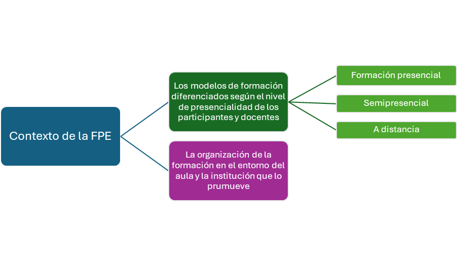El **espacio del aula** influye notablemente en las alternativas metodológicas que el docente puede utilizar. Es una fuente importante de recursos formativos y contribuye al nivel de implicación y satisfacción del alumnado.  

También deben tenerse en cuenta aspectos como:
- 🧑‍💻En **teleformación**, el entorno virtual debe estar concebido y diseñado para permitir distintos tipos de comunicación, acceso a información y recursos, así como a servicios administrativos.
- 🪑 La **disposición del mobiliario**, que condiciona las metodologías posibles.  
- 📚 La existencia de **espacios para el aprendizaje autónomo**, como bibliotecas, ordenadores o zonas para el trabajo en grupo.  

> [!caution]
> El entorno puede convertirse en un **elemento distorsionador** si hay iluminación inadecuada, ruidos, temperatura o ventilación deficientes.

Aunque el entorno físico no determina por sí solo el éxito del aprendizaje, **favorece la eficacia del proceso docente** al facilitar la interacción entre profesorado y alumnado, la adaptación a las necesidades del grupo y la planificación de actividades en un clima adecuado de trabajo.

##### 2.2.5.2. Factores y disposición del entorno

Entre los factores a considerar con respecto al aula se encuentran:
- 📏 Las **dimensiones** del aula.  
- 💡 La **iluminación** del espacio.  
- 🔇 Las **posibles distracciones** (ruidos, interrupciones, entorno visual).  
- 🌡️ La **temperatura** adecuada.  
- 🧱 Las **paredes** y su color o textura, que influyen en la concentración.

La **disposición del aula** influye en el rendimiento, ya que centra la atención visual y mejora la acústica. Además, refleja el tipo de dinámica que el docente considera apropiada: la participación, el contacto entre compañeros o el grado de cercanía con el formador.

Algunas configuraciones del aula pueden ser:
- 👥 **Adecuada para el trabajo grupal.**  
- 🎓 **Adaptada a metodologías expositivas.**  
- 🎬 **Diseñada para la visualización de recursos audiovisuales.**  
- 💬 **Propicia la interacción, el debate y la participación.**

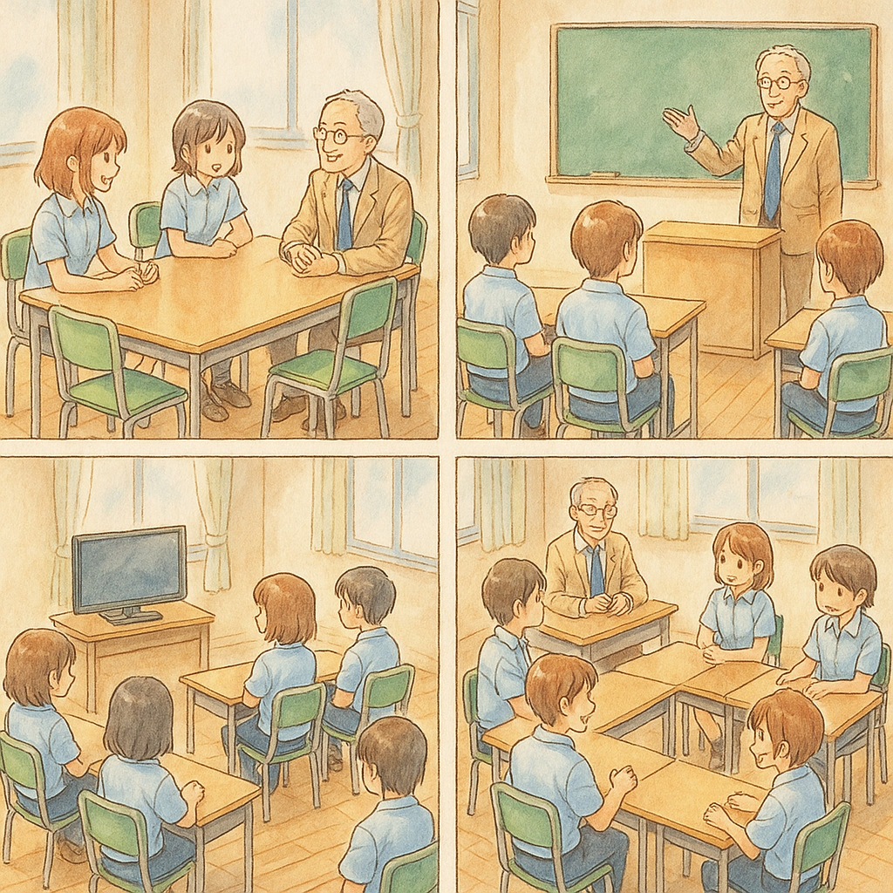

El entorno también varía si el proceso de enseñanza–aprendizaje se desarrolla en **modalidad e-learning**, donde los espacios son virtuales y las herramientas de comunicación sustituyen al aula física.

> [!important]
> En los últimos años se ha producido una **evolución tecnológica** que ha transformado la educación y los escenarios formativos: las aulas presenciales han dado paso a **aulas virtuales**, y las plataformas de e-learning han cambiado los procesos y los roles de sus participantes.

---

#### 2.2.6. La interacción

La interacción entre el **docente y el alumnado**, así como entre los propios **estudiantes**, es fundamental para lograr un **clima propicio de aprendizaje**.

El aprendizaje puede considerarse como el resultado de una **interacción social**.  
A través de ella, el alumnado desarrolla su **inteligencia práctica y reflexiva**, construye e interioriza nuevos conocimientos o representaciones mentales.  

Por ello, es necesario **propiciar el trabajo colectivo**, el **intercambio de opiniones** y la **reflexión conjunta** sobre la experiencia de los participantes.  
La **interacción social** desempeña un papel esencial en los procesos de desarrollo del conocimiento.

> [!important]
> En el contexto de las relaciones interpersonales entre docentes y alumnado, tiene tanta importancia la **comunicación permanente y guiada por objetivos** (componente racional), como la **comunicación centrada en las necesidades emocionales** de las personas adultas.

En la actualización del docente será preciso fomentar:
- 💬 El **intercambio de opiniones**.  
- 👥 **El trabajo colectivo**.  
- 🧩 **La reflexión compartida** en torno a la experiencia de los participantes.

---

#### 2.2.7. Contenidos

##### 2.2.7.1. Conceptos generales

Mediante los contenidos, los estudiantes desarrollan las **capacidades y competencias necesarias** para desempeñar una tarea, función o práctica.

> [!important]
>
> 📢**Definición de contenidos:** Son el **conjunto de conocimientos o formas culturales esenciales** para el desarrollo de capacidades y la socialización de los participantes. Además, determinan las **formas de enseñanza, aprendizaje y evaluación**.

El proceso de enseñanza–aprendizaje requiere la **selección o desarrollo de contenidos** que proporcionen un marco de interpretación al aprendizaje.  
La cantidad y el tipo de información deben ser **suficientes y adecuados** para alcanzar los objetivos y responder a las necesidades y circunstancias concretas del grupo.

**Tipos de contenidos**
- 🧠 **Contenidos conceptuales:** enfocados en el *saber*.  
- ⚙️ **Contenidos procedimentales:** dirigidos al *saber hacer*.  
- 💭 **Contenidos actitudinales:** centrados en el *saber ser*.

##### 2.2.7.2. Contenidos conceptuales

Los contenidos conceptuales pueden ser de dos tipos:

- 📊 **Datos y hechos**  
  1. Su aprendizaje es literal en sí mismo, se trata de información descriptiva.  
  2. Tienen un alto grado de obsolescencia.  
  3. Deben considerarse dentro de un contexto más amplio.  
  4. Su valor radica en servir como instrumentos para lograr objetivos relacionados con conceptos.

- 🧩 **Conceptos**  
  1. Requieren comprensión, y esta es gradual.  
  2. Ayudan a dar significado a los datos o a la información.  
  3. Proporcionan apoyo para discernir y comprender.  
  4. Facilitan la comprensión de muchos hechos específicos.  
  5. Tienen un alto grado de generalidad.  
  6. Son transferibles.

> [!note]
> La organización de los contenidos conceptuales y el establecimiento de relaciones entre ellos es un paso fundamental en la planificación del curso.  
> Esta labor permite jerarquizar la información, identificar las relaciones entre contenidos y determinar qué es más relevante.

##### 2.2.7.3. Contenidos procedimentales

> [!important] 
>
> 📢**Definición de contenidos procedimentales:** conjunto de acciones ordenadas y orientadas a la consecución de una meta**.  
> Requieren la repetición de acciones que permitan al alumnado **dominar una técnica, habilidad o estrategia** que constituye el objeto del aprendizaje.

Pueden clasificarse en tres tipos:

- 🧭 **Generales:** comunes a todas las áreas. Incluyen:  
  1. 🔎 Procedimientos para la **búsqueda de información**.  
  2. 🧮 Procedimientos para **procesar la información** (análisis, realización de tablas, gráficas o clasificaciones).  
  3. 💬 Procedimientos para **comunicar la información** (informes, exposiciones, debates, etc.).

- 📐 **Algorítmicos:** indican el orden y número de pasos que deben seguirse para resolver un problema.  
  Siempre que se ejecuten los pasos previstos en el orden correcto, el resultado será idéntico (por ejemplo, copiar o calcular el área de una figura).

- 🧠 **Heurísticos:** son contextuales, es decir, **no se aplican siempre de la misma forma**, sino que dependen de la situación y del problema a resolver.  
  *Ejemplo:* la interpretación de textos.

##### 2.2.7.4. Contenidos actitudinales

Los contenidos actitudinales pueden ser:

- 🌍 **Generales:** presentes en todas las áreas (por ejemplo: observación, atención, actitud de diálogo).  
- 🎯 **Específicos:** relacionados con áreas concretas (por ejemplo: curiosidad ante el uso de recursos informáticos).

> [!note]
> **Ámbitos de los contenidos actitudinales:**  
> - 🙋 Referidos a la persona misma (por ejemplo: respeto hacia el propio cuerpo, responsabilidad hacia el trabajo).  
> - 🤝 Referidos a las relaciones interpersonales (por ejemplo: respeto hacia las ideas de los demás).  
> - 🌱 Referidos al comportamiento del individuo con el medio (por ejemplo: respeto hacia el medio ambiente).

##### 2.2.7.5. Determinar contenidos

> [!warning]
> Los contenidos de la acción formativa deben **adaptarse a las características concretas del alumnado**, priorizando los objetivos que permitan la aplicación práctica de la información y de las habilidades adquiridas.  
> Han de ser **relevantes y significativos**, facilitando la relación entre los nuevos conocimientos y los previos.

Para determinar los contenidos de una acción formativa se debe tener en cuenta:

- 👷 El **perfil profesional** de la ocupación.  
- 👩‍🏫 El **nivel de partida** del alumnado.  
- 🔄 La **actualización** y **coherencia** de los contenidos con los entornos productivos del mercado laboral.  
- 🧩 La **integración de los contenidos**, relacionándolos en unidades de conocimiento con una **secuencia lógica** que aumente la eficacia del aprendizaje.

---

### 2.3. Funciones del docente y los agentes implicados en la formación

#### 2.3.1. Docencia en la modalidad de formación presencial

##### 2.3.1.1. Introducción

> [!note]
> La **competencia general** de los tutores y docentes es:  
> *Programar, impartir, tutorizar y evaluar acciones formativas del subsistema de Formación Profesional para el Empleo, elaborando y utilizando materiales, medios y recursos didácticos; orientando sobre los itinerarios formativos y las salidas profesionales que ofrece el mercado laboral en su especialidad; y promoviendo de forma permanente la calidad de la formación y la actualización didáctica.*

En general, las **funciones de la formación de personas adultas** pueden sintetizarse en:

- 🎓 **Formación:** aprendizaje de conocimientos técnicos, científicos y culturales con la ayuda del formador o formadora.  
- 🔄 **Reciclaje:** actualización de los conocimientos adquiridos.  
- 🌍 **Preparación al cambio:** adaptación a los nuevos cambios de la sociedad.  
- 🧠 **Perfeccionamiento:** adquisición de conocimientos especializados en un área concreta.

##### 2.3.1.2. Funciones del docente

En la modalidad de formación presencial, el docente desarrolla las siguientes funciones:

**Función de organización**  
Es imprescindible la **planificación de todo el proceso formativo**. Requiere:  
- 🏫 **Organización externa:** distribución de los participantes, equipamientos, instalaciones y recursos, siempre con la finalidad de facilitar la atención y favorecer el aprendizaje.  
- 🗂️ **Organización interna:** diseñar la programación del curso (objetivos, contenidos, prácticas, tiempos…), programar cada sesión, distribuir el tiempo por unidades formativas, preparar materiales y establecer criterios de evaluación.

**Función de interacción**  
A través de ella se transmiten los conocimientos teóricos, prácticos y profesionalizadores. Implica:  
- 🎯 **Informar sobre los objetivos**, actividades, métodos y criterios de evaluación.  
- 👤 **Individualizar** la interacción docente para favorecer la autonomía y el trabajo personal.  
- 🤝 Fomentar la **socialización**, el trabajo en grupo y la relación entre los participantes.  
- 🧭 **Orientar** y ayudar en técnicas de estudio, resolución de conflictos y acceso al empleo.  
- 💬 **Motivar** al alumnado, mostrando interés por sus preguntas y sugerencias.

**Función de evaluación**  
Se entiende como la **comprensión de la realidad formativa y de la práctica docente** para promover decisiones de mejora. Incluye:  
- 🧾 **Evaluación del proceso formativo** mediante instrumentos que permitan comprobar el logro de los objetivos.  
- 🧰 **Evaluación del programa y de la actuación** docente, analizando la idoneidad de los recursos y materiales.  
- 📊 **Evaluación y seguimiento del alumnado**, valorando la efectividad de la acción formativa y su inserción laboral.

**Contribución a la calidad**  
Consiste en una acción permanente orientada a **mejorar todos los elementos del proceso formativo**:  
- ✅ **Desarrollar las acciones formativas con responsabilidad**, cumpliendo la planificación y colaborando con los demás agentes implicados.  
- 💡 **Incorporar propuestas de adaptación e innovación acordes** con el entorno profesional y los avances tecnológicos.  
- 🧱 **Definir los requisitos mínimos exigibles** para el desarrollo adecuado de las acciones formativas, considerando las características del alumnado, las instalaciones y los materiales.

**En relación con los alumnos**

- 👥 **Conocimiento del alumnado:** identificación de los conocimientos previos, conceptos, estilos de comunicación y nivel de familiaridad con los medios tecnológicos.  
- 📈 **Seguimiento continuado:** elaboración de informes individuales, registro de la interacción en el aula virtual y realización de las evaluaciones correspondientes.  
- 🧭 **Orientación y apoyo:** planificación de horarios, aportación de materiales y actividades complementarias, así como propuesta de actividades acordes con los intereses del alumnado.  
- 🧮 **Evaluación:** seguimiento sistemático del progreso de cada alumno o alumna, valorando su nivel de participación, actitudes y trabajos realizados.

**En relación con los materiales didácticos**

- 📚 El docente debe conocer, familiarizarse y **mantener actualizados los materiales didácticos**, corrigiendo posibles errores.  
- 💻 Debe poseer los **conocimientos tecnológicos** necesarios para utilizar las herramientas informáticas y la plataforma virtual.

**En relación con el aula virtual**

El docente es responsable de mantener el aula del curso tanto a nivel académico como de comunicación.

- 🎓 **A nivel académico:** su actuación se centra en la actualización y contextualización de los contenidos, actividades y evaluaciones.  
- 💬 **A nivel de comunicación:** dispone de autonomía para activar herramientas como el foro o el chat, adaptando el aprendizaje a las características concretas del alumnado.

---

#### 2.3.2. Docencia en la modalidad de teleformación

> [!important]
> En los entornos virtuales de aprendizaje, la figura del **tutor o tutora** se convierte, sin lugar a duda, en uno de los aspectos de mayor relevancia para el éxito.  
> El docente, además de ejercer las funciones propias de la enseñanza, es la figura responsable de **facilitar al alumnado el proceso de enseñanza–aprendizaje** en un entorno marcado por la tecnología y la distancia, donde el alumnado debe desarrollar un alto grado de autonomía.

Las **funciones y tareas del tutor o tutora telemático/a** se agrupan en los siguientes ámbitos:

**Relacionados con el alumnado**

- 👥 **Conocimiento del alumnado:** identificación de los conocimientos previos, conceptos, estilos de comunicación y familiaridad con los medios tecnológicos.  
- 📈 **Seguimiento continuado:** elaboración de informes individuales, registro de la interacción en el aula virtual y realización de las evaluaciones.  
- 🧭 **Orientación y apoyo:** planificación de horarios y sistemas de trabajo, aportación de materiales y actividades complementarias, así como propuesta de actividades según los intereses del grupo.  
- 🧮 **Evaluación:** seguimiento sistemático del progreso de cada alumno o alumna, analizando su nivel de participación, actitudes y trabajos realizados.

**Relacionados con los materiales didácticos**

- 📚 El tutor o tutora debe conocer, familiarizarse y mantener actualizados los materiales didácticos, **detectando puntos débiles o errores** y subsanándolos.
- 🧩 El tutor deberá poseer los conocimientos tecnológicos que le permitan usar las herramientas de la plataforma para incorporar contenidos, diseñar ejercicios y ampliar documentación.

**Relacionados con el aula virtual**

- 🌐 El tutor o tutora es responsable de **mantener el aula virtual** tanto a nivel académico como comunicativo. 
- En caso de varios grupos con distintos tutores/as, conviene nombrar un/a **coordinador/a** que organice y distribuya tareas entre quienes desempeñan la tutoría.

**Relacionado con el grupo de alumnos/as**

- 🗣️ El tutor/a **organiza la comunicación** con su grupo desde el primer momento. La **presentación** es decisiva: explica las pautas sobre el **modelo de comunicación**, las **evaluaciones**, el **seguimiento** y las **actividades programadas**.  
- 🤝 Además, manifiesta su **disponibilidad** para atender todas las dudas o sugerencias que deseen formularle.

---

#### 2.3.3. Los tutores o las tutoras de empresa

El **tutor o tutora de empresa** forma parte de un conjunto de profesionales relacionados con la **formación para el empleo**, cuya intervención se desarrolla **en el puesto de trabajo** como parte del proceso formativo.

> [!important]
> Su función fundamental es **organizar, planificar e implementar acciones de tutorización en el puesto de trabajo**, previendo las estrategias y recursos necesarios, y evaluando los niveles de cualificación de los alumnos y alumnas tutorizados.

Sus principales funciones son:

- 🏭 Es la persona responsable del **desarrollo de acciones formativas** integradas en la actividad laboral, con el objetivo de la **actualización o adquisición de competencias profesionales**.  
- 📋 **Elabora, junto con el docente, los planes individualizados de formación.**  
- 📈 **Evalúa los procesos y resultados del aprendizaje**, realizando un seguimiento y supervisión constante durante todo el proceso formativo.

---

#### 2.3.4. La coordinación

El **coordinador o técnico de formación** desarrolla funciones relacionadas con el dominio técnico de las **metodologías de formación, evaluación y planificación**, es decir:

- 🧩 **Elabora propuestas formativas** encaminadas a proporcionar la cualificación profesional, partiendo de un diagnóstico de necesidades de formación.  
- 🧠 **Diseña, adapta y proporciona formación** en metodologías, materiales didácticos e instrumentos de evaluación, asesorando a formadores y tutores, y supervisando su aplicación.  
- 💡 **Participa con otros profesionales** en el diseño del sistema de aseguramiento de la calidad de la formación, incluyendo **propuestas de innovación pedagógica**.

> [!important]
> En el contexto de la **formación a través de entornos virtuales de aprendizaje**, el papel del coordinador o técnica de formación se caracteriza por su función de **intermediación entre el área académica y la administrativa** del curso.  
> Esta persona asume un **papel activo** en el control y gestión del desarrollo del curso: altas y bajas del alumnado, descripción del modelo pedagógico, planificación temporal del curso, etc.

**Funciones principales de la coordinación:**

- ⚙️ **Función de intermediación** entre el área académica y la administrativa del curso.  
- 📋 **Control y gestión del desarrollo del curso:** altas y bajas del alumnado, descripción del modelo pedagógico y planificación temporal.

---

#### 2.3.5. Funciones del gestor de formación

> [!important]
> El **gestor de formación** no incide directamente en la formación (sus funciones no tienen carácter pedagógico).  
> Desarrolla funciones relacionadas con la **gestión de la formación** y, más concretamente, con la **gestión de los recursos humanos**.

Las principales funciones que desempeña son:

- 🗓️ **Planificar y organizar** las acciones formativas, de acuerdo con los planes de formación de la organización.  
- 💰 **Controlar los presupuestos** de la formación y proponer la inversión de los fondos económicos disponibles.  
- 🤝 **Mantener el contacto** con organizaciones y entidades externas, negociando con proveedores y usuarios de la formación para adecuar e integrar el servicio a las características, cambios y demandas del mercado laboral.  
- 📈 **Analizar los resultados** de la gestión de los recursos y de las actividades formativas, con el fin de **optimizar la oferta formativa**.

---

#### 2.3.6. Funciones del administrador o webmaster

El **administrador o webmaster** presenta un perfil técnico y es el responsable del **mantenimiento o programación de un sitio web**.  
Actúa como **soporte técnico interno y externo** de la plataforma: proporciona las claves de acceso a alumnos y docentes, verifica la accesibilidad de los contenidos y administra el aula virtual.

Sus funciones son:

- 🖥️ **Diseño y configuración del curso**, garantizando la accesibilidad de la plataforma y de los contenidos.  
- 🧰 **Resolución de incidencias técnicas** y asesoramiento sobre el **buen uso de la plataforma** por parte de los usuarios.

---

### 2.4. El aprendizaje de adultos

#### 2.4.1. Conceptos generales

> [!important]
>
> 📢**Definición:** El aprendizaje es un proceso **permanente a lo largo de la vida**. Tiene lugar cuando la persona, mediante determinadas experiencias que incluyen necesariamente interacciones con el entorno, produce:
>
> - 🧩 **Respuestas nuevas.**  
> - 🔄 **Modifica las ya existentes.**  
> - 🌱 **Establece nuevas relaciones** entre su actividad y el entorno.

Estos cambios son **relativamente permanentes** y se mantienen en la medida en que se practican.

Sobre este proceso de interacción **individuo-medio/entorno** actúan diversos factores que el personal docente debe tener en cuenta al planificar su intervención:

| **Factores**                 | **Ejemplos**                                                 |
| ---------------------------- | ------------------------------------------------------------ |
| 🏋️‍♂️ **Físicos**               | Estado físico general, fatiga, factores sensoriales, etc.    |
| 🧠 **Intelectuales**          | Percepción, memoria, motivación, actitudes, conocimientos, etc. |
| 🌍 **Ambientales y sociales** | Familia, clima social del curso, entorno físico, etc.        |

La enseñanza cobra sentido cuando logra un **aprendizaje duradero**, por lo que se centra en:

1. 🎯 **El proceso**, orientado al *“saber cómo”*.  
2. 🧩 **La metodología y las estrategias de enseñanza**, que faciliten la adquisición del conocimiento de forma activa.  
3. 👥 **La combinación del trabajo individual y cooperativo**, planificando un proceso de evaluación continua mediante diferentes técnicas.

Una definición de aprendizaje como la planteada —donde se destacan los **cambios de conducta**, su **carácter permanente** y su **dependencia de la experiencia**— requiere la presencia de tres elementos que interactúan entre sí:

- 🌍 **Entorno:** condiciones externas, estímulos o factores contextuales.  
- ⚙️ **Práctica o experiencia:** actividad mental del individuo con su entorno para producir resultados de aprendizaje.  
- 👤 **Organismo:** condiciones internas (físicas, mentales, experiencia y conocimientos previos).

---

#### 2.4.2. Objetivos

La persona adulta **aprende continuamente**, pero en función de su **inteligencia, capacidad y disposición personal**.  
El aprendizaje debe abordarse desde una **perspectiva integral**, considerando **contenidos, habilidades y actitudes**, y partiendo siempre de la **experiencia práctica**.

Los objetivos del aprendizaje de adultos se agrupan en tres dominios:

- 🧠 **Dominio cognoscitivo:**  
  Dirigido al área del aprendizaje de **nuevos conocimientos**, conocimientos que ya se poseían o una combinación de ambos, así como al desarrollo de **nuevas habilidades intelectuales**.  
  Incluye el aprendizaje de **reglas, conceptos y resolución de problemas.**

- ⚙️ **Dominio procedimental:**  
  Implica la **adquisición de habilidades específicas**, como el uso de herramientas y maquinaria, o la **comunicación no verbal**.  
  El concepto de procedimiento se refiere a:  
  1. 🧩 **Habilidad cognitiva:** estrategia que permite la **transferencia de conocimientos** en la resolución de problemas y situaciones de la vida diaria.  
  2. ✋ **Destreza:** habilidad **motora o manual** para realizar operaciones que implican cierto grado de dificultad.

- 💗 **Dominio afectivo:**  
  En este ámbito se agrupan los **valores y actitudes** de las personas.  
  Aunque la demostración de que se ha producido aprendizaje es difícil, pueden observarse **conductas relacionadas con determinadas actitudes** y reflejo de sentimientos como **apreciar, asumir o valorar.**

---

#### 2.4.3. Características del aprendizaje de adultos

> [!important]
> El **aprendizaje adulto** se ve favorecido cuando se **conecta con la experiencia previa** que posee la persona y **responde a sus necesidades más inmediatas**.  
> El aprendizaje es un **medio hacia un fin**, no un fin en sí mismo, y su logro depende del uso de una **metodología basada en la participación, la transferencia y la práctica.**

Las principales características del aprendizaje en personas adultas son:

- 🙋‍♂️ **Carácter voluntario y autónomo:**  
  El adulto **decide por sí mismo** qué necesita y qué le interesa aprender.

- ⏱️ **Ritmo de aprendizaje:**  
  Precisa **tiempo** para integrar los nuevos conocimientos en sus experiencias y saberes anteriores.

- 😟 **Miedo al fracaso y falta de confianza:**  
  Puede **dudar de sus capacidades** para alcanzar los objetivos de aprendizaje, lo que genera **desmotivación o inseguridad.**

- 🕒 **Limitaciones espacio-temporales:**  
  La necesidad de **compatibilizar responsabilidades personales, familiares y laborales** con la formación puede provocar **impaciencia o ansiedad.**

- 🧠 **La experiencia:**  
  Supone una **fuente de motivación** y un punto de partida esencial para el aprendizaje.

- 🎯 **Pragmatismo:**  
  El adulto busca una **finalidad práctica y útil**, orientada a **satisfacer una necesidad real.**

- 🧱 **Resistencia al cambio:**  
  Puede presentar **dificultades para incorporar nuevos conocimientos** cuando estos entran en conflicto con los que ya posee.

---

#### 2.4.4. Principios

Los **principios por los que se rige el aprendizaje de personas adultas** son los siguientes:

- 💥 **Principio de la intensidad:** se aprende mejor con una **experiencia intensa** que con experiencias débiles o sencillas.  
- ⏳ **Principio de la prioridad:** las **primeras impresiones** tienden a ser más duraderas y a mantenerse sobre las posteriores.  
- 😌 **Principio del efecto:** existe una tendencia a **repetir las conductas satisfactorias o agradables** y a evitar las desagradables.  
- 🔁 **Principio de la transferencia:** un aprendizaje es **modificable y aplicable** a la adquisición de aprendizajes parecidos.  
- 🆕 **Principio de la novedad:** lo **insólito se aprende mejor** que lo rutinario.  
- 🧱 **Principio de la resistencia al cambio:** los aprendizajes que implican **modificaciones en conocimientos, destrezas o actitudes previas** pueden percibirse como amenazantes.  
- 👀 **Principio de la pluralidad:** el aprendizaje se consolida mejor **cuantos más sentidos (vista, oído, etc.) participan** en el proceso.  
- 🏋️ **Principio del ejercicio:** la **práctica y el entrenamiento** consolidan el aprendizaje.  
- 🎯 **Principio de la motivación:** es preferible que la persona adulta **establezca sus propios objetivos** de aprendizaje y que estos **respondan a sus necesidades reales.**  
- 🕰️ **Principio de desuso:** si un aprendizaje **no se utiliza o recuerda durante mucho tiempo**, tiende a **extinguirse**.  
- 🤝 **Principio de participación:** cuando **todas las personas participan** en el proceso de aprendizaje, la asimilación es **más rápida y duradera.**

---

#### 2.4.5. Tipos de aprendizaje

##### 2.4.5.1. Introducción

Las personas adultas se ven inmersas en un proceso de aprendizaje a lo largo de toda su vida.  
Van adquiriendo conocimientos y habilidades de diferentes formas, que pueden clasificarse en tres grandes categorías:

- 🧭 **Aprendizaje no formal:**  
  Su objetivo es **potenciar el desarrollo personal, profesional y social**.  
  Tiene un carácter **estructurado**, ya que define objetivos, duración y contenidos.

- 🎓 **Aprendizaje formal:**  
  Se desarrolla en el **entorno de instituciones educativas**, con una estructura organizada según los objetivos, duración y contenidos.  
  Su finalidad es **cualificar a los participantes**, otorgándoles reconocimiento académico o profesional.

- 🌍 **Aprendizaje informal:**  
  Es el que se produce **de manera natural**, por el mero hecho de estar inmersos en la sociedad.  
  No se encuentra estructurado ni conduce a certificaciones.

En el contexto del aula, los tipos de aprendizaje más comunes son:

1. Aprendizaje por imitación u observación.  
2. Aprendizaje por ensayo-error.  
3. Aprendizaje por descubrimiento.  
4. Aprendizaje significativo.  
5. Aprendizaje constructivo.  
6. Aprendizaje colaborativo.

Vamos a ver cada uno con más detenimiento.

---

##### 2.4.5.2. Aprendizaje por imitación u observación

El aprendizaje por observación se basa en la **imitación o el mimetismo** de las acciones de un modelo.  
El psicólogo **Albert Bandura** identificó las fases necesarias para que se produzca este tipo de aprendizaje:

1. 👀 **Adquisición:** consiste en la observación del modelo a imitar.  
2. 🧠 **Retención:** lo observado se almacena en la memoria para su posterior ejecución.  
3. 🤲 **Ejecución:** reproducción de la acción o conducta observada.  
   La persona tiende a **repetir la acción si recibe refuerzos positivos.**

> [!note]
> En su experimento clásico sobre aprendizaje y agresión, **Bandura** demostró que los niños pueden aprender conductas simplemente **observando a los demás**.

🎬 [Ver experimento de Bandura](https://www.youtube.com/embed/gF9ZTLLr094)

<iframe width="100%" height="315" src="https://www.youtube.com/embed/gF9ZTLLr094" title="Experimento de Bandura" frameborder="0" allowfullscreen></iframe>

---

##### 2.4.5.3. Aprendizaje por ensayo-error

Psicólogos como **Pavlov** y **Skinner** realizaron numerosos experimentos sobre el **condicionamiento** y cómo este influía en el aprendizaje.

> [!important]
> En este tipo de aprendizaje, el docente debe **recompensar cada éxito** del alumnado con un elogio.  
> Ese elogio genera una **vivencia de éxito** que actúa como **motivación positiva**.  
> Este refuerzo es el principio básico del **condicionamiento operante**.

El aprendizaje por ensayo-error forma parte de la teoría del **condicionamiento operante**:  
el adulto se enfrenta a un problema mediante **intentos sucesivos (ensayos)** y, cuando falla (**error**), **rectifica y vuelve a intentarlo**, repitiendo el proceso tantas veces como sea necesario hasta alcanzar la solución.

🎬 [Ver experimento de Watson sobre condicionamiento](https://www.youtube.com/embed/2hsmW-uTtPI)

<iframe width="100%" height="315" src="https://www.youtube.com/embed/2hsmW-uTtPI" title="Experimento de Watson" frameborder="0" allowfullscreen></iframe>

---

##### 2.4.5.4. Aprendizaje por descubrimiento

El aprendizaje por descubrimiento consiste en **llegar al conocimiento por uno mismo**, a través de la **búsqueda y la exploración**.  
El alumnado **aprende a aprender**, adquiriendo la información de forma válida para resolver un problema.

El docente **no expone los contenidos de forma cerrada**, sino que plantea una **meta u objetivo** que el grupo debe alcanzar, orientando el proceso mediante **preguntas y acompañamiento**.

Según **Jerome Bruner (1915–2016)**, existen tres tipos de descubrimiento:

- 🔍 **Descubrimiento inductivo:**  
  Implica la **recolección y reorganización de datos** para llegar a una **nueva categoría, concepto o generalización.**  
  👉 *Ejemplo:* el alumnado analiza varios tipos de plantas, observa sus características comunes y llega a la conclusión de que todas realizan la fotosíntesis.

- 🧩 **Descubrimiento deductivo:**  
  A partir de **ideas generales**, se formulan **enunciados más específicos.**  
  👉 *Ejemplo:* partiendo del principio general “todos los metales se dilatan con el calor”, el alumno deduce que “el hierro se dilata con el calor”.

- 🔄 **Descubrimiento transductivo:**  
  El participante **compara o relaciona dos elementos particulares** y detecta **similitudes** en uno o más aspectos.  
  👉 *Ejemplo:* al comparar el funcionamiento del corazón con el de una bomba de agua, el alumno comprende la función de bombeo de la sangre en el cuerpo.

---

##### 2.4.5.5. Aprendizaje significativo

> [!warning]
> Autores como **David Ausubel** y **Joseph Novak** afirman que el aprendizaje debe ser **significativo y no memorístico**.  
> Para ello, los nuevos conocimientos deben **relacionarse con los previos** que ya posee el alumnado.

El aprendizaje significativo se produce cuando los nuevos contenidos se **vinculan de manera lógica y sustancial** con los conocimientos previos del participante, como **imágenes, símbolos, conceptos o proposiciones** ya presentes en su estructura cognitiva.

Es recomendable comenzar con un **organizador previo**, que proporcione una visión global de lo que se va a enseñar.  
Existen dos tipos de aprendizaje significativo:

- 📘 **Expositivo:** se utiliza cuando el alumno **tiene poco o ningún conocimiento** previo sobre la materia.  
- 📗 **Comparativo:** cuando el alumno **ya está familiarizado** con el tema o puede relacionarlo con ideas previas.

El papel del docente es **facilitador**, promoviendo la participación y la transferencia de conocimientos a diferentes contextos.  
Según Ausubel, este tipo de aprendizaje tiene tres ventajas:

1. 💾 **Mayor retención y recuerdo** de lo aprendido.  
2. 🔗 **Facilidad para aprender otros contenidos** relacionados.  
3. 🔄 **Más rapidez para reaprender** lo olvidado.

> [!note]
> Los materiales de aprendizaje deben tener:
> - **Significatividad lógica:** estar relacionados con los conocimientos previos del alumnado y la estructura del curso.  
> - **Significatividad psicológica:** ser adecuados al nivel de desarrollo de los participantes.  
> - **Un clima de actividad y motivación** que favorezca el aprendizaje.

---

##### 2.4.5.6. Aprendizaje como construcción

El aprendizaje es un proceso **activo** en el que la persona **asimila y acomoda la información** procedente del entorno.  
La tarea docente consiste en **crear situaciones de aprendizaje** que permitan al alumno **construir su conocimiento** mediante la actividad.

Depende de factores como:
- 🧠 **Capacidad cognitiva.**  
- 🧩 **Conocimientos previos.**  
- 🌍 **Interacción con el entorno.**

🧠 **El conocimiento es una construcción personal.**  
Se genera como resultado de la **interacción del individuo con su entorno**, donde aprender implica **participar de manera activa y reflexiva.**

**Principios del aprendizaje constructivo:**  

- 👤 El sujeto **construye el conocimiento de forma activa**, interactuando con el objeto de estudio.  
- 🔗 El nuevo conocimiento **adquiere significado cuando se relaciona con el conocimiento previo.**  
- 🌍 El **contexto social y cultural** de la persona influye directamente en la construcción del significado.

🎬 [Ver video sobre aprendizaje significativo y constructivismo (Vigotsky, Piaget, Ausubel y Novak)](https://www.youtube.com/embed/V8J_IPVdJaA)

<iframe width="100%" height="315" src="https://www.youtube.com/embed/V8J_IPVdJaA" title="Aprendizaje significativo y constructivismo" frameborder="0" allowfullscreen></iframe>

---

##### 2.4.5.7. Aprendizaje colaborativo

> [!important]
> El aprendizaje colaborativo se centra en la **interacción social** como base para la adquisición de destrezas, conocimientos y actitudes.

Aprender es una experiencia social donde el contexto es muy importante y el lenguaje juega un papel básico.

El aula debe ser un campo de interacción de ideas, representaciones y valores entre los participantes.

🎬 [Ver video sobre aprendizaje colaborativo](https://www.youtube.com/embed/yxx5Fyyxa0o?rel=0&showinfo=0)

<iframe width="100%" height="315" src="https://www.youtube.com/embed/yxx5Fyyxa0o" title="Aprendizaje colaborativo" frameborder="0" allowfullscreen></iframe>

---

### 2.5. Estilos de aprendizaje

#### 2.5.1. Definición y características

Los **estilos de aprendizaje** se refieren a la forma en que cada persona **recopila, interpreta, organiza y piensa** la información.

> [!note]
> Según **Keefe (1988)**, los estilos de aprendizaje son los **rasgos cognitivos, afectivos y fisiológicos** que se manifiestan de manera conjunta cuando una persona se enfrenta a una situación de aprendizaje.

- 💪 **Rasgos fisiológicos:** están relacionados con las **características físicas y hábitos personales** del individuo.  
  👉 *Ejemplo:* una persona que aprende mejor por la mañana y necesita pausas frecuentes debido a su nivel de energía o ritmo biológico.

- 🧠 **Rasgos cognitivos:** se refieren a la **forma en que el estudiante estructura los contenidos**, forma y utiliza conceptos, interpreta la información, resuelve problemas y selecciona los **canales de representación** preferidos (visual, auditivo o kinestésico).  
  👉 *Ejemplo:* un estudiante con preferencia visual aprende mejor utilizando esquemas, gráficos y mapas conceptuales.

- 💬 **Rasgos afectivos:** tienen que ver con las **motivaciones y expectativas** que influyen en el aprendizaje.  
  👉 *Ejemplo:* un alumno con alta motivación interna se implica más en las tareas porque disfruta aprendiendo, no solo por obtener una nota o recompensa.

Las principales **características de los estilos de aprendizaje** son:

- ⚖️ No existen estilos puros; todas las personas **utilizan diversos estilos**, aunque uno de ellos sea el predominante.  
- 🔄 Los estilos de aprendizaje **no son inamovibles**: aunque son relativamente estables, **pueden cambiar con la experiencia y la práctica.**  
- 🎯 Cada estilo tiene un **valor neutro**, ninguno es mejor o peor que otro.  
- 🌱 Los estilos de aprendizaje son **flexibles**, y el docente puede facilitar que los participantes **amplíen o refuercen** sus propios estilos.

---

#### 2.5.2. Clasificaciones

Aunque existen diversas clasificaciones de los estilos de aprendizaje, una de las más utilizadas es la de **Honey y Mumford (1992)**, que distingue **cuatro estilos principales**:

- 🔥 **Estilo activo**  
  Son personas **proactivas, espontáneas, entusiastas y con gran capacidad para innovar**.  
  Les gusta involucrarse directamente en nuevas experiencias y asumir retos.

  **Aprenden mejor cuando pueden:**
  - 🧩 Resolver problemas y probar cosas nuevas.  
  
  - 🗣️ Hacer presentaciones o dar explicaciones a otros.  
  
  - 🎭 Participar activamente, representar roles o vivir situaciones de interés.  

  - 🤝 Resolver problemas como parte de un equipo.  
  
  - 🚀 Aprender algo nuevo que antes no sabían hacer.
  
    
  
- 🔍 **Estilo reflexivo**  
  Son personas **observadoras, analíticas, prudentes y detallistas**.  
  Prefieren recopilar información y analizarla antes de actuar o tomar decisiones.

  **Aprenden mejor cuando pueden:**
  - 👀 Observar y reflexionar sobre las actividades, trabajando a su propio ritmo y sin presiones.  
  
  - 💭 Analizar con calma, escuchar y pensar antes de actuar.  

  - 📖 Preparar o leer materiales con antelación para disponer de información suficiente.
  
    
  
- 🧠 **Estilo teórico**  
  Son personas **lógicas, estructuradas, sistemáticas y metódicas**.  
  Buscan comprender los fundamentos y principios que explican los hechos.

  **Aprenden mejor cuando pueden:**
  - 🧩 Participar en **situaciones estructuradas** con una finalidad clara.  
  
  - 🔗 Explorar **relaciones entre ideas, acontecimientos o situaciones** de forma metódica.  

  - ❓ Participar en **sesiones de preguntas y respuestas** o en contextos que planteen retos complejos.
  
    
  
- ⚙️ **Estilo pragmático**  
  Son personas **prácticas, realistas, decididas y orientadas a la acción**.  
  Necesitan comprobar la utilidad de lo que aprenden y aplicarlo a situaciones reales.

  **Aprenden mejor cuando pueden:**
  - 🧪 Aplicar de inmediato lo aprendido o experimentarlo por sí mismos.  
  - 🗣️ Escuchar **ejemplos y anécdotas** que ilustren los contenidos.  
  - 🛠️ Aprender **técnicas con utilidad práctica evidente.**  
  - 👀 Observar a un **modelo o referente** que puedan emular.

---

### 2.6. Los activadores de aprendizaje

#### 2.6.1. Conceptos generales

> [!important]
> La **adaptación del ser humano al medio ambiente** requiere la actuación conjunta e interactiva de diversos procesos como la **percepción**, la **atención**, la **memoria** y el **aprendizaje**.  
> Cada uno de estos procesos cumple una función específica en el desarrollo del aprendizaje.

- 🧠 **Memoria:** permite **retener experiencias y conocimientos** y ser capaces de evocarlos bajo determinadas circunstancias.  
- 👀 **Atención:** cuando los procesos atencionales se ponen en marcha, somos más **receptivos a los sucesos del entorno** y desempeñamos las tareas de manera más eficaz, incluso cuando exigen esfuerzo.  
- 🖐️ **Percepción:** consiste en **recibir información del medio (sensación)** y procesarla para **darle un significado concreto.**

---

#### 2.6.2. Percepción

Además de la experiencia y el aprendizaje, existen **otros factores personales** que influyen en la percepción, como las **expectativas, los valores y la cultura.**

> [!note] Definición
>
> 📢La **percepción** es el **significado que atribuimos a la información recibida** a través de nuestros sentidos (sensaciones).

**El proceso perceptivo incluye las siguientes fases:**

1. 👂 **Recepción sensorial:** búsqueda y recogida de información.  
2. ⚡ **Traducción:** codificación de los estímulos en **impulsos nerviosos.**  
3. 🔍 **Comparación:** relación de la nueva información con **experiencias previas.**

La **Psicología de la Gestalt**, a comienzos del siglo XX, formuló una serie de **leyes que explican cómo percibimos las formas y las composiciones visuales**.  
Entre ellas destacan:

- 🧩 **Ley de la semejanza:** los estímulos más parecidos tienden a percibirse como parte de un mismo objeto.  
  👉 *Ejemplo:* al ver una serie de círculos y cuadrados mezclados, percibimos los círculos como un grupo y los cuadrados como otro.

  
  
- 📏 **Ley de la proximidad:** los estímulos más próximos se perciben formando parte de un mismo conjunto.  
  👉 *Ejemplo:* si varios puntos están más cerca entre sí que de otros, los vemos como un grupo, aunque sean iguales a los demás.

  
  
- 🔒 **Ley del cierre:** las áreas cerradas, al ser más estables, se perciben con mayor rapidez como figuras completas.  
  👉 *Ejemplo:* cuando observamos un círculo dibujado con huecos, tendemos a **cerrarlo mentalmente** y verlo como una forma completa.

  
  
- ➿ **Ley de la continuidad:** se tiende a percibir como un todo los estímulos que mantienen una continuidad de forma.  
  👉 *Ejemplo:* al ver una línea curva que se cruza con otra recta, nuestro cerebro las interpreta como **dos líneas continuas**, no como segmentos independientes.
  
  

---

#### 2.6.3. Atención

##### 2.6.3.1. Introducción

Para que el **aprendizaje** se produzca es necesario alcanzar un cierto **grado de atención**.

> [!note] Definición
>
> 📢La atención puede definirse de dos formas complementarias:
>
> - 🎯 **Como capacidad:** es la **habilidad que posee el individuo para centrarse de forma persistente** en un estímulo o actividad concreta, lo que influye directamente en su conducta.  
> - ⚙️ **Como mecanismo:** actúa como un **filtro que discrimina entre los estímulos recibidos**, seleccionando aquellos que son relevantes o necesarios y descartando los que no lo son.

La **atención** es, por tanto, la **orientación de nuestra actividad psíquica hacia un objeto o situación específica**, que puede provenir tanto de **fuentes externas** (sensaciones, percepciones, estímulos del entorno) como de **fuentes internas** (pensamientos, emociones, sentimientos, etc.).

> [!important]
> En el estudio de la atención desde la corriente **conductista**, se entiende como una **conducta refleja**: la *respuesta de orientación* del organismo ante estímulos nuevos o significativos.

---

##### 2.6.3.2. Características

Las principales **características de la atención** son las siguientes:

- 🧩 **Amplitud:**  
  1. Representa la **cantidad de información** que el organismo puede atender al mismo tiempo.  
  2. También indica el **número de tareas** que podemos realizar simultáneamente.

- ⚡ **Intensidad o tono atencional:**  
  1. Es la **cantidad de atención que prestamos** a un objeto o tarea, y está muy relacionada con el **estado de vigilia y alerta** de la persona.  
  2. Las **fluctuaciones de la atención** son los cambios en su intensidad.  
  3. Los **lapsus de atención** se producen cuando hay un **descenso significativo** de los niveles atencionales.

- 🎯 **Control atencional:**  
  Es la capacidad de **desarrollar el proceso atencional de manera eficiente**, ajustándose a las demandas del entorno.  
  En la mayoría de los casos, **requiere un esfuerzo consciente** por parte del individuo para mantenerla.

- 🔄 **Oscilamiento:**  
  La capacidad de **cambiar o reorientar la atención** de forma flexible.  
  Se manifiesta especialmente cuando debemos **atender a varias tareas al mismo tiempo** o cuando necesitamos **recuperar el foco tras una distracción.**

> [!important]
> La atención tiene un **carácter selectivo**: se centra en ciertos aspectos de la información y descarta otros.  
> Al focalizarse en un elemento concreto, **aumenta la nitidez y la intensidad de la percepción.**  
> Cuando esta atención se mantiene de forma **persistente y prolongada**, cumple una función de **concentración.**

---

##### 2.6.3.3. Procesos de atención y sus etapas

Los **procesos de atención** pueden clasificarse en dos tipos:

- ⚙️ **Procesos de atención automática o espontánea:**  
  Es la atención que está **a merced de los estímulos cambiantes** que impactan en la persona.  
  Algunos estímulos **atraen más fácilmente la atención**, como:
  - 💡 Mayor **intensidad** del estímulo.  
  - 🔁 **Repetición** del estímulo.  
  - ❌ **Desaparición** repentina del estímulo.  
  - 🆕 **Novedad, variedad o rareza** del estímulo.

  
  
- 🧠 **Procesos de atención controlada:**  
  Requieren la **participación voluntaria** del individuo y pueden generar **interferencias con otras tareas**.  
  Su efectividad depende de los siguientes factores:
  
  - 🎯 **Concentración.**  
  - 📏 **Campo reducido** (cuando hay varias tareas, al menos una de ellas debe estar automatizada).  
  - 🧩 **Constancia y firmeza.**  
  - 🔄 **Capacidad de adaptación** para prestar atención a distintos objetos.  
  - 💪 **Motivación.**

**Etapas del proceso atencional**

1. 🚀 **Fase de inicio o captación de la atención:**  
   Se produce cuando aparecen **cambios en la estimulación ambiental** o al comenzar la ejecución de una tarea.

2. ⏱️ **Fase de mantenimiento de la atención:**  
   Comienza aproximadamente **entre 4 y 5 segundos** después de iniciarse la fase de captación.  
   La **duración** de esta fase es **variable** según la persona y la actividad.

3. 💤 **Fase de cese de la atención:**  
   Tiene lugar cuando **desaparece la atención** prestada a un estímulo o cuando dejamos de **concentrarnos en la tarea** que estábamos realizando.

> [!tip] Recuerda
> A nivel **perceptivo**, el cese y las demás fases de la atención se producen cuando los objetos se presentan **de forma repetida** en el entorno, provocando una **pérdida de interés** (a esta conducta se la denomina *habituación*).  
> A nivel **de respuesta**, si la atención se mantiene durante mucho tiempo, aparece **cansancio y fatiga.**

---

##### 2.6.3.4. Las distracciones

> [!important]
> No es posible mantener la atención de forma continua.  
> Existen múltiples **factores internos y externos** que pueden provocar la **ruptura de la concentración** y favorecer la **dispersión**.  
> Estas causas pueden clasificarse en dos tipos: **subjetivas** y **objetivas.**

- 💭 **Causas subjetivas:**  
  Incluyen la **falta de vivencias o de actividad mental**, un **vocabulario limitado**, o el hecho de **exigir niveles de contenido superiores** a la preparación del alumno.  
  También influyen la **falta de estímulo** ante tareas demasiado fáciles, los **problemas personales**, el **estrés**, un **ambiente excesivamente cómodo** o la **falta de práctica.**  
  👉 *Ejemplo:* un alumno que ha dormido poco o atraviesa una situación personal difícil puede perder la concentración con facilidad, aunque el contenido del curso sea interesante.

- 🌍 **Causas objetivas:**  
  Se relacionan con **factores externos**, como la **presentación monótona de los contenidos**, la **sobresaturación de tareas**, la **incapacidad didáctica del formador o formadora**, o una **mala distribución de los tiempos o del entorno.**  
  👉 *Ejemplo:* una clase con **ruido constante** o un docente que **explica siempre con el mismo tono y sin pausas** puede generar distracción incluso en alumnos motivados.

Cuando la atención se mantiene **de manera persistente y dirigida hacia una situación determinada**, se realiza una **función de concentración**.

> [!note]
> A través de la **concentración**, la atención **crea las condiciones** para que una situación se destaque en el campo de la conciencia, lo que permite a la persona **mayor claridad, precisión y eficacia** en el manejo de sí misma y del entorno.  
> La **atención y la concentración** son **requisitos indispensables** para lograr un **buen rendimiento intelectual.**

---

##### 2.6.3.5. Estrategias para aumentar la atención en el aula y factores determinantes

Para **captar y mantener la atención** en el aula pueden emplearse diversas estrategias, como **plantear preguntas**, **destacar ideas clave**, **usar ejemplos significativos**, **cuidar el orden de presentación** de la información o **alternar actividades** que exijan distintos niveles de concentración.

- 🔁 **Alternar:** combinar actividades que requieran **niveles altos de atención** con otras más **relajadas o distendidas**.  
- 🎯 **Atención selectiva:** tener en cuenta que **solo se puede procesar una cantidad limitada de información** al mismo tiempo.  
- ⚙️ **Atención a los factores:** considerar tanto los **internos** (propios del alumno) como los **externos** (del entorno o del docente).

**Estrategias recomendadas para captar la atención:**

- ❓ Provocar **preguntas** que inviten al alumnado a reflexionar sobre el tema.  
- 🚨 Avisar sobre la **importancia de un punto o idea clave** durante la explicación.  
- 🔗 Utilizar **ejemplos** que conecten los nuevos contenidos con la información ya conocida.  
- 🙋 Emplear **metodologías participativas** que fomenten la práctica y la implicación.  
- 🌟 **Reforzar positivamente** la atención y la participación del alumnado.  
- 📝 Recomendar la **toma de notas** como medio para favorecer la concentración.  
- 🔄 **Alternar situaciones** que exijan niveles altos de concentración con otras más relajadas.  
- ❤️ Tener en cuenta los **intereses y motivaciones** del alumnado respecto a los temas tratados.  
- 🗺️ Dar a conocer **los objetivos y pasos** que se seguirán para alcanzarlos.  
- 🚫 Evitar **elementos de distracción**, emplear correctamente los recursos didácticos y utilizar metodologías variadas.  
- 🧩 **Cuidar el orden** de presentación de la información y las actividades.

**Factores determinantes de la atención en el aula**

- 💭 **Factores internos:**  
  1. La **escala de valores** de cada participante, que determina el esfuerzo que está dispuesto a realizar.  
  2. Las **expectativas personales**, que facilitan el inicio de los procesos de atención.  
  3. Las **experiencias previas** del alumno o alumna.

- 🌍 **Factores externos:**  
  1. Los **movimientos o desplazamientos** dentro del aula.  
  2. Los **cambios en el entorno acústico**, como ruidos o conversaciones.  
  3. El **tamaño y proximidad** de los objetos, que influyen en el grado de atención.  
  4. La **intensidad de los estímulos**, que aumenta la concentración, aunque esta puede disminuir por un proceso de **habituación**.

---

#### 2.6.4. Memoria

##### 2.6.4.1. Conceptos generales

La **memorización de los conocimientos** requiere **prestar atención a los acontecimientos** para que puedan ser retenidos durante un tiempo.  
Para ello, deben tener **algún significado o interés** para la persona y pasar por un proceso de **codificación y almacenamiento**.  
La información se conservará mejor si se **estimula con la repetición y el uso**.

> [!note] Definición
>
> 📢La **memoria** es la **habilidad mental que permite almacenar, retener y recuperar información** sobre acontecimientos pasados.  

> [!important]
>
> Mientras que el **aprendizaje** se relaciona con la información que *entra*, la **memoria** se asocia con la información que *sale*.

**Procesos fundamentales de la memoria:**

- 👂 **Recepción:** puede ser **involuntaria** o producto de un **esfuerzo deliberado** por prestar atención a la información.  
- 🧠 **Retención:** implica el **proceso de codificación** de la información recibida.  
- 🔍 **Recuerdo:** permite **localizar y utilizar** la información almacenada, en función de cómo fue codificada.

El **almacenamiento del conocimiento** será posible si se cumplen los siguientes procesos:

- 👀 **Atención:** requiere **esfuerzo y concentración voluntaria** sobre un acontecimiento para poder retenerlo.  
- 🎯 **Fijación:** el acontecimiento **atrae y mantiene la atención** durante un tiempo determinado.  
- 💡 **Significación:** la información debe tener **significado e interés personal** para quien la recibe.  
- 💾 **Codificación:** el acontecimiento, dato o sensación se **transforma y almacena en el cerebro**.

> [!important]
> 💾El objetivo de retener datos es poder **recuperarlos cuando sea necesario**.  
> La recuperación será **más fácil cuanto más asentado esté el aprendizaje**, cuanto **más se utilice** y **más se relacione con otros contenidos.**

---

##### 2.6.4.2. Procesos de memorización. Modelo de Atkinson y Shiffrin (1968)

En el proceso de memorización, la información se **organiza atendiendo a las relaciones** que se establecen entre los nuevos contenidos y los ya existentes, o bien por **compartir características comunes** dentro de un mismo concepto o categoría.

Para **recuperar la información** pueden emplearse **palabras clave o ayudas de recuerdo**, la **participación activa**, la **conexión entre lo conocido y lo nuevo**, y la **repetición**.

**Tipos de memoria según el modelo de Atkinson y Shiffrin (1968):**

- 👁️ **Memoria sensorial:**  
  Registra las **sensaciones percibidas a través de los sentidos** (vista, oído, gusto, tacto y olfato).  
  Su retención dura **apenas unas centésimas de segundo.**

  👉 *Ejemplo:* cuando una persona ve una imagen durante un instante y, aunque desaparezca, aún la “retiene” por un momento en la mente.
  
  
  
- 🧠 **Memoria a corto plazo:**  
  Es una **memoria voluntaria** que trabaja con los datos que **no han sido desechados por la memoria sensorial.** 
  
  👉 *Ejemplo:* recordar un número de teléfono justo después de escucharlo. 
  
  
  
- 👷**Memoria operativa o de trabajo**: Realiza funciones de **integración, procesamiento, disponibilidad y recuperación.** Es fundamental para realizar tareas cognitivas complejas como razonar o resolver problemas.  
  👉 *Ejemplo:* hacer un cálculo mental mientras se recuerda el resultado parcial o seguir instrucciones paso a paso.
  
  
  
- 💾 **Memoria a largo plazo:**  
  Posee una **capacidad desconocida** y contiene información de **diversa naturaleza**: imágenes, conceptos, estrategias de actuación, etc.  
  👉 *Ejemplo:* recordar cómo montar en bicicleta o los conocimientos adquiridos en el colegio, incluso años después de haberlos aprendido.

> [!note]
> La memoria no solo **almacena la información**, sino que también **la integra y procesa** para mantenerla disponible y facilitar su recuperación.

**Cómo organizar la información en la memoria:**

- 🔗 **Organización asociativa:** se basa en las **relaciones entre la nueva información y la ya existente.**  
- 🧩 **Organización categórica:** los elementos informativos se agrupan por **características comunes**, dentro de una misma **categoría o concepto** (por ejemplo: mineral, madera, persona, etc.).

**Cómo se recupera la información:**

- 💡 Utilización de **palabras ayuda o pistas de recuerdo.**  
- 🙋 **Participación activa** en el proceso de aprendizaje.  
- 🔗 **Conexión entre lo conocido y lo nuevo.**  
- 🔁 **Repetición de conceptos clave.**  
- 💼 **Transferencia de los conocimientos** al entorno laboral.

---

##### 2.6.4.3. El olvido y estrategias de enseñanza para potenciar la memoria

Existen diversas **teorías que explican las causas del olvido**, entre ellas:

- ⏳ **Desuso:**  
  La información adquirida se **deteriora con el paso del tiempo** si no se repasa ni se utiliza con frecuencia.  
  👉 *Ejemplo:* olvidar vocabulario de un idioma que se aprendió en el instituto y no se ha practicado en años.

  
  
- 🔁 **Interferencia:**  
  Se produce cuando **nuevas informaciones compiten** con las ya existentes, dificultando el recuerdo de lo aprendido anteriormente.  
  👉 *Ejemplo:* confundir la contraseña actual de un servicio con una antigua que se usaba antes.

  
  
- 🚫 **Olvido motivado:**  
  Está relacionado con **recuerdos vinculados a experiencias traumáticas** o con pensamientos que generarían **malestar o conflicto interno** si se recordaran.  
  👉 *Ejemplo:* una persona que ha sufrido un accidente puede no recordar los detalles del suceso porque su mente los bloquea de forma inconsciente.

> [!tip] Ejemplo
>
> En ocasiones, las personas pueden experimentar **distorsiones del recuerdo**, como:
>
> 1. 🧠 Si un aprendizaje **no se repasa con frecuencia**, se omiten detalles y se simplifica la información, asociándola a elementos más familiares o accesibles.  
> 2. 💭 Si los recuerdos son **muy antiguos**, pueden elaborarse o modificarse tanto que lo inventado se perciba como real.  
> 3. ⏰ Existe un **proceso de deformación latente**, que aparece semanas o meses después del hecho recordado.

**Factores que afectan a la memoria en el aprendizaje:**

- 🕓 El **tiempo invertido** en el proceso de aprendizaje.  
- 💡 La **significatividad del material** que se estudia.  
- 📚 La **cantidad de información** a memorizar.  
- 🔁 La **transferencia del aprendizaje** a otros contextos.

El docente puede ayudar al alumnado a **recuperar los contenidos aprendidos** mediante **preguntas, esquemas, resúmenes y actividades de repaso.**

**Estrategias de enseñanza para potenciar la memoria:**

- 🗂️ Organizar la entrada de datos, **jerarquizando ideas** y estableciendo **palabras clave** o “pistas” de recuerdo.  
- 🔁 Repetir los **conceptos más importantes.**  
- 🤔 Realizar **pausas de reflexión** durante el estudio para recordar lo aprendido.  
- 🔗 Conectar las **experiencias previas de los participantes** con los nuevos contenidos.  
- 💼 Favorecer la **transferencia de lo aprendido** al entorno laboral.

---

## 3. La motivación

### 3.1. Los activadores de aprendizaje

#### 3.1.1. Concepto y tipos de motivación

El **“querer aprender”** es un elemento esencial en los procesos formativos, ya que es la **causa que impulsa a la persona a actuar** en la dirección marcada por el proceso de aprendizaje.

> [!note] Definición
>
> 📢La **motivación** es la **necesidad o causa interna** que impulsa a la persona a realizar acciones para **alcanzar objetivos y metas**, tanto individuales como de grupo, mediante un **esfuerzo consciente y dirigido.**  
>
> El término *motivación* proviene del latín y significa **“para mover”**.

**Tipos de motivación:**

- 💡 **Motivación intrínseca:**  
  Surge de la propia tarea, cuando **la actividad en sí resulta satisfactoria o enriquecedora** para la persona.  
  Se relaciona con la **autorrealización** y el deseo de superación personal.  
  👉 *Ejemplo:* estudiar un tema porque despierta interés o curiosidad personal.

- 🎯 **Motivación extrínseca:**  
  Aparece cuando la persona **actúa para conseguir recompensas externas** o beneficios derivados del cumplimiento de la tarea.  
  👉 *Ejemplo:* obtener un **salario, un ascenso** o **mejorar físicamente** como resultado del esfuerzo.

Este concepto de motivación resulta especialmente importante para el **formador o formadora**, ya que permite **entender cómo incentivar al alumnado** en las acciones de Formación para el Empleo (FPE).

> [!important]
> La **motivación** está compuesta por todos los **factores que provocan, mantienen y dirigen la conducta** hacia un objetivo.  
> En el proceso motivacional intervienen tres elementos:
> - 🔸 **La necesidad:** aquello que se busca satisfacer.  
> - 🎯 **El objetivo o incentivo:** lo que se consigue al cubrir esa necesidad.  
> - ⚙️ **El impulso o acción:** la conducta orientada a alcanzar la meta.

---

#### 3.1.2. La necesidad en la motivación

La **necesidad**, en el ámbito de la motivación, representa la existencia de un **déficit en algún aspecto de la vida** que la persona busca satisfacer.  
Aunque existen diferentes clasificaciones, podemos agruparlas en **tres categorías principales:**

- 🍽️ **Necesidades físicas:**  
  Incluyen los **instintos y los impulsos básicos** que garantizan la supervivencia y la conservación de la especie:  
  hambre, sed, sueño, impulso de conservación e instinto sexual.  
  👉 *Ejemplo:* comer cuando se tiene hambre o descansar tras una jornada de trabajo intensa.

  
  
- 💭 **Necesidades psíquicas:**  
  Se relacionan con la **satisfacción de los sentimientos de valor personal**, como la **seguridad, la autoestima** o la **autorrealización.**  
  👉 *Ejemplo:* buscar reconocimiento por el trabajo bien hecho o superarse a nivel profesional.

  
  
- 👥 **Necesidades sociales:**  
  Agrupan los **impulsos relacionados con la pertenencia a un grupo** y las relaciones con los demás.  
  👉 *Ejemplo:* participar en actividades colectivas o integrarse en un equipo de trabajo.

> [!important]
> **Abraham Maslow (1908–1970)** elaboró la conocida **jerarquía de necesidades**, una escala ascendente de **cinco niveles**, donde cada necesidad inferior debe estar razonablemente satisfecha para que surja la siguiente.  
> Esta teoría refleja el **predominio de las necesidades básicas** sobre las superiores.
>
> 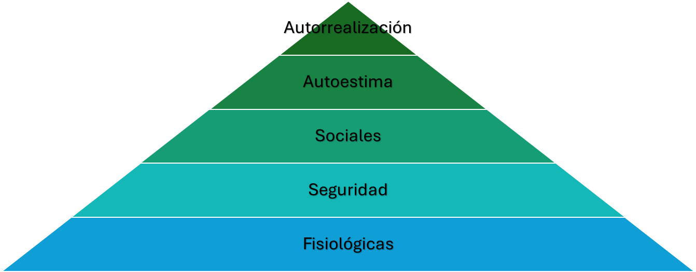

Además, las necesidades pueden agruparse según su origen en dos tipos:

- 🌱 **Innatas (primarias):**  
  Son **independientes de la experiencia pasada**, propias de la naturaleza del organismo.  
  👉 *Ejemplo:* la necesidad de respirar o dormir.

- 🧠 **Adquiridas (secundarias):**  
  Se **derivan de la práctica y la experiencia**, y están ligadas al entorno social o cultural.  
  👉 *Ejemplo:* la necesidad de éxito profesional o de reconocimiento en el trabajo.

---

#### 3.1.3. Otros tipos de motivación

A lo largo de los siglos **XIX y XX**, la Psicología ha desarrollado **diversas teorías sobre la motivación humana.**  
Estas teorías se centran en uno o varios aspectos del proceso motivacional, como la **búsqueda del éxito**, la **satisfacción de un deseo** o la **culminación de una expectativa.**

Entre las principales teorías destacan:

1. ⚙️ **Higiene-crecimiento:**  
    Propone que los **factores motivacionales** están relacionados con la **capacidad de logro** y el desarrollo personal.  
    👉 *Ejemplo:* sentirse motivado por asumir nuevas responsabilidades en el trabajo.

2. 🧱 **Jerarquía de las necesidades:**  
    Sostiene que la motivación surge del **deseo de satisfacer necesidades**, ya sean **primarias** (independientes de la experiencia) o **secundarias** (derivadas de la práctica).  
    👉 *Ejemplo:* buscar seguridad laboral una vez cubiertas las necesidades básicas.

3. 🎯 **Teoría de las tres necesidades:**  
    Indica que la motivación está marcada por tres impulsos fundamentales: **necesidad de logro, de poder y de afiliación.**  
    👉 *Ejemplo:* una persona que busca destacar en su profesión o pertenecer a un grupo influyente.

4. 🏆 **Establecimiento de metas:**  
    Afirma que la **definición clara y la aceptación de metas**, junto con la **retroalimentación**, incrementan el rendimiento.  
    👉 *Ejemplo:* fijarse un objetivo alcanzable y recibir comentarios sobre los progresos.

5. 🔁 **Reforzamiento:**  
    Basada en la idea de que las **consecuencias positivas aumentan la probabilidad de repetir una acción.**  
    👉 *Ejemplo:* continuar esforzándose tras recibir reconocimiento o elogios.

6. ⚖️ **Equidad:**  
    Plantea que la motivación proviene de la **necesidad de alcanzar un equilibrio o justicia** respecto a los iguales.  
    👉 *Ejemplo:* sentir desmotivación si se percibe un trato desigual entre compañeros.

7. 🔮 **Expectativas:**  
    Explica que la **percepción de éxito o fracaso esperado** influye directamente en el nivel de esfuerzo que una persona está dispuesta a realizar.  
    👉 *Ejemplo:* un estudiante que confía en su capacidad para aprobar tenderá a estudiar con mayor constancia.

---

### 3.2. Proceso de conducta motivacional

> [!important]
> Los **impulsos** son los elementos que **activan y mantienen la conducta.**  
> Cuando al motivo se le añade la idea del estado u objeto que permite satisfacer la necesidad, hablamos del **deseo.**

👉 *Ejemplo:*  
Un **impulso** sería “tengo hambre”, mientras que el **deseo** sería “tengo ganas de un bocadillo”.

Cuando algo nos interesa, el proceso motivacional **pasa por tres fases:**

1. 🔹 **Fase carencial:**  
    Es el momento en que **tomamos conciencia de una necesidad**.  
    Esta puede ser de **orden primario** (como el hambre o el sueño) o de **orden secundario** (como la estima, el prestigio o el estatus social).  
    👉 *Ejemplo:* sentir cansancio o necesidad de reconocimiento.

2. 🔹 **Fase dinámica:**  
    Es la **fase de acción**, en la que intentamos **cubrir la necesidad detectada**.  
    Corresponde al **impulso** que nos mueve a actuar.  
    👉 *Ejemplo:* buscar comida, descansar o realizar una tarea para obtener aprobación.

3. 🔹 **Fase reductora:**  
    Es la **fase de equilibrio**, que se produce **al satisfacer la necesidad sentida**, generando **sensación de satisfacción y bienestar.**  
    👉 *Ejemplo:* comer, dormir o recibir el reconocimiento deseado.

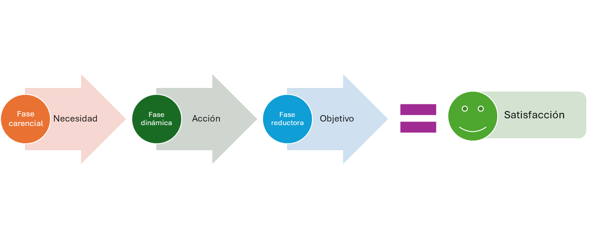{.img-preview}

Cuando el objetivo logra satisfacer la necesidad, el individuo alcanza un **nuevo estado de equilibrio personal**, que lo prepara para iniciar de nuevo el ciclo.

> [!note]
> El **proceso motivacional es cíclico**: una vez satisfecha una necesidad, **surgen otras nuevas** y el proceso se repite.  
> Sin embargo, cuando **no se puede alcanzar el objetivo** ni satisfacer la necesidad, aparece la **frustración.**

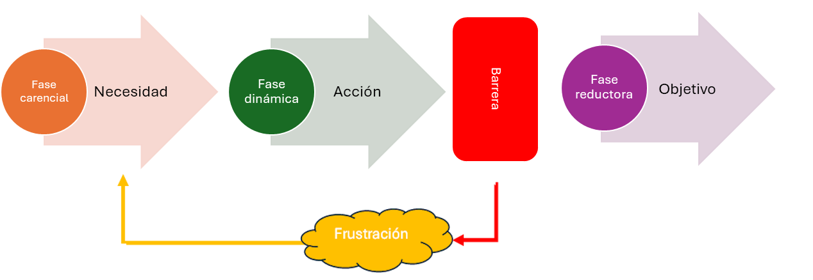{.img-preview}

> [!caution]
> La **frustración** aparece cuando **no logramos alcanzar el objetivo deseado.**  
> Puede generar **comportamientos positivos**, como un **alto grado de adaptabilidad o crecimiento personal**,  
> o bien **comportamientos negativos**, como **resentimiento, sensación de fracaso o actitudes defensivas.**

---

### 3.3. Aplicación de estrategias para motivar al alumnado

#### 3.3.1. Factores

> [!warning]
> Las personas adultas **solo se orientan hacia nuevos aprendizajes cuando están motivadas para ello.**  
> Los conocimientos nuevos deben **conectarse con sus experiencias previas** o **satisfacer alguna necesidad o interés personal.**  
> Además, el **esfuerzo y el tiempo invertido** deben verse reflejados en **logros tangibles**, y las **expectativas generadas** influyen directamente en su implicación.

Los participantes adultos **enfrentan el aprendizaje con diferente nivel de interés y esfuerzo** según tres tipos de factores:

1. 🎯 **Significado o importancia:**  
   Depende de la **relevancia que tenga para ellos alcanzar las metas u objetivos** propuestos.  
   👉 *Ejemplo:* un alumno se implicará más si percibe que el curso puede mejorar su empleabilidad o desarrollo profesional.

2. 🧠 **Posibilidades de superar las dificultades:**  
   Están vinculadas a su **experiencia previa, conocimientos adquiridos y capacidad para afrontar obstáculos.**  
   👉 *Ejemplo:* alguien con experiencia en informática se sentirá más seguro al realizar un curso avanzado en esa materia.

3. ⏱️ **Coste de tiempo y esfuerzo:**  
   Hace referencia al **esfuerzo físico, mental y temporal** que deben invertir para lograr el aprendizaje deseado.  
   👉 *Ejemplo:* un adulto con jornada laboral completa valorará la formación según el tiempo que pueda dedicarle fuera del trabajo.

---

#### 3.3.2. Expectativas

Cuando el formador **mantiene expectativas positivas hacia el alumnado**, se favorece un entorno de aprendizaje más motivador y participativo.  
Estas expectativas generan efectos directos sobre la dinámica del grupo:

- 🌞 Se crea un **clima socioemocional más cálido y estimulante.**  
- 💬 Se ofrece **mayor feedback** al grupo.  
- 📚 Se **proporciona más información y apoyo** al alumnado.  
- ❓ Se brindan **más oportunidades para hacer preguntas y participar activamente.**

Las **teorías de la motivación** ofrecen pautas que el docente puede aplicar para reforzar el compromiso del alumnado:

- 🎯 **Conectar los contenidos** con los **intereses, necesidades y experiencias previas** de los participantes.  
- 💡 **Presentar los temas de forma atractiva**, despertando la **curiosidad**, el **asombro** o la **duda constructiva.**  
- 🤝 **Involucrar al alumnado** en la **planificación y desarrollo** del aprendizaje, fomentando su autonomía y participación.

---

#### 3.3.3. Estrategias

Todas las estrategias utilizadas para aumentar la motivación persiguen los siguientes objetivos:

- 🎯 Atraer la atención del participante.  
- 💡 Despertar su interés.  
- 🚀 Estimular su deseo de aprender.  
- 🤝 Provocar que actúe, dirigiendo sus esfuerzos hacia la consecución de las metas definidas.

A continuación se presentan las **estrategias motivacionales** que el formador puede aplicar en función de distintos **principios motivacionales**:

| **Principio motivacional**                                   | **Estrategias para aplicarlo**                               |
| ------------------------------------------------------------ | ------------------------------------------------------------ |
| **1. 💡Activar la curiosidad y el interés** del alumno por el contenido o la tarea. | 🟠 Presentar información nueva, sorprendente y relacionada con los conocimientos del alumnado. 🟠Plantear o suscitar problemas reales. 🟠Variar los elementos o actividades para mantener la atención. |
| **2. 🎯 Mostrar la relevancia del contenido o tarea** para el alumno. | 🟢Relacionar los contenidos con sus experiencias, conocimientos previos y valores. 🟢Mostrar la meta que se persigue al aprender los contenidos. 🟢Utilizar ejemplos que demuestren su utilidad práctica. |
| **3. 👥 Organizar la actividad en grupos cooperativos.**      | 🟣Diseñar problemas o tareas que deban resolverse en grupo. 🟣Evaluar la formación a través del trabajo colaborativo. |
| **4. 🙋 Facilitar la percepción de autonomía.**               | 🔴Permitir elegir compañeros de trabajo. 🔴Ofrecer opciones sobre las tareas a realizar (coherentes con su itinerario formativo). 🔴Incluir al alumnado en su propia evaluación junto al formador. |
| **5. 👀 Orientar la atención del alumnado** antes, durante y después de la tarea. | 🟡**Antes:** orientar hacia el proceso de solución más que hacia el resultado final. 🟡**Durante:** fomentar la búsqueda de medios para superar dificultades. 🟡**Después:** proporcionar información sobre los aciertos y errores, analizar el proceso seguido y resolver dudas. |
| **6. 🏅 Promover la adquisición de los aprendizajes.**        | 🟤 Atribuir los resultados a **causas internas, modificables y controlables** por el propio alumno. |
| **7. 👩‍🏫 Ejemplificar los comportamientos esperados.**        | ⚫ El docente debe **convertirse en modelo de conducta** para el alumnado. |
| **8. 📊 Organizar las evaluaciones.**                         | 🔵 Plantear la evaluación como una **herramienta de aprendizaje**. 🔵Evitar comparaciones entre alumnos y no comunicar públicamente los resultados. 🔵Proporcionar información **cualitativa** además de cuantitativa. 🔵Acompañar la comunicación de resultados con mensajes que **refuercen la confianza** del alumno en sus posibilidades. |

---

#### 3.3.4. Sugerencias para la actuación docente

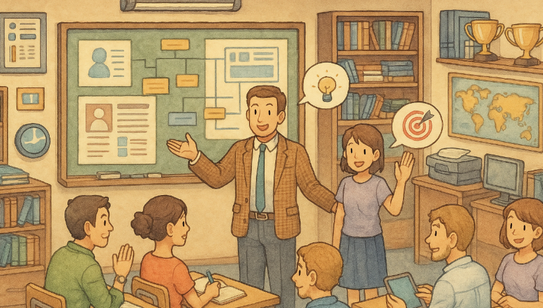

A continuación se presentan algunas **sugerencias prácticas** que pueden ayudar al formador o formadora a **mantener la motivación y atención del alumnado adulto** durante el proceso de enseñanza-aprendizaje:

1. 🤝 **Relacionarse con el alumnado** de forma informal durante el tiempo libre, en los descansos o en salidas externas, para conocerles mejor.  
2. 🧩 **Aprovechar el conocimiento personal** del alumnado para utilizarlos en ejemplos y aplicaciones prácticas dentro del aula.  
3. 🧠 **Aprenderse los nombres** de cada alumno o alumna para favorecer la cercanía y el reconocimiento.  
4. 📊 **Conocer el nivel de conocimientos y experiencias previas** del alumnado en relación con la materia que se imparte.  
5. 🎯 **Adaptar los ejemplos y explicaciones** al nivel y tipo de experiencias del grupo.  
6. 🗺️ **Presentar un esquema o mapa** de los contenidos que se van a tratar en cada clase.  
7. 💡 **Explicar la utilidad práctica** de la materia, tanto para su futuro profesional como para fundamentar conocimientos posteriores.  
8. ⏱️ **Ajustar el ritmo de las explicaciones**, consultando al alumnado si la velocidad y la forma de exposición son adecuadas.  
   > [!tip] 
   >
   > Una exposición demasiado lenta puede generar aburrimiento, mientras que una demasiado rápida provoca cansancio y distracción.  
9. 🧪 **Organizar prácticas o actividades previas** cuando se trate de un tema novedoso, para facilitar su comprensión teórica posterior.  
10. 🔄 **Variar los métodos de enseñanza** para evitar la rutina docente: alternar clases magistrales, sesiones en grupo, medios audiovisuales, debates o dinámicas participativas.  
11. 📅 **Revisar y actualizar periódicamente la programación**, modificando el orden de los contenidos y las actividades cuando sea posible.  
12. 🎤 **Cuidar el tono, la intensidad y la modulación de la voz**, ya que influyen directamente en la atención del grupo.  
13. 🏆 **Definir metas concretas y alcanzables**, para que tanto el docente como el alumnado puedan **reconocer los logros** obtenidos.

---

## 4. La comunicación y el proceso de aprendizaje

### 4.1. Información y comunicación

La **información** y la **comunicación** son elementos fundamentales dentro de todo **proceso de aprendizaje**, ya que **sin ellos la formación no podría llevarse a cabo.**

Sin embargo, **no siempre que existe comunicación hay aprendizaje**, porque pueden darse situaciones como las siguientes:

- ⚠️ El mensaje **no se adapta a las características** del receptor.  
- 🔗 El mensaje **no se conecta con los conocimientos previos** del receptor.  
- 📚 El mensaje **no es adecuado como contenido de aprendizaje.**  
- 🗣️ El **emisor no elabora correctamente el mensaje.**  
- 🧩 El **receptor carece de recursos** para comprender, analizar o aplicar los contenidos.

> [!important] Definición
>
> 📢La **comunicación** es la forma de **interacción entre dos o más personas**, mediante la **palabra hablada o escrita**, los **gestos, ademanes o expresiones emocionales**, cuyo resultado es el **intercambio de significados** que conducen a la **comprensión** y/o a un **comportamiento adecuado.**

> [!warning]
> La **comunicación es una condición fundamental** dentro de un proceso de aprendizaje,  
> pero **no todo proceso comunicativo implica necesariamente un aprendizaje.**

Desde un punto de vista general, la comunicación es el **mecanismo que permite que las relaciones humanas existan y se desarrollen.**  
No obstante, **comunicarse es más que hablar**: implica un **intercambio de entendimiento y significados** entre dos o más personas.

---

### 4.2. La formación

  

    <strong style="color: #721c24;">❌ La formación no es:</strong>
    <ol>
      <li>Una simple transmisión de información, una consigna o una orden.</li>
      <li>Un conjunto de instrucciones de uso.</li>
      <li>Un aprendizaje memorístico.</li>
      <li>La reflexión única sobre un tema concreto.</li>
      <li>Una situación o un hecho aislado.</li>
    </ol>
  

  

    <strong style="color: #155724;">✅ La formación es:</strong>
    <ol>
      <li>Un conjunto de informaciones vinculadas por un sentido básico que las articula.</li>
      <li>Una propuesta.</li>
      <li>Una idea.</li>
      <li>Una elaboración de ideas.</li>
      <li>Un planteamiento de una nueva perspectiva.</li>
    </ol>
  

⸺ Separador visible en edición, invisible en exportación ⸺

> [!important]
> Para que exista **aprendizaje y formación**, el estudiante debe mantener una **actitud positiva** que le permita **elaborar e incorporar nuevos conocimientos, habilidades y actitudes** a sus esquemas actuales de pensamiento, haciendo que dichos esquemas se **amplíen y reconstruyan.**

---

La **comunicación didáctica** consiste en la **transmisión de información y comunicación** orientada a la interacción con otras personas dentro del proceso educativo.

> [!note]
> La **formación es un acto de comunicación**, donde no solo se transmite información, sino que también se **establecen relaciones** entre el docente y los participantes, y entre los propios alumnos.  
> Existen **dos niveles** en esta comunicación:  
>
> - 🧠 **Nivel racional:** se centra en los **contenidos informativos y cognitivos** del aprendizaje.  
>   👉*Ejemplo:* cuando el docente explica un concepto técnico o presenta datos objetivos sobre un tema.  
>
> - 💬 **Nivel emocional:** implica las **reacciones afectivas y sociales** que acompañan el proceso de enseñanza.  
>   👉*Ejemplo:* cuando el docente muestra empatía ante las dudas del alumnado o utiliza el humor y la cercanía para crear un clima positivo en clase.

---

### 4.3. El proceso de comunicación didáctica: elementos

Cuando analizamos el proceso de comunicación, descubrimos distintos **elementos comunes** a cualquier contexto comunicativo:

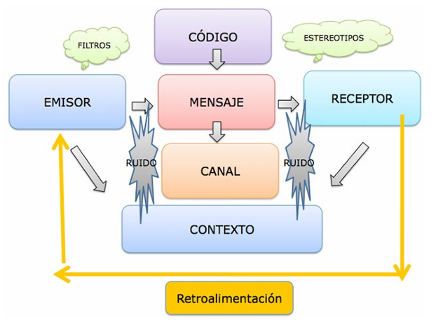

- 💬 **Mensaje:**  
  Es el **contenido** o la información que se quiere transmitir.  
  Su finalidad es que **llegue de forma clara al receptor.**

- 🧑‍🏫 **Emisor:**  
  Persona (o medio) que **emite el mensaje.**  
  En el contexto formativo, suele ser el **docente** o cualquier participante que comparte información.

- 🔤 **Código:**  
  Conjunto de **signos y reglas** que permiten interpretar el mensaje.  
  Ejemplo: el idioma, la lengua de signos o un código visual como los **colores de un semáforo.**

- 🧏 **Receptor:**  
  Quien **recibe el mensaje**. En el aula, puede ser el alumnado o cualquier interlocutor dentro del proceso educativo.

- 📡 **Canal:**  
  Medio o soporte **físico a través del cual se transmite** el mensaje: la voz, el papel, el ordenador, una plataforma digital, etc.

- 🌍 **Contexto:**  
  El **lugar y las circunstancias** que rodean el acto comunicativo (entorno físico, social y emocional).

- 🔁 **Retroalimentación:**  
  Es la **respuesta del receptor** al mensaje, que permite al emisor saber si el mensaje **ha sido comprendido correctamente.**  
  En una comunicación eficaz, el **receptor se convierte en emisor** y viceversa.

- 🚫 **Ruido:**  
  Cualquier **interferencia o barrera** que dificulte la comunicación:  
  errores de percepción, prejuicios, distracciones, problemas técnicos o **barreras socioculturales.**

Existen **cinco fases** en el proceso comunicativo:

1. 🧠 **Codificación:** el emisor piensa las ideas, sentimientos o emociones que desea transmitir al receptor.  
2. 💬 **Emisión:** las ideas se convierten en signos (palabras habladas o escritas, gestos, expresiones, etc.) que conforman el mensaje.  
3. 📡 **Transmisión:** el mensaje sale físicamente del emisor y se dirige hacia el receptor.  
4. 👂 **Recepción:** el mensaje es **recibido** por el receptor a través del canal utilizado.  
5. 🔍 **Decodificación:** el receptor **interpreta** el mensaje recibido y le asigna significado.

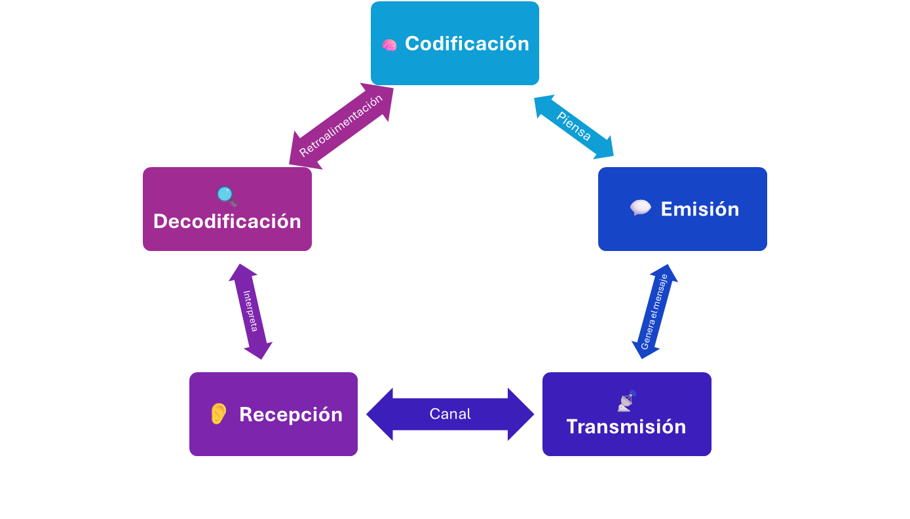{.img-preview}

> [!warning]
> En este proceso cobra especial relevancia la **retroalimentación o *feed-back***, entendida como la **respuesta del receptor al mensaje del emisor**.  
> Gracias a este elemento, la **comunicación didáctica se vuelve bidireccional**, permitiendo que la información circule tanto **del docente al alumnado como del alumnado al docente.**

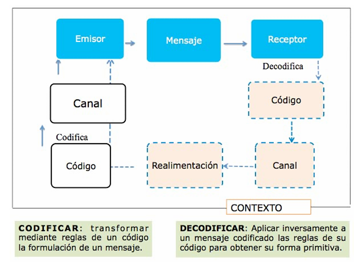

---

### 4.4. Tipos: verbal, no verbal, y escrita 

#### 4.4.1. Comunicación oral

La **comunicación oral** utiliza como vehículo transmisor **la voz**, la cual presenta varias cualidades fundamentales:

1. 🎵 **Tono:** intensidad con la que se emite la voz.  
2. 🗣️ **Dicción:** forma de **articular y pronunciar** las palabras con claridad.  
3. 🎶 **Entonación:** modulación de la voz que refleja **sentido, intención y emoción** del mensaje.  
4. 💬 **Fluidez:** facilidad y naturalidad en la expresión oral.  
5. ⏱️ **Ritmo:** incluye los **acentos, pausas y velocidad** con que se transmite un mensaje.

> [!important]
> En la comunicación verbal, el docente debe cuidar el **tema tratado**, los **objetivos perseguidos**, la **situación en la que se desarrolla** y el **papel de los alumnos**, manteniendo un estilo **natural, estimulante, cordial y gramaticalmente correcto.**

Para que la comunicación verbal sea eficaz dentro de las acciones formativas, es necesario tener en cuenta los siguientes aspectos:

- 🗂️ **Diseñar y organizar:**  
  La planificación de la comunicación docente es esencial. La exposición debe seguir una **estructura lógica y comprensible**.

- 📢 **Transmitir:**  
  Considerar las **respuestas del alumnado** para **ajustar el estilo y la forma de comunicación**, asegurando la comprensión de los mensajes.

- 👂 **Escuchar:**  
  Implica **captar la información**, **interpretarla y valorarla**, y ofrecer una **respuesta coherente** que demuestre un nivel mayor de comprensión.

---

#### 4.4.2. Comunicación no verbal

> [!note] Definición
>
> 📢La **comunicación no verbal** es el proceso mediante el cual se transmiten y reciben mensajes **sin utilizar palabras**, a través de **indicios o signos** que no tienen una estructura sintáctica verbal.

- 💬 Nos comunicamos no solo con lo que decimos, sino también con **nuestra presencia, gestos y actitudes**.  
  Por ello, los signos no verbales que intercambian docente y alumnado (gestos, posturas, distancias...) son fundamentales.  
- 🔄 La comunicación no verbal está estrechamente **relacionada con la verbal**. Ambas deben ser **coherentes**, ya que un gesto puede **reforzar o contradecir** el mensaje hablado.

Podemos distinguir **tres aspectos principales** dentro de la comunicación no verbal:

- 🗣️ **Paralenguaje:**  
  Incluye todo lo que **acompaña al lenguaje verbal**, como el **tono**, la **vocalización** o la **velocidad de emisión**.  
  También abarca **sonidos no verbales** (risa, gruñidos, pausas, tics o imperfecciones del habla) que aportan matices expresivos.

- 🧍‍♂️ **Movimientos corporales:**  
  Se refieren a los **gestos, posturas y expresiones faciales**.

  - **Gestos:** movimientos de la cara, manos, pies o dedos.  
    Deben ser **visibles, naturales y selectivos** para no distraer.  
  - **Posturas:** transmiten **interés o rechazo** según la cercanía o distancia.  
    Una postura natural y variable indica dinamismo y respeto.  
    Sentado = calma y cercanía; de pie = energía y dinamismo.  
  - **Expresiones faciales:** la **mirada y la sonrisa** son muy expresivas; reflejan comodidad, integración o satisfacción,  
    aunque también pueden usarse para **llamar la atención o aparentar**.

- 📏 **Proximidad:**  
  Se refiere a la **distancia física** que usamos al interactuar.  
  Debe ser **cómoda y adecuada al contexto**, teniendo en cuenta tanto la **personalidad y cultura del docente** como la del alumnado.

🎥 **Vídeo recomendado:**  
Elsa Punset ofrece consejos prácticos sobre cómo usar el lenguaje no verbal en la formación presencial (3:51 min):  

<iframe width="100%" height="315" src="https://www.youtube.com/embed/tWcbxSVusms?rel=0&showinfo=0" title="Lenguaje no verbal - Elsa Punset" frameborder="0" allowfullscreen></iframe>

---

#### 4.4.3. Comunicación escrita

> [!note] Definición
>
> 📢La **comunicación escrita** permite transmitir información mediante la palabra escrita, favoreciendo el aprendizaje, la reflexión y la creación.  
> Además, supera las limitaciones de **espacio y tiempo** de la comunicación oral.

Para lograr una comunicación escrita eficaz, debemos atender a varios aspectos:

- 📝 **Corrección lingüística:**  
  Uso correcto y adecuado de la lengua, respetando las normas gramaticales y ortográficas.

- 💡 **Claridad:**  
  El texto debe ser **transparente, claro y sencillo**, evitando ambigüedades o expresiones confusas.

- 🎨 **Variedad:**  
  Es importante **evitar repeticiones**, tanto de palabras en la misma frase como en el mismo párrafo.

A través de la comunicación escrita se fomenta no solo el aprendizaje, sino también la **capacidad de análisis y expresión personal**.  
El acto de escribir requiere **concentración**, **dominio del léxico** y un **estilo claro, conciso y directo.**

**Aspectos formales del texto:**

- 🔠 Señalar los apartados o enunciados con letras o números.  
- ➖ Separar con espacios en blanco los bloques de contenido distintos.  
- ✍️ Usar subrayados, distintos tipos de letra o mayúsculas para resaltar información importante (títulos, palabras clave...).  
- 🧩 Elaborar **resúmenes o esquemas** de las ideas relevantes.  
- 🖼️ Utilizar **imágenes significativas** para hacer el texto más atractivo y comprensible.

---

🎥 **Vídeo recomendado:**  
Genís Roca en TEDxGalicia — *“La sociedad digital”*, donde expone cómo la tecnología ha influido en la historia de la humanidad. Es una demostración de distintas técnicas de exposición (no es el contenido que explica, **es como lo explica**.)

<iframe width="100%" height="315" src="https://www.youtube.com/embed/kMXZbDT5vm0" title="La sociedad digital - Genís Roca (TEDxGalicia)" frameborder="0" allowfullscreen></iframe>

---

### 4.5. Interferencias y barreras en la comunicación

> [!note] Definición
>
> 📢Una **barrera de comunicación** es todo **obstáculo o dificultad** que surge en el proceso comunicativo e **impide que el mensaje sea correctamente interpretado** por el receptor.

> [!important]
> En muchas interacciones comunicativas podemos observar **dificultades para que el mensaje sea comprendido correctamente**, apreciando diferencias entre lo que el emisor quiere decir y lo que el receptor finalmente interpreta o pone en práctica.

**Etapas en las que puede producirse la distorsión del mensaje:**

1. 💬 Lo que se quiere decir.  
2. 🧠 Lo que se sabe decir.  
3. 🗣️ Lo que se dice.  
4. 👂 Lo que se oye.  
5. 🎧 Lo que se escucha.  
6. 🧩 Lo que se comprende.  
7. 🤔 Lo que se acepta.  
8. 📝 Lo que se retiene.  
9. 🚀 Lo que se pone en práctica.

Una forma de evitar que estas distorsiones se produzcan de manera exagerada es mantener una **retroalimentación constante**, realizando **preguntas de verificación** durante la exposición para comprobar la comprensión de pequeños bloques de información.

La **distorsión de la comunicación** está relacionada frecuentemente con la presencia de **elementos que dificultan el proceso comunicativo**, conocidos como **barreras de comunicación**.

Podemos distinguir, en función de los **elementos clave del proceso formativo**, las siguientes barreras:

Podemos distinguir, en función de los **elementos clave del proceso formativo**, las siguientes barreras:

- 🧑‍🏫 **Respecto al emisor:**  
  - Características personales (por ejemplo, inseguridad, nerviosismo o falta de empatía con el grupo).  
  - Formas de presentar el contenido (por ejemplo, explicaciones excesivamente teóricas o monótonas).  
  - Interacción docente–participantes (por ejemplo, no permitir preguntas o no fomentar la participación).  
  - Competencia docente (por ejemplo, desconocimiento de la materia o falta de preparación).

- 📡 **Respecto al canal:**  
  - Muletillas o repeticiones innecesarias (por ejemplo, decir constantemente “¿vale?” o “¿de acuerdo?”).  
  - Falta de vocalización y/o entonación adecuadas (por ejemplo, hablar demasiado bajo o sin variar el tono).  
  - Expresión escrita deficiente (por ejemplo, textos con errores ortográficos o gramaticales).  
  - Uso inadecuado de tipos de letra (por ejemplo, tipografías difíciles de leer en las presentaciones).

- 💬 **Respecto al mensaje:**  
  - Densidad informativa excesiva o inclusión de información poco significativa (por ejemplo, sobrecargar una diapositiva con texto irrelevante).  
  - Confusión informativa (por ejemplo, mezclar conceptos sin una estructura clara).  
  - Desestructuración, con objetivos poco claros (por ejemplo, explicar sin un orden lógico).  
  - Uso de lenguaje técnico sin ejemplos (por ejemplo, emplear jerga informática sin aclarar su significado).  
  - Distorsión o pérdida del sentido original (por ejemplo, simplificar en exceso un concepto técnico).

- 🏫 **Respecto al contexto:**  
  - Condiciones físicas del aula (por ejemplo, iluminación deficiente, ruidos o temperatura inadecuada).  
  - Falta de orden o limpieza (por ejemplo, aula desordenada o con distracciones visuales).  
  - Falta de habilidad en el uso de recursos didácticos (por ejemplo, no saber utilizar correctamente el proyector o la pizarra digital).

- 👥 **Respecto a los receptores:**  
  - Falta de motivación o intereses personales ajenos al tema (por ejemplo, cuando el alumno considera que el contenido “no le servirá para nada”).  
  - Experiencias previas que condicionan la percepción (por ejemplo, una mala experiencia anterior con un curso similar).  
  - Factores emocionales o de estado de ánimo (por ejemplo, nerviosismo, cansancio o frustración).  
  - Condiciones físicas o anímicas desfavorables (por ejemplo, hambre, sueño o dolor de cabeza).  
  - Interpretación incorrecta de la información (por ejemplo, entender una ironía como una crítica real).

---

### 4.6. La retroalimentación

> [!warning]
>
> Los términos **retroalimentación**, **realimentación** y **feedback** son **sinónimos** y se refieren al mismo proceso de comunicación: la **respuesta o devolución** que el receptor hace al emisor sobre el mensaje recibido.  
> En este temario se utilizará el término **retroalimentación** por ser el más habitual en el ámbito educativo.

#### 4.6.1. Conceptos generales

> [!important]
> La **retroalimentación** es uno de los **elementos clave de la comunicación**.  
> Se refiere a la **respuesta que nuestro comportamiento provoca en los receptores**.  
> Es fundamental para **guiar a los participantes en el proceso de aprendizaje**, reforzando y estimulando **conductas positivas**, y corrigiendo las **ejecuciones o comportamientos inadecuados.**

> [!note] Definición
>
> 📢**Retroalimentación o *feed-back***  
> Es la **respuesta del receptor al mensaje del emisor**, también conocida como **efecto retorno**.  
> Constituye la **principal característica de la comunicación didáctica**, ya que permite que **emisor y receptor intercambien sus roles** para lograr una comunicación más eficaz.

**¿Por qué es importante?**

- 🎯 Permite saber si los **objetivos de la comunicación** se han cumplido.  
- 🧠 Ayuda a conocer **cómo afecta el comportamiento** al receptor.  
- 🔄 Facilita la **corrección de distorsiones** en la comunicación.

**¿Cómo se hace?**

- ✅ Comenzar dando **información positiva** sobre los aspectos correctos de la ejecución.  
- 💡 Ofrecer **sugerencias o alternativas** para mejorar aquello que no haya sido correcto.  

**Facilitadores de la comunicación:**

- 👂 Escuchar atentamente y mostrar empatía.  
- 🕐 Elegir el **momento y lugar adecuados** para comunicarse.  
- 🎯 Adaptar el contenido a las **necesidades del interlocutor.**  
- 🌱 Mantener una actitud **recompensante y constructiva.**  
- 🔁 Proporcionar **retroalimentación continua.**

El docente, como **emisor de información**, tiene la responsabilidad de **comprobar el grado de comprensión del alumnado**, utilizando la retroalimentación mediante:

- ❓ **Preguntar al alumno** para verificar la comprensión.  
- 🧾 **Resumir la información** impartida.  
- 👀 **Observar las conductas y respuestas** del alumnado durante la actividad.

---

#### 4.6.2. Formas y estrategias de la retroalimentación

> [!important]
> La **retroalimentación** es fundamental para **guiar a los participantes en el proceso de aprendizaje**, reforzando y estimulando **conductas positivas** y corrigiendo **comportamientos inadecuados**.  
> Para facilitarla, es importante que el receptor perciba en el docente una **actitud receptiva y comprensiva** frente a sus dudas o dificultades.

**Formas de expresar la retroalimentación:**

|      | **Forma**        | **Explicación**                                              | **Ejemplo**                                                  |
| ---- | ---------------- | ------------------------------------------------------------ | ------------------------------------------------------------ |
| 🗣️    | **Verbal**       | Se responde mediante la palabra.                             | Responder a una pregunta de un participante.                 |
| ✍️    | **Escrita**      | Se utiliza el lenguaje escrito.                              | Comentarios en un ejercicio de evaluación.                   |
| 😊    | **No verbal**    | Se responde mediante comportamientos o gestos.               | Una sonrisa de aprobación.                                   |
| 🎯    | **Consciente**   | Se expresa la respuesta de forma intencional.                | Asentir con la cabeza o levantar la mano para hacer una pregunta. |
| 😐    | **Inconsciente** | Se produce sin una voluntad consciente.                      | Moverse en la silla o bostezar.                              |
| 🧾    | **Formal**       | Se obtiene información a través de instrumentos elaborados previamente. | Cuestionarios de satisfacción del alumnado.                  |
| ☕    | **Informal**     | Se recibe información en situaciones no planificadas.        | Un comentario durante un descanso o en la cafetería.         |

**Estrategias para obtener retroalimentación:**

- 🤝 **Si queremos facilitar la retroalimentación:**  
  Es decir, mostrar al receptor una actitud receptiva ante sus dudas o problemas.

  **Cómo actuar:**  
  - Saber **escuchar** y responder adecuadamente a las preguntas.  
  - Ser **pacientes** ante preguntas que puedan parecer simples o repetitivas.  
  - **Respetar al receptor** y sus opiniones, razonando sin imponer.  
  - Desarrollar la **empatía**, comprendiendo lo que el otro quiere expresar.  
  - Crear un **clima de confianza** que favorezca el diálogo abierto.

- 💬 **Si queremos buscar o provocar la retroalimentación:**  
  Es decir, **animar al alumnado a expresar sus dudas** o comprobar su nivel de comprensión.

  **Cómo actuar:**  
  - Formular **preguntas abiertas** que inviten a explicaciones más amplias, para detectar diferencias entre lo que se transmite y lo que se interpreta.  
  - Orientar la conversación hacia la **resolución de problemas**, evitando buscar culpables y fomentando un entorno de aprendizaje **positivo y colaborativo.**

---

### 4.7. La escucha activa

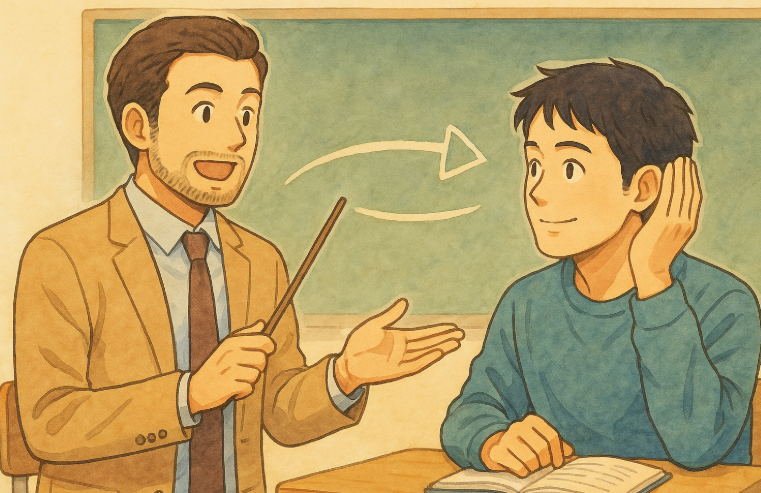

> [!note] Definición
>
> 📢La **escucha activa** es el esfuerzo físico y mental por **escuchar con atención el mensaje del emisor**, intentando **interpretar correctamente** lo que comunica.  
> También se define como la **habilidad de tomar conciencia** de lo que la otra persona está diciendo y de lo que **intenta transmitirnos**, mostrando con gestos y actitudes que estamos recibiendo su mensaje.  
> Facilita la **comunicación bidireccional** y ayuda a **fijar los contenidos en la memoria.**

**Objetivos de la escucha activa:**

1. 🎯 Asegurar al interlocutor que hemos **recogido y entendido su mensaje.**  
2. 💬 Alentar al interlocutor a **emitir nuevos mensajes.**

**Finalidad de la escucha activa:**

1. 👂 Informar al interlocutor de que se le presta atención, haciéndole sentir **comprendido y motivado** a continuar comunicándose.  
2. 💡 Resulta **recompensante** para el emisor.  
3. ⚖️ **Ayuda a neutralizar reacciones negativas** en situaciones de conflicto.  
4. 👥 Refuerza la **influencia positiva del docente** sobre el grupo de participantes.  
5. 🌱 Es una **habilidad observable y fácilmente imitable** por los demás.

Para aplicar la escucha activa es necesario **observar al interlocutor**, **empatizar** y **demostrar atención** tanto con gestos como con palabras:

1. 👀 **Observando al interlocutor:**  

     - Identificar el contenido de sus expresiones verbales y sentimientos.  

     - Reconocer el momento en el que desea que hablemos o intervengamos.  

     - Practicar la **empatía**, poniéndonos en su lugar para entender mejor sus emociones (sin necesidad de compartirlas).

2. 💪 **Con gestos y con el cuerpo:**  

     - Adoptar una **postura activa y receptiva.**  

     - Mantener **contacto visual.**  

     - Mostrar una **expresión facial atenta.**  

     - Utilizar **incentivos no verbales** como asentir con la cabeza.  

     - **Tomar notas** si es necesario.  

     - Usar un **tono y volumen de voz adecuados.**

3. 🗣️ **Con palabras:**  

     - Emplear **incentivos verbales** (“ya veo”, “ajá”, “entiendo”).  

     - **Parafrasear o resumir** lo que se ha escuchado (“si no te he entendido mal…”).

4. 🚫 **Evitar hacer mientras escuchamos:**  

     - No interrumpir al que habla.  

     - No juzgar.  

     - No ofrecer ayuda o soluciones prematuras.  

     - No rechazar lo que la otra persona siente.  

     - No contar “tu historia” mientras el otro necesita expresarse.  

     - Evitar el **“síndrome del experto”**, es decir, creer que tenemos todas las respuestas antes de escuchar completamente.

---

### 4.8. Factores determinantes de la efectividad de la comunicación en el proceso de enseñanza–aprendizaje (E-A)

> [!note] Definición
>
> 📢El **acto formativo** es un **proceso complejo de intercambio** entre el docente y los participantes.  
> Es necesario **preparar el mensaje**, estructurarlo, sintetizarlo y resaltar los aspectos más importantes.  
> Además, debe **favorecerse un clima de diálogo y escucha activa**, permitiendo recibir y retroalimentar los mensajes que los alumnos envían.

Para lograr una **comunicación efectiva**, el profesorado debe seguir una serie de **pautas durante la planificación y la transmisión del mensaje**, manteniendo siempre una **actitud positiva** ante los participantes.

**Pautas para desarrollar una comunicación efectiva:**

- 🗂️ **Planificar la comunicación:**  
  - Fijar los **objetivos y contenidos** de la comunicación.  
  
  - Verificar que el **lenguaje sea adecuado** para el grupo.  

  - Considerar las **condiciones físicas del aula**, los **recursos materiales** y el **clima del grupo**.
  
    > [!tip]
    >
    > **Estrategias docentes para planificar:**  
    >
    > - Comenzar con una **visión general** de los puntos que se van a tratar.  
    > - Presentar **aspectos positivos** del tema para captar el interés.  
    > - Seguir un **orden lógico y estructurado.**  
    > - Finalizar la exposición con **conclusiones o un resumen.**
  
- 💬 **Transmitir el mensaje priorizando la claridad de ideas y conceptos:**  
  - Destacar la **claridad y precisión** de los conceptos clave.  
  
  - Ajustar el mensaje a las **expectativas del grupo** para mantener el interés.  

  - Repetir los puntos esenciales para **reforzar la comprensión.**
  
    > [!tip]
    >
    > **Estrategias docentes para transmitir con claridad:**  
    >
    > - Aceptar **comentarios y críticas** constructivas.  
    > - Incorporar **anécdotas o ejemplos** que conecten con la realidad del alumnado.  
    > - Utilizar un **vocabulario sencillo** y adaptado al nivel de los participantes.  
    > - Comprobar la **comprensión del mensaje** mediante preguntas.
    > - Finalizar con un **resumen o conclusiones.**  
    > - Favorecer la **retroalimentación** del alumnado para verificar el cumplimiento de los objetivos.
  
- 🤝 **Mantener una actitud de sinceridad y escucha:**  
  - Mostrar una actitud **natural y sincera**, que genere confianza y transmita entusiasmo.  
  
  - La **escucha activa** debe ser la herramienta principal del formador, porque:  
    1. Hace que el alumnado se sienta **centro de atención.**  
    2. Transforma la escucha en **respuestas positivas** para todo el grupo.  
    
  - El formador **retroalimenta el proceso comunicativo**, incorporando las mejoras que surjan.
  
    > [!tip]
    >
    > **Estrategias docentes para mantener la escucha y la empatía:**  
    >
    > - Crear un **clima de acogida, apoyo y estímulo.**  
    > - **Reforzar la participación** del alumnado de forma inmediata cuando esté alineada con los objetivos.  
    > - **Empatizar** con los participantes.  
    > - Cuidar la **comunicación no verbal.**  
    > - Mantener el **contacto visual** con el grupo la mayor parte del tiempo.  
    > - Escuchar de forma **activa y motivadora**, fomentando una relación positiva.

> [!warning]
>
> **¿Qué hace el profesorado para comunicarse con eficacia?**  
>
> - Prepara el mensaje: lo estructura, sistematiza y resume lo importante.  
> - Utiliza canales eficaces, adecuados al alumnado y a la situación de formación.  
> - Mantiene una **actitud mental positiva**, se dispone a hacerse entender, explica con claridad y verifica la comprensión.  
> - Crea un **clima participativo y de diálogo**, valorando los logros comunes.  
> - Programa la acción didáctica para que **impulse la participación del alumnado.**  
> - Escucha los mensajes **verbales y no verbales**, observando el interés y el nivel de comprensión del grupo.

---

### 4.9. La comunicación a través de las tecnologías de la información

#### 4.9.1. Conceptos generales

Las tecnologías de la información permiten que actividades de aprendizaje que antes se realizaban en un entorno presencial puedan desarrollarse también en **teleformación**.  

- Las **herramientas de comunicación** son clave para que todos los agentes del proceso de enseñanza–aprendizaje **interactúen, resuelvan dudas, trabajen en grupo e intercambien experiencias**.  
- Una **plataforma e-learning** debe facilitar la comunicación entre estudiantes y profesionales con herramientas **síncronas** y **asíncronas**.

La **clasificación de las herramientas de comunicación** según la **simultaneidad espacial y temporal** entre los interlocutores permite agruparlas en dos grandes categorías:

- 💬 **Herramientas de comunicación síncrona:**  
  - Permiten un **diálogo en tiempo real** entre uno o varios emisores y receptores, intercambiando mensajes orales o escritos en el mismo instante.  
  - **Herramientas habituales:** teléfono, chat, webcam, videoconferencia, etc.
  - 👉*Ejemplo: conversación escrita entre tutor y alumno mediante chat.*  
- 📧 **Herramientas de comunicación asíncrona:**  
  - Se utilizan cuando el mensaje **no se emite ni se recibe simultáneamente**, es decir, no ocurre en tiempo real.  
  - **Herramientas habituales:** foros de debate, grupos de noticias, tablones de anuncios, correo electrónico, Wiki, etc.
  - 👉*Ejemplo: intercambio de mensajes por correo electrónico.*  

> [!important]
> Una plataforma **e-learning** debe facilitar la comunicación entre los grupos de estudiantes y el equipo docente, incluyendo herramientas **síncronas y asíncronas**.  
> Sin embargo:  
> - 💬 El uso continuado de **chats o videoconferencias** (comunicación síncrona) puede **reducir la flexibilidad horaria** característica de la formación online.
>   - 🕓 La **formación online** debe apoyarse principalmente en la **comunicación asíncrona**, utilizando medios como el **correo electrónico, los foros o los tablones de anuncios.**  
>   - 📅 Las herramientas síncronas, como los chats o las videoconferencias, deben reservarse para **momentos puntuales** en los que la interacción inmediata sea realmente necesaria.

---

#### 4.9.2. Herramientas habituales de comunicación en entornos virtuales de formación

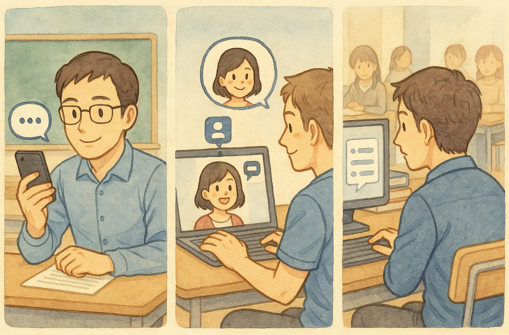

Las **herramientas más habituales** en los entornos virtuales de formación son:

- 💬 **La mensajería:**  
  Permite el **intercambio de mensajes entre los usuarios**.  
  Se utiliza para la **resolución de dudas personalizadas** sobre los contenidos del curso y para el **envío de documentación** entre el formador y el participante.

- 🗨️ **El chat y la videoconferencia:**  
  Son sistemas de **comunicación síncrona** (en tiempo real) que requieren **acordar previamente una cita** para el encuentro.  
  Permiten la **resolución de dudas inmediatas**, la comunicación directa y la participación simultánea del grupo.

- 🧵 **Los foros:**  
  Espacios destinados al **debate sobre temas relacionados** con el curso.  
  Suelen ser **creados por el formador**, aunque su gestión puede **delegarse en los propios participantes**.

Otras herramientas que suelen encontrarse en las plataformas virtuales:

- 🎥 **Videoconferencia:** espacio donde el tutor o tutora **expone un tema** y los estudiantes pueden **participar en tiempo real**.  
  Habitualmente, la sesión queda **grabada** y disponible para su visualización posterior.

- 📢 **Tablón de anuncios:** herramienta donde el **equipo docente, tutores o coordinadores** publican mensajes dirigidos al grupo de alumnos/as.  
  Los mensajes suelen estar relacionados con la **organización y gestión del curso**.

- 🌐 **Material web:** espacio reservado para el **material didáctico del curso**, que puede incluir **recursos interactivos** accesibles en cualquier momento y lugar.

- 📚 **Bibliografía o biblioteca:** apartado donde se ofrecen **referencias, artículos, vídeos o audios** que complementan los contenidos del curso.

- 🗓️ **Calendario y revisión del progreso:** permite al alumnado **consultar sus objetivos, plazos y nivel de avance**.  
  Es fundamental para que cada participante **sepa en todo momento qué se espera de él** y cómo va cumpliendo los hitos del curso.

---

# Resumen

> [!important]
> El **aprendizaje** es un proceso de construcción en el que participan **docentes y estudiantes**.  
> Los docentes facilitan la transmisión de **conocimientos teóricos, prácticos y actitudinales** a un grupo de personas o estudiantes.  
> Este proceso de construcción es lo que llamamos **proceso de enseñanza–aprendizaje (E–A).**

## Elementos que intervienen en el proceso de enseñanza-aprendizaje (E-A)

- 👩‍🎓 **Participantes o estudiantes:**  
  En este certificado, el grupo de estudiantes está compuesto por **adultos**, con características propias como **madurez, responsabilidad, capacidad de comunicación y relación social.**

- 👨‍🏫 **Docentes:**  
  Son quienes **programan, imparten, tutorizan y evalúan** la acción formativa.  
  Actúan como **facilitadores del conocimiento** y **motivadores del aprendizaje.**

- 📘 **Métodos:**  
  Existen distintas maneras de enseñar. El método responde a la pregunta **“¿cómo enseñar?”**  
  Los adultos aprenden mejor **mediante la práctica y la experiencia**, no solo con la memorización.

- 🏫 **Entorno:**  
  Puede ser **presencial** (aulas) o **virtual (e-learning)**.  
  Los **medios y canales de comunicación** son diferentes en cada caso.

- 🔄 **Interacción:**  
  Es esencial entre **docentes y participantes** para lograr los objetivos.  
  En formación online, también incluye la **interacción con el material web y con los compañeros** a través de los foros.

- 📚 **Contenidos:**  
  Pueden ser **conceptuales**, **procedimentales** o **actitudinales.**

## Características del aprendizaje adulto

- 🤝 Carácter voluntario y autónomo.  
- ⏳ Ritmo de aprendizaje propio.  
- 😟 Miedo al fracaso o falta de confianza.  
- 🕒 Limitaciones espacio-temporales.

## Tipos de aprendizaje

- 🎓 Formal.  
- 🧩 No formal.  
- 🌱 Informal.

## Procesos de aprendizaje tratados en la unidad:

- 🧠 **Teorías del aprendizaje:**  
  - Ensayo-error  
  - Imitación u observación  
  - Descubrimiento  
  - Aprendizaje significativo  
  - Aprendizaje constructivo  
  - Aprendizaje colaborativo  

- 🎯 **Estilos de aprendizaje:**  
  - Activo  
  - Reflexivo  
  - Teórico  
  - Pragmático  

- ⚡ **Activadores del aprendizaje:**  
  - Percepción  
  - Atención  
  - Memoria  

## Plataforma e-learning

En una **plataforma e-learning** encontraremos herramientas de comunicación:
- **Síncronas:** 💬 *chats, videoconferencias, pizarras digitales...*  
- **Asíncronas:** 📧 *foros, correo electrónico, tablones de anuncios...*

---

# Ejercicios

## MF1444 - Evaluación diagnóstica inicial (módulo completo)

**1.** **El alumno/a para tener éxito en su proceso de enseñanza aprendizaje además de tener una actitud positiva hacia el aprendizaje, tener voluntad y motivación tiene que:**  
a) Mantenerse pasivo en clase.  
b) Activar los procesos de memoria comprensiva.  
c) Escuchar y memorizar lo que dice el docente.  
d) Escribir lo que dicta el docente.

**2.** **El papel del docente en el proceso formativo será:**  
a) De transmisor de los conocimientos.  
b) De evaluador de los conceptos.  
c) De controlador del proceso.  
d) De mediador entre el alumno/a y la materia a enseñar.

**3.** **¿Qué tipo de contenidos debemos tener en cuenta a la hora de impartir y tutorizar acciones formativas?:**  
a) Conceptuales, procedimentales y actitudinales.  
b) Conceptuales y logísticos.  
c) Conceptuales, holísticos y kinestésicos.  
d) Teóricos, prácticos y activos.

**4.** **¿Qué aspectos debemos tener en cuenta para mantener la atención en clase? Señala la incorrecta:**  
a) Partir del nivel de atención adecuada.  
b) Distribuir adecuadamente la sesión de aprendizaje.  
c) Utilizar un tono de voz alto y monótono.  
d) Ser consciente de las demandas atencionales que se exige al alumnado.

**5.** **"Cuando la tarea por aprender puede relacionarse con los conocimientos previos que tiene la persona” denominamos a este proceso:**  
a) Aprendizaje significativo.  
b) Generalización-discriminación.  
c) Organización por configuraciones globales.  
d) Progresión de la dificultad.

**6.** **¿Qué autor defiende que la inteligencia es una capacidad que puede desarrollarse?:**  
a) Kolb.  
b) Honey y Mumford.  
c) Gardner.  
d) Ninguno, la inteligencia no puede desarrollarse.

**7.** **Para lograr un buen rendimiento intelectual es necesario que el alumno/a consiga un buen equilibrio entre:**  
a) La percepción y la memoria.  
b) La atención y concentración.  
c) La memoria y la escucha activa.  
d) La motivación y la asistencia.

**8.** **En el proceso de aprendizaje las personas damos distintos significados a las nuevas informaciones. Estas formas diferentes de comprender, recopilar, interpretar, organizar y pensar la información se denomina:**  
a) Estilos de aprendizaje.  
b) Estrategias de aprendizaje.  
c) Pautas cognitivas.  
d) Estrategias metacognitivas.

**9.** **Para poner en práctica una técnica de dinámica de grupos hay que:**  
a) Conocer sus fundamentos teóricos.  
b) Dominar su aplicación práctica.  
c) Utilizarlas conforme al procedimiento establecido.  
d) Todas las opciones son correctas.

**10.** **Un aula virtual se caracteriza por:**  
a) Utilización de recursos multimedia como chats, gráficos, audios, etc.  
b) La posibilidad de hacer videotutorías síncronas todos los días de la semana con el docente o tutor/a encargado.  
c) Ser un CD que puedes ponerlo donde quieras y cuando quieras siempre que se tenga un ordenador.  
d) Por las limitaciones temporales, ya que siempre hay una fecha tope para la entrega de las actividades.

Mostrar soluciones y justificaciones

**1️⃣ b) Activar los procesos de memoria comprensiva.**  
El aprendizaje efectivo requiere comprender y relacionar la nueva información, no solo memorizar o copiar.

**2️⃣ d) De mediador entre el alumno/a y la materia a enseñar.**  
El docente guía, orienta y facilita el aprendizaje, ayudando al alumnado a construir su propio conocimiento.

**3️⃣ a) Conceptuales, procedimentales y actitudinales.**  
Cubren lo que el alumno sabe (conceptos), sabe hacer (procedimientos) y cómo se comporta (actitudes).

**4️⃣ c) Utilizar un tono de voz alto y monótono.**  
Un tono monótono reduce la atención; la variación vocal y metodológica ayuda a mantenerla.

**5️⃣ a) Aprendizaje significativo.**  
Ocurre cuando se relaciona la nueva información con los conocimientos previos del alumno/a.

**6️⃣ c) Gardner.**  
La teoría de las inteligencias múltiples plantea que la inteligencia es plural y desarrollable.

**7️⃣ b) La atención y concentración.**  
Son condiciones básicas para procesar, retener y aplicar la información con eficacia.

**8️⃣ a) Estilos de aprendizaje.**  
Diferencias personales en cómo se percibe, procesa y organiza la información.

**9️⃣ d) Todas las opciones son correctas.**  
Se requiere base teórica, dominio práctico y aplicación conforme al procedimiento.

**🔟 a) Utilización de recursos multimedia como chats, gráficos, audios, etc.**  
En el contexto del cuestionario, esta es la opción más cercana a la idea de un entorno virtual con herramientas y materiales digitales (aunque estrictamente el chat es una herramienta de comunicación más que un “recurso multimedia”).

---

## Ejercicio 1: Funciones principales de la FPE

Señala verdadero o falso

| Afirmación                                                   | Valoración  | Justificación                                                |
| ------------------------------------------------------------ | ----------- | ------------------------------------------------------------ |
| Promover la acreditación de las competencias profesionales.  | ✅ Verdadero | La FPE permite reconocer oficialmente la experiencia laboral y las competencias adquiridas. |
| Hacer talleres de empleo dirigidos a jóvenes.                | ❌ Falso     | Los talleres de empleo son programas de inserción laboral, no parte directa de la FPE. |
| Favorecer la formación permanente.                           | ✅ Verdadero | La FPE fomenta la actualización continua de los trabajadores a lo largo de la vida. |
| Proporcionar los conocimientos requeridos en el mercado laboral. | ✅ Verdadero | Su objetivo es adaptar la formación a las necesidades reales de las empresas. |
| Obtener el título de bachiller.                              | ❌ Falso     | El bachiller pertenece al sistema educativo reglado, no a la formación para el empleo. |
| Obtener una titulación universitaria.                        | ❌ Falso     | La FPE no otorga títulos universitarios, sino certificados de profesionalidad. |
| Mejorar la empleabilidad de los trabajadores.                | ✅ Verdadero | Es uno de sus fines principales: facilitar la inserción y promoción laboral. |

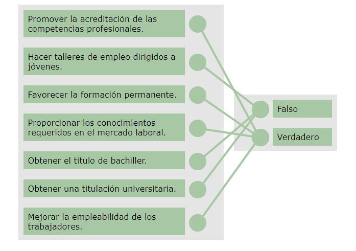

---

## Ejercicio 2: Características a tener en cuenta de un adulto

Las características principales de un adulto que tenemos que tener en cuenta a la hora de planificar una acción formativa son:

| Opción                             | Valoración   | Justificación                                                |
| ---------------------------------- | ------------ | ------------------------------------------------------------ |
| a) Sus valores sociales y morales. | ❌ Incorrecta | No se consideran una característica clave en la planificación de la formación. |
| b) La simpatía.                    | ❌ Incorrecta | Rasgo personal sin relevancia pedagógica.                    |
| c) Autonomía.                      | ✅ Correcta   | Los adultos son autónomos y responsables de su propio aprendizaje. |
| d) El año de nacimiento.           | ❌ Incorrecta | El año concreto no influye; lo importante es la edad y etapa vital. |
| e) La personalidad.                | ✅ Correcta   | Determina su forma de aprender y relacionarse en el grupo.   |
| f) El trabajo que desempeña.       | ❌ Incorrecta | Puede influir en la motivación, pero no es una característica general del adulto. |
| g) La edad.                        | ✅ Correcta   | Condiciona la experiencia, intereses y ritmo de aprendizaje. |
| h) La responsabilidad.             | ✅ Correcta   | Es una característica clave del aprendizaje adulto.          |

> [!tip]
>
> Están sacadas del punto 2.2.2.3 Características del los participantes.

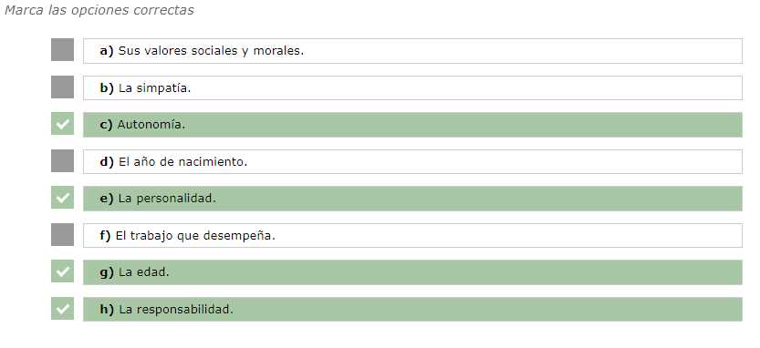

---

## Ejercicio 3: Disposiciones del aula

Relaciona la disposición de cada aula con su característica principal:

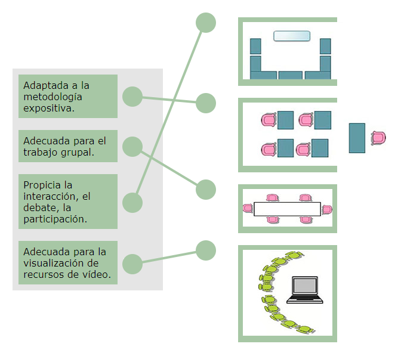

---

## Ejercicio E1. Actividad Individual Supervisada por Tutor asociada a los CE1.1 y CE1.2 (Unidad de aprendizaje 1, Epígrafe 2.2.7.5) Actividad evaluable

PDF Aparte

---

## Ejercicio 4: Actividades y conocimientos

| Actividad o conocimiento                                     | Tipo de contenido   | Justificación                                                |
| ------------------------------------------------------------ | ------------------- | ------------------------------------------------------------ |
| 💧 Hacer un decálogo para utilizar el agua en casa de manera responsable. Valoración de la importancia del agua. | 🌱 **Actitudinal**   | Promueve valores y comportamientos responsables relacionados con el uso del agua. |
| ⚗️ Composición del agua. Estructura y propiedades.            | 📘 **Conceptual**    | Se centra en conocimientos teóricos y comprensión de hechos y conceptos. |
| 🌦️ Experimento: ¿Cómo se producen las precipitaciones?        | 🧰 **Procedimental** | Implica realizar una práctica o experiencia para aprender haciendo. |

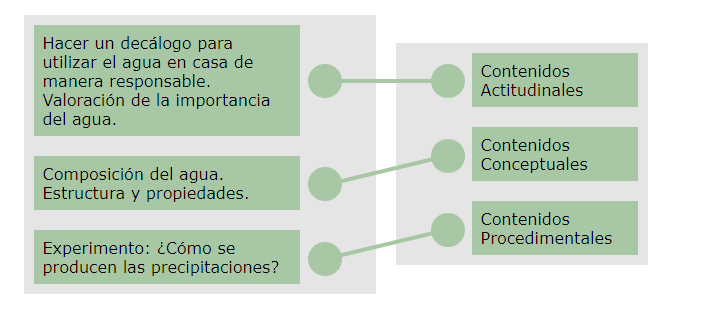

---

## Ejercicio E2. Actividad colaborativa a través del Foro asociada al CE1.6 (Unidad de aprendizaje 1, Epígrafe 2.3.1.1) Actividad evaluable

PDF aparte y publicado en foro.

---

## Ejercicio 5: Funciones de la formación de adultos

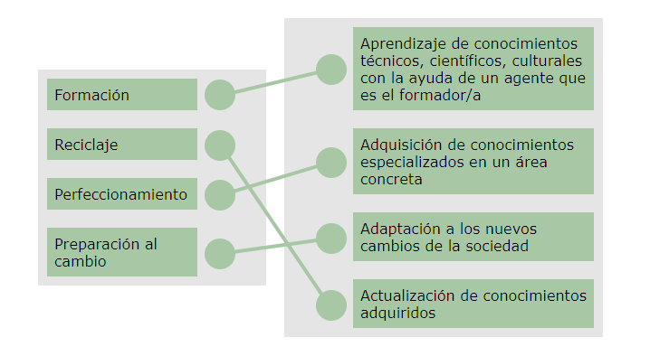

---

## Ejercicio 6: Perfil y funciones

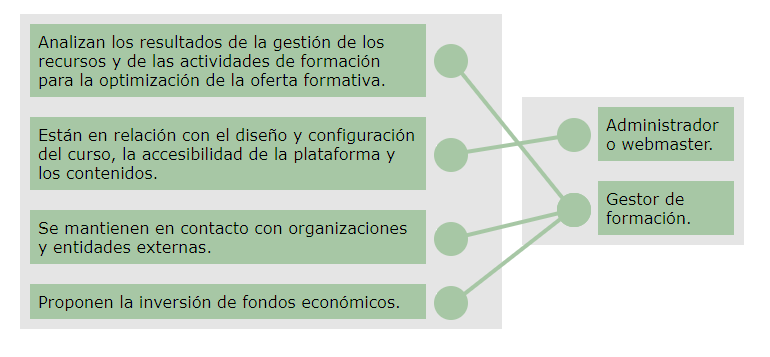

---

## Ejercicio 7: Aspectos del aprendizaje adulto

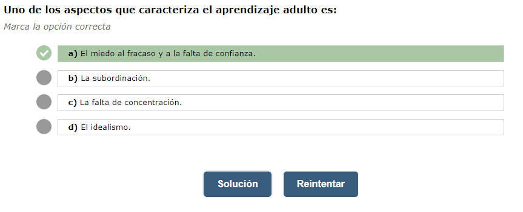

---

## Ejercicio 8: Aprendizaje significativo

Completa el siguiente texto:

El aprendizaje `significativo` se produce cuando los contenidos se relacionan de forma no arbitraria y sustancial con lo que el participante ya conoce. El papel del docente es de `facilitador`, estimulando la participación y la `transferencia` de los conocimientos a diferentes circunstancias. Ausubel señala tres ventajas: una mayor `retención` y recuerdo de lo aprendido, una mayor `capacidad` de aprender otros contenidos relacionados y mayor `facilidad` para el “reaprendizaje” cuando se ha producido el olvido.

---

## Ejercicio 9: Tipos de aprendizaje y sus explicaciones

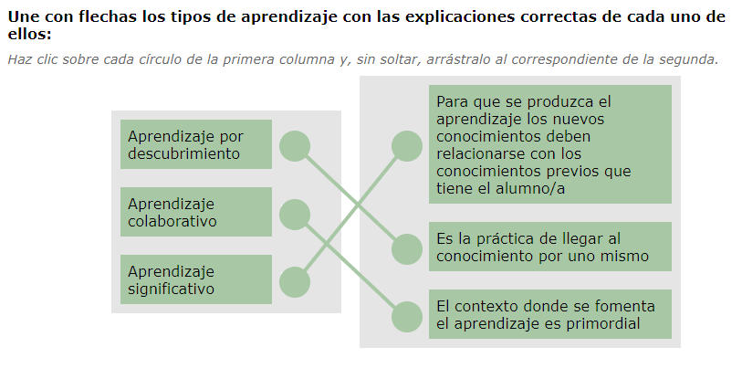

---

## Ejercicio 10: Selecciona los enunciados verdaderos (aprendizaje)

Selecciona los enunciados correctos.

| Enunciado                                                    | Valoración  | Justificación                                                |
| ------------------------------------------------------------ | ----------- | ------------------------------------------------------------ |
| a) Si el aprendizaje está asociado a emociones desagradables muy poco se podrá retener. | ✅ Verdadero | Las emociones negativas dificultan la atención y la memoria; un clima positivo favorece el aprendizaje. |
| b) El concepto de refuerzo se refiere a proporcionar datos al alumnado acerca de los aciertos o fallos de su ejecución, que le permita corregir errores e incrementar el aprendizaje. | ❌ Falso     | Eso describe el **feedback**, no el refuerzo. El refuerzo busca **aumentar** una conducta mediante consecuencias positivas. |
| c) El alumno adulto tiene interés, pero sólo por aquello que pueda satisfacer sus necesidades. | ✅ Verdadero | En la formación de adultos prima la **utilidad** y la conexión con necesidades reales. |
| d) La persona adulta está acostumbrada a asumir responsabilidades y necesitar participar en su propio proceso de aprendizaje. | ✅ Verdadero | El adulto quiere **autonomía** y sentirse parte activa del proceso. |
| e) La aplicabilidad se refiere a la aplicación de los conocimientos y habilidades, adquiridas en el aula, al marco laboral. | ❌ Falso     | La aplicabilidad es más amplia; se refiere a la **utilidad práctica inmediata**, no solo al ámbito laboral. |
| f) La transferencia es la aplicación de un conocimiento o habilidad en una gran variedad de situaciones dentro de la clase. | ❌ Falso     | La transferencia ocurre cuando se aplica lo aprendido a **nuevos contextos o situaciones diferentes**. |
| g) La relevancia que un aprendizaje tenga para la persona depende de sus necesidades y de la medida en que éste le satisfaga. | ✅ Verdadero | Cuanto más relacionado esté con sus intereses, más significativo será el aprendizaje. |
| h) Para que el aprendizaje sea efectivo hay que repetir muchas veces y en la misma situación. | ❌ Falso     | La repetición mecánica no garantiza el aprendizaje; se necesita **variar y aplicar** en distintos contextos. |
| i) Si el alumnado conoce los objetivos que se pretenden conseguir las posibilidades de éxito son mayores. | ✅ Verdadero | Saber los objetivos mejora la **motivación** y orienta el aprendizaje. |
| j) La persona adulta domina su emotividad, pero el miedo al fracaso y el sentimiento de ridículo es mayor. | ✅ Verdadero | Es habitual que el adulto tema equivocarse o ser juzgado en grupo, aunque controle sus emociones. |

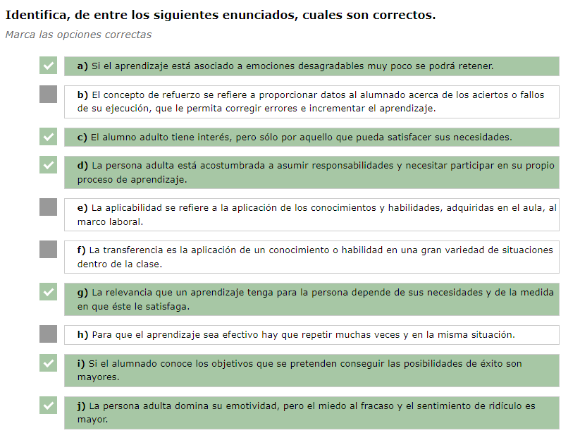

---

## Ejercicio 11: Agrupación de estilos de aprendizaje según Honey y Mumford

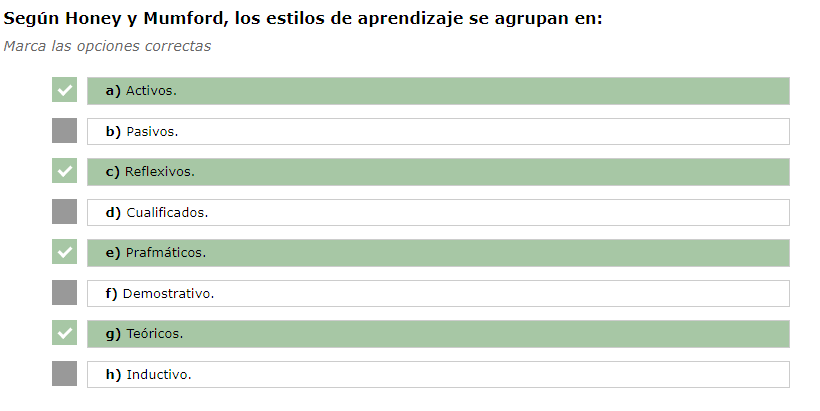

> [!caution]
>
> La opción e) Pragmáticos. Está mal escrito “prafmáticos”.

---

## Ejercicio 12: Características de la atención

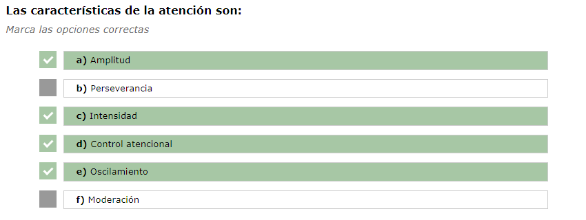

---

## Ejercicio 13: La memoria...

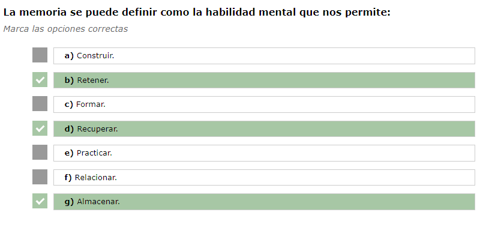

---

## Ejercicio 14: Motivación. Selecciona los enunciados correctos.

Selecciona los enunciados correctos:

| Enunciado                                                    | Valoración  | Justificación                                                |
| ------------------------------------------------------------ | ----------- | ------------------------------------------------------------ |
| a) La motivación intrínseca se relaciona con la autorrealización. | ✅ Verdadero | Nace del interés interno y del crecimiento personal (autorrealización). |
| b) La motivación extrínseca consiste en que la propia tarea mueve a la persona. | ❌ Falso     | Eso define la **intrínseca**; la extrínseca depende de recompensas/castigos externos. |
| c) La actividad motivada implica voluntad por parte de quien la realiza. | ✅ Verdadero | Requiere intención y decisión de actuar.                     |
| d) El elemento más importante de la motivación es la existencia de un fin. | ❌ Falso     | La meta es clave, pero no “lo más importante” de forma absoluta; intervienen más factores (necesidades, expectativas, refuerzo…). |
| e) Las necesidades sociales agrupan los impulsos que hacen referencia a la pertenencia a un grupo. | ✅ Verdadero | Incluyen afiliación, aceptación y relaciones.                |
| f) Las necesidades adquiridas son derivadas de la práctica.  | ✅ Verdadero | Se desarrollan con la experiencia (logro, poder, afiliación). |
| g) En la pirámide de Maslow, la necesidad inferior es la de Seguridad. | ❌ Falso     | La base son las **fisiológicas** (comida, sueño, abrigo).    |
| h) Los impulsos son los elementos que activan y mantienen la conducta. | ✅ Verdadero | Actúan como fuerzas internas que energizan y dirigen la conducta. |
| i) La autoestima es la superior de las necesidades en la pirámide de Maslow. | ❌ Falso     | La superior es la **autorrealización**.                      |
| j) Las necesidades psíquicas incluyen los instintos y los impulsos que garantizan nuestra vida. | ❌ Falso     | Eso corresponde a **fisiológicas/biológicas**, no a psíquicas. |

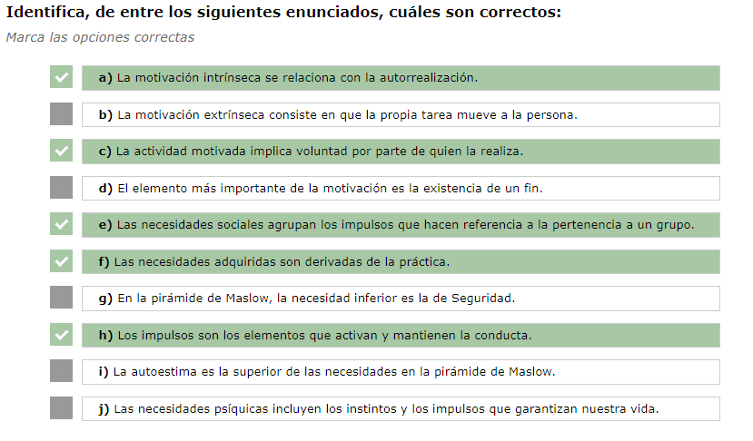

---

## Ejercicio E4. Práctica asociada al CE2.2 (Unidad de aprendizaje 1, Epígrafe 3.3.4)

PDF aparte

---

## Ejercicio 15: Proceso de la motivación

✅ **b)** Necesidad de satisfacción.
✅ **c)** Impulso de satisfacer la necesidad.
✅ **e)** El objeto o incentivo.

El proceso de la motivación parte de una **necesidad**, genera un **impulso** o deseo de cubrirla, y dirige la conducta hacia un **incentivo** que permita satisfacerla.

Las demás opciones (regalos, castigo, aprobación o reflexión) pueden influir, pero no forman parte directa del **proceso básico de motivación**.

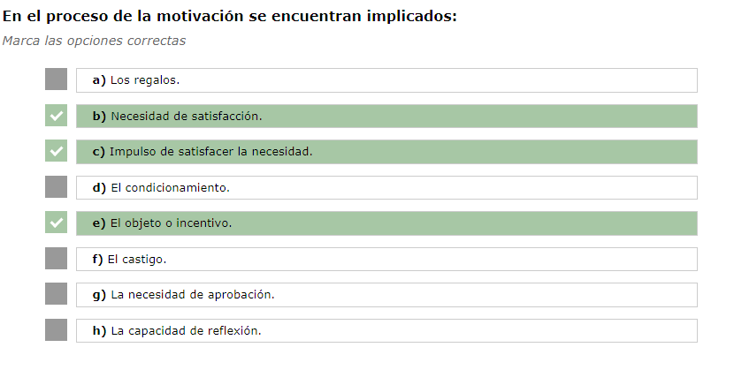

---

## Ejercicio E5. Práctica asociada al CE3.1 (Unidad  de aprendizaje 1, Epígrafe 4.3) Actividad  evaluable

PDF aparte.

---

## Ejercicio 16. Elementos del proceso de comunicación

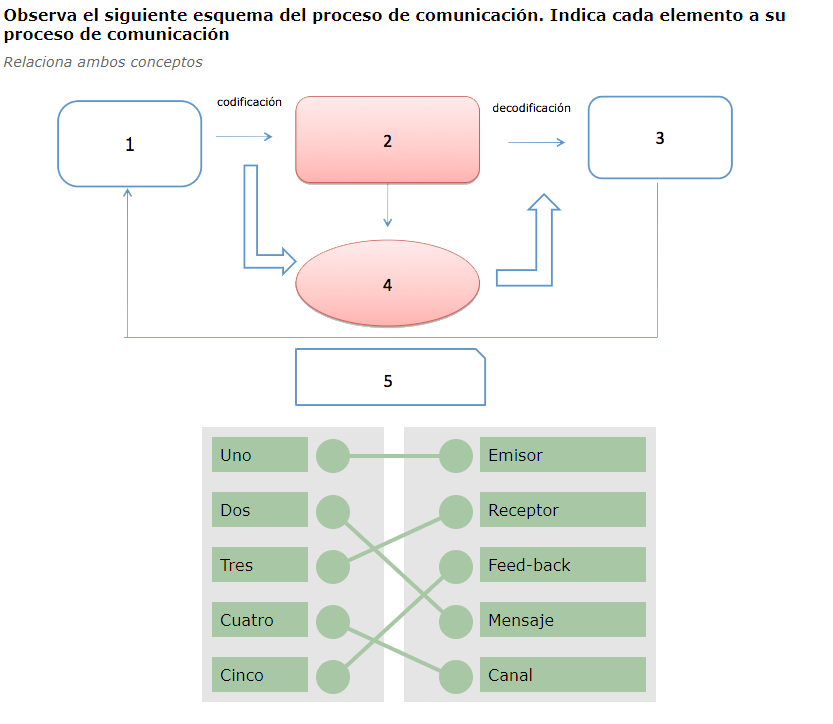

---

## Ejercicio E6. Actividad colaborativa a través del Foro asociada al CE3.2 (Unidad de aprendizaje 1, Epígrafe 4.4.2) Actividad evaluable

PDF aparte.

---

## Ejercicio E7. Práctica asociada al CE3.4 (Unidad  de aprendizaje 1, Epígrafe 4.5) Actividad  evaluable 

PDF aparte.

---

## Ejercicio 17. Barreras

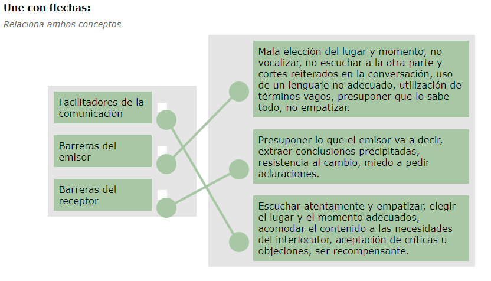

---

## Ejercicio E8. Práctica asociada al CE3.6 (Unidad de aprendizaje 1, Epígrafe 4.6.2) Actividad evaluable

PDF aparte.

---

## Ejercicio 18: Afirmaciones sobre la comunicación

Selecciona los enunciados correc

| Enunciado                                                    | Valoración  | Justificación                                                |
| ------------------------------------------------------------ | ----------- | ------------------------------------------------------------ |
| a) Todo mensaje tiene dos aspectos, uno intelectual que es aquello que decimos y otro afectivo que se refiere a cómo lo decimos. | ✅ Verdadero | Todo mensaje combina un contenido racional y otro emocional que influye en cómo se interpreta. |
| b) A mayor número de canales utilizados para transmitir el mensaje menor es la posibilidad de comprensión. | ❌ Falso     | Cuantos más canales (voz, gestos, recursos visuales) se utilicen, mayor será la comprensión. |
| c) No se producirá aprendizaje si no somos capaces de comunicar de forma eficaz lo que queremos enseñar. | ✅ Verdadero | La comunicación eficaz es la base del proceso de enseñanza-aprendizaje. |
| d) Los elementos de la comunicación son: emisor, receptor, mensaje, canal, código, feed-back y contexto. | ✅ Verdadero | Son los componentes esenciales del proceso comunicativo.     |
| e) Entendemos la habilidad comunicativa como la capacidad que tiene la persona para utilizar un lenguaje construido con tecnicismos. | ❌ Falso     | La habilidad comunicativa es expresarse con claridad y adecuación, no usar tecnicismos. |
| f) El tono de la voz es la habilidad que tenemos para encadenar las ideas. | ❌ Falso     | El tono refleja emoción o actitud, no estructura del discurso. |
| g) Los cambios en la velocidad de transmisión de información son importantes; se aconseja aumentar la velocidad en un contenido desconocido. | ❌ Falso     | En contenidos nuevos se debe hablar más despacio para facilitar la comprensión. |
| h) El docente transmite con sus gestos y tono de voz la actitud que mantiene hacia el alumnado y también hacia la materia que imparte. | ✅ Verdadero | La comunicación no verbal del docente influye en la percepción del grupo. |
| i) Los gestos de manos y pies cooperan a la fluidez de la comunicación, la refuerzan, sustituyen, pero siempre que no sean bruscos y en exceso. | ✅ Verdadero | Los gestos refuerzan el mensaje si son naturales y moderados. |
| j) Para transmitir seguridad es importante mantener una expresión facial sonriente durante toda la sesión. | ❌ Falso     | Una sonrisa natural ayuda, pero mantenerla todo el tiempo resulta artificial y poco creíble. |

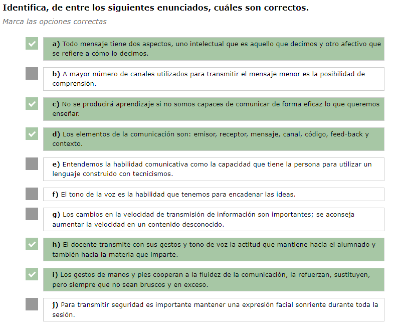

---

## Ejercicio 19: Proceso de escucha (activa)

¿Cuáles de las siguientes opciones se encuentran implicadas en el proceso de escucha?: (Marca las opciones correctas)

> [!warning]
>
> Con “*escucha*” se refiere a **escucha activa**.

| Enunciado                                                    | Valoración  | Justificación                                                |
| ------------------------------------------------------------ | ----------- | ------------------------------------------------------------ |
| a) Necesidad de satisfacción.                                | ❌ Falso     | Pertenece al proceso de motivación, no al de escucha.        |
| b) El emisor emite el mensaje.                               | ✅ Verdadero | La escucha comienza cuando el emisor transmite un mensaje que el receptor debe atender. |
| c) Impulso de satisfacer la necesidad.                       | ❌ Falso     | Es un elemento motivacional, no comunicativo.                |
| d) El receptor escucha con esfuerzo físico y mental.         | ✅ Verdadero | Escuchar requiere atención, concentración y esfuerzo físico y mental. |
| e) El objeto o incentivo.                                    | ❌ Falso     | Es propio de la motivación, no del proceso de escucha.       |
| f) La necesidad de aprobación.                               | ❌ Falso     | Se relaciona con la motivación social, no con la escucha.    |
| g) La capacidad de reflexión.                                | ❌ Falso     | No forma parte directa del proceso de escucha según el temario. |
| h) El receptor: se concentra en el otro, trata de comprender el mensaje, resume el mensaje, confirma el mensaje. | ✅ Verdadero | Resume las fases de la escucha activa: atención, comprensión y verificación del mensaje. |

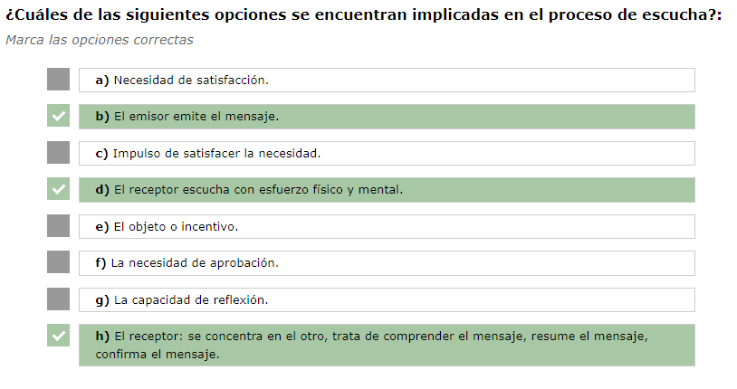

---

## Ejercicio 20. Herramientas de comunicación

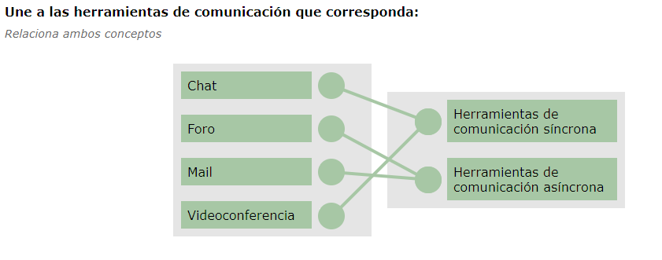

---

## Ejercicio E9. Práctica asociada al CE3.5 (Unidad de aprendizaje 1, Epígrafe 4.9.2) Actividad evaluable

PDF Aparte.

---

## 🧪Test final MF1444-UF1645-01

**1) La exposición de un tema no se improvisa. La preparación de un tema conlleva varios factores de preparación. ¿De qué factores se trata?:**  
a) Preguntarse por la finalidad.  
b) Precisar el tiempo de exposición.  
c) Determinar las características del alumnado.  
d) Todas son correctas.  

**2) En un mensaje podemos distinguir diferentes partes. Las frases que representan el significado de lo que queremos transmitir sería:**  
a) Contenido.  
b) Código.  
c) Aspecto emocional del mensaje.  
d) Tratamiento que le damos al mensaje.  

**3) Con qué concepto relacionarías la siguiente expresión: "Lo que se va a aprender en el aula ha de tener una conexión directa con lo que la persona hará en el puesto de trabajo":**  
a) Novedad.  
b) Aplicación.  
c) Relevancia.  
d) Generalización.  

**4) Con cuál de los siguientes conceptos relacionarías esta expresión: "Cuando la tarea por aprender puede relacionarse con los conocimientos previos que tiene la persona, se asegura el aprendizaje”:**  
a) Aprendizaje significativo.  
b) Generalización-discriminación.  
c) Organización por configuraciones globales.  
d) Progresión de la dificultad.  

**5) La atención implica una variedad de procesos. ¿Cuál de ellos no es correcto?:**  
a) Selección.  
b) Intensidad.  
c) Alerta.  
d) Recuerdo.  

**6) Hay diferentes tipos de atención, el que apenas requiere atención ya que no implica la participación consciente, se conoce con el nombre:**  
a) Controlada.  
b) Voluntaria.  
c) Automática.  
d) Todas son correctas.  

**7) ¿Qué podemos tener en cuenta para mantener la atención?:**  
a) Partir del nivel de atención adecuada.  
b) Distribuir adecuadamente la sesión de aprendizaje.  
c) Ser consciente de las demandas atencionales que se exige al alumnado.  
d) Todas son correctas.  

**8) Para retener la información en la memoria tenemos que:**  
a) Comprenderla, asociarla y relacionar con los conocimientos previos.  
b) Fijarla mediante la repetición y aplicación de reglas mnemotécnicas.  
c) Relacionar la nueva información con las metas propias.  
d) Todas son correctas.  

**9) ¿Cuál de los siguientes enunciados relacionados con la motivación no es correcto?:**  
a) La motivación no se puede comprobar directamente.  
b) La conducta motivada arranca siempre de una fase de carencia.  
c) Si el objetivo no es alcanzado se produce insatisfacción y aparece la frustración.  
d) La conducta motiva selecciona y analiza la información para poder tomar las decisiones.  

**10) Los recursos de comunicación verbal que puede utilizar el docente son:**  
a) Velocidad.  
b) Volumen.  
c) Vocalización.  
d) Todas son correctas.  

✅ <strong>Respuestas correctas y justificación</strong>

1. **d) Todas son correctas.**  
La exposición requiere planificar la finalidad, el tiempo y las características del alumnado.

2. **a) Contenido.**  
Es el significado de lo que se quiere transmitir dentro del mensaje.

3. **b) Aplicación.**  
Relaciona el aprendizaje con su uso práctico en el entorno laboral.

4. **a) Aprendizaje significativo.**  
El nuevo conocimiento se asimila mejor al vincularse con lo que ya se sabe.

5. **d) Recuerdo.**  
El recuerdo pertenece a la memoria, no a los procesos de atención.

6. **c) Automática.**  
La atención automática no requiere esfuerzo consciente ni control voluntario.

7. **d) Todas son correctas.**  
Mantener la atención exige planificar la sesión, conocer el nivel y gestionar la carga atencional.

8. **d) Todas son correctas.**  
Retener implica comprender, repetir y vincular con metas personales.

9. **d) La conducta motiva selecciona y analiza la información para poder tomar las decisiones.**  
Incorrecta: la motivación impulsa la acción, pero no selecciona ni analiza información.

10. **d) Todas son correctas.**  
El docente puede modular velocidad, volumen y vocalización para reforzar el mensaje.

