[TOC]

---

# MF1444 - Impartición y tutorización de acciones formativas para el empleo

# UF1645 - Impartición de acciones formativas para el empleo

# Unidad 02 - Dinamización del aprendizaje en el grupo según modalidad de impartición

## Introducción y objetivos

En esta segunda unidad de aprendizaje vamos a profundizar y conocer las principales técnicas de **trabajo en grupo** que podemos utilizar tanto en **educación online** como en **formación presencial**.

**📖Contenidos:**

1. Aspectos generales
2. Características distintivas del aprendizaje en grupo.  
3. Tipos de grupos.  
4. Fases del desarrollo grupal.  
5. Técnicas de dinamización grupal, situación y objetivos de aprendizaje.  
6. Coordinación y moderación del grupo.  
7. Tipos de respuestas ante las actuaciones del alumnado.  
8. Resolución de conflictos.

**🎯Objetivo de la unidad:**  

Promover la motivación y la participación activa del alumnado.

---

## 1. Aspectos generales

En la formación de adultos, el **grupo** es un elemento clave en la marcha del curso. Puede ser una **fuerza activa y dinamizadora**, o por el contrario, **un freno o una dificultad** para el avance del aprendizaje.

Actualmente, numerosos autores han propuesto distintas definiciones de grupo, pero todas coinciden en dos ideas fundamentales:

- Se trata de un **conjunto de personas con un fin u objetivo común**.  
- En el grupo se producen **interacciones** y se adquiere una **identidad compartida**, basada en valores, ideas y normas que hacen que cada miembro se sienta parte del grupo.

> [!note] Definición
>
> 📢 Un **grupo** es cuando dos o más personas establecen relaciones entre sí, poseen cierta interdependencia y comparten una unidad reconocible.

---

## 2. Características distintivas del aprendizaje en grupo

> [!note] Definición
>
> 📢 Un **grupo** es un conjunto de personas unidas por un objetivo común, que pueden interaccionar entre sí, aceptando ciertas normas, compartiendo emociones y participando de un sentimiento común: *el espíritu de equipo*.

Las principales características de los grupos están relacionadas con la **comunicación**, la **estructura**, la **cohesión**, las **metas** y las **normas**:

1. 💬 **Comunicación o interacción:** los miembros mantienen relaciones entre sí, con el docente y con otros grupos.  
2. 🧩 **Estructura:** es la distribución y orden de los componentes de un grupo, basada en el sistema de relaciones, los roles desempeñados, el estatus, etc.  
3. 🤝 **Cohesión:** grado en que los componentes de un grupo desean permanecer en él. En los grupos cohesionados los miembros se preocupan por las relaciones, están más motivados y obtienen mayor rendimiento.  
4. 🎯 **Objetivos o metas:** orientan las actividades hacia los fines planteados. Cuando los objetivos no son claros ni comprendidos, el grupo tiene dificultades para mantenerse unido.  
5. 📏 **Normas:** son las reglas que se establecen y deben seguir las personas, o a las que se ajustan las conductas, tareas y actividades que realiza el grupo.

En el desarrollo de un grupo, los miembros **aprenden modos más efectivos de trabajar juntos**, desarrollan la **confianza mutua**, se abren a **nuevas experiencias**, **mejoran la comunicación** y se sienten **libres para participar activamente**.

Los participantes de las acciones de formación no están en el grupo-clase por elección; los objetivos, la estructura y los contenidos de trabajo están **predefinidos**.  
Por ello, el buen funcionamiento del grupo dependerá de la presencia de una serie de aspectos básicos:

| **Aspecto**                                  | **Descripción**                                              |
| -------------------------------------------- | ------------------------------------------------------------ |
| 💖 **Afecto, estima y seguridad**             | El grupo proporciona estos sentimientos.                     |
| 🎯 **Metas grupales conocidas y compartidas** | Reconocer qué objetivos se persiguen favorece el análisis, la evaluación, el razonamiento lógico y la síntesis. |
| 🧑‍🤝‍🧑 **Roles asumidos y deseados**            | Cada miembro desempeña una función aceptada en el grupo que influye en su funcionamiento. |
| 📏 **Normas y cohesión grupal**               | Es necesario desarrollar el trabajo con sentido de cooperación y fijar normas pactadas y aceptadas. |
| 💬 **Comunicación e interacción**             | El grupo permite explicar, escuchar, discutir, cuestionar, presentar y defender una posición. |
| 🫂 **Pertenencia**                            | Sentimiento de formar parte de un grupo.                     |

> [!important]
> **Aportaciones de Likert (1961):**  
> Likert estudió los grupos en entornos laborales y llegó a conclusiones extrapolables al ámbito formativo:
>
> - 💡 Los grupos de trabajo son fuentes significativas de satisfacción de las necesidades sociales de las personas.  
> - 🚀 Los grupos que cumplen esta función psicológica son más productivos.  
> - 🧭 La administración debe crear grupos de trabajo efectivos, fomentando **relaciones de apoyo**.  
> - 🗳️ Una estructura organizacional efectiva se basa en **grupos democráticos y participativos**, vinculados mediante asociaciones que se solapan.  
> - 🔗 La coordinación se logra a través de individuos que desempeñan **funciones de enlace**.

---

## 3. Tipos de grupos

### 3.1 Criterios de clasificación

La formación de grupos en el contexto educativo es **inevitable** y ejerce una influencia profunda en la conducta y el rendimiento de sus integrantes.  
La participación en un grupo puede tener **consecuencias positivas o negativas** para el proceso de aprendizaje.

La **adquisición de habilidades y actitudes** requiere tanto la **intervención del docente** como la **participación activa del alumnado**.

Podemos identificar los grupos según distintos **criterios de clasificación**:

- 👥 **Según el número de miembros:**

  - **Microgrupo:** formado por menos de 20 personas. Se favorece la relación directa.  
  - **Macrogrupo:** a partir de 20 personas. Se dificulta la relación directa.  

  

- 🔗 **Según las relaciones:**

  - **Primarios:** las relaciones interpersonales son directas y diarias. Hay una gran fluctuación del tono emocional, satisfacciones e insatisfacciones.  
    👉 *Ejemplo:* la familia o los grupos de trabajo.  
  - **Secundarios:** las relaciones interpersonales son más abstractas y se basan en un interés común externo.  
    👉 *Ejemplo:* la sociedad o la empresa.  

  

- 🧩 **Según la estructura:**

  - **Informales:** poseen una estructura flexible y carecen de normas establecidas.  
  - **Formales:** requieren una estructura más compleja y organizada para alcanzar sus objetivos.  

  

- 🧑‍🤝‍🧑 **Según la composición:**

  - **Exclusivos:** solo admiten cierto tipo de personas que cumplen determinados requisitos.  
    👉 *Ejemplo:* colegios profesionales.  
  - **Inclusivos:** abiertos a cualquier persona que acepte las normas.  
    👉 *Ejemplo:* partidos políticos.  

---

### 3.2 Características

La mayoría de los **grupos de trabajo** presentan ciertas características comunes:

1. 🧱 **Estructura formal:** se organizan de manera formal, como en el caso del **grupo-clase** que realiza un mismo curso formativo.  
2. 🎯 **Orientación a las tareas:** el grupo tiene un fin claro. En los grupos formativos, la finalidad es realizar el curso y alcanzar las competencias establecidas.  
3. ⏳ **Permanencia temporal:** tienden a mantenerse estables durante un periodo determinado.  
4. 🧩 **Actividades alineadas con los objetivos:** las actividades del curso deben contribuir directamente a los objetivos y la finalidad de la formación.  
5. 🧭 **Organización consciente:** los cursos y grupos formativos están planificados y estructurados de manera deliberada.

> [!note]
> Existen numerosos estudios sobre el comportamiento de los grupos en entornos laborales. Puedes encontrar más información en [monograficas.com](http://www.monografias.com/trabajos58/dinamica-grupal/dinamica-grupal2.shtml#ixzz2wWHecmLy).

Los grupos se pueden clasificar en dos tipos, **formales** e **informales**. Tienen las siguientes características:

👔**Grupos formales**

Los **grupos formales** tienen **derechos y obligaciones definidos**, y su comportamiento suele ser **estructurado y limitado**.  
Los **líderes** son designados y la **estructura, reglas y procedimientos** están codificados.  
Cada persona cumple una función establecida y debe comportarse conforme a las normas formales.

Según **Greenberg y Baron (1992)**, los grupos formales se dividen en:

- 🧑‍⚖️ **Grupos de mando:** establecidos por la estructura y las reglas organizacionales, como los **comités** o **asambleas permanentes**.  
- 🧑‍🔧 **Grupos de tarea:** integrados por personas con habilidades específicas, como **grupos de trabajo** o **comisiones ad hoc**.

🍻**Grupos informales**

Los **grupos informales** evolucionan de forma **natural y espontánea**.  
Surgen por afinidades personales o intereses comunes, y pueden incluir a personas de distintas áreas o niveles.  
Se forman para **preservar la amistad, la ayuda mutua** y reforzar **creencias o valores compartidos**.

Los grupos informales se dividen en:

- 💡 **Grupos de interés:** se unen porque comparten **intereses comunes**.  
- 🤝 **Grupos de amigos:** existen principalmente para **satisfacer necesidades sociales**.

La **composición, estructura y organización** de los grupos informales está influida por los **convenios formales** existentes en las organizaciones, que establecen el contexto en el que surgen y se desarrollan las relaciones sociales.

---

## 4. Fases del desarrollo grupal

Los factores fundamentales para considerar a un conjunto de personas como un **grupo** son los **objetivos comunes** y la **interacción entre los miembros**.  
En función de estos elementos, podemos distinguir las diferentes **fases por las que evoluciona un grupo**:

1. 🧭 **Fase de orientación:**  
    La actividad grupal se centra en **definir las metas y tareas**, establecer **cómo se van a realizar** y qué **habilidades son necesarias** para su ejecución.

2. 🪴 **Fase de asentamiento:**  
    Se produce la **superación de las primeras dificultades** y un **aumento de los sentimientos positivos** hacia la realización del trabajo.

3. ⚙️ **Fase de productividad:**  
    El grupo alcanza una **participación activa**, los **roles están asumidos**, las **metas son compartidas**, y existe una **coordinación efectiva** y un **clima de colaboración**.

4. 🏁 **Fase de clausura:**  
    El grupo **toma conciencia de su actuación**, y es importante **evitar sentimientos de frustración** por la sensación de pérdida o finalización.

> [!important]
> Para que el grupo se constituya como tal desde el inicio, conviene tener en cuenta varios aspectos clave:
> - 💬 **Reconocer la estructura informal** de la clase.  
> - 🎯 **Definir metas de aprendizaje propias** del grupo-clase.  
> - 📏 **Establecer normas internas** que regulen el funcionamiento del aula.  
> - 🤝 **Fomentar la colaboración frente a la competencia.**  
> - 🗣️ **Estimular la participación activa** en el aula.

---

## 5. Técnicas de dinamización grupal, situación y objetivos de aprendizaje

### 5.1 Conceptos generales

- 🧰 **Las técnicas de grupo** son un conjunto de medios y procedimientos aplicados a una situación de grupo con el propósito de **lograr productividad y gratificación grupal**.  
- ⚖️ **No existe una técnica ideal**, será necesario seleccionar la **más apropiada y oportuna** para cada grupo formativo.  
- 🧩 Debe existir la **unidad reconocible como grupo**.  
- 🚀 Una utilización adecuada de la técnica se traduce en **mayor rendimiento y satisfacción** por el trabajo realizado.

> [!tip] Recuerda
> Las técnicas ayudan a desarrollar la **dinámica de aprendizaje** porque buscan **liberar el potencial y la creatividad** del alumnado para resolver problemas y aprovechar nuevas oportunidades.  
> Los ejercicios deben referirse a **situaciones estructuradas** que se trabajen **en grupo**.

> [!important]
> **Objetivo general:**  
> Conseguir la **participación**, el **desarrollo social** de los integrantes del aula, el **conocimiento de distintas perspectivas**, la **cooperación** y el **asentamiento de principios de convivencia y tolerancia**, que conduzcan a unas relaciones más adecuadas.

Cuando **elegimos una técnica de grupo debemos tener en cuenta** los siguientes aspectos:

- 👥 **Conocer el grupo**, su tamaño y su nivel de madurez.  
- 🎯 **Identificar los objetivos** que se persiguen con la actividad.  
- 🧑‍🏫 **Reflexionar sobre nuestra capacitación** para aplicar la técnica, dinamizando el trabajo en grupo e individualizando la atención al alumno según sus actitudes y resultados.  
- 🕒 **Considerar aspectos logísticos** como el lugar de aplicación, los recursos disponibles y el tiempo asignado.

---

### 5.2 Técnicas de grupo

En la formación profesional para el empleo podemos encontrar diversas **técnicas de grupo** que favorecen la participación, la cooperación y la creatividad del alumnado.

#### Tormenta de ideas o *Brainstorming*

- 🪑 **Disposición del grupo:** libre o semicircular.  

  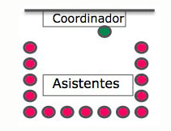

- 👥 **Tamaño del grupo:**  
  - ✅Pequeño.  
  - ✅Mediano.  
  - ✅Grande.  
  
- 💡 **Consiste en:**  
  - Expresar ideas u ocurrencias libremente, de forma informal, sobre un tema o problema planteado.  
  - Un coordinador anota las ideas en papel o pizarra.  
  - No hay autocensura, crítica ni autocrítica.  
  - Al finalizar, se analizan las ideas, se seleccionan las mejores y se decide su viabilidad.  
  
- 🌱 **Beneficios:**  
  - Aprender por asociación, analizar y decidir.  
  - Desarrollar la creatividad y la resolución de problemas.

---

#### Phillips 6/6

- 🪑 **Disposición del grupo:** en subgrupos.

  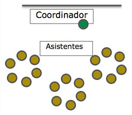

- 👥 **Tamaño del grupo:**  
  - ✅Pequeño.  
  - ✅Mediano.  
  - ⚠️Grande (subdividido en grupos de 6 personas).  
  
- 💡 **Consiste en:**  
  Seis personas discuten durante seis minutos sobre un tema.  
  Después, un portavoz expone las conclusiones o ideas esenciales del grupo al resto.

---

#### Estudio de casos

- 🪑 **Disposición del grupo:** flexible, según el caso a trabajar.  

  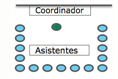

- 👥 **Tamaño del grupo:**  
  - ✅Pequeño.  
  - ✅Mediano.  
  - ❌Grande (demasiadas intervenciones, se necesita mucho tiempo y el debate se vuelve superficial).
  
- 💡 **Consiste en:**  
  - Exponer un caso (por escrito, oralmente o mediante dramatización) para que los participantes lo analicen y propongan soluciones.  
  - Puede trabajarse de forma individual o en subgrupos, y finalmente poner en común las conclusiones.  
  
- 🌱 **Beneficios:**  
  - Desarrollar la capacidad de razonamiento y toma de decisiones ante un problema.

---

#### Técnica del grupo nominal

- 🪑 **Disposición del grupo:** en semicírculo o alrededor de una mesa.  

  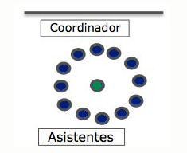

- 👥 **Tamaño del grupo:**  
  - ❌Pequeño. La técnica se vuelve demasiado rígida y poco eficiente. Habría pocas ideas individuales que votar para llegar a un consenso. Con un debate guiado se consigue lo mismo en grupos pequeños.
  - ✅Mediano.  
  - ✅Grande.  
  
- 💡 **Consiste en:**  
  - Presentar un objetivo o tema de trabajo.  
  - Cada participante anota de forma individual las ideas que se le ocurran.  
  - Las ideas se reflejan en una pizarra o rotafolios, se puntúan (por ejemplo, del 1 al 10), y se discuten los resultados para consensuar la más adecuada.  
  
- 🌱 **Beneficios:**  
  - Obtener información, analizar situaciones o tomar decisiones.  
  - Integrar conocimientos ya tratados y fomentar la participación de todos los miembros.

---

#### Dramatización o *role playing*

- 🪑 **Disposición del grupo:** espacio abierto para representar.  

  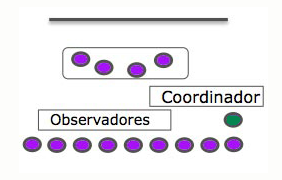

- 👥 **Tamaño del grupo:**  
  - ✅Pequeño.  
  - ✅Mediano.  
  - ✅Grande.  
  
- 💡 **Consiste en:**  
  Representar una situación real o posible con personajes característicos durante 5 a 15 minutos.  
  Luego, se realiza una reflexión sobre lo sucedido desde el punto de vista de los actores y observadores.  
  
- 🌱 **Beneficios:**  
  - Analizar competencias y habilidades requeridas en situaciones reales o laborales.  
  - Aprender de los aciertos y errores propios y ajenos.  

> [!important]
>
> El *role playing* se centra las habilidades interpersonales, la comunicación y las actitudes.
>
> 👉 *Ejemplo*: un cliente y un vendedor, o un jefe y un empleado.

---

#### Simulación

- 🪑 **Disposición del grupo:** similar al *role playing*.  

  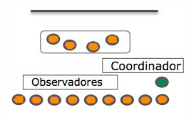

- 👥 **Tamaño del grupo:**  
  - ✅Pequeño.  
  - ✅Mediano.  
  - ❌Grande. Pierde realismo cuando muchos observan pero pocos intervienen. Cada miembro asume un rol o tarea específica, lo que se complica si el grupo es grande.
  
- 💡 **Consiste en:**  
  - Recrear una situación o entorno sin dramatizar los papeles personales, sino el contexto general.  
  - Actualmente, se utilizan también **simuladores virtuales** y herramientas tecnológicas que reproducen entornos reales.  

> [!important]
>
> La **simulación**, a diferencia del *role playing*, lo que se representa no son los papeles individuales, sino **la situación global** o **el entorno** en el que se desarrolla una actividad.
>
> 👉 *Ejemplo*: simular el funcionamiento de una empresa, una intervención de emergencia o una red informática.

---

#### Seminario

- 🪑 **Disposición del grupo:** en pequeños equipos de trabajo.  

  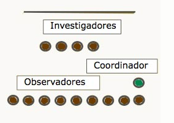

- 👥 **Tamaño del grupo:**  
  - ✅Pequeño.  
  - ✅Mediano.
  - ❌Grande. Disminuye la participación real (pocos intervienen, el resto escucha), si todos tienen que exponer y debatir se tarda mucho, dificulta la evaluación individual.
  
- 💡 **Consiste en:**  
  - Un grupo reducido investiga un tema en sesiones planificadas, recurriendo a fuentes originales.  
  - El grupo elige el área temática con el docente, quien organiza los subgrupos y designa responsables.  
  - Se requiere un espacio adecuado y acceso a material, fuentes de información y recursos de apoyo.

---

#### Mesa redonda

- 🪑 **Disposición del grupo:** en torno a una mesa central o en círculo. 

  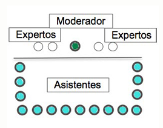

- 👥 **Tamaño del grupo:**  
  - ✅Pequeño.  
  - ✅Mediano.  
  - ✅Grande.  
  
- 💡 **Consiste en:**  
  - Reunir a **3 a 5 especialistas** con puntos de vista diferentes sobre un mismo tema.  
  - Cada uno expone durante 15-20 minutos, y después se abre un pequeño debate para alcanzar acuerdos o conclusiones comunes.
  - 📹 [Ejemplo de mesa redonda en el aula (YouTube)](https://www.youtube.com/embed/wj7luO8hzdk)

<iframe width="100%" height="315" src="https://www.youtube.com/embed/wj7luO8hzdk" title="Ejemplo de mesa redonda en el aula" referrerpolicy="strict-origin-when-cross-origin" frameborder="0" allowfullscreen></iframe>

---

### 5.3 Normas de aplicación

> [!important]
> Para aplicar cualquier técnica grupal es conveniente tener en cuenta:
>
> - La **madurez del grupo**
> - El **tamaño del mismo** 
> - Las **características del espacio físico**.  
>
> Además, es fundamental **definir los objetivos** y **seleccionar la técnica más adecuada**.  
>
> Más allá de la técnica utilizada, el docente debe **motivar al grupo**, estimular la **participación**, la **comunicación** y el **logro de los resultados previstos**.

La **teleformación** presenta un entorno distinto al de la formación presencial.  
En este caso, el aula se transforma en una **plataforma digital**, donde el alumnado interactúa entre sí y con el equipo docente mediante espacios como el **foro**, el **chat** o el **correo electrónico**.

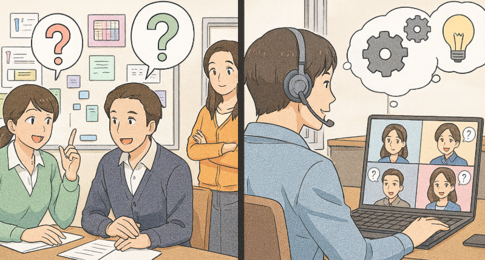

**🧩Normas de aplicación de las técnicas de grupo**

1. 🎯 Aplicarlas siempre con un **objetivo claro y definido**.  
2. 📘 Conocer previamente los **fundamentos teóricos** de la técnica (estructura, posibilidades y riesgos).  
3. 📏 **Seguir el procedimiento** indicado para su correcta ejecución.  
4. 🤝 Fomentar una **atmósfera cordial y democrática**.  
5. 🧠 Mantener una **actitud cooperante** en todo momento.  
6. 💬 Estimular la **participación activa** de todo el grupo.  
7. 🕹️ Basarse en el **“juego limpio”**, el **trabajo voluntario** y la **buena intención**.

**🌐 Normas de aplicación en teleformación**

> [!tip]   
> En la modalidad online, el éxito de las técnicas de grupo depende en gran medida de la **interacción digital** y de la **planificación de los espacios virtuales**.

1. 💻 Utilizar el **foro** como medio principal para proponer técnicas de grupo, usando el **chat** como apoyo complementario.  
2. 👋 Iniciar el curso con una **actividad de presentación y bienvenida** en el foro, para que los estudiantes se conozcan y se cree un buen clima de trabajo.  
3. 🗣️ Organizar **debates** que fomenten el **intercambio de ideas** y la **participación activa**.  
4. 🧑‍🤝‍🧑 **Dividir el grupo grande** en equipos de máximo **seis participantes**, creando para cada uno un foro y un chat específicos donde puedan interactuar de forma reglada.  
5. 🏁 Finalizar el curso con un **foro de evaluación y despedida**, donde el alumnado pueda compartir **propuestas de mejora y valoraciones** del curso.

El **equipo docente** debe estar preparado para hacer un **uso eficaz del foro** y de las actividades planteadas, garantizando la **comunicación continua** y el **acompañamiento pedagógico**.

---

## 6. Coordinación y moderación del grupo

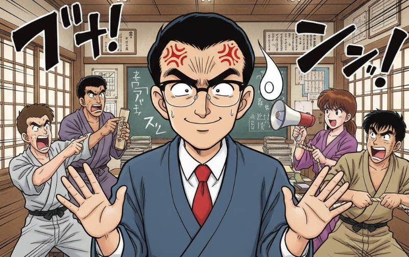

### 6.1 Principios básicos y funciones del docente

El profesorado debe tener en cuenta una serie de **principios básicos** en el trabajo con grupos, tanto en modalidad **presencial** como **online**:

- 💬 **Creación de un ambiente positivo:** propiciar la comunicación, el intercambio, la participación, la igualdad de trato y el respeto.  
- 🤝 **Clima de confianza:** las relaciones amistosas y de camaradería ayudan a reducir la intimidación y facilitan el cambio de actitudes.  
- 🧭 **Liderazgo compartido:** distribuir las funciones entre los miembros del grupo favorece la implicación y la dedicación a la tarea.  
- 🎯 **Desarrollo de objetivos de grupo:** formular explícitamente los objetivos aumenta la cohesión, el sentido de pertenencia y la participación en la toma de decisiones.  
- 🔄 **Flexibilidad organizativa:** permite adaptarse a los cambios e imprevistos que surjan durante el trabajo grupal.  
- 📢 **Comunicación y consenso:** las decisiones deben adoptarse de manera participativa, evitando la polarización de opiniones.  
- 🧩 **Comprensión del proceso grupal:** implica tener en cuenta los objetivos, las actividades y las metodologías utilizadas.  
- 📊 **Evaluación continua:** revisar objetivos y actividades para introducir los ajustes necesarios durante el proceso.

> [!important]
> En su **rol de coordinación**, el docente es responsable de:
> - Crear un **clima de comunicación e intercambio**.  
> - Formular **objetivos claros** en cada dinámica.  
> - Evaluar las actividades y **adaptarlas de forma flexible** según las necesidades del grupo.  

Cuando se utilizan diferentes técnicas de grupo, el **coordinador o docente** desempeña distintas **funciones**:

- 🧠 **Clarificar:**  
  - El tema a tratar.  
  - El objetivo que se quiere alcanzar.  
  - Las ideas que surjan durante la sesión.  
  - La síntesis de los acuerdos logrados.  

- 🕹️ **Controlar:**  
  - Las reglas o normas del juego.  
  - El equilibrio en la participación de los miembros.  
  - La correcta administración del tiempo.  

- 😌 **Relajar:**  
  - Estableciendo pausas y descansos.  
  - Atendiendo los aspectos emocionales del grupo.  
  - Destacando los acuerdos parciales alcanzados.  
  - Creando un clima de confianza y serenidad.  
  - Gestionando los conflictos que puedan surgir.  

- ⚙️ **Dinamizar:**  
  - Guiando al grupo hacia los objetivos establecidos.  
  - Reconduciendo el tema cuando se desvía.  
  - Estableciendo turnos de palabra equilibrados.  

---

### 6.2 Competencias del moderador del foro

El **moderador o coordinador de un foro** debe reunir una serie de **competencias clave** que le permitan guiar la comunicación, mantener el orden y favorecer la participación del grupo:

1. 👂 **Capacidad de escuchar:** atender activamente las aportaciones de los participantes.  
2. 🔄 **Mentalidad abierta y flexibilidad:** aceptar distintos puntos de vista y adaptarse a los cambios de la conversación.  
3. 🏁 **Espíritu competitivo:** mantener la energía y el compromiso en la dinamización del grupo.  
4. 💬 **Persuasión:** influir positivamente en los demás y motivar la participación.  
5. 🧠 **Capacidad de análisis:** interpretar las intervenciones y detectar las necesidades o conflictos del grupo.  
6. ⏰ **Disponibilidad:** responder con agilidad a las consultas y mantener una presencia constante en el foro.  
7. 💡 **Creatividad:** aportar ideas originales que enriquezcan la discusión y estimulen la colaboración.

---

### 6.3 Atributos del moderador del foro

El **dinamizador o dinamizadora** debe poseer una serie de **atributos personales** que le permitan desempeñar su labor con eficacia:

- ⚖️ **Equilibrio y madurez psíquica:** mantener la calma y el control emocional en cualquier situación.  
- 🤝 **Confianza en el grupo:** creer en las capacidades del alumnado y transmitirles seguridad y apoyo.  
- 💞 **Flexibilidad mental y emocional:** empatizar con todas las personas del grupo y comprender sus distintos puntos de vista.  
- 🌈 **Apertura, tolerancia y disponibilidad:** mostrarse accesible, dispuesto a atender las demandas del grupo y generar confianza y respeto.  
- 🧩 **Competencia interpersonal:** saber establecer relaciones funcionales y positivas con los demás.

---

### 6.4 Claves para moderar un foro

En la **formación e-learning**, el **foro** es el principal espacio de interacción entre el equipo docente y el alumnado.  
Por ello, el tutor o tutora online debe tener en cuenta las siguientes **claves de moderación**:

1. ⚡ **Responder con rapidez y eficacia** a las dudas planteadas.  
2. 🧾 **Utilizar ejemplos prácticos y reales** para ilustrar los temas tratados.  
3. 🔍 **Proponer actividades de análisis y síntesis** que fomenten la reflexión.  
4. 🗝️ **Plantear preguntas cerradas** para centrar el debate y facilitar las respuestas.  
5. 📜 **Establecer normas claras de uso del foro** desde el inicio del curso.  
6. 🙌 **Agradecer y reconocer** las intervenciones de los estudiantes, reforzando su participación.

---

## 7. Tipos de respuestas ante las actuaciones del alumnado

### 7.1 Situaciones y estrategias de respuesta

> [!important]
> El profesorado debe estar preparado para afrontar **situaciones que afecten al desempeño del grupo**, tanto de forma positiva como negativa.  
> Lo esencial es mantener una **actitud abierta y flexible** que permita **reconducir los conflictos** y **progresar en el aprendizaje**.

#### Situaciones de grupo que se pueden presentar

🧊 **El grupo está bloqueado o desinteresado:**  
- Realizar preguntas directas a algunos participantes.  
- Incorporar el **humor o la sorpresa** en la sesión para romper la rutina.  
- Plantear una **evaluación reflexiva** sobre lo vivido o redefinir contenidos según las expectativas.  
- En formación online, enviar **mensajes individuales** para conocer su interés y motivarles.  
- Proponer una **nueva actividad en el foro** para reactivar la participación.  

⚡ **Actitudes hostiles o agresivas:**  
- Si proviene de un grupo, **detener la sesión** y buscar un **acuerdo o aclaración colectiva**.  
- Si el comportamiento procede de una persona, **aislar el conflicto** hasta que se reconduzca.  
- Recordar los **compromisos de respeto y convivencia**.  
- Mantener la calma y **no ponerse a su nivel**.  
- En teleformación, mantener una **conversación privada por correo o teléfono** para abordar el problema.  

🌀 **Falta de cohesión o intereses personales diferentes:**  
- Si el tema ya está agotado, **cerrar la sesión o plantear un nuevo tema**.  
- Ofrecer **actividades alternativas** para la persona que genera la desconexión.  
- Reorientar la dinámica del grupo hacia los **objetivos comunes**.

#### Tipo de participantes que nos podemos encontrar

💢 **Persona que quiere discutir:**  

- Limitar el tiempo de sus intervenciones.  
- Pedir que respete el turno y el tema tratado.  
- Reconducir su argumento hacia un **planteamiento lógico o inofensivo**.  
- Usar el **lenguaje no verbal** (mirada, postura) para desviar la tensión.  
- En teleformación, **redirigir el foro** recordando el propósito del debate.

🗣️ **Persona que mantiene conversaciones privadas:**  
- Reconducir con una **mirada o comentario amable**.  
- Invitarle a **compartir su diálogo con todo el grupo**.  
- En formación online, indicar que los temas personales deben tratarse por **correo privado**, no en el foro.

🌱 **Persona tímida o con baja confianza:**  
- Formular preguntas sobre temas que domine o le resulten familiares.  
- En formación e-learning, enviar un **correo personal** para animarle a participar y reconocer su esfuerzo.  

🤔 **Persona escéptica o en desacuerdo con la sesión o el formador:**  
- Aclarar los **objetivos de la sesión**.  
- Persuadirle sobre la **importancia de su participación** y su posible aportación al grupo.  

💡 **Persona que solo recibe ideas y no aporta las suyas:**  
- Devolver sus comentarios al grupo para fomentar la reflexión colectiva.  
- Luego **redirigir la pregunta hacia esa misma persona** para que exprese su punto de vista.  
- Favorecer su implicación progresiva en la conversación.

---

### 7.2 Tipología de roles desempeñados en el grupo

> [!note] Definición  
> 📢 Un **rol de equipo** es la tendencia personal que muestra cada miembro a **comportarse, contribuir y relacionarse socialmente** dentro del grupo.

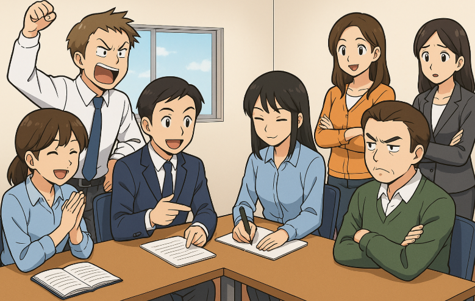

Existen **tres grupos de tipos de roles principales** que pueden aparecer entre los participantes, tanto en **formación presencial** como en **teleformación**, y que influyen directamente en el logro de los objetivos del grupo.

🧭 **Roles referidos a las tareas**  
Centrados en la **coordinación de actividades** y la **resolución de dificultades** que surgen durante el trabajo.  

- 💡 **Ideólogo:** aporta ideas para resolver actividades o problemas.  
- 🔍 **Buscador de información:** pide aclaraciones o datos para aplicar al problema.  
- 🗣️ **Buscador de opiniones:** promueve la participación y las aportaciones del grupo.  
- 🧩 **Coordinador:** ordena y organiza las ideas del grupo.  
- 🧠 **Evaluador:** analiza la información y la contribución de cada participante.  
- 🚀 **Impulsor:** motiva al grupo en momentos de desánimo.  
- 📝 **Registrador:** anota las sugerencias y la información relevante para el equipo.

🤝 **Roles relacionados con la construcción del grupo**  
Orientados a mantener la **cohesión, el respeto y la convivencia positiva**.  

- 🌟 **Reforzador:** valora las aportaciones de los demás y fomenta un clima acogedor.  
- ⚖️ **Armonizador:** actúa como mediador en los conflictos.  
- 👁️ **Observador:** analiza la evolución del grupo y aporta reflexiones para mejorar la convivencia.  
- 🤗 **Seguidor:** apoya las ideas de los compañeros y participa en la toma de decisiones.

⚠️ **Roles individuales**  
Tienen una influencia más **negativa**, ya que suelen generar **conflictos o inestabilidad** en el grupo.  
- 💢 **Agresor:** provoca conflictos por su actitud crítica o prepotente.  
- 😔 **Chivo expiatorio:** se culpa de todo lo negativo que ocurre en el grupo.  
- 🧱 **Defensivo:** busca tener siempre la razón y no reconoce sus errores.  
- 🚫 **Bloqueador:** adopta una actitud pesimista o se opone constantemente a las ideas planteadas.  
- 🤐 **Callado:** mantiene una postura pasiva y no participa ni aporta ideas.  

> [!tip]
> 📚 Meredith Belbin estudió los distintos **roles dentro de los equipos de trabajo**, y su modelo se ha convertido en una referencia en el ámbito de la formación y la gestión de grupos.  
> Para ampliar información puedes consultar: https://www.belbin.es/acerca-de-belbin/roles-de-equipo-belbin

---

## 8. Resolución de conflictos

### 8.1 Conceptos generales y pasos a seguir

- ⚔️ **Qué es un conflicto:** situación en la que dos o más personas entran en **oposición o desacuerdo** por incompatibilidad de intereses, necesidades, deseos o valores.  
- 🔄 **El conflicto es un proceso:** tiene **inicio, desarrollo y desenlace**. Es clave mantener la **calma**, analizar con **objetividad** y buscar **soluciones** viables.  
- 🌐 **Dónde se dan:** pueden aparecer **tanto en presencial como en online**.

En la resolución de conflictos, las partes **acuerdan identificar y definir el problema**, dividirlo en situaciones **concretas y presentes**, y establecer un **plan de intervención** que después será **evaluado**.

**Pasos a seguir:**

- 🧭 **Identificar y definir el problema**
  - 👥 Identificar **las partes** en conflicto.  
  - 🧩 Aclarar **causas, posiciones e intereses**.

- ✂️ **Descomponer el problema**
  - 👂 **Escuchar** y **respetar**.  
  - 🗒️ Describir los hechos, centrarse en el **presente** y en lo **relevante**.  
  - 💬 Favorecer la **comunicación de todos**.

- 🛠️ **Plan de actuación y ejecución**
  - 🎯 Atender las **necesidades** de cada parte y las **compartidas**.  
  - 🧠 Generar **opciones de resolución**.  
  - 🤝 **Acordar** y aplicar el **plan** consensuado.

- ✅ **Evaluar los logros**
  - 📊 Verificar **satisfacción** y **cumplimiento** del acuerdo.  
  - 🕊️ Promover una **comunicación** no centrada en el conflicto.

---

### 8.2 Estructura y dinámica del conflicto

> [!important]
> La **estructura y dinámica del conflicto** depende de la interacción entre varios factores:  
> - 👥 **Las personas:** las partes implicadas en el conflicto.  
> - 🔄 **El proceso:** comportamientos, hechos, acciones e historia del conflicto.  
> - 🎯 **El tema o problema:** causas, intereses, necesidades y valores en juego.  
>
> Es fundamental **distinguir entre posiciones e intereses**:  
> - Las **posiciones** son lo que cada parte pretende alcanzar (las metas visibles).  
> - Los **intereses** son los beneficios reales o necesidades que se buscan satisfacer a través del conflicto.

Algunas **situaciones conflictivas en el aula** pueden ser:

1. 📚 Un grupo conflictivo en general: disperso, con ruido constante y poca atención.  
2. ⚖️ Presencia de **subgrupos antagónicos** que dividen la clase.  
3. ⚔️ **Enfrentamientos individuales** entre alumnos.  
4. 🎧 Estudiantes que se **aislan del grupo**, por ejemplo, usando cascos o evitando participar.  
5. 🚫 **Actitud de rebeldía o desafío** hacia el docente o la institución.  
6. 😴 **Apatía o desinterés generalizado** por la materia o las actividades.  
7. 💥 **Actos de violencia delictiva:** agresiones, hurtos u otras conductas graves.  
8. 😡 **Alumnos violentos** o con comportamiento intimidatorio.  
9. 😔 **“Chivos expiatorios”:** alumnos culpados injustamente por los errores del grupo.  
10. 🚷 **Conductas de discriminación o rechazo** por motivos físicos, sociales o de discapacidad.

---

### 8.3 Respuesta ante el conflicto e importancia de la comunicación

Existen diferentes **formas de responder ante un conflicto**, según la actitud y la disposición de las partes implicadas:

|      | Actitud         | Enfoque                 | Descripción                                                  |
| :--: | :-------------- | :---------------------- | :----------------------------------------------------------- |
|  ⚔️   | **Competir**    | *Yo gano, tú pierdes*   | La persona busca alcanzar sus propios objetivos sin tener en cuenta las necesidades o la relación con los demás. |
|  🤝   | **Acomodación** | *Ceder*                 | La persona renuncia a sus intereses para evitar el enfrentamiento o mantener la armonía con el grupo. |
|  ⏳   | **Evitación**   | *Dejar pasar el tiempo* | El conflicto está presente, pero ninguna de las partes actúa. Se prioriza la tranquilidad aunque el problema siga sin resolverse. |
|  💬   | **Negociación** | *Ceder para ganar algo* | Cada parte cede parcialmente para alcanzar un acuerdo equilibrado que satisfaga a ambas. |
|  🌈   | **Cooperación** | *Ganar–ganar*           | Ambas partes buscan puntos de encuentro y colaboran para conseguir beneficios comunes. |

> [!important]
> En la base de casi todo conflicto existe un **problema de comunicación**:  
> las partes **no se escuchan, no se comprenden o interpretan mal los mensajes**.  
>
> Para resolverlos, es fundamental aplicar:
> - 👂 **Escucha activa**  
> - 💞 **Empatía**  
> - 🗣️ **Comunicación asertiva**  
> - 🔁 **Realimentación positiva**

Factores que influyen en la resolución del conflicto:

- 🤝 Cuando hay **confianza, respeto y entendimiento**, los conflictos se abordan de forma más fluida y eficiente.  
- 🚫 Si la relación está deteriorada o basada en la **desconfianza o el desprecio**, será difícil resolver el conflicto con éxito.  
- ⚖️ Si el conflicto **no es entre iguales**, pueden surgir **diferencias de lenguaje o códigos** que dificulten la comunicación (por ejemplo, expresiones que el docente percibe como falta de respeto).  
- 😶 En ocasiones, por **timidez o diferencia de poder**, la comunicación se vuelve casi **unidireccional**.  
- 💬 Los **rumores, estereotipos y prejuicios** generan **distorsiones** en la percepción y aumentan la tensión del conflicto.

---

## Resumen

En esta unidad hemos repasado la **dinamización y motivación del aprendizaje** según la modalidad de formación —presencial o e-learning—.  
Hemos comprobado que el buen funcionamiento de un grupo depende de factores como el **afecto y la estima**, las **metas compartidas**, la **asunción de roles**, la **cohesión**, la **comunicación eficaz** y el **sentimiento de pertenencia**.

Durante el desarrollo del grupo se distinguen cuatro fases:
- 🧭 **De orientación**  
- ⚙️ **De asentamiento y clarificación**  
- 🚀 **De productividad**  
- 🏁 **De clausura**

**Técnicas de dinamización grupal:**  
Existen numerosas técnicas de dinamización como la **tormenta de ideas**, el **estudio de casos** o los **debates**.  
La principal diferencia entre la enseñanza **presencial** y la **online** radica en el **entorno** donde se aplican:  
en la enseñanza presencial las dinámicas se realizan directamente en el aula, mientras que en e-learning se desarrollan en entornos virtuales, adaptando las acciones a cada modalidad.

**Comunicación no verbal y dinamización de foros:**  
La **comunicación no verbal** y el **control de la situación** son esenciales para gestionar el aula de forma adecuada.  
En formación online, la interacción se realiza principalmente en el **foro**, donde la comunicación es **asíncrona**.  
Por ello, es fundamental la labor del **tutor/a online** para **dinamizar, reconducir y mantener la participación** a lo largo del tiempo.

**Resolución de conflictos:**  
La **resolución de conflictos** requiere tanto en modalidad presencial como en teleformación de **empatía**, **habilidades comunicativas** y **conocimientos de mediación**.  
Estos elementos permiten al docente o tutor/a **mantener un clima de aprendizaje positivo** y orientar al grupo hacia la colaboración.

---

# Ejercicios

## Ejercicio 21: Selecciona los enunciados correctos sobre los grupos

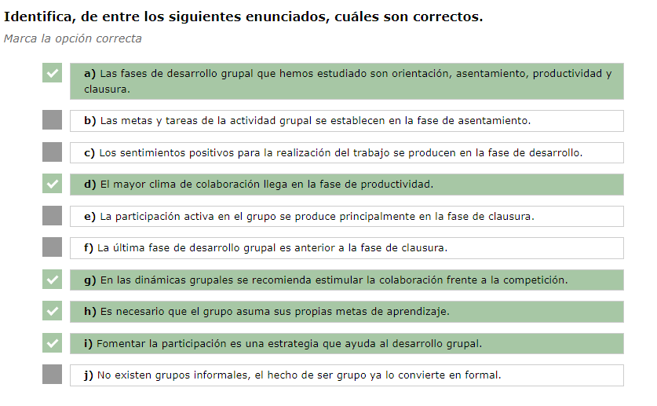

---

## Ejercicio 22: Pinta y colorea la frase sobre los grupos.

Un grupo es un conjunto de personas que tienen un `fin` u objetivo común, donde se producen `interacciones` y adquiere una `identidad` que proviene de una serie de valores, `ideas` y normas, por las que cada miembro se siente perteneciente al `grupo`.

Existe un grupo cuando dos o más personas que establecen relaciones entre sí, poseen cierta `independencia` y unidad reconocible.

---

## Ejercicio 23: Selecciona enunciados correctos. Técnicas de grupo

**a)** ❌ El *role playing* busca precisamente la participación espontánea y empática del grupo, no evitarla.

**b)** ❌ El *brainstorming* se emplea para problemas abiertos con múltiples soluciones posibles, no para una única respuesta correcta.

**c)** ✅ La técnica de la *simulación* tiene objetivos similares al *role playing*, pero sin dramatización, ya que se centra en reproducir situaciones o procesos.

**d)** ❌ Esa descripción corresponde al *grupo nominal*, no al *estudio de casos*.

**e)** ✅ En la técnica del *brainstorming* está prohibida la crítica y la autocrítica durante la producción de ideas, para fomentar la creatividad.

**f)** ✅ El principal beneficio del *estudio de casos* es aprender a razonar un problema, analizando distintas soluciones posibles.

**g)** ❌ El *Phillips 6/6* no busca liberar inhibiciones, sino sintetizar las ideas de varios subgrupos.

**h)** ✅ En el *Phillips 6/6* se extrae una conclusión general a partir del informe de los subgrupos presentados por sus portavoces.

**i)** ❌ La *mesa redonda* se caracteriza por reunir especialistas con opiniones diversas, por lo tanto, el enunciado es incorrecto.

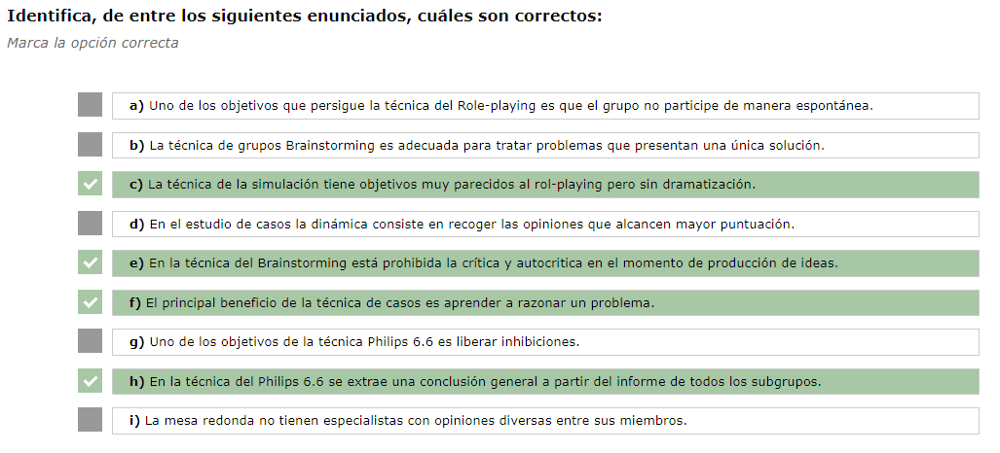

---

## Ejercicio 24. Une con flechas. Técnicas de grupo

| **Técnica**            | **Objetivo principal**                                       |
| ---------------------- | ------------------------------------------------------------ |
| 🧩 **Estudio de casos** | Fomentar la objetividad en el análisis de hechos.            |
| 💡 **Brainstorming**    | Producir todas las alternativas posibles a un problema.      |
| 🔁 **Phillips 6/6**     | Desarrollar la capacidad de síntesis y de exponer ideas concretas. |
| 🎭 **Role Playing**     | Buscar soluciones a problemas a través de la dramatización.  |

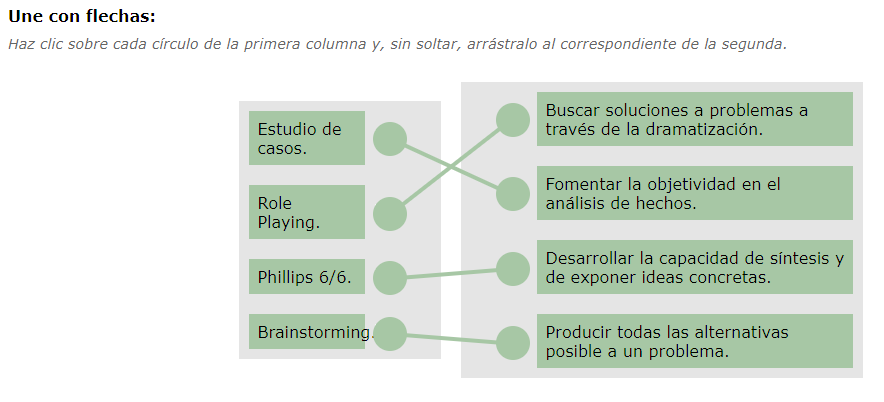

---

## Ejercicio E10. Actividad Individual Supervisada por el Tutor asociada al CE2.4 (Unidad de aprendizaje 2, Epígrafe 5.3) Actividad evaluable

PDF Aparte.

---

## Ejercicio 25. Elegir la técnica de dinamización adecuada

| Nº   | Enunciado                                                    | Respuesta                      | Justificación                                                |
| ---- | ------------------------------------------------------------ | ------------------------------ | ------------------------------------------------------------ |
| 1    | El curso de Recursos Humanos empieza hoy. El primer tema es la selección de personal. Quieres dar participación a los alumnos para que se vayan conociendo y rompiendo inhibiciones. | **Dinámica de presentación**   | Se utilizan al inicio para favorecer el conocimiento mutuo y romper la timidez o las barreras iniciales. |
| 2    | Hoy vas a dar clase en un grupo de 30 participantes ya acostumbrados a trabajar juntos. El tema es la comunicación y quieres contextualizar una situación. | **Simulación**                 | Permite reproducir una situación real o profesional para observar comportamientos comunicativos concretos. |
| 3    | Durante un método expositivo, quieres que los 15 alumnos lancen ideas mientras explicas. | **Brainstorming**              | Fomenta la participación y la creatividad al generar ideas sin críticas durante la exposición. |
| 4    | Algunos alumnos llegan tarde al curso y no entienden por qué molesta al grupo. Quieres que comprendan la realidad del otro. | **Role-playing**               | La dramatización permite ponerse en el lugar de otra persona y empatizar con diferentes puntos de vista. |
| 5    | 30 docentes revisan el proyecto educativo del centro para proponer mejoras. Quieres que trabajen en subgrupos y lleguen a conclusiones. | **Phillips 6/6**               | Facilita la participación de grupos grandes dividiéndolos en equipos pequeños que luego comparten conclusiones. |
| 6    | En el módulo de Técnicas de venta, los alumnos deben representar situaciones reales de atención al cliente. | **Role-playing**               | Se dramatizan casos reales para practicar la comunicación, la empatía y la resolución de situaciones comerciales. |
| 7    | El grupo busca ideas para mejorar el aparcamiento en Valencia. | **Brainstorming**              | Estimula la creatividad colectiva para generar múltiples propuestas sin limitar las ideas. |
| 8    | El grupo de Formación de formadores reproduce el contexto de un aula para practicar como docentes. | **Simulación**                 | Permite recrear un entorno profesional real para practicar habilidades de enseñanza y gestión del aula. |
| 9    | En una práctica sobre tipología discente, los alumnos trabajan las destrezas personales e interpersonales. | **Role-playing**               | Representar diferentes tipos de alumnos ayuda a experimentar cómo tratarlos y mejorar las habilidades sociales. |
| 10   | En clase, algunos alumnos llegan tarde y se propone que el grupo defina sus propias normas. | **Pequeño grupo de discusión** | Fomenta la reflexión y el consenso colectivo para resolver conflictos y establecer reglas comunes. |

---

## Ejercicio 26: Funciones del coordinador

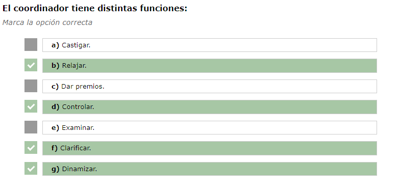

---

## Ejercicio 27: Solución de conflictos

A continuación se presentan diferentes situaciones.  
Indica si **favorecen** o **no favorecen** la solución de un conflicto.

|  Nº  | Situación                                                    | ¿Favorece la solución del conflicto? |
| :--: | :----------------------------------------------------------- | :----------------------------------: |
|  1   | Desconfiar en la capacidad del grupo para resolver el conflicto |            ❌ No favorece             |
|  2   | Mostrar claramente el disgusto al alumnado cuando la conducta es injusta |              ✅ Favorece              |
|  3   | Pedir una aclaración sobre las razones y causas del conflicto |              ✅ Favorece              |
|  4   | Emplear el humor en el tono adecuado                         |              ✅ Favorece              |
|  5   | No ceder ante los comentarios de unos y otros                |              ✅ Favorece              |
|  6   | Realizar acusaciones a los equipos en conflicto              |            ❌ No favorece             |
|  7   | Ignorar la conducta conflictiva                              |            ❌ No favorece             |
|  8   | Reaccionar de una forma inesperada para el alumnado cuando intentan provocarnos |              ✅ Favorece              |
|  9   | Centrarse en el problema y no en la persona                  |              ✅ Favorece              |
|  10  | Buscar con el grupo soluciones                               |              ✅ Favorece              |

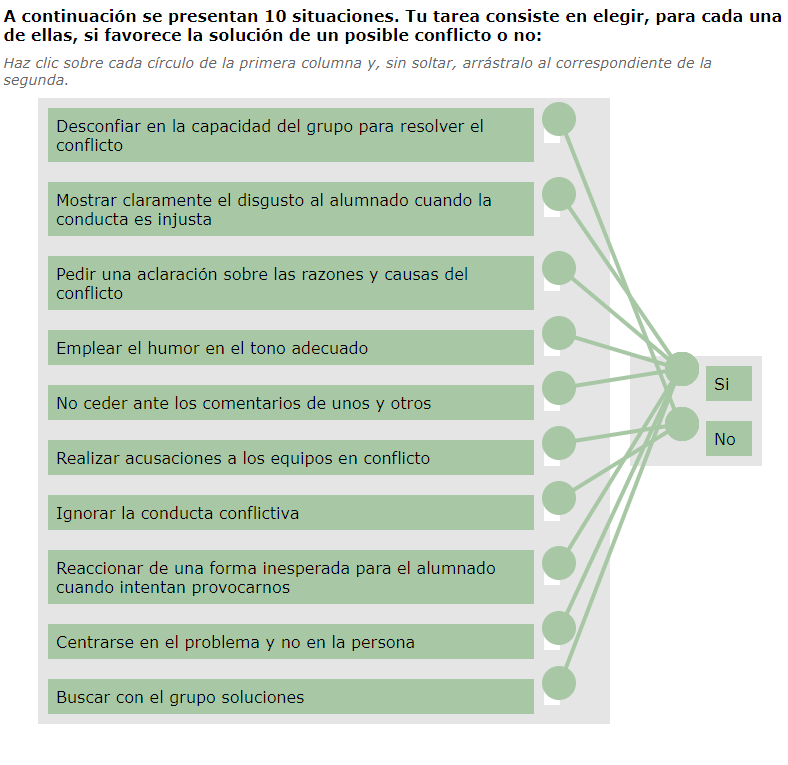

---

## Ejercicio 28: Pasos en la resolución de conflictos

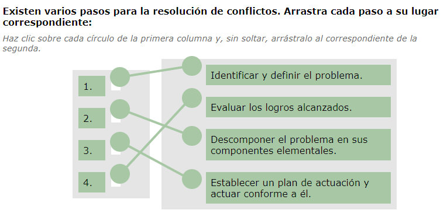

---

## Ejercicio Ponte a prueba. Técnicas de dinamización grupal

### Caso 1

Carlos lleva ya algunas sesiones impartidas del curso de **Docencia de la Formación para el Empleo**.  
Ya han trabajado, dentro del primer módulo formativo del curso *MF1442_3: Programación didáctica de acciones formativas para el empleo*, los dos primeros bloques de contenido y se encuentra en disposición de iniciar con el tercer bloque *“Elaboración de la programación didáctica de una acción formativa en formación para el empleo”*.  

Así que decide utilizar en la sesión de hoy alguna **técnica de grupo**.  
Al fin y al cabo, el curso hace poco que empezó y sus miembros están empezando a conocerse entre sí y a conocerlo también a él.  

**¿Qué técnica de grupo sería adecuada para esta fase del desarrollo grupal?**

**Opción 1**  
Carlos utiliza una técnica de conocimiento denominada “La Tarjeta de visita”.  
Cada persona tiene que mostrar su tarjeta de visita indicando: cómo quieren que lo llamen, dos aficiones, dos cualidades, qué haría con 30 euros y qué lugar le gustaría visitar.  
Realizada la técnica de conocimiento, Carlos comienza a explicar el tema de hoy utilizando una presentación multimedia y la lección magistral.

**Opción 2 ✅ (Correcta)**  
Carlos reparte un folio a todos los miembros del grupo y les dice que ellos estaban haciendo un crucero por el sur del Océano Pacífico.  
A consecuencia de una tempestad, el barco naufragó y son los únicos supervivientes, náufragos en una isla, lejos de toda línea de navegación.  
En el folio que ha repartido aparece el plano de la isla, unas instrucciones y el listado de objetos que se han salvado del naufragio.  
Carlos forma 3 grupos de trabajo y les pide que organicen, en grupo, su estancia en la isla.

**Opción 3**  
Carlos utiliza una técnica muy divertida llamada “Nombre-Animal”.  
En la primera ronda, cada miembro del grupo dice su nombre y a continuación dice el nombre de un animal que empieza por la misma letra.  
Por ejemplo: él podría ser Carlos-Caballo.  
La sorpresa viene en la segunda ronda, donde le pide al alumnado que represente el animal que ha elegido.  
Será muy divertido ver a todo el alumnado escenificando a un animal y además, así se aprenderán los nombres.

---

**Justificación:**  
Me imagino que sentirás el mismo desconcierto que el alumnado de Carlos ante este naufragio.  
Carlos ha captado el interés del grupo y lo ha motivado hacia el aprendizaje.  
Los tres grupos de trabajo pasarán un rato ameno, a la vez que se van relacionando entre ellos y organizando su estancia en la isla.  
Lo que ningún grupo se puede imaginar es que lo que Carlos les ha pedido, en realidad, es que **realicen una planificación**.

---

### Caso 2

Superada la **fase de orientación**, el grupo se va estableciendo como tal y empiezan a aparecer las primeras dificultades y pequeños conflictos entre los participantes.  
Carlos tiene que desarrollar las capacidades relacionadas con la **diferenciación entre métodos formativos** (expositivo, interrogativo, demostrativo y por descubrimiento), y para ello decidirá emplear una técnica de grupo.

**¿Qué técnica de grupo sería la más adecuada en este momento?**

**Opción 1 ✅ (Correcta)**  
Realizará una mesa redonda. Dividirá a los participantes en cuatro grupos, cada uno investigará uno de los métodos y nombrará un portavoz.  
Al final, los portavoces de cada equipo se sentarán en una mesa presidencial y harán una exposición de cada método.  
Carlos abrirá en ese momento un **turno para comentar cómo han trabajado en equipo**.

**Opción 2**  
Realizará una mesa redonda. Dividirá a los participantes en cuatro grupos, cada uno investigará uno de los métodos y nombrará un portavoz.  
Al final, los portavoces de cada equipo se sentarán en una mesa presidencial y harán una exposición de cada método.  
Carlos abrirá en ese momento un **turno de preguntas**.

**Opción 3**  
Realizará una mesa redonda. Dividirá a los participantes en cuatro grupos, cada uno investigará uno de los métodos y nombrará un portavoz.  
Al final, los portavoces de cada equipo se sentarán en una mesa presidencial y harán una exposición de cada método.  
Carlos abrirá en ese momento un **turno de críticas** sobre cada método.

---

**Justificación:**  
La **opción 1** es la más adecuada porque el grupo se encuentra en la **fase de asentamiento**, donde pueden surgir tensiones y pequeñas resistencias.  
Permitir que los participantes **reflexionen sobre su propio trabajo en equipo** favorece la **cohesión, la empatía y la comunicación**, ayudando a estabilizar la dinámica grupal.  
En cambio, abrir un turno de preguntas o críticas podría intensificar los conflictos en lugar de resolverlos.

---

### Caso 3

El grupo, además de ir desarrollando las capacidades profesionales requeridas en el módulo de **Programación de acciones formativas para el empleo**, ha ido evolucionando y superando determinados conflictos que han ido apareciendo con el tiempo.  
Está ya en una **fase de rendimiento o productividad**, con metas compartidas.  

Carlos está trabajando sobre los contenidos de *“Tipos y momentos para la evaluación”* y ha decidido realizar un **brainstorming** con los participantes con el fin de evaluar si los participantes han entendido bien los conceptos de métodos y criterios de evaluación.  

**De acuerdo a la fase del grupo, ¿cuál sería la mejor opción?**

**Opción 1**  
Carlos presenta al grupo la técnica del brainstorming para entre todos, generar evaluaciones lo más creativas posibles.  
Carlos nombra a alguien del grupo para que coordine la técnica del brainstorming en la que cada participante expresa libremente sus ideas y ocurrencias y se van recogiendo en la pizarra.  
Posteriormente, Carlos facilita que se asocien diferentes ideas y se escoja un criterio para decidir la mejor opción.

**Opción 2**  
Carlos presenta al grupo la técnica del brainstorming para entre todos, generar evaluaciones lo más creativas posibles.  
Decide dirigir él la técnica del brainstorming, ya que es el docente y su responsabilidad.  
Los participantes expresan libremente sus ideas y él las va recogiendo en la pizarra.  
Posteriormente, se asocian diferentes ideas y se escoge un criterio para decidir la mejor opción.

**Opción 3 ✅ (Correcta)**  
Carlos presenta al grupo la técnica del brainstorming para entre todos, generar evaluaciones lo más creativas posibles.  
Permite que el grupo se autoorganice escogiendo un coordinador para la actividad y una persona que vaya recogiendo en la pizarra las ideas y ocurrencias de los participantes.  
Posteriormente, se asocian diferentes ideas y se escoge un criterio para decidir la mejor opción.

---

**Justificación:**  
La mejor opción en una **fase de productividad** es dejar que sea el propio grupo el que se **autoorganice**.  
En este punto, los participantes ya tienen la madurez y cohesión necesarias para asumir responsabilidades y trabajar de manera autónoma.  
La labor del docente debe centrarse en la **supervisión de la técnica** y, especialmente, en la **evaluación de los comentarios y aportaciones** de los participantes para comprobar si han comprendido los **conceptos de metodología y criterios de evaluación**, que son el objetivo principal de la actividad.

---

Captura en la plataforma

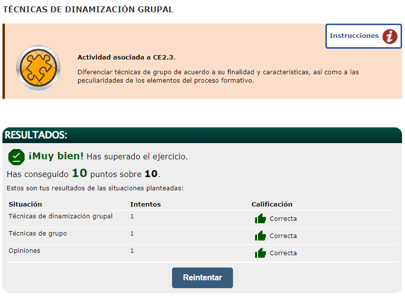

---

## 🧪 Test final - MF1444 - UF1645 - 02

**1)** La mayor parte de los grupos de trabajo:  
a) Se estructuran formalmente.  
b) Se orientan a las tareas.  
c) Son primarios y formales.  
d) Son correctas a) y b).

**2)** En un curso de dirección y gestión de recursos humanos, has decidido utilizar la técnica "Estudio de casos". Justificas la elección de la misma ante tu coordinador/a argumentando que la técnica nos permite:  
a) Liberar inhibiciones.  
b) Promover la toma de decisiones.  
c) Clarificar y modificar actitudes.  
d) Promover la participación activa del alumnado.

**3)** ¿En qué fase del desarrollo del grupo predomina la insatisfacción originada por la comparación entre las expectativas ideales depositadas en el grupo y las que realmente se pueden cumplir?:  
a) Orientación.  
b) Asentamiento y clarificación.  
c) Productividad.  
d) Clausura.

**4)** Las pautas de actuación que podemos utilizar con un alumno "discutidor" (que inicia discusiones, a veces interrumpe el ritmo de la clase, pone en tela de juicio cuanto se dice, atrae la atención del grupo, etc.) son: *Elige la incorrecta:*  
a) Pedir respeto al turno de palabra.  
b) Darle un papel activo en el aula (moderador, secretario, etc.).  
c) Reforzarle.  
d) Que diga primero su opinión.

**5)** ¿En qué fase el grupo toma conciencia de su actuación?:  
a) En la fase de orientación.  
b) En la fase de asentamiento.  
c) En la fase de productividad.  
d) En la fase de clausura.

**6)** ¿Qué técnica de grupo tiene como objetivo obtener información, puntos de vista o ideas de varias personas sobre un tema o problema para explorarlo en muy poco tiempo?:  
a) Seminario.  
b) Phillips 6/6.  
c) Técnica de grupo nominal.  
d) Simulación.

**7)** ¿Cuál de las siguientes posibles respuestas docentes no es correcta?:  
a) Una demanda de precisión cuando la actuación de la persona es en algún punto confusa.  
b) Una apreciación general y corta para las personas que necesitan ayuda.  
c) Una reformulación de lo expuesto para reforzar la aportación y mostrar interés.  
d) Una orientación concreta para que la persona pueda corregir por ella misma.

**8)** ¿Cuál de los siguientes enunciados relacionados con el conflicto no es correcto?:  
a) El conflicto es siempre negativo.  
b) En cualquier grupo es inevitable la aparición de conflictos.  
c) A veces sirve para eliminar tensiones que separaban.  
d) En ocasiones restablece la unidad.

**9)** ¿Qué estrategia podemos aplicar como docentes si nuestro grupo de alumnos está bloqueado, no progresa, se muestra desintegrado y desinteresado?:  
a) Será necesario detener la sesión formativa para pedir explicaciones.  
b) Habrá que mantener una conversación con cada alumno hasta localizar el problema.  
c) Habrá que analizar la situación y planificar otro tipo de metodología donde primen por ejemplo las preguntas directas sobre algunas personas.

**10)** Para realizar una aplicación efectiva de las técnicas de dinámica de grupos hay que:  
a) Conocer sus fundamentos teóricos.  
b) Dominar su aplicación práctica.  
c) Utilizarlas conforme al procedimiento establecido.  
d) Todas son correctas.

---

Soluciones

1. **d)** Son correctas a) y b).  
Los grupos de trabajo suelen estructurarse formalmente y orientarse a las tareas para alcanzar sus objetivos.

2. **b)** Promover la toma de decisiones.  
El estudio de casos fomenta el razonamiento, el análisis y la toma de decisiones ante situaciones reales o simuladas.

3. **b)** Asentamiento y clarificación.  
En esta fase surgen las primeras tensiones por el contraste entre las expectativas iniciales y la realidad del grupo.

4. **c)** Reforzarle.  
Reforzar a un alumno discutidor aumenta su protagonismo y refuerza su conducta disruptiva.

5. **d)** En la fase de clausura.  
Es el momento en que el grupo reflexiona sobre su trabajo, valora resultados y toma conciencia de su actuación.

6. **c)** Técnica de grupo nominal.  
Se basa en que cada participante anote ideas de forma individual, se valoren y seleccionen las más relevantes para debatirlas. Busca obtener información y puntos de vista en poco tiempo.

7. **b)** Una apreciación general y corta para las personas que necesitan ayuda.  
No aporta orientación ni guía concreta, por lo que no es una respuesta docente efectiva.

8. **a)** El conflicto es siempre negativo.  
El conflicto puede tener efectos positivos si se gestiona adecuadamente, ayudando a mejorar la comunicación y la cohesión.

9. **c)** Habrá que analizar la situación y planificar otro tipo de metodología con preguntas directas.  
Cambiar el enfoque e introducir nuevas estrategias favorece la motivación y el progreso del grupo bloqueado.

10. **d)** Todas son correctas.  
Aplicar una técnica de grupo requiere conocer su base teórica, dominar su práctica y seguir el procedimiento adecuado.

