[TOC]

---

# MF1444 - Impartición y tutorización de acciones formativas para el empleo

# UF1645 - Impartición de acciones formativas para el empleo

# Unidad 03 - Estrategias metodológicas en la FPE según modalidad formativa

---

## Introducción y objetivos

En esta tercera unidad estudiaremos las **estrategias metodológicas** que se pueden utilizar en función de la **modalidad formativa**.

**Contenidos principales:**

👉 1. Introducción  
📘 2. Métodos de enseñanza  
🧭 3. Principios metodológicos  
♟️ 4. Estrategias metodológicas  
🎯 5. Elección de la estrategia metodológica  
🗣️ 6. Habilidades docentes  
👩‍🏫 7. Estilos didácticos  
🧩 8. La sesión formativa  
🎭 9. La simulación docente  
💻 10. Utilización del aula virtual  

**Objetivo de la unidad:**  
Usar técnicas de comunicación aplicables y adaptadas a la acción formativa.

---

## 1. Aproximación al tema

> [!important]
> Las estrategias metodológicas son las distintas tácticas de las que dispone el docente para presentar al grupo de participantes los conocimientos.  
> Dentro de las estrategias metodológicas distinguimos: **los métodos didácticos** y **las técnicas didácticas**.

En función de las características del propio formador o formadora, de los participantes, así como de los **objetivos de aprendizaje**, de los **contenidos planteados** y de los **recursos disponibles**, se seleccionarán unas u otras estrategias.

📌**Aspectos clave:**

- Dar prioridad a la **práctica**, basada en hechos y acciones, no solo en ideas.  
- Conectar los contenidos con **situaciones concretas del puesto de trabajo**.  
- Favorecer el uso de **métodos activos**, que promuevan la participación del alumnado.

---

## 2. Métodos de enseñanza

### 2.1 Aspectos generales

Los **métodos de enseñanza** son las vías por las que los participantes alcanzan el **conocimiento y dominio de los contenidos de aprendizaje**.  
Los diferentes métodos se utilizan de forma **complementaria**, y el docente debe construir su propio método combinando el **carácter sistemático y progresivo** con el **carácter sorpresivo y novedoso**.

📘 **Etimología y significado de *metodología*:**
- Proviene del griego y significa *“camino hacia una meta”*.  
- Se define como cualquier actividad que requiera seguir un **procedimiento razonado y sistemático** para alcanzar determinados resultados.  
- En la **Formación Profesional para el Empleo (FPE)**, la metodología se refiere a los **modos, caminos y reglas** que utilizamos para lograr un **cambio en el comportamiento del participante** que mejore su nivel de cualificación y su capacidad para desempeñar una actividad productiva.

> [!note]
> La metodología en la FPE busca siempre conectar el aprendizaje con la práctica profesional y con la mejora de la empleabilidad.

📎 **Para aplicar un método utilizamos:**

- **Las técnicas:** prácticas, estrategias o pasos que damos para recorrer el camino.  
- **Los medios:** recursos que nos sirven para aplicar una técnica concreta dentro de un método de aprendizaje determinado.

---

### 2.2 Clasificación

Existen múltiples formas de clasificar los **métodos de formación**, según el tipo de razonamiento, el grado de participación o la organización del aprendizaje.  
A continuación, se presentan los principales:

1. 📘 **Método deductivo:**  
   El conocimiento va de **lo general a lo particular**.

2. 📗 **Método inductivo:**  
   El razonamiento va de **lo particular a lo general**.

3. 📙 **Método comparativo:**  
   Permite **conocer a través de la comparación** de dos o más aspectos particulares.

4. 📕 **Método pasivo:**  
   La mayor parte del tiempo la ocupa la **actividad del formador**.

5. 📘 **Método activo:**  
   En el aula prevalece la **actividad del alumnado**.

6. 📗 **Método individual:**  
   El proceso de enseñanza-aprendizaje se realiza de manera **personal** entre formador y alumno.

7. 📙 **Método recíproco:**  
   El formador **delegará la enseñanza** en uno o varios alumnos para que instruyan a sus compañeros.

8. 📕 **Método de trabajo individual:**  
   La formación establece **tareas diferentes para cada alumno**.

9. 📘 **Método de trabajo grupal:**  
   El aprendizaje se realiza **en grupo y de forma cooperativa**.

> [!important]
> La metodología más adecuada en la **Formación Profesional para el Empleo (FPE)** es aquella que **prioriza la actividad y participación**, aprovecha los **conocimientos y experiencias previas** del alumnado y sitúa al **docente como guía** en la adquisición de nuevos conocimientos, habilidades y actitudes.

📌**Aspectos clave para el formador:**

- En función de las características del grupo, del perfil del alumnado y de los objetivos del programa, debemos **seleccionar la combinación de métodos** que más favorezca el logro de los resultados.
- Ningún método es “químicamente puro”: en la práctica se **combinan diferentes enfoques** dentro de una misma sesión.
- La **metodología activa y participativa** es la más recomendable, ya que pone el foco en el alumno como protagonista del aprendizaje.
- Las estrategias participativas implican al grupo y fomentan su **implicación directa en el proceso de enseñanza-aprendizaje**.

---

### 2.3 Categorías metodológicas

En la **Formación Profesional para el Empleo (FPE)** es frecuente distinguir **dos grandes categorías metodológicas**, cada una con sus propios métodos:

1. 📘 **Método afirmativo**  
   Está dirigido a la **transmisión de conocimientos o verdades ya conocidas** por el docente.
   

   Dentro de este método se distinguen dos enfoques principales:
   
   🔵 **Método expositivo**  
   Se caracteriza por la **comunicación directa de los contenidos** por parte del docente, sin esperar una respuesta inmediata del alumnado.  
   Ejemplos típicos son la *lección magistral* o la *conferencia*.
   
   Para garantizar un aprendizaje eficaz con este método, es fundamental cuidar la **motivación**, la **presentación inicial de la información** y fomentar la **reflexión y el razonamiento** a lo largo de la exposición.
   
   > [!tip]
   >
   > - Usar una comunicación **clara y concreta**.  
   > - **Secuenciar los contenidos** de forma lógica y didáctica.  
   > - Emplear **ejemplos, comparaciones o analogías** que faciliten la comprensión.
   
    

   🔵 **Método demostrativo**  
   En este método la enseñanza se realiza **a través de la práctica**, mostrando cómo se hace algo.  
   Se pretende que el alumnado aprenda **mediante la demostración coordinada de la tarea**.
   
   > [!important] 🧭Fases para aplicar el método demostrativo
   >
   > 1. **Preparación del alumnado:** explicar los objetivos y despertar interés.
   > 2. **Explicación de la tarea:** ordenar los contenidos y aclarar el procedimiento.
   > 3. **Demostración práctica:** el docente realiza primero el trabajo, guiando la atención del grupo.
   > 4. **Ejecución del alumnado:** los participantes repiten la tarea, con supervisión inicial hasta lograr **autonomía progresiva**.

 

2. 📗 **Método por elaboración**  
   En este enfoque, tanto el **docente como los participantes** intervienen activamente en el proceso de enseñanza-aprendizaje.  
   Se aprovechan las **experiencias y conocimientos previos** del alumnado para **estimular la participación** y la construcción conjunta del aprendizaje.

   🟢 **Método interrogativo**  
   Consiste en formular **preguntas al alumnado**, ya sean preparadas previamente o surgidas de la interacción en clase.  
   A través de la reflexión y el diálogo, los participantes **descubren y elaboran los contenidos** de formación.

   🟢 **Método de descubrimiento**  
   El alumnado se convierte en **protagonista de su propio aprendizaje**, investigando, experimentando y observando la realidad de forma directa.  
   Es un método especialmente útil para fomentar la **autonomía**, la **creatividad** y la **iniciativa personal**.

   > [!caution]
   > Este método **no es recomendable** para el aprendizaje de **habilidades que requieran maquinaria o productos peligrosos o de alto coste**, donde el error podría tener consecuencias graves.

---

## 3. Principios metodológicos

Durante el siglo XX han surgido numerosos **movimientos educativos** que han intentado desvincularse de la enseñanza tradicional, buscando **nuevos modelos de enseñanza-aprendizaje**.  
Entre ellos destacan **la Escuela Nueva**, los métodos de **Montessori**, **Waldorf**, **Pestalozzi** o **Summerhill**, que plantearon una alternativa a la escuela entendida como simple transmisora de conocimientos.

> [!important]
> Estas corrientes pedagógicas, nacidas en el ámbito de la educación reglada, han servido de **referente para la formación no reglada e informal**.  
> Con la llegada de las **nuevas tecnologías** y el **e-learning**, la formación en todas sus modalidades ha evolucionado de un **modelo centrado en la enseñanza** hacia un **modelo centrado en el aprendizaje**.

📘 **Cambio de paradigma educativo**

| Modelo tradicional                                          | Modelo centrado en el aprendizaje                            |
| ----------------------------------------------------------- | ------------------------------------------------------------ |
| Centrado en el docente                                      | Centrado en el estudiante                                    |
| Centrado en la enseñanza                                    | Centrado en el aprendizaje                                   |
| Estudiantes receptores pasivos                              | Estudiantes protagonistas del aprendizaje                    |
| Aprendizaje individualizado                                 | Aprendizaje colaborativo                                     |
| Desarrollo de habilidades, actitudes y valores determinados | Desarrollo libre y crítico de habilidades, actitudes y valores |
| Exposición del docente como método didáctico principal      | Variedad de técnicas didácticas orientadas a la construcción del conocimiento |

📌 **Principios metodológicos de una enseñanza eficaz**

1. **Concreción:** el aprendizaje debe ir **de lo concreto a lo abstracto**, facilitando la comprensión de los conceptos.  
2. **Reconocimiento, refuerzo y motivación:** es necesario **reconocer los progresos** del alumnado y **reforzar su conducta positiva**, manteniendo la motivación incluso ante las dificultades.  
3. **Actividad:** la **participación activa** del alumnado es esencial para alcanzar los objetivos formativos.  
4. **Progresión:** el aprendizaje debe estar **planificado por etapas**, avanzando gradualmente en la dificultad de las tareas.  
5. **Repetición y diversidad:** repetir ayuda a consolidar, pero la **variedad de actividades** evita la fatiga y el aburrimiento.  
6. **Individualización y personalización:** cada participante debe ser atendido según sus **características y necesidades específicas**.  
7. **Estimulación:** las actividades deben **favorecer el éxito y el interés** del alumnado.  
8. **Trabajo grupal:** el **grupo enriquece el aprendizaje**, aporta experiencias, puntos de vista y fomenta la cooperación.  
9. **Multiplicidad:** los **métodos didácticos son diversos**, y deben elegirse según los objetivos que se persigan.

> [!note] Más información:  
>
> 📺Para comprender la evolución de los métodos de aprendizaje y el cambio hacia una metodología centrada en el alumno, puedes ver este vídeo del programa *REDES*: [Ver en YouTube](https://www.youtube.com/embed/m1kgXqHXvdA).
>
> <iframe width="100%" height="310" src="https://www.youtube.com/embed/m1kgXqHXvdA" title="Cambio de paradigma educativo - Programa REDES" frameborder="0" allowfullscreen></iframe>

---

## 4. Estrategias metodológicas

### 4.1 Aspectos generales

El uso de **diversas técnicas en una misma sesión formativa** favorece la participación del alumnado y hace el aprendizaje más **ameno y estimulante**.

> [!note] Definición:
> 
> 📢Una **estrategia de enseñanza** equivale a la **actuación secuencial y consciente del profesional** de la educación, dentro del proceso de enseñanza, en su triple dimensión de **saber, saber hacer y ser**.  
> *(Rajadell, 1992)*

A continuación, se detallan las tres dimensiones que integran toda estrategia metodológica:

<!-- Bloques responsivos: se verán correctamente al exportar a HTML y PDF aunque typora no lo muestre bien en directo  -->

  

    
<strong class="card-title">🧠 Dimensión del saber</strong>

    
Se centra en la <strong>adquisición y dominio de conocimientos</strong>. Utiliza una metodología de carácter <strong>memorístico e informativo</strong>, basada en <strong>explicaciones, lecturas y charlas</strong>.

  

  

    
<strong class="card-title">🛠️ Dimensión del saber hacer</strong>

    
Busca el <strong>desarrollo de habilidades prácticas</strong> que permitan al alumnado <strong>realizar acciones y tareas concretas</strong>. Su finalidad es promover el uso de <strong>estrategias cognitivas superiores</strong>.

  

  

    
<strong class="card-title">💬 Dimensión del ser</strong>

    
Persigue la <strong>consolidación de intereses, actitudes y valores</strong>, fomentando la <strong>reflexión personal y ética</strong> en el proceso formativo.

  

---

### 4.2 Técnicas didácticas

> [!note] Definición:
>
> 📢Las **técnicas didácticas** son las acciones o actividades que el profesorado puede llevar a cabo para **facilitar el proceso de aprendizaje** del alumnado.  
> El uso de diversas técnicas en una misma sesión formativa favorece la **participación del grupo** y hace el aprendizaje más **ameno y estimulante**.

A continuación, se presentan algunas de las técnicas didácticas más utilizadas en la Formación Profesional para el Empleo (FPE).

---

#### 🧑‍🏫 Lección magistral

A través de la **explicación**, se pretende que el alumnado comprenda **métodos, procedimientos o conceptos**, relacionándolos con los ya adquiridos y estructurándolos de forma individual.

**Desarrollo:**  
Introducción → Exposición → Conclusiones.

**Objetivos:**  
- Ofrecer una **visión panorámica** de un tema.  
- Clarificar contenidos de **difícil asimilación**.  
- Presentar temas con bibliografía **insuficiente o dispersa**.

**Ventajas:**  
- Facilita la **transmisión directa de información** que después será memorizada.  
- Es una técnica **flexible** y compatible con otras.  
- No requiere medios complejos.

**Inconvenientes:**  
- Fomenta la **pasividad** del alumnado.  
- Es difícil mantener la **atención** durante toda la sesión.  
- Requiere introducir **elementos motivadores** o participativos.

---

#### ✏️ Ejercicios

Sirven como **complemento de la parte teórica**, ayudando a mejorar la comprensión y a consolidar los conocimientos expuestos en las sesiones previas.

**Desarrollo:**  
Se aplican tras la explicación teórica, como **actividades prácticas** que refuercen el aprendizaje.

**Objetivos:**  
- Favorecer la **comprensión de la teoría**.  
- Potenciar el **saber hacer**.  
- Facilitar la **evaluación continua** del aprendizaje.

Los ejercicios permiten al alumnado **poner en práctica** los conceptos y **evaluar su progreso** de manera constante.

---

#### 📚 Estudios de casos

Los estudiantes analizan una **situación real o hipotética**, identifican problemas y proponen soluciones.  
Se utiliza para **ejemplificar la teoría**, aplicar los conocimientos y **evaluar la toma de decisiones**.

**Desarrollo:**  
Presentación del caso → Elaboración de preguntas → Recogida de datos → Análisis e interpretación → Elaboración del informe.

**Objetivos:**  
- Fomentar la **capacidad de análisis y síntesis**.  
- Desarrollar la **toma de decisiones**.  
- Conectar la **teoría con la práctica**.  
- Mejorar la **comunicación y el trabajo en grupo**.

---

#### 🏢 Juegos de empresa

Estrategia con gran poder **motivador**, especialmente en ámbitos de **producción, recursos humanos o ventas**.  
El docente actúa como **facilitador**, guiando al grupo en un entorno simulado de toma de decisiones.

**Desarrollo:**  
- El alumnado se organiza en grupos que gestionan una empresa simulada.  
- Deben tomar decisiones para **maximizar beneficios, reducir costes o gestionar recursos**.  
- Tras analizar resultados, se repite el proceso con nuevas decisiones (2 o 3 ciclos).

**Objetivos:**  
- Integrar conocimientos de diferentes módulos.  
- Desarrollar **habilidades de trabajo en equipo, análisis y planificación**.  
- Fomentar la **reflexión sobre la toma de decisiones**.

---

#### 🧩 Proyectos

Basada en la **investigación y el aprendizaje significativo**, esta metodología permite al alumnado **demostrar su capacidad para planificar, organizar y resolver problemas** aplicando sus conocimientos.

**Desarrollo:**  
- Elaboración de un **informe o producto final** a partir de una secuencia de actividades planificadas.  
- Resolución de un **problema real**, aplicando acciones, interacciones y recursos.

**Objetivos:**  
- Desarrollar la **autonomía y cooperación**.  
- Aplicar conocimientos para **superar dificultades** y alcanzar nuevos aprendizajes.  
- Promover la **creatividad y la responsabilidad**.

---

#### 🔄 Otras estrategias

En la FPE es importante promover un **aprendizaje variado y activo**, utilizando diferentes **técnicas, recursos y actividades** que potencien la participación y el aprendizaje progresivo.

**Simulaciones:**  
Recrean **situaciones reales** que permiten practicar conocimientos y habilidades, proporcionando **retroalimentación inmediata** de los resultados.

**Técnicas de dinamización grupal:**  
Incluyen estrategias como el **seminario**, la **tormenta de ideas**, el **role playing** o la **mesa redonda**, que fomentan la **cooperación, la comunicación y el trabajo en grupo**.

---

## 5. Elección de estrategias metodológicas

### 5.1 Aspectos generales

A la hora de **seleccionar las estrategias metodológicas**, tanto los métodos como las técnicas didácticas para una acción formativa, conviene tener en cuenta los siguientes **criterios**:

- 📘 Las **características de la materia o tema** a impartir.  
- 🎯 Los **objetivos y metas** que se pretenden alcanzar.  
- 👥 El **número de alumnos o alumnas**.  
- 🏫 La **disposición y características del aula** (tamaño, mobiliario, distribución, etc.).  
- 🧩 Los **recursos disponibles** y la **adecuación de las ayudas visuales** al tema a impartir.  
- ⏱️ El **tiempo disponible** para la formación.  
- 📖 El **nivel de conocimiento previo** del alumnado sobre el tema.

> [!important]
> A lo largo de toda la acción formativa es fundamental **adaptar los aprendizajes** a las **características individuales del alumnado**, considerando sus **necesidades, intereses y ritmos de aprendizaje**.

Todo esto implica tener en cuenta los siguientes factores:

- 📋 **Partir de la situación real de aprendizaje del alumnado:**  
  Para conocerla es útil realizar una **evaluación inicial**, por ejemplo, mediante un **cuestionario diagnóstico** que detecte sus ideas previas sobre el tema o contenido.

- 🔍 **Evaluar la propia práctica docente:**  
  El profesorado debe analizar su propia intervención didáctica y **contrastar los resultados** con las necesidades formativas del grupo.

- 🧭 **Flexibilizar y reorganizar la programación didáctica:**  
  Conviene adaptar **objetivos, contenidos, metodología, recursos y organización del aula** a las características y necesidades del alumnado.

- 💬 **Crear un adecuado clima de diálogo:**  
  Fomentar la **comunicación y confianza mutua** entre docente y participantes, favoreciendo sesiones de **tutoría y orientación**.

> [!note]
>
> La elección de estrategias metodológicas debe hacerse en función de:  
>
> - Resultados de aprendizaje  
> - Grupo de aprendizaje  
> - Contenidos  
> - Recursos  
> - Organización

---

### 5.2 Resultados de aprendizaje

Existen numerosas definiciones de **resultados de aprendizaje**, entre las que destacan las siguientes:

- 📘📢 “Los resultados de aprendizaje son una **descripción explícita de lo que un aprendiente debe saber, comprender y ser capaz de hacer** como resultado del aprendizaje.” *(Bingham, 1999)*  
- 📗📢 “Un resultado de aprendizaje es un **enunciado escrito acerca de lo que se espera que el estudiante sea capaz de hacer** al finalizar una unidad, módulo o curso.” *(Adam, 2004)*  
- 📙📢 “Un resultado de aprendizaje es un **enunciado de lo que el aprendiente debe saber, comprender y/o ser capaz de hacer** al término de un período de aprendizaje.” *(Donnelly y Fitzmaurice, 2005)*

📌 **Podemos concluir que:**

- Los **resultados de aprendizaje** se centran más en **lo que el estudiante ha aprendido**, y no únicamente en los contenidos que se le han enseñado.  
- Se enfocan en **lo que el estudiante puede demostrar** al finalizar una actividad o proceso formativo.

La **elección de estrategias metodológicas** debe realizarse en función de los resultados de aprendizaje que se pretenden alcanzar:

- 📘 Cuando el objetivo del aprendizaje es **poner en práctica saberes determinados**, el docente o teletutor deberá aplicar una **metodología activa**, basada en **propuestas prácticas**, **resolución de casos reales**, **simulaciones** o **visionado de vídeos**, entre otros.  
  👉 Por ejemplo, en un curso en línea de *psicología clínica*.

- 🛠️ Si el objetivo de la formación es **desarrollar una destreza manual**, como en **electrónica, carpintería o fontanería**, la acción formativa debe incluir **actividades prácticas** en las que el alumnado pueda **ensayar, practicar y dominar** las herramientas principales de su cualificación.  
  👉 Por ejemplo, en un curso de **mantenimiento eléctrico**, el alumnado podría realizar **montajes de circuitos**, **comprobaciones con multímetro** o **reparaciones simuladas**, aplicando de forma práctica los conocimientos adquiridos.

---

### 5.3 Grupo de aprendizaje

> [!important]
> Las **características del grupo de estudiantes** que realice el curso determinarán las **estrategias metodológicas** más adecuadas.
>
> El docente debe adaptarse a las **condiciones reales del grupo**, considerando si es **homogéneo o heterogéneo** en cuanto a destrezas, conocimientos y actitudes.  
> También debe tener en cuenta el **colectivo al que va dirigido el curso** y las **motivaciones personales** que llevan a cada participante a realizarlo.
>
> En función de las características del grupo, se utilizarán **diferentes estrategias metodológicas y motivacionales** que favorezcan la participación y el aprendizaje.

Según **Johnson, Johnson y Holubec (1999)**, el docente debe adaptarse a las características del grupo y puede asumir distintos **roles** dentro del proceso de enseñanza-aprendizaje:

- 📘 **Compendiador:**  
  Se encarga de **resumir las principales conclusiones o respuestas** generadas por el grupo.

- 🔍 **Inspector:**  
  Se asegura de que **todos los miembros del grupo participen**, expresando cómo llegaron a una conclusión o respuesta.

- 🧭 **Entrenador:**  
  **Corrige los errores** en las explicaciones o resúmenes de los demás miembros, ayudando a mejorar su comprensión.

- 🧩 **Elaborador:**  
  Pide a los integrantes que **relacionen los nuevos conceptos o estrategias** con los conocimientos adquiridos previamente.

---

### 5.4 Contenidos: conceptos generales y criterios de selección

📌 **Conceptos generales:**

- Los **contenidos** que se vayan a impartir condicionarán en gran medida el **método de enseñanza** a utilizar.  
  
  > [!tip] Ejemplo
  >
  > Es muy diferente impartir un curso para **principiantes** que uno para **profesionales** que buscan un nivel avanzado en la misma materia.
  
- La **naturaleza de los contenidos** —sean **conceptuales, procedimentales o actitudinales**, teóricos o prácticos— determinará si se opta por **métodos expositivos** o por **métodos activos y prácticos**.

  > [!tip] Ejemplo
  >
  > Por ejemplo, un módulo sobre **conceptos básicos de seguridad informática** puede impartirse con exposiciones y ejemplos teóricos, mientras que un taller sobre **configuración de cortafuegos** requerirá un enfoque **práctico y participativo**.

- Los contenidos son la **base sobre la que se programan las actividades de enseñanza-aprendizaje** y constituyen el **medio para alcanzar los objetivos** propuestos en la planificación formativa.

  > [!tip] Ejemplo
  >
  > Si el objetivo es que el alumnado **aplique los conocimientos**, las actividades deben diseñarse para que **usen la información**, no solo para que la **recuerden**.

- Para lograr una formación eficaz, los contenidos deben **secuenciarse adecuadamente**.  
  Esta secuenciación debe apoyarse en una **concepción constructiva del aprendizaje**, en la **experiencia del docente** y en la **capacidad evolutiva, psicológica y pedagógica** del alumnado.
  
  > [!tip] Ejemplo
  >
  > Una buena práctica consiste en **empezar por los contenidos más generales o sencillos**, y avanzar gradualmente hacia los **más complejos**, asegurando que el alumnado **integra los conocimientos previos antes de introducir nuevos conceptos**.

📌 **Criterios para la selección de contenidos:**

- 📘 **Diversidad e integración:**  
  Elegir diferentes tipos de contenidos que permitan un aprendizaje equilibrado y variado.

- 📗 **Estructuración en torno a núcleos o ejes:**  
  Seleccionar los contenidos en función de **ejes temáticos** que sirvan como hilo conductor de la formación.

- 📙 **Contenido organizador:**  
  Para cada unidad o tema, definir un **contenido central** que sirva para **estructurar la secuencia didáctica**.

- 📔 **Contextualización:**  
  Concretar los contenidos de acuerdo con las **características específicas del grupo de alumnos y del entorno formativo**, teniendo en cuenta:

  1. Las **características del contexto** donde se desarrollará el aprendizaje (grupo, aula, ambiente, expectativas, etc.).  
  2. La **adecuación al desarrollo evolutivo** del alumnado.  
     Los contenidos deben situarse a una **distancia óptima** entre el nivel de desarrollo actual (lo que el alumno puede hacer solo) y el nivel de desarrollo potencial (lo que puede hacer con ayuda).  
  3. La **relación entre los conocimientos previos** y los nuevos contenidos a aprender.  
  4. El **orden lógico y pedagógico** que deben seguir los contenidos dentro de la secuencia y sus **relaciones mutuas**.

---

### 5.5 Tipos de estrategias

#### 5.5.1 Introducción

A continuación, conoceremos los **tipos de estrategias metodológicas** que se pueden utilizar en función de la **dimensión del aprendizaje** en la que se centren, es decir, **según el tipo de contenidos** que se trabajen en la acción formativa.

> [!note]
> Seguiremos el planteamiento propuesto por **Nuria Rajadell Puiggros** en el capítulo *“Los procesos formativos en el aula: estrategias de enseñanza–aprendizaje”*, incluido en:  
> Sepúlveda, F. N. y Rajadell, N. (coords.) (2001): *Didáctica General para Psicopedagogos.*  
> Madrid: Eds. de la UNED, pp. 465–525.

Antes de desarrollar cada una de estas estrategias, observa el siguiente **mapa conceptual**, donde se representan de forma visual los principales tipos de estrategias de enseñanza-aprendizaje.

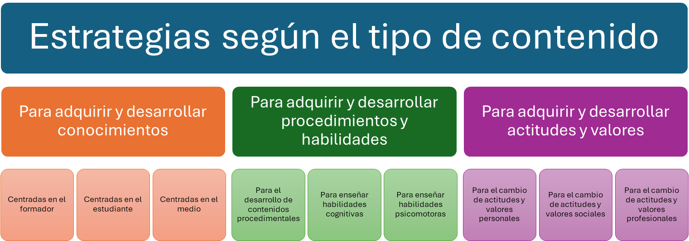{.img-preview}

---

#### 5.5.2 Estrategias para adquirir y desarrollar conocimientos (dimensión del saber)

##### 5.5.2.1 Fases

Dentro de la **dimensión didáctica del saber** se agrupan una serie de estrategias que facilitan la **adquisición y perfeccionamiento de los conocimientos**.  
El proceso de adquisición de conocimiento y conceptos suele desarrollarse en **cinco fases sucesivas**:

1. d🧠 **Memorizar:** fijar un conocimiento o idea en la memoria.  
2. 🔎 **Reconocer:** identificar un elemento a través de una exploración general.  
3. 💡 **Comprender:** interiorizar de forma significativa un concepto dentro de los propios esquemas mentales.  
4. 🗣️ **Interpretar:** atribuir un significado determinado a un concepto o información.  
5. ⚖️ **Juzgar:** valorar conceptos, situaciones o personas, aplicando criterios de análisis y evaluación.

---

##### 5.5.2.2 Estrategias centradas en el formador

Para desarrollar este tipo de estrategias debemos situar como **protagonista al docente**, que es quien **comunica conocimientos** al alumnado dentro de un contexto concreto.  
Entre las estrategias más utilizadas se encuentran las siguientes:

---

**📘 Estrategias expositivas**

Las **estrategias expositivas** suelen aplicarse en contextos donde el espacio y el tiempo están controlados, como una **clase presencial**, una **videoconferencia**, un **vídeo formativo**, un **audio**, una **reunión de trabajo** o una **conferencia**.

El papel del docente es el de **transmitir conocimientos**, habitualmente mediante la exposición oral, mientras el alumnado escucha y toma apuntes.  
Las **lecciones magistrales**, estudiadas anteriormente, son un ejemplo típico de estrategia expositiva.

** 🔵Ventajas principales:**

- Rapidez en la **transmisión de información**.  
- Permite una **estructura clara** de los contenidos.  
- Ofrece **mucha información en poco tiempo**.  
- Favorece la **eficacia** en la comunicación.  
- Facilita la **adquisición rápida de aprendizajes**.  
- **Aclara conceptos** de forma directa.  
- Puede **combinarse con otras estrategias didácticas**.  
- Permite **obtener resultados a corto plazo**.

**🔵Recursos más comunes:**  
Pizarra, rotafolios, retroproyector, ordenador y presentaciones digitales.

**🔵Precauciones y posibles inconvenientes:**

> [!warning]
>
> - Evitar el **exceso de verbalismo**. No convertir la clase en un monólogo, sin ejemplos, recursos visuales o actividades.
> - No abusar de los **apuntes** como único soporte.  
> - No limitar el aprendizaje a la **memorización**.  
> - Prevenir la **pasividad** del alumnado.  
> - Mantener la **comunicación bidireccional** docente–discente.
>

---

**📗 Interrogación didáctica**

La **interrogación didáctica** consiste en que el docente introduce los contenidos mediante la **formulación de preguntas** al alumnado.  
Aunque pueda parecer una técnica sencilla, requiere **experiencia y planificación**, ya que hacer la pregunta adecuada en el momento oportuno exige habilidad docente.

**🟢Aspectos a tener en cuenta:**

- Definir claramente los **objetivos** que se quieren lograr con las preguntas.  
- Conceder **tiempo suficiente** para que los alumnos elaboren sus respuestas.  
- Formular preguntas **relacionadas con los intereses del alumnado**.  
- Mantener una **actitud receptiva y tolerante** ante todas las respuestas.  

**🟢Tipos de preguntas según su finalidad:**

1. **Conocimiento:** buscan que el estudiante **recuerde información** importante para aprendizajes futuros.  
   👉Ejemplo de verbos: *definir, exponer, identificar, reconocer*.  

2. **Comprensión:** el alumnado **organiza y explica** información con sus propias palabras.  
   👉Ejemplo de verbos: *comentar, comprobar, diferenciar, reordenar*.  

3. **Aplicación:** el alumnado **usa la información aprendida** en un contexto real o práctico.  
   👉Ejemplo de verbos: *clasificar, ordenar, resolver*.  

4. **Análisis:** promueve el **pensamiento crítico**, la investigación y la resolución de problemas.  
   👉Ejemplo de verbos: *analizar, detectar, deducir, identificar, buscar soluciones*.  

5. **Síntesis:** fomenta el **pensamiento creativo y original**.  
   👉Ejemplo de verbos: *componer, elaborar, diseñar, resolver*.  

6. **Estimulación:** mantiene la **atención y participación activa** del grupo mediante preguntas motivadoras.

> [!tip]
> Una buena práctica consiste en **alternar preguntas de distinto nivel cognitivo**, comenzando con las más sencillas (conocimiento y comprensión) y avanzando progresivamente hacia las de **análisis y síntesis**, para fomentar el aprendizaje significativo.

---

##### 5.5.2.3 Estrategias centradas en el estudiante

Este grupo de estrategias se enfoca en la **participación activa del estudiante**, convirtiéndolo en un elemento **fundamental del proceso de enseñanza-aprendizaje**.  
El protagonismo se traslada del docente al alumnado, priorizando el **proceso y la evolución del aprendizaje** frente a los resultados finales.

---

**📘 La solución de problemas**

Esta estrategia parte de la idea de que los **problemas son instrumentos conceptuales** que permiten **analizar e interpretar la realidad**.  
El alumnado, frente a una situación conflictiva o reto, debe **buscar soluciones** a través de un proceso estructurado en distintas fases:

1. **Identificación del problema**, determinando los elementos internos y externos implicados.  
2. **Definición y representación** del problema.  
3. **Formulación de hipótesis** sobre sus causas.  
4. **Decisión de estrategias de intervención** o posibles soluciones.  
5. **Evaluación de los resultados** obtenidos.

El papel del docente en esta metodología es el de **facilitador y consejero**, orientando al grupo en la **toma de decisiones**, la **resolución de dificultades** y la **reflexión sobre los resultados**.

> [!tip] Ejemplo
> Un ejemplo práctico sería plantear un **caso real de empresa con una caída de ventas**.  
> El grupo analiza la situación, identifica posibles causas y propone estrategias de mejora, guiado por el formador.

---

**📗 La elaboración de proyectos**

En el **método por proyectos**, el alumnado **participa activamente** en su propio aprendizaje, desarrollando un proyecto que se lleva a cabo mediante el **trabajo grupal y cooperativo**.

El precursor de este enfoque fue **William H. Kilpatrick**, quien estableció **cinco tipos de proyectos**:

1. **De producción:** creación de un elemento o producto concreto.  
2. **De utilización:** empleo o aplicación de un producto existente.  
3. **De solución:** resolución de una dificultad o problema específico.  
4. **De dominio técnico:** adquisición de una habilidad o técnica concreta.  
5. **De aprendizaje específico:** orientado a tareas instrumentales o académicas.

> [!tip] Ejemplo
> Por ejemplo, en un curso de **marketing digital**, el alumnado podría diseñar y presentar una **campaña real en redes sociales**, aplicando los conocimientos aprendidos sobre estrategia, contenido y medición de resultados.

---

**📙 Tormenta de ideas (Brainstorming)**

Fue desarrollado por **A. F. Osborn (1953)**.  
Su objetivo es **generar el mayor número posible de ideas o propuestas** relacionadas con un tema o problema, sin juicios previos, para **estimular la creatividad y la participación**.

**🟠Principios básicos para su aplicación:**

1. Evitar el **miedo a ser juzgado**: durante la fase de ideas no se permiten críticas.  
2. Fomentar un **clima de confianza** donde se expresen todas las ideas, incluso las más extravagantes.  
3. Promover la **participación masiva**: cuantas más ideas surjan, mejor.  
4. Reconocer que **todas las aportaciones son válidas** y pueden contribuir a la solución del problema.

> [!tip] Ejemplo
> Un ejemplo sencillo sería proponer al grupo:  
> “¿Qué acciones podríamos aplicar para mejorar la motivación del personal de una empresa?”  
> El formador modera, anota todas las ideas sin evaluarlas, y luego se analizan y priorizan en grupo.

---

##### 5.5.2.4 Estrategias centradas en el medio

Las **estrategias centradas en el medio** otorgan a los **recursos formativos** un papel protagonista, siempre que estos tengan un **alto potencial educativo** y contribuyan directamente al aprendizaje.  
En este enfoque, el alumnado se centra en **interactuar con el propio medio o recurso**, aunque detrás de su uso siempre está la **guía del docente**.

La diferencia con otros tipos de recursos radica en que, en este caso, el **medio** adquiere **gran protagonismo** dentro del proceso de enseñanza–aprendizaje.

📌 **Los recursos pueden clasificarse según su soporte:**

- 💻 **Soporte tecnológico:** recursos audiovisuales, auditivos o informáticos.  
- 📄 **Soporte textual:** prensa escrita, relatos, documentos gráficos, entre otros.  
- 🎭 **Soporte corporal:** representaciones escénicas, mimo o dramatizaciones que faciliten el diálogo.  
- 🧩 **Soporte experiencial:** basados en experiencias personales, como el **estudio de casos**.

A continuación, se presentan algunas de las principales estrategias centradas en el medio:

---

**📒 Estudio de casos**

El **estudio de casos** puede considerarse tanto una **estrategia de investigación** como una **estrategia de enseñanza–aprendizaje**.  
En este contexto, se utiliza como herramienta didáctica para **analizar situaciones reales** que permitan al alumnado **aprender de los errores y aplicar soluciones en un entorno seguro**.

Un **caso** es un fragmento de una situación real que contiene los **elementos necesarios para ser estudiado y debatido** en el aula.  
Esta técnica permite practicar la toma de decisiones sin que las consecuencias afecten a terceros.

**🟡 Fases del estudio de casos, según Muccielli (1972):**

1. **Lectura y toma de contacto con el caso:** se realiza de forma individual, tomando notas en los márgenes.  
2. **Primeras ideas y valoraciones:** surgen opiniones e impresiones iniciales, que sirven como punto de partida.  
3. **Análisis y reflexión en grupo:** se vuelve sobre el texto para debatir y profundizar.  
   El papel del docente como **moderador** es esencial para orientar y reconducir las intervenciones.  
4. **Reconceptualización y consenso:** el grupo elabora **propuestas conjuntas** y diseña un **plan de acción común**.

> [!tip] Ejemplo
> Un ejemplo práctico podría ser analizar un **caso real de gestión de conflictos laborales**, debatiendo en grupo las causas, las decisiones posibles y las medidas preventivas que podrían aplicarse.

---

**📕 El documento audiovisual**

Vivimos en una sociedad dominada por la **comunicación visual**, y muchos alumnos **asimilan mejor la información audiovisual** que la textual.  
Por ello, los **documentales, películas, fragmentos de series o animaciones** son recursos con un gran potencial didáctico.

Sin embargo, su uso debe ser **activo y planificado**.  
No basta con proyectar un vídeo y realizar un debate sin estructura; es necesario un **trabajo previo, durante y posterior** a la visualización.

**🔴Criterios para seleccionar y aplicar un documento audiovisual:**

- Pertinencia del mensaje con respecto a los **objetivos formativos**.  
- Adecuación al **grupo de aprendizaje** (edad, madurez, características del alumnado).  
- Cumplimiento de **estándares técnicos, artísticos y educativos** de calidad.  
- Uso del documento como base para **debatir, analizar y profundizar** en el tema tratado.

> [!tip] Ejemplo
> En un curso de **educación ambiental**, se puede proyectar un documental sobre **cambio climático**, seguido de un debate guiado donde el grupo reflexione sobre hábitos sostenibles y su aplicación práctica.

---

**📓 La prensa escrita**

El uso de la **prensa** como recurso formativo permite **desarrollar valores, pensamiento crítico y capacidad de análisis**.  
Además, mantiene al alumnado **en contacto con la realidad**, haciendo el aprendizaje **más cercano, actual y motivador**.

En la FPE, el **método ORA** es una herramienta eficaz para analizar artículos de prensa. Se desarrolla en tres fases:

1. **Observación:** cada estudiante lee atentamente el texto seleccionado para comprender su contenido.  
2. **Reflexión:** puede realizarse de forma individual o grupal. La reflexión en grupo suele enriquecer más el proceso.  
3. **Aplicación:** tras la reflexión, el alumnado aplica los contenidos o conclusiones a la **temática o contexto del curso**.

> [!tip] Ejemplo
> En un curso de **prevención de riesgos laborales**, se puede analizar una **noticia sobre un accidente en el trabajo**, reflexionar sobre las causas y aplicar los conocimientos del módulo para proponer medidas preventivas.

---

#### 5.5.3 Estrategias para adquirir y/o desarrollar procedimientos o habilidades (dimensión del saber hacer)

##### 5.5.3.1 Conceptos

Dentro de la **dimensión didáctica del saber hacer** se agrupan aquellas estrategias que favorecen la **adquisición y perfeccionamiento de procedimientos y habilidades**.  
Este tipo de aprendizaje está orientado a la **acción práctica**, donde el alumnado **aplica los conocimientos** para resolver tareas o realizar actividades específicas.

El proceso de adquisición de procedimientos y habilidades se desarrolla en **cinco fases sucesivas**:

- ⚙️ **Aplicar:** usar conceptos o informaciones en distintos contextos sin profundizar en el porqué.  
  Incluye la puesta en práctica de fórmulas, métodos o técnicas específicas.

- 🧰 **Utilizar:** conocer el **manejo y las condiciones de uso** de instrumentos o herramientas concretas.

- 🔄 **Transferir:** aplicar un conocimiento o procedimiento aprendido en **otro contexto diferente**, adaptándolo a nuevas circunstancias.

- 📚 **Autoaprender:** usar **estrategias cognitivas básicas** que favorecen la formación continua y el aprendizaje autónomo.

- 💭 **Reflexionar:** ir más allá del simple saber, **analizando el propio proceso de aprendizaje** (metacognición).

📌 **Componentes de un procedimiento**

Un procedimiento implica varios **elementos interrelacionados**, que determinan el desarrollo y la eficacia de la habilidad adquirida:

- 🧬**Capacidad:**  
  Son las **disposiciones genéticas o innatas** que cada persona posee para desarrollar determinadas habilidades.  

- 🖖**Habilidad o destreza:**  
  Representa el **potencial que puede desarrollarse** mediante la estimulación, la práctica y la experiencia.  

- 🎾**Técnica:**  
  Es una **acción repetida sistemáticamente**, que llega a **automatizarse** y facilita la obtención de resultados precisos.  

- ♟️**Estrategia:**  
  Constituye una **planificación consciente e intencional** orientada a conseguir un objetivo concreto.

> [!note] 
>
> En el siguiente cuadro se muestran las **estrategias** que facilitan el desarrollo y adquisición de procedimientos, las cuales se desarrollarán a continuación.

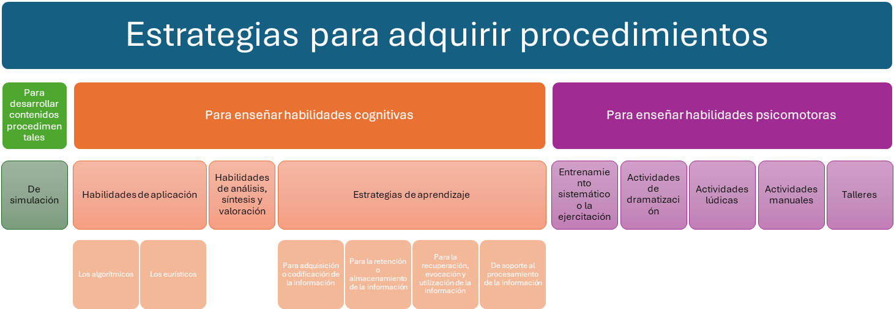{.img-preview}

---

##### 5.5.3.2 Estrategias para desarrollar contenidos procedimentales y para enseñar habilidades cognitivas

 

> [!note]
> Las **estrategias para desarrollar contenidos procedimentales** (también llamadas *estrategias de simulación*) se abordarán de forma más amplia más adelante.

Las **habilidades cognitivas** se centran en el **análisis y la comprensión** de las conductas y conocimientos previos de cada estudiante.  
Además, deben tener en cuenta el **objetivo general** de la formación.  
El proceso comienza con un **análisis de la realidad** (identificando conocimientos y conductas), y a partir de estas observaciones, junto con el objetivo formativo, se **seleccionan y aplican de manera secuenciada los conocimientos**.

---

**📘 Habilidades de aplicación**

Tras comprender un concepto, el estudiante debe ser capaz de **aplicarlo a una situación determinada**.  
Esto implica establecer **relaciones entre factores relevantes**, seleccionar y aplicar **reglas o principios** adecuados y finalmente llegar a **conclusiones**.

**🔵Tipos de procedimientos principales:**

- **Algorítmicos:** operaciones **elementales y secuenciadas** para resolver un problema.  
  Son **procedimientos cerrados**, con pasos prefijados.  
  El docente enseña al alumnado estas operaciones **paso a paso**, para que pueda **recordarlas, aplicarlas y dominarlas**.  
  👉 Ejemplo: seguir un protocolo para configurar una red local o calcular un presupuesto.

- **Heurísticos:** operaciones de **búsqueda no elementales**, que no necesariamente resuelven el problema en su totalidad.  
  Son **procedimientos abiertos**, con varias alternativas posibles de solución.  
  👉 Ejemplo: proponer diferentes estrategias para mejorar la productividad de una empresa.

---

**📗 Habilidades de análisis, síntesis y valoración**

A través de diferentes métodos de aplicación —como el **ensayo y error**, la **simplificación**, el **razonamiento hipotético** o el **pensamiento inductivo**—, el estudiante **descubre por sí mismo** la solución a un problema.

> [!tip]
> En esta etapa el rol del docente es el de **guía y facilitador**, ayudando al alumnado a reflexionar sobre los pasos dados y los resultados obtenidos.

---

**📙 Estrategias de aprendizaje**

Las **estrategias cognitivas** son **destrezas aplicadas al tratamiento de la información**.  
Mediante ellas, el estudiante dirige su **atención**, selecciona los **modelos de registro sensorial** y decide **qué información conservar y cómo recuperarla**.

Por ejemplo, cuando un estudiante **subraya una palabra clave** dentro de un texto para recordar el resto del contenido, está aplicando una **estrategia cognitiva de memoria**.

🟠**Tipos de estrategias cognitivas:**

1. **Estrategias de adquisición o codificación de la información:**  
   Se utilizan al **primer contacto con un texto o contenido**.  
   👉Ejemplos: *subrayar, copiar, hacer una prelectura, escuchar, tomar apuntes, repetir.*

2. **Estrategias de retención o almacenamiento de la información:**  
   Una vez recibida la información, se organizan los datos para facilitar su comprensión.  
   👉Ejemplos: *pasar apuntes a limpio, realizar una lectura retentiva, hacer resúmenes, esquemas o mapas conceptuales.*

3. **Estrategias de recuperación, evocación y utilización de la información:**  
   Permiten **recordar y aplicar** la información almacenada.  
   Si se han utilizado buenas estrategias de codificación, la recuperación será más efectiva.  
   👉Ejemplos: *usar esquemas, códigos, mapas conceptuales o resúmenes para repasar contenidos.*

4. **Estrategias de soporte al procesamiento de la información:**  
   Aquí se incluyen las **estrategias metacognitivas**, que ayudan al estudiante a **conocer su propio proceso de aprendizaje**.  
   Permiten identificar los **puntos fuertes y débiles** (por ejemplo, buena comprensión, dificultad para organizar el estudio, etc.) y **buscar soluciones de mejora**.  
   También se incluyen las **estrategias socioafectivas**, que ayudan a **controlar la ansiedad, gestionar las expectativas y mantener la motivación**.

**🧩 Ejemplo práctico de estrategias cognitivas**

El docente puede elaborar una **serie de preguntas metacognitivas** que guíen al alumnado en tres momentos del proceso de aprendizaje:

- **Durante la planificación:**  
  - ¿Cuál es el problema que tengo que resolver?  
  - ¿Cuál es la meta?  
  - ¿Qué información y qué estrategias necesito?

- **Durante la supervisión del proceso:**  
  - ¿Estoy alcanzando mis metas?  
  - ¿Necesito introducir cambios?

- **Durante la evaluación final:**  
  - ¿Logré alcanzar las metas?  
  - ¿Por qué no funcionaron?

> [!note]
> Los ejemplos de instrucción metacognitiva están basados en la **Tesis doctoral de Mar Mateos (1989)** y en su programa de **instrucción en estrategias de supervisión de la comprensión lectora (1991)**.

---

##### 5.5.3.3 Estrategias para enseñar habilidades psicomotoras

 

> [!important]
> Las **habilidades psicomotoras** son esenciales en el desarrollo humano y se adquieren **antes que los conocimientos y las actitudes**.  
> En los primeros años de vida, el aprendizaje se produce a través del **movimiento y la experimentación corporal**, desarrollando destrezas para **interactuar con el entorno**.  
> Estas habilidades se construyen mediante el **desarrollo progresivo de destrezas perceptivo–motoras**.

---

**📘 El entrenamiento sistemático o la ejercitación**

Las habilidades que **no son innatas** solo pueden adquirirse mediante la **práctica sistemática y la repetición**.  
El entrenamiento permite que las acciones se **automaticen correctamente**, mejorando la precisión y el control.

> [!tip] Ejemplo
>
> En un curso de **soldadura**, la repetición constante de los movimientos técnicos permite adquirir **precisión y coordinación manual**, fundamentales para lograr un resultado profesional.

---

**📗 Las actividades de dramatización**

Durante mucho tiempo, las **actividades creativas y artísticas** han sido consideradas secundarias. Sin embargo, en la actualidad se reconoce que la **creatividad es una habilidad esencial** para adaptarse a un mundo cambiante.  
La **dramatización** —ya sea musical, plástica o escénica— favorece la **expresión emocional**, la **resolución creativa de problemas** y la **comunicación corporal**.

> [!tip] Ejemplo
> Dramatizar una **situación de atención al cliente** en un curso de ventas ayuda a desarrollar habilidades como la **empatía**, la **escucha activa** y la **comunicación no verbal**.

---

**📙 Las actividades lúdicas**

El **juego** es una de las formas más naturales de aprendizaje.  
A través de él, el ser humano **descubre, imagina, experimenta y comunica**.  
Existen múltiples tipos de juegos: **libres, simbólicos, de construcción, de reglas, de cartas o de puzles**, entre otros.

> [!tip] Ejemplo
> En una formación de **trabajo en equipo**, se puede utilizar un juego cooperativo donde los participantes deben **resolver un reto común**, fomentando la **colaboración y la coordinación**.

---

**📒 Las actividades manuales**

Las **actividades manuales** adquieren especial importancia en los cursos **eminentemente prácticos**, donde el aprendizaje se basa en la **manipulación directa de materiales, herramientas o equipos**.  
Favorecen la **coordinación motora**, la **concentración**, la **autonomía** y el desarrollo de **habilidades técnicas y creativas**.

> [!tip] Ejemplo
> En un curso de **cerámica artesanal**, el alumnado trabaja con el barro para crear piezas únicas, desarrollando destrezas manuales y sentido estético a través de la práctica constante.

---

**📕 Los talleres**

Los **talleres** se aplican en la **formación formal, no formal e informal** como espacios de **aprendizaje práctico y participativo**.  
Su objetivo es que el alumnado **aprenda haciendo**, mediante actividades que integran teoría y práctica.  
Pueden abordar **múltiples temáticas**: cocina, electricidad, fontanería, matemáticas, técnicas de estudio, encuadernación, entre otras.

> [!tip] Ejemplo
> En un **taller de técnicas de estudio**, el alumnado puede practicar cómo organizar su tiempo, resumir textos o elaborar mapas conceptuales, aplicando directamente lo aprendido a su propio proceso formativo.

---

#### 5.5.4 Estrategias para adquirir y/o desarrollar actitudes y valores (dimensión del ser)

La **dimensión del ser** se centra en la **dimensión afectiva de la persona**, tanto en su aspecto individual como en su **relación social**.  
Se trata de una dimensión **difícil de valorar**, ya que los resultados no siempre son visibles a corto plazo, y los **cambios emocionales y sociales** suelen manifestarse de manera **lenta y progresiva**.

 

**🟣 Fases de evolución de la dimensión afectiva**

1. **Percibir:** toma de conciencia ante una situación; es el momento de **sensibilización**.  
2. **Responder:** implica la **motivación** para dar la respuesta más adecuada.  
3. **Valorar:** consiste en **reconocer y respetar las particularidades de los demás**.  
4. **Organizar:** supone adoptar un **modo de pensar y actuar coherente** que permita tomar decisiones futuras.  
5. **Implicarse:** significa **defender y comprometerse** con un valor adquirido o una causa.

> [!tip] Ejemplo
> Un alumno que participa en una actividad de **voluntariado** pasa de **percibir** la necesidad de ayudar, a **responder** colaborando, **valorar** la importancia del trabajo en equipo, **organizar** su tiempo para continuar, e **implicarse** activamente en el proyecto.

 

**🟣 Contenidos que se pueden desarrollar en esta dimensión**

- 💡 De **carácter personal:** autonomía, iniciativa, creatividad, responsabilidad, espíritu de superación.  
- 🤝 De **carácter social:** colaboración, solidaridad, espíritu de equipo, respeto, empatía, etc.

---

**🟪 Estrategias para el cambio de actitudes y valores personales**

- 🎯 **La enseñanza personalizada:**  
  Los modelos pedagógicos centrados en el alumnado ponen el acento en el estudiante como **protagonista del proceso formativo**.  
  El docente adapta la **metodología y los recursos** a los **estilos de aprendizaje individuales**, favoreciendo la autonomía y la motivación.

  > [!tip] Ejemplo
  > Ofrecer al alumnado diferentes formas de realizar un trabajo —presentación oral, informe escrito o mural visual— para que elija la que mejor se adapte a su estilo de aprendizaje.

- 🎨 **La enseñanza creativa:**  
  Exige **flexibilidad** por parte del docente. Se trata de permitir que el alumnado **innove, experimente y proponga nuevas ideas**, ya que la **creatividad** impulsa la transformación personal y el pensamiento crítico.

  > [!note]
  > Puedes ampliar esta idea en la conferencia de **Sir Ken Robinson**, quien defiende la necesidad de fomentar la creatividad en la educación.  
  >
  > http://www.rtve.es/alacarta/videos/buenas-ideas-ted/ken-robinson-escuelas-matan-creatividad/2050360/
  > 
<iframe src="https://secure-embed.rtve.es/drmn/embed/video/2050360" name="Ken Robinson: Las escuelas matan la creatividad" style="width:100%;height:90%;position:absolute;left:0;top:0;overflow:hidden;border:none;background-color:transparent;" scrolling="no" allowfullscreen="allowfullscreen"></iframe>
<a style="color:#333;font-weight:bold;" title="Ken Robinson: Las escuelas matan la creatividad" href="https://www.rtve.es/play/videos/buenas-ideas-ted/ken-robinson-escuelas-matan-creatividad/2050360/"><strong>Ken Robinson: Las escuelas matan la creatividad</strong></a>

**🟪 Estrategias para el cambio de actitudes y valores sociales**

- 🌍 **La simulación social:**  
  Se desarrolla más adelante en el epígrafe de **simulación docente**, donde se analizan situaciones que fomentan la **empatía y la comprensión social**.

- 👥 **El trabajo en equipo:**  
  Es una de las estrategias más eficaces para fomentar la **participación, la comunicación y la cooperación**.  
  Se puede aplicar mediante diferentes dinámicas grupales como:  
  
  - *Phillips 6/6*  
  - *Seminarios*  
  - *Mesas redondas*  
  - *Debates*
  
   
  
  > [!tip] Ejemplo
  > Organizar un **debate estructurado** donde cada participante defienda un punto de vista distinto sobre un tema social, promoviendo la **escucha activa** y el **respeto por las opiniones ajenas**.

---

**🟪 Estrategias para el cambio de actitudes y valores profesionales**

Antes de aplicar estas estrategias, deben considerarse algunos aspectos importantes:

- 👨‍👩‍👧‍👦 El **número de personas** que integran el grupo.  
- 🎲 La **imprevisibilidad** de las dinámicas de grupo.  
- 💬 La **relación inicial de confianza** entre docente y alumnado.  
- 🔁 La **retroalimentación constante** para ajustar las estrategias.  
- 💚 El fomento de **relaciones positivas** entre los miembros del grupo.

Entre las estrategias más destacadas se encuentran:

---

**🔹Trabajo cooperativo**

El **trabajo cooperativo** potencia las **actitudes y valores** frente a los aprendizajes puramente cognitivos, ya que implica **intercambio de ideas, respeto y colaboración**.  
Para que sea efectivo, requiere una **buena organización del grupo** y una **evaluación constante** que proporcione retroalimentación.

**📌Características del trabajo cooperativo:**

- 🎯 Se priorizan los **objetivos grupales** frente a los individuales, creando nuevos vínculos sociales.  
- 🧩 Cada participante debe ser **responsable de su parte**, para que el grupo funcione sin desequilibrios.  
- 🏆 Todos los miembros tienen **igualdad de oportunidades** para alcanzar el éxito, ya que el logro final es **compartido**.

> [!tip] Ejemplo
> En un curso de **gestión de proyectos**, los alumnos trabajan en grupos para desarrollar una propuesta común, repartiendo tareas y evaluando conjuntamente los resultados obtenidos.

---

**🔹 Team teaching (enseñanza en equipo)**

La **enseñanza en equipo** está estrechamente relacionada con el trabajo cooperativo.  
Consiste en que **dos o más docentes** planifican, imparten y evalúan una misma unidad formativa, **complementando sus conocimientos y estilos**.  
Requiere docentes **tolerantes, críticos y respetuosos**, capaces de generar un **ambiente positivo y colaborativo**.

> [!tip] Ejemplo
> Un curso impartido conjuntamente por un **especialista técnico** y un **pedagogo** permite ofrecer una formación más completa, combinando **teoría, práctica y acompañamiento didáctico**.

 

> [!note]
> Si deseas profundizar en el tema del **aprendizaje cooperativo** y la organización de trabajos grupales, puedes ver el siguiente vídeo elaborado por la **UNED**:
>
> https://www.youtube.com/watch?v=VKTqZ_G-ieo
>
> <iframe width="100%" height="310" src="https://www.youtube.com/embed/VKTqZ_G-ieo?rel=0&showinfo=0" title="Aprendizaje cooperativo - UNED" frameborder="0" allowfullscreen></iframe>

---

### 5.6. Recursos  

#### 5.6.1 Conceptos y organización de los recursos  

> [!important]
> Los **recursos** con los que contamos como docentes o tutores **condicionan directamente las estrategias metodológicas** que podemos aplicar.  
> El uso de **audios, vídeos, ordenadores, materiales específicos** o la posibilidad de **conectarnos a la red** sirve como **apoyo fundamental** para dinamizar la actividad docente.

Una **organización adecuada** de los recursos, materiales y espacios permite:

- 🧭 **Controlar y organizar** el material y los espacios, determinando **zonas de trabajo** y **tiempos**.  
- 🧩 **Aprovechar al máximo** los recursos disponibles, aunque su uso sea limitado.  
- 📅 **Planificar el momento de uso** del recurso: si se utilizará **antes, durante o después** de la actividad.  
- 🧰 **Prever y preparar con antelación** el material necesario y la forma en que se integrará en la sesión formativa.

> [!tip]
> Antes de una sesión práctica de informática, el docente debe comprobar que **los equipos funcionan**, que el **software está instalado**, y que los **archivos de práctica** están accesibles en la red o en pendrive.  
> Esto evita interrupciones y mejora la eficacia del aprendizaje.

---

#### 5.6.2 Clasificación

Los **recursos didácticos** pueden clasificarse de diversas formas.  
Según **Moreno Herrero (2005)**, se agrupan en las siguientes categorías:

- 📚 **Soporte papel:** libros de divulgación, de texto, de consulta, cuadernos de ejercicios, materiales autocorrectivos, diccionarios, enciclopedias, folletos, guías o catálogos.  
- 👩‍🏫 **Técnicas blandas:** pizarras, rotafolios, paneles, carteles, etc.  
- 🎧 **Audiovisuales y medios de comunicación:**  
  - Sistemas de audio: reproducción, grabación, radio, televisión, vídeo.  
  - Sistemas de imagen: fotografías, diapositivas, retroproyector, TV, cine.  
  - Sistemas mixtos: prensa escrita, tebeos, carteles.  
- 💻 **Sistemas informáticos y multimedia:** programas de diseño, hipertextos, hipermedia, sistemas telemáticos, redes sociales, internet, blogs, chat, wikis, etc.

Otra clasificación —más práctica para analizar sus ventajas e inconvenientes— distingue entre **métodos convencionales**, **nuevas tecnologías** y **métodos audiovisuales**:

---

**📘 Métodos convencionales**  
*(pizarras, papelógrafos, libros, etc.)*

**Ventajas:**
- ✅ Son los más conocidos tanto por formadores como por alumnos, y **fáciles de utilizar**.  
- 📖 Permiten **leer y releer**, facilitando un **orden en el aprendizaje**.  
- 🕒 Proporcionan **material accesible**, utilizable en cualquier momento o lugar.  
- 💶 Buena **relación coste–eficacia**.  
- 📚 Fáciles de controlar por el alumnado.  
- 🔄 Son **flexibles** y adaptables a diferentes contextos.

**Inconvenientes:**
- 😴 Pueden resultar **menos motivadores** que los recursos audiovisuales o digitales.  
- 🕓 La **retroalimentación** entre formador y alumno es más lenta.  
- 🌍 No permiten acceder a la **realidad total** de los contenidos.  
- 🧠 Pueden fomentar **memorización mecánica** y **actitudes pasivas**.

---

**💾 Nuevas tecnologías**  
*(CD-ROM, plataformas de teleformación, recursos digitales, etc.)*

**Ventajas:**
- 🎬 Proporcionan **información multimedia** (texto, audio, imagen y vídeo).  
- 🚀 Incrementan la **motivación** del alumnado.  
- 🧩 Son **versátiles**: pueden usarse en grupo o de forma individual.  
- ⚡ Permiten **corrección inmediata**, fomentando el aprendizaje a partir del error.  
- ⏱️ Favorecen un **aprendizaje más rápido y significativo**.  
- 💡 Estimulan la **iniciativa** y el **trabajo autónomo**.  
- 🌐 Facilitan **procesamiento de información** y **comunicación en entornos virtuales**.  
- 👥 Pueden llegar a **grupos numerosos** simultáneamente.

**Inconvenientes:**
- 😰 Pueden generar **ansiedad, monotonía o cansancio**.  
- 🏠 Riesgo de **aislamiento social**.  
- 🤖 Posible **empobrecimiento de las relaciones humanas**.  
- 😴 Fomentan a veces el **“mínimo esfuerzo”**.  
- 🧭 Pueden resultar **descontextualizados** si no se integran bien en la enseñanza.  
- 🧾 Ofrecen información **a veces superficial o incompleta**.  
- 💬 Interacción **limitada** entre docente y alumno.  
- 💰 **Altos costes** de elaboración y mantenimiento.  
- 🧠 Requieren **competencias digitales previas**.

---

**🎥 Métodos audiovisuales**  
*(retroproyectores, vídeos, transparencias, presentaciones, etc.)*

**Ventajas:**
- 👀 Aportan **información multisensorial** (vista y oído).  
- 🔥 Aumentan la **motivación** y el interés.  
- 🧠 Permiten un **aprendizaje más significativo y dinámico**.  
- 🧩 Son **versátiles**, válidos tanto para el trabajo individual como en grupo.

**Inconvenientes:**
- 🗣️ Pueden causar **empobrecimiento de la expresión verbal**.  
- 💭 No estimulan la **imaginación ni la abstracción**.  
- 📺 En ocasiones ofrecen información **demasiado superficial**.  
- 🛠️ Requieren una **preparación exhaustiva del material** por parte del docente.

> [!tip]
> Usar un **vídeo breve** para introducir un tema puede aumentar la motivación, pero debe ir acompañado de **preguntas o actividades posteriores** para garantizar una **reflexión activa**.

---

### 5.7 Organización

> [!note] Definición:
>
> 📢Podemos definir la **organización** como un recurso que nos permite **distribuir y disponer adecuadamente** todos los elementos que configuran una acción formativa.  
> Desde el punto de vista educativo, es un **recurso didáctico** que facilita la **consecución de los objetivos** y **favorece la coordinación** entre docente y alumnado.

La **planificación y el seguimiento** de la organización cumple varias funciones esenciales:

- 🎓 Favorece el **aprendizaje del alumnado**, ya que facilita la **asimilación de contenidos** y promueve una enseñanza más **individualizada y participativa**.  
- 🤝 Mejora el **ambiente del aula** y fomenta una **mayor interacción** entre docentes y estudiantes.  
- 🧩 Permite la **optimización de materiales y recursos**, aprovechándolos de forma más eficiente.  
- 🗂️ Facilita la **planificación del docente**, mejorando el **seguimiento del proceso de enseñanza–aprendizaje**.

> [!important]
> La **organización de la actividad formativa**, el **horario**, y el **plan formativo** en el que se enmarca serán factores clave para determinar **qué métodos y recursos** empleará el docente o tutor.

La **organización de recursos, materiales y espacios** nos permite:

- 🧭 **Controlar y distribuir adecuadamente** el material y los espacios, definiendo zonas de trabajo y tiempos de uso.  
- 💡 **Aprovechar al máximo** los recursos disponibles, incluso cuando son limitados.  
- 📅 **Planificar el momento de uso** del recurso: si se aplicará **antes, durante o después** de la actividad.  
- 🧰 **Prever con antelación** el material necesario y su **forma de utilización** en la sesión.

> [!tip] Ejemplo
> En una sesión práctica de **mecánica**, el formador debe planificar con antelación la **disposición de herramientas**, la **rotación de grupos** y los **tiempos de práctica**, para asegurar que todos los participantes puedan experimentar activamente.

---

## 6. Habilidades docentes

### 6.1 Aspectos generales

> [!note] Definición:
>
> 📢Las **habilidades docentes** son el conjunto de **capacidades y destrezas** que permiten al docente o teletutor **fomentar un aprendizaje activo y significativo**.  
> Implican la capacidad de **motivar al alumnado**, mantener una **comunicación efectiva** y crear un **entorno positivo de aprendizaje**.

Entre las principales habilidades del docente destacan:

1. 🌤️ **Crear un buen clima:**  
    Favorecer que los participantes se sientan **cómodos y seguros** en el entorno de aprendizaje.  
    Esto ayuda a **liberar tensiones y temores**, creando **relaciones armoniosas** entre el profesorado y el alumnado.

  > [!tip] 
  > Comenzar la sesión con una **dinámica breve y participativa** o interesarse por el progreso del grupo para generar **confianza y cercanía**.

2. 🚀 **Mantener la motivación y el interés:**  
    Al inicio de un curso, el alumnado suele estar motivado por la **novedad**.  
    Sin embargo, esa motivación puede **disminuir con el tiempo**, especialmente en formaciones largas.  
    Para evitarlo, el docente debe aplicar estrategias como:
  - 📚 **Resumir** lo aprendido hasta el momento.  
  - 💬 **Recordar momentos positivos** del curso.  
  - 🎯 **Reforzar los objetivos** y metas alcanzadas.  
  - 🙌 **Animar a la participación** activa.  
  - 🎁 **Introducir novedades o sorpresas** que reactiven el interés.

  > [!tip]
  > Intercalar una **actividad práctica diferente** o mostrar un **vídeo breve** relacionado con el tema puede revitalizar la atención del grupo.

3. 🏁 **Finalización del curso formativo:**  
    El cierre del curso debe servir para **reforzar el aprendizaje global**, **orientar al futuro** y **reconocer los logros alcanzados**.  
    Es recomendable:
  - 🧩 Ayudar al alumnado a **sintetizar lo aprendido**.  
  - 📈 Ofrecer **orientación profesional o formativa** adicional.  
  - 🎉 **Recordar los buenos momentos** del curso y **felicitar** al grupo por su trabajo.  
  - ✉️ Facilitar una **vía de contacto** (correo o teléfono) para mantener el vínculo con los alumnos interesados.

  > [!tip]
  > Cerrar la formación con una **actividad de reflexión grupal** o una **encuesta de valoración** permite al alumnado compartir su experiencia y reforzar la sensación de logro colectivo.

---

### 6.2 Características de las habilidades docentes

Las **habilidades docentes** presentan distintas características según el tipo de habilidad que se ponga en práctica.  
Estas habilidades permiten al docente **organizar, comunicar, motivar y evaluar** de manera eficaz durante el proceso formativo.

 

#### 🗣️ Habilidades en el discurso

- 🎯 Exponer el tema con **claridad y estructura**.  
- 💬 Comunicar **conocimientos y experiencias** de forma comprensible.  
- 🔉 Emplear una **entonación y lenguaje adecuados** al grupo.  
- 📚 Aclarar los contenidos mediante **ejemplos y casos prácticos**.  
- 🧰 Utilizar **diferentes recursos** para reforzar la comprensión.

> [!tip]
> Usar un **caso práctico breve** al explicar una teoría ayuda a **mantener la atención** y facilita la comprensión del concepto.

 

#### 🧠 Habilidades cognitivas

- 🔄 Dar **continuidad y coherencia** al programa formativo.  
- 🧩 **Seleccionar los ejercicios más adecuados** según los objetivos.  
- 💡 **Aclarar conceptos** complejos de forma sencilla.  
- 📘 **Dominar la materia** que se imparte, adaptándola al nivel del grupo.

 

#### 🧭 Habilidades metodológicas

- 🔬 Aplicar una **metodología científica y estructurada**.  
- 🧮 Utilizar las **principales funciones de la inteligencia**: analizar, sintetizar, relacionar, comparar, etc.  
- 🎯 Orientar el proceso formativo hacia **resultados observables** y **aprendizajes significativos**.

 

#### 👥 Habilidades en la conducción del grupo

- 🤝 Fomentar el **trabajo en equipo** y la **colaboración entre participantes**.  
- 👀 Atender al grupo en su conjunto y también a **cada alumno de forma individual**.  
- 💬 Promover la **reflexión y el diálogo constructivo**.  
- 🚀 **Coordinar y motivar** al alumnado en el desarrollo de proyectos conjuntos.

> [!tip]
> Establecer **roles rotativos** dentro de los equipos de trabajo ayuda a mejorar la **participación y la cohesión grupal**.

 

#### 🧾 Habilidades evaluativas

- 🔍 Detectar las **dificultades individuales** del alumnado durante el proceso formativo.  
- 🎓 Explicar los contenidos en función de los **conocimientos previos del grupo**.  
- ✅ **Evaluar y valorar de forma constructiva**, ofreciendo **retroalimentación útil y motivadora**.

> [!tip]
> Acompañar cada evaluación con una **recomendación específica de mejora** refuerza la confianza y la implicación del alumno.

---

### 6.3 Sensibilización como técnica introductoria, variación de estímulos, integración de conocimientos. Comunicación no verbal, refuerzo, motivación y participación, secuencialidad y control de la comprensión

#### 6.3.1 Técnicas introductorias

Las **técnicas introductorias** ayudan al docente a **preparar y motivar al grupo de participantes** antes de abordar un nuevo contenido.  
Su objetivo es lograr un **nivel de atención adecuado**, despertar el **interés por el tema** y crear un **clima positivo** para el aprendizaje.

**¿Cómo se hace?**

- 🎯 **Presentar de forma clara y precisa los objetivos** que se van a alcanzar durante la sesión.  
- 🔁 **Recordar brevemente el contenido o unidad anterior**, estableciendo un vínculo con el nuevo tema que se va a tratar.  
- 😄 **Recurrir a lo anecdótico**, utilizando ejemplos o situaciones curiosas que capten la atención del grupo.  
- 💡 **Plantear situaciones motivadoras** que despierten el interés y la participación desde el inicio.

> [!tip]
> Una introducción dinámica —por ejemplo, una **pregunta inicial**, una **breve historia real** o una **situación práctica** relacionada con el tema— ayuda a conectar emocionalmente al alumnado y facilita la comprensión del nuevo contenido.

---

#### 6.3.2 Variación de estímulos e integración de conocimientos

> [!important]
> El docente es la **principal fuente de estimulación** del alumnado, por lo que debe **variar regularmente su actuación** para mantener el interés y la atención del grupo.  
> Pequeños cambios en el tono de voz, el movimiento, la mirada o la interacción pueden **revitalizar la sesión** y evitar la monotonía.

Algunos cambios que pueden aplicarse en el aula:

- 🚶‍♂️ **Desplazarse por el aula** para mantener contacto visual con todos los participantes.  
- 🤲 **Usar gestos expresivos** con las manos, la cabeza o el cuerpo, para reforzar el mensaje.  
- 💬 **Fomentar la interacción** entre participantes y docente, adaptando las intervenciones a los contenidos y objetivos.  
- ⏸️ **Introducir pausas breves** para facilitar la asimilación de ideas o la reflexión.  
- 🧩 **Variar los recursos didácticos**, alternando explicaciones, debates, vídeos, ejercicios o demostraciones.

> [!tip]
> Cambiar el ritmo o la dinámica cada cierto tiempo —por ejemplo, tras 15-20 minutos de explicación— ayuda a **recuperar la atención** y **mejorar la retención de la información**.

Los docentes deben **planificar y gestionar las intervenciones didácticas** incorporando **actividades que potencien el aprendizaje significativo** y faciliten la **integración de conocimientos**.  
Para ello pueden emplear recursos como **mapas conceptuales**, **debates**, **lluvias de ideas**, o **ejercicios de reflexión**.

> [!important]
>
> La **integración de conocimientos** permite **relacionar la nueva información con los saberes previos**, consolidando un aprendizaje más profundo y duradero.

**¿Cómo se hace?**

- 🔗 **Establecer enlaces claros** entre los conceptos ya aprendidos y los nuevos contenidos.  
- ✍️ **Destacar y resumir los puntos clave** al final de cada bloque.  
- 🧭 **Ayudar al alumnado a ubicarse** dentro del proceso formativo: qué ha aprendido y hacia dónde se dirige.  
- 💬 **Reforzar los logros** y orientar la actuación hacia los siguientes objetivos.  
- 📚 **Realizar recapitulaciones parciales** y **conclusiones finales** que sinteticen lo aprendido.

> [!tip]
> Integrar un **mapa conceptual conjunto al final de la sesión** o pedir a los alumnos que **relacionen conceptos nuevos con experiencias previas** son excelentes formas de reforzar la integración de conocimientos.

---

#### 6.3.3 Secuencialidad o sucesión de contenidos y control de la comprensión

> [!important]
> Informar al alumnado sobre los **objetivos y contenidos** de cada módulo contribuye a su **motivación** y orienta las actividades de aprendizaje hacia la **consecución de los objetivos definidos**.  
> La **secuencialidad** de los contenidos permite estructurar la enseñanza de forma lógica y progresiva, facilitando la comprensión.

**📌Aspectos a tener en cuenta en la secuencialidad:**

- 🔢 **Ordenar los conceptos de forma lógica**, avanzando de lo simple a lo complejo.  
- 🚫 **Evitar los saltos atrás**, que pueden provocar desconexión o confusión.  
- 🔄 **Evitar los saltos paralelos**, es decir, interrumpir la explicación con temas no directamente relacionados.

Durante el desarrollo de la clase, el docente debe **verificar continuamente el grado de comprensión** de los contenidos.  
Para ello puede formular **preguntas abiertas**, fomentar la **participación activa**, **resolver dudas** y **ejemplificar con experiencias reales** cercanas al contexto del alumnado.

> [!important]
> El **control de la comprensión** es esencial para garantizar que el aprendizaje se consolide correctamente.  
> Es necesario obtener **retroalimentación constante** sobre lo que el alumnado entiende y cómo lo aplica.

**¿Cómo se hace?**

- ❓ **Proponer preguntas abiertas** que estimulen la reflexión y el razonamiento.  
- 🧠 **Basar las preguntas en conocimientos previos o experiencias personales** del alumnado.  
- 🗣️ Utilizar un **vocabulario claro y comprensible**, adaptado al nivel del grupo.  
- 🎯 Plantear las preguntas con un propósito concreto:
  - Obtener información.  
  - Detectar puntos clave o posibles confusiones.  
  - Estimular el pensamiento y promover la discusión.

> [!tip]
> Formular preguntas como *“¿Cómo aplicarías esto en tu trabajo?”* o *“¿Qué relación encuentras con el tema anterior?”* permite comprobar la comprensión real y mantener una participación activa.

---

#### 6.3.4 Refuerzo, motivación y participación y comunicación no verbal

> [!important]
> El docente debe mostrar **entusiasmo, liderazgo y confianza**, generando un ambiente que **refuerce el interés del alumnado** y promueva la **creatividad y la participación**.

El **refuerzo, la motivación y la participación** influyen directamente en el **comportamiento del alumnado**, aumentando las probabilidades de **iniciar, mantener o modificar conductas** a través de incentivos adecuados.

**📌Algunos refuerzos habituales:**

- 💬 **Comentarios verbales:** expresiones como *“Bien hecho”*, *“Inténtalo de nuevo”*, *“No exactamente, pero vas por buen camino”*, ayudan a guiar sin desmotivar.  
- 😊 **Gestos positivos:** sonrisas, asentimientos, contacto visual, o gestos de aprobación refuerzan el mensaje verbal.  
- 🤔 **Gestos de corrección:** movimientos de cabeza, expresiones de duda o de reflexión invitan al alumno a reconsiderar su respuesta.

La **comunicación no verbal** es esencial en el aula presencial y constituye un **complemento fundamental de la comunicación oral**.  
A través de los gestos, la postura o la expresión facial, el docente **transmite mensajes** que refuerzan la comprensión y el clima del grupo.

En la **modalidad online**, el tutor debe **cuidar especialmente su lenguaje escrito**, ya que se convierte en el principal medio de comunicación y debe transmitir **cercanía, claridad y empatía**.

> [!important]
> La **comunicación no verbal** tiene un valor decisivo en el aula, ya que influye tanto en la **comprensión del mensaje** como en el **estado emocional** del grupo.

**¿Cómo se hace?**

- 🤫 Utilizar **el silencio como recurso didáctico**: permite captar la atención, crear expectación, favorecer la reflexión y dar espacio a la participación.  
- 😊 **Complementar el silencio con gestos y expresiones**: una sonrisa, una mirada atenta o un gesto de aprobación pueden comunicar más que las palabras.  

> [!tip]
> Un breve silencio después de una pregunta o afirmación permite al alumnado **reflexionar y responder con mayor seguridad**, fortaleciendo la atención y la comunicación efectiva.

---
## 7. Estilos didácticos

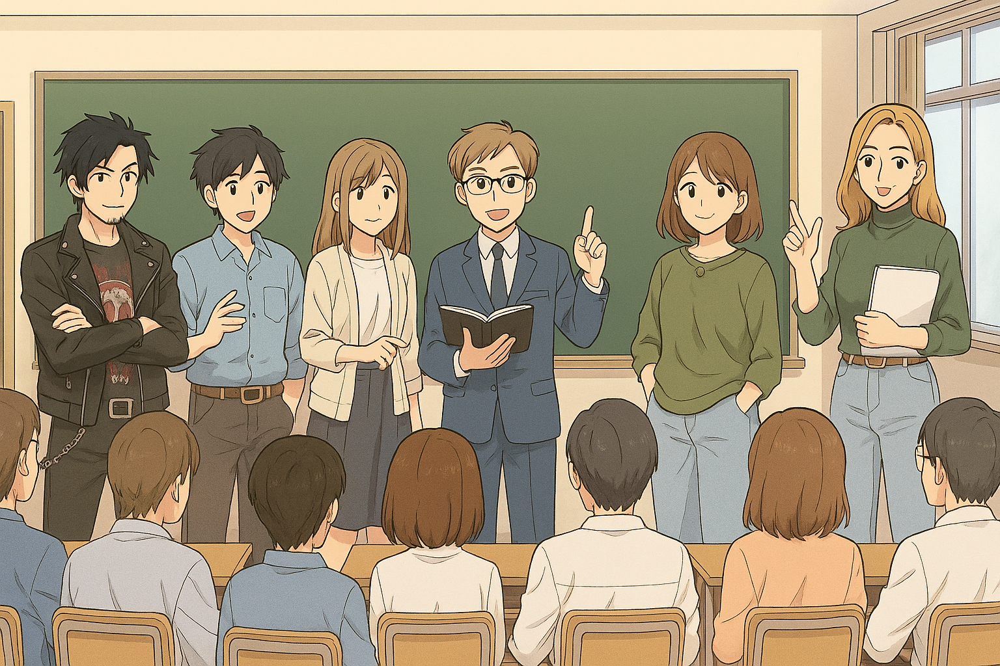{.rounded-4}

### 7.1. Estilos de liderazgo docente  

> [!note] Definición:  
>
> 📢Los **estilos didácticos** se refieren a cómo cada docente o teletutor imparte una acción formativa. Las formas, modos, cualidades y peculiaridades que tiene cada uno conforman su **estilo didáctico**.  
>
> Podemos entender que hay tantos estilos como docentes o teletutores.

**📌Estilos de liderazgo docente**

| **Estilo**        | **Descripción**                                              |
| ----------------- | ------------------------------------------------------------ |
| **Autocrático**   | El docente **decide por sí solo** todas las actividades a realizar, organiza y distribuye las tareas. Mantiene una **actitud distante** con el grupo y enfatiza la **evaluación individualizada**. |
| **Democrático**   | El docente **planifica junto al grupo**, fomenta la **discusión y la participación**, y **comparte la toma de decisiones**. Desarrolla su intervención en el aula como **un miembro más del grupo**. |
| **Laissez-faire** | El docente **se mantiene al margen**, dejando la iniciativa a los alumnos y alumnas. Solo interviene cuando se requiere su opinión o consejo. |

> [!tip]  
> En la práctica docente, el **liderazgo democrático** suele generar **mayor motivación y compromiso** en el alumnado, aunque en algunos contextos de FPE puede combinarse con elementos del liderazgo técnico para asegurar el cumplimiento de objetivos.

---

### 7.2. Estilos docentes en FPE  

El docente de **Formación Profesional para el Empleo (FPE)** incrementa su eficacia en la medida en que **domina diferentes estilos de enseñanza** y los **combina de forma flexible** según los objetivos, características del alumnado, recursos disponibles y condiciones de la acción formativa.

**📌Estilos docentes en FPE**

| **Estilo**   | **Descripción**                                              |
| ------------ | ------------------------------------------------------------ |
| **Técnico**  | No existe una preocupación por el sentido y valor de la formación. El formador **se limita a transmitir contenidos**, **reproduce modelos tradicionales** y **resiste los cambios**. Cumple el programa de forma rígida y se centra en la **disciplina y el adiestramiento funcional**. |
| **Práctico** | Es un docente **reflexivo y flexible**, que busca el **por qué y para qué** de su enseñanza. Favorece que los alumnos **aprendan a aprender**, empleando **métodos variados e innovadores**. Se le critica cierta falta de rigor conceptual, pero destaca en la **adaptación pedagógica**. |
| **Crítico**  | Considera la educación como **una herramienta de transformación social**. Su enseñanza es **participativa, democrática y comprometida con el desarrollo humano**. Son docentes **altamente implicados**, aunque pueden **frustrarse** por la falta de contextos que apoyen su visión reformadora. |

> [!tip]  
> En la FPE, **combinar rasgos de los tres estilos** permite al docente adaptarse a las necesidades del grupo: la organización del estilo técnico, la flexibilidad del práctico y la implicación social del crítico.

---

## 8. La sesión formativa  

{.rounded-4}

> *"No hemos reparado en gastos."*  
> — John Hammond (1993)

### 8.1. Aspectos generales  

Una vez que el profesorado ha elaborado el **programa del curso o módulo**, deberá planificar su **actuación docente directa** con el grupo-clase.  

Es necesario **seleccionar los objetivos, contenidos, metodología, recursos, materiales, temporalización y evaluación**, reflejándolo en una **ficha de planificación**.  

🎯 La planificación de la actuación docente tiene los siguientes objetivos principales:  

- 💡 Promover los **aprendizajes** de los participantes.  
- ⏱️ **Maximizar el uso del tiempo** disponible.  
- 🧰 Definir con claridad las **estrategias metodológicas** y los **recursos necesarios**.  
- 📊 **Valorar los conocimientos y habilidades** alcanzadas por el alumnado.  

---

### 8.2. Organización de una sesión formativa  

La **sesión formativa** se estructura en **tres partes principales**: *introducción, desarrollo y conclusión*.  
En cada una de ellas, el docente debe combinar **técnicas que capten la atención** con **habilidades que estimulen el pensamiento y la participación**.

#### 🪄 Introducción  

- 📋 **Presentación** de los aspectos que se van a tratar.  
- 🔁 **Recapitulación** del día anterior para situar al grupo en el contexto del contenido.  
- 🎯 **Presentación del objetivo** de la clase, destacando su relación con el perfil profesional del alumnado.  

> [!tip]
> Si es la **primera sesión** del curso, aprovecha para presentar la **programación general**, explicar el **proceso de evaluación** y resolver las primeras dudas.

#### ⚙️ Desarrollo  

- 🧠 **Exposición de los contenidos** y realización de actividades.  
- 💬 **Control de la comprensión**, atendiendo a la interacción y las respuestas de los participantes.  
- 🔄 **Recapitulaciones parciales**, resumiendo las ideas clave para favorecer la retención.

> [!warning]
>
> A continuación profundizaremos más en esta parte concreta.

> [!tip]
> Alternar momentos expositivos con dinámicas o preguntas abiertas ayuda a mantener la atención del grupo.

#### 🧩 Conclusión  

- 🪞 **Síntesis final** de lo trabajado, destacando las ideas principales.  
- 👥 Propuesta de que un alumno o alumna realice la **recapitulación global** del día.  
- 🚀 **Presentación de la próxima clase**, aportando una motivación extra o conexión con el siguiente contenido.  

> [!important]
> Cerrar cada sesión con una **visión de conjunto** ayuda al alumnado a consolidar lo aprendido y anticipar la siguiente etapa del curso.

---

A continuación profundizaremos en el **desarrollo de una sesión formativa**:

1. 🎤 **Presentación**  
   Introducción sobre los aspectos que vamos a tratar.  
   Si es el primer día del curso, presentamos la **programación general** del mismo, explicando el **proceso de evaluación** que se va a llevar a cabo.

2. 🔁 **Recapitulación del día anterior**  
   Con el objeto de situar al grupo participante de nuevo en el **contexto del contenido** que se va a trabajar.

3. 🎯 **Presentación del objetivo**  
   Comunicamos el **propósito de la sesión**, poniendo énfasis en la **relación con el perfil profesional** en el que se preparan los participantes.

4. 📚 **Desarrollo de la clase**  
   Debemos considerar dos aspectos principales:  
   - 🧠 El **control de la comprensión**, atendiendo a la información que los participantes nos proporcionan a través de su interacción o en las respuestas a preguntas.  
   - 💡 La **recapitulación parcial**, aprovechando para ir **resumiendo y repitiendo** las ideas clave que se van trabajando, para **estimular el recuerdo**.

5. 🧾 **Recapitulación total**  
   Toda sesión formativa debe finalizar con una **síntesis o conclusión** de lo trabajado.  
   Podemos iniciarla nosotros mismos o sugerir que la realice alguno de los miembros del grupo.

6. 🚀 **Presentación de la clase del día siguiente**  
   Al finalizar una sesión, y según sea el clima de trabajo, podemos **introducir la siguiente**, aportando una **motivación extra** al grupo.

---

### 8.3. La exposición didáctica: requisitos y características

#### 8.3.1. Requisitos y características

En el desarrollo de la **sesión formativa** se tendrá en cuenta la **exposición oral** y la **estructura de la sesión**.  
Una sesión formativa gira en torno a tres partes: **introducción**, **desarrollo** y **conclusión**.  
En ella, el docente deberá combinar **técnicas que capten la atención** con **habilidades que estimulen el pensamiento y la discusión**.

Al preparar nuestra intervención debemos considerar aspectos relacionados con nuestra **personalidad, experiencias y conocimientos**, además de factores como el **tipo de contenido**, el **tiempo disponible** o la **ubicación física**.

📌 **Recursos que podemos utilizar para facilitar la exposición:**

- 🎤 **Variar el tono e intensidad de la voz**: más alto al inicio y más bajo durante el desarrollo.  
- 👀 **Establecer “recorridos” con la mirada** hacia todos los participantes.  
- 💬 **Usar anécdotas y ejemplos** a lo largo de la exposición.  
- 🚶 **Moverse de forma pausada** por el aula para mantener la atención.  
- 🧍‍♂️ **Hablar de pie**, con una **postura erguida y segura**, transmitiendo confianza.

---

#### 8.3.2. Errores del profesorado

> [!caution]
>
> Habitualmente el profesorado puede cometer errores que están relacionados con:
>
> - ⚙️ **Uso inadecuado de recursos didácticos.**  
> - 🧩 **Empleo de lenguaje técnico sin previa explicación.**  
> - ❌ **Ofrecer ejemplos no relacionados con el contenido.**  
> - 📖 **Leer la exposición sin interactuar con el alumnado.**  
> - 🎤 **Falta de entonación o uso inadecuado del ritmo, velocidad o volumen de voz.**  
> - 🙃 **Gestos distractores o movimientos pendulares** (vaivén corporal constante e inconsciente, que suele revelar nerviosismo).  
> - 👀 **No mantener el contacto visual con el grupo.**
>

Para evitar estos errores es imprescindible realizar una **planificación adecuada de la exposición**, que cumpla los siguientes requisitos:

- 🧭 **Estructurar los contenidos** teniendo en cuenta los destinatarios, el contexto y los objetivos.  
- 🗣️ **Cuidar la expresión oral y no verbal**: tono de voz, ritmo, claridad, pausas, gestos y postura.  
- 💡 **Fomentar la motivación** y mantener la atención constante para lograr un aprendizaje comprensivo y significativo.  
- 🪑 **Cuidar el entorno físico del aula**: temperatura, visibilidad, iluminación, etc., ya que influyen en la atención y motivación del alumnado.  
- 🧰 **Usar recursos variados** que hagan el proceso de enseñanza–aprendizaje más didáctico y significativo.

📌 **Etapas de la exposición:**

1. **Planificación:** detectar las necesidades e intereses del alumnado.  
2. **Exposición de contenidos:** mantener la atención del grupo durante el desarrollo.  
3. **Comprobación del aprendizaje:** valorar si el alumnado ha interiorizado y comprendido los contenidos.

---

### 8.4. Preparación y desarrollo de una sesión formativa

> [!important]
> La **exposición didáctica** es una importante forma de **comunicar y transmitir información**, por lo que el docente debe **prepararla y ensayarla**.  
> Es recomendable **alternar la exposición con otras técnicas didácticas**, introduciendo pausas, preguntas o pequeñas actividades que mantengan la atención y favorezcan la comprensión.

Para que la **comunicación oral** sea efectiva, podemos tener en cuenta distintas etapas:

  

**🧩 Analizar la situación**

1. 🎯 **Delimitar el objetivo de la exposición.**  
2. 👥 **Identificar al grupo participante:** conocimientos, actitudes, número, nivel, etc.  
3. 🏫 **Establecer el lugar, el tiempo disponible y el momento adecuado** para la comunicación.  

  

**🗂️ Preparar el contenido de la exposición**

1. 💭 **Pensar antes de hablar.**  
2. 🧩 **Ordenar las ideas.**  
3. 🧱 **Estructurar la exposición.**  
4. 🪄 **Preparar el material de apoyo:** presentaciones, carteles, fotocopias, etc.  

  

**🎤 Desarrollo de la exposición**

1. 🗣️ **Adaptar el contenido y el vocabulario.**  
2. ✂️ **Utilizar preferentemente frases cortas.**  
3. 🔊 **Cuidar la entonación, pronunciación y volumen** de la voz.  
4. 🌟 **Captar el interés** con una exposición atractiva y participativa.  

---

> [!tip]
> Una técnica sencilla para resolver problemas durante la sesión es aplicar la máxima:  
> **“Si lo que estás haciendo no funciona, prueba lo contrario.”**
>
> **Ejemplos:**
>
> - Si una **sesión plenaria** no funciona, divídela en **pequeños grupos**.
> - Si un **ejercicio práctico** no funciona, cambia a una **demostración**.  
> - Si una **sesión de reflexión** no funciona, realiza una **actividad práctica**.  
> - Si el **ejemplo del facilitador** no es apropiado, pide **ejemplos al alumnado**.

> [!tip]
> Otra forma de planificar contingencias es disponer de **actividades o ejercicios de apoyo** para reaccionar ante imprevistos del grupo o del entorno.
>
> **Ejemplos:**
>
> - Si los participantes **pierden interés**, divídelos en grupos y pídeles que **apliquen el material a situaciones reales**.  
> - Si **no sabes cómo continuar**, anuncia un **breve descanso** para ganar tiempo.  
> - Si la sesión **no funciona**, pasa a la **siguiente parte del programa**.  
> - Si **te quedas sin material**, puedes **finalizar antes** o realizar una **actividad de resumen o evaluación**.  
> - Si el grupo **se fragmenta**, reúne a los participantes y recuérdales el **propósito de trabajar juntos**.

---

### 8.5. Planificación

> [!warning]
> En toda **sesión formativa**, se estima que aproximadamente un **10 % del tiempo total no se utiliza de forma efectiva**, al destinarse a **actividades preparatorias, saludos, diálogos espontáneos o ajustes técnicos**.  
> El resto del tiempo debe **distribuirse proporcionalmente** según la **importancia de los contenidos y las actividades** previstas.

  

**🟣 Plantilla para la planificación de la sesión formativa**

| **Elemento**                   | **Descripción**                                              |
| ------------------------------ | ------------------------------------------------------------ |
| 🎯 **Objetivos**                | Objetivos específicos de aprendizaje de la sesión: **cognoscitivos**, **procedimentales** y **actitudinales**. |
| 📘 **Contenidos y actividades** | Epígrafes o temas que se van a trabajar y **actividades identificativas** asociadas. |
| 🧭 **Metodología**              | Organización de la sesión: **exposición teórica**, **actividades individuales o grupales**, **técnicas participativas**, etc. |
| 🧰 **Recursos**                 | Recursos que se utilizarán, tanto **tradicionales** como **TIC**, y su función durante la sesión. |
| ⏱️ **Tiempo previsto**          | Distribución temporal asignada a cada contenido o actividad planificada. |
| 🗒️ **Observaciones**            | Posibles **cambios por imprevistos** o **contenidos pendientes** que deban retomarse. |

  

**🟣 Criterios para la selección de recursos materiales**

- ✅ **Seleccionar los recursos** según el **objetivo propuesto** y basándose en **criterios técnicos y pedagógicos**.  
- 🗓️ **Organizar y disponer los recursos** en el **momento y lugar adecuados** a su finalidad, evitando su uso excesivo.  
- 💡 **Favorecer la iniciativa y creatividad** del alumnado mediante recursos que estimulen su participación activa.

---

### 8.6. Utilización de los materiales, medios y recursos

Habitualmente utilizamos los términos **materiales**, **medios** y **recursos** como sinónimos, pero realmente tienen ciertos matices que debemos conocer antes de desarrollar el tema.  
Existen numerosas definiciones sobre estos términos, y de hecho, los autores **no se ponen de acuerdo en una definición concreta**.  
Un caso claro es el concepto de *medio*: según la época o tendencia educativa, se le han añadido diferentes adjetivos para precisar su uso —*medios audiovisuales*, *medios de comunicación*, *medios didácticos*, etc.—.

Desde el **paradigma constructivista**, los medios didácticos se entienden como el **instrumento que ayuda al docente** en su labor para que los estudiantes **construyan su propio conocimiento**.

En el caso del término **materiales**, podemos entenderlos como los **productos diseñados** que nos ayudan en el proceso de enseñanza–aprendizaje.  

> [!note] Definición
> **📢(San Martín, 1991)**  
> Aquellos artefactos que, en unos casos utilizando las diferentes formas de representación simbólica y en otros como referentes directos (objetos), incorporados en estrategias de enseñanza, coadyuvan a la reconstrucción del conocimiento, aportando significaciones parciales a los conceptos.

El término **recurso** se entiende como el **uso de todo tipo de materiales didácticos**.  

> [!note] Definición
> **📢 (Mattos, 1963)**  
> Los recursos didácticos son los medios materiales de que se dispone para conducir el aprendizaje de los alumnos/as.

> [!tip]
> Si leemos con atención, sí existe una diferencia entre los términos:  
> El término **“recurso”** es el más amplio, ya que **engloba** a los conceptos de **medio** y **material didáctico**.  
> El recurso implica una **forma de actuar**, ya que supone **decidir sobre las estrategias** a emplear en el proceso de enseñanza–aprendizaje.

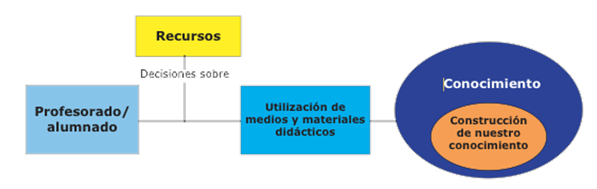{.rounded-4}

> 📸Ilustración que representa gráficamente la relación entre “materiales”, “medios” y “recursos” según Moreno Herrero (2005).

La **utilización y uso de los medios** dependerá de los **paradigmas y modelos educativos** que subyacen en el proceso de enseñanza–aprendizaje.  
En función del **perfil del docente**, se hará un uso u otro de los medios, adaptándolos al contexto y a los objetivos de la formación.

> [!note]
> **Diferencia entre material, medio y recurso (explicado de forma más simple):**  
>
> - 🧱 **Material** → Es el **objeto físico o digital** que se usa en la enseñanza.  
>   Ejemplo: un libro, una presentación, un vídeo o una maqueta.  
>   Son los “instrumentos” que utilizamos.
>
> - 📡 **Medio** → Es el **canal o sistema** que usamos para transmitir el contenido con ese material.  
>   Ejemplo: la pizarra, el proyector, Internet, una plataforma online o una videollamada.  
>   Es *cómo* llega la información al alumnado.
>
> - 🧩 **Recurso** → Es el **conjunto de todo lo anterior**, más la **forma en que lo usamos** para enseñar.  
>   Ejemplo: usar un vídeo (material) en una plataforma online (medio) dentro de una actividad de debate (recurso).  
>   Es la **estrategia completa** que combina materiales y medios para lograr un objetivo de aprendizaje.
>
> 👉 En resumen:  
> **Material** = lo que usamos  
> **Medio** = por dónde lo transmitimos  
> **Recurso** = cómo lo usamos para enseñar

---

### 8.7. Modelos educativos

Existen muchos modelos educativos, pero para comprender el tema que nos ocupa los sintetizaremos en **tres paradigmas**: el **tradicional o técnico**, el **práctico** y el **crítico**.

- 🏫 **Modelo tradicional:**  
  Este modelo busca la **repetición y transmisión de los conocimientos**.  
  Se centra en los **conceptos**. El docente **transmite** y el estudiante **repite y memoriza**.

- 🔨 **Paradigma práctico:**  
  El paradigma práctico busca que el alumnado **ponga en práctica los conocimientos**, los **entienda en su contexto** y amplíe los contenidos desarrollando **habilidades y destrezas**.  
  El estudiante tiene un **papel activo** en el proceso de enseñanza–aprendizaje y el docente **guía** el proceso.

- 💡 **Modelo crítico:**  
  El modelo crítico busca que el alumno/a **construya su aprendizaje de manera reflexiva y analítica**.  
  El conocimiento **no sólo lo transmite el docente**, sino que puede buscarse y encontrarse en **múltiples fuentes**, todas ellas contribuyendo al mapa mental del estudiante.

En función del **modelo pedagógico** que utilicemos en el aula, así **variará la forma en que aplicamos los recursos didácticos**.

La siguiente tabla, adaptada de **Moreno Herrero, Isidro (2005)**, sintetiza el **uso de los medios** en función de los **paradigmas educativos**:

| **Aspecto**           | **Tradicional**                                              | **Práctico**                                                 | **Crítico**                                                  |
| --------------------- | ------------------------------------------------------------ | ------------------------------------------------------------ | ------------------------------------------------------------ |
| **Sobre el uso**      | Reproductor.                                                 | Interpretativo.                                              | Crítico.                                                     |
| **Sobre la práctica** | Papel reproductor y ejecutor de las orientaciones que llegan diseñadas. | Diseños abiertos que tienen en cuenta la realidad. Reflexión sobre la práctica. | Utilización de los medios como elementos de análisis y reflexión sobre la práctica. |
| **Sobre los fines**   | Logro de objetivos de conducta.                              | Importancia de los procesos.                                 | Cauces para modificar códigos y eliminar diferencias sociales y culturales. |
| **Sobre la realidad** | Escasa adecuación.                                           | Análisis de la realidad para dar significado a las situaciones. | Análisis crítico para transformar la realidad.               |

---

### 8.8. Funciones de los medios o recursos didácticos

Los **materiales didácticos** sirven de apoyo a la formación, por lo que responden a **qué queremos enseñar**, aportan **explicaciones claras y sencillas**, ofrecen un **aspecto atractivo para el alumno** y propician la **interacción** con él.  
La prioridad del docente es **crear y utilizar recursos que aporten significatividad al aprendizaje**.

Las principales funciones de los medios o recursos didácticos son:

- 🎯 **Función motivadora:**  
  Cuanto más atractiva y novedosa sea la herramienta, **más atención y curiosidad despierta** en el alumnado.

- 🌍 **Función de acercamiento a la realidad:**  
  Los medios facilitan la **conexión con la realidad inaccesible**, ayudando a comprender o visualizar fenómenos que no pueden observarse directamente.

- 💡 **Función innovadora:**  
  La incorporación de medios didácticos supone una **renovación de las estrategias docentes**, promoviendo nuevas formas de enseñar y aprender.

- 🧭 **Función organizadora de las acciones formativas:**  
  Los medios **ilustran la información, aclaran contenidos** y ayudan a **estructurar mejor las sesiones** formativas.

- 📘 **Función formativa global:**  
  Permiten **completar la formación** del alumnado o proporcionar una **síntesis visual o conceptual** de los contenidos.

- 🤝 **Función democratizadora de la formación:**  
  Facilitan el **acceso a la educación a un mayor número de personas**, gracias al uso de herramientas como **CDs, plataformas de aprendizaje virtual o recursos digitales en línea**.

---

### 8.9. Criterios de selección y usos

La **selección de los materiales** debe atender siempre a **criterios didácticos** y tener en cuenta las **funcionalidades de cada medio**.  

Según **Moreno Herrero (1996)**, desde el punto de vista de la utilización didáctica de los medios, éstos deben reunir los siguientes **criterios de funcionalidad**:

- 🧰 **Deben ser una herramienta de apoyo y ayuda para el aprendizaje:**  
  - Deben ser **útiles y funcionales**.  
  - Nunca deben **sustituir al profesorado** en su tarea de enseñar, ni al alumnado en su tarea de aprender.

- ⚖️ **Su utilización y selección deben responder al principio de racionalidad:**  
  - Se deben establecer **criterios de selección** claros.  
  - Desde una **perspectiva crítica**, estos criterios deben **construirse de manera conjunta** entre todas las personas implicadas en el proceso de aprendizaje.

Las **posibilidades didácticas** que ofrecen los medios, según **Moreno Herrero (2005)**, giran en torno a **tres ejes principales**:

- 🎯 **Los medios como instrumento y recurso:**  
  Se utilizan como una **estrategia metodológica**. Son una **herramienta clave** para la construcción del aprendizaje del alumnado.  
  
- 💬 **Los medios como recurso de expresión y comunicación:**  
  Fomentan distintas **formas de expresión** (oral, escrita, plástica, musical, dramática) fruto del **análisis y reflexión** sobre los contenidos.  
  
- 🧠 **Los medios como herramienta de análisis crítico de la información:**  
  Pretenden desarrollar en el alumnado **actitudes críticas y habilidades de interpretación** frente a la información recibida (análisis de programas de medios de comunicación, internet, redes sociales, visitas a periódicos o emisoras.)

La siguiente tabla **hace un resumen de los medios usados** para conseguir cada una de estas **funciones didácticas**:

| **Usos**                                              | **Incidencia en el proceso educativo**                       | **Tipo de material y medios**                                |
| ----------------------------------------------------- | ------------------------------------------------------------ | ------------------------------------------------------------ |
| **Como instrumento y recurso**                        | • Recurso para presentación de temas, actividades de motivación, síntesis y aplicación.   • Desarrollo de actitudes y hábitos de escucha en distintas situaciones comunicativas.   • Instrumento de evaluación y autoevaluación. | • Noticias, prensa, libros y poemas.   • Visitas y excursiones.   • Retroproyector, proyector de diapositivas, cámaras digitales, ordenador.   • Fotografías, películas, presentaciones, grabaciones de audio, internet. |
| **Como recursos para la expresión y la comunicación** | • Desarrollo de contenidos, procedimientos de expresión y comunicación.   • Actividades de expresión oral, plástica, escrita, musical y dramática.   • Desarrollo de imaginación y capacidad creadora.   • Elaboración de informaciones y noticias. | • Todos los del apartado anterior.   • Desarrollo de información variada sobre temas como ecología, consumo, libertades o deporte.   • Creación de poemas, canciones, obras de teatro, programas de radio y vídeos. |
| **Como análisis crítico de la información**           | • Desarrollo de mecanismos de representación simbólica y utilización de otros códigos.   • Desarrollo de capacidad de decodificación y análisis de la información.   • Conocimiento de los medios y sus lenguajes específicos.   • Conocimiento de procesos de elaboración de la información.   • Elaboración de instrumentos propios de análisis. | • Todos los anteriores.   • Análisis de contenidos de programas de comunicación.   • Realización de encuestas y reportajes.   • Visitas a periódicos y emisoras. |

En el momento de **planificar una sesión formativa**, debemos tener en cuenta que:

1. ✅ Los recursos deben **seleccionarse según los objetivos propuestos**, atendiendo a criterios **técnicos y pedagógicos**.  
2. 🗓️ Es necesario **organizar y disponer los recursos** en el momento y lugar adecuados, evitando su **uso excesivo o innecesario**.  
3. 💡 Se recomienda emplear recursos que **fomenten la iniciativa y la creatividad** del alumnado.  
4. 🏫 Si es la **primera sesión**, debemos conocer previamente los recursos y la **disposición física del aula**, comprobando:  
  - La distribución de mesas y sillas.  
  - La existencia de equipamiento como **pizarra, rotafolios, retroproyector u ordenador**.

---

## 9. La simulación docente

### 9.1. Conceptos

La **simulación** es la posibilidad de **aprender actuando en situaciones similares a las reales**. Permite la **individualización de la enseñanza**, fomenta la **creatividad**, la **autoevaluación** y un **ahorro de tiempo y recursos** en disciplinas donde la práctica real sería muy costosa.

**La simulación del docente:**
- 🎭Es el **proceso de evaluación** que permite a la persona observarse en acción y **tomar conciencia de sus puntos fuertes y débiles**, con la finalidad de aceptarse y mejorar.
- 🧩 Como **estrategia**, se organiza para que los participantes **aprendan participando** en una **situación similar a la real**.
- 🔍Tras la experiencia, se **analiza** cómo resultó, las **dificultades afrontadas** y las **que se vencieron**.

Veamos 3 posibles **definiciones de simulación**:

> [!note] Definición:
>
> 📢 **Thornton y Cleveland (1990):** Modelo o representación de los acontecimientos del mundo real en el que los elementos se han representado mediante **símbolos, números** o en **forma física**.

> [!note] Definición:
>
> 📢 **Rico (1991):** Recurso de aprendizaje empleado para **estimular la participación** del alumno, **acercar** el conocimiento a la **vida real** y **aplicarlo** a situaciones cotidianas.

> [!note] Definición:
>
> 📢 **Rico (1991):** Técnica científica consistente en **proponer un modelo matemático** de un fenómeno y, con la ayuda de un **ordenador u otra herramienta**, **reproducir y observar** su comportamiento **manipulando** las variables relevantes.

---

### 9.2. Características, fases y objetivos

La **simulación docente** se define por una serie de características que le otorgan valor pedagógico y permiten conectar la teoría con la práctica profesional.

**Características básicas de la simulación:**
- 👁️ **Observación del mundo real.**  
- 🧱 **Representación física o simbólica** de la realidad.  
- 🎭 **Acción** sobre dicha representación.  
- 🧠 **Efectos de esta acción** sobre el aprendizaje humano.  

**Fases del desarrollo de la simulación docente:**
1. 📋 **Información previa** sobre las habilidades que se van a trabajar.  
2. 🎥 **Ejecución de la docencia** y grabación en vídeo.  
3. 💬 **Realimentación o feedback**, guiada por el formador y el grupo de compañeros/as.  
4. 🔁 **Nuevo ensayo**, aplicando las propuestas de mejora.

**Beneficios:**
- Para el **docente**, facilita una sesión más **significativa y atractiva**, identifica habilidades y reproduce experiencias reales.  
- Para el **alumnado**, permite **aprender haciendo**, **auto-evaluarse** y **aplicar** lo aprendido en nuevas situaciones.

**Objetivos de la simulación docente:**
- 💪 Transmitir **seguridad**.  
- 🌱 Reforzar **actitudes positivas** hacia la práctica docente.  
- 🗣️ Estimular la **crítica constructiva**.  
- 💡 Fomentar la **reflexión** y el **cambio de modelos de pensamiento**.  
- 🌟 Reforzar los **aspectos positivos**.  
- 🔍 Permitir el **descubrimiento de nuevos comportamientos**.  
- 💾 Facilitar que los conocimientos y conductas sean **almacenables y reproducibles**.

> [!important]
> Cuando la simulación pone de manifiesto **habilidades que deben mejorarse**, puede recurrirse a la **microenseñanza** como técnica complementaria.
>
> > La **microenseñanza** es una **técnica de formación docente** que consiste en **practicar una pequeña parte de una clase o sesión formativa**, normalmente de **muy corta duración (5–15 minutos)**, **ante un grupo reducido** de compañeros o alumnos.
> >
> > Se explica justo ahora.

---

### 9.3. Técnicas de microenseñanza

#### 9.3.1. Introducción

El concepto de **microenseñanza** surgió en la **Universidad de Stanford (1963)** como un método de formación docente que permite **practicar y evaluar habilidades concretas** de enseñanza en un entorno reducido y controlado.  
Gracias al uso del vídeo, el docente puede **observar su propia actuación**, **detectar áreas de mejora** y repetir la experiencia aplicando los cambios necesarios.

**Características principales:**
- 👩‍🏫 El docente imparte durante **un corto periodo de tiempo** una sesión a un **grupo reducido de alumnos**, centrada en **una habilidad específica** (por ejemplo, practicar técnicas de exposición, manejar materiales o demostrar un método).  
- 🎥 La sesión se **graba en vídeo** para su posterior análisis y **retroalimentación**.  
- 🔁 El proceso puede **repetirse tantas veces como se desee**, ajustando los mismos elementos para observar la mejora progresiva.

**Propósitos fundamentales de la microenseñanza:**
- 📚 La microenseñanza **debe considerarse enseñanza real**, aunque sea en formato reducido.  
- 👥 Se **disminuye el tamaño del grupo, el contenido y la duración** de la sesión.  
- 🎯 El objetivo es el **entrenamiento dirigido al logro de fines específicos**.  
- 🧩 Permite **controlar mejor la situación** docente y las variables implicadas.  
- 💬 Facilita un **conocimiento inmediato de los resultados** y una **retroalimentación eficaz y concreta**.

---

#### 9.3.2. Beneficios de la microenseñanza y utilidad  

La **microenseñanza** se apoya en dos líneas fundamentales: la **simplificación de los elementos** y el **aprendizaje escalonado**.  
Se centra en desarrollar habilidades concretas que son esenciales para el desempeño docente, como la **comunicación**, la **técnica interrogativa**, la **presentación de contenidos** o el **control del grupo**.

**🔵Beneficios principales:**  

- 🎯 Es un instrumento que **aumenta la seguridad** del docente y permite **focalizar una habilidad específica** para mejorarla.  
- 🧠 Proporciona **entrenamiento práctico** que contribuye directamente al perfeccionamiento de la enseñanza.  
- 💡 Ofrece una **retroalimentación útil y orientada a la mejora continua** del desempeño docente.  

**🔵Utilidad de la microenseñanza:**  

- 🗣️ Para el **desarrollo de habilidades comunicativas**.  
- 🧩 Para la **organización coherente de la información**.  
- 👀 Para el **manejo de los estímulos** que mantienen la atención del alumnado.  
- 🖥️ Para el **uso correcto de los recursos y medios didácticos**.  
- ❓ Para la **mejora en la formulación de preguntas**.  
- 💬 Para mantener la **coherencia entre comunicación verbal y no verbal**, empleando refuerzos adecuados.  
- 👥 Para **mantener el control del grupo** durante la sesión.  

> [!important]
> Las habilidades centrales de la microenseñanza en la formación docente se agrupan en **tres categorías clave**:  
> **1. Comunicación en el aula**  
> **2. Utilización de recursos didácticos**  
> **3. Atención a la diversidad del grupo**

**🔵Comunicación en el aula:**  

- 💬 *Dimensión verbal:* vocalización, dicción, modulación, uso del vocabulario adecuado y coherencia en la exposición.  
- 🤝 *Dimensión no verbal:* desplazamientos, expresión corporal y postura.  

**🔵Apoyo de recursos didácticos:**  

- 📋 Uso adecuado de **recursos tradicionales** (pizarra, rotafolios…).  
- 💻 Empleo de **tecnologías** (vídeo, proyector, etc.).  
- 📄 Uso de **materiales didácticos complementarios** (carteles, fotocopias, folletos…).  

**🔵Diversidad del grupo de participantes:**  

- 🎯 Aplicar **estrategias variadas** para captar la atención.  
- 🧠 Seleccionar y organizar los recursos según las necesidades del grupo.  
- 🗓️ Planificar actividades que respeten la **diversidad de ritmos y estilos de aprendizaje**.  

> [!note]
> 🎥 En el siguiente vídeo se ofrece una **explicación visual y clara sobre la microenseñanza**:  
> [Ver vídeo en YouTube](https://www.youtube.com/embed/dLXb-xS1xGo)
>
> 

> <iframe width="560" height="315" src="https://www.youtube.com/embed/dLXb-xS1xGo" title="Microenseñanza - explicación sencilla" frameborder="0" allow="accelerometer; encrypted-media; gyroscope; picture-in-picture;" referrerpolicy="strict-origin-when-cross-origin" allowfullscreen></iframe>    
> 

---

### 9.4. Realización y valoración de microenseñanza 

> [!warning] 
>
> En el temario original, el título es Realización y valoración de simulaciones, pero habla claramente de Microenseñanza, lo cual es incongruente. Lo dejamos así que tiene más sentido.

> [!important]
> La **microenseñanza** permite **reducir la complejidad del proceso formativo** a un conjunto de **habilidades concretas**, disminuyendo el **tiempo necesario para el aprendizaje** y fomentando una **experiencia activa** basada en la **observación**, la **práctica** y la **reflexión**.

🟠**Procedimiento de aplicación:**
- 📝 **Preparación:** elaborar un **breve contenido informativo** relacionado con la especialidad profesional.  
- 🎯 **Foco:** concentrarse en **una habilidad específica** que se desea mejorar o evaluar.  
- 👥 **Tamaño del grupo:** mantener un **grupo reducido**, que después ofrecerá **retroalimentación** al docente en formación.  
- ⏱️ **Duración:** entre **10 y 15 minutos**.  
- 🧑‍🏫 **Desarrollo de la microlección:** emplear los **recursos necesarios** y tratar al grupo como si fuera **real**, aplicando técnicas docentes auténticas.  
- 🔁 **Realimentación final:** proporcionada por el **docente experto** y los **compañeros/as**, fomentando la **reflexión conjunta** y la **mejora progresiva**.  

Durante la devolución, el alumnado realiza **autocrítica**, complementada con la **retroalimentación grupal**.  
Es fundamental **reconocer los puntos fuertes** —como la creatividad, la claridad, la gestión del grupo o la inclusión del alumnado— y **ofrecer sugerencias constructivas** para los aspectos a mejorar.

🟠**Instrumentos de valoración en la microenseñanza:**

1.  🔍 El uso de **técnicas e instrumentos de medida**, como la **observación**, es **indispensable** para realizar actividades de microenseñanza.  
2. En la **valoración del desempeño docente** se pueden emplear distintos instrumentos:  
   1.  🎥 **Observación directa** mediante **grabación en vídeo**, que permite analizar la actuación y detectar áreas de mejora.  
   2. 🗒️ **Registros descriptivos**, **cuestionarios** o **encuestas**, para recoger valoraciones cualitativas.  
   3. 📊 **Escalas de evaluación** o **rúbricas**, que facilitan una valoración **objetiva y estructurada** de las habilidades docentes.  

---

## 10. Utilización del aula virtual

### 10.1. Aspectos generales

Las **aulas virtuales** son espacios educativos donde docentes y alumnado pueden **desarrollar actividades académicas**, **acceder a materiales**, **realizar ejercicios**, **participar en debates** y **gestionar evaluaciones**, entre otras acciones.

> [!note] Definición:
>
> 📢El **aula virtual** es una **aplicación web** (software libre, comercial o institucional) accesible desde el navegador que permite **crear actividades en línea**, **realizar evaluaciones** y **ofrecer recursos** de apoyo a las clases.

Las plataformas de e-learning suelen incluir estas funcionalidades:
- 💬 **Herramientas de comunicación y colaboración (chat, foros).**
- 📚 **Visualización de contenidos** tanto *online* como *offline*. 
- 📊 **Seguimiento y evaluación** del aprendizaje.

> [!tip] Ejemplo
>
> 
>
> **Moodle** es una plataforma de aprendizaje en línea muy extendida. Más información: https://moodle.org/

> [!note] Definición:
>
> 📢El **e-learning** es **enseñanza a distancia** con **separación física** entre profesorado y alumnado (puede incluir encuentros puntuales), basada en **comunicación bidireccional, preferentemente asíncrona**, utilizando **Internet** para comunicar y distribuir el conocimiento. El **alumno/a** es el **centro** del aprendizaje y **gestiona su progreso** con el apoyo de **tutores**.
>
> — Germán Ruipérez (2003)

---

### 10.2. Características  

Según **Germán Ruipérez (2003)**, la formación **e-learning** presenta las siguientes características principales:

- 💻 **Separación física entre docente y alumnado:**  
  Docentes y estudiantes pueden encontrarse en lugares geográficos distintos.  
  El **nexo de unión** entre ambos es la **plataforma virtual**.

- 🌐 **Soportes tecnológicos para asegurar la comunicación e información:**  
  La teleformación se apoya en **plataformas tecnológicas** que permiten **visualizar contenidos web**, **organizar el estudio** y **comunicarse** con el profesorado y otros alumnos/as.

- 🔄 **Comunicación bidireccional:**  
  La interacción se realiza mediante **correo interno**, **foros** y **chats**, que permiten comunicarse tanto **entre el alumnado** como **con el docente**, ya sea de forma **síncrona** (chat) o **asíncrona** (foros, correo interno).

- 🎯 **Procesos de enseñanza–aprendizaje individuales y autónomos:**  
  El e-learning fomenta la **autonomía** y la **autorregulación**, permitiendo al alumno/a **decidir cuándo y cómo estudiar**, lo que exige **organización y autodisciplina**.

> [!note]
> En los últimos años, con el desarrollo de la **web 2.0**, el e-learning ha evolucionado rápidamente.  
> En los años 80, con la aparición de los **ordenadores personales**, se inició la **enseñanza asistida por ordenador**, con cursos distribuidos en **CD-ROM**, donde el aprendizaje era asíncrono y la comunicación se realizaba mediante **correo postal o electrónico**.  
>
> La **creación de Internet** marcó una revolución: el uso del **correo electrónico, los foros y los chats** permitió una comunicación más fluida, y la **web 2.0** dio paso a las **plataformas de e-learning**, integrando en un mismo entorno **materiales didácticos**, **canales de comunicación**, **recursos informativos** y **herramientas de coordinación**.

---

### 10.3. Ventajas e inconvenientes del e-learning  

> [!important]
> El **aula virtual** no solo distribuye información: también debe **fomentar la interacción**, **la comunicación**, **la aplicación de conocimientos** y **la evaluación**.  
> Puede utilizarse como **complemento de la clase presencial** o como **plataforma principal** en la formación a distancia.

**Ventajas del aula virtual:**
1. 📅 Facilita la **organización del trabajo** y la **actualización constante** de los contenidos.  
2. 🧩 Ofrece **nuevas posibilidades de acción docente** y de diseño metodológico.  
3. 💬 Es un **elemento eficaz de comunicación directa** y en tiempo real entre docentes y participantes.  
4. 🤝 Permite **interacciones más completas y colaborativas** entre docente y alumnado mediante actividades en grupo.  
5. 📈 Facilita un **seguimiento continuo** del progreso del alumno/a.  
6. 💻 Introduce al participante en el **uso de las nuevas tecnologías**, fundamentales para el mundo laboral actual.  

**Inconvenientes del e-learning (Horton, 2000):**

1. 🕐 La **preparación e impartición** del curso requiere **más tiempo de trabajo**.  
2. 🧠 Exige **mayor esfuerzo del formador/a**, al ofrecer una atención más personalizada.  
3. 📚 Supone **un 40% más de esfuerzo** por parte del alumnado respecto a las clases presenciales.  
4. 🧩 Requiere **competencias tecnológicas** tanto del profesorado como del alumnado.  
5. 😕 Puede generar **sentimientos de soledad, aislamiento o ansiedad** en el alumnado.  
6. 🧾 Precisa un **buen diseño instruccional** para evitar un aprendizaje superficial.  
7. 🌐 Depende de una **conexión rápida y estable a Internet**, lo que puede generar **brecha digital**.

---

### 10.4. Uso de las aulas virtuales  

> [!important]
> El **aula virtual** debe incluir **herramientas que permitan distribuir información**, **intercambiar ideas y experiencias**, **aplicar y experimentar lo aprendido**, **evaluar conocimientos** y garantizar **seguridad y fiabilidad** en el sistema.  
> Además, su diseño debe **facilitar la labor docente** y **favorecer la interacción** entre el alumnado mediante actividades colaborativas.

El aula virtual presenta las siguientes opciones de uso:

**🟡Complemento de la clase presencial:**  

- 📘 Repositorio de materiales: apuntes, documentos complementarios, recursos multimedia.  
- 🗓️ Publicación de información relevante: programas, horarios, noticias del curso.  
- 💡 El aula virtual cumple una función principalmente informativa y de apoyo.  

**🟡Para la formación a distancia:**  

- 🌐 El aula virtual es el **entorno principal de enseñanza y aprendizaje**.  
- 💬 Se convierte en el **espacio donde se produce el intercambio de conocimientos y la comunicación** entre docente y alumnado.  
- 🎥 Los **recursos multimedia y materiales didácticos digitales** adquieren un papel fundamental, ya que **guían el aprendizaje** y sustituyen la presencia física del formador.  

**🟡Para la formación mixta (blended learning):**  

- 💻 El aula virtual actúa como **complemento a la formación presencial**, integrando ambas modalidades.  
- 🧩 Además de servir como repositorio, es un **espacio dinámico** donde se **plantean debates, preguntas, actividades y trabajos colaborativos**.  
- 👩‍🏫 Favorece la **tutorización continua** y la **interacción** entre el docente y el alumnado, prolongando el proceso formativo más allá del aula física.  

**🟡Orientaciones para el uso del aula virtual:**  

- 🧱 **Diseño del aula:**  
  - Herramientas de acceso claras.  
  - Organización de tareas y recursos.  
  - Canales de comunicación bien estructurados.  

- 💬 **Interacción:**  
  - Fomentar intercambios comunicativos **frecuentes, ágiles y variados**.  
  - Proporcionar **retroalimentación constante** entre docente y alumnado.  
  - Facilitar la **interacción directa con la plataforma**.  

- 👩‍🏫 **Papel del docente:**  
  - Aplicar un **enfoque multidisciplinar**.  
  - Mostrar **implicación y constancia** en la tutoría.  
  - **Planificar** las actividades con claridad y seguimiento.  

- 🧠 **Tipos de actividad:**  
  - Incluir **diferentes formatos** (texto, imagen, vídeo…).  
  - Diseñar actividades que promuevan la **argumentación, la reflexión y la iniciativa personal**.  

> [!note]
> 🎬 En el siguiente vídeo se profundiza en el concepto de **educación e-learning**, sus **funcionalidades**, **características** y **ventajas**.
>
> [Ver en Youtube](https://www.youtube.com/watch?v=GCW1LzzdFsU&t)
>
> 

>     <iframe width="560" height="315" src="https://www.youtube.com/embed/GCW1LzzdFsU" title="Educación e-learning" frameborder="0" allowfullscreen></iframe>    
> 

> 

---

# Resumen

La metodología más adecuada en FPE es la **activa y participativa**, una metodología que aprovecha los conocimientos y experiencias de los participantes y en la que el personal docente actúa como guía en la adquisición de nuevos conocimientos, habilidades y actitudes.

A continuación se muestran los principales métodos de enseñanza, los principios metodológicos para conseguir un aprendizaje eficaz y las estrategias metodológicas más utilizadas:

**Métodos de enseñanza**
- Método deductivo.  
- Método inductivo.  
- Método comparativo.  
- Método pasivo.  
- Método activo.  
- Método de especialización.  
- Método individual.  
- Método recíproco.  
- Método de trabajo individual.  
- Método de trabajo grupal.  

**Principios metodológicos**
- Concreción.  
- Reconocimiento.  
- Actividad.  
- Progresión.  
- Repetición y diversidad.  
- Estimulación.  
- Individualización y personalización.  
- Trabajo grupal.  
- Multiplicidad.  

**Estrategias metodológicas**
- La explicación oral o lección magistral.  
- Estudio de casos.  
- Juego de empresa.  
- Proyectos.  
- Simulaciones.  
- Las técnicas de dinamización grupal.  

Las habilidades del docente son las capacidades que permiten al teletutor o docente fomentar un aprendizaje activo y significativo. Al mismo tiempo, el docente debe ser capaz de **motivar al alumnado** y mantener una buena vía de comunicación.  

Los **estilos didácticos** se refieren a cómo cada docente o teletutor imparte una acción formativa. Las formas, modos y peculiaridades de cada uno hacen referencia a un modo o estilo didáctico. Por tanto, podemos entender que hay tantos estilos como docentes.  

Una vez que el profesorado ha realizado el programa del curso o módulo, tendrá que **planificar su actuación docente directa** con el grupo-clase, seleccionando los objetivos, contenidos, metodología, recursos, materiales, temporalización y evaluación correspondiente, siendo conveniente reflejarlo en una ficha.  

**Resumen final**

- El **aprendizaje** es un proceso de construcción en el que participan docentes y estudiantes. Los docentes facilitan la transmisión de conocimientos teóricos, prácticos y actitudinales.  
  En este proceso intervienen varios elementos: **participantes o estudiantes, docentes, métodos, entorno, interacción y contenidos.**

- Tanto en la **enseñanza presencial** como en **e-learning**, el buen funcionamiento del grupo depende de aspectos como el afecto y la estima, metas compartidas, asunción de roles, normas, cohesión grupal, buena comunicación y sentimiento de pertenencia.

- La **metodología activa y participativa** sigue siendo la más adecuada, ya que aprovecha los conocimientos y experiencias del alumnado y convierte al docente en guía del proceso de aprendizaje.

---

# Ejercicios

## Ejercicio 29: Elegir método apropiado

| Nº   | Contexto / Grupo                                             | Método elegido       | Justificación                                                |
| ---- | ------------------------------------------------------------ | -------------------- | ------------------------------------------------------------ |
| 1    | Auxiliares administrativos – “Riesgos laborales en su puesto de trabajo” | 🧭 **Interrogativo**  | El grupo ya se conoce y tiene experiencia; se busca **reflexionar y analizar conjuntamente** los riesgos reales de su entorno laboral. |
| 2    | Comerciales de FAMISA, S.A. – Elaborar un argumentario de venta | 🧭 **Interrogativo**  | Requiere **participación y construcción colectiva** del argumentario; el docente guía mediante preguntas y debate. |
| 3    | Curso de cerámica – Elaborar un jarrón con dos asas iguales  | 🎯 **Demostrativo**   | Se trata de una **tarea práctica y técnica**, donde el docente **muestra** cómo realizar el trabajo y luego los alumnos lo reproducen. |
| 4    | Curso de medio ambiente – Clasificación de residuos urbanos  | 🧭 **Interrogativo**  | El tema puede abordarse mediante **preguntas guiadas** que lleven a los alumnos a definir y clasificar conceptos. |
| 5    | Grupo sin conocimientos previos – Clase de 45 minutos        | 📘 **Expositivo**     | Dado que el alumnado **no tiene base previa**, se requiere **explicación directa** y estructurada por parte del docente. |
| 6    | Curso de informática – PowerPoint (nivel inicial, grupo experimentado en Office) | 🔍 **Descubrimiento** | Los alumnos tienen experiencia digital; pueden **explorar y descubrir funciones** guiados por retos o ejemplos. |
| 7    | Curso de enfermería – “Cómo se realiza un masaje cardíaco”   | 🎯 **Demostrativo**   | Es una habilidad **procedimental**, que se aprende **viendo y practicando**. |
| 8    | Curso de salud medioambiental – Grupo conflictivo            | 📘 **Expositivo**     | Ante un grupo con tensiones, conviene un enfoque **controlado y estructurado**, limitando la discusión y centrando la atención. |
| 9    | Curso de enfermería – “Cómo se pone una inyección”           | 🎯 **Demostrativo**   | Igual que en el caso anterior, es un **procedimiento técnico** que requiere **mostrar y practicar** paso a paso. |
| 10   | Clase teórica con grupo maduro y con experiencia previa      | 🔍 **Descubrimiento** | Grupo autónomo y experimentado: el docente actúa como **facilitador**, promoviendo **análisis, reflexión y participación activa**. |

---

## Ejercicio 30: Métodos y explicación

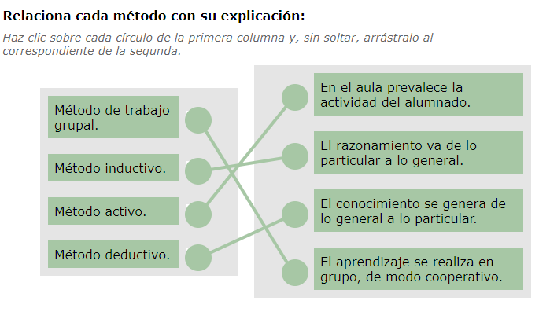

---

## Ejercicio 31: Elección de estrategias metodológicas

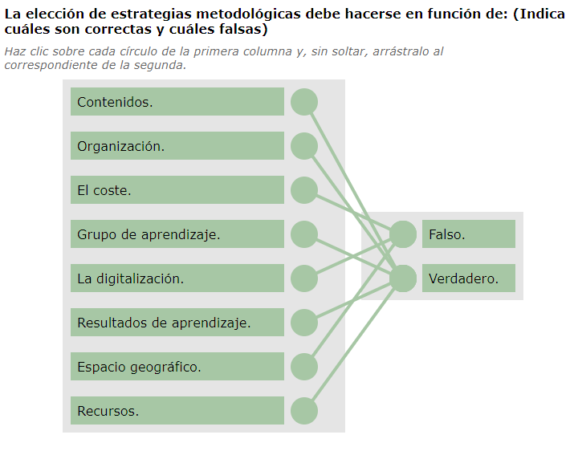

---

## Ejercicio 32: Dimensiones y su descripción

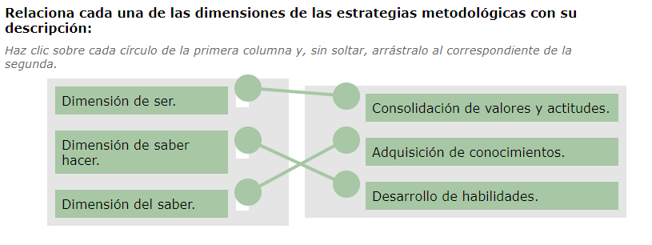

---

## Ejercicio 33: Estrategias a su lugar adecuado (dimensión del saber)

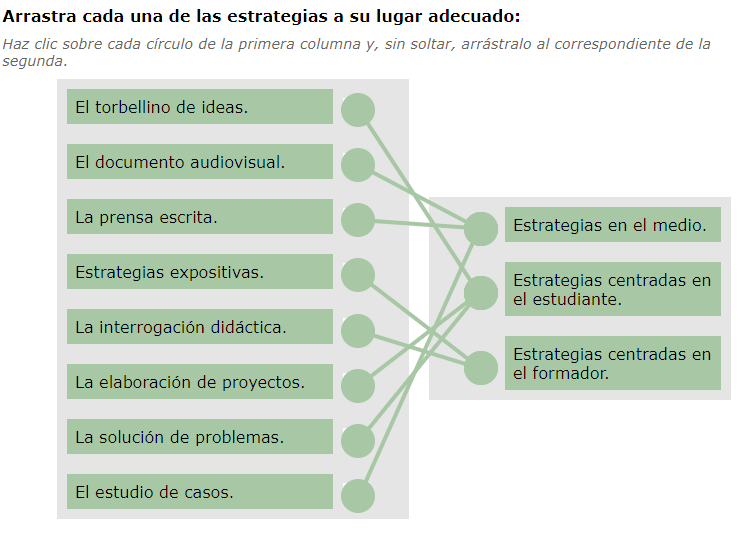

---

## Ejercicio 34: Estrategias a su lugar adecuado (dimensión del saber hacer)

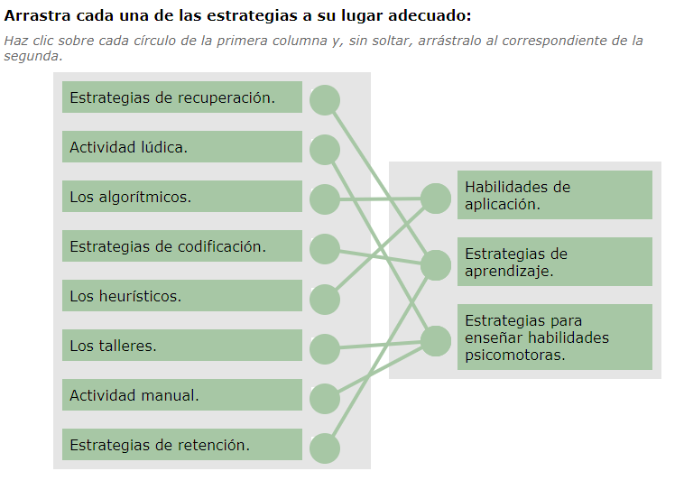

---

## Ejercicio 35: Estrategias a su lugar adecuado (dimensión del ser)

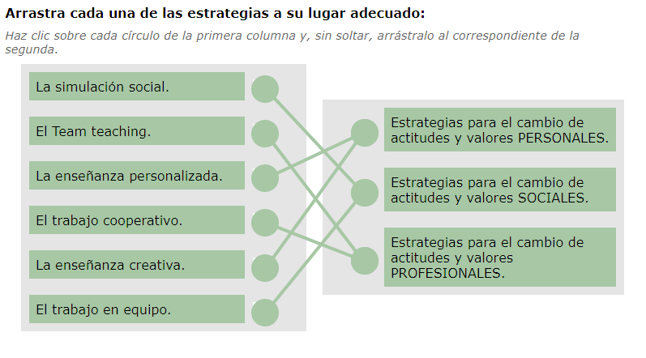

---

## Ejercicios 36: Clasificación de los recursos

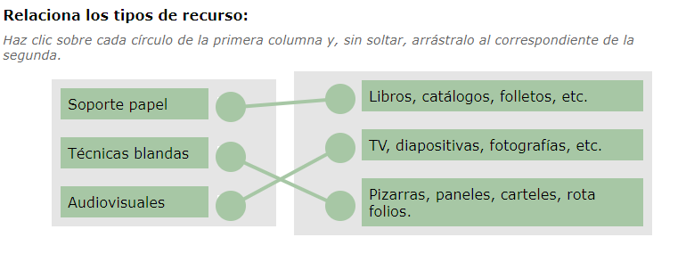

---

## Ejercicio 37: Selecciona las verdaderas

✅ **a)** En las habilidades de entrada la actuación docente debe plantear los objetivos, introducir el tema de una manera motivante y establecer los prerrequisitos de entrada.
✅ **b)** La secuencialidad favorece la compresión del alumnado y se consigue manteniendo un orden y progresión en la exposición.
✅ **c)** Los silencios captan la atención y ayudan a reflexionar sobre lo aportado.
✅ **g)** Mostrar las conexiones entre el tema y la actividad laboral favorece el aprendizaje.
✅ **h)** Utilizar el humor en clase favorece el aprendizaje porque reduce las resistencias a adquirir nuevos conocimientos y cambiar comportamientos.

❌ **d)** Incorrecta → remitir una pregunta al grupo no es una demostración de escucha activa, sino una técnica de dinamización.
❌ **e)** Incorrecta → la recapitulación cognitiva no busca dar sentido de logro, sino reforzar la comprensión y consolidación del aprendizaje.
❌ **f)** Incorrecta → no debe centrarse solo en el contenido teórico.
❌ **i)** Incorrecta → los prerrequisitos son los conocimientos previos necesarios, no los contenidos a trabajar.

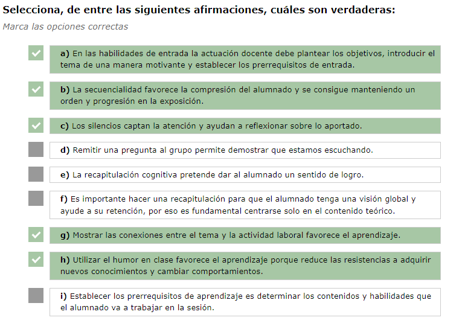

---

## Ejercicio 38: Estrategias en su lugar adecuado. Habilidades docentes

| **Habilidad docente**                                        | **Grupo al que pertenece**            |
| ------------------------------------------------------------ | ------------------------------------- |
| Valoración constructiva                                      | Habilidades evaluativas               |
| Detección de dificultades de los alumnos/as                  | Habilidades evaluativas               |
| Uso de metodología científica                                | Habilidades metodológicas             |
| Utilización de las funciones de la inteligencia: analizar, sintetizar, etc. | Habilidades metodológicas             |
| Selección de ejercicios más adecuados                        | Habilidades cognoscitivas del docente |
| Dominio de la materia                                        | Habilidades cognoscitivas del docente |
| Aclaración de conceptos                                      | Habilidades cognoscitivas del docente |

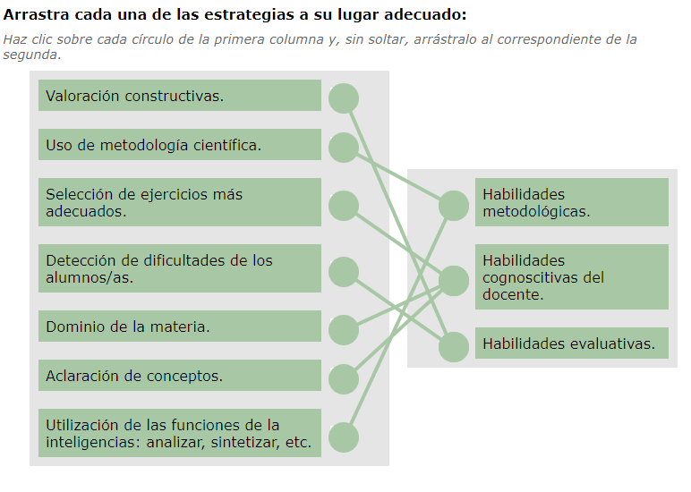

---

## Ejercicio 39: Estilo de liderazgos docentes

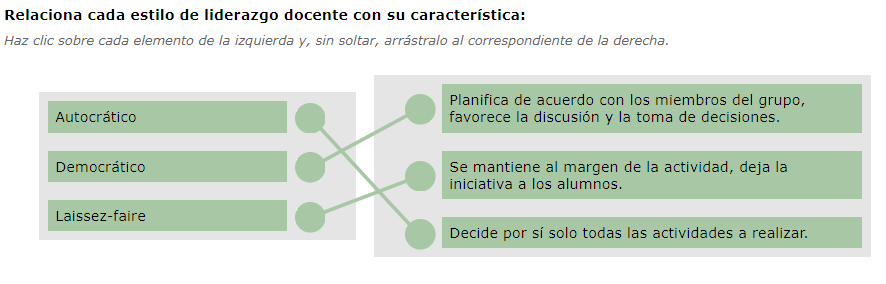

---

## Ejercicio 40: Habilidades docentes

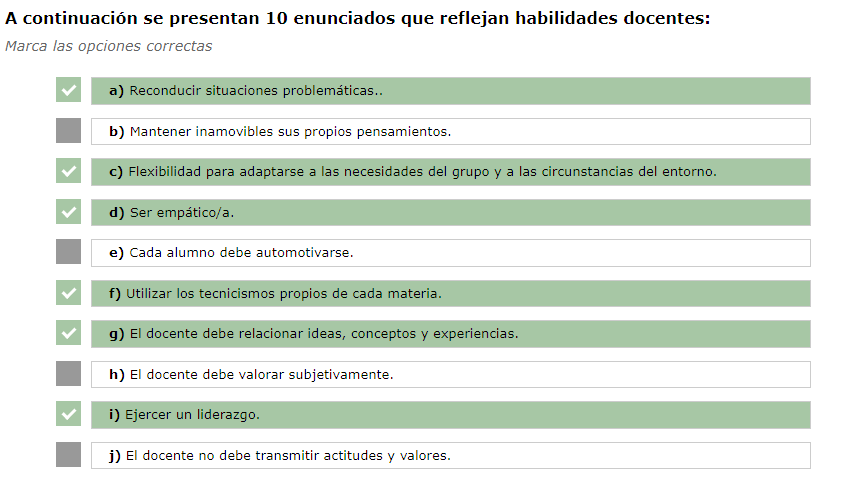

---

## Ejercicio 41: Planificación

---

## Ejercicio 42: Criterios de selección de medios

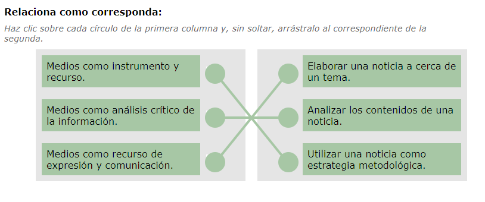

---

## Ejercicio 43: Fases de la simulación docente

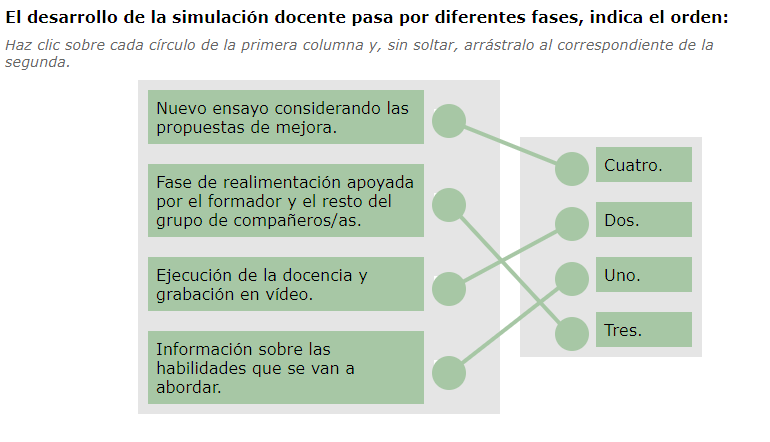

---

## Ejercicio 44: Microenseñanza. Verdadero o falso.

| Afirmación                                                   | V / F |
| ------------------------------------------------------------ | :---: |
| Las técnicas de microenseñanza sirven, entre otras cosas, para facilitar el control del grupo. |  ✅ V  |
| Las técnicas de microenseñanza deben realizarse durante un periodo de tiempo de treinta minutos como mínimo. |  ❌ F  |
| La microenseñanza es útil para concentrarse en la coherencia entre el mensaje verbal y no verbal y el empleo de refuerzos. |  ✅ V  |

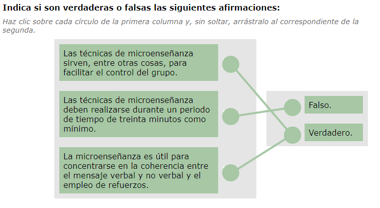

---

## Ejercicio E12. Práctica asociada a los CE2.8 y CE2.9 (Unidad de aprendizaje 3, Epígrafe 10.4) Actividad evaluable

PDF Aparte

---

## Ejercicio E13 Actividad Colaborativa, a través del Foro, asociada al CE3.9 (Unidad de aprendizaje 3, Epígrafe 10.4) Actividad evaluable

PDF aparte.

---

## Ejercicio 45: Ventajas o inconveniente de formación online.

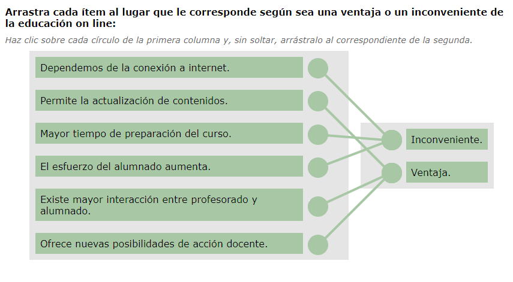

---

## 🧪 Test final - MF1444 - UF1645 - 03

**1) ¿Qué método es el más adecuado para trabajar con un grupo en el que los alumnos no poseen conocimientos sobre el tema, los conceptos que se van a tratar son de gran dificultad y además es conveniente evitar discusiones?**  
a) Interrogativo.  
b) Descubrimiento.  
c) Expositivo.  
d) Demostrativo.  

**2) En el método demostrativo el docente enseña al alumno mediante la demostración de la tarea. Las fases para ponerlo en práctica son:**  
a) Preparación y motivación del alumno, realización de la tarea por parte del docente y actuación del alumno.  
b) Motivación del alumno, realización de la tarea por parte del docente, instrucciones de cómo realizar la tarea y actuación del alumno.  
c) Preparación y motivación del alumno, explicación de la tarea, realización de la tarea por parte del docente y actuación del alumno.  
d) Motivación del alumno, información inicial, realización de la tarea por parte del docente y actuación del alumno.  

**3) ¿Cuál de la siguientes habilidades docentes NO ES una habilidad de desarrollo?  
a) Claridad de exposición.**  
b) Presentación de objetivos.  
c) Secuencialidad.  
d) Integración de conocimientos.  

**4) Cualquier método puede ser eficaz si se tiene en cuenta en su elección:**  
a) Objetivo.  
b) Tiempo disponible.  
c) El estilo docente.  
d) Todas son correctas.  

**5) De las siguientes frases relacionadas con el refuerzo indica la incorrecta:**  
a) Elogiar al principio para animar al alumnado, y poco a poco ir distanciando los refuerzos.  
b) El refuerzo tiene que seguir inmediatamente al buen resultado.  
c) Hay que dar muchos refuerzos, cuantos más mejor.  
d) El aprendizaje sin refuerzo no conduce al cambio de comportamiento.  

**6) Utilizar ejemplos, historias, anécdotas ayuda a que el alumnado:**  
a) Comprenda mejor los puntos tratados.  
b) Relacione la teoría con la realidad.  
c) Motiva o remotiva.  
d) Todas son correctas.  

**7) El docente puede plantear diferentes tipos de preguntas en función del objetivo que pretenda. Las preguntas de síntesis le permiten:**  
a) Comprobar que los contenidos se han asimilado.  
b) Mantener la atención y el interés en clase.  
c) Valorar el nivel y el progreso del grupo.  
d) Todas son correctas.  

**8) ¿Cuál de los siguientes enunciados relacionados con los estilos didácticos es incorrecto?:**  
a) Con cualquier grupo se puede utilizar el estilo laissez-faire.  
b) El estilo democrático es el más adecuado para trabajar con adultos.  
c) El estilo autoritario es el mejor para tareas urgentes con poco tiempo.  
d) El rendimiento con el estilo laissez-faire depende de los líderes del grupo.  

**9) Remitir al grupo la pregunta que una persona plantea le permite al docente:**  
a) Tener más tiempo para reflexionar antes de dar su respuesta.  
b) Comprobar el nivel del grupo con respecto al tema.  
c) Dar al grupo la oportunidad de participar más.  
d) Todas son correctas.  

**10) El método más adecuado para trabajar con un grupo reducido, que tiene conocimientos del tema, es homogéneo en los conocimientos, es un grupo maduro y disponemos de tiempo es:**  
a) Expositivo.  
b) Autoritario.  
c) Laissez-faire.  
d) Descubrimiento.  

Soluciones

**1)** c) Expositivo  
*Es el más adecuado cuando los alumnos no tienen conocimientos previos y los contenidos son difíciles.*

**2)** c) Preparación y motivación del alumno, explicación de la tarea, realización de la tarea por parte del docente y actuación del alumno.  
*Son las fases del método demostrativo según la secuencia didáctica correcta.*

**3)** b) Presentación de objetivos  
*Corresponde a una habilidad de inicio, no de desarrollo.*

**4)** d) Todas son correctas  
*Los métodos deben elegirse considerando objetivos, tiempo y estilo docente.*

**5)** c) Hay que dar muchos refuerzos, cuantos más mejor  
*El exceso de refuerzos reduce su efectividad; deben aplicarse con criterio.*

**6)** d) Todas son correctas  
*Los ejemplos y anécdotas facilitan la comprensión, relación y motivación.*

**7)** a) Comprobar que los contenidos se han asimilado  
*Las preguntas de síntesis sirven para confirmar la asimilación del aprendizaje.*

**8)** a) Con cualquier grupo se puede utilizar el estilo laissez-faire  
*Es incorrecto, este estilo solo funciona con grupos muy maduros.*

**9)** d) Todas son correctas  
*Remitir la pregunta al grupo fomenta participación, reflexión y control del nivel.*

**10)** d) Descubrimiento  
*Es el método ideal para grupos maduros y con conocimientos previos, fomentando el aprendizaje activo.*

