[TOC]

---

# MF1444 - Impartición y tutorización de acciones formativas para el empleo

# UF1646 - Tutorización de acciones formativas para el empleo

# Unidad 01 - Características de las acciones tutoriales en formación profesional para el empleo

## Introducción y objetivos

En esta unidad conoceremos los distintos **tipos de modalidades de formación**, profundizando en las **estrategias de acción tutorial** y en las **funciones y habilidades del tutor o tutora**.

**Objetivo de la unidad:**  
Asesorar al alumnado en el uso de **estrategias de aprendizaje** y en la **utilización de fuentes de información** que faciliten el desarrollo de la acción formativa, favoreciendo la **adquisición de competencias profesionales**.

---

## 1. Modalidades de formación: presencial, a distancia y mixta

### 1.1. Aspectos generales

- En un contexto de **aprendizaje a lo largo de la vida** (*life long learning*), comienzan a tomar mayor relevancia roles de relación como:
  - 🧭 Asesorar y hacer tutoría y seguimiento del proceso de aprendizaje.  
  - 🧰 Diseñar contenidos y materiales en espacios interactivos.  
  - 🤝 Promover un aprendizaje crítico con una lógica cooperativa.  
  - 🩺 Diagnosticar necesidades y formación específica en cada participante.
- En este contexto, no sólo debemos aprender durante toda la vida, sino que será necesario **modificar la forma de hacerlo**. No se trata de memorizar, sino de **aprender a obtener buena información**, asociarla entre sí y comprender los conceptos.
- El alumnado debe **“aprender a aprender”**, y el personal docente debe **promover el uso de las tecnologías** en su propia experiencia formativa. El esquema tradicional del profesorado que expone y el alumnado que toma nota **queda muy limitado** en el contexto actual de las nuevas tecnologías. Comienzan a tomar relevancia roles como asesorar, hacer tutoría y seguimiento, diseñar contenidos interactivos, promover un aprendizaje cooperativo y diagnosticar necesidades formativas específicas.

    <iframe width="560" height="315" src="https://www.youtube.com/embed/F870e38AP60?rel=0&showinfo=0" title="Vídeo introductorio" frameborder="0" allow="accelerometer; autoplay; clipboard-write; encrypted-media; gyroscope; picture-in-picture" allowfullscreen></iframe>

> [!important]
> El término **modalidad** se refiere a las distintas maneras en que puede desarrollarse la actividad formativa y el proceso de aprendizaje.

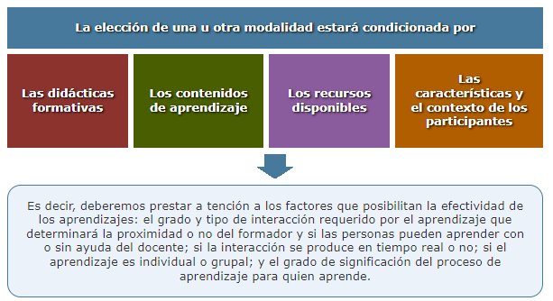

Otros factores relacionados con **aspectos organizativos** que pueden influir en la elección de una modalidad u otra son, por ejemplo, si existe una **necesidad de aprender en el puesto de trabajo o fuera de él**.

> [!note] Definición 
>
> 📢Entendemos por *modalidad educativa* la forma de **organizar y ofrecer la formación**, de acuerdo a la **presencialidad o no** de los estudiantes.  
> Las modalidades pueden dividirse en **presenciales** (comunicación cara a cara entre el profesor y el estudiante) o **desescolarizadas** (a distancia, virtual o a través de medios de comunicación).  
> Cada modalidad condiciona el uso de distintos **medios didácticos** para estimular los procesos de enseñanza-aprendizaje, en función de las **necesidades y características del alumnado**.

Durante mucho tiempo, las modalidades formativas se han definido en base a un único criterio: **dónde tienen lugar las relaciones entre docente y alumnado**.

El **Real Decreto 34/2008, de 18 de enero**, en su artículo 2 define los **certificados de profesionalidad** como instrumentos de acreditación oficial de las cualificaciones profesionales, y en su **artículo 10** establece que las modalidades de impartición de la formación referida a dichos certificados serán:

- 🏫 **Formación presencial**.  
- 🌐 **Formación a distancia y teleformación**.  
- 🔀 **Formación mixta**.

A continuación, profundizaremos en cada una de estas modalidades.

---

### 1.2. Formación presencial

Cuando pensamos en **formación presencial**, nos viene a la mente el **aula tradicional**, a la que la mayoría de las personas asiste durante la infancia y la adolescencia.  
Este tipo de formación se desarrolla en **horarios y espacios determinados**.

Para la impartición de la formación presencial se necesita un **espacio físico**, es decir, un aula con mesas, sillas, pizarra y recursos didácticos.  

Por tanto, la formación presencial implica la **coincidencia entre docentes y alumnado en el mismo lugar y al mismo tiempo**.  
La comunicación se realiza **cara a cara** entre formadores y participantes, y puede ser **verbal y no verbal** (los gestos, movimientos, forma de vestir, mirar o expresarse cobran gran importancia).

La formación presencial ha sido implementada en los tres tipos de educación:

🎓 **Educación formal**  
Es el aprendizaje desarrollado en el entorno de las **instituciones educativas**, con una **estructura establecida** según los objetivos, la duración y los contenidos.  
Su finalidad es **cualificar** a los participantes dotándolos de reconocimiento académico o profesional mediante **titulaciones o certificaciones**.  
Esta educación se ofrece normalmente por un centro de educación o formación, con carácter estructurado (según objetivos didácticos, duración y evaluación) y concluye con una titulación.

💼 **Educación no formal**  
Su objetivo es **potenciar el desarrollo personal, profesional y social** de las personas, conformando una personalidad individual y como miembro de distintos colectivos.  
Tiene un **carácter estructurado** en cuanto a la definición de objetivos, la duración y los contenidos.  
El aprendizaje es ofertado por una **organización distinta al entorno educativo formal** y se presenta estructurado (objetivos didácticos, duración y evaluación).  
Normalmente concluye con una certificación.

🏡 **Educación informal**  
Es el aprendizaje al que las personas adultas accedemos por el mero hecho de **estar inmersas en la sociedad**.  
No se encuentra estructurado y **no conduce a una certificación**.  
Se obtiene en las **actividades de la vida cotidiana** relacionadas con el trabajo, la familia o el ocio.

**Ventajas de la modalidad presencial:**

- 🤝 Existe contacto directo entre profesor/a y alumnos/as.  
- ⚡ La interactividad es instantánea.  
- 💬 La resolución de dudas se realiza en el momento, de forma rápida y eficaz. El docente siempre está disponible.

**Inconvenientes de la modalidad presencial:**

- 💰 Es más costosa que otras modalidades.  
- 📍 Es poco flexible en cuanto a espacio geográfico y uso horario.  
- 🕒 El ritmo de trabajo lo impone el docente.

---

### 1.3. Formación a distancia y formación e-learning

> [!note] Definición  
>
> 📢Consideramos que la **enseñanza a distancia** es un sistema tecnológico de **comunicación masiva y bidireccional**, que sustituye la interacción personal en el aula entre profesor/a y alumno/a como medio preferente de enseñanza, por la acción sistemática y conjunta de diversos **recursos didácticos** y el apoyo de una **organización tutorial**, que propician el **aprendizaje autónomo** de los estudiantes.

Para conocer la evolución de la formación a distancia hasta llegar a la denominada **formación e-learning**, seguimos el siguiente recorrido cronológico:

📜 **Año 1800**  
Hasta entonces, la educación y formación en todas las disciplinas se impartía únicamente de forma **presencial**.  
La denominación de *educación a distancia* surge en **Alemania e Inglaterra** alrededor del año 1800 y nace gracias al sistema de **correo postal**.  
Las universidades de ambos países comenzaron a ofrecer esta modalidad desde entonces.

🏫 **Siglo XIX**  
En Estados Unidos se encuentran los primeros indicios de educación a distancia en la *Gaceta de Boston*.  
En este periódico se anunciaba un profesor de taquigrafía que impartía cursos por **correo postal**, mediante envíos semanales.  
Fue **Anna Elliot Ticknerd** quien inició este movimiento, logrando suscribir a más de **siete mil mujeres** en cursos por correspondencia durante 24 años.  
Con su éxito, se consolidaron los **estudios por correspondencia** al final del siglo XIX, y varias universidades estadounidenses comenzaron a ofrecer también **estudios a distancia**.

📺 **Años 60**  
Durante los años 60 se incorporaron nuevos **recursos tecnológicos** como la televisión, el teléfono y la radio, para apoyar el proceso de enseñanza-aprendizaje.  
La **UNESCO**, en su informe *Los nuevos medios: Memos a quienes planean educación* (1967), indicaba que unos 15 países, incluyendo Estados Unidos, utilizaban ya la televisión y la radio para actividades educativas.  
La UNESCO participó también en la creación de la **Universidad de Lusaka** en Zambia, ante la necesidad de formar a los nuevos funcionarios del país tras su independencia.  
A finales de los años 60 y durante los 70 se fundaron la **UNED (España)**, la **Open University (Gran Bretaña)** y la **Open University de Israel**.

💾 **Años 80**  
Los años 80 se caracterizan por la aparición de los **ordenadores personales**.  
Los cursos se distribuían en **CD-ROM**, y la comunicación entre docente y alumnado se realizaba por correo electrónico.  
Es la llamada **formación asistida por ordenador**, que evolucionará más adelante hacia la **formación e-learning**.  
En esta modalidad, formador y alumnado están **separados física y temporalmente**, y la comunicación se apoya en algún tipo de tecnología.

🌐 **Años 90**  
En los 90 surge la **formación online**, caracterizada por el uso de **Internet**.  
La red supuso una auténtica revolución, especialmente a nivel **comunicativo e informativo**.  
El uso del **correo electrónico**, el **HTML**, los **media players**, los **audios y vídeos**, y lenguajes como **Java** marcaron un avance cualitativo.  
La comunicación dejó de ser exclusiva entre profesorado y alumnado, y pasó a desarrollarse también **entre estudiantes**, creando auténticas **comunidades de aprendizaje**.  
Los participantes disponen de una **plataforma de teleformación** para interactuar, acceder a contenidos y realizar actividades de aprendizaje.

🟢**Características de la formación a distancia:**

- 💻 El formador y el alumno/a están **separados física y temporalmente**, y la comunicación entre ellos está facilitada por **tecnología**.  
- 🔁 Es una modalidad **preferente en la formación continua**, ya que permite llegar a colectivos profesionales amplios y dispersos.  
- 🌍 En su versión **online**, utiliza de forma intensiva **Internet** a través de una plataforma de teleformación donde se ofrecen contenidos y actividades.

🟢**Ventajas e inconvenientes de la modalidad a distancia**

**Ventajas:**

- 🏠 No se requiere la presencia física del alumnado en un aula o centro, lo que permite **compatibilizar la formación con otras actividades**.  
- ⏰ El alumno/a puede establecer **sus propios horarios, ritmo y lugar de estudio**.  
- 💰 Es una modalidad **más económica**.

**Inconvenientes:**

- 📞 El contacto con el profesorado es **más lento**, limitado al teléfono o correo.  
- 📚 Es necesario tener **buen hábito de lectura y estudio**.  
- 💪 Requiere **autodisciplina**.

🟢**Ventajas e inconvenientes de la modalidad e-learning**

**Ventajas:**

- 🌐 No se requiere presencia física en el aula; la participación se realiza en un **aula virtual**, a través de foros e interacción con materiales web.  
- 💬 La comunicación con compañeros/as y profesorado se realiza mediante **foros, chats y videoconferencias**.  
- 🧩 Existe **gran diversidad de recursos y medios**, lo que favorece la asimilación de los contenidos.  
- 🔄 Hay **muchos materiales disponibles** que permiten su actualización y adaptación constante.

**Inconvenientes:**

- 📧 El contacto con el profesorado puede ser **lento**, ya que se realiza mediante foros o correo electrónico.  
- 🖥️ El alumnado necesita **ordenador y conexión a Internet**.  
- 🧠 Se requiere un **conocimiento mínimo de herramientas telemáticas**; si no se tiene, puede suponer una gran dificultad.  
- 📚 Es necesario mantener **buen hábito de lectura y estudio**.  
- 💪 Se requiere **autodisciplina**.  
- 🧊 La interacción es **virtual**, lo que puede aumentar la **sensación de soledad o frialdad** en algunas personas.

> [!tip]
> **Más información:**  
> El siguiente vídeo, realizado por la **Universidad Galileo**, te ayudará a comprender la modalidad de *e-learning*.  
> En él se rompen algunas ideas erróneas sobre esta modalidad y se presenta una breve introducción al nuevo escenario formativo que supone la formación online.

<iframe width="560" height="315" src="https://www.youtube.com/embed/vG0dpOXSRyc" title="Formación e-learning - Universidad Galileo" frameborder="0" allow="accelerometer; autoplay; clipboard-write; encrypted-media; gyroscope; picture-in-picture" allowfullscreen></iframe>

---

### 1.4. Formación mixta o blended learning (BL)

Según **Alemany (2007)**, en el modelo de **educación combinada, mixta o *blended learning (BL*)**, el formador o formadora **mantiene un rol tradicional**, pero aprovecha las **posibilidades que ofrece el entorno virtual**, logrando que la formación **gane en flexibilidad y en opciones de aprendizaje**.

La aparición y consolidación del *blended learning* surge después de los años 90, un periodo marcado por el auge del **e-learning**, pero también por **numerosas críticas a su eficacia**.  
Las principales carencias detectadas en la educación e-learning, que dieron lugar al modelo mixto como una alternativa más equilibrada, fueron las siguientes:

- 📘 Muchos estudiantes no poseen las **competencias ni los estilos de aprendizaje adecuados** para seguir con éxito la formación e-learning.  
  Carecen de **habilidades lectoescritoras**, capacidad de **organización del trabajo**, **automotivación** y **exigencia personal**.  
- 💬 La **dimensión emocional del aprendizaje** ha sido, en muchos casos, obviada o mal gestionada en los cursos en línea.  
  La falta de **contacto humano** dificulta la creación del **sentimiento de pertenencia a una comunidad**.

A continuación, se presenta una **comparativa elaborada por Alemany (2007)** entre el modelo **presencial** y el modelo **blended learning**:

| 🧑‍🏫 **Modelo presencial**                               | 💻 **Modelo BL (Blended Learning)**        |
| ------------------------------------------------------ | ----------------------------------------- |
| Presencialidad.                                        | Virtualidad.                              |
| Relación profesor/alumnos/as.                          | Relación alumnos/as – propio aprendizaje. |
| Transmisión de conocimientos.                          | Desarrollo de capacidades.                |
| Cultura escrita-oral.                                  | Cultura audiovisual.                      |
| Uso tradicional de tecnologías (pizarra, libro, etc.). | Nuevas tecnologías (campus virtual).      |

---

### 1.5. Cómo elegir una modalidad de formación

#### 1.5.1. Aspectos generales

Para seleccionar la modalidad de un curso, podemos formularnos las siguientes preguntas:

- 🧍‍♀️ ¿Qué nivel de **presencialidad** va a tener el curso?  
- 🧩 ¿Qué nivel de **apoyo** precisa el participante?  
- 🔄 ¿Qué nivel de **interactividad** con los participantes y con los recursos utilizados se necesita?

> [!important]
> Las respuestas a estas cuestiones son **complementarias a los criterios económicos, organizativos y de eficiencia** que cualquier institución formativa debe tener en cuenta al seleccionar la modalidad más adecuada.

Las instituciones, al elegir la modalidad formativa, consideran los siguientes **criterios**:

🎯 **Criterios económicos**  
Incluyen la **cuantía de la inversión**, la **estructura de costes** y el **retorno de la inversión**, factores decisivos para determinar el tipo de modalidad.

🧩 **Criterios organizativos**  
Se refieren a la **planificación a largo plazo**, la **estimación de recursos** y la **disponibilidad de profesionales** (docentes y no docentes), así como de los **recursos tecnológicos necesarios**.

📊 **Criterios de eficiencia**  
Relacionados con las características de los **destinatarios** y sus **circunstancias**: niveles educativos, número de participantes, localización, y competencias digitales, entre otros aspectos.

A continuación, profundizaremos en los **elementos principales** de los criterios organizativos y de eficiencia que nos permitirán realizar una **elección adecuada** de la modalidad formativa.  
Estos elementos son:

- 🎯 Los **objetivos del curso**.  
- ⏰ La **disponibilidad del alumnado**.  
- 👩‍🏫 La **disponibilidad del equipo docente**.  
- ⚙️ La **funcionalidad del sistema**.

---

#### 1.5.2. Los objetivos del curso

El alumnado que realiza cursos de **Formación Profesional para el Empleo (FPE)** tiene como objetivo fundamental el **aprendizaje**, aunque este puede dirigirse a distintos fines:

- 🧠 Mejorar una habilidad.  
- 🧰 Aprender una técnica.  
- 🎓 Lograr una titulación.  
- ❓ Resolver una duda concreta.  
- 💬 Compartir intereses personales, entre otros.

En función del **objetivo que se quiera alcanzar**, el diseño del curso contemplará **una u otra modalidad** formativa.

> [!tip] Más información
>
> Algunos estudios han demostrado que, cuando el alumnado **no tiene experiencia previa en entornos virtuales**, conviene diseñar **una sesión presencial de familiarización con la plataforma**.  
> De esta forma se **aumenta la motivación** y se **evitan problemas técnicos** posteriores.  
> Aunque no siempre sea posible realizar estas sesiones, **debería intentarse** si el grupo destinatario no dispone de las **herramientas necesarias** para afrontar los retos de la modalidad online.

---

#### 1.5.3. La disponibilidad del alumnado

- 👥 El **perfil del alumnado** determinará en gran medida el grado de **presencialidad** del curso.  
- 🌍 Si se trata de un grupo de **personas adultas, empleadas y distribuidas geográficamente**, su asistencia a clases presenciales será limitada, por lo que estas deberán estar **muy justificadas**.  
- 🏢 En cambio, si el curso está dirigido a **trabajadores de una misma empresa**, con una localización concreta, será posible organizar **sesiones presenciales puntuales** para intercambiar experiencias, resolver dudas, etc.

Es importante tener en cuenta que quienes eligen la **modalidad online o a distancia** lo hacen, probablemente, por la **flexibilidad** que ofrece (poder conectarse desde donde y cuando se quiera).  
Por este motivo, no conviene abusar de actividades que requieran **comunicación síncrona** (como chat o videoconferencia), que exigen que todos los participantes estén conectados al mismo tiempo.

---

#### 1.5.4. La disponibilidad del equipo docente

- 🧑‍🏫 Una de las mayores diferencias entre la **formación presencial** y la **formación a distancia u online** es que, en la primera, el profesorado se encuentra **en un lugar y horario concretos**, y el alumnado sabe **cómo localizarle** para resolver dudas.  
- 💬 En la **formación e-learning**, el alumnado dispone del **correo electrónico** y del **foro** para dejar sus consultas, pero estas **no se resuelven de inmediato**, ya que el docente puede no estar conectado en ese momento.  
  El alumnado debe comprender que la **inmediatez** de la formación presencial **no existe** en este entorno.  
- ⏳ El docente debe procurar **responder lo antes posible** a las dudas planteadas, ya que una falta de respuesta puede generar **desmotivación** o **sensación de soledad**.  
  Además, debe valorarse si el docente está **dispuesto o disponible** para realizar **sesiones presenciales**, algo que a veces **no es posible** por cuestiones **geográficas**.

---

#### 1.5.5. Las funcionalidades del sistema

Una **plataforma de formación online** debe disponer de diversas **funcionalidades** que faciliten y complementen las tareas del personal **tutor o formador**.  
El nivel de interacción del alumnado con el sistema debe darse en **tres niveles**:

💡 **A nivel informativo**  
La plataforma debe ofrecer **información clara y accesible** sobre cómo realizar el curso, cómo acceder al **contenido principal**, y cómo utilizar los **materiales y recursos complementarios** (artículos, vídeos, audios, etc.).

📘 **A nivel formativo**  
El **material principal del curso** debe estar disponible **dentro de la plataforma**, evitando el envío de contenidos por correo postal u otros medios externos.

💬 **A nivel de comunicación**  
La plataforma debe proporcionar **espacios de interacción** entre alumnado y docentes, como **foros, chats o correo electrónico**, que faciliten el intercambio y la participación.

> [!note] Recuerda
> El personal tutor deberá utilizar estos **tres niveles** y sus **espacios asociados** para llevar a cabo la acción tutorial.  
> Si alguna de estas funcionalidades no está presente en la plataforma, conviene **plantearse si la modalidad online es adecuada** para el curso en cuestión.

---

#### 1.5.6. Objetivo y finalidad de la formación

Antes de decidir la modalidad más adecuada, es necesario **reflexionar sobre varios aspectos clave** relacionados con el objetivo y la finalidad del curso.  
Podemos hacernos las siguientes preguntas:

- 🧍‍♂️ ¿Cuántas **sesiones presenciales** son necesarias?  
- ⏰ ¿En qué momento del **proceso de enseñanza–aprendizaje** resultan más eficaces?  
- 👥 ¿Cuántos **alumnos/as pueden acudir potencialmente**?  
- 👩‍🏫 ¿Los **docentes estarán disponibles** para esas sesiones?  
- 🧩 ¿Qué **funcionalidades** nos ofrece la plataforma?  
- 💬 ¿Podemos **suplir las sesiones presenciales** con herramientas de la plataforma, como videoconferencias o chats?

A continuación, se mostrará cómo, **en función del objetivo del alumnado y la finalidad de la formación**, pueden valorarse los **tres niveles de interacción** (informativo, formativo y de comunicación) para decidir **la modalidad más adecuada**.

**Nivel de presencialidad**

| **Objetivos del alumno/a**       | **Disponibilidad del alumnado/a: Sí** | **Disponibilidad del alumnado/a: No** |
| -------------------------------- | ------------------------------------- | ------------------------------------- |
| 🧠 Mejorar una habilidad.         | 3-5 sesiones presenciales.            | 1 sesión presencial.                  |
| 🧰 Aprender una técnica.          | 3-5 sesiones presenciales.            | 1 sesión presencial.                  |
| 🎓 Lograr una titulación.         | 3-5 sesiones presenciales.            | 1 sesión presencial.                  |
| ❓ Resolver dudas.                | 1-2 sesiones presenciales.            | No hay sesiones presenciales.         |
| 💬 Compartir intereses.           | 1-2 sesiones presenciales.            | No hay sesiones presenciales.         |
| 🧩 Elaborar un proyecto de grupo. | 1-2 sesiones presenciales.            | No hay sesiones presenciales.         |

**Nivel de asistencia docente**

| **Objetivos del alumno/a**       | **Disponibilidad del alumnado/a: Sí** | **Disponibilidad del alumnado/a: No** |
| -------------------------------- | ------------------------------------- | ------------------------------------- |
| 🧠 Mejorar una habilidad.         | Nivel alto de asistencia.             | Nivel medio de asistencia.            |
| 🧰 Aprender una técnica.          | Nivel alto de asistencia.             | Nivel medio de asistencia.            |
| 🎓 Lograr una titulación.         | Nivel alto de asistencia.             | Nivel medio de asistencia.            |
| ❓ Resolver dudas.                | Nivel mínimo de asistencia.           | No hay asistencia docente.            |
| 💬 Compartir intereses.           | Nivel mínimo de asistencia.           | No hay asistencia docente.            |
| 🧩 Elaborar un proyecto de grupo. | Nivel mínimo de asistencia.           | No hay asistencia docente.            |

**Nivel de interactividad**

| **Objetivos del alumno/a**       | **Disponibilidad informativa** | **Disponibilidad formativa** | **Disponibilidad comunicativa** |
| -------------------------------- | ------------------------------ | ---------------------------- | ------------------------------- |
| 🧠 Mejorar una habilidad.         | Nivel medio.                   | Nivel alto.                  | Nivel bajo.                     |
| 🧰 Aprender una técnica.          | Nivel medio.                   | Nivel alto.                  | Nivel bajo.                     |
| 🎓 Lograr una titulación.         | Nivel medio.                   | Nivel alto.                  | Nivel bajo.                     |
| ❓ Resolver dudas.                | Nivel medio.                   | Nivel bajo.                  | Nivel alto.                     |
| 💬 Compartir intereses.           | Nivel medio.                   | Nivel bajo.                  | Nivel alto.                     |
| 🧩 Elaborar un proyecto de grupo. | Nivel medio.                   | Nivel bajo.                  | Nivel alto.                     |

Por tanto, para decidir **en qué modalidad impartir el curso**, además de los **criterios económicos** de las empresas, debemos tener en cuenta **tres dimensiones fundamentales**:

- 🏫 **Nivel de presencialidad:** número y calendario de sesiones.  
- 👩‍🏫 **Nivel de asistencia docente:** dedicación y horario de tutorías.  
- 💻 **Nivel de interactividad con el sistema:** funcionalidades que ofrecerá la plataforma (informativo, comunicativo y formativo).

---

## 2. Plan de acción tutorial: estrategias y estilos de tutoría y orientación

### 2.1. Aproximación a los conceptos de orientación y tutoría

- 📚 Los conceptos de **orientación** y **tutoría** han evolucionado a lo largo del tiempo.  
  La **tutoría** es la orientación realizada por el tutor/a y el profesorado, con la finalidad de favorecer la **formación integral del alumnado**.  
- 🕰️ En la **primera década del siglo XX** surge la orientación como **actividad organizada**, dirigida al logro de **objetivos específicos**.  
  En sus inicios se asoció principalmente al ámbito **profesional**, extendiéndose posteriormente al educativo.  
- 🥘 En **España**, en 1918 se creó en Barcelona el **primer Instituto de Orientación Profesional**, y en 1924, en Madrid, el **Instituto de Orientación y Selección de Personal**.  
  Ambos centros buscaban **cualificar la práctica educativa**, y en esta etapa la orientación se entendía como una **corrección de problemas** (dimensión terapéutica) y como **elección vocacional** basada en la información profesional.

A lo largo de los años han surgido **múltiples enfoques** sobre el concepto de orientación. A continuación, se presenta un breve repaso cronológico según diversos autores:

- 🧭 **Parsons (1909):** concibió la orientación como la **adecuación del sujeto al trabajo**.  
- ⚖️ **Proctor (1925):** la definió como un **proceso de distribución**, que implica formular metas y conocer tanto las propias capacidades como el entorno.  
- 🎓 **Brewer (1932):** identificó la orientación con la **educación**.  
- 🧪 **Williamson (1939):** puso el énfasis en las **bases diagnósticas** de la orientación.  
- 🌍 **Shoben (1962):** consideró la orientación como un **instrumento de reforma social**, con el orientador como **líder de la reconstrucción**.  
- 🧠 **Miller (1971):** definió la orientación como el proceso mediante el cual se ayuda a los individuos a **lograr la autocomprensión y autodirección** necesarias para su ajuste a la escuela, el hogar y la comunidad.  
- 🧩 **Mathewson (1962)** la concibió como un **proceso de desarrollo**.  
- 🧑‍⚕️ **Mosher y Sprinthall (1970, 1971)**, **Cottinghan (1973)** e **Ivey y Alschuler (1973)** la denominaron **educación psicológica**.  
- 💼 A partir de los **años setenta**, se destacó el movimiento de **educación para la carrera** (*Hoyt, 1978, 1985*).  
  Posteriormente, varios autores pusieron el énfasis en la **prevención** (*Baker y Shaw, 1987; Botvin y Dusenbury, 1987; Conyne, 1987*) o en el **desarrollo** (*Hayes y Aubrey, 1988; Myrick, 1987*).

Todas estas teorías generaron distintas interpretaciones.  
En este sentido, **Beck (1973)** afirmó que la orientación no solo busca la **solución de problemas**, sino también la **ayuda para lograr la autoorientación y el desarrollo personal**.

El autor **Rafael Bisquerra (1991)** sintetiza las concepciones más comunes del concepto de orientación en los siguientes tipos:

| **Tipo de orientación**       | **Descripción**                                              |
| ----------------------------- | ------------------------------------------------------------ |
| 🏫 **Orientación escolar**     | Proceso de ayuda al alumnado en los temas relacionados con el **estudio** y la **adaptación al entorno educativo**. |
| 💼 **Orientación profesional** | Proceso de ayuda en la **elección profesional**, basado en el **autoconocimiento** y en el conocimiento de las **posibilidades del entorno**. |
| 💬 **Orientación personal**    | Proceso de **ayuda en problemas de índole personal**.        |
| 🧭 **Asesoramiento**           | Técnica incluida dentro del proceso general de orientación.  |
| 🧠 **Psicología escolar**      | Término usado por los psicólogos para referirse al **modelo terapéutico** dentro de la orientación educativa. |

> [!important]
> La **orientación es una función, no una persona**.  
> Desempeñan tareas de orientación el **tutor/a**, el **profesorado**, las **familias** y otros **profesionales**.  
> En la **Formación Profesional para el Empleo (FPE)**, el tutor o docente, además de impartir formación y facilitar el aprendizaje, también **asume funciones de orientación**.

---

### 2.2. La tutoría

#### 2.2.1. Aspectos generales

La **tutoría** es la **acción orientadora** llevada a cabo por el **tutor/a** y por el **resto del equipo docente**.  
Las **acciones tutoriales** se diseñan para que los participantes cuenten con un **apoyo constante** por parte del equipo formativo (coordinadores, tutores, formadores, etc.) a lo largo de todo el periodo de aprendizaje.

> [!note] Definición  
>
> 📢La **tutoría** es un **proceso de acompañamiento** del alumnado que se concreta mediante la **atención personalizada o grupal**, influyendo directamente en la **calidad de las experiencias de aprendizaje**.

**Objetivos formales de la tutoría:**

- 🎯 Favorecer el **desempeño formativo** de los participantes mediante acciones personalizadas o grupales.  
- 🧠 Contribuir a su **formación integral**.

Los distintos **tipos de tutoría en la FPE** se establecen según **diversos enfoques**.  
Por ejemplo, pueden existir:

- 📘 Tutorías de **recuperación o consolidación de aprendizajes**.  
- 💬 Tutorías centradas en la **dimensión relacional y comunicativa**.  
- 🌱 Tutorías que aborden una **atención integral al estudiante**, incluyendo dimensiones **personales y sociales**.

La tutoría, por tanto, puede asumir **diferentes enfoques** que explican su tipología:

- 🧩 **Ayuda para recuperar o consolidar aprendizajes.**  
- 🧮 **Estrategia didáctica**, donde el proyecto puede ser una de las técnicas de aprendizaje.  
- 🔗 **Dimensión relacional**, al habilitar las líneas de comunicación con el docente.  
- 🧭 **Proceso de información y orientación curricular y profesional**, examinando los itinerarios formativos y laborales.  
- 🌟 **Atención al desarrollo integral del estudiante**, incluyendo aspectos personales y sociales.

---

#### 2.2.2. Tipos de tutoría

Atendiendo a la **finalidad que persigue la tutoría**, el **número de participantes** y la **forma en que se lleva a cabo**, podemos distinguir distintos **tipos de tutoría**.

🔴**Según la finalidad**

Según la finalidad que se persigue, se diferencian dos grandes tipos de tutoría: **académica** y **orientativa**.

- 📘 **Tutoría didáctica o académica**  
  Apoyo dirigido a **resolver problemas, dudas o consultas** que el alumno/a tenga en un conocimiento concreto.  

- 🧭 **Tutoría orientativa**  
  Favorece la **autonomía del aprendizaje** y ayuda a **identificar conocimientos, experiencias, aptitudes e intereses** que permitan diseñar **itinerarios formativos** o facilitar su **transferencia al mercado laboral**.

🔴**Según los destinatarios**

En función del número de participantes, podemos identificar la **tutoría individualizada** y la **tutoría grupal o colectiva**.  
Además, existe una modalidad especial denominada **tutoría entre pares**, en la que los propios estudiantes actúan como tutores de otros compañeros, brindando apoyo tanto en el proceso formativo como en las interacciones sociales.

- 👩‍🏫 **Tutoría individual**  
  Relación **docente–alumno/a**, centrada en la **atención personalizada** para mejorar las condiciones de aprendizaje del participante.

- 👥 **Tutoría grupal o colectiva**  
  De carácter **presencial**, se utiliza para tratar **asuntos generales del grupo**, y también para **detectar casos que requieran atención individualizada**.

- 🤝 **Tutoría entre pares**  
  Modalidad en la que los **mismos estudiantes**, previamente formados como tutores, ofrecen **asesoría y apoyo a sus compañeros** para resolver un problema, completar una tarea, etc., dentro de un **programa establecido**.

🔴**Según la forma de llevarla a cabo**

En la **teleformación**, la tutoría adquiere una visión centrada en el **aprendizaje**, prestando especial atención a la **organización de los contenidos**, el **diseño de actividades** y el **seguimiento continuo** por parte del tutor/a.

- 🏫 **Tutoría presencial**  
  El tutor/a y los participantes **comparten el mismo espacio y tiempo**.

- 🌐 **Tutoría a distancia**  
  Se desarrolla mediante **diversos medios de comunicación** como la telefonía, la correspondencia, el correo electrónico o la **atención telemática**.

---

#### 2.2.3. Estrategias de tutoría

> [!important]
> El **tutor/a es el facilitador del aprendizaje**, y desde el inicio debe ser capaz de **identificar las expectativas, necesidades e intereses del alumnado**.  
> Para ello, la **interacción entre tutor y participantes** resulta esencial.  
> Además, el tutor/a deberá **adoptar distintas estrategias** según el momento en que se encuentre la acción formativa: **al inicio, durante y al finalizar**.

Las principales **estrategias del tutor/a de formación** son:

| **Estrategia**                                               | **Acciones del tutor/a**                                     |
| ------------------------------------------------------------ | ------------------------------------------------------------ |
| 🤝 **Establecer relaciones entre todos los participantes del curso** | Favorecer un **clima de trabajo agradable** que contribuya a la **integración del grupo**. |
| 💬 **Resolución de dudas**                                    | Aplicar **metodologías constructivistas** que promuevan una formación **activa y participativa**. Comprobar el **aprendizaje, dominio y aplicación** del conocimiento, y ofrecer **materiales complementarios**. |
| 👥 **Fomentar la participación**                              | Potenciar el **aprendizaje cooperativo** como base de la interacción y la implicación del alumnado. |
| 🎯 **Motivar a los participantes**                            | Asegurar **resultados de aprendizaje satisfactorios**, fomentar la **transferencia de conocimientos** y apoyar los **proyectos profesionales** del alumnado. |

Para desarrollar la experiencia tutorial y planificar su acción, el tutor/a deberá aplicar estrategias como:

- 🧩 Emplear una **metodología constructivista** que permita al participante **construir activamente su conocimiento**.  
- 📈 Realizar una **evaluación continua** que valore el progreso y permita el seguimiento de cada participante.  
- 🧠 Organizar **agrupamientos** para la práctica del *estudio de casos*.  
- 🎓 Prestar **atención a las necesidades individuales** de determinados alumnos/as.  
- 🔄 Facilitar la **recuperación de conocimientos pendientes**.

---

### 2.3. Plan de acción tutorial

#### 2.3.1. Tutoría académica

> [!important]
> La **tutoría** es una acción que requiere una **planificación y organización adecuadas**, reflejadas en el **Plan de Acción Tutorial**.  
> En este plan se incluyen los **objetivos y líneas de actuación** que el tutor/a desarrollará con el alumnado a lo largo del curso: la **tutoría académica** y la **tutoría orientadora**.

La finalidad del docente en la **tutoría académica** es que el alumnado mantenga un **ritmo de participación adecuado**, actuando como **acompañante en su proceso de aprendizaje**.  
Para ello, tanto el docente presencial como el tutor/a online deberá:

- 👥 Conocer el **perfil de entrada** del grupo de alumnos/as.  
- 📘 Informar sobre las **características del curso**: objetivos, contenidos, metodología y formas de evaluación.  
- 🧭 **Guiar el proceso de aprendizaje** de forma continua.  
- 💬 **Motivar al alumnado** para mantener su implicación.  
- ✏️ Orientar sobre **técnicas de estudio** y organización del trabajo personal.

> [!important]
> La **tutoría académica** tiene como finalidad **preparar al alumnado en su proceso de aprendizaje**.  
> El tutor/a debe **ayudar a superar dificultades**, **reforzar el trabajo individual**, y realizar una **evaluación continua** que permita detectar y subsanar problemas de aprendizaje.

> [!tip] Recuerda
>
> **Tutoría académica**
>
> - Su finalidad es apoyar al estudiante que requiere apoyo e información.  
> - Pretende que los estudiantes sean capaces de clarificar conceptos, así como desarrollar habilidades de aprendizaje y autoaprendizaje.

A continuación se detallan las **principales labores del docente** en la tutoría académica:

| **Función**                                                | **Acciones del tutor/a**                                     |
| ---------------------------------------------------------- | ------------------------------------------------------------ |
| 🎓 **Prepara al participante en su proceso de aprendizaje** | • Familiarizarse con la metodología y los recursos didácticos. • Regular el ritmo e intensidad del trabajo. • Seleccionar y adaptar los contenidos y actividades según las necesidades del grupo o del alumno/a. • Motivar al alumnado, relacionando los contenidos con sus intereses o con la actualidad social y profesional. |
| 🧩 **Ayuda al alumnado a superar dificultades**             | • Resolver dudas y consultas. • Explicar en detalle los puntos de mayor dificultad. • Corregir actividades. |
| 🤝 **Refuerza el trabajo individual y grupal**              | • Dar una visión global de los contenidos. • Reforzar la significatividad de los aprendizajes. • Proporcionar actividades de nivelación o recuperación. |
| 📈 **Evaluación y retroalimentación**                       | • Valorar el grado de asimilación de los contenidos. • Reforzar el interés del participante destacando sus logros. • Reorientar la acción cuando se detecten errores. • Identificar dificultades, analizar sus causas y prever actuaciones para solucionarlas. • Autoevaluar los factores del método seguido. |
| 🔄 **Subsanar las lagunas propias del aprendizaje**         | • Favorecer las relaciones entre participantes y el trabajo en grupo. • Promover el uso de bibliotecas y el contacto con empresas. |

🟠**Elementos clave de la tutoría académica:**

- 🎯 **Objetivo:** Definir la acción tutorial y diferenciarla de la impartición.  
- 🧩 **Contexto:** La tutorización es **inherente a la acción docente**; la comunicación e interacción entre estudiante y tutor son parte esencial del proceso de enseñanza-aprendizaje.  
- 💡 **Aplicación práctica:** Cada estudiante es **único** y presenta **necesidades diferentes**, por lo que el tutor/a debe ejercer un **liderazgo orientador** que acompañe sus inquietudes, temores y competencias individuales.  
- 🔗 **Relación con el resto de unidades del módulo:** Una buena tutoría requiere aplicar **todas las habilidades docentes** estudiadas en el módulo: conocer los **estilos de aprendizaje**, adaptar la **metodología** y fomentar la **comunicación e interacción** como herramientas de **motivación y retroalimentación**.

🟠**Ejemplo práctico**

👩‍🏫 **Lourdes** es docente de un grupo de **Formación Profesional para el Empleo (FPE)** y va a elaborar un **plan tutorial**.  
El esquema básico de su planificación sería:

- 🧍‍♀️ **Características del alumnado:** Mujeres desempleadas mayores de 45 años, sin estudios universitarios.  
- 📚 **Necesidades educativas:** Actualizar sus conocimientos para facilitar la **reinserción laboral**; en muchos casos afrontan un **cambio de profesión**.  
- 🏠 **Contexto:** El **desempleo** es la característica transversal del grupo; muchas tienen **experiencias negativas** previas y **baja autoestima** respecto a su empleabilidad.  
- 🧠 **Recursos a trabajar:** Autoestima, motivación, educación emocional, habilidades sociales y alfabetización digital.

---

#### 2.3.2. Tutoría orientadora

##### 2.3.2.1. Concepto y estilos

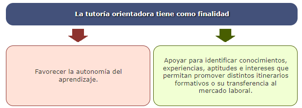

> [!note]
> En la mayoría de los casos, el tutor/a deberá desarrollar **ambos tipos de tutoría** (académica y orientadora) desde un **estilo participativo**, implicando activamente al alumnado en su propio proceso de aprendizaje.

La elaboración de un **plan tutorial** está ligada a una **concepción del aprendizaje** o *paradigma educativo*, que se refleja en los materiales, las prácticas formativas, la evaluación y el modelo comunicativo adoptado.  
Cada paradigma determina un **estilo de tutoría diferente**, en función de cómo el tutor entiende la enseñanza y el aprendizaje.

---

**🧩 Estilo conductista**

El **paradigma conductista** exige al tutor/a aplicar una **técnica sistemática** para desarrollar su labor:

- Definir explícitamente los **objetivos** del plan tutorial.  
- Presentar la información de forma **secuencial**.  
- **Individualizar** la enseñanza, adaptándose al ritmo de cada estudiante.  
- Registrar los resultados mediante una **evaluación continua**.

> [!note]
> Propio de esta concepción es la **tutoría burocrática**, centrada en la **revisión de evaluaciones**, la **atención a problemas o quejas**, y la **gestión de documentación oficial**.

---

**🌱 Estilo humanista**

El **paradigma humanista** pone el énfasis en el **desarrollo integral de la persona**, centrándose en la **autorrealización** y la **valorización de los procesos afectivos**.  
El tutor/a debe:

- Reconocer las **necesidades específicas** de cada persona y ofrecer una **atención personalizada**.  
- Rechazar **posturas autoritarias o egocéntricas**, fomentando la **no directividad**.  
- Crear un **clima de confianza** que facilite la comunicación.  
- Mostrar **generosidad en el intercambio de conocimientos y experiencias**.

> [!note]
> Este estilo favorece la **tutoría docente**, que amplía la información ofrecida en el aula y promueve una **interacción en pequeños grupos**, basada en la **participación y el diálogo**.

---

**🧠 Estilo cognitivo**

El **paradigma cognitivo** considera al estudiante como un **procesador activo de información** y busca desarrollar sus **habilidades para aprender y resolver problemas**.  
El tutor/a debe:

- Diseñar estrategias para **activar conocimientos previos**.  
- Reconocer y considerar las **expectativas** del alumnado.  
- **Orientar la atención** del estudiante y **organizar la nueva información**.  
- **Relacionar los conocimientos previos** con la información nueva para favorecer la comprensión.

> [!note]
> Este estilo es característico de la **tutoría académica**, donde se prioriza la **resolución de dificultades con los contenidos**, la búsqueda de **fuentes de documentación** y la **realización de trabajos prácticos**.

---

**🌍 Estilo sociocultural**

En el **paradigma sociocultural**, el tutor/a actúa como un **agente cultural**, trabajando en un contexto de **prácticas y medios socialmente determinados**.  
Su objetivo es desarrollar las siguientes capacidades en el alumnado:

- Fomentar la **participación activa** en las tareas y actividades.  
- Promover **situaciones de debate e investigación**.  
- Impulsar el **uso autónomo y autorregulado** de los contenidos.

> [!note]
> Este estilo se asocia con la **tutoría como asesoría personal**, basada en la **aceptación mutua entre docente y alumno**, y en la **atención personalizada** a sus aspectos **intelectuales, sociales, académicos y personales**.

---

**🏗️ Estilo constructivista**

El **paradigma constructivista** reconoce al alumno/a como un **constructor activo de su aprendizaje** y, al mismo tiempo, de su **personalidad**.  
El tutor/a actúa como **guía y facilitador del conocimiento**, promoviendo la reflexión y la colaboración.  
Entre sus principales acciones están:

- Suscitar **conflictos cognitivos**, hipótesis y cuestionamientos.  
- Facilitar la **comprensión**, relacionando el conocimiento empírico con el académico.  
- Impulsar la **consolidación y transferencia** del conocimiento, ayudando a **organizar nuevas estructuras mentales**.  
- Fomentar la **construcción cooperativa del conocimiento** mediante el diálogo, el debate y la búsqueda grupal de soluciones (una modalidad sería la **tutoría entre pares**).  
- Promover la **reflexión y la elaboración personal** del aprendizaje.

> [!note]
> Este estilo incluye la **orientación académica y profesional**, ayudando al alumnado a **transferir los aprendizajes** a otros contextos y a su desarrollo personal.

---

##### 2.3.2.2. Principios

Para fomentar la **acción tutorial y la orientación** en los cursos de **Formación Profesional para el Empleo (FPE)**, es necesario tener en cuenta los siguientes **principios fundamentales**:

- **🎯 Finalidad de la formación integral**  
  El objetivo principal de cualquier acción educativa es la **formación integral de la persona**.  
  En este sentido, la **función tutorial** tiene un papel esencial para alcanzar dicho propósito, contribuyendo al desarrollo completo del alumnado tanto en el ámbito académico como personal y profesional.

- **🌈 Atención a la diversidad**  
  Cada grupo de alumnos/as en un curso será **heterogéneo**.  
  La acción tutorial debe **adaptarse a la diversidad del grupo**, respondiendo a las **necesidades individuales** de cada participante.  
  La formación ha de ser **personalizada**, y la **metodología flexible**, ajustándose a la realidad de cada grupo.

- **🤝 Orientación asumida por el equipo docente**  
  La **tutoría y la orientación** deben ser asumidas de manera **colectiva** por el **equipo docente**.  
  El tutor/a puede apoyarse en otros profesionales —como el **coordinador/a**, **especialistas**, **administrador/a de plataforma** (en el caso online) o **secretaría**— para resolver dudas y problemas puntuales.

- **👥 Orientación grupal e individual**  

  La orientación debe entenderse en una **doble dimensión**:  

  - **Grupal**, para trabajar aspectos comunes del proceso formativo.  
  - **Individual**, para atender las necesidades específicas de cada estudiante.

- **🧭 Autonomía de los estudiantes**  
  El objetivo final de la acción tutorial y la orientación en la FPE es **favorecer la autonomía del alumnado**, ayudándole a **tomar decisiones** relacionadas con su aprendizaje y con la materia estudiada.

- **🔄 Proceso continuo y sistemático**  
  La acción tutorial y la orientación deben concebirse como un **proceso continuo y sistemático** que **acompaña al alumnado durante toda la formación**.  
  No se trata de una tarea puntual ni de intervenciones aisladas, sino de un **elemento constante del proceso educativo**, que refuerza el aprendizaje y la integración de los participantes.

---

## 3. Estrategias de aprendizaje autónomo. Estilos de aprendizaje

### 3.1. Aspectos generales

Para fomentar la acción tutorial y la orientación en los cursos de FPE debemos tener en cuenta los siguientes principios:

- 👩‍🏫 La **Formación para el Empleo (FPE)** cuenta principalmente con **alumnos adultos**, que presentan características y rasgos propios que ayudan a los tutores/as a orientar el diseño del curso.
- 🧠 La principal característica del adulto es su **capacidad para utilizar estrategias de aprendizaje autónomo**.
- 📚 Entendemos por **autonomía en el aprendizaje** la facultad que permite al estudiante **tomar decisiones para regular su propio aprendizaje**, según la meta que persiga y las condiciones del contexto (Monereo y Castelló, 1997).
- 🎯 Como futuros docentes debemos desarrollar estrategias que fomenten el **aprendizaje autónomo en el alumnado**, no solo porque los adultos ya poseen esa capacidad, sino porque los cambios sociales, culturales, educativos y económicos de finales del siglo XX y comienzos del XXI hacen necesario potenciarla.
- 🌍 Desde comienzos del siglo XXI, el sistema de formación se centra en:
  - 🏫 Proporcionar **educación de calidad** a todos los niveles del sistema educativo y de la FPE.  
  - 💡 **Preparar para vivir en la nueva sociedad del conocimiento**.
- 📈 Este nuevo enfoque no solo transforma los procesos de enseñanza y aprendizaje, sino también la forma de evaluar, y busca **capacitar a las personas para el aprendizaje autónomo y permanente**.  
  La autonomía se asocia con la capacidad de **aprender a aprender** y de **regular el propio proceso de aprendizaje**.
  
> [!note] Cita
> “Si tuviéramos que elegir un lema, un mantra que guiara las metas y propósitos de la escuela del siglo XXI, sin duda el más aceptado […] entre educadores e investigadores […] sería el que la educación tiene que estar dirigida a ayudar a los alumnos a aprender a aprender”  
> — *Pozo y Monereo (2002)*

Una presunción errónea es identificar el **aprendizaje autónomo** con el **autodidactismo**, entendido como el aprendizaje en el que el alumno prescinde totalmente del docente.  
De igual forma, tampoco debe confundirse con la **autoformación**, ya que esta hace referencia al proceso formativo del adulto decidido libremente, orientado a la adquisición de conocimientos según su propio proyecto personal.

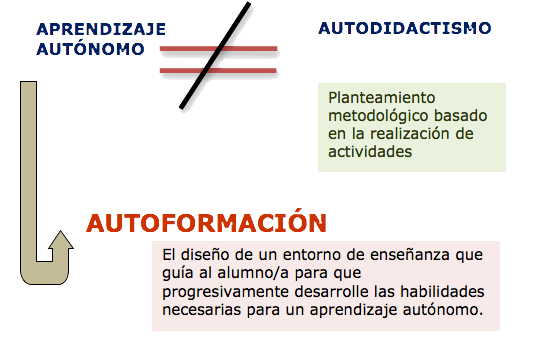

El **aprendizaje autónomo** debe basarse en la idea de que el estudiante es una **parte activa y fundamental del proceso de enseñanza-aprendizaje**.  
Según Cochram-Smith (2003), el proceso educativo debe centrarse en **la persona que aprende** y no solo en los contenidos; lo más importante es **saber cómo se aprende**.

Una persona autónoma es “aquella cuyo sistema de autorregulación funciona de modo que le permite satisfacer exitosamente tanto las demandas internas como externas que se le plantean” (Bornas, 1994).

En la base del aprendizaje autónomo se encuentra el concepto de **“aprender a aprender”**, es decir, que el participante sea consciente de sus propios procesos mentales (cómo aprende) y de su dominio cognitivo (su forma de aprender), con el fin de obtener resultados satisfactorios.  
Implica ser competente para **afrontar y resolver problemas nuevos**, así como para **gestionar proyectos** en distintos contextos (Zimmerman y Schunk, 2001).

**¿Qué implica la capacidad de aprender a aprender?**

- 🔍 **Detectar sus propias necesidades.**  
- 🗂️ **Aprender a recoger información**, registrarla, organizarla y sintetizarla.  
- 🧭 **Planificar la actuación de aprendizaje** que resulte más adecuada.  
- ✅ **Evaluar** el proceso para **mejorar en futuras actuaciones**.

Esta capacidad está influida por varios factores:

- 👤 **La propia persona**, con sus características de personalidad.  
- 📘 **La tarea**, según su dificultad, magnitud o profundidad de conocimientos.  
- 🌍 **El ambiente** donde se desarrolla el aprendizaje, que puede dificultar o favorecer la tarea.

> [!note]  
> Según los **informes de PISA**,  
>
> - La **autorregulación del estudiante** es una variable clave para el aprendizaje.  
> - Y actúa como un **marco de referencia para el aprendizaje a lo largo de la vida**.

---

### 3.2. Estrategias de aprendizaje autónomo

El **aprendizaje autónomo** exige que los alumnos/as incorporen determinadas **estrategias** que les permitan afrontar situaciones de aprendizaje de todo tipo.

Las **estrategias de aprendizaje** se entienden como el proceso mediante el cual el alumno/a **elige, observa, piensa y aplica los procedimientos más adecuados** para conseguir un fin.  
Son las que guían, ayudan y determinan el modo de aprender.

Los docentes deben tener presente que, para enseñar a “**aprender a aprender**”, es necesario **incluir la enseñanza de estrategias de aprendizaje** dentro de la planificación formativa.

🟡**Los objetivos de estas estrategias son:**

1. 💭 **Aumentar la conciencia** del estudiante sobre su estado afectivo y motivacional, así como sobre las operaciones mentales que realiza al aprender o resolver una tarea.  
2. 📚 **Mejorar el conocimiento declarativo y procedimental** sobre las estrategias que puede utilizar, y fomentar el control consciente de las mismas.  
3. 🔄 **Favorecer la transferencia** de estrategias empleadas a nuevas situaciones, comprendiendo las condiciones en las que se produce la resolución de tareas o el aprendizaje de contenidos.

> [!important]
> El tutor, para propiciar el aprendizaje autónomo, debe favorecer la **motivación**, la **autoconfianza** y la **autoevaluación**.  
> Debe ayudar al alumnado a revisar sus avances, dificultades y éxitos, y a planificar su propio aprendizaje para mejorar de forma continua.

🟡**Estrategias tutoriales para favorecer el aprendizaje autónomo:**

| **Tipo de estrategia**                 | **Descripción**                                              |
| -------------------------------------- | ------------------------------------------------------------ |
| 📖 **Estrategias afectivo-emocionales** | El participante debe ser consciente de su capacidad y estilo de aprendizaje, lograr **motivación intrínseca** hacia la tarea y desarrollar **autoconfianza** para superar las dificultades. |
| 🗓️ **Estrategias de autoplanificación** | Se relacionan con el diseño de un **plan de estudio realista y efectivo** que permita identificar metas, analizar las condiciones de la tarea y seleccionar las estrategias más adecuadas (lectura, uso de recursos tecnológicos, mapas mentales, ideas previas, etc.). |
| ⚙️ **Estrategias de autorregulación**   | Permiten **revisar los avances, dificultades y éxitos** alcanzados, tomar decisiones sobre las acciones a realizar y ajustar las condiciones para conseguir los objetivos de aprendizaje. |
| ✅ **Estrategias de autoevaluación**    | ▫️Se centran en la **evaluación que el propio participante realiza** sobre sus actividades, estrategias y resultados.  ▫️Evalúa su progreso, extrae conclusiones de la experiencia y se refuerza positivamente ante los logros alcanzados (Bornas, 1994). |

🟡**Algunas ideas para ayudar a otras personas a “aprender a aprender”:**

- 💡 Ayudarles a **descubrir**.  
- 🧠 Ayudarles a **inventar**.  
- 🛠️ Ayudarles a **producir**.  
- 🧩 Ayudarles a **conceptualizar**.

---

### 3.3. Dimensiones de aprendizaje autónomo

Para conseguir una mayor **autonomía en el proceso de aprendizaje**, las siguientes dimensiones deben concretarse en el entorno educativo —sea este virtual o presencial—, en el diseño de materiales, en la actuación del tutor/a y en el propio proceso de aprendizaje.

| **Dimensión**                                        | **Descripción**                                              |
| ---------------------------------------------------- | ------------------------------------------------------------ |
| 🧠 **Manejo de estrategias metacognitivas**           | Para lograr una mayor autonomía, el estudiante debe manejar en profundidad las **estrategias metacognitivas**. Según Monereo, una acción estratégica se caracteriza por:  ▫️**Consciencia:** el estudiante debe ser consciente de las estrategias que elige y reflexionar sobre su eficacia. ▫️**Adaptabilidad:** debe ser flexible y capaz de ajustarse a los cambios en las condiciones de aprendizaje. ▫️**Eficacia:** debe evaluar las condiciones y objetivos para elegir la estrategia más adecuada. ▫️**Sofisticación:** mediante la práctica, las estrategias evolucionan, volviéndose más eficaces y de mayor calidad. |
| 🎯 **Uso estratégico de estrategias**                 | Con el tiempo, el estudiante hará un **uso estratégico de los procedimientos de aprendizaje**, pasando del dominio técnico a la selección consciente e intencionada de la estrategia más adecuada para lograr sus metas. |
| ⚙️ **Autorregulación de los procesos de aprendizaje** | Al principio, el alumno necesitará la guía constante del docente, pero conforme avance y mejore sus estrategias, **irá ganando control sobre su propio aprendizaje**, siendo capaz de autorregular su progreso. |
| 💬 **Exteriorización de procesos**                    | A medida que el estudiante desarrolla su capacidad de aprendizaje, aumenta su **conciencia sobre los procesos que sigue** antes, durante y después del aprendizaje. Repite los que le resultan exitosos y mejora los que considera menos eficaces. |

> [!tip]
> Para profundizar y comprender mejor el concepto de **metacognición**, te recomendamos ver el siguiente vídeo: 
>
> 

> <iframe width="560" height="315" src="https://www.youtube.com/embed/R5ntsN6i2w8" title="Video sobre metacognición" frameborder="0" allowfullscreen></iframe>
> 

---

### 3.4. Fases del aprendizaje autónomo o autorregulado

Como vimos en el apartado anterior, los estudiantes capaces de **autorregularse y trabajar de forma autónoma** lo logran porque participan activamente en su proceso de aprendizaje y lo orientan hacia los resultados.

> [!important]
> Según **Schunk y Zimmerman (1998)**, la autorregulación del aprendizaje es un proceso abierto que requiere una **actividad cíclica** por parte del estudiante.  
> Este proceso ocurre en **tres fases principales**, dentro de las cuales se desarrollan distintos procesos y subprocesos.

---

**🕐 Fase previa**

Esta fase se centra en los siguientes aspectos:

- 🎯 **Establecimiento de objetivos**  
  Permite concretar los resultados de aprendizaje que el estudiante desea alcanzar.  
  Los alumnos/as que se orientan al **proceso de aprendizaje** obtienen mejores resultados que quienes solo se centran en la tarea.

- 🧭 **Planificación estratégica**  
  En esta etapa, el estudiante selecciona la **estrategia o método más adecuado** para lograr los objetivos establecidos.

- 💭 **Creencias motivacionales**  
  Tanto la fijación de objetivos como la planificación están condicionadas por **creencias personales**, como la percepción de autoeficacia o el valor atribuido a la tarea.  
  La **autoeficacia** es la creencia que tiene cada estudiante sobre su capacidad para aprender o alcanzar los objetivos.  
  Si un alumno piensa que no es capaz, probablemente no se implicará en el proceso de aprendizaje.  
  En cambio, los estudiantes persistentes mantienen su esfuerzo e implicación incluso ante resultados no inmediatos, gracias a su interés en la propia tarea.

---

**⚙️ Fase de realización**

Incluye los procesos que permiten que el estudiante **centre la atención en la tarea de aprendizaje**.

- 🔎 **Autocontrol**  
  Implica focalizar la atención, utilizar las estrategias planificadas, darse **autoinstrucciones** y apoyarse en **imágenes mentales**.  
  Según **Kuhl (1985)**, la atención debe protegerse de los distractores que compiten con la tarea de aprendizaje.  
  Como señalan **Pintrich y Zusho (2002)**, los alumnos capaces de regular su aprendizaje ante distractores y dificultades **aprenden más rápido y obtienen mejores resultados**.  
  Además, las **autoinstrucciones** y protocolos reducen errores y mejoran el aprendizaje (**Schunk, 1984**).

---

**💬 Fase de autorreflexión**

Comprende una serie de procesos que permiten **evaluar y ajustar el aprendizaje**:

- 🧾 **Autoevaluación**  
  Consiste en comparar los resultados obtenidos con los esperados.  
  Por ejemplo, al realizar un ejercicio de cálculo, el alumno puede verificar sus respuestas con un manual de soluciones.

- ⚖️ **Atribuciones causales**  
  Se refieren a cómo el estudiante **interpreta las causas** de sus éxitos o fracasos.  
  Estas atribuciones influyen directamente en la motivación y la implicación.  
  Los alumnos autorreguladores suelen **evaluar sus resultados con más frecuencia y de forma más objetiva**, lo que mejora su adaptación al aprendizaje (**Zimmerman y Paulsen, 1995; Zimmerman y Kitsantas, 1997**).

- 🌱 **Reacciones o autorreacciones**  
  Las reacciones positivas fortalecen la **autoeficacia** y aumentan el interés por aprender.  
  Cuanto más satisfecho se siente el estudiante con su progreso, mayor es su motivación.  
  Estos procesos son **cíclicos**, de modo que los resultados de una fase **influyen en la siguiente** (**Zimmerman, 2002**).

---

> [!tip]
> Para profundizar en el aprendizaje autorregulado, te recomendamos ver el siguiente vídeo del grupo de investigación **EVALfor**, sobre los **tipos de autorregulación del aprendizaje**:

<iframe width="560" height="315" src="https://www.youtube.com/embed/Adtjagn4Fzk" title="Video sobre autorregulación del aprendizaje" frameborder="0" allowfullscreen></iframe>

---

### 3.5. Estilos de aprendizaje autónomo

El **estilo de aprendizaje** es la forma preferida de **pensar, procesar y entender la información** que tiene cada persona.  
Junto con la autorregulación —la capacidad para dirigir la propia conducta—, influye directamente en el **aprendizaje significativo**.

Según **Alonso, Gallego y Honey (1975)**, el proceso de aprendizaje es **cíclico** y se compone de cuatro estilos básicos:

- 🌀 **Estilo activo**  
  Se caracteriza por personas **creativas**, **novedosas**, **participativas** y **competitivas**.  
  Les gusta **generar ideas**, **probar cosas nuevas** y asumir **riesgos**.  
  **Características principales:** animadores, improvisadores, descubridores, arriesgados y espontáneos.

- 🔍 **Estilo reflexivo**  
  Corresponde a personas **observadoras**, **pacientes** y **cuidadosas**.  
  Prefieren analizar la información antes de actuar y prever diferentes alternativas.  
  **Características principales:** ponderados, concienzudos, receptivos, analíticos y exhaustivos.

- 🧩 **Estilo pragmático**  
  Propio de personas **técnicas**, **útiles** y **realistas**, que buscan **resultados concretos** y la **aplicación práctica** de lo aprendido.  
  Se centran en **experimentar** y **poner en marcha** lo aprendido de forma eficaz.  
  **Características principales:** prácticos, directos, eficaces, realistas y planificadores.

- 🧠 **Estilo teórico**  
  Caracteriza a personas **disciplinadas**, **metódicas** y **sistemáticas**, que buscan comprender el porqué de las cosas.  
  Relacionan ideas y conceptos para construir una visión estructurada del conocimiento.  
  **Características principales:** lógicos, objetivos, críticos, estructurados y perfeccionistas.

  

El concepto de los estilos de aprendizaje está directamente relacionado con la **concepción del aprendizaje como proceso activo**.  
La forma en que elaboramos y asimilamos la información puede variar según el contexto, y en determinadas circunstancias pueden aparecer **bloqueos en el aprendizaje**.

🟣**Bloqueos del aprendizaje asociados a cada estilo:**

- ⚡ **Estilo activo:** miedo al ridículo, ansiedad ante cosas nuevas, falta de confianza en sí mismo o necesidad excesiva de pensar detenidamente las cosas antes de actuar.  
- 🕰️ **Estilo reflexivo:** impaciencia por comenzar la acción, resistencia a escuchar analíticamente, tendencia a cambiar rápidamente de una actividad a otra o dificultad para presentar las cosas por escrito.  
- 🧮 **Estilo teórico:** bloqueos asociados a preferir la intuición y la subjetividad, la espontaneidad y el riesgo, o el desagrado ante enfoques estructurados y organizados; también a dejarse llevar por las primeras impresiones.  
- 🧱 **Estilo pragmático:** tendencia a dejar temas abiertos, no comprometerse en acciones específicas, distraerse con temas marginales o considerar que las ideas de los demás no funcionan si se aplican a su propia situación.

---

## 4. La comunicación online

### 4.1. Aspectos generales

Internet ha supuesto una auténtica **revolución en nuestra vida cotidiana**.  
Hoy podemos **comprar**, **comunicarnos**, **leer noticias**, **compartir conocimientos** o **formarnos** a través de la red.

> [!important]
> La **comunicación online** ha evolucionado al mismo ritmo que Internet.  
> A medida que la web se desarrolla, surgen **nuevos espacios y herramientas comunicativas**.
>
> En sus inicios, la comunicación online se basaba principalmente en el **correo electrónico**, un medio **asíncrono** y **escrito**.  
> Más tarde, apareció la **comunicación síncrona** mediante el **chat**, que seguía siendo textual pero en tiempo real.  
>
> Actualmente, gracias a herramientas como **Skype** o las **videollamadas**, podemos **ver y escuchar** a las personas con las que hablamos, combinando **video y audio en directo**.

- 💬 La **formación e-learning** se apoya en gran medida en la **comunicación online**, entendida como un método de comunicación entre dos o más equipos conectados a Internet, sin importar la distancia.  
- 📚 En los últimos años ha crecido la bibliografía y los estudios sobre **comunicación online** y su aplicación en ámbitos como la **empresa** o el **marketing**.  
- 🎓 En esta unidad nos centraremos en la **comunicación online dentro del ámbito formativo**, fundamental en los entornos virtuales de aprendizaje.

---

### 4.2. Reglas para una comunicación eficaz

En una actividad en grupo es fundamental que los miembros sepan **comunicarse de forma eficaz**.  
En un contexto de aprendizaje en red, es necesario respetar una serie de **reglas simples** para lograr una comunicación clara y completa:

- **🧍‍♀️ Personalizar el mensaje**  
  Conviene utilizar formas que **personalicen la comunicación**, ya que esto facilita la respuesta del receptor y expresa mejor las intenciones del emisor.

- **💬 Hacer que el mensaje sea claro, completo y apropiado**  
  Debemos prestar atención a varios aspectos:
  - **Cantidad:** la información debe ser adecuada a la finalidad del mensaje.  
  - **Calidad:** exponer la información de manera coherente.  
  - **Relación:** incluir solo información pertinente.  
  - **Modalidad:** priorizar la claridad, la sencillez y el orden. Evitar ambigüedades.

- **📚 Adaptar el mensaje al conocimiento del receptor**  
  No basta con usar palabras comprensibles: es importante **estructurar el mensaje teniendo en cuenta el punto de vista y los conocimientos** de quien lo recibe.

- **💓 Expresar sentimientos y emociones**  
  En una comunicación abierta debe reflejarse **atención, estima, aceptación, apoyo y cordialidad**, elementos que fortalecen las relaciones humanas.

- **📨 Responder de forma eficaz**  
  Quien recibe un mensaje debe **interpretarlo correctamente**, pero este proceso puede verse afectado por:
  - El juicio previo sobre quien escribe.  
  - Los conocimientos del receptor.  
  - La distracción o asociación con otros pensamientos.  
  - La dificultad para captar la intención del mensaje.  
  - La tendencia a seleccionar parte del contenido comunicativo.  
  Es importante prestar especial atención a los mensajes que expresan una **petición de ayuda**, ya sea de tipo **académico o emocional**.

Algunos errores comunes en la comunicación:

- ❌ **Aconsejar y evaluar:** frases como “tengo la impresión de que ves las cosas de forma muy dramática” o “hacer eso sería una locura” mezclan juicios de valor con consejos, generando defensividad y pudiendo interpretarse como un gesto de autoridad.
- ❌ **Analizar e interpretar:** comentarios del tipo “te lo advertí” o “si hubieras estudiado antes…” buscan explicar las causas del problema en lugar de ayudar a resolverlo. **Quién lee necesita ayuda de como resolverlo, no que le digan cómo se originó**.  
- ❌ **Tranquilizar o restar importancia:** expresiones como “vamos, no te lo tomes así” o “no es nada importante” pueden parecer consoladoras, pero crean **distancia emocional**.  
  Es preferible **preguntar, comprender y parafrasear**, ya que esto permite obtener más información y ofrecer una **retroalimentación adecuada**.

---

### 4.3. Objetivos de la comunicación en procesos formativos e-learning

En los procesos formativos de **teleformación**, la comunicación tiene como objetivo no solo **apoyar y guiar los aprendizajes**, devolviendo la información pertinente, sino también **favorecer la motivación y el interés de los participantes**.

Los principales objetivos son:

- 💡 **Favorecer la motivación y el interés** de los participantes por el proceso de aprendizaje (acción formativa).  
- 🎓 **Apoyar, guiar y facilitar el aprendizaje**, permitiendo a los participantes aplicar los conocimientos, explicaciones y sugerencias recibidas.  
- 📊 **Seguir y analizar los progresos** de los participantes, ofreciendo **retroalimentación pertinente** para mejorar su desempeño.

---

### 4.4. El lenguaje escrito

#### 4.4.1. Introducción

- 📝 La **comunicación online** se basa principalmente en el **texto escrito**, aunque puede complementarse con audio, vídeo o imágenes. Por ello, debemos tener especial cuidado con la forma de escribir.  
- ✍️ El **lenguaje escrito** es la representación de una lengua mediante un sistema de escritura que permite **relacionarnos con los demás**.  
- 📐 Según **Vygotsky**, el lenguaje escrito es “**el álgebra del lenguaje**”. Otros autores lo consideran un poderoso instrumento del pensamiento, con incluso **más posibilidades que el lenguaje oral** en algunos contextos.  
- 📚 El lenguaje escrito abarca tanto la **lectura** como la **escritura**, y ambos utilizan los mismos medios (grafías y signos de puntuación).  
  - El que escribe, **lee lo que escribe** y se **autoregula** durante el proceso.  
  - La lectura, a su vez, **solo puede existir después de la escritura**.

---

#### 4.4.2. Características del lenguaje escrito

- 💬 Poca utilización de **códigos no verbales**.  
- 🕰️ Es **duradero**.  
- 📄 El texto es **independiente del contexto**.  
- ⏳ No existe **retroalimentación inmediata**.  
- 👁️ El receptor **capta el mensaje a través de la vista**.  
- ✏️ Es posible **rehacer o revisar** el texto antes de enviarlo.  
- 🧩 Al poder **analizarlo con calma**, se facilita una **mejor comprensión del mensaje**.

---

#### 4.4.3. Principios del lenguaje escrito

Los tutores de **teleformación** deben aplicar, al redactar sus mensajes, los **principios fundamentales del lenguaje escrito**: precisión, claridad, corrección y brevedad.  
Estos garantizan una comunicación eficaz y profesional.

- **🎯 Precisión**  
  - Comunicar exactamente lo que se quiere decir.  
  - Destacar las ideas principales y ordenarlas según el propósito que se desea lograr.

- **💡 Claridad**  
  - Usar un **lenguaje sencillo y correcto ortográficamente**.  
  - Construir oraciones y párrafos en un **orden lógico**, evitando ambigüedades.

- **✂️ Brevedad**  
  - Transmitir la información con el **menor número de palabras posibles**.  
  - Incluir **solo los datos relevantes**, evitando repeticiones o rodeos innecesarios.

- **✅ Corrección**  
  - Emplear una **sintaxis adecuada**.  
  - Utilizar un **vocabulario preciso** y oraciones **correctas gramaticalmente**.

> [!note]
> Si deseas profundizar y mejorar tu forma de expresión escrita, puedes consultar el siguiente recurso: [Lenguaje escrito](https://www.slideshare.net/marioalbertovazquezlugo/lenguaje-escrito-15544690).

---

## 5. La figura del tutor presencial y tutor en línea 

### 5.1. Aspectos generales

- La **enseñanza presencial** y la **enseñanza online** comparten ciertas características, pero el **e-learning** ha supuesto un cambio profundo en los roles de todos los actores de la formación. Cada uno debe adaptarse a un nuevo entorno telemático.

- En la **enseñanza presencial**, el entorno es el aula, donde el grupo de alumnos y el docente se reúnen físicamente. La comunicación es **síncrona**, es decir, ocurre en tiempo real.

- En la **educación online**, el entorno es la plataforma de aprendizaje.  
  La interacción del alumnado se produce a través de **foros, chats, correos electrónicos y materiales web**.  
  En este caso, la comunicación puede ser:  
  - **Síncrona**, mediante chat o videoconferencia.  
  - **Asíncrona**, a través del foro o correo electrónico.

- En este nuevo contexto, el **rol del docente presencial cambia** para adaptarse al entorno digital, aunque mantiene competencias comunes con el tutor online.

**👨‍💻Perfil del docente tutor/a:**

- Conoce a fondo la temática del curso, los materiales y la bibliografía.  
- Comprende las características, necesidades y hábitos de los participantes.  
- Domina las estrategias didácticas y los procesos de evaluación.  
- Muestra interés por las dificultades del alumnado y fomenta un trato cordial.  
- Tiene capacidad de trabajo en equipo, colaborando con otros docentes.  
- Posee madurez emocional, liderazgo, inteligencia y curiosidad cultural.

El término **competencia** hace referencia a una combinación de destrezas, conocimientos, aptitudes y actitudes, así como a la disposición para aprender.  
Por ello, el docente-tutor actúa como impulsor del aprendizaje y facilitador del desarrollo de la competencia de aprender a aprender.

**👨‍💻Competencias clave del docente tutor/a presencial:**

- 🗣️ Habilidades de comunicación, para crear un clima cordial y fomentar el trabajo cooperativo.  
- 🔄 Capacidad de adaptación a las características del grupo.  
- 🧭 Orientación realista en la planificación, favoreciendo el aprendizaje autónomo.  
- 🧠 Mentalidad abierta, receptiva a sugerencias y dispuesta a ajustar la planificación del curso.  
- 📋 Capacidad para realizar el seguimiento individual del alumnado.  
- 🎭 Predisposición a asumir un rol polivalente, adaptándose a las distintas situaciones que puedan surgir en el aula.

---

### 5.2. Estrategias y estilos de tutoría

#### 5.2.1. Introducción

El tutor de formación puede llevar a cabo distintas **estrategias para el logro de los aprendizajes** por parte de los alumnos adultos. Entre éstas:

1. 🗂️ **Planificar y organizar la información**.  
2. 🎯 **Motivar** para iniciar y mantener el interés por aprender: relacionar los aprendizajes con sus intereses, informar frecuentemente de sus logros y progresos, realizar llamadas directas, elogios, ejercicios diversos y tareas graduadas según la dificultad.  
3. 📌 **Explicitar los objetivos** que se pueden alcanzar (profesionales, personales o sociales).  
4. 🧩 **Presentar contenidos significativos y funcionales**, percibidos como útiles y apoyados en experiencias y conocimientos previos.  
5. 🤝 **Solicitar la participación** del alumnado: corresponsabilidad y participación como claves del éxito.  
6. 🧠 **Fomentar el aprendizaje activo e interactivo** mediante técnicas de trabajo intelectual (tomar notas, realizar esquemas, etc.) y la resolución de ejercicios, tareas y aplicaciones prácticas.  
7. 🔎 **Incentivar la autoformación** y el acceso a la información (Internet u otros recursos).  
8. 👥 **Potenciar el aprendizaje colaborativo** entre grupos.  
9. 🔁 **Facilitar la realimentación**, respondiendo a los esfuerzos y logros de forma sincera y honesta.  
10. 🌈 **Reforzar el autoconcepto y respetar la diversidad** del grupo; evitar centrarse en errores o infravalorar por carencias de base.  
11. 🔗 **Promover la transferibilidad de los aprendizajes** para facilitar la retención y el recuerdo de saberes y competencias.  
12. 📊 **Evaluar formativamente el progreso**, para que el adulto pueda reconducir su rendimiento.

En los entornos virtuales de aprendizaje, la figura del tutor es clave para el éxito de la acción formativa: facilita la adaptación al proceso online y su actitud influye en la motivación y dinamización del grupo.

> [!note] Definición  
> 📢 La **Teleformación** es un sistema de **impartición de formación a distancia**, apoyado en las **TIC** (tecnologías, redes de telecomunicación, videoconferencias, TV digital, materiales multimedia) que combina **instrucción clásica** (presencial o autoestudio), **prácticas**, **contactos en tiempo real** (presenciales, videoconferencias o chats) y **contactos diferidos** (tutores, foros de debate, correo electrónico).  
> *FUNDESCO, “Teleformación: un paso más en el camino de la Formación continua”, 1998.*

Por ello, el tutor ha de adoptar una **actitud activa en el aula virtual**: motivar, dinamizar, impulsar, construir conocimiento, promover aprendizaje autónomo y trabajo grupal, de modo que el alumnado sea **protagonista** de su desarrollo y la tecnología una **aliada**.

- 💻 La incorporación de las TIC implica un **nuevo rol docente**: el profesor deja de ser el centro y articula la interacción entre estudiantes, materiales, recursos e información.  
- 🧭 El tutor de teleformación **estimula la participación**, ayuda a **organizar el trabajo autónomo** y **soluciona problemas**: guía, estructura, explica, resuelve dudas, propone y corrige actividades.  
- 🚀 El éxito en cursos virtuales depende, en gran parte, de **estrategias tutoriales** aplicadas dentro de la plataforma: **intervención diaria**, detección de contratiempos y **soluciones alternativas**.  
- 🔗 La **comunicación** (dimensiones, estilos y habilidades) es el **nexo de unión** entre tutor y participante, y el vehículo para adquirir contenidos y competencias.  
- 🧪 El **método inductivo** favorece el aprendizaje autónomo: a partir de actividades prácticas, el alumnado **llega a conclusiones** por sí mismo mediante preguntas y reflexión.  
- 🗣️ Las **técnicas participativas** (debates, proyectos, Phillips 66, etc.) estimulan el aprendizaje **activo y colaborativo**.

> [!note] Más información  
> Puedes escuchar el audio de **UNEDRadio** sobre la acción tutorial en la Universidad a Distancia y su importancia en el desarrollo de los cursos de formación:

<iframe width="560" height="315" src="https://www.youtube.com/embed/Thbw_lkypCc" title="UNEDRadio - Acción tutorial en la Universidad a Distancia" frameborder="0" allowfullscreen></iframe>

---

#### 5.2.2. Competencias del tutor/tutora

> [!important]  
> La actividad de tutorizar una acción formativa online exige al docente **dominio y habilidades en varias competencias**, no solo relacionadas con el contenido que imparte, sino también con el manejo docente del **espacio virtual**.

Las competencias clave del docente tutor/a de teleformación son las siguientes:

- 🎓 **Competencia académica**  
  El tutor debe conocer la temática del curso, pero también manejar la plataforma utilizada, dominando sus herramientas y funcionalidades.  
  Incluye el conocimiento del uso específico de las TIC en su ámbito, el dominio del entorno e-learning, habilidades comunicativas en entornos virtuales, creatividad, innovación y responsabilidad en la evaluación del alumnado.

- 🧭 **Competencias pedagógicas**  
  La acción tutorial debe ofrecer al alumno pautas didácticas que le permitan aprovechar sus habilidades para **aprender de forma autónoma y progresiva**, adaptándose a sus necesidades y ritmo.  
  Comprende habilidades didácticas (incluyendo la didáctica digital), establecimiento de normas de clase (“reglas de juego”), planificación de tutorías, resolución de conflictos, dinamización de grupos, atención a la diversidad y trabajo docente en equipo.

- 💻 **Competencias tecnológicas**  
  Los tutores deben desenvolverse con soltura en entornos virtuales, conociendo el manejo de las herramientas de comunicación más comunes: chats, foros, mensajería, blogs o redes sociales.  
  Estas competencias incluyen el dominio de las TIC, los lenguajes audiovisual e hipertextual, soporte técnico básico, planificación académica, creación de recursos didácticos y uso de herramientas colaborativas tanto internas como externas al aula virtual.

- 🧑‍🏫 **Competencias de orientación**  
  El teleformador actúa como **orientador del aprendizaje**, ayudando a reducir el abandono por aislamiento, fomentando la motivación, la implicación y la conexión entre lo aprendido y la realidad profesional del alumnado.  
  Define estrategias de motivación adecuadas y es responsable de la dinamización del aprendizaje.

- 🏢 **Competencias institucionales**  
  El tutor debe ser consciente de su papel como **intermediario entre el alumnado y la institución** que organiza la formación.  
  Tiene responsabilidades con la organización, como cumplir el plan de trabajo, emitir informes de evaluación y calificar al alumnado, garantizando la coherencia con los objetivos institucionales.

> [!note] 
> La **capacidad pedagógica del tutor** debe complementarse con rasgos personales y actitudinales:  
>
> - Madurez, seguridad y equilibrio emocional.  
> - Autoestima y empatía.  
> - Imaginación y creatividad.  
> - Entusiasmo por enseñar y transmitir pasión por aprender.  
> - Optimismo pedagógico ante las posibilidades de mejora del alumnado.  
> - Liderazgo positivo que inspire y abra horizontes.  
> - Confianza en las capacidades de los estudiantes, reforzando su impulso por demostrar lo que son capaces de lograr.

---

#### 5.2.3. Estilos de tutoría

A lo largo del tiempo se han podido distinguir distintos **estilos de tutor/a**:

- 🗂️ **Tutoría burocrática**  
  En este estilo, el tutor/a realiza funciones administrativas como la revisión de exámenes, atención a reclamaciones, gestión de problemas, quejas y certificaciones.  
  También se encarga de cumplimentar actas y documentos oficiales.

- 📚 **Tutoría académica**  
  Centra su énfasis en el ámbito académico. El tutor/a asesora sobre dificultades en los contenidos, fuentes de documentación, elaboración de trabajos o realización de investigaciones.

- 👩‍🏫 **Tutoría docente**  
  Busca ampliar y completar la formación ofrecida en la clase convencional.  
  Se trabaja con pequeños grupos, se promueve la profundización en temas monográficos, la realización de debates y actividades basadas en la participación y el estilo dialogante.

- 💬 **Tutoría como asesoría personal**  
  Este estilo se basa en una **aceptación mutua** entre profesor y participantes, donde se transmiten valores y actitudes.  
  Implica una atención personalizada y global, atendiendo las necesidades intelectuales, sociales, académicas y personales del alumno/a.  
  Incluye la transmisión de información y la atención a problemas en distintos ámbitos: intelectual, afectivo, social, familiar o profesional.

---

#### 5.2.4. Estrategias del tutor para una tutoría virtual eficaz

El tutor/a online actúa como **facilitador del aprendizaje**. Desde el inicio del curso debe conocer las expectativas, necesidades e intereses del alumnado, por lo que su acción tutorial se basa principalmente en la **interacción continua con el grupo**.  

Según Llorente Cejudo (2006), las siguientes estrategias ayudan a conseguir una tutoría virtual eficaz:

- 🤝 **Establecer relaciones entre todos los participantes del curso**  
  Desde el inicio se debe fomentar la toma de contacto entre todos los alumnos/as.  
  El tutor/a enviará un mensaje individual a cada participante para ofrecerle atención personalizada y otro mensaje al foro de bienvenida, animando a todo el grupo a presentarse y compartir sus motivaciones, intereses y expectativas sobre el curso.

- ❓ **Resolución de dudas**  
  - Es fundamental resolver de forma rápida y eficaz cualquier duda, ya sea de contenido o de organización.  
  - Estas respuestas pueden darse a través del foro o mediante correo electrónico individual.  
  - En las primeras fases del curso suelen aparecer muchas preguntas sobre el funcionamiento de la plataforma o la estructura del curso; si no se atienden pronto, puede disminuir la motivación del estudiante.

- 💬 **Fomentar la participación en los foros de discusión**  
  Durante el desarrollo del curso, el tutor/a debe proponer debates en el foro para **aclarar conceptos, reflexionar en grupo y confrontar ideas**, promoviendo la participación activa del alumnado.

- 🌱 **Motivar a los alumnos/as**  
  La formación e-learning puede generar sensación de soledad o aislamiento.  
  Por ello, el tutor/a debe actuar como un **apoyo constante**, ofreciendo mensajes de refuerzo, orientación individual y acompañamiento a lo largo de todo el proceso de aprendizaje.

---

### 5.3. Roles: activo, proactivo y reactivo

#### 5.3.1. Introducción

Dentro de la acción formativa, el tutor/a puede asumir **dos tipos de actuación principales** que condicionan tanto el proceso de comunicación con los alumnos/as como la manera en que éstos aprenden:

- 🔁 **Animación reactiva**  
  El tutor/a interactúa con el alumno/a **solo cuando éste toma la iniciativa**, por ejemplo:  
  - Cuando el estudiante se conecta.  
  - Cuando plantea una pregunta.  
  - Cuando publica información, dudas o respuestas en el foro o por correo electrónico.  
  En este tipo de tutoría, los contactos son **esporádicos**, el sistema suele encargarse de la corrección automática de evaluaciones, y la comunicación con los demás participantes depende casi por completo de la iniciativa del propio alumno/a.

- 🚀 **Animación proactiva**  
  El tutor/a gestiona **diariamente** las actividades de los participantes, generando propuestas y dinamizando el curso de forma constante.  
  Además, **diseña contenidos adaptados** a las necesidades del grupo o de cada estudiante, lo que permite **individualizar el aprendizaje** y mantener una interacción continua con el alumnado.

---

#### 5.3.2. Roles del tutor de teleformación

En su intervención didáctica, el docente tutor/a puede desempeñar distintos **roles** según el aspecto que se priorice: las relaciones, la orientación, la integración, la dinamización del grupo, entre otros.

- 🧰 **Rol técnico**  
  Conoce y domina las herramientas formativas digitales.  
  Las aplica correctamente y ofrece soluciones al alumnado cuando surgen problemas técnicos o dificultades en el uso de la plataforma.

- 🎓 **Rol pedagógico**  
  Diagnostica las necesidades formativas del alumnado, diseña el proceso de aprendizaje, planifica las actividades, ejecuta las acciones programadas y evalúa la consecución de los objetivos.

- 💬 **Rol dinamizador**  
  Detecta las motivaciones individuales y grupales, utilizándolas para diseñar actividades atractivas que fomenten la participación y den sentido práctico a los contenidos.

- 🤝 **Rol facilitador o mediador**  
  Establece una conexión significativa entre el alumno/a y los conocimientos, impulsando el aprendizaje autónomo.  
  Reconduce el proceso cuando surgen desviaciones, orientando, guiando y apoyando al alumnado en su desarrollo.

- 🌍 **Rol sociocultural**  
  Promueve el contacto y la cooperación entre los miembros del grupo, vinculando la dinámica de aprendizaje con la realidad **social, laboral y cultural** de cada participante.

- 🌱 **Rol desarrollador/a de potenciales**  
  Ayuda a que cada persona identifique y potencie sus talentos, aprovechando sus capacidades dentro del aula para alcanzar el máximo rendimiento posible.

> [!note]
> Relación entre funciones y estrategias del tutor telemático  
> 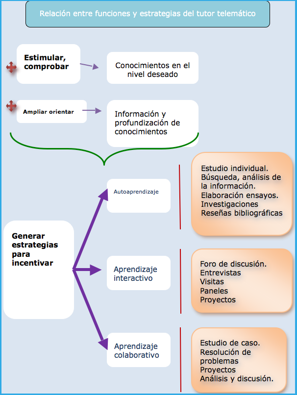

---

### 5.4. Funciones del tutor

#### 5.4.1. Introducción

La función principal del **tutor/a telemático/a** es asegurar que los participantes comprendan los contenidos teóricos y sean capaces de **reflexionar, debatir y aplicar** los nuevos conocimientos en la práctica.

Entre sus principales responsabilidades se incluyen:

1. 💡 Motivar y promover el interés de los participantes en el estudio de las temáticas propuestas.  
2. 🧭 Guiar y/o reorientar a los alumnos en su proceso de aprendizaje, atendiendo sus dudas o dificultades y aportando ejemplos clarificadores.  
3. 📚 Ampliar la información en aquellos temas más complejos o que requieran una explicación adicional.  
4. ✅ Evaluar el proceso de aprendizaje seguido por los participantes.  
5. 🧾 Participar en el diseño de las evaluaciones de aprendizaje.  
6. 🤝 Intervenir en reuniones de coordinación general, aportando datos sobre el alumnado, los materiales y el sistema formativo en general.  
7. 👥 En el caso de tutorías grupales, coordinar los encuentros tutoriales del grupo y proponer **actividades dinámicas** que fomenten la reflexión y la discusión entre los participantes.

De acuerdo con el profesor **García Aretio**, las funciones principales del tutor/a se realizan en **tres niveles** (que veremos a continuación):

- 🧭 **Orientadora**  
- 🏛️ **Institucional**
- 🎓 **Académica**  

---

#### 5.4.2. Función orientadora

La función **orientadora** se centra en el área afectiva, ya que los estudiantes a distancia pueden desmotivarse con facilidad. El tutor/a debe prestar apoyo constante y fomentar la cercanía con el grupo.

- 🧾 Brindar información relacionada con el plan de estudio.  
- 💻 Familiarizar al estudiante con la metodología a distancia y con el uso de los materiales de estudio.  
- 🧠 Proponer a los estudiantes técnicas diversas de trabajo intelectual.  
- 💬 Atender todas las consultas, sean o no académicas, respondiendo con rapidez y cercanía.  
- 🚀 Estimular y motivar a los estudiantes para que participen activamente en el curso.  
- 🤝 Fomentar la interacción dentro del grupo tutelado, promoviendo el trabajo en equipo.  
- ❤️ Evitar que el alumno se sienta solo o aislado, manteniendo una comunicación constante.  
- 📞 Contactar personalmente con los alumnos cuando se percibe riesgo de abandono.  
- 🕊️ Ayudar a reducir la ansiedad o angustia ante dificultades o evaluaciones.

---

#### 5.4.3. Función institucional

La función **institucional** implica actuar como vínculo entre el alumnado, la organización formativa y el equipo docente. El tutor/a representa a la institución y facilita la comunicación interna.

- 🧭 Asumir el rol de referente institucional, canalizando las inquietudes de los estudiantes.  
- 📣 Mantener informados a los participantes sobre todo lo relativo a sus estudios y al programa.  
- 👥 Colaborar y mantener contacto con el resto del equipo docente, soporte técnico, coordinadores y personal administrativo.  
- 📝 Elaborar informes tutoriales que reflejen el seguimiento y progreso de los alumnos.  
- 📚 Conocer y evaluar los materiales de estudio para garantizar su adecuación y calidad.

---

#### 5.4.4. Función académica

La función **académica** busca integrar a los estudiantes en el proceso formativo, anticipar dificultades y garantizar una comprensión efectiva de los contenidos.

- 🎯 Informar a los participantes sobre los objetivos y contenidos del curso.  
- 🧩 Aclarar los prerrequisitos necesarios y ofrecer apoyo para nivelar conocimientos mínimos.  
- ⚠️ Prevenir con antelación posibles dificultades o problemas de aprendizaje.  
- ❓ Resolver dudas sobre los contenidos o las actividades.  
- 📖 Reforzar los materiales de estudio, complementándolos con recursos adicionales según las necesidades detectadas.  
- 🗂️ Ayudar a los alumnos a comprender los objetivos de cada actividad propuesta.  
- 👀 Supervisar el desarrollo del aprendizaje individual de cada estudiante.  
- 🌐 Facilitar la integración y participación activa del grupo.

---

### 5.5. Habilidades tutoriales

La **tutoría** es un proceso de acompañamiento durante la formación, que se concreta mediante la atención **personalizada y grupal**.  
El tutor o tutora debe desarrollar competencias relacionadas con la **comunicación**, la **flexibilidad**, la **capacidad de trabajo**, la **constancia** y la **predisposición a asumir un rol activo y cercano**.

Las principales habilidades del tutor/a son:

- 🤗 **Cordialidad:** crear un ambiente acogedor en el que el participante se sienta respetado y cómodo.  
- 🧍‍♀️ **Reconocimiento y respeto individual:** valorar a cada persona como única, aceptando sus características particulares.  
- 👂 **Escucha activa:** atender con empatía, comprensión y sin interrupciones.  
- 💬 **Capacidad de diálogo y relaciones humanas:** fomentar una comunicación abierta y bidireccional.  
- 🧠 **Espíritu crítico, objetivo y reflexivo:** analizar las situaciones con equilibrio y criterio pedagógico.  
- 🤝 **Autenticidad y honestidad:** no generar falsas expectativas y actuar con transparencia.  
- 🎓 **Experiencia didáctica:** seleccionar contenidos y diseñar actividades adecuadas al perfil del grupo y los objetivos del curso.

El tutor/a debe poseer **habilidades y competencias** que le permitan orientar, preparar y dotar de herramientas al alumnado para facilitar su aprendizaje.

- 🧭 **Como orientador/a:**  
  - Aconseja en la toma de decisiones.  
  - Ayuda a canalizar situaciones nuevas para el alumnado.  
  - Estimula la búsqueda de soluciones ante conflictos o dificultades.

- 🧰 **Como preparador/a:**  
  - Facilita herramientas de trabajo para enfrentarse a diversas situaciones.  
  - Enseña a utilizar correctamente los recursos materiales.  
  - Ayuda a planificar el trabajo personal.  
  - Fomenta la creación de hábitos de estudio.  
  - Provoca la reflexión sobre la acción para mejorar la práctica.

- 🔍 **Como facilitador/a:**  
  - Ayuda al alumnado a modificar concepciones erróneas.  
  - Favorece la aplicación práctica de los conocimientos.  
  - Promueve la conexión entre teoría y práctica.  

Apoyar el aprendizaje en línea mediante herramientas de comunicación **síncronas** (videoconferencia, chat) o **asíncronas** (foros, mensajería) requiere un amplio conjunto de habilidades que garanticen una acción formativa de calidad.

- 💪 **Como motivador/a:**  
  - Mantiene el interés y el entusiasmo del alumnado.  
  - Proporciona realimentación positiva que refuerza la autoestima y la motivación.  
  - Ofrece realimentación constructiva para corregir conductas o enfoques inadecuados.

- 🧾 **Como evaluador/a:**  
  - Valora tanto el proceso de trabajo como los resultados obtenidos.  
  - Participa en la evaluación global, tanto **formativa** como **sumativa**.

- 🔬 **Como promotor/a de la investigación:**  
  - Informa sobre procedimientos de reflexión e investigación activa.  
  - Fomenta la búsqueda de soluciones a través de la indagación.  
  - Promueve el **trabajo en equipo** y la **toma de decisiones participativa**.

---

### 5.6. Organización y planificación de las acciones tutoriales

El **aprendizaje individualizado** tiene como finalidad favorecer la participación del alumnado de acuerdo con su capacidad y ritmo.  
Para lograrlo, el docente tutor debe **verificar el progreso de cada participante** y comenzar ayudándole a **autodiagnosticar sus propias necesidades formativas**.

El tutor contribuye a identificar las necesidades de formación mediante las siguientes acciones:

- 🧠 Ayudar al alumno/a a conocerse y aceptarse, valorándose positivamente.  
- 🎯 Colaborar en la valoración de sus necesidades y competencias.  
- 📚 Orientar en la selección de actividades significativas que conduzcan a un aprendizaje útil y aplicable.  
- 💪 Fomentar una actitud positiva que despierte el interés por la formación.  
- 🔗 Animar a vincular las actividades de aprendizaje con la realidad práctica del trabajo.

El tutor debe **planificar y organizar su actividad** tutorial definiendo tiempos, objetivos, actividades y estrategias didácticas adecuadas.  
Finalmente, será responsable de **evaluar tanto los resultados obtenidos como la eficacia de su propia acción tutorial**.

Las fases de organización y planificación son las siguientes:

- 🧩 **Fase 1: Diseño de objetivos y recursos**  
  El tutor define los objetivos de aprendizaje y selecciona los recursos necesarios, reflexionando sobre sus funciones y el papel que desempeñará durante la formación.

- ⏰ **Fase 2: Planificación de tiempos y actividades**  
  Se determinan los tiempos, el calendario y las actividades necesarias para atender de forma eficaz a los participantes.

- 🧑‍🏫 **Fase 3: Desarrollo del curso**  
  Incluye la ejecución de las actividades de motivación, coordinación, cooperación y aplicación de estrategias didácticas.  
  Es la fase activa donde se concreta la interacción entre tutor y alumnado.

- 🧾 **Fase 4: Valoración de la acción tutorial**  
  Evalúa tanto el funcionamiento general de las tutorías como los resultados obtenidos, comprobando si se han alcanzado los objetivos propuestos.

---

### 5.7. Coordinación de grupos. Búsqueda de soluciones

#### 5.7.1. Principios básicos de trabajo con grupos

El docente tutor de **Formación Profesional para el Empleo** debe tener en cuenta, además de los principios de aprendizaje de las personas adultas (interés, motivación, actividad...), los **principios básicos de trabajo con grupos**, que le ayudarán a gestionar la dinámica y la colaboración entre los participantes.

- 🌱 Crear un ambiente propicio para la **resolución de problemas**, fomentando la comunicación y la participación.  
- 🤝 Promover un **clima de confianza** que facilite la cooperación.  
- 👥 Favorecer un **liderazgo compartido** dentro del grupo.  
- 💬 Fomentar la **comunicación abierta** y el consenso en la toma de decisiones.  
- 🎯 Formular de manera explícita los **objetivos del grupo**.  
- 🔄 Mantener **flexibilidad organizativa** para adaptarse a diferentes contextos y situaciones.  
- 📊 Realizar una **evaluación continua** de los objetivos y actividades del grupo.  

---

#### 5.7.2. Defectos en la comunicación

En los grupos de formación pueden surgir **conflictos o malentendidos** derivados de una comunicación deficiente.  
Aunque los desacuerdos pueden ser constructivos y favorecer el cambio, es importante evitar que deriven en comportamientos agresivos o personales.

- 🌀 No reflexiona previamente sobre lo que quiere decir, improvisando sin orden ni coherencia.  
- ❌ Se expresa sin tener en cuenta si los demás comprenden su mensaje.  
- 🗣️ Da por hecho que todos dominan el tema, sin analizar las razones que le llevan a su opinión.  
- 🔇 Ignora o pasa por alto las aportaciones de otros, sin seguir el hilo del razonamiento colectivo.  
- 👤 Actúa de forma egocéntrica, centrándose solo en sus propias ideas y emociones.  
- ⚖️ Muestra **prejuicios** hacia los demás, afectando la comunicación y el clima del grupo.  

---

#### 5.7.3. Conducción de la tutoría grupal

El tutor/a, al **conducir una tutoría grupal**, debe tener en cuenta la evolución natural del grupo.  
Al inicio pueden aparecer dudas, inseguridad o resistencia a ciertos objetivos, pero con su apoyo y acompañamiento se alcanza progresivamente la **identificación, el compromiso y la madurez colectiva**.

- 🗓️ **Preparación del encuentro:** determinar la forma, fecha y lugar de la convocatoria, así como el orden del día.  
- 🗣️ **Conducción:** elegir el tipo de estructura de trabajo:  
  - Discurso clásico del tutor hacia los participantes.  
  - Interrogatorio, donde el tutor responde preguntas directas.  
  - Diálogo participativo, donde el grupo reflexiona y busca soluciones; el tutor actúa como **facilitador del debate**.  
- 💡 **Participación:** diseñar estrategias que potencien la participación mediante debates, preguntas y presentaciones.  
- 🔧 **Organización del grupo:** definir los canales de comunicación y gestionar adecuadamente las actividades propuestas.  

---

#### 5.8. Supervisión y seguimiento del aprendizaje

Durante la **acción tutorial**, el tutor/a puede emplear distintos **instrumentos de seguimiento** que aporten información útil para analizar el progreso del alumnado y ajustar la intervención formativa según sus necesidades.

Algunos de estos instrumentos son:  

- 🧾 **Cuestionarios iniciales**
- 🧠 **Pruebas diagnósticas**
- 🗣️ **Entrevistas personales**
- 📝 **Informes de seguimiento** 
- 👀 **Técnicas de observación**

Para seleccionar la estrategia o técnica más adecuada, deben considerarse los siguientes factores:

- 👤 **Características personales del participante:** su interés, objetivos, expectativas, conocimientos previos, nivel de concentración, comprensión, habilidades y técnicas de estudio.  
- 📚 **Características del trabajo a realizar:** tipo de contenido, objetivos, nivel de dificultad y estructura del curso o actividad.  
- 🏫 **Características del contexto:** tiempo disponible, entorno de trabajo y materiales necesarios.  
- 🎯 **Planificación y evaluación del aprendizaje:** adecuación de las estrategias empleadas y coherencia con los objetivos formativos establecidos.

---

# Resumen

Las **modalidades de formación** son:  
- 🧑‍🏫 Presencial  
- 💻 A distancia / e-learning  
- 🔄 Mixta  

Las **acciones tutoriales** están diseñadas para que los participantes cuenten con un **apoyo constante** del equipo docente (coordinadores, tutores y formadores) durante todo el periodo formativo.

Los **tipos de tutoría** se clasifican según su finalidad, destinatarios y forma de aplicación:  
- 📘 Tutoría didáctica o académica  
- 🎯 Tutoría orientativa  
- 👤 Tutoría individual  
- 👥 Tutoría grupal  
- 🏫 Tutoría presencial  
- 🌐 Tutoría a distancia  

El **estilo de aprendizaje** es la forma en que cada persona prefiere pensar, procesar y entender la información.  
Junto con la **autorregulación**, influye directamente en el aprendizaje significativo.

Los **objetivos de la comunicación online** son:  
- 💬 Favorecer la motivación y el interés del alumnado durante la acción formativa.  
- 🧭 Apoyar, guiar y facilitar el aprendizaje, permitiendo aplicar conocimientos y sugerencias.  
- 📈 Seguir y analizar los progresos de los participantes y devolver la información pertinente.  

**Perfil del tutor/a:**  
- 📚 Conoce la temática del curso, los materiales y la bibliografía.  
- 👩‍🎓 Identifica las características, necesidades y hábitos de los participantes.  
- 🌐 Comprende las posibilidades y características de la formación presencial y a distancia.  
- 🎓 Domina estrategias didácticas y de orientación del aprendizaje.  
- 👥 Es un buen coordinador/a grupal.  
- 🤝 Se interesa por los problemas de aprendizaje y mantiene buena relación con los alumnos.  
- 🧩 Trabaja en equipo con el resto del personal docente.  
- 🧮 Aplica distintas estrategias evaluativas.  

**Competencias del tutor/a:**  
- 🧠 Competencia académica  
- 🎓 Competencias pedagógicas  
- 💻 Competencias tecnológicas  
- 💬 Competencias de orientación y características personales  
- 🏢 Competencias institucionales  

**Funciones del tutor/a:**  
- 🎯 Función orientadora  
- 📘 Función académica  
- 🏫 Función institucional  

**Habilidades del tutor/a:**  
- 🤗 Cordialidad: acoger al participante y hacerle sentir respetado.  
- 👤 Reconocer y valorar la individualidad de cada persona.  
- 👂 Capacidad de escucha activa.  
- 💬 Habilidad para el diálogo y las relaciones humanas.  
- 🧭 Espíritu crítico, objetivo y reflexivo.  
- 🤝 Autenticidad y honestidad: no generar falsas expectativas en los estudiantes.  

---

# Ejercicios

## Ejercicio 1: Época con recursos

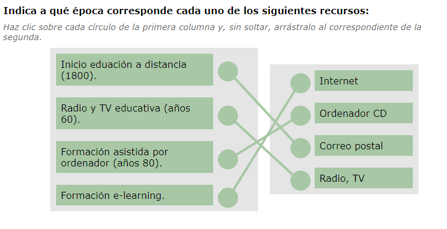

> [!warning]
>
> Esto no se lo cree nadie. Los PC con CD se empezaron a popularizar a mediados de los 90. 

---

## Ejercicio 2: Modalidades. V o F.

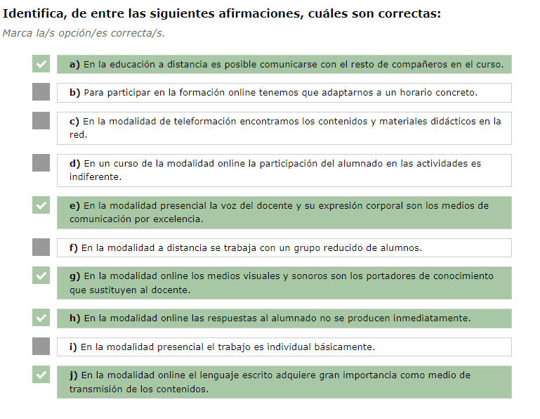

---

## Ejercicio 3: Elementos y modalidad adecuada.

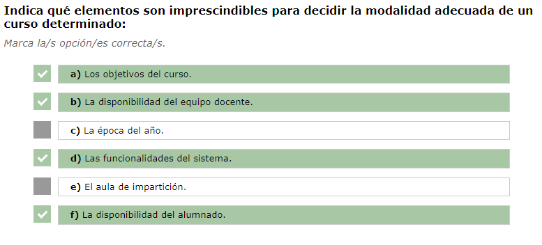

---

## Ejercicio 4: Tipos de tutoría

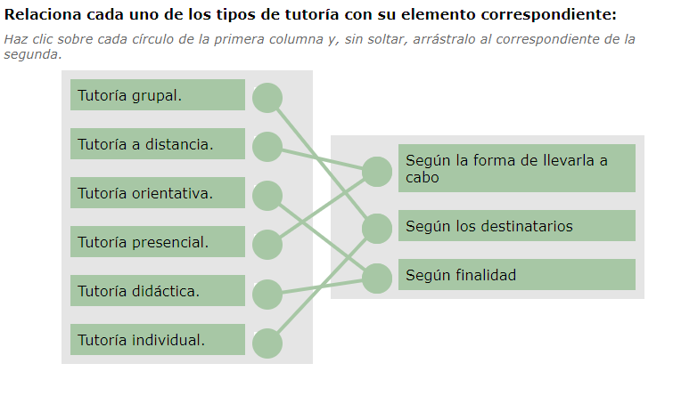

---

## Ejercicio 5: Labores del tutor

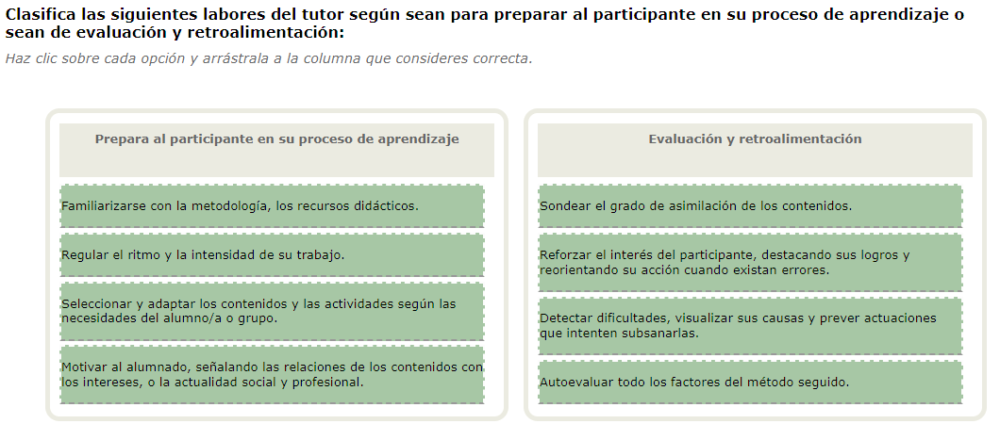

---

## Ejercicio 6: Unir tareas al tipo de tutorías

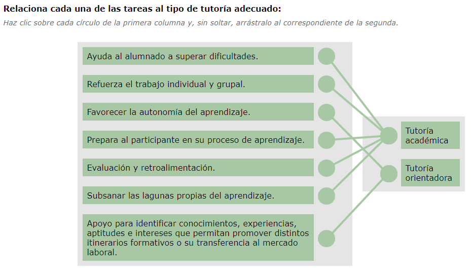

---

## Ejercicio 7: Facilitar la construcción del conocimiento.

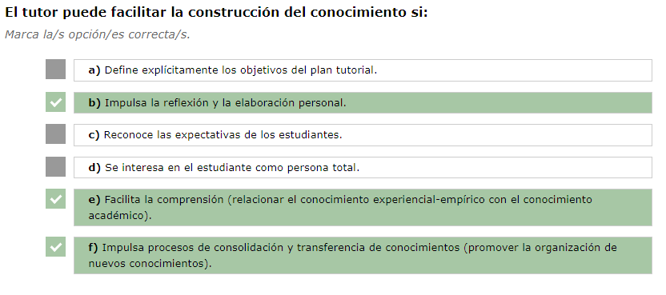

**Correctas:** **b), e), f)**

- **b)** Impulsa la reflexión y la elaboración personal.
- **e)** Facilita la comprensión relacionando experiencia y teoría.
- **f)** Impulsa la consolidación y transferencia de conocimientos.

Estas acciones son propias del **enfoque constructivista**, que es el que “facilita la construcción del conocimiento”. Las otras opciones apuntan a enfoques distintos (conductista: **a**; cognitivo/humanista: **c**, **d**).

---

## Ejercicio 8: Autonomía del aprendizaje

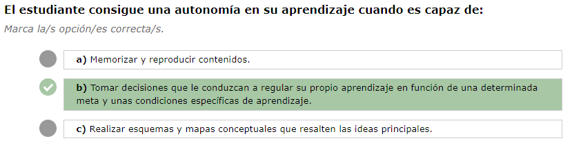

---

## Ejercicio 9: Ordena las fases

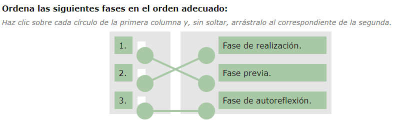

---

## Ejercicio 10: Estilos de aprendizaje. Marca las correctas

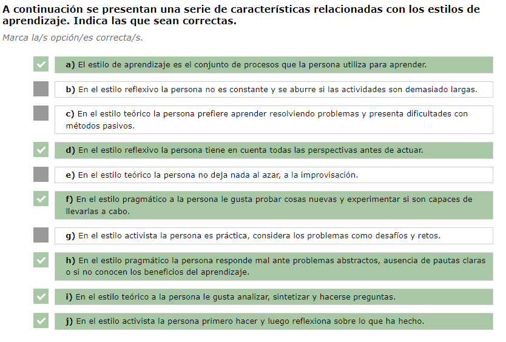

---

## Ejercicio 11: Estilo de aprendizaje

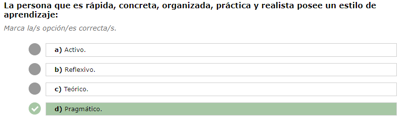

---

## Ejercicio 12: Identifica principios del lenguaje o errores de comunicación

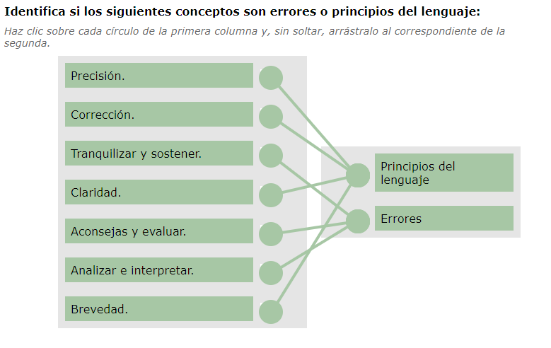

---

## Ejercicio 13: Competencias del tutor y su explicación

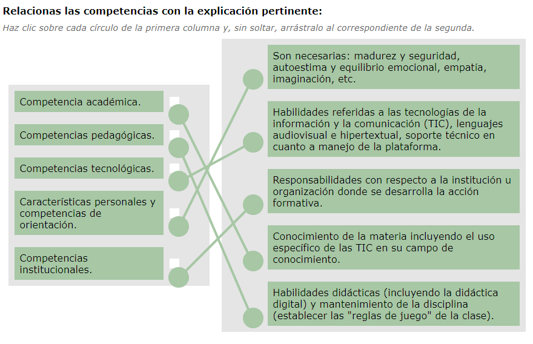

---

## Ejercicio 14: Roles del teleformador

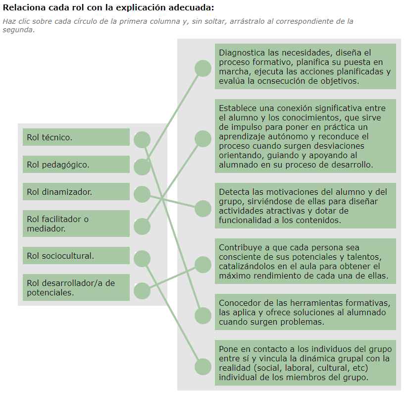

---

## Ejercicio 15: Rol de tutor y habilidad 

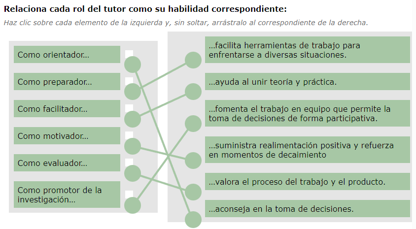

---

## Ejercicio 16: Roles de tutor

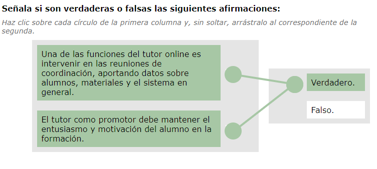

---

## Ejercicio 17:  Relaciona cada tarea con su fase

---

## 🧪 Test final - MF1444 - UF1646 - 01

**1) Las acciones tutoriales en FPE se caracterizan porque:**  
a) El docente promueve el uso de tecnologías en la experiencia formativa, dando lugar a espacios interactivos y a un aprendizaje crítico con una lógica cooperativa, donde prima el asesoramiento y la tutorización.  
b) Debemos aprender toda la vida.  
c) Se observa un esquema donde el docente que expone y el alumnado toma notas.  
d) Solamente se hace un seguimiento del aprendizajes.

**2) Cuando nos referimos a “modalidades de formación” hacemos referencia a:**  
a) La manera en que el docente imparte sus clases.  
b) Las distintas formas en que puede desarrollarse la actividad formativa y el proceso de aprendizaje.  
c) La relación establecida entre el docente y el alumno/a.  
d) El ciclo formativo.

**3) De qué modalidad forman parte la enseñanza asistida por ordenador y el e-learning:**  
a) La modalidad presencial.  
b) La modalidad mixta.  
c) La modalidad a distancia.  
d) La modalidad mixta y la modalidad a distancia.

**4) ¿Qué competencias debería tener un tutor de las modalidades de formación a distancia y mixta?:**  
a) Conocimiento de nuevas tecnologías.  
b) Conocimientos didácticos.  
c) Conocimientos tutoriales.  
d) Todas son correctas.

**5) Como intermediario entre el alumnado y la organización o institución las funciones del formador-tutor son:**  
a) Realizar el seguimiento del proceso de aprendizaje confeccionando informes tutoriales.  
b) Atender a las consultas del alumnado y orientar sobre sus aprendizajes.  
c) Realizar las evaluaciones finales.  
d) Todas son correctas.

**6) Una acción tutorial formativa es:**  
a) Un proceso de acompañamiento y apoyo del aprendizaje, a todos el alumnado, a lo largo del período formativo.  
b) Un proceso de acompañamiento del aprendizaje a lo largo de toda la vida.  
c) Un proceso de apoyo individual.  
d) Es un proceso de evaluación de la formación.

**7) Los distintos tipos de tutorías pueden ser:**  
a) Según su finalidad: Didáctica o académica y Orientativa.  
b) Según los destinatarios: Individual y Grupal.  
c) Según la modalidad: Presencial; A distancia; Mixta.  
d) Todas son correctas.

**8) Un Plan de Acción Tutorial es:**  
a) Una plataforma de gestión del aprendizaje.  
b) Un pliego de condiciones de enseñanza.  
c) Un documento donde se planifica y organiza la tutoría.  
d) Una plataforma de gestión de contenidos de aprendizaje.

**9) Las funciones de una tutoría académica son:**  
a) Preparar al alumno en su proceso de aprendizaje.  
b) Ayudar a superar las dificultades y reforzar el trabajo del alumno.  
c) Evaluar y subsanar lagunas de aprendizaje.  
d) Todas son correctas.

**10) El aprendizaje autónomo es:**  
a) Un aprendizaje autodidacta.  
b) La facultad que le permite al estudiante tomar decisiones que le conduzcan a regular su propio aprendizaje en función de una determinada meta y a un contexto o condiciones específicas de aprendizaje.  
c) Hace referencia a estrategias de estudio.  
d) Aquel que se adquiere a través de la experiencia.

Mostrar respuestas

**1. a)** Es la opción correcta porque en FPE el tutor acompaña, asesora y promueve un aprendizaje cooperativo y activo.  
**2. b)** Hace referencia a las diferentes formas de desarrollar la formación: presencial, a distancia o mixta.  
**3. c)** El e-learning pertenece a la modalidad a distancia, basada en el uso de las TIC.  
**4. d)** El tutor debe combinar competencias tecnológicas, pedagógicas y tutoriales.  
**5. d)** Todas son correctas, ya que el tutor realiza seguimiento, orientación y evaluación.  
**6. a)** La acción tutorial es un acompañamiento continuo del aprendizaje durante todo el curso.  
**7. d)** Todas las clasificaciones son válidas: por finalidad, destinatarios y modalidad.  
**8. c)** Es el documento donde se planifican y organizan las tutorías.  
**9. d)** La tutoría académica cumple todas esas funciones de apoyo y refuerzo del aprendizaje.  
**10. b)** El aprendizaje autónomo implica la capacidad de autorregular el propio proceso de aprendizaje.  

