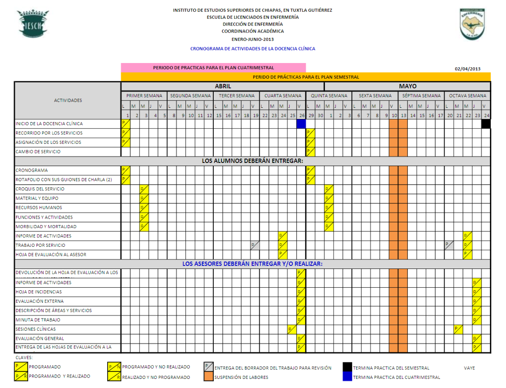
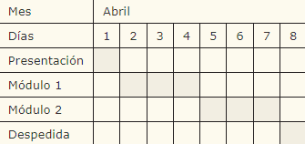
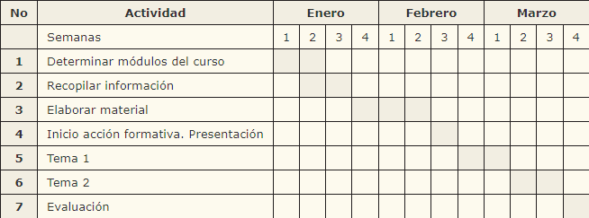
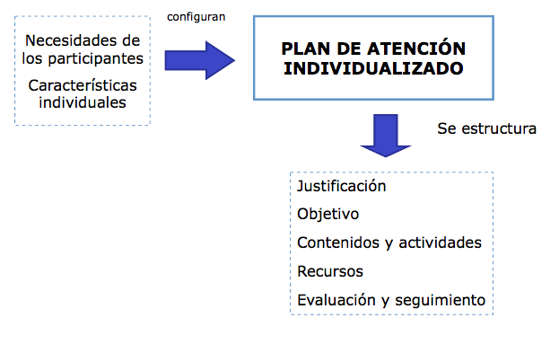
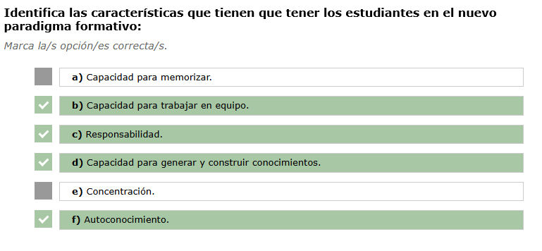
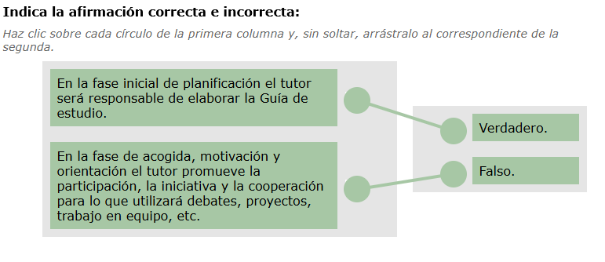
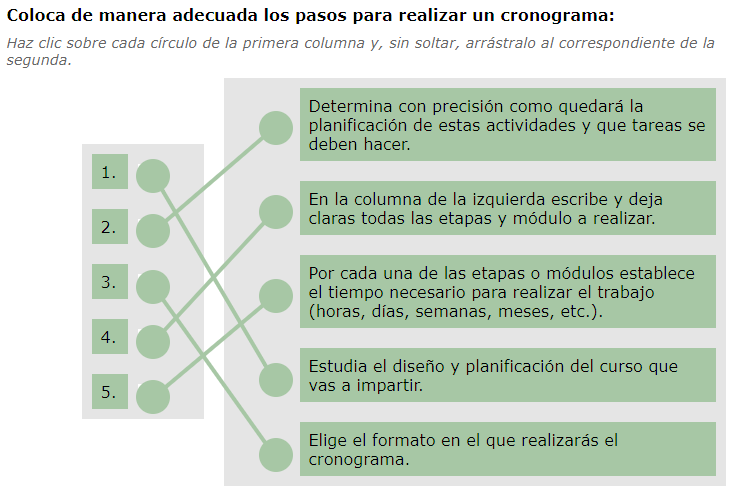
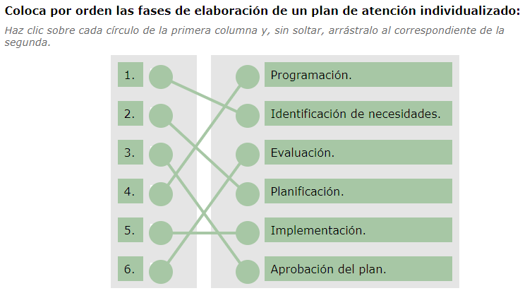

[TOC]

---

# MF1444 - Impartición y tutorización de acciones formativas para el empleo

# UF1646 - Tutorización de acciones formativas para el empleo

# Unidad 02 - Desarrollo de la acción tutorial

## Introducción y objetivos

En esta unidad nos centraremos en el **desarrollo de la acción tutorial**.

🎯 **Objetivo de la unidad:**  
Asesorar a los alumnos en el uso de **estrategias de aprendizaje** y en la **utilización de fuentes de información** que faciliten el desarrollo de la acción formativa para la **adquisición de competencias profesionales**.

---

## 1. Aproximación al tema

- 📘 Tradicionalmente el rol de los estudiantes se ha caracterizado por ser principalmente pasivo: escuchan, leen y memorizan. Una vez han realizado estas tareas, sus conocimientos los volcaban en un examen que corregía invariablemente el docente.  
- 💡 Las actuales teorías de aprendizaje indican que, si realmente queremos que el alumnado no olvide y adquiera de forma permanente unos conocimientos —ya sean conceptuales, procedimentales o actitudinales—, deben implicarse activamente en la construcción de su propio aprendizaje.  
- 🌐 Esta nueva forma de entender los procesos de enseñanza–aprendizaje se ve potenciada por el uso de internet en el aula y por las modalidades de formación *e-learning*.  

A la hora de poner en funcionamiento un plan de acción tutorial existen dos campos de actuación:  
por una parte, los partícipes en el plan y, por otra, la metodología y actividades a desarrollar.  
Los actores son tanto profesores como alumnos y las actividades a proponer cubren todo el periodo de duración de la acción formativa.

> [!important]
> El objetivo de la acción tutorial es **optimizar el rendimiento de la formación** a través de una ayuda adecuada al alumno, atendiendo a sus necesidades y facilitando su competencia de autonomía.

**Elementos de la acción tutorial:**
- 👩‍🏫 Los docentes y los participantes.  
- 🧩 La metodología: individualizada o grupal, y las actividades a realizar durante todo el periodo formativo.

---

## 2. Características del alumnado

### 2.1. Aspectos generales

Las características de los alumnos y alumnas son muy variadas, ya que existe una gran diversidad de participantes.  

Los grupos suelen estar formados por estudiantes que:  
- 🌍 Proceden de marcos socioeconómicos, culturales y lingüísticos muy distintos.  
- 🗺️ Son de diferentes países.  
- 🎓 Han cursado itinerarios previos de estudios en sus países de origen.  
- 👥 Tienen edades diferentes.  
- 💭 Poseen deseos, aspiraciones y motivaciones diferentes.  
- 💼 Cuentan con expectativas ligadas a la mejora inmediata de sus condiciones laborales y personales.  
- ♿ Parten de necesidades educativas especiales (incluso puede haber personas con discapacidades).  

La formación *online* y las últimas tendencias formativas buscan un **cambio en los modelos de aprendizaje**, fomentando un aprendizaje activo en el que los alumnos tomen un papel protagonista en su proceso formativo.  

Se pretende superar los modelos tradicionales de educación basados en la transmisión de conocimiento, apostando por **modelos participativos**, centrados en la **capacidad crítica del estudiante**.  
El docente deja de ser un mero transmisor de contenidos para convertirse en un **facilitador del aprendizaje**.

---

### 2.2. Limitaciones del alumnado adulto de FPE

En ocasiones, los adultos presentan **ansiedad**, **inseguridad ante su capacidad** o ante **situaciones nuevas**, así como **dificultades para trabajar en equipo**, ya sea por su personalidad, exceso de individualismo o falta de tiempo para una mayor dedicación.  

Sin embargo, una vez superados estos límites, suelen alcanzar un **alto grado de profundización** en las tareas que realizan.

Entre las principales limitaciones y diferencias que pueden encontrarse están:  
- 👶👴 **Edad:** abarca grandes diferencias, desde adolescentes (16–18 años) hasta adultos mayores de 50 años.  
- 💭 **Deseos, aspiraciones y motivaciones** muy diferentes.  
- 🎯 **Expectativas** ligadas a la mejora inmediata de sus condiciones laborales y personales.  
- 🌍 **Diversidad de participantes**, procedentes de marcos socioeconómicos, culturales y lingüísticos muy distintos.  
- 🎓 **Itinerarios formativos previos** en sus países de origen.  
- 📉 **Niveles de cualificación bajos o inexistentes.**  
- 💼 **Experiencias laborales muy diversas.**  
- ♿ **Necesidades educativas especiales**, incluyendo la aparición de discapacidades.

---

### 2.3. Cambio de paradigmas educativos

#### 2.3.1. Aspectos generales

Este cambio de paradigma educativo es **necesario en la actualidad**, ya que la formación tradicional ha dejado de ser eficaz.  
A continuación se muestra cómo ha evolucionado el modelo de aprendizaje y su impacto en el proceso formativo:

| **Aspecto**                         | **Modelo tradicional**                                   | **Modelo participativo**                                     |
| ----------------------------------- | -------------------------------------------------------- | ------------------------------------------------------------ |
| **Proceso enseñanza - aprendizaje** | 🔹Centrado en el docente.  🔹 Centrado en la enseñanza. | 🔹Centrado en el estudiante.  🔹 Centrado en el aprendizaje. |
| **Papel del alumnado**              | 🔹Receptores pasivos.                                     | 🔹Protagonistas de su propio aprendizaje.  🔹 Participación activa y crítica. |
| **Tipo de aprendizaje**             | 🔹Individualizado.                                        | 🔹Colaborativo e individual.                                  |
| **Método didáctico**                | 🔹Basado en la exposición del docente.                    | 🔹Utiliza variedad de técnicas didácticas que buscan la **construcción del conocimiento**. |

> [!important]
> Este nuevo modelo fomenta que el alumnado asuma un **rol activo y reflexivo**, participando de forma crítica en su propio proceso de aprendizaje.  
> El docente pasa de ser el centro de la enseñanza a convertirse en un **facilitador del aprendizaje**.

> [!note]
> Para profundizar en el cambio de paradigmas educativos te recomendamos que veas el siguiente vídeo de Ken Robinson:

<iframe width="100%" height="315" src="https://www.youtube.com/embed/WbOtm0zkxLQ?rel=0&showinfo=0" title="Ken Robinson - Cambios en la educación" frameborder="0" allowfullscreen></iframe>

---

#### 2.3.2. Características del estudiante según los distintos paradigmas

A continuación se detallan las principales características del alumnado dentro del nuevo modelo participativo de aprendizaje:

- 💪 **Responsabilidad:**  
  El papel del estudiante es más activo, por lo que su responsabilidad es mayor. Se requiere una alta motivación para “tomar las riendas del aprendizaje” e involucrarse de forma activa en él.

- 🧭 **Autoconocimiento:**  
  El docente orienta a cada participante, analiza sus debilidades y fortalezas y, en función de ellas, le ayuda a definir sus objetivos personales de aprendizaje.

- 🤝 **Capacidad para trabajar en equipo:**  
  El trabajo en equipo y el aprendizaje colaborativo son esenciales en este modelo. El alumnado aprende de forma más eficaz cuando puede interactuar con otros.

- 🧩 **Capacidad para generar y construir conocimientos:**  
  El aprendizaje no se limita a los libros o a lo que transmite el docente. Los estudiantes deben asumir que su experiencia y sus reflexiones también son fuentes válidas de conocimiento. Lecturas, artículos, blogs, vídeos o podcasts son materiales útiles para construir aprendizajes significativos.

En la Formación Profesional para el Empleo (FPE), los participantes son adultos, por lo que el tutor debe tener en cuenta varios factores que influyen en su proceso de aprendizaje:

- 🙇‍♂️ **Factores personales:** hándicaps físicos o mentales, inseguridad o actitudes negativas hacia el estudio.  
- 🏠 **Factores domésticos:** dificultad para compaginar el estudio con las responsabilidades del hogar o falta de apoyo familiar.  
- 💼 **Factores externos:** fatiga laboral, trabajo a turnos o desconfianza respecto a la utilidad de la formación para su promoción profesional.

---

### 3. Temporalización de la acción tutorial  

#### 3.1. Fase de planificación  

La relevancia del papel del tutor en cualquiera de las modalidades de la acción tutorial va a venir determinada por la fase en la que se encuentre el proceso de tutorización.  

En la fase inicial de planificación, el tutor será responsable de la elaboración del **Plan de Acción Tutorial** y la **Guía de estudio del curso**:  

- 🗂️ **Elaboración del Plan de Acción Tutorial:**  
  Define los contenidos, principios de intervención, metodología, materiales, recursos, actividades y sistemas de evaluación.

- 📘 **Guía de estudio del curso/módulo:**  
  Indica los objetivos, contenidos, metodología de trabajo, actividades, cronograma y evaluación, así como los medios y modos de contacto con el/la tutor/a.

- 💻 **Manual de navegación:**  
  En el caso de la formación a distancia, incluye orientaciones sobre el manejo de la plataforma y los requisitos técnicos e informáticos para su correcto funcionamiento.

---

#### 3.2. Fase de acogida, motivación y orientación  

Esta fase ocupa las primeras semanas del curso y es fundamental porque permite al alumnado conocer el programa, los materiales que utilizará, los objetivos que debe alcanzar y la disponibilidad del tutor para ofrecer apoyo y orientación dentro de un clima de confianza mutua.  

- 👋 **Acogida:**  
  Puede realizarse de forma individual o grupal. El objetivo es favorecer la integración del alumnado a nivel de relaciones interpersonales, con la organización y con el propio tutor.  
  En el caso de la formación a distancia, se habilitan los **foros de presentación** para facilitar este primer contacto.

- 🌟 **Motivación:**  
  Se deben tener en cuenta los intereses, expectativas y características individuales de cada alumno/a (capacidades, recursos, experiencias...), para que todos se sientan reconocidos e identificados personalmente.

- 🧭 **Orientación:**  
  Consiste en guiar al alumnado en relación con la **acción formativa** (a través de la *Guía de estudio del curso o módulo*) y con el **funcionamiento del aula virtual** (mediante el *Manual de navegación*).

---

#### 3.3. Fase de socialización  

En esta fase, el tutor debe asumir un papel activo promoviendo la participación, la iniciativa y la cooperación entre los alumnos. Para ello puede servirse de diferentes herramientas, tanto en la formación presencial como en la formación a distancia.  

- 🤝 **Favorecer la participación y cooperación:**  
  - Debates  
  - Proyectos  
  - Trabajo en grupo  
  - En formación a distancia: foros y chats  

- 💬 **Favorecer la comunicación:**  
  - Entre alumno y tutor  
  - Entre los propios alumnos  
  - Fomentar la comunicación personal  
  - Desarrollar la capacidad de escucha  
  - Potenciar la realimentación constante  

- 👥 **En la tutoría grupal:**  
  Se busca intercambiar experiencias y conocimientos, confrontar ideas, respetar las posturas opuestas y fomentar actitudes de colaboración y respeto.

---

#### 3.4. Fase de aprendizaje  

En esta etapa, el alumnado construye su propio conocimiento a partir de los contenidos propuestos (conceptos, procedimientos y actitudes) y del intercambio con el tutor y sus compañeros.  

- 🧩 **Diseño de actividades:**  
  Actividades orientadas al aprendizaje de conceptos, procedimientos y actitudes, basadas en la participación y la experiencia de los alumnos.  

- 🧠 **Metodología:**  
  El enfoque se centra en la **discusión, la reflexión y la acción**, como modo básico de aprendizaje con el grupo.  

- 🔄 **Retroalimentación al alumno:**  
  El tutor ofrece apoyo continuo, entrena al participante en técnicas de orientación laboral, aborda aspectos de relaciones interpersonales, proporciona incentivos y guía la supervisión del proceso formativo.

---

#### 3.5. Fase de evaluación  

La evaluación debe plantearse desde una perspectiva global que considere los distintos componentes del proceso formativo: **qué se evalúa, cuándo, quién, con qué finalidad y cómo se utilizará la información obtenida**.  

- 📊 **Análisis:**  
  Evaluación de los procesos y productos derivados de las actividades propuestas.  
  Este análisis permite realizar los reajustes necesarios para alcanzar los objetivos del curso.  

- 🧾 **Conclusiones:**  
  - Registro de incidencias y participación en las tutorías individuales y grupales.  
  - Valoración del grado de satisfacción con la tutoría y el proceso formativo.  

- 🔁 **Estrategias de mejora:**  
  Identificación de elementos que puedan ser **cambiados, revisados o eliminados** en el proceso tutorial para optimizar futuras ediciones del curso.

---

### 4. Realización de cronogramas  

#### 4.1.  Introducción

Los **cronogramas** son una herramienta fundamental para planificar y organizar el trabajo formativo.  
Detallan de manera precisa las actividades que deben realizarse a lo largo del curso y ayudan al alumnado a **ordenar y gestionar sus tareas** según unas fechas establecidas.  

> [!note] Definición  
> 📢Es un **esquema temporal** en el que se distribuyen y organizan las experiencias y actividades diseñadas a lo largo de un periodo determinado.

- 📅 Esta planificación ayuda al alumnado a centrarse en su aprendizaje, ya que le permite decidir las acciones y pasos necesarios para alcanzar los objetivos del curso.  
- ⏱️ El cronograma deja claro qué se espera de cada alumno/a y en qué plazos debe cumplirlo.  
- 🧩 Para que un cronograma sea eficaz, el equipo docente debe definir bien las fechas y tiempos de cada tarea. Un exceso o falta de tiempo puede causar **desmotivación o abandono**.  

La planificación de las actividades, tanto individuales como grupales, puede presentarse en forma de **calendario**, mostrando de manera visual el tiempo estimado para cada tarea.  

La **calendarización de actividades** permite:  
- 📆 Insistir en la temporalidad de las actividades por módulo o unidad de aprendizaje.  
- 🧾 Mostrar claramente las fechas de entrega, los productos esperados y las evaluaciones.  
- 🤝 Coordinar los aspectos administrativos y académicos del programa formativo, ofreciendo información clara y estructurada.  

> [!tip] Ejemplo
>
> Puedes consultar un ejemplo práctico de **cronograma de actividades de la docencia clínica** para ver cómo se distribuyen las tareas en el tiempo.
>
> {.rounded-4}

---

#### 4.2. Principios básicos para hacer un cronograma  

A la hora de elaborar un **cronograma eficaz** dentro de una acción formativa, conviene seguir una serie de principios que garanticen su utilidad y realismo:  

1. 📅 **Definir claramente las fechas de entrega** de cada tarea o actividad.  
2. ✅ **Distinguir entre actividades obligatorias y voluntarias**, para que el alumnado sepa cuáles son imprescindibles.  
3. 🧩 **Mantener una secuencia lógica** de actividades que esté en sintonía con los contenidos del curso.  
4. ⏱️ **Estimar con precisión el esfuerzo necesario** para cada tarea: lectura del material, ejercicios, test, participación en foros (en el caso de formación online), etc.  
5. 🗓️ **Considerar el calendario real**: incluir festivos, vacaciones o factores externos que puedan afectar al ritmo del curso. Si es necesario, ajustar la duración o el inicio para adaptarse al grupo, sin modificar la fecha de finalización del curso.

---

#### 4.3. Ventajas e inconvenientes de los cronogramas  

Los **cronogramas** son una herramienta útil para planificar y controlar el desarrollo de una acción formativa, aunque también presentan algunas limitaciones que conviene tener en cuenta.  

🟢**Ventajas:**  
- 📋 Permiten realizar una buena organización.  
- 🧭 Facilitan mantener un ritmo de trabajo constante.  
- 📝 Dejan por escrito los pasos a seguir para alcanzar los objetivos del curso.  
- 👀 El alumnado sabe en todo momento qué se espera de él y cuándo debe hacerlo.  

🟢**Inconvenientes:**  
- ⏱️ El tiempo se mide de forma poco flexible, lo que dificulta atender imprevistos.  
- 🗓️ A veces se elaboran con fechas demasiado ajustadas al final del curso, lo que complica adaptarse a las necesidades del grupo o del alumnado individual.  

🟢**Pasos para elaborar un cronograma:**  
1. 📘 **Estudia el diseño y planificación del curso:** número de horas, calendario, festivos, contenidos, etc.  
2. 🧩 **Define las actividades y su duración:** asigna un tiempo de ejecución realista a cada módulo o tema.  
3. 🧾 **Elige el formato:** puede ser una tabla, calendario o gráfico de barras.  
4. 📅 **Detalla las etapas o módulos:** en una columna, indica todas las fases o temas del curso.  
5. ⏰ **Asigna el tiempo correspondiente:** especifica la duración estimada de cada tarea (horas, días, semanas o meses).  

---

#### 4.4. Modelos de cronogramas  

Existen varios modelos de cronograma que pueden adaptarse según la duración y las características del curso.  

**📆 Cronograma tradicional**  
- Es el tipo de cronograma más utilizado.  
- En la primera columna aparecen las tareas o módulos a realizar.  
- En las siguientes columnas se incluye un calendario con los días y meses.  
- Los recuadros en color indican los días en los que se desarrollará cada actividad.  
- Este tipo de cronograma se emplea, por ejemplo, en cursos cortos de unas ocho jornadas. 

 {.rounded-3}

**📊 Cronograma de Gantt**  

- Es especialmente útil para el seguimiento de cursos no muy largos, compuestos por actividades secuenciales o en serie.  
- Facilita la planificación temporal de tareas y permite ver rápidamente su duración.  
- Cada barra representa una tarea o actividad, y su longitud indica el tiempo estimado para completarla.  
- Es la forma más sencilla de calendarizar tareas y visualizar el progreso de una acción formativa.

{.rounded-3}

---

### 5. Diseño de un plan de actuación individualizado  

#### 5.1. Introducción

La acción tutorial está estrechamente ligada a la orientación formativa, abarcando tanto el seguimiento individual como la tutoría grupal.  
El **plan de actuación individualizado** es elaborado por el tutor para cada alumno/a y sirve como guía para su evolución académica, además de informar sobre las posibles vías de acceso o permanencia en el empleo.  

**Los elementos del plan son:**  
- 🎯 Justificación del plan, elaborada a partir del diagnóstico de necesidades y las prioridades del curso.  
- 🧩 Formulación de objetivos específicos y alcanzables.  
- 🗓️ Selección de actividades, concretando la metodología, la asignación de tareas y la temporalización.  
- 🧰 Previsión de los recursos materiales necesarios.  
- ✅ Seguimiento y evaluación de la acción tutorial.  

Como se ha visto a lo largo de la unidad, la **Formación Profesional para el Empleo (FPE)** —ya sea en modalidad presencial u online— requiere una **actuación tutorial individualizada** que atienda las particularidades de cada alumno/a.  
El **plan de actuación individualizado** es la herramienta que permite detectar las necesidades de cada participante y, a partir de ahí, planificar intervenciones que garanticen la eficacia del proceso formativo.  

{.rounded-4}

---

#### 5.2. Fases de elaboración de un plan de atención individualizado  

A continuación, se muestran las fases principales para elaborar un **plan de atención individualizado**, asegurando que la formación se adapte a las características y necesidades de cada alumno/a:  

1. 🔍 **Análisis de necesidades:**  
   Es el primer paso para conocer el punto de partida del estudiante y compararlo con los objetivos del curso.  
   El tutor debe preguntarse:  
   - ¿Con qué dificultades puede encontrarse?  
   - ¿La metodología es la adecuada?  
   - ¿Coinciden los objetivos del alumno/a con los de la acción formativa?  
   - ¿Dispone de los conocimientos previos necesarios?  
   Recordemos que los alumnos/as de FPE son adultos, con características propias que condicionan la actuación docente.  

2. 🗓️ **Fase de planificación:**  
   En esta etapa se definen los **objetivos, actividades, recursos, metodología y criterios de evaluación**.  
   Los planes deben ser **consensuados por el equipo docente**, siguiendo las directrices establecidas por la entidad formativa para mantener la coherencia entre tutores.  

3. ⚙️ **Implementación y adaptación:**  
   Una vez definido, el plan se concreta para un curso específico y se ajusta a sus necesidades reales.  
   Durante la ejecución del curso, puede revisarse y modificarse según la evolución del alumnado, garantizando así una respuesta educativa adecuada.  
   Finalmente, se evalúa la pertinencia del plan y se proponen mejoras para futuras ediciones.  

4. 💡 **Desarrollo metodológico:**  
   A través de técnicas y métodos didácticos adecuados, el alumnado debe adquirir conocimientos, destrezas y habilidades profesionales.  
   El tutor debe garantizar el **uso correcto y accesible de los materiales**, priorizando siempre la preparación práctica y real de los estudiantes.  

5. 🧾 **Evaluación del plan:**  
   Es fundamental valorar tanto la actuación del tutor/a como los resultados del alumnado.  
   Esta evaluación permite detectar puntos fuertes y áreas de mejora, aplicando acciones correctoras que optimicen la calidad del proceso tutorial y de la acción formativa en general.  

---

#### 5.3. Acción individualizada  

> [!important]  
> La **acción individualizada** se logra mediante la **tutoría individualizada**, una acción educativa que se desarrolla de forma personal y directa.  
> El tutor/a debe conocer bien al alumno/a y sus necesidades, manteniendo una relación basada en el **respeto y la confianza mutua**.  
> Su labor consiste en orientar de manera concreta, especialmente a aquellos estudiantes que presentan mayores dificultades.  

En este tipo de tutoría, el tutor debe ser una persona comprensiva, empática y libre de juicios. Las actitudes fundamentales son:  

- 💬 Actitud de comprensión y empatía.  
- 🤝 Actitud de confianza en la capacidad de cambio del estudiante.  
- 👂 Actitud de disponibilidad y escucha.  
- 🌞 Actitud positiva.  

**Funciones y tareas del tutor/a para llevar a cabo el plan individualizado:**  

1. 📘 Conocer la situación personal y académica del estudiante para facilitar su proceso de enseñanza-aprendizaje y su desarrollo personal.  
2. 🧭 Orientar al alumno/a en los ámbitos personal, académico y profesional, ayudándole en la toma de decisiones.  
3. 👥 Colaborar en la mejora de la respuesta educativa participando en las reuniones del equipo docente.  
4. 🔄 Ajustar la respuesta educativa a las necesidades específicas del alumno/a, contando con la colaboración de otros profesionales si fuera necesario.  

---

#### 5.4. Estrategias para el desarrollo de la tutoría individual  

> [!important]  
> Las actuaciones del tutor con los alumnos deben guiarles hacia el logro de los **objetivos formativos**, ayudándoles a identificar su trayectoria académica y profesional, su adaptación al contexto formativo y su reflexión sobre el propio proyecto profesional.  
> Para ello, el **Plan de actuación individualizado** debe apoyarse en estrategias que aporten información, fomenten la reflexión y estimulen la comunicación.  

**Principales estrategias:**  

1. 🗣️ **La entrevista**  
   Permite mantener una comunicación directa con el alumno/a para conocer su evolución y necesidades.  
   Aspectos clave a tener en cuenta:  
   - Creación de un **clima favorable**, explicando el motivo de la entrevista.  
   - **Recogida de información** relevante sobre el seguimiento, las dificultades o problemáticas del estudiante.  
   - **Cierre de la entrevista:** resumir las ideas y establecer acuerdos o compromisos, dejando programada la siguiente reunión.  
   - **Formalización de acuerdos:** documentar los compromisos adoptados por ambas partes.  

2. 📝 **La ficha de interés**  
   Es un instrumento sencillo, a modo de cuestionario, que permite **conocer las prioridades, intereses y motivaciones** de los participantes.  

3. 📓 **El anecdotario**  
   Registro o cuaderno de anotaciones donde el tutor escribe **relatos breves y significativos** sobre situaciones observadas en el aula, ya sea de forma grupal o individual.  

4. ❓ **El cuestionario**  
   Mediante una lista estructurada de preguntas se pueden explorar aspectos como **preferencias, hábitos, opiniones y experiencias** del alumnado, facilitando la obtención de información que no siempre aparece en la comunicación directa.  

---

# Resumen  

Actualmente asistimos a un **cambio de paradigmas educativos**, que implica una transformación en los procesos de enseñanza–aprendizaje y en los roles de todos los actores que intervienen en la formación.  

**Modelo tradicional vs modelo participativo:**  

- **Modelo tradicional:**  
  - Centrado en el docente.  
  - Centrado en la enseñanza.  
  - Alumnado con papel pasivo, receptores de información.  
  - Aprendizaje individualizado.  
  - Método didáctico basado en la exposición del profesor.  

- **Modelo participativo:**  
  - Centrado en el estudiante.  
  - Centrado en el aprendizaje.  
  - Alumnado con papel activo, protagonistas de su aprendizaje.  
  - Aprendizaje colaborativo e individual.  
  - Variedad de técnicas didácticas, buscando la construcción del conocimiento.  

**Características del estudiante en el nuevo paradigma:**  
- Responsabilidad.  
- Autoconocimiento.  
- Capacidad para trabajar en equipo.  
- Capacidad para generar y construir conocimientos.  

**Temporalización de la acción tutorial:**  
- Planificación.  
- Acogida, motivación y orientación.  
- Socialización.  
- Construcción del conocimiento.  
- Determinación de estrategias de mejora.  
- Conclusión.  
- Evaluación.  

**Los cronogramas** facilitan la **planificación y organización del trabajo**, detallando las actividades a realizar durante la acción formativa y ayudando al alumnado a ordenar sus tareas de aprendizaje en función de unas fechas determinadas.  

---

# Ejercicios

## Ejercicio 18. Características de los estudiantes

---

## Ejercicio 19: Indica V ó F sobre las fases

---

## Ejercicio 20: Pasos para crear un cronograma

---

## Ejercicio 21: Ordena las fases de elaboración de un plan de atención individualizado

Las fases son:
1. **Identificación de necesidades**  
2. **Planificación**  
3. **Aprobación del plan**  
4. **Programación**  
5. **Implementación**  
6. **Evaluación**

> [!caution]
>
> En el temario aparecen 5 fases y aquí 6, está muy mal explicado, ya que no están ni definidas, en cada fase hay un tocho de texto gordo, pero ni las numera, ni le pone nombre ni nada.

---

## 🧪 Test final - MF1444 - UF1646 - 02

**1) La composición del alumnado de las acciones tutoriales de la formación a distancia se caracterizan por:**  
a) La homogeneidad de sus participantes.  
b) La heterogeneidad de sus participantes.  
c) La motivación de sus participantes.  
d) Ninguna es correcta.  

**2) El proceso de tutorización, en cualquiera de sus modalidades, está determinado por fases. Estas fases son de:**  
a) Planificación, construcción del conocimiento, evaluación y conclusión.  
b) Acogida, motivación y orientación.  
c) Conclusión; Determinación y estrategia de logros.  
d) Todas son correctas.  

**3) En la Fase de Planificación el tutor elaborará un documento, llamado Plan de acción tutorial, en el que establecerá:**  
a) Los contenidos y evaluaciones.  
b) Objetivos de la acción tutorial, los contenidos, principios de intervención, metodología, materiales didácticos, recursos, actividades y sistemas de evaluación.  
c) Objetivos y contenidos.  
d) Elaboración de material didáctico y de evaluaciones.  

**4) En qué fases del proceso de tutorización, se entregará al alumno/a el “Manual o Guía de estudio del curso” Y el “Manual de Navegación":**  
a) Fase de Evaluación.  
b) Fase de Construcción de conocimientos.  
c) Fase de Acogida, Motivación y Orientación.  
d) Fase de Planificación.  

**5) En la Fase de socialización, el tutor/a actuará como dinamizador y moderador fomentando la participación e interacción entre el alumnado. De qué herramientas puede valerse en esa fase:**  
a) Foros y chats.  
b) Propuestas de actividades lúdicas interactivas.  
c) Resolución de ejercicios.  
d) Foros, chats y propuestas de actividades lúdicas interactivas.  

**6) La fase de evaluación de aprendizaje debe tener en cuenta:**  
a) Los contenidos a evaluar, los criterios de evaluación, los momentos.  
b) A los agentes participantes en la evaluación.  
c) Los recursos y materiales didácticos.  
d) Todas son correctas.  

**7) Fase en la que el alumnado asienta las competencias adquiridas, los conocimientos construidos, y les dota de funcionalidad en el quehacer cotidiano:**  
a) Fase de Determinación.  
b) Fase de Conclusión.  
c) Fase de Estrategia de Logro.  
d) Fase de Socialización.  

**8) La temporalización de la acción tutorial de formación en línea debe indicar:**  
a) Fecha de inicio y fecha de finalización de la acción formativa en línea.  
b) Debe incluir la calendarización de todas las actividades y tiempos estimados para su realización.  
c) Implica la realización de cronogramas.  
d) Todas son correctas.  

**9) El diseño de un plan de acción individualizado debe contener:**  
a) Justificación del plan en función del diagnóstico de necesidades y prioridades del curso.  
b) Formulación de objetivos. Selección de actividades: concretando la metodología, la asignación de tareas y la temporalización de actividades.  
c) Previsión de recursos materiales necesarios. Seguimiento y evaluación de la acción tutorial.  
d) Todas son correctas.  

**10) Estrategias para el desarrollo de la tutoría individual:**  
a) Detección de necesidades; Establecimiento de objetivos.  
b) Entrevistas, Anecdotarios, Cuestionarios, Ficha de consulta de intereses.  
c) Metodologías didácticas de aprendizaje.  
d) Evaluación.  

---

Mostrar respuestas

**1)** b) La heterogeneidad de sus participantes.  
**2)** d) Todas son correctas.  
**3)** b) Objetivos de la acción tutorial, los contenidos, principios de intervención, metodología, materiales didácticos, recursos, actividades y sistemas de evaluación.  
**4)** c) Fase de Acogida, Motivación y Orientación.  
**5)** d) Foros, chats y propuestas de actividades lúdicas interactivas.  
**6)** d) Todas son correctas.  
**7)** b) Fase de Conclusión.  
**8)** d) Todas son correctas.  
**9)** d) Todas son correctas.  
**10)** b) Entrevistas, Anecdotarios, Cuestionarios, Ficha de consulta de intereses.

