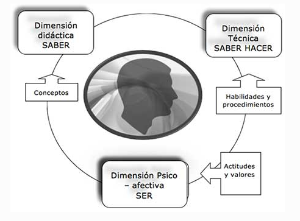
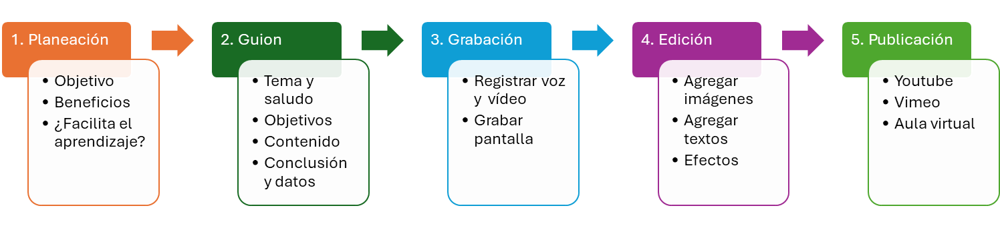
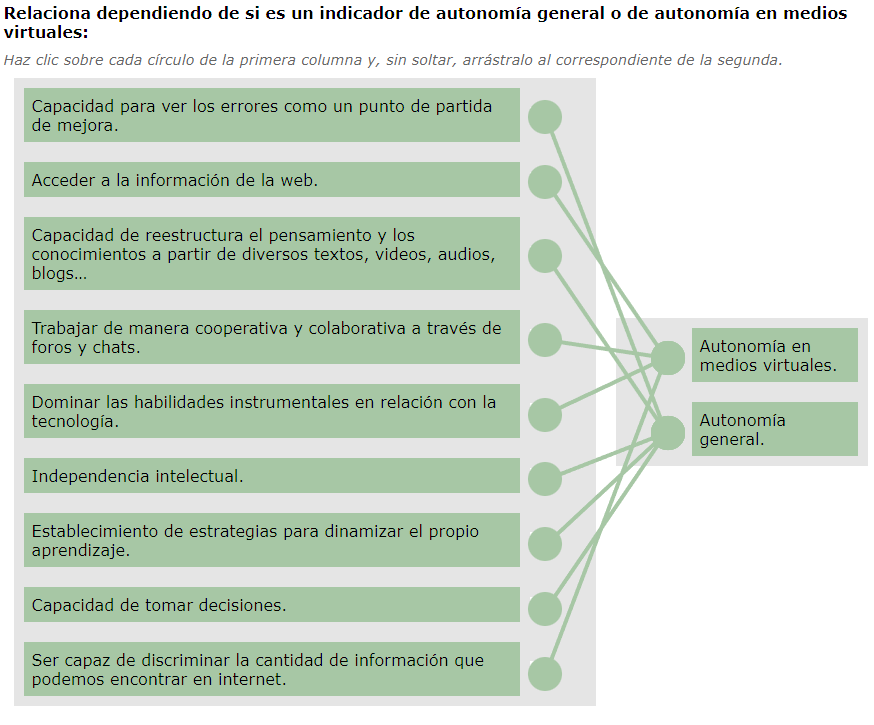
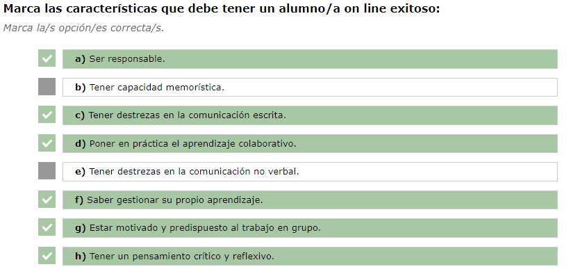
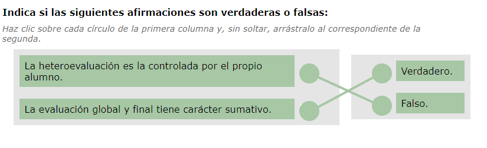
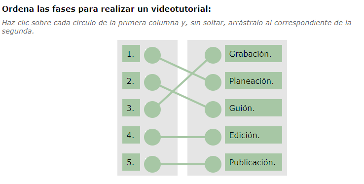
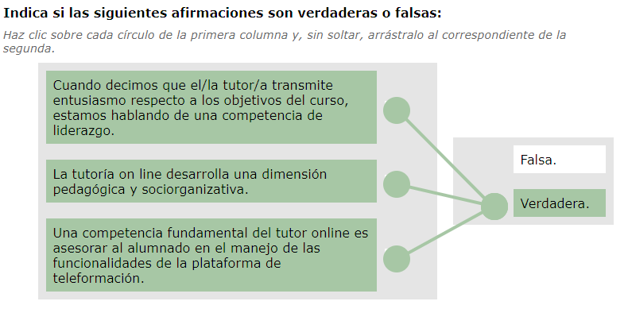
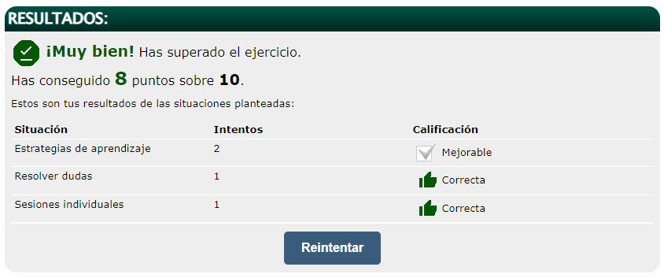

[TOC]

---

# MF1444 - Impartición y tutorización de acciones formativas para el empleo

# UF1646 - Tutorización de acciones formativas para el empleo

# Unidad 03 - Desarrollo de la acción tutorial en línea

## Introducción y objetivos

En esta unidad nos centraremos en el desarrollo de la acción tutorial en línea.  

**Objetivo de la unidad:**  
Proporcionar estrategias y habilidades para favorecer el aprendizaje en la formación en línea, supervisando su desarrollo.

---

## 1. Aproximación al tema

En la formación **e-learning**, el alumno es el centro del proceso y los contenidos facilitan el aprendizaje permanente en un contexto de uso intensivo de internet y de las nuevas tecnologías.  
El tutor de teleformación concretará sus funciones en relación con los participantes, los contenidos, el grupo de alumnos y la propia aula virtual.  

**El Teletutor:**  
- 💡 Facilita el proceso de aprendizaje.  
- 🎯 Favorece la autonomía del alumno.  
- 🚀 Adopta una actitud activa capaz de motivar, impulsar y dinamizar la participación individual y grupal.  

> [!important]
> **Recuerda:**  
> La formación a través de internet ha supuesto un cambio en el rol del docente, que tradicionalmente desarrollaba su actividad en contacto físico con los participantes en la modalidad presencial.  
> La formación *online* exige un cambio en las prácticas, conocimientos y concepciones sobre las funciones del docente y su tarea profesional.

**Según Pallof (2003), las buenas prácticas en educación en línea se basan en los siguientes principios:**  
- 🤝 Anima al estudiante a tomar contacto con la facultad.  
- 💬 Fomenta la cooperación entre los estudiantes.  
- 🧠 Facilita un aprendizaje activo.  
- ⏱️ Implica un feedback rápido.  
- 📅 Pone énfasis en el tiempo y en la tarea.  
- 📈 Comunica elevadas expectativas.  
- 🌈 Respeta los diversos talentos y caminos de aprendizaje.  

---

## 2. Características del alumnado

### 2.1. Aspectos generales

> [!important]
> **Recuerda:**  
> Durante el desarrollo de este módulo hemos repasado las diferentes características de los estudiantes que van a realizar una acción de Formación para el Empleo.  
> En el alumno/a *online* se integran todas ellas para conformar su perfil y comprender su papel dentro del proceso formativo.
>
> - 👩‍🏫 La formación para el empleo está orientada al colectivo de **trabajadores adultos** (entre 18 y 65 años).  
>   Es decir, el colectivo prioritario son los **adultos**, por lo que deberán tenerse en cuenta **consideraciones andragógicas** en el desarrollo de la formación.  
> - 🔄 La **educación permanente y continua** a lo largo de toda la vida promueve el **aprendizaje autónomo**.  
> - 🌍 Vivimos en un entorno de **cambio constante**, donde los modelos pedagógicos tradicionales evolucionan hacia **concepciones más activas**.  
>   El alumno/a debe ser parte activa del aprendizaje y capaz de **construir su propio conocimiento**.  
> - 💻 En este sentido, el **e-learning** impulsa y apoya estas nuevas corrientes, ya que en los entornos virtuales el papel del estudiante debe ser **principalmente activo**.  

**Por tanto, las características de un alumno/a de FPE en un entorno online tendrán en cuenta los siguientes elementos:**  

- 👨‍💼 Perfil de adultos.  
- 📘 Consideraciones andragógicas.  
- 🔍 Características del aprendizaje autónomo.  
- 🧠 Rol activo del estudiante.  
- 🧩 Aprendizaje constructivo.  

> [!tip]
>
> Andragogía son los principios y métodos específicos para enseñar a personas adultas. Igual que la pedagogía pero para niños y jóvenes.

---

### 2.2. Perfil de adulto. Consideraciones andragógicas

Las acciones de **Formación para el Empleo** implican entender el **aprendizaje del adulto**.  
La **andragogía** es la disciplina que se ocupa de la **educación y el aprendizaje de las personas adultas**, atendiendo a distintos estilos de aprendizaje.  

Esta expresión fue utilizada por primera vez por el alemán **Alexander Kapp (1833)**, al describir la práctica educativa de Platón.  
La idea tomó fuerza en los años 80 con el **Grupo Andragógico de Nottingham**.  

La andragogía busca comprender al adulto desde el punto de vista **psicológico, biológico y social**, con el fin de **incrementar el pensamiento, la autogestión y la calidad de vida**, promoviendo la **autorrealización**.

**Principios de la andragogía:**  
- 🎯 Los adultos se motivan en torno a **necesidades e intereses personales o profesionales**.  
- 🌍 El aprendizaje del adulto se centra en la **realidad**, no en la teoría abstracta.  
- 💡 La **experiencia** es el principal factor de aprendizaje: analizarla y construir a partir de ella es esencial.  
- 🔄 Los adultos aspiran a la **autodeterminación**, por lo que la relación educativa debe ser **comunicativa y bidireccional**.  
- 🧬 Las diferencias de **personalidad y ritmo de aprendizaje** aumentan con la edad, por lo que la formación debe adaptarse a ellas.  

> [!note]
> **Recuerda:**  
> Las características del adulto en el proceso de enseñanza–aprendizaje son:  
> - La **necesidad de saber** los motiva a participar en formaciones con una finalidad clara y útil.  
> - Su **autoconcepto** requiere que se les trate como personas capaces de **autodirigirse**.  
> - Poseen una **amplia experiencia vital y profesional**, que debe aprovecharse como base para el aprendizaje práctico.  
> - Tienen **mayor voluntad de aprender**.  
> - Su **motivación suele ser intrínseca**: aprenden porque quieren, no por obligación.  
> - Su orientación hacia el aprendizaje se centra en **resolver problemas o tareas concretas**, no en estudiar temas abstractos.  

---

### 2.3. Educación permanente. Aprendizaje autónomo

La **Comisión Europea** define el **aprendizaje permanente** como toda actividad de aprendizaje útil realizada de manera continuada, con el objetivo de **mejorar las cualificaciones, los conocimientos y las capacidades**.

En este contexto de educación permanente, el **aprendizaje autónomo** cobra especial relevancia.

> [!important]
> **El autoaprendizaje** es la forma de aprender de manera individual y propia de cada persona, es decir, **aprender por sí mismo**.  
> Implica la capacidad de **dirigir el propio proceso** de aprendizaje para comprender la realidad y **autorregular su formación**.

**Indicadores de autonomía:**  
- 🧭 Independencia intelectual.  
- 🧠 Capacidad para **reestructurar el pensamiento** y los conocimientos a partir de distintos recursos (textos, vídeos, audios, blogs…).  
- 🧩 Establecimiento de **estrategias personales** para dinamizar el aprendizaje.  
- 🎯 Capacidad de **tomar decisiones** de forma consciente.  
- 🔁 Ver los **errores como oportunidades de mejora**.  

**Además, el alumnado de e-learning debe demostrar autonomía tecnológica:**  
- 💻 Dominar las **habilidades instrumentales** relacionadas con el uso de la tecnología.  
- 🌐 Saber **acceder y buscar información en la web**.  
- 🧹 Ser capaz de **filtrar y seleccionar** la información relevante entre la gran cantidad disponible en Internet.  
- 💬 Trabajar de forma **cooperativa y colaborativa** mediante foros, chats u otras herramientas digitales.  

---

### 2.4. Cambios de paradigmas en educación. Hacia un aprendizaje constructivo

- La necesidad de un **nuevo paradigma educativo** empuja a docentes y estudiantes a entender la educación como un **proceso de construcción**.  
- El alumnado debe **aprender estrategias cognitivas**, es decir, procedimientos para **adquirir, seleccionar, recuperar y usar la información** de forma eficaz.

> [!note] Definición de la competencia “aprender a aprender”  
>
> 📢“La habilidad para iniciar el aprendizaje y persistir en él, para organizar su propio aprendizaje y gestionar el tiempo y la información eficazmente, ya sea individualmente o en grupo.  
> Esta competencia implica ser consciente del propio proceso de aprendizaje y de las necesidades personales de aprendizaje, determinar las oportunidades disponibles y superar los obstáculos para culminar el aprendizaje con éxito.  
>
> Supone **adquirir, procesar y asimilar nuevos conocimientos y capacidades**, así como **buscar orientación y hacer uso de ella**.  
>
> Aprender a aprender significa **apoyarse en experiencias vitales y de aprendizaje previas** para aplicar los nuevos conocimientos en distintos contextos —personales, profesionales o educativos—.  
>
> La **motivación y la confianza** son factores clave para adquirir esta competencia.”  
>
> *Fuente: Comisión Europea (2004). Competencias clave para el aprendizaje permanente. Un Marco de Referencia Europeo. Bruselas.*

---

### 2.5. Rol activo del estudiante

> [!note]
> Como ya hemos visto a lo largo del módulo, la **formación e-learning** implica que el estudiante adopte un **papel activo**.  
> Numerosos autores sostienen que el **éxito del aprendizaje a distancia** depende de la **autonomía del estudiante** y de su **capacidad para trabajar de forma independiente**, sin necesidad de una vigilancia constante por parte del docente.

La **Sociedad del Conocimiento** y el cambio de paradigmas educativos obligan a los estudiantes a:  
1. 🧩 Ser **constructores de su propio aprendizaje**, aplicando estrategias metacognitivas.  
2. 💪 Resolver conflictos con **autonomía y responsabilidad**.  
3. 🤝 Sentirse parte de un grupo, fomentando la **colaboración y cooperación**.  
4. ⏰ Gestionar de forma **autónoma el tiempo y el proceso de aprendizaje**.  
5. 🌐 Acceder y utilizar de manera crítica una **gran diversidad de recursos digitales y formativos**.  

---

### 2.6. Características de los alumnos/as online

**Características generales del alumnado de teleformación**

Las personas que participan como alumnos en acciones de teleformación suelen tener **responsabilidades familiares o laborales**, además de una **mayor madurez**, lo que se refleja en su compromiso con el estudio.

- 💻 **Diferentes niveles de competencia tecnológica**, según la edad o el contexto social.  
- 🕓 **Disponibilidad horaria variada** para realizar actividades.  
- 🖨️ **Desigualdad en el equipamiento informático** (impresora, cámara web, altavoces, sistema operativo, etc.).  
- 💬 **Diversidad en los hábitos de interacción**: algunos están acostumbrados a redes sociales y comunicación digital, mientras que otros son más reservados o inseguros al expresarse en entornos online.  

> [!important]
> Las características del aprendizaje adulto pueden analizarse según el **tipo de aprendizaje** en el que el tutor debe centrar su labor:
>
> {.rounded-3}

---

**Características del aprendizaje adulto respecto a los conocimientos**  
Los sistemas de teleformación fomentan un aprendizaje **independiente y flexible**, que permite aprender a **aprender y a hacer**, desarrollando la autonomía en el espacio, el tiempo y el ritmo.

- 📘 Prioridad de los **contenidos prácticos** sobre los teóricos.  
- 🧠 Diversidad de experiencias y conocimientos previos.  
- 🕹️ **Autonomía** en el seguimiento de las actividades.  
- 🧩 Preferencia por el **aprendizaje individualizado**.  

---

**Características del aprendizaje adulto respecto a las habilidades o procedimientos**  
El tutor debe **creer en los beneficios de la educación a distancia**, fomentar la comunicación **pluridireccional** y orientar al alumnado en el uso de las herramientas digitales.

- 🎯 Necesidad de **conocer los objetivos** a alcanzar.  
- 🔄 Cierta **resistencia al cambio** de lo presencial a lo virtual.  
- 🖱️ **Carencias técnicas** en el manejo de la plataforma.  
- 👥 Diversidad de **perfiles de participación**: cooperativos, gobernantes, silenciosos, ausentes, aprovechadores.  

---

**Características del aprendizaje adulto respecto a las actitudes**  
El alumnado adulto necesita ser tratado como alguien **capaz de organizar su propio aprendizaje**, y el tutor debe fomentar la **confianza y la autonomía**.

- ⚙️ Capacidad de **autogestión**.  
- 📏 Alta **exigencia personal** y con el proceso formativo.  
- 😐 En ocasiones puede mostrar una **actitud pasiva** ante el aprendizaje.  
- 💬 Sensibilidad al **interés, confianza y seguridad** que transmita el tutor.  

---

> [!note]
> 🎥 *El siguiente vídeo profundiza en los tipos de docentes y alumnos/as:*  
> <iframe width="100%" height="315" src="https://www.youtube.com/embed/LWZ7Pjth2Mk" frameborder="0" allowfullscreen></iframe>

---

### 2.7. Capacidades de los alumnos/as online

- **Capacidades exigibles al alumno de teleformación**: En la modalidad de teleformación, el alumno es el **protagonista del proceso de enseñanza-aprendizaje**, lo que requiere **interés, constancia y esfuerzo continuado**.  
  Estas capacidades, junto con las habilidades de **comunicación** y **autosuperación**, son clave para alcanzar los objetivos formativos:
  - 🗓️ **Capacidad de planificación y cumplimiento**: el alumno gestiona su ritmo de aprendizaje, organiza sus horarios y planifica su trabajo, contando con la orientación del tutor/a.  
  - 🧭 **Capacidad de autoevaluación**: identifica sus propias necesidades formativas, valora el esfuerzo y los resultados obtenidos, y ajusta su estrategia para alcanzar los objetivos del curso.  
  - 🧠 **Capacidad de trabajo autónomo**: busca soluciones a los problemas que surgen, reconoce cuándo pedir ayuda y gestiona su proceso de aprendizaje con independencia.  

- **Capacidades adicionales del alumno de teleformación**: El estudiante online debe mantener un **rol activo**, adaptando su aprendizaje a sus necesidades y contribuyendo a crear un **entorno colaborativo** con sus compañeros:
  - 🔍 **Capacidad de interpretación crítica de contenidos**: analiza la información recibida en distintos formatos, reflexiona sobre ella y aplica los conocimientos más útiles a su contexto.  
  - 💬 **Capacidad de comunicación escrita**: utiliza un lenguaje claro, preciso y correcto en sus mensajes dentro del entorno virtual.  

---

### 2.8. Perfil del estudiante online exitoso

Numerosos autores han analizado el perfil del estudiante virtual y coinciden en que, para tener éxito en la formación online, debe reunir una serie de **características personales y académicas**:

- 💭 **Pensamiento crítico y reflexivo**.  
- 💪 **Motivación y predisposición para el trabajo en grupo**.  
- 🤝 **Capacidad para aplicar el aprendizaje colaborativo**.  
- 🧭 **Gestión eficaz de su propio aprendizaje**.  
- 🧩 **Responsabilidad y compromiso**.  
- ✍️ **Habilidad en la comunicación escrita**.  

> [!note]
> Estas características ayudan al estudiante a **adaptarse mejor al entorno de aprendizaje online**, basado en el **constructivismo** como enfoque metodológico.  

Para lograr una acción formativa online **eficaz y de calidad**, deben aplicarse los **principios didácticos del aprendizaje adulto**:

- 📚 Seleccionar los contenidos siguiendo **principios pedagógicos adecuados**.  
- 🎯 Elegir la **organización y objetivos formativos** que el alumno debe alcanzar al finalizar la acción formativa.  
- 🔍 Mostrar **destrezas en la búsqueda y uso de recursos** que apoyen el aprendizaje.  
- 🧠 Elegir los **materiales adecuados** y utilizarlos en el momento oportuno, evitando un uso descontextualizado.  
- 💾 **Preparar materiales didácticos** en formato tradicional o digital que faciliten las actividades de enseñanza/aprendizaje.  
- 🪜 **Estructurar los contenidos** según los conocimientos previos de los alumnos y seleccionar los recursos más adecuados en cada fase del curso.  

> [!note]
> 🎥 *Visualiza el siguiente vídeo para profundizar en la teoría de las Inteligencias Múltiples:*  
>
> <iframe width="100%" height="315" src="https://www.youtube.com/embed/EzDrymvpt1w" frameborder="0" allowfullscreen></iframe>

> [!note]
> **Teoría de las Inteligencias Múltiples (Howard Gardner, 1983)**  
> Gardner propuso que **no existe una sola inteligencia**, sino un conjunto de **capacidades distintas** que las personas desarrollan en diferentes grados.  
> Esta teoría rompió con la idea tradicional de medir la inteligencia solo a través del coeficiente intelectual (CI).  
> Según Gardner, existen **ocho inteligencias principales**:
>
> - **Lingüística:** habilidad para usar el lenguaje con eficacia (escrita u oral).  
> - **Lógico-matemática:** capacidad para razonar, calcular y resolver problemas.  
> - **Espacial:** facilidad para visualizar, representar y manipular el espacio.  
> - **Musical:** sensibilidad al ritmo, tono y timbre del sonido.  
> - **Corporal-kinestésica:** uso del cuerpo para expresar ideas o realizar tareas.  
> - **Intrapersonal:** conocimiento de uno mismo, autoconciencia y autorregulación.  
> - **Interpersonal:** habilidad para comprender y relacionarse con los demás.  
> - **Naturalista:** sensibilidad para observar y comprender el entorno natural.  
>
> Esta teoría ha tenido gran impacto en educación, porque anima a **personalizar el aprendizaje**, reconociendo que cada alumno destaca en diferentes áreas y aprende de distintas formas.

---

## 3. Elaboración de la guía del curso

### 3.1. Aspectos generales

> [!note] Definición
>
> 📢La **guía didáctica** es el documento que **orienta el estudio** y acerca al alumno/a al contenido formativo para que pueda **trabajarlo de forma autónoma**.  

Es el instrumento clave para **guiar, facilitar y estructurar el aprendizaje**, ayudando al participante a comprender y aplicar los conocimientos, integrando todos los medios y recursos disponibles.

Desde el punto de vista docente, la guía recoge **toda la planificación del curso**, ofreciendo **sugerencias, ayudas y pautas** sobre cómo abordar los materiales de estudio y relacionar las distintas fuentes de información.

**Destinatarios**

- 🏛️ **La organización** que programa la acción formativa.  
- 👩‍🎓 **El alumno/a**, como usuario final del documento.  

> [!note] Recuerda
> Los **principios teóricos** en los que se basan las metodologías de teleformación son:  
>
> - 🧩 El aprendizaje se construye mediante la experiencia (**constructivismo**).  
> - ⚙️ El aprendizaje es un proceso **activo**, no solo de recepción pasiva de información.  
> - 🔍 Se aprende **haciendo, buscando información y reflexionando**.  
> - 💡 El aprendizaje es **individual o autoaprendizaje**.  
> - 🧠 Cada persona puede emplear distintos medios para aprender.  
> - 🤝 El aprendizaje es **colaborativo**.  
> - 🌍 Existe un **aspecto social** del aprendizaje: aprendemos mejor junto a otros, y los medios de comunicación bidireccionales fomentan este aspecto.

> [!important]
> La guía del curso debe **responder a estos principios** y mantener **coherencia con la acción formativa** para resultar eficaz.

**La guía didáctica de un curso sirve para:**

- 📘 **Describir y organizar los contenidos.**  
- 🧭 **Explicar la metodología de trabajo.**  
- ⏰ **Orientar sobre la gestión del tiempo** para el estudio de las unidades y la realización de actividades.  
- 🧾 **Definir los criterios de evaluación.**  

---

### 3.2. Estructura de la guía

Cada uno de los apartados de la guía tiene como objetivo **informar al alumnado y al equipo docente** sobre todos los detalles importantes de la acción formativa, ofreciendo **sugerencias y ayudas** sobre cómo abordar los contenidos, actividades y materiales de estudio.

1. 📑 **Índice y presentación**  
   - Presentación de la guía.  
   - Índice de los epígrafes.

2. 🏫 **Presentación e introducción general del curso**  
   - Identificación de la acción formativa y su relación con la cualificación profesional.  
   - Duración en horas acreditadas del curso.  
   - Destinatarios: número y características de acceso.  
   - Competencias generales y unidades de competencia.

3. 👩‍🏫 **Presentación del equipo docente**  
   - Breve referencia al personal formador, su preparación profesional y experiencia.

4. 🎯 **Objetivos**  
   - Redacción de los objetivos a lograr, especificando las capacidades que se pretenden alcanzar.

5. 📘 **Contenidos del curso**  
   - Identificación de los módulos y unidades formativas.  
   - Desglose detallado de los contenidos.

6. 📚 **Materiales didácticos**  
   - Determinación de los materiales básicos y complementarios necesarios para el seguimiento del curso.

7. 🔍 **Orientaciones bibliográficas básicas y complementarias**  
   - Indicación del manual o material principal utilizado en el curso.  
   - Recomendación de lecturas o materiales adicionales.  
   - Inclusión de enlaces o webgrafía útil para el desarrollo del curso.

8. 🗓️ **Plan de trabajo y calendario-cronograma**  
   - Presentación del plan de trabajo propuesto al alumnado.  
   - Orientación sobre actividades, tiempos estimados y dedicación al estudio.  

9. 🧭 **Metodología**  
   - Descripción de cómo se abordarán las actividades.  
   - Priorización de la participación y la cooperación como base del aprendizaje.

10. 🧩 **Actividades**  
    - Propuestas de ejercicios, problemas, casos o proyectos.  
    - Indicación de actividades o trabajos obligatorios, plazos y forma de entrega.

11. 🧠 **Orientaciones para el estudio**  
    - Sugerencias sobre técnicas y estrategias adecuadas para el estudio.  
    - Consejos sobre cómo relacionar los distintos temas e integrar la información.  

12. 💬 **Tutoría**  
    - Estímulo del contacto con el tutor/a.  
    - Instrucciones sobre los medios de comunicación disponibles.  
    - Fechas de entrega de trabajos, evaluaciones u otras actividades.  

13. 📕**Glosario**: 
    - Propuesta de términos y sus definiciones que aparecen o lo largo del curso.

14. 🧾 **Evaluación**  
    - Información sobre criterios y procedimientos de evaluación.  
    - Evaluación de conocimientos (exámenes, autoevaluaciones), trabajos, participación y proyectos.  

> [!note]
> 🎥 *Para profundizar en cómo elaborar guías de aprendizaje, visualiza el siguiente vídeo:*  
> <iframe width="100%" height="315" src="https://www.youtube.com/embed/OfvCySLQcNQ" frameborder="0" allowfullscreen></iframe>

> [!tip]
> 📘 *Más información:* [10 claves para elaborar una guía didáctica](https://gesvin.wordpress.com/2015/12/22/secuencia-didactica-10-claves-para-elaborarla-presentacion/).

---

## 4. Tareas y actividades de evaluación y registro de calificaciones

### 4.1. Características

Las **actividades en teleformación** son el medio para poner en práctica los contenidos formativos y favorecer la interacción del alumnado con los materiales y con los demás participantes. Constituyen un elemento esencial del aprendizaje activo.

**Las características de las actividades son:**

1. 🧭 **Adecuadas al contexto**: Deben ser coherentes con los objetivos y las competencias que se pretenden desarrollar.
   
2. ⚖️ **Optimizan el esfuerzo del estudiante**: Buscan un equilibrio entre el esfuerzo invertido y el aprendizaje logrado.
   
3. 🌟 **Atractivas y motivadoras**: Despiertan y mantienen el interés del alumnado durante la formación.
   
4. 📋 **Bien orientadas**: Incluyen instrucciones y pautas claras que facilitan su correcta realización.
   
5. 🎯 **Basadas en criterios de evaluación**: Contienen de forma explícita o implícita los criterios con los que se valorará el trabajo del estudiante.
   
6. 🧠 **Exigen procesos cognitivos**: Implican recordar, demostrar, comprender, aplicar, analizar, deducir y evaluar.

> [!important]
> La **corrección de las actividades** debe ser constructiva. Más allá de una nota numérica, el tutor debe:
>
> - Explicar al alumno en qué ha fallado.  
> - Fomentar la reflexión sobre el error.  
> - Mostrar cómo realizar la tarea correctamente.

**Tipos de elementos que se evalúan:**

1. 📘 **El conocimiento**  
   - Incluye los conceptos y las relaciones entre ellos.  
   - Se evalúa mediante pruebas al inicio y al final del curso.

2. 🧩 **Las habilidades adquiridas**  
   - Se valoran mediante ejercicios prácticos, simulaciones o tareas aplicadas.

3. 💡 **Las actitudes**  
   - Se observan a través de la participación en los foros, la colaboración con los compañeros y la constancia en el aprendizaje.

---

### 4.2. Tipos de evaluación

La **evaluación en teleformación** debe realizarse de forma continua y estructurada, contemplando **tres momentos clave** que garanticen el seguimiento del aprendizaje y la correcta acreditación del curso.

1. 🧩 **Evaluación inicial**  
   - Se realiza **al inicio del curso** para conocer los conocimientos previos del alumnado y orientar los primeros pasos.  
   - No es imprescindible una prueba formal; puede utilizarse una entrevista o cuestionario diagnóstico.  
   - Permite adaptar el ritmo y nivel de la formación a las necesidades detectadas.  

   **Ejemplo de preguntas posibles:**  

   - ¿Por qué te has matriculado en el curso?  
   - ¿Qué esperas aprender?  
   - ¿Qué contenidos te interesan más?  
   - ¿Tienes experiencia previa en esta materia o es nueva para ti?

   

2. 🔄 **Evaluación continua**  

   - Consiste en el **seguimiento del proceso de aprendizaje** mediante la valoración de las actividades realizadas.  
   - Se lleva a cabo durante todo el desarrollo del curso, con el fin de mejorar progresivamente el aprendizaje.  

   **Funciones del tutor:**  
   - ✏️ Crear y actualizar pruebas de evaluación.  
   - 📚 Proponer tareas adaptadas a las necesidades de cada alumno.  
   - 💬 Comentar aciertos y errores en las actividades, ofreciendo orientación y motivación.  
   - 🧵 Valorar las aportaciones en foros y tablones.  
   - 🧾 Registrar y analizar los resultados de las evaluaciones en línea.  
   - 🧠 Orientar sobre el uso de los materiales y ampliar contenidos cuando sea necesario.

   

3. 🏁 **Evaluación global y final**  

   - Se realiza **al finalizar el curso** para valorar los conocimientos adquiridos.  
   - En muchos casos, la obtención del certificado requiere una **prueba final presencial**.  

   **Características principales:**  
   - Tiene un **carácter sumativo**, reflejando los progresos y puntuaciones obtenidas.  
   - Considera tanto la **heteroevaluación** (por parte del tutor) como la **autoevaluación** (por parte del alumno).  
   - Sirve de base para decidir la **obtención del certificado o diploma**.  
   - El tutor diseña las pruebas y transmite las instrucciones necesarias para su realización.

---

## 5. Tareas y actividades de evaluación y registro de calificaciones

### 5.1. Aspectos generales

La **educación en línea** utiliza **internet** y las **tecnologías de la información y la comunicación (TIC)** como base para los procesos de enseñanza–aprendizaje. En este entorno digital, las plataformas y el papel del tutor adquieren una relevancia fundamental.

**Aspectos clave:**

1. 🌐 **Uso de Internet como base del aprendizaje**  
   - La formación online aprovecha las herramientas tecnológicas para facilitar la enseñanza y el aprendizaje interactivo.

2. 🧩 **Finalidad pedagógica de las plataformas**  
   - Las plataformas e-learning deben tener una **función didáctica**, integrando recursos que permitan **gestionar, organizar y coordinar** las acciones formativas.

3. 👩‍🏫 **Funciones del tutor en entornos virtuales**  
   - El tutor asume **tareas académicas, pedagógicas, técnicas, organizativas y sociales**, adaptadas al entorno digital.

4. 🧾 **Rol administrativo del tutor/a**  
   - Incluye la participación en el **planteamiento y desarrollo del curso**, desde la selección de la plataforma y herramientas, hasta el diseño de materiales y recursos formativos.  
   - Implica también la definición de **normas de funcionamiento, horarios y reglas generales** junto con el resto del equipo docente.

5. 🤝 **Función de enlace del tutor/a**  
   - El tutor actúa como **intermediario entre el alumnado y la organización**, fomentando la cohesión del grupo y el sentido colectivo de la acción formativa.

---

### 5.2. Tareas y responsabilidad

Las tareas que debe desempeñar el tutor/a en formación a distancia son:

1. 💡 **Participar de la filosofía de la formación a distancia**, comprendiendo su enfoque y adaptando su labor docente a este modelo.  
2. 🧭 **Conocer cómo funciona la modalidad y la cultura de la organización**, entendiendo las normas y la estructura del centro donde se imparte el curso.  
3. 📚 **Dominar los fundamentos y metodologías propias del e-learning**, así como las posibilidades que ofrece este tipo de enseñanza.  
4. 💻 **Mantenerse actualizado en el uso de las tecnologías**, incorporando nuevas herramientas y recursos digitales.  
5. 🤝 **Colaborar con el resto del equipo docente**, compartiendo información y buenas prácticas.  
6. 👨‍🏫 **Coordinar su actuación con otros tutores o coordinadores**, para ofrecer una experiencia coherente a todos los alumnos.

Sus responsabilidades incluyen establecer las normas de funcionamiento, resolver dudas e incidencias, gestionar los recursos disponibles y recopilar información útil para mejorar el proceso formativo:

1. 🧾 **Elaborar informes tutoriales**, basados en los trabajos de evaluación y en el seguimiento del alumnado.  
2. 📖 **Revisar los materiales de estudio**, asegurando que estén actualizados, sean adecuados y estén bien planteados.  
3. 🗂️ **Realizar tareas administrativas**, como el registro de datos, seguimiento de incidencias y comunicación con la organización.  
4. 🧩 **Prever apoyos específicos**, destinados a participantes con dificultades, discapacidades o necesidades particulares.

---

## 6. Elaboración de videotutoriales con herramientas de diseños sencillas

### 6.1. Aspectos generales  

> [!note] Definición
>
> Los videotutoriales son contenidos en formato vídeo creados a partir de distintos recursos —como clips de vídeo, audio, texto, gráficos o animaciones— que sirven de apoyo al proceso de aprendizaje.  

Son especialmente útiles tanto en formación presencial como en educación online, ya que refuerzan lo aprendido en clase y permiten repasar los contenidos de forma autónoma.  

Según Ferrer-Cascales (2012), el videotutorial:  
- 🎥 Acerca al profesor y su asignatura.  
- 🧩 Mejora la comprensión de las sesiones prácticas.  
- ⚡ Es más dinámico y ameno.  
- 💡 Proporciona seguridad y resuelve muchas dudas.  

> [!warning]
> El videotutorial es un recurso pensado **principalmente para la autoformación**, no para la colaboración. Su objetivo es ofrecer explicaciones claras y visuales sobre herramientas, trucos o procesos.

**Aspectos principales para elaborar un videotutorial:**  
- 🧠 Definir el tema que se va a tratar y decidir el nivel de profundidad.  
- 📝 Elaborar un guion que organice las ideas y los pasos.  
- 🎙️ Coordinar la grabación del vídeo y del audio para mantener coherencia.  
- 📦 Preparar y organizar el material necesario antes de grabar.  
- 🌐 Elegir una buena plataforma o servicio de alojamiento si se va a publicar en Internet.

---

### 6.2. Fases de realización  

La creación de un videotutorial implica varias fases, desde la planificación inicial hasta su publicación final. Cada etapa tiene un papel clave para garantizar que el contenido sea claro, útil y atractivo para el alumno.  

**Fases del proceso:**  

1. 🧭 **Planeación:**  
   Se define el tema del videotutorial, el objetivo que se quiere lograr, los beneficios que aportará y si realmente facilita el aprendizaje del alumno.  

2. 📝 **Guion:**  
   Estructura básica que organiza el contenido del vídeo. Debe incluir:  
   - Tema y saludo inicial.  
   - Objetivos del tutorial.  
   - Desarrollo del contenido.  
   - Conclusión y datos de cierre.  

3. 🎥 **Grabación:**  
   En esta fase se utiliza un programa o software específico para registrar la pantalla y la voz del tutor.  

4. ✂️ **Edición:**  
   Permite mejorar el vídeo grabado añadiendo elementos visuales como imágenes, textos, flechas o efectos. No todos los programas gratuitos ofrecen las mismas posibilidades.  

5. 🌐 **Publicación:**  
   Consiste en integrar el videotutorial en el aula virtual o la plataforma de formación para que el alumnado pueda acceder a él en cualquier momento.  

> [!important]
> Los videotutoriales en la formación a distancia se orientan a **desarrollar habilidades prácticas**, permitiendo que el participante **observe y reproduzca procedimientos paso a paso**. Además, pueden utilizarse como **complemento de metodologías expositivas** para reforzar los contenidos teóricos.

---

### 6.3. Herramientas *opensource*  

Para crear videotutoriales educativos sin necesidad de invertir en software de pago, existen numerosas herramientas de código abierto o con versiones gratuitas. Estas permiten grabar la pantalla, añadir audio y generar vídeos de forma sencilla, ideales para la formación e-learning.  

**Principales herramientas:**  

1. 💻 **CamStudio**  
   - Permite grabar imagen y sonido directamente desde el ordenador.  
   - Guarda los vídeos en el equipo y luego pueden subirse a la plataforma e-learning.  
   - Sitio oficial: [www.camstudio.org](https://www.camstudio.org)  

2. 🎞️ **Wink**  
   - Captura vídeo del escritorio completo, una ventana concreta o un área seleccionada.  
   - Ideal para crear demostraciones o presentaciones de software.  
   - Descarga disponible en: [www.debugmode.com/wink/download.htm](http://www.debugmode.com/wink/download.htm)  

3. 🧠 **Screenr**  
   - Permite grabar hasta 5 minutos con audio.  
   
   - No requiere instalación: funciona directamente desde el navegador.  
   
   - Compatible con Windows y Mac.  
   
   - Más información en: [www.screenr.co](https://www.screenr.co)  
   
     > [!caution]
     >
     > Ya no existe
   
4. 📹 **Screencast-O-Matic**  
   - Software muy intuitivo que también funciona sin instalación.  
   
   - La versión gratuita permite grabar vídeos de hasta 15 minutos.  
   
   - Disponible en: [www.screencast-o-matic.com](https://www.screencast-o-matic.com)  
   
     > [!warning]
     >
     > Han cambiado el nombre a ScreenPal. No se si seguirá siendo lo mismo o no.

> [!note]
> Si quieres explorar más opciones, puedes consultar el recurso **“[8 herramientas gratis para crear videotutoriales](https://herramientasdeelearning.wordpress.com/2010/07/22/8-herramientas-gratis-para-crear-video-tutoriales/)”**, donde se presentan alternativas tanto *opensource* como comerciales para la creación de contenidos educativos multimedia.

> [!warning] 
> El recurso anterior es de 2010 (más de 15 años). La mitad de las aplicaciones no existirán. Mejor busca en internet información actualizada.

---

## 7. Criterios de coordinación con tutores y jefatura de estudios  

🟢**Aspectos generales**  
La acción formativa en línea requiere la implicación de distintos profesionales. Aunque el tutor/a es la figura de referencia para el alumnado, **no trabaja de forma aislada**, sino que forma parte de un equipo que garantiza el buen desarrollo del curso.  

🟢**Elementos clave de la coordinación:**  

1. 💡 **Trabajo en equipo:**  
   Los cursos e-learning cuentan con profesionales que velan por el cumplimiento de los objetivos y el correcto funcionamiento de la plataforma y sus herramientas.  

2. 🧰 **Equipo técnico:**  
   Es fundamental contar con personal informático que pueda **detectar y solucionar incidencias** en la plataforma de manera rápida y eficaz.  

3. 🗂️ **Equipo administrativo y de secretaría:**  
   Encargado de la **gestión de matrículas, envío de claves, materiales, certificados y diplomas**. Este equipo debe actuar de forma coordinada con el resto de profesionales.  

4. 🤝 **Comunicación entre docentes y jefatura de estudios:**  
   La comunicación constante entre ambos favorece la coherencia y la eficacia de la acción formativa.  

🟢**Funciones del jefe de estudios:**  
- Promover y coordinar la convivencia de los participantes.  
- Coordinar las actividades académicas, organizativas y de orientación (al alumnado y al profesorado).  
- Garantizar la correcta orientación académica, profesional y laboral del alumnado.  
- Supervisar el cumplimiento del plan de formación del tutor y fomentar la innovación docente.  
- Informar al responsable del centro sobre las necesidades o mejoras detectadas.  
- Revisar el **Plan Tutorial** a partir de las memorias elaboradas por los tutores.  

🟢**Beneficios de la coordinación tutor–jefatura:** 

La coordinación entre el tutor y la jefatura de estudios favorece un conocimiento más amplio y directo de las características, necesidades y problemáticas del alumnado para la toma de decisiones y conseguir una unidad de criterios de funcionamiento y evaluación.  

- 📄Disponer de toda la documentación posible sobre la acción tutorial. Facilita información sobre posibles dificultades en el desarrollo de la acción.  
- 🎯Contribuir a la optimización del rendimiento del centro, proponiendo actuaciones que incidan en el desarrollo académico y orientador del alumnado.  
- 🧑‍🏫Colaborar en la formación de los equipos de tutores y en la incorporación de nuevos profesores, familiarizándolos con la plataforma, los contenidos y el centro.  
- ⏰Planificar los tiempos y recursos de comunicación para preparar y desarrollar las actividades tutoriales.  
- 📊Desarrollar una evaluación continua.  

---

## 8. Las competencias de un tutor online

### 8.1. Introducción  

- 💻 La tutoría online implica realizar distintas tareas durante el proceso de enseñanza-aprendizaje.  
- 🎭 El tutor asume varios **roles**, siempre partiendo de que la comunicación se desarrolla principalmente **por escrito**.  
- 🤝 Su labor no se limita solo a la docencia: también debe **dinamizar la participación**, **moderar los foros** y **orientar** al alumnado en su progreso.  

**Las competencias básicas del tutor online son:**  

- 🧠 Reconocer las competencias propias de la tutoría en línea.  
- 🔁 Aplicar la experiencia docente previa —ya sea presencial o a distancia— para mejorar la práctica actual.  
- 💬 Reflexionar sobre las competencias personales que ya se tienen y aquellas que conviene adquirir para seguir creciendo como formador.  
- 🧩 Analizar las competencias del tutor en relación con los **objetivos del curso** y los **resultados esperados del alumnado**:  
  - ❓¿Qué objetivo queremos alcanzar?  
  - 🚀 ¿Qué medios o actividades vamos a usar para lograrlo?  

---

### 8.2. Tareas y funciones que desempeña el tutor online  

> [!important]  
> Las principales tareas que desempeña de forma habitual son las siguientes:  
>
> - 🎓 Ser **experto en los contenidos** del curso.  
> - 👨‍🏫 Realizar la **tutoría y docencia** del alumnado participante.  

A partir de estas funciones esenciales, el tutor desarrolla una labor continua de **orientación, apoyo y asesoramiento** al alumnado en las actividades del curso. Además:  

- 💬 Promueve la **participación activa** y motiva al alumnado en la resolución de las actividades.  
- 🗣️ Desarrolla **habilidades de comunicación** utilizando las distintas herramientas de la plataforma para mantener el contacto y el seguimiento.  
- 🧭 Asesora al alumnado en el **uso de las funcionalidades** de la plataforma de teleformación.  
- 🤝 Selecciona el **tipo de tutoría más adecuado**, ya sea individual o en grupo, según las necesidades del alumnado.  

---

### 8.3. Análisis de las competencias del tutor online  

Para desempeñar correctamente la tutoría online, el formador debe analizar las **habilidades y destrezas** que necesita desarrollar, tanto en el dominio de los contenidos como en la orientación y asesoramiento al alumnado.  

Es imprescindible contar con **competencias digitales** que permitan manejar la plataforma, investigar, explorar recursos y ayudar al alumnado en el desarrollo de las actividades.  

**Aspectos clave para tutorizar:**  
1. 💻 Manejo de la plataforma de teleformación y habilidades informáticas básicas (correo electrónico, navegación, comunicación, etc.).  
2. ⚙️ Establecer una **dinámica clara de actuación** en la plataforma, donde se desarrollan los objetivos y resultados.  
3. 🧭 Definir un **marco de actuación** y conocer las zonas activas y espacios de interacción disponibles.  
4. 🔍 Tener **curiosidad e iniciativa** por aprender a usar todas las funcionalidades de la plataforma.  
5. 🗣️ Mostrar una presencia activa y constante en los espacios de comunicación, participando en función de las actividades propuestas.  

Las principales **competencias** que debe desarrollar un tutor online son las siguientes:  

---

#### 🗣️ Comunicación  
Es la base de la tutoría y la herramienta principal de actuación.  

**Competencia:**  
- Escuchar y comprender.  
- Responder y retroalimentar.  
- Promover el intercambio de ideas y debates argumentados.  
- Usar un lenguaje claro y adaptado al público.  

**Criterios de desempeño:**  
- Utiliza un lenguaje adecuado y organiza bien su discurso.  
- Comunica conocimientos técnicos de forma sencilla.  
- Mantiene un discurso organizado. Elimina detalles innecesarios.
- Promueve la participación y vincula la práctica con la teoría.  

---

#### 🧭 Liderazgo  
El tutor ejerce un liderazgo positivo, orientado a guiar y motivar al grupo.  

**Competencia:**  
- Tratar al alumnado con respeto.  
- Ser un ejemplo a seguir.  
- Adaptar el liderazgo según la situación.  
- Visión anticipada.
- Motivar, organizar y comprometer al grupo.  

**Criterios de desempeño:**  
- Trata a sus estudiantes con dignidad y respeto. Conduce la actividad para el logro de los objetivos.
- Es realista y demanda resultados en consecuencia. Ejerce una influencia positiva en sus estudiantes.
- Transmite entusiasmo respecto a los objetivos del curso.
- Crea un entorno estimulante.
- Promueve la organización, motivación y participación del grupo, mediante actividades que los comprometan.
- Modera y sintetiza los debates.
- Promueve el establecimiento de rutinas de comunicación en plataforma.

---

#### 🧩 Resolución de problemas  
El tutor debe anticipar y resolver dificultades durante el curso.  

**Competencia:**  
- Buscar información.
- Orientar al estudiante.
- Analizar situación.
- Anticipar consecuencias.
- Ser oportuno.
- Soluciones satisfactorias.
- Responsabilizarse por decisiones.
- Evaluar impacto.

**Criterios de desempeño:**  
- Maneja información básica sobre el curso para dar soluciones prácticas a los problemas.
- Resuelve las dudas de los estudiantes y da orientación. Diferencia los problemas que puede resolver por si solo y deriva aquellos que exceden a sus atribuciones y/o capacidades. Busca información relevante y se asesora con los expertos para resolver problemas.
- Aplica conocimientos de experiencias pasadas.
- Examina la situación desde varias perspectivas Toma las decisiones en el tiempo oportuno.
- Toma decisiones que incorporan una visión que beneficie a sus estudiantes.
- Organiza acciones alternativas frente a situaciones especiales en grupo o individualmente.

---

#### 💪 Trabajo bajo presión y autocontrol  
Capacidad para mantener la calma y continuar con eficacia ante imprevistos.  

**Competencia:**  
- Autocontrol.
- Mantiene desempeño.
- Reacción en situaciones crisis.
- Organiza recursos.
- Desarrolla planes de contingencia..  

**Criterios de desempeño:**  

- No se bloquea en situaciones de presión, y con el apoyo de otros, mantiene su labor de tutor. Mantiene la compostura frente a situaciones de alta frustración.
- Responde en forma asertiva, no agresiva. No actúa por impulsos. En situaciones de crisis actúa con calma decisión, rapidez y efectividad. Utiliza técnicas para controlar el estrés y las emociones. Es capaz de revertir una situación de alta frustración.
- Rápidamente organiza los recursos con que cuenta para enfrentar la situación. Mantiene el foco en los resultados y objetivos. Persiste y actúa en contra de los obstáculos. Expresa optimismo.

---

#### 🤝 Contribución al buen clima de grupo  
Fomentar la cohesión y el sentido de pertenencia del alumnado.  

**Competencia:**  

- Buen trato.
- Comunica directamente.
- Contactos informales.
- Cooperación.
- Confianza.
- Equilibrio.
- Mantiene confidencialidad.

**Criterios de desempeño:**  
- Trata a las personas con respeto y equidad. Comunica de forma directa y abierta. Se ven sus intenciones. Tiene empatía.
- Realiza contactos informales con otros, para canalizar situaciones. Presenta los hechos objetivamente. Protege la confidencialidad.
- Expresa su desacuerdo en forma educada, presentando su postura de forma clara y con seguridad. Inspira confianza por ser confiable y auténtico. Ofrece su ayuda si ve que le necesitan. Es reconocido por otros como una persona confiable, cálida, de buen trato. Mantiene un buen equilibrio entre la relación con las personas y la tarea.
- Se relaciona con todos los niveles y áreas del equipo. Acepta las críticas con actitud tolerante pero expone su punto de vista. Acepta el conflicto como parte del juego de las diferencias y no para descalificar al otro.

---

#### 🔄 Flexibilidad y adaptación al cambio  
Capacidad para ajustarse a nuevas situaciones y demandas del grupo.  

**Competencia:**  
- Empatía y apertura a nuevas ideas.  
- Capacidad para desempeñar distintos roles.  
- Ajuste rápido ante cambios o imprevistos.  

**Criterios de desempeño:**  
- Comprende distintos puntos de vista.  
- Modifica sus métodos ante nueva información.  
- Se adapta a diferentes contextos y mantiene la eficacia en situaciones cambiantes.  

---

### 8.4. Estrategias de actuación tutorial  

La tutoría online no solo tiene un papel pedagógico, sino también una función **organizativa y de gestión** del grupo.  
El tutor debe administrar y coordinar actividades del curso que, en ocasiones, van más allá de la docencia, resolviendo incidencias de forma rápida y eficaz.  

🟣**Ámbitos principales de actuación:**  
- 🌐 **Social:** todo lo relacionado con el ambiente del grupo, la valoración del curso y las expectativas del alumnado.  
- 🗂️ **Organizativo:** asegurar la correcta planificación y desarrollo de las actividades formativas.  
- 💻 **Técnico:** atender los aspectos relacionados con el funcionamiento de la plataforma y las herramientas digitales.  

🟣**Estrategias fundamentales:**  
- 🎯 Mantener un **planteamiento claro** desde el inicio, definiendo los objetivos del curso y seleccionando las actividades más adecuadas para alcanzarlos.  
- 💬 Fomentar la **comunicación en grupo**, especialmente a través de los **foros**, que son el mejor espacio para conocer la opinión y el grado de satisfacción del alumnado.  
- 🤝 Participar con frecuencia en la plataforma, demostrando presencia y compromiso. Esta implicación genera cohesión en el grupo, sentido de pertenencia y motivación compartida hacia el aprendizaje.  

---

# Resumen

No hay resumen

---

# Ejercicios

## Ejercicio 22: Autonomía general o en medios virtuales

---

## Ejercicio 23: Características de un estudiante exitoso

---

## Ejercicio 24: Pinta y colorea sobre la Guía del curso

La guía del curso es el `documento` que orienta el `estudio` del alumno y le ayuda a `comprender` y aplicar los diferentes `conocimientos`, ofreciéndole los `medios` y recursos que serán `apoyos` para el aprendizaje.

---

## Ejercicio 25: Tipos de evaluación. V ó F.

---

## Ejercicio 26: Fases de creación de un videotutorial

---

## Ejercicio 27: V ó F. Competencias del tutor online (y otras cosas)

---

## Ejercicio Ponte a prueba

---

## 🧪 Test final - MF1444 - UF1646 - 03

**1) Características del alumnado que participa en la teleformación:**  
a) Limitaciones espacio-temporales, ritmo de aprendizaje adaptado a responsabilidades laborales y familiares.  
b) Experiencias y conocimientos previos.  
c) Voluntariedad y autonomía.  
d) Todas son correctas.

**2) Las características del aprendizaje adulto pueden valorarse según:**  
a) Dimensión técnica, didáctica y psicoafectiva.  
b) Dimensión experiencia.  
c) Dimensión de autonomía.  
d) Dimensión confianza y autoconocimiento.

**3) La guía didáctica de una formación en línea es:**  
a) Un documento que orienta el estudio y los procesos cognitivos del alumno.  
b) Un instrumento para guiar y facilitar el aprendizaje.  
c) An instrumento que integra todos los medios y recursos de la acción formativa.  
d) Todas son correctas.

**4) Las actividades en teleformación son:**  
a) Un medio para desarrollar habilidades del alumno.  
b) La manera de fijar los conocimientos teóricos.  
c) El medio por el cual el contenido teórico se pone en práctica.  
d) El medio para despertar y mantener el interés de los alumnos.

**5) En la heteroevaluación el tutor evalúa:**  
a) El conocimiento y las habilidades del alumno.  
b) Las aptitudes del alumno.  
c) El conocimiento, las habilidades y las actitudes.  
d) Las actividades enviadas por los alumnos.

**6) El alumno adulto en formación:**  
a) Busca aprender conocimientos teóricos para acrecentar su cultura.  
b) Busca la aplicación práctica de lo aprendido.  
c) Busca encontrar trabajo.  
d) Busca interactuar con un grupo.

**7) Los videotutoriales son:**  
a) Contenidos de la web de utilidad en teleformación.  
b) Una modalidad síncrona de la capacitación a distancia.  
c) Un conjunto de herramientas, consejos y trucos.  
d) Conjunto de instrucciones sobre una determinada aplicación.

**8) En teleformación la jefatura de estudio revisará el Plan Tutorial a partir de la memoria elaborada por:**  
a) Los alumnos.  
b) Los formadores/tutores.  
c) Los coordinadores de formación.  
d) Los directores de formación.

**9) La evaluación del proceso de aprendizaje de formación en línea puede examinarse desde dos perspectivas:**  
a) La autoevaluación controlada por el propio alumno/a.  
b) La heteroevaluación controlada por el tutor/a.  
c) Síncrona y asíncrona.  
d) La autoevaluación controlada por el propio alumno/a y la heteroevaluación controlada por el tutor/a.

**10) Los momentos de una evaluación estarán determinados en diferentes tiempos del proceso formativo:**  
a) Por tiempo de conexión.  
b) Inicial, continua y final.  
c) A través de los cuestionarios de autocomprensión.  
d) Los fijará el alumnado.

Ver soluciones y justificación

**1)** d — El perfil del alumnado online combina restricciones de tiempo/espacio, bagaje previo y autonomía; por eso “todas” recogen el conjunto.

**2)** a — El temario agrupa las características del aprendizaje adulto en dimensiones técnicas/didácticas y psicoafectivas; las otras opciones son parciales.

**3)** d — La guía didáctica orienta el estudio, facilita el aprendizaje e integra recursos; por tanto engloba a, b y c.

**4)** c — En teleformación la actividad operativiza la teoría: se “pone en práctica” lo aprendido (desarrollar habilidades e interés son efectos, no la definición).

**5)** c — La heteroevaluación valora de forma externa conocimientos, habilidades y actitudes, no solo productos o aptitudes aisladas.

**6)** b — En FPE el adulto prioriza la aplicabilidad inmediata de lo aprendido sobre fines genéricos como “aumentar cultura”.

**7)** a — El temario define los videotutoriales como contenidos web útiles para formación; no son síncronos por defecto y no se limitan a “trucos”.

**8)** b — La memoria tutorial la elabora el tutor/formador; la jefatura la revisa para seguimiento y mejora.

**9)** d — Se contemplan las dos miradas: autoevaluación (alumno) y heteroevaluación (tutor); c) no es un tipo de evaluación sino un modo de comunicación.

**10)** b — Los momentos clásicos indicados en el temario: evaluación inicial, continua y final.

