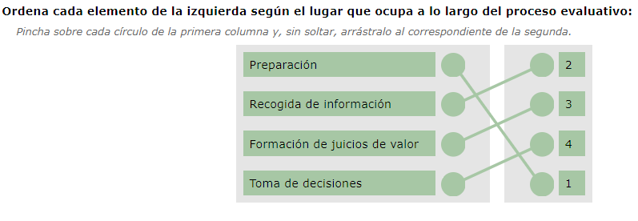
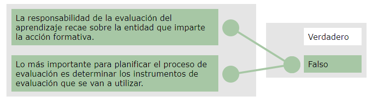

[TOC]

# MF1445 - Evaluación del proceso de enseñanza-aprendizaje en formación profesional para el empleo

# Unidad 01 - Evaluación en formación para el empleo aplicada a las distintas modalidades de impartición

---

## Introducción

En esta primera unidad del módulo de evaluación vamos a comentar los **conceptos básicos** y el **proceso que debemos seguir** para realizar la evaluación del alumnado.

Es una unidad sencilla que parte desde cero, definiendo los conceptos que vamos a necesitar para determinar el proceso de evaluación. Los contenidos que debemos asimilar están relacionados con la **evaluación de objetivos y competencias** que pretendemos que el alumnado consiga.

Los conceptos en los que debemos hacer más hincapié son los relacionados con la **medición** y la **evaluación**, ya que durante años se han confundido. También es importante comprender el **concepto actual de evaluación**. Por otro lado, debemos diferenciar claramente la **interpretación normativa** de los resultados frente a la **interpretación basada en criterios**.

En esta unidad vamos a reflexionar sobre los aspectos que debemos tener en cuenta para **planificar el proceso de evaluación**, tales como:

- 📌 ¿Qué vamos a evaluar?  
- 📌 ¿Cómo lo vamos a hacer?  
- 📌 ¿Qué fin perseguimos?  
- 📌 ¿Cuándo lo vamos a evaluar?  
- 📌 ¿Quién va a participar?

Además, comentaremos aspectos relacionados con la **evaluación de competencias** y el **procedimiento de acreditación** correspondiente.

**Objetivo**

El alumnado será capaz de **analizar los principios fundamentales de la evaluación**, así como las distintas formas que esta puede adoptar en función de su **finalidad**, **medios** y **colectivo**.

**Duración**

20 horas.

**Relación de contenidos**

1. La evaluación del aprendizaje.  
2. La evaluación por competencias.

**Criterios evaluativos**

**CE1.1.** Diferenciar medición y evaluación de resultados en función de los niveles de referencia (norma o criterio).  
**CE1.2.** Definir las condiciones que determinan que una evaluación sea **objetiva**, **fiable** y **válida**.  
**CE1.3.** Analizar las características de la normativa que regula la **evaluación por competencias**.  
**CE1.4.** Identificar las diferentes **modalidades de evaluación** atendiendo a su finalidad, momento de realización y agente evaluador.  
**CE1.5.** Distinguir los **instrumentos de evaluación** en función de sus características (aprendizajes simples o complejos) y tipos de contenido (teórico, práctico y profesional).

---

## 1. La evaluación del aprendizaje

### 1.1. Concepto de evaluación

#### 1.1.1. Introducción

Si buscamos bibliografía, podemos encontrar multitud de definiciones relacionadas con el concepto de evaluación. Algunos autores y autoras entienden por evaluación el **control del éxito o el fracaso**, en el sentido de identificar y medir resultados. Otros autores consideran la evaluación como una **ayuda para tomar decisiones racionales**.

Para esta Unidad de Aprendizaje tomaremos como referencia la siguiente definición:

> [!note] Definición
> 📢**Evaluar es valorar una realidad**, que forma parte de un proceso cuyos momentos previos son los de **fijación de características** de la realidad a valorar y de **recogida de información** sobre las mismas.  
> Sus etapas posteriores son la **información** y la **toma de decisiones** en función del juicio emitido.  
> *Fuente: Pérez y García (1989).*

La evaluación, como parte del proceso formativo, debe aplicarse a **todos los elementos constitutivos del mismo** y a aquellos aspectos que influyan en el resultado educativo; es decir, debe involucrar al **alumnado**, a los **docentes**, a los **programas**, a los **métodos y procedimientos**, al **material didáctico**, etc.

El proceso formativo comienza con la **detección de necesidades formativas** y la **formulación de unos objetivos** para satisfacerlas. Posteriormente se determinan las **estrategias de formación más adecuadas** para conseguir esos objetivos en el grupo de aprendizaje. Con todo ello se elabora un **plan de formación**.

📌**Elementos de una acción formativa que deben estar afectados por la evaluación**

- Diferentes acepciones
  - Toma de decisiones
  - Información
  - Medición
  - Logro de objetivos
  - Juicio
- Evaluación según quién evalúa
  - Auto-evaluación
  - Hetero-evaluación
  - Co-evaluación
- Evaluación según funcionalidad
  - Sumativa: apropiada para la valoración de productos o procesos terminados.
  - Formativa: valoración de procesos para mejorar y/o perfeccionar el proceso; permite formar decisiones de forma inmediata.
- Evaluación según su normotipo
  - Evaluación nomotécnica.
  - Evaluación normativa: posición ordinal en función del grupo.
  - Evaluación criterial: en función del logro individual.
  - Evaluación ideográfica.
- Evaluación por temporalización
  - Inicial: aplicada con objeto de detectar y valorar cómo se encuentran los estudiantes al inicio del proceso y poder determinar líneas de acción.
  - Procesal: evaluación continua para detectar avances y corregir si fuese necesario.
  - Final: realizada con objeto de conocer el impacto del proceso de enseñanza-aprendizaje.

> [!important]
>
> La evaluación es el mecanismo que nos permite **comprobar la idoneidad del plan de acción** para alcanzar los objetivos propuestos. Asimismo, es el medio fundamental para comprobar la **eficacia**, **eficiencia** y **impacto** de las acciones formativas realizadas.

---

#### 1.1.2. Evaluación docente

Cuando oímos o leemos la palabra evaluación tendemos a asociarla con los exámenes o con la medición del rendimiento del alumnado; sin embargo, la evaluación no solo debe limitarse a comprobar los resultados del alumnado, sino que también nos ayuda a **aumentar la calidad del aprendizaje y del rendimiento** de los alumnos y alumnas.

> [!note] Definición  
> 📢Conjunto de acciones que intentan verificar, de forma continua, en qué medida se han alcanzado los objetivos de aprendizaje previamente establecidos.
>
> La evaluación se centra más en el **proceso** que en el resultado, lo que permite tomar decisiones a tiempo para mejorar el aprendizaje.

El sentido de la evaluación docente es **comprobar y mejorar la eficacia del aprendizaje**; constituye un **control de calidad permanente** con la finalidad de mejorar tanto el proceso como el resultado.

No podemos identificar la evaluación como un instrumento de control para rendir cuentas, sino como un **instrumento para detectar los puntos fuertes y débiles** del proceso formativo, con el propósito de introducir las mejoras que se consideren oportunas.

La evaluación debe ser un **proceso paralelo al proceso educativo**, proporcionando la información necesaria para su **reajuste y perfeccionamiento continuos**.

---

#### 1.1.3. Funciones básicas de la evaluación docente

1. 📘 Recoger información sobre el alumnado, relacionada con su nivel de aprendizaje y su funcionamiento dentro del grupo; así como la información relacionada con la propia acción formativa.

2. 📊 Analizar toda la información posible y valorarla mediante la formulación de juicios.

3. 🎯 Ayudarnos a tomar decisiones que permitan orientar y mejorar tanto el aprendizaje del alumnado como el propio proceso de enseñanza-aprendizaje.

---

#### 1.1.4. ¿Con qué información comparamos los datos recogidos durante el proceso de evaluación?

- 🔄 **Información que ya tenemos del elemento o persona objeto de evaluación.**  
  De esta forma, podemos observar los cambios que han experimentado.

- 👥 **Información que tenemos de elementos/personas con características similares a las nuestras.**  
  Esto nos permite ver semejanzas y diferencias con otras situaciones formativas.

- 📏 **Información que nos aporta un criterio elegido previamente.**  
  De esta forma, comparamos lo conseguido con lo que se considera adecuado.

> [!note]
> Una vez recogida y valorada la información, la evaluación supone la **emisión de un juicio de valor** según unos criterios especificados previamente.

---

#### 1.1.5. Fases del proceso evaluativo

1. 📝 **Preparación**  
   Se elabora el plan de formación.

2. 📥 **Recogida de información**  
   Debemos hacernos las siguientes preguntas:  
   - ¿Qué información recoger? → Elementos a evaluar.  
   - ¿Dónde encontrarla? → Fuentes.  
   - ¿Cómo recogerla? → Técnicas e instrumentos.  
   - ¿Cómo registrarla? → Fichas de control.

3. ⚖️ **Formación de juicios de valor**  
   - Criterios e indicadores.  
   - Calificaciones.

4. 🎯 **Toma de decisiones**  
   Tras:  
   1. Evaluación inicial o diagnóstica.  
   2. Evaluación procesual o formativa.  
   3. Evaluación final o sumativa.

---

### 1.2. Planificación de la evaluación. Agentes intervinientes

#### 1.2.1. Introducción

Escamilla, A. y Llanos, E. (1995) expresan que la planificación del sistema de evaluación exige que tomemos decisiones de diversa índole, entre las que destaca la determinación de su propia metodología, es decir, las **técnicas** y los **instrumentos de evaluación**, así como también el **modelo para evaluar el aprendizaje** de los alumnos y alumnas.

> [!important]
> Vista así, la planificación del sistema de evaluación implica un proceso que se desarrolla de manera **sistemática**, **gradual** y **diversificada**.

**Preguntas a realizar para la planificación de la evaluación:**

El proceso evaluativo docente comienza con la **planificación de la evaluación**.

Si entendemos la evaluación como un **proceso**, necesitamos un planteamiento **sistemático** que sirva de guía para orientar el **qué**, **cómo**, **cuándo**, **con qué** y **para qué** evaluar.

- ❓ ¿Qué se va a evaluar?  
- ❓ ¿Cómo se evaluará?  
- ❓ ¿Cuándo se evaluará?  
- ❓ ¿Con qué se evaluará?  
- ❓ ¿Para qué se evalúa?

---

#### 1.2.2. Planificación de la evaluación

El plan de evaluación se elabora durante la **fase de diseño instruccional**, que es cuando se definen los **objetivos de aprendizaje**, los **contenidos** y los **criterios e instrumentos de evaluación**.

> [!important]
> El plan de evaluación determina la **estrategia evaluativa más adecuada** a seguir durante una acción formativa, para que el alumnado alcance los objetivos de aprendizaje.  
> Nos ayuda a responder a las siguientes preguntas:  
> - ¿Qué evaluar?  
> - ¿Cómo evaluar?  
> - ¿Cuándo evaluar?  
>
> De esta forma podemos prever las posibles dificultades que aparezcan y adoptar las acciones y recursos necesarios.

**Fases por las que pasa la planificación de la evaluación:**

1. 🎯 **Establecer con claridad los objetivos de aprendizajes finales** que se pretenden alcanzar en el ámbito de los conocimientos, habilidades y actitudes.

2. ⚖️ **Determinar el peso específico** que dichos objetivos tendrán en la puntuación final.

3. 🧪 **Seleccionar la técnica evaluativa** que se utilizará para recoger información sobre el nivel alcanzado por el alumnado en estos objetivos.

4. 📝 **Elaborar los instrumentos de medición** que se utilizarán.

5. 📥 **Aplicar dichos instrumentos** para recoger información.

6. 📊 **Analizar los resultados obtenidos**, teniendo en cuenta la interpretación normativa, criterial y/o individual que se quiera hacer, así como la ponderación específica de las informaciones obtenidas cuando se desee una valoración global.

En caso de que el formador o formadora no haya elaborado el plan de evaluación y no esté de acuerdo en algún aspecto, deberá **comunicárselo a los responsables** de la acción formativa para que puedan tomar una decisión al respecto.

> [!note]  
> Tener un **plan de evaluación por escrito** y consensuado entre el formador/a y las personas responsables de la acción formativa **facilita la acción evaluadora**, y elimina incertidumbres y malentendidos derivados de una falta de planificación.

📄**Propuesta de plantilla para el plan de evaluación**

- Plan general de evaluación

| Momento  | Descripción                    | Instrumentos / técnicas |
| -------- | ------------------------------ | ----------------------- |
| Inicio   | Nivel inicial                  |                         |
|          | Intereses y expectativas       |                         |
| Durante  | Aprendizaje                    |                         |
|          | Participación                  |                         |
| Al final | Nivel de aprendizaje adquirido |                         |
|          | Satisfacción del alumnado      |                         |

- Plan de evaluación por unidad didáctica

| Título de la unidad | Criterios o indicadores de evaluación | Instrumentos o técnicas a utilizar |
| ------------------- | ------------------------------------- | ---------------------------------- |
|                     |                                       |                                    |

Durante la elaboración del plan de formación también se **diseñan y se consiguen los instrumentos de evaluación** que necesitaremos.

---

#### 1.2.3. Agentes intervinientes en la evaluación docente

Aunque no siempre es posible, los agentes que emiten juicios sobre la formación deberían ser **todas las personas afectadas por ella**, desde el alumnado hasta la dirección de la organización, pasando por los docentes, el departamento de formación, los compañeros y compañeras, los superiores…

1. 👩‍🏫 **El personal docente**  
   Son las personas encargadas de evaluar al alumnado.  
   Actualmente también se está planteando una nueva estrategia de evaluación en la que **participa el alumnado**.

2. 🎓 **El alumnado**  
   Se encarga de **autoevaluarse**, valorando sus fortalezas y debilidades relacionadas con el proceso de aprendizaje.  
   También realiza la **evaluación del docente** y la **evaluación del proceso de aprendizaje** en el que ha participado.

3. 🧑‍💼 **Agentes externos de la evaluación**  
   Es la evaluación que se realiza **desde fuera del ámbito educativo**.  
   La llevan a cabo técnicos y técnicas en evaluación **contratados por la administración u otros organismos**.

> [!tip]
> Siempre que sea posible, es conveniente incorporar **autoevaluaciones** y **coevaluaciones**, ya que ayudan a mejorar la **autonomía**, la **reflexión** y la **implicación activa** de las personas en su propio proceso de aprendizaje.

---

### 1.3. Importancia de la evaluación: medir y evaluar

#### 1.3.1. ¿Qué es medir?

Evaluar y medir son dos procesos estrechamente relacionados, pero que **no pueden identificarse como una misma cosa**.

> [!note] Definición  
> Es uno de los momentos del proceso evaluativo y se preocupa de la **recogida de los datos necesarios** sobre los cuales serán hechos los juicios evaluativos.
>
> **Medir es comparar algo con una unidad que utilizamos como patrón, y evaluar es interpretar la medida.**

🟠**Aspectos importantes sobre la medida**

- Es un elemento **imprescindible** para la evaluación y puede ser:  
  - **Cuantitativa** (ej.: contestar 10 preguntas).  
  - **Cualitativa** (ej.: perfección de un dibujo).

- Por sí sola **no quiere decir nada**: para que tenga verdadero sentido debe ser **interpretada**.

- Para evaluar **hay que medir**, y en todo instrumento de medida **siempre cabe un error de medición**.

- La medida **no puede ser absolutamente exacta**, ya sea por:  
  - Falta de precisión del instrumento.  
  - Error humano al realizar la medida.  
  Por ello siempre se admite un **margen de error aceptable**, que varía según los casos.

- En el caso de las **conductas humanas**, los errores de medición son más frecuentes debido a la variabilidad del comportamiento y a la posible **subjetividad del observador**.

🟠**Ejemplo**

Una puntuación de **6** en un cuestionario evaluativo no nos dice nada.  
Para interpretarla habría que relacionarla con la **puntuación máxima**, la **media**, el **índice de dificultad**, etc.

> [!important]  
> La evaluación carece de procedimientos o técnicas infalibles, por eso debemos intentar que el **margen de error** afecte lo menos posible al rigor de nuestro trabajo.  
> Al utilizar un instrumento de evaluación debemos asegurarnos de que su margen de error es **aceptable**; de lo contrario, no estaremos midiendo de forma fiable y, si no evaluamos correctamente, nunca podremos conocer la **eficacia de la labor formativa**.

---

#### 1.3.2. ¿Qué es evaluar?

> [!note] Definición  
> 📢Evaluar es el proceso mediante el cual se **emite una serie de juicios** sobre la base de la información recibida gracias al proceso de **medición** (que garantiza datos más válidos y fiables).

La evaluación requiere medir, pero va más allá, ya que implica **valorar la información recogida** en función de unos **criterios establecidos**.

> [!note] Definición  
> 📢Los **criterios evaluativos** son los aspectos que vamos a tener en cuenta para diferenciar los **buenos resultados** de los **malos**, los **éxitos** de los **fracasos**.

Tendremos que determinar los **niveles de corrección** que deben presentar esos criterios para que sirvan como **patrón comparativo** y permitan valorar la información.

Como evaluar es **interpretar la medida** y consiste en establecer la puntuación a partir de la cual se considera aprobado el alumnado, es necesario contar con un **criterio unificado** para interpretar el valor de las calificaciones.  
Una vez aclarado y unificado este punto, podemos emitir el juicio: determinar si el alumno o alumna ha alcanzado o no el **nivel de aptitud**.

🔵**Para evaluar podemos utilizar dos sistemas: la norma y el criterio**

- 📊 **Evaluar con respecto a la norma**
  - Consiste en **comparar el rendimiento** o las realizaciones de un/a alumno/a con las de los demás.  
  - Sobre la base de esta comparación se emite un **juicio o valoración**.  
  - Es un procedimiento **objetivo**, pero la calificación final tiene en cuenta la **posición relativa** dentro del grupo, no solo el desempeño individual.  

  
  > [!tip]
  > Un alumno obtiene un **6** en un examen donde la **media es 4,8**; al estar por encima del grupo, su rendimiento se considera bueno.

- 📏 **Evaluar con respecto al criterio**
  - El criterio es un **elemento externo** a la persona evaluada.  
  - Establece las **condiciones o requisitos** que se deben cumplir para obtener una evaluación positiva.  

  
  > [!tip]
  > Si el criterio exige escribir **200 palabras por minuto** con un máximo de **2 errores**, un alumno que escribe **180 palabras y comete 1 error** no alcanza el objetivo aunque sea de los mejores del grupo.

🔵**Ejemplo**

El objetivo de un curso es redactar **tres oraciones subordinadas sin cometer ninguna falta de ortografía**.  
La persona que mejor lo ha hecho redactó **dos oraciones** y cometió **una falta**.

- Con respecto a la **norma** del grupo → es la **mejor**, ocupa el puesto nº 1.  
- Con respecto al **criterio** → **no ha alcanzado el objetivo**, porque el criterio era externo e independiente del resto del grupo.

---

### 1.4. Características del proceso de evaluación

#### 1.4.1. Características generales

Las características de la evaluación constituyen los **ejes** sobre los que se fundamenta el planteamiento que se haga de la misma. Veamos cómo debe ser la evaluación:

1. 🔧 **Útil**, en la medida en que sea:  
   - **Relevante**, porque contempla los aspectos más importantes.  
   - **Oportuna**, porque proporciona la información necesaria en el momento requerido.

2. 🌍 **Integral**, porque a través de su proceso se evalúa la **mayor diversidad de aprendizajes** y se considera a la persona evaluada en su totalidad (rendimiento, actitudes, capacidades…).

3. ♻️ **Continua**, ya que permite conocer y valorar, tanto cuantitativa como cualitativamente, el **progreso y evolución** de la persona a lo largo de su aprendizaje.  
   Se trata de un proceso sistemático que sigue un **orden secuencial** y permite el análisis y valoración de los resultados de aprendizaje.  
   Estos resultados constituyen la base para la programación docente “día a día”, así como para establecer actividades y procedimientos adecuados para solucionar las dificultades que van apareciendo.

4. 🔄 **Autocorrectiva**, ya que contempla **mecanismos de ajuste** de estrategias e instrumentos para futuras etapas del proceso de evaluación permanente.

5. 🤝 **Participativa y cooperativa**, ya que permite al alumnado **participar en la evaluación** de su propio proceso de aprendizaje.

6. 📚 **Acumulativa**, porque registra continuamente cómo la persona evaluada va desarrollando las **competencias profesionales**.  
   Se registran las calificaciones parciales a medida que se realizan evaluaciones.  
   Esto permite relacionar datos anteriores y actuales para obtener una **visión más amplia** de su evolución.

7. 🏅 **Acreditativa**, porque los resultados de la evaluación se traducen en **calificaciones nominales o numéricas** que se recogen en documentos oficiales (actas, informes, libro de calificaciones…), dando constancia de los estudios realizados.

8. 💡 **Innovadora**, ya que los cambios en los programas formativos requieren cambios también en el proceso de evaluación.  
   El rol docente debe incluir la creación de nuevos **medios e instrumentos** y la utilización de **procedimientos alternativos** a los habituales.

---

---

## Ejercicios

### Ejercicio 1: Ordena las fases del proceso evaluativo

---

### Ejercicio 2: Indica V ó F 

- **La responsabilidad de la evaluación del aprendizaje recae sobre la entidad que imparte la acción formativa.**
   ➡️ **Falso** (la responsabilidad recae principalmente en el *personal docente*, aunque la entidad puede establecer directrices generales)

- **Lo más importante para planificar el proceso de evaluación es determinar los instrumentos de evaluación que se van a utilizar.**
   ➡️ **Falso** (lo primero y más importante es **establecer los objetivos de aprendizaje**, tal como dice el temario)

---

