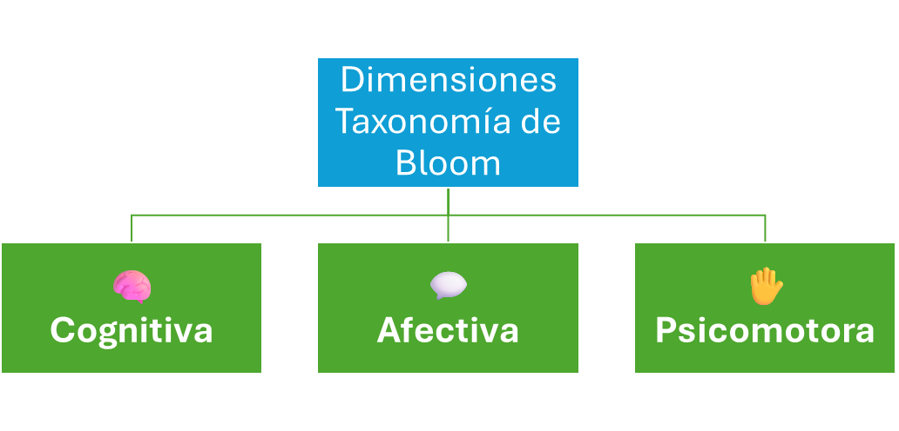
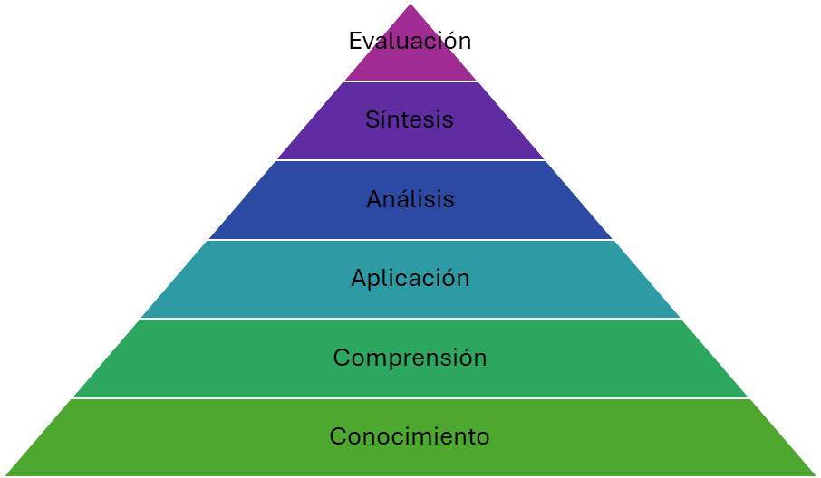
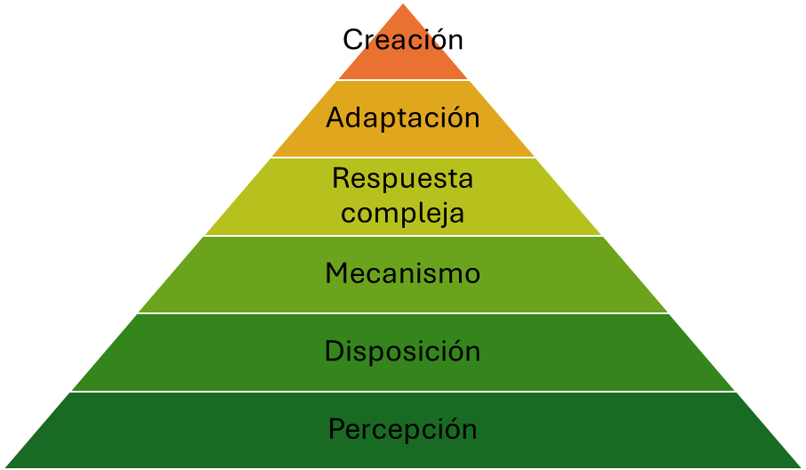
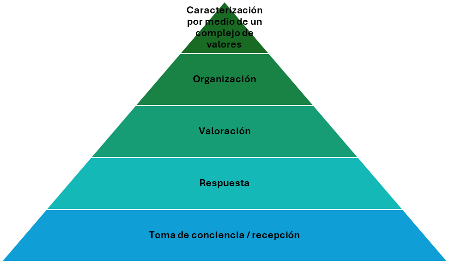
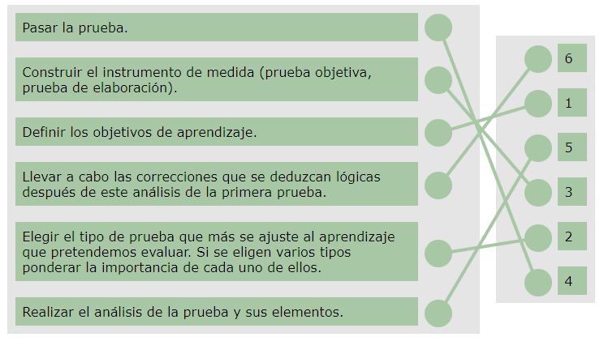
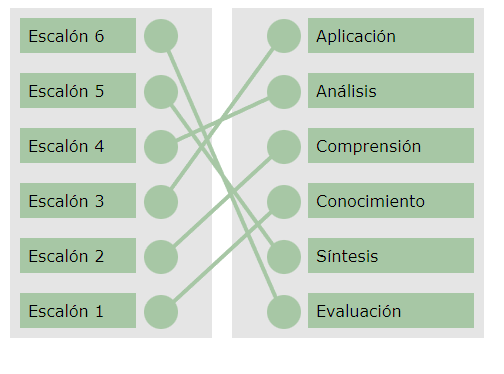
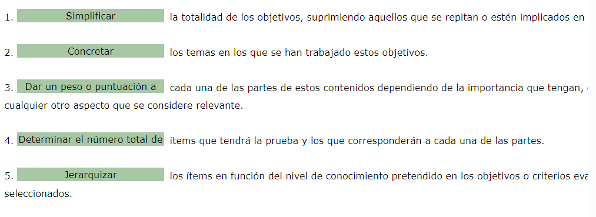
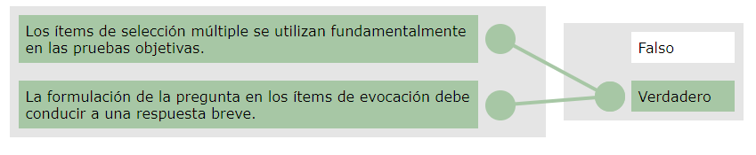
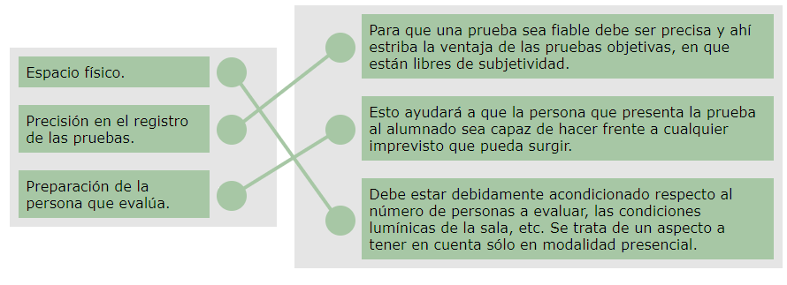
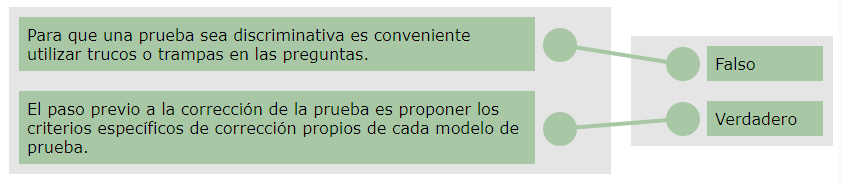

[TOC]

# MF1445 - Evaluación del proceso de enseñanza-aprendizaje en formación profesional para el empleo

# Unidad 02 - Elaboración de pruebas para la evaluación de contenidos teóricos

---

## Introducción y objetivos

En esta unidad vamos a trabajar el proceso para elaborar pruebas que permitan evaluar el nivel de adquisición de contenidos teóricos.

La parte más compleja de esta unidad es la relacionada con la **construcción de la tabla de especificaciones**.

Es importante planificar bien la prueba porque de esa forma estaremos evaluando los contenidos adecuados, en el nivel correspondiente y de la forma más adecuada.

1. 📌 Podemos evaluar la adquisición de **aprendizajes sencillos** y de **aprendizajes más complejos**.  
   👉 Para ello, vamos a utilizar diferentes tipos de ítems, y es fundamental distinguir **qué mide cada uno**, así como aplicar las **normas correctas de redacción**, con el fin de garantizar que la prueba que confeccionemos se ajusta al nivel de adquisición de los objetivos previstos.

2. 📌 Una vez confeccionada la prueba, hay que determinar las **normas de puntuación y corrección**.  
   👉 En las **pruebas objetivas**, estas normas suelen venir definidas.  
   👉 Pero para evaluar **aprendizajes complejos**, es necesario reflexionar previamente sobre los **indicadores de evaluación**, asignarles un **porcentaje de importancia** dentro del total y justificar esa decisión.  
   ✔️ Este aspecto es clave para lograr una evaluación más objetiva.

🎯**Objetivo de la unidad:**  
Elaborar pruebas de evaluación teórica, proporcionando orientaciones para su utilización en una acción formativa.

---

## 1. Elaboración de pruebas para la evaluación de contenidos teóricos

### 1.1 Introducción

> [!note] Definición  
> 📢 **Las pruebas** son "instrumentos técnicamente construidos que permiten a un sujeto, en una situación definida (ante determinados reactivos o ítems), evidenciar la posesión de determinados conocimientos, habilidades, destrezas, nivel de logros, actitudes, características de personalidad, etc. 
>
> Son instrumentos que permiten apreciar una variable, tal como es definida por la misma prueba o instrumento".  
> (García Ramos, 1994:81).

Si entendemos la prueba como el conjunto de **tareas (ítems) representativas de un tema** que debe realizar el alumnado como muestra de los conocimientos que ha adquirido, es importante prepararla adecuadamente para poder **valorar objetivamente** ese nivel de conocimientos.

El diseño y realización de una prueba de evaluación exige una **reflexión** sobre un conjunto de criterios que condicionan su eficacia.

> [!important]  
> Una prueba de evaluación no se puede improvisar, sino que debe ser fruto de un trabajo organizado, riguroso y responsable para que pueda tener un mínimo de garantía.

> [!tip] Recuerda
> Las **pruebas teóricas y prácticas** deben estar vinculadas entre sí. Ambas deben plantear la evaluación de competencias en situaciones y contextos significativos del ámbito de trabajo.

---

### 1.2. ¿Qué pasos seguir en el planteamiento de una prueba?

Para plantear una prueba de evaluación se deben realizar los siguientes pasos:

1. 📌 **Definir los objetivos de aprendizaje.**

2. ✔️ **Elegir el tipo de prueba** que más se ajuste al aprendizaje que pretendemos evaluar.   
   Si se eligen varios tipos, es necesario **ponderar la importancia** de cada uno.

3. 📝 **Construir el instrumento de medida** (prueba objetiva, prueba de elaboración).

4. 🚀 **Pasar la prueba.**

5. 🔍 **Realizar el análisis** de la prueba y sus elementos.

6. 🔧 **Aplicar las correcciones** que se deduzcan lógicas después del análisis de esta primera prueba.

> [!note] Más información
>
> ⚓Puedes ampliar información en los siguientes enlaces:
>
> - [¿Cómo elaborar correctamente preguntas de elección múltiple?](http://scielo.isciii.es/pdf/edu/v13n3/formacion.pdf)  
> - [5 Consejos para redactar con éxito el enunciado de una prueba o examen](http://justificaturespuesta.com/5-consejos-para-redactar-con-exito-el-enunciado-de-una-prueba-o-examen/)

---

### 1.3. Fases en la confección de la prueba

A la hora de elaborar una prueba es importante tener en cuenta las siguientes fases:

1. **Planificación de la prueba**

   Hay que elegir el **tipo de ítems** más apropiado teniendo en cuenta el objetivo que se pretende evaluar.

   También debemos centrarnos en los **objetivos y criterios evaluativos**, evitando recurrir a trivialidades.

   La calidad de la prueba depende de que **refleje adecuadamente los objetivos, tareas y actividades** tal y como se han trabajado en clase.  
   Esto es lo que llamamos **validez de la prueba**.

2. **Redacción**

   Los aspectos a tener en cuenta durante la redacción de una prueba de evaluación son los siguientes:

   - 🧩 **El vocabulario** debe ser adecuado y comprensible para todas las personas, independientemente de su nivel y acorde al utilizado en clase.
   - 📝 Redactar cada pregunta de forma que **exija una única respuesta correcta**, evitando ambigüedades o interpretaciones múltiples.
   - 🚫 Evitar **trucos o trampas** que puedan despistar a quien realmente conoce la respuesta.
   - ❗ Evitar **claves reveladoras** que permitan contestar a quien desconoce el tema.
   - 🔗 Cada ítem debe ser **independiente** de los demás: la respuesta de una pregunta no debe depender de otra anterior.

     > [!tip] Ejemplos  
     > Algunos errores comunes en la **redacción de ítems** son:
     >
     > - ❌ *Ambigüedad:*  
     >   “¿Cuál es la mejor herramienta para estudiar?” → Puede interpretarse de muchas formas.
     >
     > - ❌ *Dos respuestas posibles:*  
     >   “El docente debe planificar… a) siempre b) casi siempre” → Ambas pueden parecer correctas.
     >
     > - ❌ *Claves reveladoras:*  
     >   “El proceso de evaluación es… a) necesario b) inútil c) absurdo d) parte fundamental del aprendizaje”  
     >   → La opción correcta destaca demasiado.
     >
     > - ❌ *Trucos o trampas:*  
     >   “Señala la respuesta INCORRECTA que NO es falsa” → Redacción enrevesada que confunde.
     >
     > - ❌ *Dependencia entre ítems:*  
     >   Si la respuesta de la pregunta 3 solo puede deducirse si se acertó la pregunta 2, los ítems no son independientes.

3. **Análisis de la prueba**

   > [!important]  
   > Una vez terminada la prueba, hay que **analizarla** para identificar posibles deficiencias e introducir mejoras para las próximas pruebas.  
   > Es fundamental revisar la **dificultad de cada elemento** y valorar la **calidad de la prueba en su conjunto**.

   La dificultad de cada elemento, a modo orientativo, puede clasificarse en:

   - ⭐ **Muy fáciles**: contestados correctamente por más del 90%.
   - ✔️ **Fáciles**: contestados correctamente entre el 70% y el 90%.
   - 📌 **Normales**: contestados correctamente entre el 30% y el 70%.
   - ⚠️ **Difíciles**: contestados correctamente entre el 10% y el 30%.
   - ❗ **Muy difíciles**: contestados correctamente por menos del 10%.

   Además, es relevante conocer el **valor discriminativo** de cada elemento, que se obtiene calculando la diferencia entre el número de personas del nivel inferior y del nivel superior que responden correctamente al ítem.

   Para que la prueba sea **discriminativa**, debe contener elementos de **todos los grados de dificultad**, distribuidos al azar.

   A modo orientativo, se pueden establecer los siguientes porcentajes:

   - 10% de elementos muy fáciles  
   - 20% de elementos fáciles  
   - 40% de elementos normales  
   - 20% de elementos difíciles  
   - 10% de elementos muy difíciles  

> [!note]  Recuerda
> El tipo de prueba más utilizada para evaluar conocimientos es la **prueba objetiva**, ya que permite evaluar aprendizajes simples.  
> Para aprendizajes más complejos se utilizan la **prueba de ensayo breve** y el **ejercicio interpretativo**.

---

## 2. Evaluación de aprendizajes simples: prueba objetiva

### 2.1. Niveles de conocimiento: Taxonomía de Bloom

#### 2.1.1. Concepto

El paso previo para elaborar una prueba de evaluación consiste en **establecer una relación entre los objetivos y contenidos con los ítems** que se van a utilizar, para que así se adapten lo máximo posible al aprendizaje que se pretende medir.

> [!note] Definición  
> 📢 **La taxonomía** es la ciencia que trata de los principios, métodos y fines de la clasificación.

Toda taxonomía debe cumplir los siguientes principios:

- 📌 **Exhaustividad:** todo elemento de la realidad estudiada (taxón) debe encontrar una categoría en la que ubicarse.  
- 📌 **Equivalencia intra-clases:** todos los elementos de una clase son equivalentes.  
- 📌 **Jerarquía:** existen distintos niveles de agrupamiento, y los niveles superiores engloban a varios niveles inferiores.  
- 📌 **Exclusividad:** cada elemento pertenece en cada nivel a una única categoría.

> [!tip] Ejemplos  
> A continuación se muestran ejemplos sencillos de cada uno de los **principios que debe cumplir toda taxonomía**:
>
> - **Exhaustividad:**  
>   Si clasificamos contenidos educativos en *conceptuales, procedimentales y actitudinales*, cualquier contenido debe poder encajar en una de esas tres categorías.  
>   👉Ejemplo: “Cómo usar una etiqueta HTML” → procedimental; “Qué es un navegador web” → conceptual; “Interés por seguir aprendiendo” → actitudinal.
>
> - **Equivalencia intra-clases:**  
>   Dentro de una misma categoría, los elementos son equivalentes entre sí.  
>   👉Ejemplo: Dentro de la categoría “frutas”, *manzana*, *pera* y *melocotón* tienen el mismo nivel jerárquico (ninguna “manda” sobre otra).
>
> - **Jerarquía:**  
>   Las categorías superiores agrupan a varias categorías inferiores.  
>   👉Ejemplo: En una clasificación de animales, “mamíferos” puede contener “felinos”, “primates” o “roedores”.  
>   Igual que en Bloom, donde “Comprender” es superior a “Recordar”, pero inferior a “Aplicar”.
>
> - **Exclusividad:**  
>   Cada elemento debe pertenecer **solo a una categoría** dentro de cada nivel.  
>   👉Ejemplo: Un vídeo explicativo no puede clasificarse a la vez como “imagen” y “texto”; debe asignarse a un único grupo dentro del nivel: “recurso audiovisual”.

El concepto de **Taxonomía de objetivos** nace en 1956 del trabajo realizado por **Bloom** y otros psicólogos y pedagogos norteamericanos.

Esta taxonomía es una **clasificación de los diferentes objetivos** que el personal docente puede plantear a su alumnado, teniendo en cuenta que **no es posible alcanzar aprendizajes de nivel superior sin haber adquirido previamente los de nivel inferior**. Ofrece una visión global del proceso educativo, estructurada en tres dimensiones.

**Dimensiones de la taxonomía de Bloom**

- 🧠 **Cognitiva**  
- 💬 **Afectiva**  
- ✋ **Psicomotora**

📹**Vídeo explicativo**

  <iframe width="560" height="315"
    src="https://www.youtube.com/embed/aw-xvvI1pfU"
    title="Taxonomía de Bloom – Explicación sencilla"
    frameborder="0"
    allow="accelerometer; autoplay; encrypted-media; gyroscope; picture-in-picture; web-share"
    referrerpolicy="strict-origin-when-cross-origin"
    allowfullscreen>
  </iframe>

---

#### 2.1.2. Dimensión cognitiva

Según Bloom, para alcanzar un objetivo a nivel cognoscitivo es necesario pasar por **seis fases**, organizadas en una pirámide que representa las aptitudes y capacidades intelectuales.

Representa una **jerarquía real**, porque ningún escalón puede alcanzarse sin haber superado el anterior.

1. **Escalón 1: Conocimiento**  
   En este nivel, el alumnado debe recibir y recordar los **conocimientos básicos** que constituyen la base de las competencias necesarias para desempeñar una profesión.  
   Se trata de identificar **el conjunto de datos** que posee el alumnado.  
   Se evaluarán los objetivos o criterios que exigen recordar o reconocer **ideas, hechos, clasificaciones, métodos, teorías, criterios**, etc., previamente trabajados en el aula.

2. **Escalón 2: Comprensión**  
   Tras memorizar los datos, el proceso formativo debe asegurar que el alumnado **comprende su significado**.  
   Algunas personas pueden repetir contenidos sin comprenderlos realmente.  
   Evaluaremos la comprensión como la **interpretación de lo aprendido**: comparar, interpretar, extraer conclusiones y expresarlo de forma personal.

3. **Escalón 3: Aplicación**  
   Los conocimientos adquiridos deben poder **aplicarse correctamente** en situaciones concretas.  
   Evaluaremos si el alumnado es capaz de usar la información aprendida en **situaciones nuevas** o transferirla a **contextos distintos**.

4. **Escalón 4: Análisis**  
   La meta de este nivel es preparar al alumnado para **detectar y analizar problemas**.  
   Evaluaremos su capacidad para **descomponer la información en partes**, observar sus relaciones, identificar elementos, causas y pasar del **todo a las partes**.

5. **Escalón 5: Síntesis**  
   En este escalón se busca combinar partes para formar un **nuevo conjunto informativo**.  
   Una síntesis adecuada implica **ordenar ideas, experiencias o puntos de vista** para generar un resultado nuevo, coherente y comprensible.

6. **Escalón 6: Evaluación o valoración**  
   Las personas emiten continuamente **juicios de valor** sobre lo que aprenden.  
   Evaluaremos la capacidad del alumnado para **evaluar o valorar métodos, soluciones o procesos**, basándose en criterios fundamentados.

---

#### 2.1.3. Dimensión psicomotora

Esta dimensión clasifica las **destrezas motrices**, entendidas como aquellas conductas que se realizan con **precisión**, coordinación y control.

Las destrezas varían según su **frecuencia**, la **energía** empleada y su **duración**.  
Los objetivos psicomotores apuntan al **desarrollo gradual** de habilidades, avanzando desde respuestas básicas hasta actuaciones complejas y creativas.

1. **Escalón 1: Percepción**  
   El alumnado identifica, reconoce y selecciona estímulos antes de realizar una acción motriz.  
   Implica observar, escuchar, discriminar señales y preparar la respuesta adecuada.

2. **Escalón 2: Disposición**  
   Supone la preparación física y mental para actuar.  
   Incluye la actitud, la predisposición y la atención necesarias para comenzar una tarea motriz.

3. **Escalón 3: Mecanismo**  
   La habilidad comienza a ejecutarse con **mayor control y seguridad**, aunque aún requiere cierto grado de concentración.  
   El movimiento se vuelve más fluido y consistente.

4. **Escalón 4: Respuesta compleja**  
   Coordinación eficaz de **múltiples habilidades motoras** dentro de una misma acción.  
   La ejecución es fluida, controlada y precisa.

5. **Escalón 5: Adaptación**  
   El alumnado es capaz de **ajustar** sus habilidades a situaciones nuevas o imprevistas.  
   Modifica movimientos según las demandas del entorno o la tarea.

6. **Escalón 6: Creación**  
   Nivel superior en el que la persona **integra y combina habilidades** para generar una actuación motriz nueva, personal y compleja.  
   Supone creatividad, dominio y control avanzado de las destrezas adquiridas.

---

#### 2.1.4. Dimensión afectiva

El criterio que sirve de base para discriminar las categorías de los objetivos en el **campo afectivo** es el **grado de interiorización** de una actitud o valor en la conducta del alumnado.

Estos objetivos se manifiestan, por ejemplo, a través de la **recepción**, la **respuesta** y la **valoración**.

A continuación se presentan los **escalones de la dimensión afectiva**, organizados de menor a mayor nivel de interiorización:

1. **Escalón 1: Toma de conciencia / Recepción**  
   El alumnado muestra atención, escucha y disposición inicial para percibir un valor, una norma o una actitud.  
   Implica estar abierto a recibir estímulos y reconocer su existencia.

2. **Escalón 2: Respuesta**  
   El alumnado no solo percibe el valor, sino que **reacciona** ante él.  
   Muestra participación, interés o voluntariedad en relación con la actitud trabajada.

3. **Escalón 3: Valoración**  
   El valor o actitud comienza a formar parte de su **sistema personal de creencias**.  
   El alumnado muestra aceptación, preferencia o compromiso hacia ese valor.

4. **Escalón 4: Organización**  
   El alumnado **integra y organiza** distintos valores, comparándolos, estructurándolos y jerarquizándolos dentro de su propio sistema.  
   Requiere reflexión, coherencia y establecimiento de prioridades.

5. **Escalón 5: Caracterización por medio de un complejo de valores**  
   El valor ya está completamente **interiorizado** y se refleja de manera estable en la conducta del alumnado.  
   Se manifiesta una actuación coherente y consolidada basada en un conjunto estructurado de valores personales.

---

### 2.2. Tabla de especificaciones

#### 2.2.1. Definición y pautas

En la planificación de una prueba es importante elaborar la **tabla de especificaciones**, ya que permite **relacionar los objetivos con la evaluación** de manera coherente y organizada.

> [!note] Definición  
> 📢 **La tabla de especificaciones** se trata de una herramienta de evaluación que representa la forma en que la prueba será diseñada y cuya función consiste en determinar los aspectos a evaluar, asignándoles una puntuación congruente con los niveles de conocimiento estipulados en el programa formativo.

Para construirla correctamente debemos establecer:

- 🎚️ **El nivel** en que serán medidos los contenidos o aspectos a evaluar.  
- ⚖️ **El peso** que tendrán en conjunto dentro de la prueba.

Por lo tanto, las **pautas** que se suelen aplicar en la selección de contenidos a evaluar son las siguientes:

1. **Seleccionar los objetivos** que se quieren medir.  
2. **Decidir un número de ítems proporcional** a la importancia de los contenidos que se desean evaluar.  
3. **Conocer, antes del desarrollo de la prueba**, los objetivos alcanzados y las competencias desarrolladas que deben ser evaluadas.

> [!tip] Recuerda  
> La evaluación de un aprendizaje debe partir siempre de los **objetivos**, pero **no todos ellos** serán objeto de evaluación.  
> Evaluarlo absolutamente todo haría que las pruebas fueran **interminables** y **poco rentables**.

---

#### 2.2.2. ¿Cómo se elabora?

La información se plasma en un documento y su elaboración pasa por las siguientes fases:

1. **Simplificar los objetivos**, eliminando aquellos que se repitan o que ya estén implícitos en otros.  
2. **Concretar los temas** en los que se han trabajado esos objetivos.  
3. **Asignar un peso o puntuación** a cada una de las partes de los contenidos, en función de su importancia, el tiempo dedicado u otros criterios relevantes.  
4. **Determinar el número total de ítems** que tendrá la prueba y cuántos corresponderán a cada una de las partes.  
5. **Jerarquizar los ítems** según el nivel de conocimiento pretendido en los objetivos o criterios evaluativos seleccionados.  
   Es conveniente que la prueba se centre en la **comprensión** y la **aplicación**, más que en conocimientos meramente memorísticos.

> [!note]
>
> Se suele representar como una **tabla de doble entrada**, en la que se relacionan los objetivos y contenidos de un apartado, tema o Unidad de Aprendizaje con el tipo de preguntas y el nivel que se debe alcanzar en esos objetivos o criterios cognoscitivos a evaluar.

  <iframe width="560" height="315"
    src="https://www.youtube.com/embed/xV-i5tjNjro"
    title="Tabla de especificaciones – Ejemplo práctico"
    frameborder="0"
    allow="accelerometer; autoplay; encrypted-media; gyroscope; picture-in-picture; web-share"
    referrerpolicy="strict-origin-when-cross-origin"
    allowfullscreen>
  </iframe>

---

#### 2.2.3. ¿Qué ventajas nos aporta?

Realizar una **tabla de especificaciones** es funcional y práctico, ya que nos permite:

- 📊 **Hacer una distribución representativa** de los contenidos a evaluar, evitando dar una importancia desproporcionada a los aspectos que más nos gustan.  
- 🧭 **Establecer criterios de corrección** y guiar la redacción de preguntas para que sean claras y precisas.  
- 🔗 **Garantizar coherencia** entre los objetivos, los contenidos y las preguntas seleccionadas.  
- 🎚️ **Ajustar el nivel de dificultad**, ya que se tienen en cuenta todos los objetivos que se van a evaluar y el tipo de pregunta más adecuado para cada uno.  
- 📏 **Determinar la longitud adecuada de la prueba**, al conocer el número total de ítems y cuántos corresponden a cada parte.  
- 🗂️ **Ordenar adecuadamente los ítems**, evitando que todos los difíciles o todos los fáciles queden al principio y permitiendo una progresión coherente del nivel de dificultad.

---

### 2.3. Tipos de ítems: normas de elaboración y corrección

#### 2.3.1. Introducción

No es lo mismo elaborar un ítem para comprobar la **memorización** de información que para detectar si el alumnado **comprende** lo aprendido o si es capaz de **aplicarlo** en situaciones profesionales concretas.  

En cada caso, el ítem debe redactarse de **forma diferente**, ajustándose al nivel cognitivo que se pretende evaluar.

A continuación se muestran los **tipos de ítems** más habituales que podemos crear en una prueba de evaluación

- 🧠 **Ítems de evocación**  
- ⚖️ **Ítems de dos alternativas** (verdadero/falso; sí/no)  
- 📝 **Ítems de selección múltiple**  
- 🔗 **Ítems de correspondencia**

---

#### 2.3.2. Ítems de evocación

Son preguntas que exigen al alumnado **evocar**, **recordar** o **redactar** respuestas concretas.

Podemos clasificarlos en:

- ✏️ **Respuesta breve:** la respuesta se reduce a una palabra, frase, símbolo, fecha, etc.  
- 📄 **Texto incompleto:** el alumnado debe completar un enunciado insertando una o varias palabras que faltan.

🔴**Elaboración**

En su elaboración hay que tener en cuenta lo siguiente:

1. **La formulación debe conducir a una respuesta breve.**  
2. **Evitar expresiones idénticas** a las que aparecen en los manuales.  
3. Es preferible **la pregunta directa** frente a la oración incompleta.  
4. En **respuestas numéricas**, indicar siempre la **unidad** (metros, litros, etc.).  
5. No deben **superar el 20%** del total de ítems de la prueba.

🔴**Aplicaciones**

Estos ítems permiten:

1. 📌 **Medir conocimientos de datos simples.**  
2. 🔍 **Detectar la captación de ideas fundamentales.**  
3. 🗺️ **Utilizar bases diversas:** mapas, esquemas, dibujos, textos…  
4. 🚫 **Evitar la respuesta por adivinación.**

🔴**Corrección**

En cuanto a la corrección, la **puntuación directa** equivale al **número de aciertos**.
$$
\text{Puntuacion directa} = \text{Numero de aciertos}
$$
🔴**Ejemplo**

> [!tip] Ejemplo
>
> - ¿Qué es evaluar con respecto al criterio?  
> - Las destrezas que el formador/a pone en juego en el momento de la impartición para lograr los objetivos se llaman…

---

#### 2.3.3. Ítems de dos alternativas (v/f; sí/no)

En este tipo de pruebas, el alumnado debe contestar a un enunciado con una respuesta de **verdadero/falso** o **sí/no**.

🟠**Elaboración**

En la elaboración de este tipo de ítems hay que tener en cuenta los siguientes aspectos:

1. **Cada enunciado debe incluir solo una idea o concepto.**  
2. La respuesta verdadera o falsa debe ser **lo más categórica posible**.  
3. **Evitar proposiciones demasiado generales**, ya que suelen tener excepciones.  
4. **No introducir claves ajenas a la respuesta:**  
   - 🚫 Las palabras **“siempre”**, **“nunca”**, **“nadie”** suelen asociarse a respuestas *falsas*.  
   - ✔️ Las palabras **“comúnmente”** y **“a veces”** suelen asociarse a respuestas *verdaderas*.  
5. Redactar los ítems **positivos y negativos con la misma extensión**.  
6. **Evitar formulaciones negativas y dobles negaciones.**

🟠**Aplicaciones**

Estos ítems permiten:

1. 🔍 **Identificar relaciones causa–efecto.**  
2. 🧠 **Diferenciar conclusiones válidas** de aquellas que no lo son.  
3. 🗂️ **Distinguir entre hechos y opiniones.**

🟠**Corrección**

En cuanto a la corrección, debemos regirnos por la fórmula:

$$
\text{Puntuacion Directa} = \text{Numero de aciertos} - \text{Numero de errores}
$$

🟠**Ejemplo**

> [!tip] Ejemplo
> Todo mensaje tiene dos aspectos: uno intelectual (lo que decimos) y otro afectivo (cómo lo decimos):
>
> Verdadero.  
> Falso.

---

#### 2.3.4. Ítems de selección múltiple

En las pruebas de selección múltiple, el alumnado debe elegir la **respuesta correcta** entre varias alternativas que se le presentan.

🟡**Elaboración**

En su elaboración hay que tener en cuenta los siguientes aspectos:

1. **La base del ítem debe tener significado por sí misma**, sin necesidad de leer las alternativas.  
2. Debe plantear **un problema definido**.  
3. Utilizar formulaciones **negativas solo cuando sea imprescindible**.  
4. La respuesta correcta debe ser **única**.  
5. Evitar **sobrecargar la base del ítem** (incluir solo lo necesario).  
6. Todos los **distractores deben parecer razonables**.  
7. Variar **al azar** la posición de la respuesta correcta.  
8. Evitar distractores como **“Todas las anteriores”** o **“Ninguna de las anteriores”**.  
9. Variar la **longitud** de la respuesta correcta para evitar pistas.  
10. Evitar **coincidencia o inclusión mutua** entre alternativas.  
11. Evitar términos absolutos en los distractores (❌ “siempre”, “nunca”, “todo”).  
12. Comprobar que **no existen ítems que den pistas** para responder otros.  
13. Verificar que las palabras repetidas en todas las alternativas **pertenecen a la base**, no a las opciones.  
14. Si se mide comprensión de términos, el término va en la **base** y las definiciones en las **alternativas**.  
15. A mayor número de distractores, **menor probabilidad de acertar al azar**.

🟡**Estrategias**

Algunas estrategias útiles para elaborar ítems de selección múltiple:

1. 🧩 Usar como distractores los **errores comunes** del alumnado.  
2. 🗣️ Enunciar las alternativas en el **lenguaje del alumnado**.  
3. 🎧 Utilizar palabras que “suenen bien” tanto en distractores como en la respuesta correcta.  
4. 📏 Hacer los distractores **semejantes en longitud y complejidad** a la respuesta correcta.  
5. 🧪 Usar con moderación **claves extrañas** (términos demasiado técnicos o rebuscados).

🟡**Aplicaciones**

Estos ítems permiten evaluar:

1. 📌 **Conocimientos de datos específicos** (quién, qué, dónde, cuánto, cuándo).  
2. 📚 **Conocimiento de terminología** (“¿Qué significa…?”).  
3. 🔧 **Conocimiento de métodos o procedimientos** (“¿Qué método se usa para…?”).  
4. 🧠 **Conocimiento de teorías** (“¿Qué principios son esenciales en…?”).  
5. 🗂️ **Comprensión de categorías** (“¿Cuál de las siguientes sustancias es la única orgánica?”).  
6. ⚙️ **Comprensión de principios** (“¿Puede utilizarse la ley de Pascal para explicar…?”).  
7. 🧮 **Aplicación de principios y generalizaciones** (“Si n + 8n = 36, ¿cuánto vale n?”).

🟡**Puntuación**

La corrección de estos ítems suele aplicarse con la siguiente fórmula:

$$
\text{Puntuacion directa} =
\text{Numero de aciertos} -
\displaystyle\left(\frac{\text{Numero de errores}}{\text{Numero de alternativas} - 1}\right)
$$

🟡 **Ejemplo**

> [!tip] Ejemplo  
> **¿A qué variable del aprendizaje corresponde la siguiente definición?**  
> “Proporcionar datos al alumno/a acerca de los aciertos o fallos de su ejecución.”  
>
> a) Refuerzo  
> b) Retroalimentación  
> c) Aprendizaje significativo

---

#### 2.3.5. Ítems de correspondencia

La respuesta a este tipo de ítems consiste en **asociar parejas de elementos** que pertenecen a **dos conjuntos de información**.

🟢**Elaboración**

En su elaboración debemos tener en cuenta los siguientes aspectos:

1. **Describir claramente en las instrucciones** en qué consisten los dos conjuntos de información.  
2. El material del ítem debe ser **homogéneo** y caber **en la misma cara del folio**.  
3. Es conveniente que el número de premisas sea **breve** (entre 4 y 7).  
4. Se debe confeccionar un número **desigual** de premisas y respuestas, explicando que **cada respuesta puede utilizarse una vez, varias veces o ninguna**.  
5. Las respuestas deben seguir un **orden lógico** (alfabético, numérico…).  
6. Evitar **claves reveladoras** verbales, gramaticales o derivadas de la heterogeneidad del contenido.

🟢**Aplicaciones**

Estos ítems permiten:

1. 🔗 **Identificar relaciones** entre dos elementos o conceptos.  
2. 📚 **Evaluar gran cantidad de contenido** en poco tiempo, por la densidad y variedad de información que pueden incluir.

🟢**Puntuación**

Lo más operativo es asignar una puntuación determinada según el número de aciertos en cada ítem. Por ejemplo:

- Ítem **correcto** → **4 puntos**  
- Ítem con **1 fallo** → **2 puntos**  
- Ítem con **2 fallos** → **1 punto**  
- Ítem con **más de 2 fallos** → **0 puntos**

🟢**Ejemplo**

> [!tip] Ejemplo  
> Une cada etapa por las que pasa un grupo de aprendizaje con las necesidades correspondientes:  
> | **Etapas**                                                   | **Necesidades**                                              |
> | ------------------------------------------------------------ | ------------------------------------------------------------ |
> | 1. Inclusión 2. Estructuración 3. Desarrollo 4. Producción | a) Alcanzar objetivos b) Comprender hacia dónde va el aprendizaje c) Consolidar participación d) Desarrollar confianza e) Estimular la realización del trabajo f) Orientar el aprendizaje hasta el objetivo g) Sentirse integrado h) Sentirse seguro |

---

### 2.4. Instrucciones para la aplicación de las pruebas

Una vez elaborada la tabla de especificaciones y redactados los ítems, debemos comprobar si la prueba es **fiable** y **válida**.

- **Fiabilidad:** una prueba es fiable cuando ofrece resultados estables al aplicarla en diferentes contextos o momentos.
- **Validez:** una prueba es válida cuando realmente mide lo que tiene que medir y cumple el objetivo para el que ha sido diseñada.

Al presentar la prueba al alumnado, su éxito dependerá de varios factores:

**📍 Espacio físico**  
Debe estar acondicionado según el número de personas, con buena iluminación y sin distracciones.  
*(Solo aplica en modalidad presencial.)*

**🪑 Materiales y mobiliario**  
Debe haber folios suficientes, mesas y sillas adecuadas y cualquier recurso que necesite el alumnado para realizar la prueba.

**👤 Condiciones personales del alumnado**  
Hay que adaptar luz, mobiliario o materiales si algún alumno/a lo requiere por motivos físicos, sensoriales o cognitivos.

**📝 Precisión en el registro de las pruebas**  
La fiabilidad depende de que el registro de respuestas sea claro y preciso.  
Las pruebas objetivas ayudan porque reducen la subjetividad.

**👩‍🏫 Preparación de la persona que evalúa**  
El docente debe estar preparado para resolver dudas, explicar instrucciones y afrontar imprevistos.

**⏱ Tiempo de realización**  
Debe ser suficiente para que el alumnado pueda completar la prueba sin prisas innecesarias, pero sin excederse para no perder la atención.

**📘 Instrucciones claras**  
Deben estar bien redactadas para orientar al alumnado sobre cómo realizar la prueba.

Algunos aspectos importantes que debemos indicar en estas instrucciones son los siguientes:

- **📄 Relacionados con la prueba**

  - Indicar si es una prueba objetiva o de elaboración.  

  - Explicar qué materiales incluye (enunciado, hoja de respuestas…).  

  - Si hay varias versiones, explicar cómo elegir la correcta.  

  - Señalar si pueden usar material auxiliar (lápiz, calculadora…).  

  - Indicar cuántas preguntas tiene y de qué tipo son.  

  - Especificar el tiempo total y, si conviene, el tiempo sugerido por pregunta.  

    > [!tip]
    >
    > Para ítems de pruebas objetivas se calcula **1 minuto por pregunta**.

- **🧠 Relacionados con la forma de trabajar**
  - Indicar si se responde sobre la propia prueba o en una hoja aparte.  
  - Explicar cómo registrar cada respuesta.  
  - Indicar cómo corregir una respuesta en caso de equivocación.  
  - Explicar qué hacer si necesitan una aclaración o resolver una duda.
- **🧮 Relacionados con corrección y puntuación**
  - Indicar si todas las preguntas valen lo mismo.  
  - Especificar si deben contestarlas todas o pueden dejar alguna en blanco.  
  - Explicar si las respuestas incorrectas restan puntuación.  
  - En preguntas de alternativas, aclarar si hay una única respuesta correcta o varias.  
  - Especificar la calificación mínima para superar la prueba.
- **📦 Relacionados con la entrega**
  - Indicar si deben escribir sus datos y los de la prueba.  
  - Aclarar si pueden entregar y marcharse cuando terminen.  
  - O si deben permanecer en su sitio hasta que finalice el tiempo asignado.

---

### 2.5. Estructura de la prueba objetiva: encabezado, instrucciones generales e instrucciones específicas

#### 2.5.1. ¿Qué son las pruebas objetivas?

Las pruebas objetivas constan de un conjunto de preguntas breves que el alumnado debe contestar **de forma rápida, sencilla y siempre con una única respuesta posible**.  
Las respuestas aceptables están **predeterminadas** y el procedimiento de corrección también, lo que reduce la subjetividad.

Este tipo de prueba permite evaluar **aprendizajes sencillos**, que corresponden a los tres primeros escalones de la pirámide de Bloom:

- 🧠 **Conocimiento**  
- 🔍 **Comprensión**  
- 🛠️ **Aplicación**

> [!warning] 
> Para evaluar aprendizajes más complejos (análisis, síntesis y evaluación) utilizaremos **pruebas de elaboración**, ya que requieren respuestas desarrolladas y razonamientos más profundos.

Los tipos de ítems más utilizados en las pruebas objetivas son:

- ✏️ Ítems de evocación (respuesta breve, texto incompleto)  
- ⚖️ Ítems de dos alternativas (Verdadero/Falso, Sí/No)  
- 🔡 Ítems de selección múltiple  
- 🔗 Ítems de correspondencia

---

#### 2.5.2. Encabezado

El encabezado recoge la información necesaria para identificar la prueba, a la persona que la realiza y al personal docente. Incluye:

- **📝 Datos de la prueba:**  
  - Nombre y número de la unidad o tema  
  - Ubicación dentro del módulo o curso  
  - Código identificativo (si procede)  
  - Tipo de prueba (modular, final, recuperación…)

- **👤 Datos de la persona participante:**  
  - Nombre y apellidos  
  - Firma  
  - DNI
  - Teléfono  

- **👩‍🏫 Datos del personal docente:**  
  - Nombre y apellidos

---

#### 2.5.3. Instrucciones generales

Las instrucciones generales explican al alumnado **cómo son las preguntas** y **cómo deben responderlas**.  
Incluyen orientaciones **antes**, **durante** y **después** de realizar la prueba, para que sepan exactamente qué se espera de ellos.

- **🟦 Antes de empezar:**  
  - Qué tipos de preguntas se van a encontrar (alternativas, V/F, respuesta breve…).  
  - Si deben elegir opciones, completar huecos o escribir respuestas breves.  

- **🟨 Durante la prueba:**  
  - Cómo se deben registrar las respuestas.  
  - Recomendación de leer bien cada ítem y contestar con claridad.  
  - Recordatorio del tiempo disponible para evitar prisas al final.  

- **🟩 Al finalizar:**  
  - Qué hacer cuando terminen (entregar la prueba, revisar, esperar instrucciones…).  

> [!tip] Ejemplo
>
> A continuación encontrarás una serie de preguntas de diferente tipo.  
> En algunas deberás elegir una opción y en otras completar un hueco con una palabra.  
>
> Asegúrate de que entiendes cada pregunta antes de responder y escribe tus respuestas de forma clara.  
>
> El tiempo máximo para realizar la prueba es de **30 minutos**.  
>
> ¡Adelante!

---

#### 2.5.4. Instrucciones específicas

Las instrucciones específicas indican **cómo responder cada tipo de ítem**, cómo **registrar** o **corregir** una respuesta y cómo funciona el **sistema de puntuación** de la prueba.  
Son más detalladas que las instrucciones generales y se adaptan al formato concreto de cada pregunta.

Incluyen aspectos como:

- **✏️ Cómo contestar:**  
  - Si deben escribir una palabra, completar un hueco, seleccionar una opción, relacionar columnas, etc.

- **🖊️ Cómo registrar la respuesta:**  
  - Marcar con un círculo, subrayar, escribir en un recuadro, señalar una letra…

- **❌ Cómo anular una respuesta:**  
  - Tachar con una línea, marcar “X”, corregir en otra casilla, según lo que permita la prueba.

- **🧮 Cómo funciona la puntuación:**  
  - Si las respuestas incorrectas restan  
  - Si todas las preguntas puntúan igual  
  - Si pueden dejar alguna sin contestar  
  - Si hay una o varias respuestas válidas en preguntas de alternativas

> [!tip] Ejemplos
>
> - “Completa con la palabra correcta…”  
> - “Señala con un círculo la respuesta correcta…”  
> - “Relaciona cada término con su definición…”  
> - “Marca V si es verdadero o F si es falso…”  
> - “Escribe tu respuesta en el cuadro indicado…”

---

#### 2.5.5. Elementos de pruebas objetivas a lo largo de un manual

Cuando una prueba objetiva está distribuida en varias hojas dentro de un manual, suele organizarse en tres partes fundamentales:

- **📘 Protocolo / Reactivos**  
  - Contiene las preguntas o ítems de la prueba.  
  
  - Se presentan normalmente en **dificultad progresiva**:  
    primero las más sencillas, después las de dificultad media y finalmente las más complejas.  
    
    > [!tip]
    > Es habitual cerrar la prueba con alguna pregunta más sencilla para reducir la tensión final del alumnado.
  
- **📝 Hoja de respuesta**  
  - Es el documento donde el alumnado registra sus respuestas.  
  - No siempre es necesario usar una hoja aparte; en algunas pruebas se responde directamente sobre el protocolo si resulta más cómodo.

- **🔑 Clave de respuesta**  
  - Recoge la **respuesta correcta** de cada ítem.  
  - Se utiliza para corregir la prueba de manera rápida, clara y objetiva.

---

### 2.6. Instrucciones para la aplicación, corrección y calificación de las pruebas

A la hora de aplicar una prueba, lo primero es **entregar el material al alumnado** y explicar las normas de aplicación, tanto generales como específicas.

> [!caution]  
> Es fundamental recordarles que **rellenen los datos del encabezado** para evitar confusiones y tener todas las pruebas correctamente identificadas.

La corrección y la calificación forman parte de la evaluación, pero **evaluar es mucho más que calificar**.  
Antes de corregir, es necesario definir:

- los **criterios específicos de corrección**  
- las **normas de puntuación**  
- cómo se va a **interpretar** cada resultado  

La corrección consiste en comparar el trabajo del alumnado con los criterios establecidos, y la calificación es la traducción de ese rendimiento a una nota.

🟦 **<u>¿Cómo corregimos la prueba?</u>**

🔹**Corrección con fórmula para evitar el efecto del azar:**

Cuando se quiere evitar que responder al azar dé ventaja, se utiliza la fórmula:
$$
Nota = Aciertos - Errores / (NumeroAlternativasDeLaPregunta - 1)
$$

> [!tip] Ejemplo
>
> - Si hay **3 respuestas**, cada error resta **0.5**  
> - Si hay **4 respuestas**, cada error resta **0.33**  
> - Si hay **5 respuestas**, cada error resta **0.25**  
> - Y así sucesivamente.

🔹**Cálculo directo de cuánto debe penalizar cada pregunta**

Si no quieres usar la fórmula completa, puedes calcular cuánto debe restar cada error así:

$$
PenalizacionPorError = 1 / (NumeroAlternativasDeLaPregunta - 1)
$$

  > [!tip] Ejemplos
  > 
  > | Número de respuestas | Cuánto descuenta cada error |
  > | -------------------- | --------------------------- |
  > | 2                    | 1                           |
  > | 3                    | 1/2 = 0,5                   |
  > | 4                    | 1/3 = 0,33                  |
  > | 5                    | 1/4 = 0,25                  |
  > | …                    | …                           |
  > | N                    | 1 / (N - 1)                 |

🟦 <u>**¿Cómo puntuamos la prueba?**</u>

Existen dos formas principales:

- **1. Suma de aciertos**  
  Se usa cuando hay **muchas alternativas** (5 o más) o en **preguntas de desarrollo**.

- **2. Suma de aciertos con corrección por adivinación**  
  Se usa cuando hay **4 o menos alternativas** y queremos compensar el azar.

> [!important]  
> Muñiz (1994) propone la fórmula:  
> $$
> Puntuacion = Aciertos - [Errores / (NumeroAlternativas-1)]
> $$

Para usar esta fórmula deben cumplirse estas condiciones:

1. Los aciertos se deben a conocimiento o azar.  
2. Los errores se deben a desconocimiento o azar.  
3. Si alguien responde todo al azar, tiene la misma probabilidad de acertar.

> [!note]
>
> Fórmula alternativa si se quiere **premiar las omisiones**
> $$
> \text{Puntuacion} \;=\; \left( \frac{Errores}{NumeroAlternativas - 1} \right) + \left( \frac{Omisiones}{NumeroAlternativas} \right)
> $$
> 

🟦 <u>**¿Cómo interpretar las puntuaciones?**</u>

Una vez corregida la prueba, hay que convertir la puntuación en una calificación. Se puede hacer mediante:

- **Sistema criterial:**  
  La persona que evalúa fija un mínimo aceptable **antes** de aplicar la prueba.

- **Sistema normativo:**  
  Se decide la conversión **comparando los resultados del grupo**.

> [!tip] Ejemplos
>
> - **Sistema criterial:** aprobar a partir de **6 puntos sobre 10**, independientemente del resto del grupo.  
> - **Sistema normativo:** aprobar a partir de la **media del grupo** o del **percentil 50**, según los resultados obtenidos.

🟦**<u>¿Cómo asignar la nota?</u>**

Lo más práctico es usar la **puntuación proporcional**, fácilmente convertible a:

- escala de **0 a 10**  
- escala de **0 a 100**

---

🟦<u>**¿Cómo determinar el nivel de aptitud?**</u>

El nivel de aptitud refleja el **grado de aprovechamiento** del curso.  
Se basa en tres variables:

- **Capacidad:** Conocimientos y habilidades adquiridos por la persona.
  
- **Aptitud:** Condiciones individuales que favorecen el éxito formativo y profesional.
  
- **Actitud:** Disposición para comportarse de forma adecuada ante las situaciones de aprendizaje.

---

{{ Ahora toca el ejercicio E9, que está en el 2.6 (foro)}}

---

# Ejercicios

## Ejercicio 7: Ordena los pasos en el planteamiento de una prueba

---

## Ejercicio 8: Escalones de la pirámide de la dimensión cognitiva

---

## Ejercicio 9: Completa el texto. Elaboración de una tabla de especificaciones

---

## Ejercicio 10: V ó F

---

## Ejercicio 11: Pinta y colorea

---

## Ejercicio 12: V ó F

---

## Ejercicio X: {{enunciado}}

Solución
