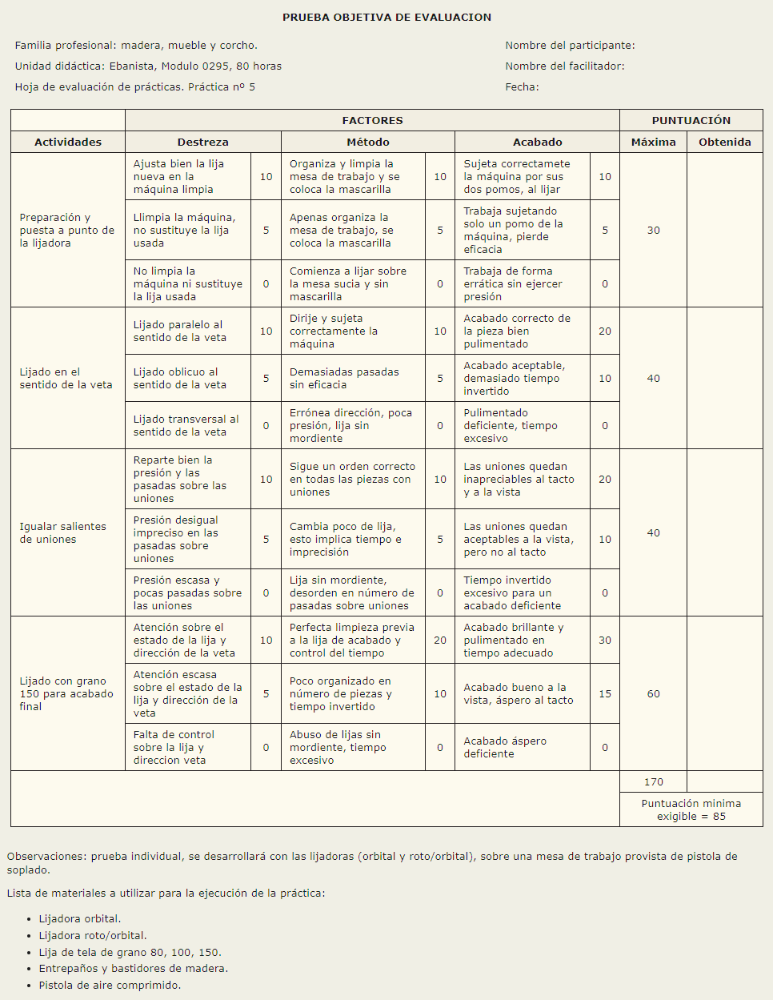
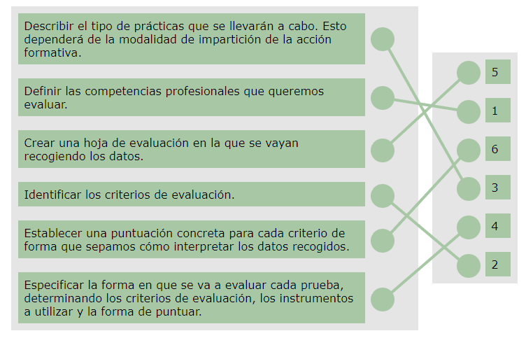
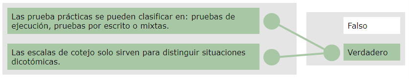
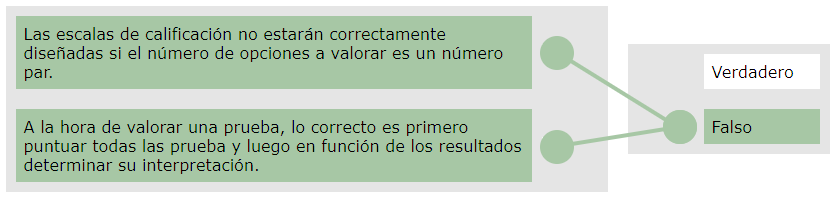

[TOC]

# MF1445 - Evaluación del proceso de enseñanza-aprendizaje en formación profesional para el empleo

# Unidad 03 - Diseño y elaboración de pruebas de evaluación de prácticas adaptadas a la modalidad de impartición

---

## Introducción

En esta unidad de aprendizaje nos centraremos en la **elaboración de pruebas prácticas válidas** tanto para formación **presencial** como **e-learning**, orientadas a evaluar las actividades que realiza el alumnado. Estas pruebas nos permiten analizar el **nivel de desarrollo de las habilidades**, especialmente las relacionadas con el saber hacer.

Los aspectos clave sobre los que debemos poner más atención son:

1. 🔍 **Evaluación del desempeño** y **evaluación del producto**, ya que según lo que queramos medir, cambia el enfoque y las herramientas de evaluación que debemos utilizar.
2. 🧩 **Diferenciar las herramientas** de evaluación para poder elaborarlas y corregirlas adecuadamente.
3. 📊 **La puntuación de la prueba**, quizá el punto más complejo, porque implica convertir en datos cuantificables lo que observamos. Esto requiere analizar con detalle la práctica para establecer indicadores claros y un peso adecuado para cada uno.

🎯**Objetivo**

- ✍️ **Elaborar pruebas prácticas** para ambas modalidades de impartición, acompañadas de orientaciones que faciliten su utilización en una acción formativa.

---

## 1. Criterios para la elaboración de pruebas prácticas presenciales y en línea

### 1.1. Introducción

Una buena actividad de evaluación ha de permitir a todas las personas evaluadas expresar sus conocimientos y sus capacidades. Por esta razón, es fundamental garantizar la **diversidad de actividades** a la hora de evaluar.

Las pruebas de evaluación destinadas a valorar las prácticas son instrumentos que miden las **destrezas necesarias para ejecutar una tarea concreta**.

Los criterios de elaboración de pruebas prácticas son más generales que los de las pruebas teóricas, pero siempre debemos tener presentes los siguientes aspectos:

- 🎯 **Seleccionar prácticas representativas**, es decir, que reflejen fielmente las competencias que se desean evaluar.
- 🧩 **Precisar al máximo los factores a evaluar** y su escala de puntuación, para reducir la subjetividad de la persona evaluadora.

🟦**Tipos de pruebas prácticas según la clasificación de Ryans y Frederiksen (1990):**

1. 📝 **Pruebas de identificación o reconocimiento**  
   El alumnado debe identificar un procedimiento, reconocer el uso adecuado de una herramienta, detectar errores, etc.  
   Para ello, se describe un procedimiento y se pregunta al alumnado si es correcto o si existe algún fallo.

2. 🧪 **Pruebas de ejecución en pequeña escala**  
   El alumnado debe realizar una tarea en condiciones simuladas.

   > [!tip] Ejemplo  
   > Tras realizar un curso de primeros auxilios, se solicita al alumnado que realice una Reanimación Cardio Pulmonar en un maniquí.

3. 🎭 **Pruebas de realización completa en condiciones reales**  
   El alumnado debe ejecutar una tarea muy representativa de los objetivos formativos, en un contexto real o muy próximo a la realidad.

   > [!tip] Ejemplo  
   > Tras un curso de primeros auxilios, se propone al alumnado un role-playing en el que deban realizar un rescate completo ante una persona que se está quemando tras un accidente de carretera.

🟦**Además, estas pruebas pueden clasificarse en:**

- 🔧 **Pruebas de ejecución**  
  En ellas, las personas evaluadas simulan situaciones de trabajo en las que deben manejar equipamientos, materiales, herramientas, etc.

- 📝 **Pruebas por escrito**  
  El alumnado responde por escrito a supuestos de trabajo planteados.

- 🔀 **Pruebas mixtas**  
  Combinan elementos prácticos y escritos.

---

### 1.2. Criterios para la elaboración de prácticas presenciales y en línea

La elaboración de las pruebas prácticas tiene como punto de partida el **referente ocupacional** del certificado de profesionalidad correspondiente.  
En aquellas acciones formativas que no pertenezcan a un certificado, tomaremos como referencia el **puesto de trabajo**.

En un certificado de profesionalidad se recoge:

- La **competencia general**.  
- Las **unidades de competencia**.  
- Para cada unidad, las **realizaciones profesionales** y los **criterios de ejecución**.

Las pruebas prácticas se organizan **por unidades de competencia**, ya que esto permite identificar qué unidades domina la persona y cuáles requieren refuerzo.

> [!important]
> En la elaboración de las pruebas prácticas se deben tener presentes los siguientes criterios: 
>
> - 📌 En el diseño, la prueba debe **copiar fielmente la realidad**, para que resulte lo más funcional posible.
> - 📋 Se deben indicar de forma **clara y sencilla** todos los aspectos que intervendrán en la prueba.
> - 🎯 Hay que especificar correctamente los **objetivos** que persigue la práctica.

La calidad de la prueba depende de una **buena formulación de los ítems**, que pueden ser preguntas, problemas a resolver, acciones a realizar, etc.

Aspectos importantes sobre los ítems:

- Cada ítem debe representar una **habilidad significativa** en el aprendizaje de la tarea.
- Los ítems deben permitir **diferenciar niveles de aprendizaje**.
- El formato del ítem debe ser **coherente con el tipo de evaluación**.
- La construcción del ítem será distinta según evaluemos:
  - **El desempeño**  
  - **Productos terminales (parciales o finales)**

**✔️ Evaluación del desempeño**

La evaluación del desempeño, en una situación real o simulada, es **procedimental** y se manifiesta a través del desarrollo de una secuencia de acciones propias de la formación.

Su estructura es:

**Acción + Objeto + Condición**

> [!tip] Ejemplo  
> Valora del 1 al 5 (donde 1 es la puntuación más baja y 5 la más alta).  
>
> **El alumno/a:**  
>
> |                                   |  1   |  2   |  3   |  4   |  5   |
> | --------------------------------- | :--: | :--: | :--: | :--: | :--: |
> | Presenta el objetivo de la sesión |      |      |      |      |      |
> | Hace una introducción al tema     |      |      |      |      |      |

**✔️ Evaluación de productos parciales o finales**

Aquí, el **producto** es el elemento central a examinar. La persona evaluadora debe comprobar si cumple o no con las características requeridas.

Su estructura es:

**Objeto + Acción + Condición**

> [!tip] Ejemplo  
>
> |                                                              |  1   |  2   |  3   |  4   |  5   |
> | ------------------------------------------------------------ | :--: | :--: | :--: | :--: | :--: |
> | La programación considera todo el material didáctico necesario para realizar sus actividades |      |      |      |      |      |

---

🟠**Pasos a realizar en el diseño de pruebas prácticas**

1. 🎯 **Definir las competencias profesionales** que queremos evaluar.
2. 📊 **Identificar los criterios de evaluación**.
3. 🧪 **Describir el tipo de prácticas** que se llevarán a cabo (dependerá de la modalidad de impartición).
4. 📝 **Especificar la forma de evaluación**: criterios, instrumentos a utilizar y sistema de puntuación.
5. 📄 **Crear una hoja de evaluación** donde se recojan todos los datos observados.
6. 🔢 **Establecer una puntuación concreta** para cada criterio, permitiendo interpretar adecuadamente los resultados.

🟠**Aspectos a tener en cuenta en la redacción de pruebas prácticas**

- El lenguaje debe ser **asequible y comprensible** para las personas evaluadas.
- La situación, actividades y productos solicitados deben presentarse de forma **clara y sencilla**, incluyendo instrucciones precisas.
- Si es necesario, se acompañará la descripción con **gráficos, planos, esquemas o imágenes**.
- Es fundamental incluir todas las **condiciones de realización**, equipamiento necesario, instrucciones de procedimiento y cualquier observación que contribuya a una evaluación homogénea.
- Al finalizar la redacción de la prueba es conveniente verificar si los indicadores cumplen los siguientes criterios:

  - Evaluar **aprendizajes de alta complejidad** que no pueden valorarse mediante otros tipos de ítems.
  - Seleccionar el **temario** de acuerdo con los objetivos.
  - Construir los ítems de modo que exijan **análisis e interpretación** del temario.
  - Garantizar que el temario e ítems sean **proporcionales en extensión**.
  - Asegurar que **cada ítem** esté directamente relacionado con la situación planteada.

Como se mencionó anteriormente, es conveniente diseñar una **hoja de evaluación** para aplicar y corregir cada práctica. Esto implica:

- 🔍 Analizar detenidamente la práctica.
- ✔️ Seleccionar los **aspectos relevantes** que la persona evaluadora debe observar.
- 📏 Elaborar las **escalas de medida** correspondientes.

> [!important]
> Es importante diseñar correctamente este instrumento de evaluación, ya que de él depende en gran medida la **objetividad** y la **fiabilidad** de la evaluación.

🟠**Información básica que debe incluir el instrumento de evaluación de una prueba práctica**

- 🆔 **Identificación de la práctica** a la que hace referencia.
- 🧩 **Actividades o productos** a evaluar.
- 🎚️ **Factores** mediante los cuales se medirán dichas actividades o productos.
- 🔢 **Escalas de puntuación** para cada factor.
- 🎯 **Puntuación máxima y mínima exigible**.

> [!tip] Recuerda
> En la elaboración de las pruebas prácticas se deben tener presentes los siguientes criterios:
>
> - En su diseño, la prueba debe **copiar fielmente la realidad**, para resultar funcional.
> - Se deben indicar de forma **clara y sencilla** todos los aspectos que intervendrán.
> - Hay que especificar correctamente los **objetivos** que persigue la práctica.

---

## 2. Criterios para la corrección

### 2.1. Introducción

Cada práctica se corregirá y puntuará **de manera independiente**, utilizando el **instrumento de evaluación** creado específicamente para ella.

Para realizar la corrección, registramos en dicho instrumento **el apartado que consideramos adecuado** para cada uno de los indicadores que vamos a evaluar.

El cálculo de la puntuación se obtiene a partir de:

- Los **indicadores de evaluación**.
- Su conversión de **cualificación** (lo que observamos) a **calificación** (la puntuación numérica).

Para cada indicador se establece un **peso relativo**, dependiendo de su importancia dentro de la actividad y teniendo en cuenta la **puntuación total**.

> [!tip] Ejemplo  
> **Asignación de porcentajes**  
>
> | Indicadores de evaluación                                  | Puntuación / Porcentaje |
> | ---------------------------------------------------------- | ----------------------- |
> | Introduce el tema de manera motivadora                     | 10%                     |
> | Presenta claramente el objetivo de la sesión               | 10%                     |
> | Realiza un diagnóstico del nivel de conocimientos          | 20%                     |
> | Expone de manera ordenada, clara y adecuada al grupo       | 30%                     |
> | Facilita la participación con preguntas, actividades, etc. | 30%                     |
> | **TOTAL**                                                  | **100%**                |
>
> En este ejemplo se asigna a cada indicador una importancia distinta, pero también podrían repartirse los porcentajes de manera equivalente (20% cada uno).

> [!tip] Ejemplo  
> **Asignación de peso equivalente**  
>
> | Indicadores de evaluación                                  | Peso     |
> | ---------------------------------------------------------- | -------- |
> | Introduce el tema de manera motivadora                     | 20%      |
> | Presenta claramente el objetivo de la sesión               | 20%      |
> | Realiza un diagnóstico del nivel de conocimientos          | 20%      |
> | Expone de manera ordenada, clara y adecuada al grupo       | 20%      |
> | Facilita la participación con preguntas, actividades, etc. | 20%      |
> | **TOTAL**                                                  | **100%** |

Si los indicadores cuentan con **niveles de desempeño**, deberá distribuirse el porcentaje asignado al indicador entre estos niveles.  
El **nivel superior** recibirá el **porcentaje máximo** asignado.

> [!tip] Ejemplo  
> **Distribución del 20% en niveles**
>
> | Indicadores de evaluación              | 1    | 2    | 3    | 4    | 5    |
> | -------------------------------------- | ---- | ---- | ---- | ---- | ---- |
> | Introduce el tema de manera motivadora | 0%   | 3%   | 10%  | 15%  | 20%  |

---

### 2.2. Las listas de cotejo

#### 2.2.1. Concepto

Son **listados enumerativos de conductas abiertas** en los que se debe anotar si el comportamiento o la característica observada **se da o no se da**.

Pueden utilizarse tanto en **modalidad presencial** como **online**.

> [!note]   
> Este instrumento resulta útil para evaluar aquellas destrezas que pueden dividirse en una serie de **actos específicos claramente definidos**.

---

#### 2.2.2. Criterios para la elaboración de listas de cotejo

Al elaborar una lista de cotejo, debemos tener en cuenta los siguientes criterios:

1. ⏹️ **Crear una casilla** para cada detalle de la ejecución o característica del producto que se va a evaluar.

2. 🔄 **Colocar las casillas en orden consecutivo**, siguiendo la secuencia lógica de la actuación que se va a observar.

3. ⚠️ **Añadir los actos que representen errores comunes**, siempre que sean pocos, se identifiquen claramente y se ordenen según la secuencia esperada.

> [!note]  
> Las listas de cotejo solo sirven para aquellas situaciones o productos que admitan distinciones dicotómicas del tipo **sí/no**.

> [!tip] Ejemplo  
> Lista de cotejo para evaluar la realización de una introducción oral en clase:  
>
> ☐ Saluda al grupo.  
>
> ☐ Presenta el objetivo de la sesión.  
>
> ☐ Conecta el contenido con experiencias previas del alumnado.  
>
> ☐ Explica la estructura de la sesión.  
>
> ☐ Comprueba que el grupo ha entendido la introducción.  

---

#### 2.2.3. Criterios de corrección

Para establecer una valoración o una puntuación podemos utilizar la siguiente fórmula:

$$
\frac{RespuestasConSi \cdot 100}{TotalAspectosEvaluados}
$$

---

### 2.3. Escalas de calificación: numérica, gráfica y descriptiva

#### 2.3.1. Tipos

Las escalas de calificación consisten en una serie de **enunciados o preguntas** sobre el aspecto que se va a evaluar, seguidos de una **escala de opciones graduadas en intensidad**.

Estas escalas pueden ser de **tres tipos**:

- **Escalas numéricas**  
  Se utilizan cuando la intensidad del comportamiento o destreza observada se expresa **en números**.

  > [!tip] Ejemplo  
  > | Indicador                                       | 1    | 2    | 3    | 4    | 5    |
  > | ----------------------------------------------- | ---- | ---- | ---- | ---- | ---- |
  > | Explica los contenidos de forma clara           | ☐    | ☐    | ☐    | ☐    | ☐    |
  > | Mantiene el interés del grupo durante la sesión | ☐    | ☐    | ☐    | ☐    | ☐    |

- **Escalas gráficas**  
  Se usan cuando la intensidad del rasgo observado se expresa mediante **categorías**.

  > [!tip] Ejemplo  
  > | Indicadores de evaluación         | Nada | Poco | Bastante | Mucho |
  > | --------------------------------- | ---- | ---- | -------- | ----- |
  > | Identifica de forma clara el tema | ☐    | ☐    | ☐        | ☐     |
  > | Respeta el turno de palabra       | ☐    | ☐    | ☐        | ☐     |

- **Escalas descriptivas**  
  Se utilizan cuando las categorías incluyen **descripciones breves y precisas** del rasgo o comportamiento a observar.

  > [!tip] Ejemplo  
  > Escala descriptiva para la evaluación de los deportes de cooperación-oposición, espacio común y participación simultánea
  >
  > Contenidos deportivos de cooperación/oposición
  >
  > | Conductas                    | Nivel 1                                                      | Nivel 2                                                      | Nivel 3                                  |
  > | ---------------------------- | ------------------------------------------------------------ | ------------------------------------------------------------ | ---------------------------------------- |
  > | Fundamentos técnicos básicos | Conduce el balón sin mirar, alternando una mano y otra, coordinando cambios de dirección izquierda-derecha. | Dirige las manos al balón para recibirlo y, cuando llega lateralmente, gira el tronco hacia ese lado manteniendo el desplazamiento. | Coordina diversos tipos de lanzamientos. |

Las escalas de calificación permiten la **cualificación** y la **cuantificación**, pero para ello, en su elaboración y uso hay que seguir las siguientes normas:

- Los rasgos y características deben ser **directamente observables**.
- Las preguntas han de ser **unívocas**, es decir, no deben tener varias interpretaciones.
- El número de categorías debe oscilar entre **3 y 7**.
- Es recomendable establecer **niveles impares**, ya que permiten ajustar mejor a la normalidad.  
  
  > [!tip] 
  > Los niveles **pares** se reservan cuando interesa diferenciar claramente entre buenos y malos resultados.

> [!important]  
> En modalidad presencial, la persona que evalúa puede observar la práctica directamente y esto facilita la evaluación.  
>
> En modalidad **e-learning**, se deben delimitar muy bien los ítems que van a ser evaluados y dar **instrucciones de realización muy específicas**, ya que la persona evaluadora no tiene delante al alumnado durante la práctica.  
>
> A menos que la práctica se desarrolle en **comunicación síncrona**, el evaluador/a no podrá ver la forma de actuar in situ.

---

#### 2.3.2. Normas de correccion

Para corregir estas escalas, debemos realizar los siguientes pasos:

1. **Multiplicar el valor máximo de la escala por el numero de aspectos a evaluar, para obtener la puntuación máxima (`M`):**

$$
M = ValorMaximo \times NumeroAspectosEvaluar
$$

2. **Sumar el total de valores obtenidos en cada aspecto o criterio, para obtener la suma total (`T`):**

$$
T=\sum {TotalValoresObtenidos}
$$

3. **Calcular la calificacion final dividiendo el total obtenido entre la nota maxima y multiplicandolo por 100:**

$$
CalificacionFinal=\frac{T \times 100}{M}
$$

donde:  
- `M` es la nota máxima posible (paso 1).
- `T` es el total de valores obtenidos (paso 2).  

> [!tip] Ejemplo  
> Supongamos que queremos corregir una escala numerica donde:  
> - El valor maximo de la escala es **5**  
> - Tenemos **4** aspectos a evaluar  
> - El docente ha obtenido las siguientes puntuaciones: 4, 3, 5 y 4  
>
> **1) Calculo del valor maximo posible:**  
> $$
> M = 5 \times 4 = 20
> $$
>
> **2) Suma de los valores obtenidos:**  
> $$
> T = 4 + 3 + 5 + 4 = 16
> $$
>
> **3) Calculo de la calificación final:**  
> $$
> \frac{16 \times 100}{20} = 80
> $$
>
> **Calificación final: 80%**

---

### 2.4. Hoja de evaluación de prácticas

Las hojas de evaluación de prácticas pueden considerarse como una **integración de los instrumentos anteriores**.

Consisten en un **cuadro de doble entrada** donde se relacionan las actividades que realizará el alumnado con un conjunto de factores que describen los criterios de calificación.

Para elaborar una hoja de evaluación debemos realizar los siguientes pasos:

1. 🎯 **Describir los objetivos o conductas** que se pretenden evaluar.

2. 🗂️ **Establecer el número y tipo de prácticas**, ponderándolas según su importancia.

3. 🧩 **Elaborar una lista de operaciones significativas y observables** en que puede descomponerse la tarea. Estas constituirán el apartado de actividades.

4. 📊 **Ponderar cada actividad** según su importancia y establecer la **puntuación máxima** obtenible en cada una.

5. 🔍 **Establecer los factores** relacionados con la ejecución de cada actividad (exactitud, precisión, autonomía, etc.).

6. ⚖️ **Determinar la puntuación máxima por factor**, distribuyendo la puntuación total de la actividad entre los distintos factores según su importancia.  
   La suma de las puntuaciones máximas de los factores dará la **puntuación máxima de la actividad**.

7. 📝 **Describir el significado de cada factor** dentro del contexto de la prueba y establecer la escala correspondiente.

8. 🧾 **Confeccionar la escala de doble entrada** o instrumento gráfico.

9. 📘 **Precisar las instrucciones de aplicación** de la prueba.

10. 📏 **Dar instrucciones claras** sobre el procedimiento de calificación, tanto de cada apartado como del total.

11. 🧰 **Adjuntar el material necesario** para la realización de la prueba.

> [!tip] Ejemplo  
> **Hoja de evaluación de una práctica: “Explicar un concepto en 5 minutos”** , teniendo en cuenta todos los pasos anteriores:
>
> **1) Objetivo:**  
> Evaluar la capacidad del alumno para presentar de forma clara y organizada un concepto breve.  
>
> **2) Tipo de práctica:**  
> Exposición oral individual (ponderación: 100%).  
>
> **3) Actividades significativas:**  
> - ☐ Presentar el objetivo de la explicación.  
> - ☐ Desarrollar el contenido de forma clara.  
> - ☐ Cerrar la intervención con un resumen.  
>
> **4) Puntuación máxima por actividad:**  
> - Presentación inicial: 2 puntos  
> - Desarrollo del contenido: 5 puntos  
> - Cierre y resumen: 3 puntos  
>
> **5) Factores asociados a cada actividad:**  
> - Exactitud  
> - Claridad  
> - Estructura  
>
> **6) Distribución de puntuación por factores (ejemplo actividad “Desarrollo”):**  
> - Exactitud: 2 puntos  
> - Claridad: 2 puntos  
> - Estructura: 1 punto  
> *(Total actividad: 5 puntos)*  
>
> **7) Significado de factores:**  
> - Exactitud: Ajuste correcto al contenido solicitado  
> - Clariad: Lenguaje comprensible y adecuado  
> - Estructura: Orden lógico de la explicación  
>
> **8) Escala de doble entrada (resumen):**  
>
> | Actividades                 | Exactitud (0–2) | Claridad (0–2) | Estructura (0–1) | Total    |
> | --------------------------- | --------------- | -------------- | ---------------- | -------- |
> | Presentación inicial (2 pt) | 0–1             | 0–1            | —                | 0–2      |
> | Desarrollo (5 pt)           | 0–2             | 0–2            | 0–1              | 0–5      |
> | Cierre y resumen (3 pt)     | 0–1             | 0–1            | 0–1              | 0–3      |
> | **TOTAL**                   |                 |                |                  | **0–10** |
>
> **9) Instrucciones de aplicación:**  
> El alumno dispone de 5 minutos de preparación y 5 minutos de exposición.  
>
> **10) Instrucciones de calificación:**  
> Se calificará cada celda según la escala indicada.  
> La suma dará la puntuación final (máximo 10 puntos).  
>
> **11) Material necesario:**  
> Cronómetro, pizarra o diapositivas opcionales.

> [!tip] Ejemplo 2
>
> {.img-preview}

---

### 2.5. Las escalas de Likert

Rensis Likert, en 1932, definió este tipo de escalas, también denominado **método de evaluaciones sumarias**.

La persona evaluada debe **posicionarse de acuerdo o en desacuerdo** con una declaración que forma cada ítem.

El número de ítems suele estar entre **15 y 30**.

> [!important]  
> Se trata de una **escala psicométrica** utilizada en cuestionarios y es una de las más frecuentes en **encuestas de investigación**.

Para elaborar una escala de Likert debemos realizar los siguientes pasos:

1. 📝**Crear ítems relacionados con la actitud que se desea medir.**  
   Se redactan enunciados afirmativos y negativos sobre la actitud que se quiere evaluar.  
   Cada ítem contará con **cinco alternativas**:
   - Totalmente de acuerdo.  
   - De acuerdo.  
   - Indiferente.  
   - En desacuerdo.  
   - Totalmente en desacuerdo.
   
2. 📊**Aplicar la escala**, pidiendo a la persona evaluada que se posicione ante cada ítem.

3. 💯**Asignar una puntuación a cada ítem**, según la dirección positiva o negativa del enunciado:

   - *Si el ítem tiene dirección positiva*  
     (ej.: “Te resultaron interesantes los materiales complementarios del curso”):  
       - Totalmente de acuerdo (+2)  
       - De acuerdo (+1)  
       - Indiferente (0)  
       - En desacuerdo (-1)  
       - Totalmente en desacuerdo (-2)

   - *Si el ítem tiene dirección negativa*  
     (ej.: “El tutor/a no ha fomentado el debate en los foros del curso”):  
       - Totalmente de acuerdo (-2)  
       - De acuerdo (-1)  
       - Indiferente (0)  
       - En desacuerdo (+1)  
       - Totalmente en desacuerdo (+2)

4. **Asignar la puntuación total** a cada persona evaluada.

5. **Seleccionar los ítems mediante pruebas estadísticas** para asegurar la fiabilidad del cuestionario.

> [!tip] Ejemplo  
> **Cuestionario breve tipo Likert (3 ítems)**
>
> | Ítem                                                   | Totalmente de acuerdo | De acuerdo | Indiferente | En desacuerdo | Totalmente en desacuerdo |
> | ------------------------------------------------------ | :-------------------: | :--------: | :---------: | :-----------: | :----------------------: |
> | 1. El contenido del curso ha sido claro.               |           ☐           |     ☐      |      ☐      |       ☐       |            ☐             |
> | 2. El ritmo de las explicaciones ha sido adecuado.     |           ☐           |     ☐      |      ☐      |       ☐       |            ☐             |
> | 3. He podido participar activamente durante la sesión. |           ☐           |     ☐      |      ☐      |       ☐       |            ☐             |

---

### 2.6. Las hojas de registro

Las hojas de registro se utilizan para **observar la conducta del alumnado** en situaciones reales o simuladas.

Los resultados de la observación ofrecen una información valiosa por su carácter real, aunque también presentan dificultades en su realización.

> [!warning]  
> Es una técnica especialmente valiosa en modalidad **presencial**, pero pierde eficacia en **formación e-learning**.  
> No obstante, dependiendo de los comportamientos a observar y de las herramientas disponibles en la plataforma, puede utilizarse de forma puntual.

🟪**Características de la observación**

La observación directa, continuada y sistemática de la actividad educativa es un procedimiento básico para obtener la información necesaria para evaluar. Aunque una observación aislada puede aportar datos, **carece de rigor**.

La observación es especialmente adecuada para obtener información sobre:

- comportamientos habituales o no  
- relaciones  
- actividades  
- decisiones  
- participaciones
- discusiones
- etc.

Observar supone determinar **qué**, **cuándo**, **cómo**, **a quién**, **con qué** y **dónde** se va a observar, así como elegir el modo de registro de la información en función de los objetivos.

La observación es útil para obtener información a la que no se puede acceder por otros medios, para analizar comportamientos en su ambiente natural y para complementar otros instrumentos.

🟪**Aspectos importantes en las sesiones de observación**

1. 🫂 Que la persona observada **no se sienta juzgada**.  
2. 💬 Que el observador/a **comunique su juicio** inmediatamente después de la observación.  
3. 📝 Los comentarios deben ser prácticos, constructivos y centrados en los puntos fuertes, con **solo una o dos críticas negativas**.  
4. 🎯 La conducta observada debe ser **objetiva y clara** para diferenciarla de otras conductas.  
5. 🔁 Los periodos de observación deben ser **frecuentes**.  
6. 📋 Las hojas de registro deben contener una **descripción concreta** de la conducta.  
7. 🧪 Las condiciones de evaluación deben ser **reales**.

🟪**Ejemplo**

> [!tip] Ejemplo  
> **Checklist de observación (hoja de registro)**  
>
> **Cumplimiento de las normas**  
> ☐ Es puntual al inicio de clase.  
> ☐ Es puntual después de los descansos.  
> ☐ Es puntual al finalizar la clase.  
> ☐ Cuida los materiales y recursos del aula.  
>
> **Funcionamiento del grupo**  
> ☐ Es puntual para iniciar el trabajo.  
> ☐ Busca excusas para abandonar el trabajo.  
> ☐ Entabla conversaciones innecesarias.  
> ☐ Aporta ideas siempre.  
> ☐ No suele participar.  
> ☐ Respeta las ideas de los demás.  
> ☐ Solo interviene cuando le conviene.  
> ☐ Su intervención es obstructora.  
> ☐ Se preocupa poco de la tarea.  
>
> **Interés por el aprendizaje**  
> ☐ Plantea preguntas de interés.  
> ☐ Solicita orientación.  
> ☐ Se ajusta al mínimo.  
> ☐ Obstaculiza el trabajo.  
> ☐ Es pasivo.

---

### 2.7. Rúbrica

Una **rúbrica** o **matriz de evaluación** es un documento que describe distintos **niveles de calidad** de una tarea o producto.

Normalmente se utiliza para **trabajos de cierta complejidad**, como proyectos, exposiciones orales, presentaciones o tareas que requieren varios criterios de evaluación.

Es una herramienta **objetiva** que permite al alumnado conocer:

- qué se espera de él  
- cómo será evaluado  
- y en qué grado puede demostrar su desempeño

> [!note]  
> Su objetivo es dar al alumnado un **feed-back útil** durante el proceso y proporcionar una **evaluación detallada** de sus trabajos finales.

> [!tip] Ejemplo  
> **Rúbrica para evaluar un trabajo escrito**
>
> | Criterio          | 5                                          | 4                                                | 3                                                         | 2                                                         | 1                                                |
> | ----------------- | ------------------------------------------ | ------------------------------------------------ | --------------------------------------------------------- | --------------------------------------------------------- | ------------------------------------------------ |
> | **Planificación** | Ha tenido en cuenta **todos** los aspectos | Ha tenido en cuenta **entre 5 y 7** aspectos     | Ha tenido en cuenta **entre 3 y 5** aspectos              | Ha tenido en cuenta **menos de 3** aspectos               | No ha tenido en cuenta **ningún** aspecto        |
> | **Redacción**     | Redacción ordenada y **sin faltas**        | Ordenado **más del 80%** y **menos de 3 faltas** | Ordenado entre el **60% y 80%**, y entre **3 y 5 faltas** | Ordenado entre el **40% y 60%**, y entre **5 y 8 faltas** | Menos del **40% ordenado** y **más de 8 faltas** |

---

## 3. Instrucciones para la aplicación de las pruebas: alumnado y docentes

### 3.1. Introducción

Para cada práctica es importante **indicar los requisitos necesarios** para su aplicación.

Estos requisitos deben ser tenidos en cuenta tanto por los **centros donde se realicen las evaluaciones**, como por las **personas que vayan a evaluar**.

Los requisitos están relacionados con los siguientes elementos:

- 🏫 **Instalaciones**.  
- 🧰 **Equipamiento y material**.  
- 📌 **Otras especificaciones** que se consideren necesarias para garantizar una correcta aplicación de la práctica.

> [!important]  
> El planteamiento de las instrucciones de aplicación debe abordarse desde **dos puntos de vista** distintos:  
> - La **persona evaluadora**
> - La **persona evaluada**
>
> La información destinada a la persona evaluadora será, por lo general, **más exhaustiva**.

---

### 3.2. Instrucciones dirigidas a la persona evaluada

Las instrucciones dirigidas al alumnado ofrecen una **visión general de la actividad** que se va a realizar. Además, indican **cómo debe procederse** para el desarrollo de la prueba en su conjunto y, cuando sea necesario, para alguna de sus partes.

Cada práctica debe incluir la **información necesaria** para facilitar su realización.

De forma concreta, para cada práctica se incorporarán los siguientes datos:

- 🆔 **Identificación de la práctica**.  
- 📝 **Descripción de la actividad**.  
- 🧰 **Equipo y material disponible**.  
- 📌 **Instrucciones específicas** (observaciones sobre tiempos, procedimiento, condiciones especiales, etc.).

> [!note]  
> Estas instrucciones permiten al alumnado **situarse** respecto a lo que se espera que realice y **cómo debe llevarlo a cabo**.

---

### 3.3. Instrucciones para la persona evaluadora

Para cada práctica se diseñará un **instrumento de evaluación**, que será el que utilizará la persona evaluadora para puntuar a cada una de las personas evaluadas.

En este instrumento se recogerán los **criterios a seguir**, que permitirán comprobar el **grado de dominio** de las competencias exigidas en la práctica.

Las competencias pueden estar relacionadas con:

- 🔧 **Proceso de ejecución**: procedimiento seguido, método de trabajo, uso del equipo, utilización de materiales, etc.
- 🎯 **Producto resultante**: propiedades, características y aspectos relevantes del producto final que permiten determinar su calidad.

A este instrumento evaluativo se le anexarán **instrucciones explicativas**, que contienen información sobre los distintos elementos incluidos en la hoja:

- 📝 **Actividades que hay que realizar** o productos que el alumnado debe elaborar.
- 🧩 **Factores o aspectos a evaluar** en esas actividades o productos.
- 📊 **Escalas de evaluación** que se van a utilizar y el valor asignado a cada una.

También pueden incluirse:

- ❌ **Situaciones que pueden anular la evaluación** de la práctica.
- ⚠️ **Tipos de errores excluyentes**.
- 📌 **Observaciones necesarias** para puntuar de manera objetiva.
- 🗂️ **Ejemplos** sobre cómo utilizar correctamente el instrumento.

---

# Ejercicios

## Ejercicio 15: Ordena las fases para plantear una prueba de evaluación

---

## Ejercicio 16: V ó F

---

## Ejercicio 17: V ó F

---

## Ejercicio 18: Completa el texto

La `rúbrica` es un `registro` de evaluación que normalmente se usa para `trabajos` de cierta `complejidad` como un proyecto o una exposición.

