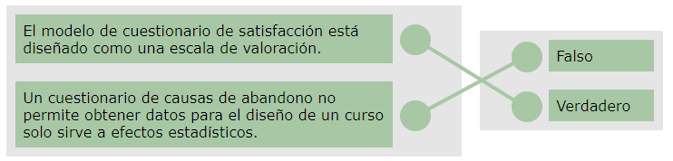
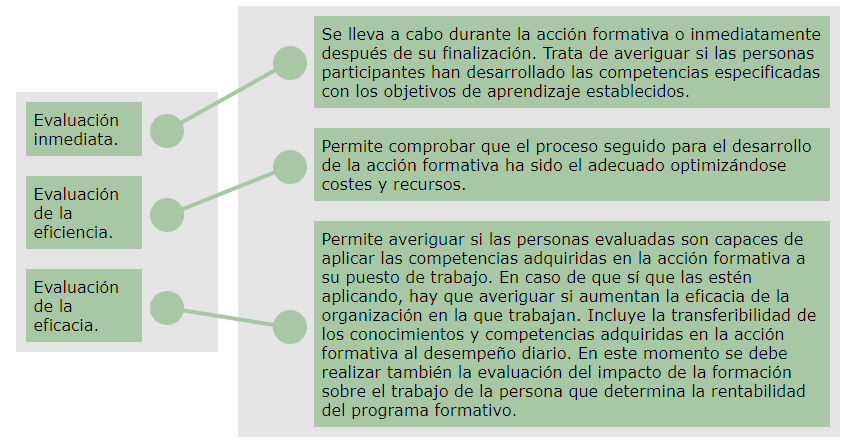

[TOC]

# MF1445 - Evaluación del proceso de enseñanza-aprendizaje en formación profesional para el empleo

# Unidad 04 - Evaluación y seguimiento del proceso formativo conforme a la formación presencial y en línea

---

## Introducción y objetivos

En esta unidad de aprendizaje nos centraremos en el **proceso de evaluación y seguimiento del proceso formativo**, teniendo en cuenta las diferencias entre realizarlo en **modalidad presencial** y en **modalidad en línea**.

Muchas veces reducimos el análisis al *antes, durante y fin* de la acción formativa, olvidando que el proceso no finaliza ahí. Existe un **después**, en el que el alumno debe demostrar la **transferibilidad de las competencias** adquiridas en su puesto de trabajo.  
Esta evaluación posterior nos permite valorar la **eficacia**, **efectividad** y **eficiencia** de la formación.

🎯**Objetivos de la unidad:**

- 📊 **Analizar** la información obtenida durante todo el proceso formativo para introducir mejoras que incrementen la calidad de la acción formativa.  
- 💻 **Evaluar** las tareas y actividades realizadas por los alumnos en la modalidad de formación en línea.

---

## 1. Algunos apuntes sobre la evaluación en la formación en línea

1.  
   Evaluar el aprendizaje del alumnado no es una tarea fácil, y mucho menos en **formación e-learning**, donde no existe un contacto directo y cotidiano con los participantes. Esto implica una mayor dificultad en el proceso evaluativo.

   Al igual que en la formación presencial, es fundamental que la evaluación **no sea improvisada** y que responda a una reflexión real sobre **qué es importante evaluar y cómo hacerlo**.

   > [!note]
   > Los instrumentos de evaluación pueden ser los mismos que en formación presencial, pero debemos tener en cuenta la distancia con el alumnado, lo que impide realizar una observación directa de su actuación.  
   > Además, la Web 2.0 ofrece multitud de herramientas que enriquecen la evaluación y permiten crear nuevos instrumentos sin necesidad de conocimientos de programación.

2.  
   Para evaluar el nivel de adquisición de **conocimientos**, podemos utilizar diferentes tipos de pruebas.  
   Las pruebas objetivas permiten medir aprendizajes más sencillos, mientras que las pruebas de ensayo o ejercicios interpretativos resultan adecuadas para aprendizajes más complejos.

   En la formación en línea, el propio alumnado puede comprobar su progreso mediante **cuestionarios de autoevaluación**, que se corrigen automáticamente y ofrecen un **feedback inmediato**.

   > [!note]
   > Los casos prácticos y trabajos individuales o grupales permiten conocer las habilidades desarrolladas por el alumnado e introducir pautas para corregir errores o lagunas.  
   > Es importante diseñar herramientas que evalúen estas habilidades de forma objetiva, como **listas de cotejo**, **escalas de calificación**, etc.

3.  
   En la formación en línea debemos considerar que el alumnado **no está presente físicamente**, por lo que evaluar habilidades relacionadas con la ejecución de tareas mediante observación es más complicado.  
   Aun así, es posible gracias a herramientas como:

   - 🎥 **Teletutorías**, donde evaluador y evaluado pueden compartir cámara.  
   - 🕹️ ***Serious Games*** (o juegos serios), que permiten practicar o adquirir habilidades a través del juego.

   Las plataformas de teleformación ofrecen además información automatizada sobre la **participación del alumnado**, como número y frecuencia de intervenciones.

   > [!note]
   > A estos datos cuantitativos podemos añadir la evaluación cualitativa de la participación. Para ello se debe valorar cada mensaje y calificarlo según criterios previamente establecidos.

4.  
   Algunos criterios que se pueden tener en cuenta para plantear la evaluación:

   - 📌 ¿Qué actividades son obligatorias?  
   - 📌 ¿Qué actividades son opcionales?  
   - 📌 ¿Cuál es la nota mínima para superar pruebas y ejercicios?  
   - 📌 ¿Qué nivel de calidad se exigirá en las actividades?  
   - 📌 ¿Qué cantidad y calidad se requerirá en la participación?

Es conveniente establecer de antemano los **porcentajes de evaluación**.  

> [!TIP] Ejemplo
>
> - 40% → puntuación obtenida en pruebas evaluativas.  
> - 20% → trabajos individuales o grupales.  
> - 15% → cumplimiento de plazos y adecuación a los criterios establecidos.  
> - 20% → participación en espacios de comunicación.  
> - 5% → actividades opcionales.
>

> [!important]
> Estos porcentajes y criterios deben ser conocidos por el alumnado desde el inicio.  
> Además, pueden modificarse en función de las características y ritmo del grupo.

---

## 2. Establecimiento de criterios e indicadores de evaluación

### 2.1. ¿Qué son los criterios de evaluación?

> [!note] Definición
> 📢 “... aquellos elementos de juicio o normas de discernimiento en función de los cuales, se establece el modelo para evaluar un programa de intervención socioeducativa en su totalidad, o alguno de los elementos que la configuran: ámbitos o agentes”.  
>
> Castillo Arredondo y Cabrerizo (2003).

> [!note] 
> En palabras más simples: un **criterio de evaluación** es una guía que nos dice *qué queremos comprobar* y *qué aspectos son importantes* para decidir si algo se ha hecho bien o no dentro de una acción formativa.
>
> Es como una “regla del juego” que marca qué se va a evaluar y bajo qué enfoque.

Cada uno de los criterios tiene asociados una serie de **indicadores**, que aportan los datos necesarios para conocer **cómo** y **de qué manera** se está poniendo en práctica el criterio al que hacen referencia.

---

### 2.2. ¿Qué son los indicadores de evaluación?

> [!note] Definición  
> 📢 “... aquellas pautas o elementos, en función de los cuales se define el contenido y la finalidad de un criterio, lo fijan y lo delimitan”.  
>
> Castillo Arredondo y Cabrerizo (2003).

> [!note] Definición  
> 📢 “... una unidad de información que nos señala si un cierto criterio de evaluación se ha dado o no”.  
>
> Cembranos, Montesinos y Bustelo (1998).

Las características más importantes de los **indicadores de evaluación** son las siguientes:

1. 📊 **Permiten observar datos** y su frecuencia de aparición.  
2. 🎯 **Responden a "qué evaluar"** dentro del proceso formativo.  
3. 📝 **Orientan la elaboración de tareas** y actividades evaluativas.  
4. 📚 Proporcionan información sobre los **contenidos** y el **grado mínimo** que debe alcanzarse.  
5. 🔍 Son los elementos que utilizaremos para **observar y medir** las actuaciones del alumnado relacionadas con las competencias profesionales.

> [!tip] Ejemplo  
> A continuación puedes ver un ejemplo visual que ayuda a comprender mejor qué es un indicador de evaluación:
>
> 

> <iframe width="560" height="315"
>  src="https://www.youtube.com/embed/oK9i2qBPl1o"
>  title="Indicadores de evaluación – Video explicativo"
>  frameborder="0"
>  allow="accelerometer; autoplay; encrypted-media; gyroscope; picture-in-picture; web-share"
>  referrerpolicy="strict-origin-when-cross-origin"
>  allowfullscreen>
> </iframe>
> 

---

### 2.3. Elaboración de criterios e indicadores de evaluación

🟨**Elaboración de los criterios de evaluación**  
A la hora de elaborar los criterios de evaluación, debemos tener en cuenta los aspectos siguientes:

1. 📚 Hay que ordenarlos de acuerdo a los **objetivos y contenidos**.  

2. ✏️ Se formulan utilizando **verbos en infinitivo o gerundio**, pero manteniendo siempre la misma estructura.  

   > [!tip] Ejemplo  
   > Si elegimos verbos en **infinitivo**, todos los criterios deben seguir esa estructura:
   > - Identificar los conceptos básicos del tema.  
   > - Aplicar correctamente los procedimientos enseñados.  
   > - Analizar los resultados obtenidos.
   >
   > Si elegimos verbos en **gerundio**, todos deben mantenerse igual:
   > - Identificando los conceptos básicos del tema.  
   > - Aplicando correctamente los procedimientos enseñados.  
   > - Analizando los resultados obtenidos.
   >
   > Lo importante es **no mezclar estructuras** y mantener siempre la misma forma verbal en todos los criterios.

3. 🎯 Es necesario especificar los aspectos a evaluar mediante **indicadores concretos**, acordados y conocidos por las personas evaluadas.

🟨**Elaboración de los indicadores de evaluación**  
Para elaborar los indicadores de evaluación, debemos considerar:

1. 🧩 Se construyen a partir de los **criterios de evaluación** y en relación con las capacidades.  
2. 👀 Deben estar formulados de manera **operativa**, de modo que sean observables y, por tanto, medibles.  
3. 🗣️ Su redacción debe ser **clara y unívoca**, evitando interpretaciones.  
4. 🚀 Deben facilitar el logro de los **objetivos planteados**.

🟨**Elección de instrumentos de evaluación**

Una vez formulados los criterios e indicadores, debemos elegir los **instrumentos de evaluación** que permitan recoger la información necesaria para valorar esos indicadores de la manera más objetiva posible.

Estos instrumentos pueden ser **cuantitativos** o **cualitativos**. Algunos ejemplos son:

- 👀 Observación directa del trabajo en el aula.  
- 📝 Cuestionarios.  
- 📄 Informes.  
- 📘 Diarios de clase.  
- 📋 Hojas de seguimiento.

> [!important]
> La **diferencia entre criterios e indicadores** de evaluación se encuentra en:
>
> - Un **criterio** es *lo general*: qué queremos evaluar.  
>   Es como el “título” o la idea grande.
>
> - Un **indicador** es *lo concreto*: qué detalles vamos a observar para saber si ese criterio se cumple.  
>   Es como una lista de cosas específicas que tienen que verse en la práctica.
>
> **Ejemplo sencillo:**  
> - Criterio: “Explicar un contenido de forma clara”.  
> - Indicadores: “Habla con un tono adecuado”, “Organiza las ideas”, “Utiliza ejemplos”, “Responde a preguntas”.
>
> Así, el criterio dice *qué*, y los indicadores dicen *cómo comprobarlo*.

---

## 3. Aplicación de técnicas cualitativas y cuantitativas de recogida de información

### 3.1. Conceptos

> [!note] Definición  
> 📢 **Técnicas de recogida de información:** conjunto de procedimientos y herramientas que utilizamos para recoger, validar y analizar la información necesaria para alcanzar los objetivos de evaluación.

La evaluación se estructura sobre dos paradigmas:

- 📊 **Evaluación cuantitativa**, que aporta objetividad al proceso.  
- 🧩 **Evaluación cualitativa**, que introduce el componente de subjetividad.

Ambos paradigmas son **necesarios y complementarios**, ya que toda evaluación requiere tanto una recogida objetiva de datos como una interpretación cualitativa de los mismos.

Para que exista un equilibrio entre lo cuantitativo y lo cualitativo, la evaluación debe contemplar las siguientes funciones (Pérez y García, 1989):

1. 🩺 **Diagnóstica**  
   Permite conocer las posibilidades de cada persona, los niveles de logro alcanzados y el estado de aprendizaje del programa, así como detectar posibles problemas durante su puesta en marcha y funcionamiento.

2. 🔮 **Pronóstica o predictiva**  
   La evaluación del comportamiento y los resultados ofrece una idea aproximada de lo que se puede esperar de cada persona, anticipando necesidades futuras en su proceso de aprendizaje.

3. 🧭 **Orientadora**  
   Permite conocer el estado del aprendizaje de cada alumno y posibilita que docentes y alumnado tomen las decisiones más adecuadas.

4. 📏 **De control**  
   Facilita comprobar la consecución de los objetivos planteados en la programación y determinar la calificación correspondiente al alumnado.

---

### 3.2. Técnicas de evaluación cuantitativas

Si tenemos en cuenta un **enfoque cuantitativo**, en el proceso de evaluación lo que interesa es la cantidad: la **medida** del grado de adquisición de los aprendizajes.

> [!TIP] Ejemplos
>
> - 📊 Resultados en las pruebas evaluativas.  
> - 🧮 Número de ejercicios realizados.  
> - 🗣️ Número de participaciones.
>

Según Castillo Arredondo y Cabrerizo (2003), corresponden al paradigma cuantitativo las siguientes fases:

1. 🔢 **Codificación** o reorganización de la información existente.  
2. 🧰 **Selección** de la técnica y los instrumentos de evaluación.  
3. 📥 **Recogida y tratamiento** de datos.  
4. 📈 **Análisis** de resultados.  
5. 📝 **Elaboración** del informe cuantitativo.

> [!important]  
> La evaluación cuantitativa se basa en la **recogida y medición de datos objetivos**, observables y cuantificables en términos absolutos y estadísticos, por lo que **no refleja** las relaciones sociales que subyacen a la medición realizada.

Algunos de los instrumentos que podemos utilizar para este tipo de técnicas son:

- ✍️ Ejercicios de respuesta corta.  
- ✔️ Preguntas de verdadero/falso.  
- 🧩 Ejercicios de completar huecos.

---

### 3.3. Técnicas de evaluación cualitativas

La **evaluación cualitativa** se basa en la **interpretación de indicios**, el análisis crítico y la comparación dentro del proceso y con otros procesos similares. Aporta datos **descriptivos** e **interpretativos** sobre el aprendizaje del alumnado.

Desde este enfoque se tiene en cuenta **la calidad** con la que se adquieren los aprendizajes, en relación con la situación personal de cada alumno o alumna.

> [!TIP] Ejemplo
>
> - 📝 La calidad de las respuestas.  
> - 💬 El tipo de participaciones (si expresa dudas, si favorece la participación del grupo, etc.).
>

Según Castillo Arredondo y Cabrerizo (2003), las fases del paradigma cualitativo son:

1. 👀 **Observación generalizada**: participante, no participante, etc.  
2. 📚 **Recopilación de datos**.  
3. 🔄 **Intercambio de impresiones**.  
4. 📝 **Elaboración del informe cualitativo**.

Algunos de los instrumentos que podemos utilizar para aplicar este tipo de técnicas son:

---

🟤 **La entrevista en grupo**

La entrevista en grupo es útil para el personal docente porque permite:

- 🔎 Explorar más a fondo aspectos de la formación.  
- ✔️ Verificar interpretaciones sobre las reacciones del alumnado.  
- ❓ Plantear cuestiones no incluidas en otros instrumentos.  
- ⚠️ Tratar aspectos más conflictivos o problemáticos.

Una entrevista eficaz incluye cuestiones sobre objetivos, contenidos, estructura, métodos, interacciones, materiales, tiempos, etc.

---

🟤 **Los diarios**

Su objetivo no es solo describir, sino **favorecer la reflexión**, el análisis y la valoración de la práctica docente.  
Suelen incluir pensamientos, emociones y valoraciones sobre actividades e interacciones.

> [!tip] Ejemplo
>
> **AUTOR:**  
> **FECHA:**  
> **ACTIVIDAD:**  
> **DURACIÓN:**
>
> En sesiones anteriores habíamos elaborado las escalas de calificación a utilizar en las simulaciones. Se pretendía con esta actividad que cada grupo explicara su escala: la forma de registrar la información, cómo puntuarla y aclarar dudas sobre los enunciados.  
> Empiezan a surgir dudas: “hay muchos aspectos que no se van a poder realizar en siete minutos”, “si las puntuamos, la puntuación saldrá baja...”.
>
> Por otro lado, yo iba a explicar el procedimiento para realizar las evaluaciones. Surgen preguntas sobre copias, uso de escalas, etc.  
> Después del descanso pienso en distintas opciones (rotuladores, escalas, dejarlo para más adelante). Lo planteo en clase y lo sometemos a votación.
>
> Deciden hacer plantillas para poder evaluar sin grandes complicaciones, espero.

---

🟤 **Los cuestionarios**  
(Se explicarán en el siguiente apartado).

---

🟤 **Las listas de cotejo**  
(Vistas anteriormente).

---

🟤 **Los anecdotarios**

Sirven para recoger **hechos relevantes** que ocurren durante la acción formativa, especialmente relacionados con aptitudes, actitudes, intereses o reacciones temperamentales.

No deben incluir **opiniones ni juicios de valor**: solo **descripción objetiva** del hecho.

Cada anécdota debe registrarse en una ficha y archivarse por persona, conducta, fecha, etc.

> [!tip] Ejemplo
>
> **HORA:**  
> **OBSERVADOR:**  
> **LUGAR:**  
>
> **Contexto:**  
> En el aula, durante el trabajo en grupo para elaborar un anecdotario.
>
> **Anécdota / incidente:**  
> El observado, tras un intercambio de palabras con un compañero, le agrede verbalmente, lo amenaza y se marcha de forma violenta a otro grupo.
>
> **Observaciones:**  
> Los compañeros no le dan demasiada importancia y continúan trabajando con normalidad.

---

## 4. Normas de elaboración y utilización

### 4.1. Hojas de registro

La **hoja de registro** es un documento en el que se recoge, de forma sistemática, el resultado de las observaciones realizadas.

Debe reflejar tanto las **dificultades observadas** como los **logros adquiridos**.

Para su elaboración debemos tener presentes los siguientes aspectos:

- 📌 Deben plasmar el **objeto de estudio**.  
- 🗂️ Deben indicar claramente las **categorías a evaluar**.  
- 🎯 Deben reflejar de forma precisa el **propósito** para el cual se recogen los datos.

Durante su utilización será necesario:

1. 👤 **Establecer un responsable** de la recogida de datos.  
2. 🔁 Indicar la **frecuencia de observación**.  
3. 📅 Indicar la **frecuencia de análisis**.  
4. ✔️ Asegurarse de que los datos recogidos sean **reales**.

**Ejemplo:**

Curso académico: 202... / 202...  

Alumno: ________________________________________________________________________

Semana del _______________ al _______________

(Registro a enviar a la siguiente dirección electrónica: ________________________________________________________________________)

| Fecha | Texto leído | Observaciones |
| ----- | ----------- | ------------- |
| ...   | ...         | ...           |
| ...   | ...         | ...           |
| ...   | ...         | ...           |
| ...   | ...         | ...           |

Firma del padre o la madre: ________________________________________________________________________

---

### 4.2. Cuestionarios

El **cuestionario** es uno de los instrumentos más utilizados para recoger información del alumnado relacionada con la acción formativa.

Consiste en un conjunto de **preguntas** a las que el alumnado debe responder.

---

🟦 **Tipos de preguntas que pueden incluirse en un cuestionario:**

- 🔒 **Cerradas:** las respuestas están predeterminadas.  
- ✏️ **Abiertas:** la respuesta es libre.  
- 🔀 **En batería:** se responden de forma secuencial según la respuesta anterior.  
- 📊 **De evaluación:** valoran aspectos cualitativos o cuantitativos.  
- 🎯 **Introductorias o motivadoras:** buscan despertar interés; normalmente sus respuestas no se utilizan para evaluar.

---

🟦 **Aspectos sobre los que suele solicitarse opinión:**

1. 📌 **Adecuación de la formación** a necesidades y expectativas.  
2. 🎯 **Logro de los objetivos** planteados.  
3. 📚 **Calidad de contenidos, recursos pedagógicos, métodos y técnicas.**  
4. 👩‍🏫 **Trabajo realizado por el docente.**  
5. 🤝 **Clima del grupo** y nivel de participación.  
6. 🏫 **Calidad de otros recursos:** aulas, espacios, servicios, horarios, información recibida, etc.  
7. 💼 **Posibilidad de aplicar** el aprendizaje al puesto de trabajo.  
8. 💡 **Sugerencias y propuestas** de mejora.

----

🟦 **Pautas para su utilización:**

- 🗣️ La redacción debe ser **clara y comprensible**.  
- 🧩 Las preguntas se estructuran por **variables**, empezando por preguntas fáciles o neutras.  
- ⭐ Uno de los cuestionarios más utilizados es el que analiza la **satisfacción** del alumnado con la formación recibida.

> [!important]  
> Los resultados pueden estar muy influidos por el **clima creado durante la formación**.  
> Es posible obtener una satisfacción muy alta en una acción formativa poco adecuada si es impartida por alguien con grandes habilidades sociales… y también lo contrario.

---

### 4.3. Hojas de seguimiento

Las **hojas de seguimiento** permiten registrar la información necesaria durante el desarrollo de la acción formativa para realizar un seguimiento tanto del alumnado como del proceso.

---

🟩 **Aspectos a tener en cuenta en su elaboración:**

1. 📊 Es conveniente registrar tanto la **información cuantitativa** como la **cualitativa**.  
2. 🧩 Primero debemos reflexionar sobre los **apartados fundamentales** que necesitamos registrar (pruebas evaluativas, ejercicios, tareas…) y organizarlos de la forma más operativa (por unidades, módulos, etc.).  
3. 🎯 Hay que determinar claramente **cuál será el propósito** de la hoja.  
4. 📋 Se deben recoger todos los **ítems que influyan en el seguimiento**, ordenados de lo más general a lo más específico.  
5. 🗣️ Las **instrucciones** deben redactarse de forma clara para evitar dudas sobre cómo cumplimentarla.

---

🟩 **Aspectos que debe tener claros el docente durante su utilización:**

- 📖 Debe leer las instrucciones antes de comenzar.  
- 🎯 Debe ser lo más **objetivo posible** al cumplimentar los ítems.  
- 📝 Debe responder **todas las preguntas** para que la información sea válida.  
- 🤝 Tanto alumnado como formador/a deben comunicar los detalles que sean necesarios.

---

🟩 **Ejemplo de hoja de seguimiento**

| Alumnado | Prueba Módulo 1 | Ejercicio 1 | Ejercicio 2 | Tarea 1 | Tarea 2 | Total Módulo | Observaciones |
| -------- | --------------- | ----------- | ----------- | ------- | ------- | ------------ | ------------- |
| Pepito   |                 |             |             |         |         |              |               |
| Juanita  |                 |             |             |         |         |              |               |
| Jaimito  |                 |             |             |         |         |              |               |

---

## 5. Informes de seguimiento y evaluación de las acciones formativas

### 5.1. Introducción

A lo largo del proceso formativo es necesario realizar una **evaluación** y, por tanto, también un **seguimiento**.

El **seguimiento** hace referencia a tareas administrativas, organizativas y de gestión.

> [!tip] Ejemplo  
> En una acción formativa en línea, el seguimiento incluye comprobar que el alumnado ha recibido las **claves de acceso**, que dispone del **material correspondiente**, que sabe manejar la **plataforma de teleformación**, que recibe su **diploma** y que los **datos de contacto** de cada persona están actualizados.

La **evaluación**, por su parte, se centra en los aspectos **didácticos** de la acción formativa.

> [!tip] Ejemplo  
> En una acción formativa evaluamos si el alumnado **ha alcanzado los objetivos de aprendizaje**, en qué nivel lo ha hecho y si necesita **refuerzo**, ya sea mediante actividades extra o documentación adicional.

El seguimiento permite evaluar el **proceso formativo**, así como los **agentes**, materiales e instrumentos que intervienen en él.

A través de él podemos detectar:

- 🔧 **Errores** en el proceso de enseñanza-aprendizaje para corregirlos a tiempo.  
- 🔄 **Procesos deficientes** que deben ser revisados o mejorados.

> [!warning]  
> El seguimiento **no se realiza igual** en formación presencial que en formación en línea.  
> En la formación presencial, el formador/a observa al alumnado a diario; en la formación en línea, el tutor/a solo tiene contacto con el alumnado mediante comunicación **síncrona o asíncrona**.  
> Por ello, en la formación en línea es especialmente importante realizar un seguimiento cuidadoso de la actividad de cada alumno/a para obtener un registro real de su situación.

---

### 5.2. Informes de seguimiento

Las labores de **seguimiento y orientación** son inherentes al proceso evaluativo, ya que el alumnado suele necesitar **asesoramiento y guía** sobre su proceso de aprendizaje y su grado de avance en el curso.  
Por ello, es necesario realizar un seguimiento adecuado de la actividad de cada alumno/a, de forma que el formador/a o tutor/a vaya registrando los **avances individuales y grupales**.

Los **agentes intervinientes** en el seguimiento de una acción formativa pueden ser:

- 🏛️ La **Administración Pública**.  
- 🧑‍💼 Los **agentes sociales**, como el director/a del centro de formación o empresa, el coordinador/a de la acción formativa o el tutor/a o formador/a del curso.

Algunos **instrumentos o técnicas** que podemos utilizar para realizar el seguimiento son:

1. 📋 **Cuestionarios** de satisfacción y de motivación.  
2. 👀 **Observación directa** (en la modalidad presencial).  
3. 🤝 **Reuniones** formales e informales.  
4. 📝 **Informes** de actividades prácticas.  
5. 📄 **Formularios**.  
6. 🎙️ **Entrevistas**.  
7. 📘 **Diarios**.  
8. 👥 **Dinámicas de grupo**.

---

### 5.3. ¿Cómo se realiza el seguimiento en la formación en línea?

El seguimiento en la modalidad en línea consiste en la **recopilación y análisis sistemático** de información a medida que avanza el proceso de aprendizaje.  
La diferencia respecto a la formación presencial es que las **plataformas de teleformación** proporcionan información continua y muy detallada sobre la actividad del alumnado.

La plataforma registra la actividad de cada alumna y alumno, permitiendo conocer:

1. 📚 **Contenidos trabajados**.  
2. 📝 **Actividades realizadas**: ejercicios, pruebas, etc.  
3. 📊 **Resultados obtenidos** en pruebas evaluativas, cuestionarios y ejercicios.  
4. ⏱️ **Tiempo invertido** en pruebas y cuestionarios.  
5. 📅 **Cumplimiento de plazos** de entrega de ejercicios, pruebas y trabajos.  
6. 💬 **Uso de los canales de comunicación**: chat, foros, etc.  
7. 📘 **Uso de recursos de ampliación**.  
8. 🔐 **Accesos a la plataforma**.

La información recogida en las **hojas de registro**, junto con la que ofrece la plataforma, es la que utilizaremos para evaluar tanto al alumnado como el desarrollo global de la acción formativa.

> [!note]  
> Este seguimiento es un elemento clave en las tutorías, ya que permite valorar la **progresión** y **la implicación** de cada alumno, además de ayudar a tomar decisiones y aplicar medidas cuando sea necesario.

---

### 5.4. Evaluación de las acciones formativas

La **evaluación de las acciones formativas** es un aspecto clave.  
Debe realizarse de varias maneras para comprobar su **validez** y **fiabilidad**.

**Momentos de la evaluación para comprobar su validez y fiabilidad:**

- 🕒 **Evaluación inmediata**  
  Es la que se lleva a cabo durante la acción formativa o inmediatamente después de su finalización.  
  Trata de averiguar si las personas participantes han desarrollado las competencias especificadas en los objetivos de aprendizaje.  
  Además, permite conocer la **opinión del alumnado** sobre el desarrollo de la acción formativa y su **nivel de satisfacción**.

- 🎯 **Evaluación de la eficacia**  
  Esta evaluación permite averiguar si las personas evaluadas son capaces de **aplicar las competencias adquiridas** a su puesto de trabajo.  
  En caso afirmativo, también analiza si esas nuevas competencias mejoran su **eficacia**, **eficiencia** y **seguridad**, y si aumentan la **eficacia de la organización**.  
  Incluye la **transferibilidad** de los conocimientos y competencias al desempeño diario.  
  En este momento también se evalúa el **impacto de la formación** en el trabajo de la persona, en los resultados de su unidad funcional y en la empresa, siendo la base para determinar la **rentabilidad del programa formativo**.

- 💰 **Evaluación de la eficiencia**  
  Permite comprobar si el proceso seguido para el desarrollo de la acción formativa ha sido el **adecuado**, optimizando **costes** y **recursos**.

> [!note] 
> A continuación tienes un vídeo relacionado con la evaluación de las acciones formativas:
>
> 

> <iframe width="560" height="315"
>  src="https://www.youtube.com/embed/-fFzwi1JfIA"
>  title="Vídeo relacionado con la evaluación de acciones formativas"
>  frameborder="0"
>  allow="accelerometer; autoplay; encrypted-media; gyroscope; picture-in-picture; web-share"
>  referrerpolicy="strict-origin-when-cross-origin"
>  allowfullscreen>
> </iframe>
> 

---

## 6. Plan de seguimiento

### 6.1. Introducción

Para planificar el seguimiento, debemos tener en cuenta los siguientes elementos:

- **El seguimiento del aprendizaje del alumnado**  
  Para lo cual se tienen en cuenta:
  - 📚 **Tipos de conocimientos:** Conceptuales (saber), procedimentales (saber hacer), actitudinales (ser).
  - 🚀 **Motivación** del alumnado.  
  - 🙂 **Satisfacción** del alumnado.
  
- **El seguimiento del propio proceso formativo**  
  Aquí estarían implicados los siguientes elementos:
  - 🎯 Objetivos.  
  - 📄 Contenidos.  
  - 👩‍🏫 Metodología.  
  - 📝 Actividades.  
  - 🧩 Técnicas.  
  - 🧰 Recursos.  
  - 📊 Evaluación.

Existen una serie de recomendaciones a tener en cuenta a la hora de organizar el seguimiento, y son las siguientes:

1. 🗓️ Debemos planificar los momentos en que realizaremos este seguimiento.  
2. 🤝 Tenemos que establecer reuniones con todos los agentes implicados en la acción formativa objeto del seguimiento.  
3. 🔍 Debemos planificar el seguimiento cuidadosamente y sin dejarnos ningún detalle.  
4. 🧪 Tenemos que establecer los instrumentos que serán necesarios.

---

### 6.2. Elementos

Existen una serie de elementos en la **programación didáctica** que debemos comprobar para valorar si son adecuados. Para ello, debemos plantear las preguntas adecuadas:

1. 🎯 **Objetivos**  
   ¿Son adecuadas las competencias que se abordan en la acción formativa?

2. 📚 **Contenidos**  
   ¿Se han seleccionado correctamente los contenidos para que respondan a los objetivos y faciliten su consecución?

3. 👩‍🏫 **Metodología**  
   ¿Se utiliza una metodología que promueve y facilita el aprendizaje?

4. 🧩 **Actividades, técnicas y recursos**  
   ¿Se han seleccionado de forma que permitan alcanzar los objetivos?

5. 📊 **Evaluación**  
   ¿El proceso de evaluación que se ha seguido ha sido el adecuado para detectar alcances, resultados y mejoras a realizar?

---

### 6.3. Características

En el **Real Decreto de la Formación Profesional para el Empleo**, artículo 38, se establece el **seguimiento y control** de las acciones formativas por parte de la Administración.  
El Servicio Público de Empleo Estatal y los órganos competentes de las Comunidades Autónomas elaborarán un **plan de seguimiento y control** de la Formación Profesional para el Empleo.

Una vez finalizado el proceso de evaluación, es necesario realizar un **tratamiento de los resultados**, lo cual permitirá:

- 🧩 **Identificar y describir** dificultades y/o logros recurrentes.  
- 🧠 **Plantear explicaciones** proponiendo hipótesis sobre causas que hayan favorecido u obstaculizado los aprendizajes.  
- 🎯 **Tomar decisiones** para asumir responsabilidades compartidas y optimizar los aprendizajes.

Aunque a veces hablamos de **seguimiento y evaluación** como si fueran lo mismo, ya hemos visto que son **dos actividades distintas**, relacionadas, pero no idénticas.

> [!warning]  
> El **seguimiento** consiste en la recopilación y análisis sistemático de información a medida que avanza el proceso de aprendizaje.  
>
> Su objetivo es mejorar la **eficacia** y **efectividad** del programa y de la organización.  
>
> Ayuda a mantener una línea de trabajo coherente y permite a la Administración detectar cuándo algo no está funcionando.  
>
> Si se realiza adecuadamente, es una herramienta de **gran valor** para una buena gestión y proporciona la base para realizar la **evaluación**.

---

🟪 **¿Qué es el seguimiento docente?**

> [!important]  
> Entendemos este seguimiento como el mecanismo que nos permite **recoger información y evaluar** a lo largo de todo el proceso formativo.

El personal docente debe realizar un seguimiento de la **evolución del alumnado**, tanto de manera individual como grupal, pero también un seguimiento del **proceso de enseñanza y de la formación** en su conjunto.

Este seguimiento permite **recoger información**, evaluar continuamente y, si es necesario, **reorientar el proceso de aprendizaje**, tanto para facilitar la adquisición de competencias profesionales a nivel individual como para establecer pautas generales para todo el grupo.

Para realizar este seguimiento se utilizan las **hojas de seguimiento y registro**.

Estas hojas, físicas o tecnológicas, permiten visualizar globalmente:

- La estructura del curso.  
- Los conocimientos previos del alumnado.  
- Las pruebas evaluativas.  
- Las actividades obligatorias y optativas.  
- Y, en general, todo aquello que el alumnado va realizando a lo largo de la acción formativa.

---

🟪 **¿Cómo elaborar las hojas de registro para realizar el seguimiento?**

No existe una única forma correcta de elaborar estos registros.  
Cada docente trabaja de manera diferente, y es fundamental que los registros resulten **operativos** y permitan anotar únicamente la **información justa y necesaria**.

- **¿Qué información recoger en las hojas de registro para que el seguimiento sea eficaz?**

  - 📊 **Información cuantitativa:** resultados en pruebas evaluativas, ejercicios, etc.  

  - 📝 **Información cualitativa:** tipo de respuestas, calidad de los ejercicios, etc.  

  - 👥 **Información personal relevante** relacionada con el contacto directo con el alumnado.

La información recogida permite identificar **dificultades**, analizar **causas** y establecer un **plan de mejora**.

- **Elementos que deben aparecer en el plan de mejora:**

  - 🔧 Las **alternativas de mejora** propuestas.  

  - 👤 Las **personas responsables** de llevarlas a cabo.  

  - 📆 El **calendario previsto** para introducir las mejoras.

---

### 6.4. Estrategias de mejora y refuerzo

La estrategia más utilizada para establecer un **plan de mejora** relacionado con el aprendizaje del alumnado es la **adaptación curricular**.

Consiste en introducir modificaciones para adecuar el proceso formativo a las **capacidades**, **intereses** y **motivaciones** de cada persona.

Estas adaptaciones curriculares pueden ser de dos tipos:

- 💪**Estrategias de apoyo y refuerzo**  
  La información recogida en el seguimiento facilita detectar las necesidades y establecer modificaciones que permitan cumplir los **mínimos exigidos**.  
  Las modificaciones pueden afectar a distintos elementos (objetivos, actividades, metodología, etc.) para facilitar el aprendizaje atendiendo a las **diferencias individuales**.
- 🔄️**Estrategias para la transferencia del aprendizaje**  
  En este caso, se trabaja lo que es **clave para el puesto de trabajo**.  
  Podemos diseñar actividades que impliquen aplicar lo aprendido a **nuevas situaciones** y proporcionar estrategias de **organización** y **elaboración** de contenidos que faciliten su uso autónomo en otras tareas.

Los pasos a seguir para elaborar el **plan de mejora** relacionado con la formación son:

1. 🎯 **Identificar** los aspectos objeto de mejora (contenidos, actividades, recursos…), ya sea de un módulo o del curso completo.  
2. 🔍 **Detectar** las principales causas del problema (contenidos demasiado elevados, actividades poco representativas de la realidad laboral…).  
3. 🛠️ **Establecer acciones de mejora**, indicando todas las alternativas posibles para, posteriormente, priorizar las más adecuadas (cambiar actividades, eliminarlas, proponer una global al final, ofrecer más retroalimentación, etc.).  
4. 🗓️ **Planificar** la introducción de esas mejoras, teniendo en cuenta la dificultad y el plazo necesario para implementarlas.

---

### 6.5. Control de la calidad y evaluación: eficacia, efectividad y eficiencia

Las tareas del **Servicio Público de Empleo Estatal (SEPE)**, junto con los órganos competentes de las Comunidades Autónomas, son las siguientes:

- 📊 Elaborar anualmente un **plan de evaluación de la calidad, impacto, eficacia y eficiencia** del subsistema de formación profesional para el empleo, con el fin de introducir mejoras en su funcionamiento.  
- 🎯 Evaluar la **eficacia del sistema**, analizando el alcance de la formación y la adecuación de las acciones a las necesidades del mercado laboral y de las empresas, así como la eficiencia de los recursos económicos y medios utilizados.  
- 📈 Evaluar el **impacto de la formación** en el acceso y mantenimiento del empleo y en la mejora de la competitividad de las empresas.

Por su parte, las **entidades responsables** de ejecutar los planes de formación profesional para el empleo deberán realizar, durante su ejecución, una **evaluación y control de la calidad** de la formación impartida.

> [!note] Más información
> Las empresas que elaboran **formación de demanda** también realizan una evaluación de las acciones formativas.  
> Esta evaluación busca verificar los **resultados obtenidos** tanto de forma puntual (cada acción formativa) como de forma global (el conjunto del plan de formación).
>
> En la evaluación de la calidad de las acciones formativas también participa el **alumnado**, cuya opinión refleja su **grado de satisfacción** con la formación recibida.

Además de la satisfacción del alumnado, es necesario conocer:

---

🟫 **El logro de los objetivos de aprendizaje por las personas participantes**

Se centra en determinar qué aprendizajes ha alcanzado el alumnado al finalizar la acción formativa.  
Se evalúan los elementos que integran el aprendizaje:

- 🧠 **Conocimientos**  
- 🛠️ **Habilidades**  
- 🎭 **Actitudes**

Este nivel es **responsabilidad exclusiva del personal docente**.

---

🟫 **La adecuación pedagógica**

Evalúa la **coherencia interna del proceso formativo**, tanto en su diseño como en su impartición, analizando si se realiza de la forma más eficaz y eficiente posible.

Los elementos que se evalúan son:

1. 🎯 **Objetivos de la formación:** si cubrían las necesidades detectadas, su pertinencia y adecuación al nivel del alumnado.  
2. 📚 **Contenidos:** su adecuación a los objetivos, selección, nivel de concreción, estructuración y equilibrio entre teoría y práctica.  
3. 👩‍🏫 **Metodología:** su adecuación a los objetivos y contenidos, presencia de métodos activos y calidad en su aplicación.  
4. 🧰 **Recursos:** pertinencia y calidad de espacios, mobiliario, recursos pedagógicos, horarios, etc.

Además, se evalúan las **competencias docentes**, tanto en conocimientos y experiencia como en capacidad pedagógica y dinamización de grupos.

---

🟫 **La eficacia y la eficiencia**

- La **eficacia** es máxima cuando lo evaluado coincide con lo programado.  
- La **eficiencia** consiste en obtener el máximo resultado con el mínimo esfuerzo.

La eficiencia puede analizarse desde dos vertientes:

- 🔧 **Optimizar la eficacia** ya alcanzada.  
- ⚖️ **Comparar la calidad** de los resultados con el esfuerzo realizado.

La eficiencia suele medirse al final de la acción formativa, realizando una **evaluación diagnóstica** y una **evaluación sumativa** del proceso.

---

🟫 **Transferencia de los aprendizajes al puesto de trabajo**

Analiza los **cambios en el puesto de trabajo** derivados de la formación:  
si las competencias adquiridas se aplican realmente y si se mantienen en el tiempo.

Para ello, la formación debe incluir **mecanismos de seguimiento y mantenimiento de la transferencia**, paralelos a los de evaluación.

En este nivel participan diferentes agentes:

- 🧑‍🏫 La persona docente
- 👤 La persona participante  
- 👨‍💼 Su superior/a  
- 🤝 Sus compañeras y compañeros  
- 🧑‍💼 Incluso clientes, en algunos casos

Estas personas desempeñan un papel clave en **facilitar la transferencia**, detectar barreras y aportar información relevante para su evaluación.

---

🟫 **La efectividad**

Mide los **logros obtenidos por un programa** en relación con los objetivos específicos establecidos.

Para conocerla, se analizan los **efectos del programa** sobre factores personales, sociales o socioeconómicos que afectan a la persona participante y a su entorno.

Su objetivo es valorar la **utilidad de la formación** tanto para el puesto de trabajo como para el **desarrollo personal y profesional**.

---

# Ejercicios

## Ejercicio 19: Completa el texto sobre los indicadores de evaluación

Son los `instrumentos` que nos permite observar la presencia de un dato y la `frecuencia` de aparición. Responden a `qué` evaluar. Orientan la elaboración de las `tareas`. Dan información sobre `contenidos` y el grado `mínimo` en que se deben adquirir. Son los elementos que vamos a utilizar para realizar la (observación) y `medir` las actuaciones del alumnado relacionadas con las `competencias` profesionales.

---
## Ejercicio 20: Completa el texto

Cuando la evaluación cumple una función diagnóstica, pretende `conocer`, por un lado, las `posibilidades` de cada persona, es decir, los `niveles de logro` alcanzados y, por otro lado, el `estado de aprendizaje` de un programa y los `problemas` que puedan surgir durante su puesta en marcha y funcionamiento.

---
## Ejercicio 21: Completa el texto: Cuantitativo y cualitativo

Si tenemos en cuenta un enfoque cuantitativo en el proceso de evaluación, lo que interesa es la `cantidad`, es la `medida` de la adquisición de aprendizajes. Desde el enfoque `cualitativo` se tiene en cuenta la calidad de la `adquisición` de los aprendizajes. Es la medida en relación a la `situación personal` de aprendizaje de cada persona.

---
## Ejercicio 22: V ó F

---
## Ejercicio 23: Relaciona el concepto con el texto

---
## Ejercicio 24: Completa el texto. Adaptación curricular

La `estrategia` más utilizada para establecer un plan de mejora relacionado con el aprendizaje del alumnado es la `adaptación curricular` y puede ser de dos tipos; estrategias de `refuerzo` y apoyo y estrategias para la `transferencia` del aprendizaje.

---

## Test final

Está en el documento que recoge todos los test. Para no hacerlo por duplicado.
