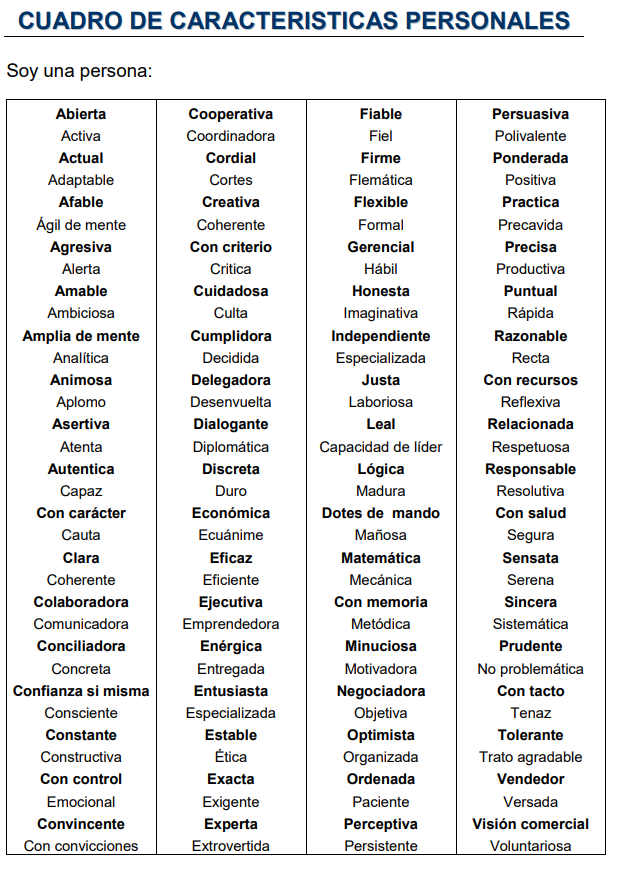
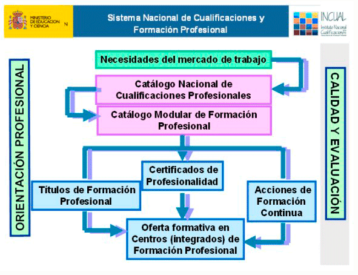
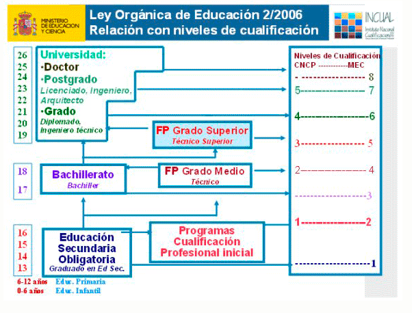
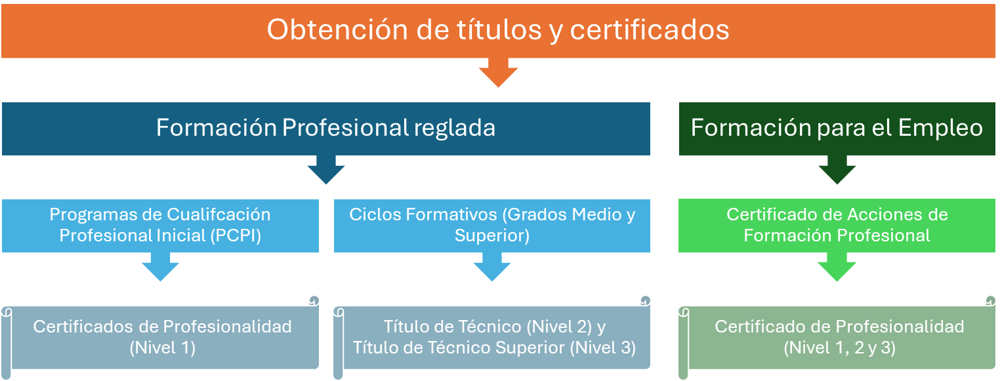
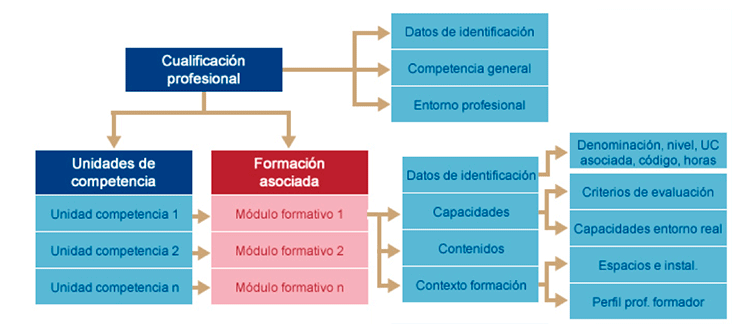
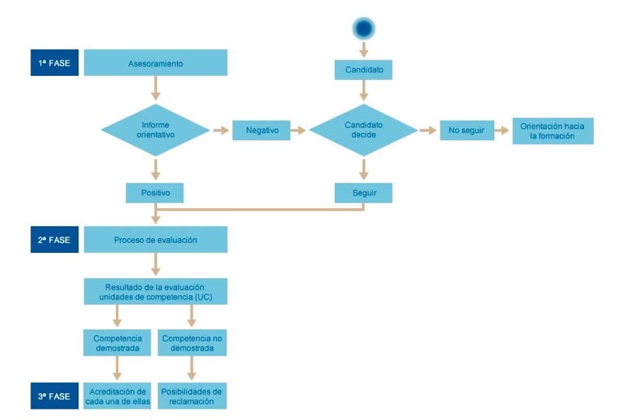
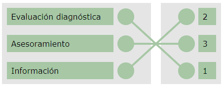
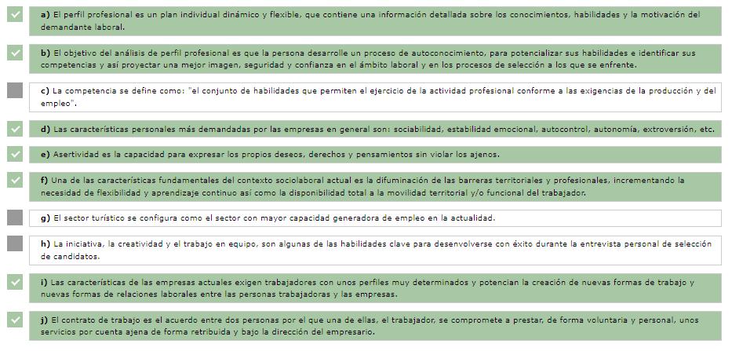
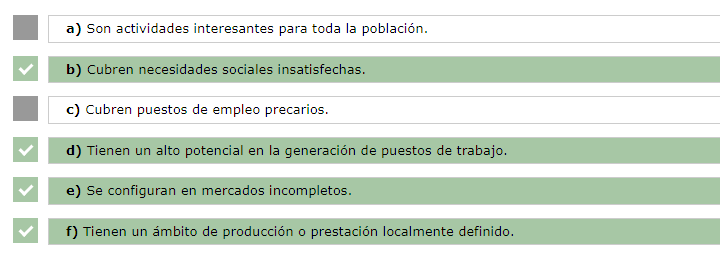
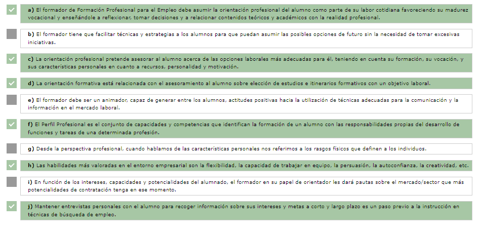

[TOC]

# MF1446 - Orientación laboral y promoción de la calidad en la formación profesional para el empleo

# Unidad 01 - Análisis del perfil profesional

---

## Introducción y objetivos

En esta primera unidad de aprendizaje vamos a profundizar en el análisis del **perfil profesional**. Conoceremos el **contexto sociolaboral**, sus características y las **tendencias del mercado**, y por último exploraremos los **itinerarios formativos y profesionales**.

Todas las áreas de conocimiento mantienen, en mayor o menor medida, una conexión directa con el mundo profesional. El docente de **Formación Profesional para el Empleo (FPE)** debe asumir la orientación profesional como parte natural de su labor cotidiana. En este sentido, deberá favorecer la **madurez vocacional** del alumnado, enseñándole a reflexionar, tomar decisiones y relacionar los contenidos teóricos con la realidad profesional.

El docente, en su papel de orientador, tiene como objetivos principales:

- 💡 **Dotar a los participantes de autonomía e iniciativa.**
- 🧭 **Facilitar técnicas y estrategias** para que puedan valorar y asumir distintas opciones de futuro.
- ⭐ **Reforzar su autoconcepto y autoestima**, transmitiéndoles seguridad.

🎯 **El objetivo de esta unidad es:**  
Facilitar **información y orientación laboral** y promover la **calidad de la Formación Profesional para el Empleo**.

> [!tip] Consejo  
> Para comenzar esta unidad te recomendamos este vídeo que repasa el concepto de perfil profesional y lo que buscan actualmente las empresas en un candidato:
>
> 

> <iframe width="560" height="315"
>  src="https://www.youtube.com/embed/v2eWtkUC-MY"
>  title="Perfil profesional y empleabilidad"
>  frameborder="0"
>  allow="accelerometer; autoplay; encrypted-media; gyroscope; picture-in-picture; web-share"
>  referrerpolicy="strict-origin-when-cross-origin"
>  allowfullscreen>
> </iframe>
> 

---

## 1. El perfil profesional

{.rounded-4}

### 1.1. Introducción

El docente de **Formación Profesional para el Empleo (FPE)** debe ser un **animador al empleo**. Ha de ser capaz de generar en los participantes actitudes positivas hacia el empleo y orientarles en el uso de **técnicas adecuadas de búsqueda**, un campo en el que las **nuevas tecnologías de la información y la comunicación** desempeñan un papel protagonista.

Desde la perspectiva de la **planificación centrada en la persona**, el perfil profesional es un **plan individual, dinámico y flexible**, que recoge información detallada sobre los **conocimientos, habilidades y motivaciones** del participante, ayudándole a dirigir su búsqueda de empleo.

> [!note] Definición  
> 📢 **El Perfil Profesional** es el conjunto de capacidades y competencias que identifican la formación de una persona para asumir, en condiciones óptimas, las responsabilidades propias del desarrollo de funciones y tareas de una determinada profesión.

El objetivo del análisis del perfil profesional es que la persona desarrolle un proceso de **autoconocimiento**, potenciando sus habilidades e identificando sus competencias, para proyectar una **imagen más segura, confiada y profesional** en el ámbito laboral y en los procesos de selección.

> [!note] Definición  
> 📢 **La competencia** se define como: "el conjunto de conocimientos y capacidades que permiten el ejercicio de la actividad profesional conforme a las exigencias de la producción y del empleo" (Ley 5/2002, de las Cualificaciones y de la Formación Profesional).

> [!tip] Competencias que buscan las empresas  
> A continuación se muestra una explicación breve de las competencias más valoradas por las organizaciones:
>
> - 🚀 **Proactividad:** Capacidad para adelantarse a los problemas y actuar sin esperar órdenes.  
> - 🔥 **Motivación:** Interés y energía por aprender, mejorar y aportar valor.  
> - 🤝 **Trabajo en equipo:** Colaborar con otras personas para lograr objetivos comunes.  
> - 🎯 **Orientación a resultados:** Enfocarse en cumplir metas y mejorar continuamente.  
> - 🧩 **Orientación al cliente:** Comprender y satisfacer las necesidades de clientes internos o externos.  
> - 🤗 **Actitud de servicio:** Disposición a ayudar, resolver y facilitar el trabajo a los demás.  
> - 🧠 **Análisis de problemas y toma de decisiones:** Evaluar información, identificar causas y elegir soluciones eficaces.  
> - 🗣️ **Argumentación y negociación comercial:** Defender propuestas y llegar a acuerdos beneficiosos.  
> - 📚 **Autodesarrollo:** Interés por formarse y mejorar de manera continua.  
> - 💬 **Comunicación:** Expresar ideas con claridad, escuchar y adaptarse al interlocutor.  
> - 🛒 **Gestión comercial:** Planificar, organizar y ejecutar acciones de venta.  
> - 🎙️ **Influencia y persuasión:** Conseguir que otras personas acepten ideas, propuestas o cambios.  
> - 🧭 **Habilidades gerenciales (management):** Dirigir personas, organizar tareas y gestionar recursos.

---

### 1.2. Carácter individualizado del proceso de orientación

#### 1.2.1. Aspectos generales y pautas para la intervención orientadora

> [!important]
> La orientación profesional se configura como un **puente entre la formación y el mundo laboral**. Su finalidad es asesorar al participante sobre las opciones laborales más adecuadas, teniendo en cuenta su **formación, vocación, recursos personales, personalidad y motivación**.

El docente, en su papel de orientador, deberá superar ciertos obstáculos que los participantes pueden presentar:

1. ❓ **Desorientación** sobre su futuro profesional.  
2. ⚖️ **Dificultad para tomar decisiones.**  
3. 👥 **Presión social y familiar** para escoger una profesión concreta.  
4. 🧩 **Problemas de autoconcepto o autoestima**, que pueden hacerles creer que no son capaces de realizar tareas para las que sí están cualificados.  
5. 😔 **Desánimo por experiencias negativas previas** en la búsqueda de empleo.  
6. 💤 **Baja motivación** hacia el trabajo.  
7. 🔄 **Realización de empleos alejados de su meta profesional** por necesidad económica u otras circunstancias.  
8. 🗣️ **Habilidades personales y/o sociales deficientes** que dificultan la inserción laboral.

Dentro de la orientación profesional se incluye la **orientación formativa**, relacionada con el asesoramiento sobre la **elección de estudios, itinerarios formativos y opciones educativas** que faciliten el acceso al mundo laboral.

**Pautas para la intervención orientadora**

- 📘 **Considerar los conocimientos previos** del alumnado antes de realizar actividades.  
- 📝 Las actividades deben formar parte de una **planificación estructurada**, con objetivos, contenidos y criterios de evaluación.  
- 🤝 **Favorecer la interacción** entre alumno y orientador. No siempre implica asesoramiento individual: se puede trabajar con **grupos reducidos**.  
- 🔗 **Interrelacionar teoría y práctica** de forma continua, vinculando los contenidos con su aplicación real en el mundo productivo.

---

#### 1.2.2. Principios que rigen la orientación

La Organización para la Cooperación y el Desarrollo Económico (OCDE), en 2004, destaca varios principios que deben regir el planteamiento de la orientación, entre ellos el **carácter individualizado** de la intervención:

1. 👤 **Orientación individualizada** centrada en el usuario–beneficiario.  
2. 🎯 **Participación activa** del usuario en su propio proceso de orientación.  
3. 🚪 **Mejora del acceso** a los servicios de orientación y formación ocupacional.  
4. ⭐ **Garantía de calidad** en el proceso de orientación.

> [!important]
> La publicación del **Plan Nacional de Acción para el Empleo** consolida la **atención individualizada como la más adecuada para desarrollar la orientación profesional**.  
> Se deben tener en cuenta los **aspectos personales y del entorno** de las personas que buscan trabajo, ya que son determinantes para planificar las acciones de orientación laboral.  
> Esto implica **individualizar y personalizar** el asesoramiento según las necesidades particulares de cada persona, favoreciendo su inserción en el mercado laboral en las condiciones más acordes con sus **aptitudes, actitudes y circunstancias personales**  
> *(BERNAL CANTÓ, Ángeles. Guía de orientación laboral. Valencia: SERVEF).*

Como se indica en la guía del Servef, la intervención en orientación laboral debe seguir los siguientes principios:

- **🟦 Individualización**  
  Debe responder a las necesidades y circunstancias de cada participante.  
  Los contenidos, temporalización, lenguaje y técnicas deben adaptarse a cada persona.

- **🟦 Flexibilidad**  
  Debe permitir ajustes debido a nuevas situaciones, actividades o informaciones que aporte el usuario.  
  Además, permite intervenciones individuales o grupales según lo requiera cada caso.

- **🟦 Desarrollo/búsqueda de la autonomía**  
  Debe potenciar la autonomía del participante, desarrollando sus recursos, habilidades y competencias.

---

#### 1.2.3. Tareas de trabajo individualizado

El trabajo con los usuarios de manera individualizada incluye las siguientes tareas:

1. 🧭 **Evaluación diagnóstica**  
    Detección de necesidades, análisis de la demanda y evaluación de la situación.  
    El profesional de la orientación no solo debe valorar la situación, sino también favorecer los **procesos de autoevaluación** del usuario.  
    La herramienta más utilizada es **la entrevista**, aunque en ocasiones se complementa con pruebas o tests psicométricos.  
    El desarrollo de metodologías sistemáticas que permitan un conocimiento profundo del usuario sigue siendo uno de los retos de la orientación profesional. El **análisis funcional por competencias** es considerado por diversos autores (como Fernández, J.) una herramienta eficaz para este fin.

2. 📊 **Información**  
    Presentación de datos objetivos y prácticos al usuario.

3. 🤝 **Asesoramiento**  
    Su finalidad es ayudar al usuario a **resolver un problema concreto** mientras se le capacita para afrontar situaciones similares en el futuro.

---

#### 1.2.4. Análisis del contexto social y laboral

Si analizamos el contexto social y laboral actual, observamos que los cambios en el mercado laboral son **constantes** y **muy variados**:

- 🛠️ **Creación de nuevos puestos de trabajo que exigen formación novedosa**  
  Estamos asistiendo al nacimiento de profesiones vinculadas a la evolución tecnológica.  
  Muchos trabajos que existirán dentro de **3 o 4 años aún no existen**, y actualmente tampoco existe formación específica para desempeñarlos.

- 🔄 **Movilidad en el puesto de trabajo y en la trayectoria profesional**  
  Los cambios de empresa y puesto son cada vez más frecuentes.  
  Hemos dejado atrás la idea de permanecer toda la vida en el mismo puesto o en la misma organización.

- 📉 **Mayor diferencia entre grupos sociales y su incorporación a puestos especializados**  
  Diversos estudios señalan que las diferencias entre grupos sociales aumentan, así como las desigualdades en el acceso a empleos especializados.

> [!note] Más información  
> Si quieres profundizar en las profesiones del futuro, te recomendamos el siguiente artículo:  
> **10 profesiones que arrasarán en 2020 (El Confidencial)**  
> https://www.elconfidencial.com/alma-corazon-vida/2013-02-28/en-esto-trabajaremos-diez-profesiones-que-arrasaran-en-2020_202459/

---

#### 1.2.5. Tendencia actual de la orientación profesional en la Unión Europea

Por estos motivos, la orientación laboral es **necesaria** en la sociedad actual, ya que ofrece ayuda tanto a individuos como a organizaciones.  
En este sentido, las tendencias actuales de la orientación profesional en la Unión Europea se conciben de la siguiente manera:

- 🔄 **Proceso continuo a lo largo de la vida**  
  La orientación se inicia en edades tempranas y se mantiene durante todo el ciclo vital.

- 🏫 **Integración en el proceso educativo**  
  La orientación profesional debe formar parte natural de la educación en todas sus etapas.

- 🚀 **Orientadores como agentes de cambio**  
  El rol del orientador laboral se entiende como el de un dinamizador de innovación y transformación.

- 🎯 **El usuario como agente activo**  
  La persona que recibe orientación debe participar activamente en su propio proceso.

- 🌍 **Impulso en el ámbito universitario y comunitario**  
  Es necesario fortalecer la orientación tanto en la universidad como en el entorno social y comunitario.

- 💻 **Asumir la dimensión europea y tecnológica**  
  Se deben establecer canales de información e intercambio entre países, así como aprovechar la informática y las nuevas tecnologías.

---

### 1.3. Características personales

#### 1.3.1. Aspectos generales

Hacer un análisis de las **capacidades personales** es de gran utilidad para la presentación de la candidatura profesional. Para ello, conviene tener en cuenta:

- 🎓 **Formación reglada:** nivel de estudios, certificados o títulos oficiales.  
- 📚 **Formación complementaria:** cursos, idiomas, informática, especializaciones.  
- 🤝 **Experiencia no laboral:** prácticas, voluntariado o colaboraciones.  
- 💼 **Experiencia laboral:** funciones realizadas, aprendizajes adquiridos, herramientas utilizadas y logros alcanzados.

En el proceso de **autoconocimiento**, debemos elaborar una relación sincera y lo más detallada posible de los siguientes apartados:

- 🌟 **Habilidades y actitudes**  
  Las *habilidades* se refieren al talento, la pericia o la aptitud para desarrollar una tarea.  
  Las *actitudes* son disposiciones de ánimo frente a personas, ideas o situaciones.

- 🧠 **Características personales**  
  Conjunto de rasgos que definen a la persona: sociabilidad, estabilidad emocional, autocontrol, autonomía, extroversión, introversión, etc.

- 🎓 **Formación**  
  Incluye los conocimientos obtenidos a través de formación reglada y no reglada.

- 🧰 **Experiencia profesional**  
  Conjunto de trabajos y profesiones desarrolladas.  
  También se deben reflejar prácticas, colaboraciones y trabajos no reconocidos formalmente.

Las **características personales** nos diferencian del resto y nos hacen únicos.  
Muestran cómo somos en distintos contextos, cómo afrontamos los obstáculos y cómo los superamos.

Podemos definir las características personales como:

- *Conjunto de elementos psicológicos del individuo* que cambian poco a lo largo del tiempo.  
- *Elementos que conforman una personalidad propia y particular.*  
- *Estructura psicológica total del individuo*, que incluye aspectos fisiológicos, intelectuales, afectivos e impulsivos.

La personalidad es generalmente **estable**, aunque pueden producirse ciertos cambios, especialmente cuando la persona se lo propone activamente o durante las primeras etapas de la vida.

Veamos un cuadro de características personales que puede ayudar a orientadores y usuarios a definirlas:

{.img-preview}

---

#### 1.3.2. Características personales del candidato ideal

Siguiendo el portal online **Universia**, el candidato ideal que buscan las empresas presenta las siguientes características personales:

- 🌟 **Entusiasmo:** personas capaces de transformar ideas y sueños en realidades.  
- 🔋 **Energía, autonomía e iniciativa propia.**  
- 📈 **Motivación por su propio crecimiento** y el de su entorno.  
- 🎨 **Creatividad:** imaginación, inspiración e innovación.  
- 🎯 **Capacidad para marcarse objetivos** (y cumplirlos).  
- 💪 **Persistencia, constancia y esfuerzo.**  
- 🤝 **Trabajo en equipo**, con potencial para llegar a dirigirlo.  
- 📏 **Rigor, responsabilidad y valores éticos.**  
- 🔥 **Liderazgo:** capacidad para inspirar y mover a otras personas.  
- 🔄 **Flexibilidad y adaptación**, capaces de asumir distintos puestos, sobre todo en etapas iniciales como prácticas o becas.  
- 🧭 **Resolución de problemas**, capacidad de tomar decisiones y asumir riesgos.

En el siguiente esquema se muestra cómo identifican las empresas de selección las características personales de los candidatos a un puesto de trabajo:

- 🧠 **Ejecución de la tarea en sí**
  - Inteligencia general  
  - Atención concentrada en los detalles  
  - Aptitud numérica  
  - Aptitud verbal  
  - Aptitud espacial  
  - Razonamiento deductivo o inductivo

- 🔗 **Interdependencia con otras tareas**
  - Atención dispersa y amplia  
  - Visión de conjunto  
  - Facilidad de coordinación  
  - Espíritu de integración  
  - Resistencia a la frustración o al fracaso  
  - Iniciativa propia

- 🤝 **Interdependencia con otras personas**
  - Relaciones humanas  
  - Habilidad interpersonal  
  - Colaboración y cooperación  
  - Cociente emocional  
  - Liderazgo  
  - Facilidad de comunicación

---

### 1.4. Formación

#### 1.4.1. Formación reglada y no reglada

Junto al análisis de las características personales, debemos revisar los **conocimientos adquiridos** a través de la formación reglada y no reglada. También es importante conocer las vías para **buscar y recibir formación** que contribuya a la mejora del perfil profesional.

La formación es una herramienta clave para responder a los **constantes cambios del mercado laboral**, facilitando el acceso y la permanencia en un puesto de trabajo.

> [!important]
> Hasta la publicación del **Real Decreto 395/2007**, la formación profesional en España no disponía de un sistema integrado para facilitar el acceso al empleo.  
> Actualmente se regula mediante la **Ley 30/2015, de 9 de septiembre**, y el **Real Decreto 694/2017, de 3 de julio**, que la desarrolla.

La **Formación Profesional Reglada** permite obtener títulos oficiales avalados por la Administración Educativa, como:

- 🎓 Graduado/a en ESO  
- 🎓 Título de Bachiller  
- 🛠️ Título de Formación Profesional de Grado Medio  
- 🧪 Título de Técnico/a Superior  
- 🎓 Titulaciones universitarias

En la **educación no formal**, existían dos sistemas distintos:

1. **Formación Profesional Continua**  
    Dirigida a trabajadores y trabajadoras **ocupadas**.

2. **Formación Profesional Ocupacional**  
    Dirigida a personas **desempleadas**, con el objetivo de facilitar su inserción laboral.

Con las reformas de **2007**, ambas pasan a integrarse en una única denominación:

**👉 Formación Profesional para el Empleo**

Todas las acciones formativas deben estar asociadas a **módulos por competencias**.  
Esto permite:

- Acceder a certificación directa si la acción está **homologada**.  
- Acudir a **procesos de acreditación de competencias** si la formación no es reglada.

---

**Evolución normativa de la Formación Profesional para el Empleo**  

- **📅 2003**  
  Con el **Real Decreto 1046/2003** se inicia la revisión del sistema.  
  La **Ley Orgánica 5/2002** favorece la integración de los subsistemas continua y ocupacional.

- **📅 2007**  
  El **Real Decreto 395/2007** establece el modelo de **Formación Profesional para el Empleo**, integrando definitivamente ambos sistemas.

- **📅 2012**  
  El **Real Decreto Ley 3/2012** reconoce el derecho a un permiso retribuido de 20 horas de formación, y crea el contrato para la formación y el aprendizaje, además de la cuenta y el cheque de formación.

- **📅 2015**  
  El **Real Decreto Ley 4/2015** y posteriormente la **Ley 30/2015** consolidan el modelo actual.  
  Ese mismo año se aprueba el **Real Decreto Legislativo 3/2015**, texto refundido de la Ley de Empleo.

- **📅 2017**  
  El **Real Decreto 694/2017** desarrolla la Ley 30/2015 y continúa avanzando en el marco regulador.
  
  Una de las piezas clave en la reforma de las políticas de activación para el empleo es la **renovación del marco normativo**, que se completa con:
  
  - La **Cartera Común de Servicios del Sistema Nacional de Empleo**  
    (Real Decreto 7/2015, de 16 de enero).
  - El **Reglamento de Formación Profesional para el Empleo**, incluido dentro de la reforma global del sistema.
  
  La Ley 30/2015 prevé un desarrollo reglamentario amplio que continúa mediante **órdenes ministeriales específicas** para determinados aspectos.

> [!caution] Actualización normativa (2022)
>
> ⚠️La información anterior está desactualizada⚠️
>
> En marzo de 2022 se aprueba la **Ley Orgánica 3/2022, de Ordenación e Integración de la Formación Profesional**, que unifica en un único sistema toda la Formación Profesional en España.  
>
> Principales novedades relevantes:
>
> - **Unificación total**: desaparece la separación entre *FP Reglada* y *FP para el Empleo*.  
> - Se establece un **único sistema modular por competencias**, con itinerarios flexibles y acumulables.  
> - Se crea la **Acreditación permanente de competencias**, abierta todo el año para cualquier persona.  
> - Se introduce la **Formación Profesional Dual como modelo general**, combinando formación y actividad profesional en empresa.  
> - Se establecen **cinco grados de FP**, desde microformaciones hasta títulos superiores, todos conectados entre sí.  
> - Se refuerza la **colaboración con empresas**, con mayores exigencias de calidad en los centros.  
> - Las acciones formativas financiadas por el SEPE deben alinearse con el nuevo **Catálogo Nacional de Estándares de Competencias Profesionales**.
>
> Esta ley sustituye progresivamente al modelo anterior basado en la Ley 30/2015 y el RD 694/2017, por lo que algunos contenidos tradicionales de “formación continua”, “ocupacional” o “FPE” quedan integrados en este nuevo marco único de Formación Profesional.

---

#### 1.4.2. Vías de acceso al mundo laboral

Por un lado, encontramos la **formación reglada**, configurada dentro del sistema educativo formal (ESO, Bachillerato, Ciclos Formativos y Grados Universitarios).

Por otro lado, se encuentra el sistema de **Formación Profesional para el Empleo**, resultado de la unión de la antigua formación continua y la formación ocupacional, que permite obtener **certificados de profesionalidad**, conducentes a una cualificación profesional.

- 🎓 **Formación Profesional Reglada**  
  Sistema formal → Administración Educativa  
  - Se estructura en **Ciclos Formativos de Grado Medio y Superior**.  
  - Forma parte del **Sistema Educativo Nacional**.  
  - Permite obtener **títulos oficiales** recogidos en el *Catálogo de Títulos Profesionales*.

- 🧰 **Formación Profesional para el Empleo**  
  Sistema no formal → Administración Laboral  
  - Incluye la antigua **formación continua** (para personas ocupadas).  
  - Incluye la **formación profesional ocupacional** (dirigida a personas desempleadas).  
  - Permite acceder a **certificados de profesionalidad** vinculados a competencias profesionales.

> [!note]  
> La formación reglada está regulada por la Administración Educativa. Incluye: Educación Infantil, Primaria, Secundaria, Bachillerato, Ciclos Formativos de Grado Medio y Superior, y Universidad.

> [!important]  
> La enseñanza obligatoria comprende toda la **Educación Primaria** y la **Educación Secundaria Obligatoria (ESO)**.  
> Al finalizar la ESO, el alumnado obtiene el título de **Graduado/a en Educación Secundaria**, con el que puede optar a:  
> - Incorporarse al mundo laboral.  
> - Continuar estudios en **Formación Profesional de Grado Medio**.  
> - Continuar estudios de **Bachillerato**.  
> - Realizar acciones formativas dentro de la **Formación Profesional para el Empleo**.

> [!tip] Recuerda  
> A partir de obtener el título de ESO, la formación profesional orientada al empleo puede recibirse por **cauces formales** (Ciclos Formativos, Bachillerato, Universidad) o por **cauces no formales** a través de la Formación Profesional para el Empleo.

---

#### 1.4.3. ¿Qué es la Formación Profesional para el Empleo?

> [!important]
> La Formación Profesional para el Empleo tiene como finalidad **capacitar a trabajadores y trabajadoras**, tanto desempleados como ocupados, promoviendo sus competencias profesionales adquiridas mediante procesos formativos o a través de la experiencia laboral.  
> La formación proporcionada debe responder a las **exigencias del mercado de trabajo**, mejorando la **empleabilidad**, la actualización profesional y el acceso al empleo.

Son fines de la Formación Profesional para el Empleo:

1. 🎓 **Favorecer la formación a lo largo de la vida** de personas desempleadas y ocupadas, mejorando su cualificación profesional y desarrollo personal.  
2. 🧰 **Proporcionar conocimientos y prácticas vinculadas a las competencias requeridas por el mercado laboral** y las necesidades de las empresas.  
3. 📈 **Contribuir a la mejora de la productividad y competitividad** de las empresas.  
4. 💼 **Mejorar la empleabilidad**, especialmente de quienes presentan mayores dificultades de inserción o mantenimiento del empleo.  
5. 📝 **Promover la acreditación** de competencias adquiridas tanto por vías formativas (formales y no formales) como por experiencia laboral.

El **Sistema Nacional de las Cualificaciones Profesionales y la Formación Profesional** nace con la intención de integrar las distintas ofertas de formación profesional.  
Este objetivo se articula mediante el **Catálogo Nacional de Cualificaciones Profesionales**, cuyos principios fundamentales son:

- 🔗 **Integración de todos los subsistemas** de formación profesional y sus correspondientes acreditaciones.  
- 🤝 **Participación activa del tejido productivo**, incluyendo organizaciones empresariales y sindicales, como agentes clave en la construcción y garantía del sistema.  
- 👁️ **Vigilancia permanente** de la relación entre formación y mercado laboral, evitando desfases y permitiendo una actualización constante de las cualificaciones.  

Tal como puede observarse en el siguiente esquema, **el punto de partida** para adoptar decisiones en torno a la formación profesional es el **diagnóstico de las necesidades del mundo productivo**:

{.rounded-4}

---

#### 1.4.4. Certificados de profesionalidad

> [!note] Definición  
> 📢 Un **certificado de profesionalidad** es un documento que acredita a una persona en una **cualificación profesional** del *Catálogo Nacional de las Cualificaciones Profesionales*.  
> Son emitidos por el **Servicio Público de Empleo Estatal (SEPE)** o por las **Comunidades Autónomas**, y tienen validez en todo el territorio nacional.  
> El **Real Decreto 34/2008, de 18 de enero**, regula los certificados de profesionalidad.

Las cualificaciones profesionales pueden acreditarse mediante:

- 🎓 **Títulos de Formación Profesional** expedidos por el sistema educativo.  
- 🧰 **Certificados de Profesionalidad** otorgados por la administración laboral.

Ambos tienen **carácter oficial** y validez en todo el territorio nacional.

En el siguiente esquema del Ministerio de Educación puede verse la **correspondencia entre los niveles de cualificación** del Catálogo Nacional y los niveles del sistema educativo:

{.rounded-4}

De este modo, los títulos y certificados pueden obtenerse por dos vías:

- 🏫 **A través de la Administración educativa**, mediante un título de Formación Profesional.  
- 🧑‍🏭 **A través de la Administración laboral**, mediante Certificados de Profesionalidad.

{.img-preview}

Para elaborar un **buen perfil profesional**, el orientador debe analizar todos los conocimientos del usuario, tanto los adquiridos mediante formación reglada como los obtenidos a través de formación no reglada.  
Asimismo, para diseñar un **itinerario formativo adecuado**, tanto el orientador/a como la persona usuaria deben conocer bien el **panorama actual de la Formación Profesional**.

---

### 1.5. Experiencia profesional

Para realizar un **buen perfil profesional** debemos analizar y explicar los trabajos y profesiones desarrollados a lo largo de la vida.  
También deben reflejarse prácticas, voluntariados, trabajos no reconocidos, colaboraciones u otras experiencias relevantes.

Meyer y Schwager (2007) definen la experiencia laboral como la **respuesta interna y subjetiva** de los trabajadores ante cualquier contacto directo o indirecto con prácticas, políticas o procedimientos de gestión de personas.  
Los contactos con responsables y compañeros/as, así como las tareas y funciones realizadas, se combinan con las expectativas del trabajador sobre su organización y su puesto, generando pensamientos, emociones y estados mentales que conforman la **experiencia laboral global**, influyendo en su comportamiento profesional.

> [!note] Definición  
> 📢 La **experiencia laboral** es el conjunto de conocimientos y aptitudes que una persona ha adquirido realizando una actividad profesional durante un periodo de tiempo determinado.

Es importante distinguir entre:

- 🎓 **Experiencia relacionada con los estudios cursados**, ya sean universitarios, de Formación Profesional o Certificados de Profesionalidad.  
- 🧰 **Experiencia no relacionada con los estudios**, que también aporta valor, habilidades y competencias transferibles.

> [!important]  
> Es fundamental dejar claras las **tareas y funciones desempeñadas** en anteriores puestos de trabajo, ya que muchas de estas funciones pueden ser **transferibles** a otros empleos.  
>
> Además, deben destacarse los **logros y aportaciones** conseguidos en cada puesto, pues refuerzan la valía profesional del candidato.

---

### 1.6. Habilidades y actitudes

#### 1.6.1. Características del candidato ideal

Siguiendo al portal Universia, el candidato ideal que buscan las empresas presenta las siguientes **aptitudes** y **actitudes**:

- 🧠 **Aptitudes**  
  - Capacidad para utilizar la tecnología de forma eficiente.  
  - Aprendizaje de nuevos conceptos y buen sentido analítico.  
  - Alto potencial de desarrollo.  
  - Conocimientos técnicos aplicables al sector y a los productos de la empresa.  
  - Titulación superior.  
  - Alto nivel de inglés (y valoración de otros idiomas).  
  - Conocimientos informáticos a nivel de usuario: MS Office, Internet, correo electrónico.  
  - También deben considerarse habilidades muy valoradas hoy: flexibilidad, trabajo en equipo, persuasión, autoconfianza, creatividad, etc.

- 💬 **Actitudes**  
  - Prestar servicios con calidad y con alta capacidad de compromiso.  
  - Fuerte voluntad de continuidad y progreso dentro de la organización.  
  - Integración en la cultura de la empresa y alineación con sus valores.

Este análisis puede aplicarse tanto en trabajo **individual** como en **pequeños grupos**.  
En función de intereses, capacidades y potencialidades del alumnado, el docente–orientador debe ofrecer pautas sobre:

- El **mercado o sector profesional** más adecuado  
- Los **conocimientos técnicos** que debe dominar para desempeñar con éxito las tareas del puesto deseado

**Características, competencias y cualidades consideradas generalmente positivas y negativas por las empresas**

- ✔️ **Positivas:** tolerancia al estrés, independencia, liderazgo, iniciativa, autonomía, responsabilidad, madurez.

- ❌ **Negativas:** pasividad, individualismo, agresividad, conflictividad, irresponsabilidad, pesimismo, desorden.

---

#### 1.6.2. Actividades del docente para favorecer el diagnóstico del alumno

Como paso previo a la instrucción en técnicas de búsqueda de empleo y creación de empresas, existen diversas actividades que el docente–orientador puede realizar para **favorecer el diagnóstico inicial del alumnado**:

- 🗣️ **Mantener entrevistas personales**  
  Permiten recoger información sobre los intereses, metas a corto y largo plazo, grado de adecuación del perfil profesional y aspectos que podrían dificultar el desempeño laboral.

- 📝 **Realización de cuestionarios**  
  Como el *Inventario de Preferencias Profesionales*, que aporta información complementaria sobre los intereses del participante. No ofrecen verdades absolutas, pero son útiles para completar el diagnóstico.

- 👀 **La observación**  
  Observación del trabajo que el participante realiza para encontrar empleo y de comportamientos que puedan dificultarlo.  
  Es fundamental la **autoobservación**, donde el participante anota en una hoja de registro las tareas que realiza dentro de su búsqueda activa de empleo.

- 💬 **Dinámicas de grupo**  
  Debates sobre temas de interés donde los participantes verbalizan contenidos, comparten opiniones y se enriquecen mutuamente.

- 🎭 **Role play**  
  La simulación de situaciones permite reforzar conductas adecuadas y trabajar respuestas profesionales ante escenarios reales.

- 🤝 **Entrenamiento en habilidades sociales y personales**  
  Muchas dificultades escolares, laborales o sociales están vinculadas a carencias en estas habilidades.  
  El orientador suele centrarse en fomentar:

  - ⭐ **Autoestima:** percepción positiva de uno mismo.  
  - 🧑‍🤝‍🧑 **Participación social:** capacidad para integrarse y colaborar en actividades colectivas.  
  - 🗣️ **Asertividad:** expresar opiniones y defender derechos respetando a los demás.  
  - 💬 **Comunicación:** transmitir ideas con claridad y comprender a los otros.  
  - 🎛️ **Autocontrol:** gestionar emociones y comportamientos en situaciones diversas.

---

A modo de conclusión, la **orientación laboral** es un instrumento de asesoramiento para personas trabajadoras, tanto ocupadas como desempleadas, que facilita:

- su adaptación a los cambios del mercado de trabajo  
- su acceso, promoción y movilidad profesional  
- la mejora de su empleabilidad  
- el incremento de oportunidades para encontrar empleo  
- el acceso a servicios técnicos de orientación y formación  
- su participación en procesos de **acreditación y cualificación profesional** dentro del *Sistema Nacional de Cualificaciones Profesionales (SNCP)*

> [!note] Definición  
> 📢 La <abbr title="Organización para la Cooperación y el Desarrollo Económico">OCDE</abbr> (2003) define la orientación profesional como el conjunto de actividades destinadas a **ayudar a las personas de todas las edades** a tomar decisiones sobre educación, formación y profesión, y a gestionar su trayectoria laboral.  
> La orientación ayuda a reflexionar sobre ambiciones, intereses, cualificaciones y capacidades, así como a comprender el mercado laboral y relacionarlo con el propio perfil.  
> Una orientación integral enseña a planificar y tomar decisiones a lo largo de la vida, proporcionando información sistematizada sobre oportunidades de formación y empleo **en el momento en que la persona la necesita**.

---

## 2. El contexto sociolaboral

### 2.1. Concepto

Si el eje central de la función orientadora es la **adecuación del perfil profesional** de la persona a los requerimientos ocupacionales del mercado, es imprescindible que el docente esté **continuamente actualizado** para informar a los participantes sobre la **situación actual y futura** de las ocupaciones y de los requisitos que estas exigen.

La orientación profesional proporciona información sobre el **mercado laboral** y las **oportunidades de formación**, organizando y sistematizando estos datos para que estén disponibles **en el momento adecuado** en que las personas los necesiten.

- 🏢 **Oferta**  
  Son los puestos de trabajo que ofrece el mercado laboral en un momento concreto.
- 🔗 **Intermediarios**  
  Son organismos y entidades que facilitan la conexión entre oferta y demanda:  
  - Servicios Públicos de Empleo  
  - Agencias de colocación  
  - Empresas de Trabajo Temporal  
  - Bolsas de trabajo  
  - Consultoras de selección de RRHH
- 👥 **Demanda**  
  Son las personas en condiciones de trabajar y que desean hacerlo.

---

### 2.2. Características del contexto sociolaboral

- 🧭 **Características generales**
  1. Globalización de la economía e impacto de las nuevas tecnologías, lo que favorece un mayor dinamismo en el flujo de información, mercancías y personas a nivel mundial.  
  2. Difuminación de las barreras territoriales y profesionales, aumentando la necesidad de **flexibilidad**, **aprendizaje continuo** y **movilidad territorial y/o funcional**.  
  3. Predominio del **sector servicios**. La descentralización productiva impulsa la subcontratación y refuerza el peso del sector servicios.  
  4. Aparición de **nuevas formas de trabajo**, como el teletrabajo.  
  5. Nuevas formas de organización y control del trabajo, junto con ocupaciones emergentes en informática y comunicaciones.  
  6. Mayor tasa de ocupación masculina que femenina.  
  7. Aumento de la **temporalidad** en el empleo.  
  8. Crecimiento progresivo del **trabajo a tiempo parcial**.  
  9. Características predominantes: **incertidumbre**, **irregularidad**, **rigidez salarial** y **rotación**.

- 🏢 **Características específicas del mercado de trabajo en España**
  1. Tasas bajas de natalidad, lo que incrementa el esfuerzo para sostener el Sistema de la Seguridad Social.  
  2. Altas tasas de desempleo, especialmente juvenil y femenino. El número de candidatos por puesto se duplica, dificultando el acceso al empleo.  
  3. Presencia de **paro de larga duración**.  
  4. Falta de iniciativa emprendedora. Las políticas de empleo fomentan la creación de empresas y reducen trámites legales.  
  5. Distribución cambiante del empleo por sectores; el **sector servicios** es el principal generador de empleo.  
  6. Alta **concentración geográfica** del empleo. En 2011 crecieron Navarra y País Vasco; Canarias y Andalucía experimentaron retrocesos.  
  7. Elevado porcentaje de empleo temporal.  
  8. **Dificultad de conciliación** entre vida laboral y personal.

- 🧩 **Exigencias y requisitos**
  1. Adaptación a distintos entornos y tareas, junto con **aprendizaje y reciclaje continuo**.  
  2. Iniciativa, creatividad y **trabajo en equipo** como habilidades clave.  
  3. Conocimiento de **idiomas**, manejo de TIC y formación especializada.  
  4. Movilidad geográfica y funcional, disponibilidad horaria, carnet de conducir y vehículo, como requisitos frecuentes.

---

### 2.3. Tendencias del mercado laboral

En el siglo pasado, trabajar suponía formar parte de **una misma empresa durante toda la vida**, con un puesto estable, un contrato fijo, un horario regular y mejoras laborales anuales recogidas en los convenios colectivos.

A partir del último cuarto del siglo XX, los cambios en la sociedad laboral han sido **intensos y profundos**.

> [!note] Definición  
> 📢 Los expertos denominan **era postindustrial** al conjunto de cambios que, desde el último cuarto del siglo XX, han transformado el mercado laboral.  
> En esta etapa, el **conocimiento** y la **información** se vuelven más relevantes que la fuerza física, la capacidad productiva o incluso el propio capital.

La globalización —especialmente en comunicaciones, mercados e intercambios financieros— ha provocado:

- 🔄 Una nueva división internacional del trabajo  
- 🌍 Procesos acelerados de **deslocalización empresarial**  
- 🏢 Concentración de capitales en grandes oligopolios en muchos sectores económicos

> [!important]  
> El **Programa Nacional de Reformas (PNR) de España de 2011**, dentro del *Semestre Europeo*, reconocía que el objetivo central de la política económica debía ser la **creación de empleo**.  
> Se fijó como meta una **tasa de empleo del 74%** para la población entre 20 y 64 años para el horizonte 2020 y un subobjetivo del **68,5% en la tasa de empleo femenina**.  
> *(Fuente: Consejo Económico y Social de España, Memoria Socioeconómica y Laboral 2011).*

> [!important]
>
> En la memoria de **2016**, la Comisión Europea señalaba:
>
> - continuar con el impulso a la **creación de empleo**  
> - reducir el **desempleo**, especialmente el de larga duración  
> - aumentar la **participación laboral de las mujeres**
>

> [!important]
>
> En el caso de España, la Comisión:
>
> - valoraba positivamente los avances,  
> - pero subrayaba que el desempleo seguía siendo muy alto, sobre todo entre los jóvenes.  
>
> *(Fuente: Consejo Económico y Social de España, Memoria Socioeconómica y Laboral 2016).*

Según el **Informe Adecco sobre el futuro del trabajo en España (2016)**, los avances tecnológicos y los cambios sociales serán los factores con mayor impacto en los próximos 5–10 años.

---

**El futuro del trabajo en España**

- 🏭 **Sectores que liderarán la creación de empleo**  
  - Tecnología e I+D+i  
  - Turismo y ocio  
  - Salud y bienestar  
  - Energía  

- 👤 **Perfiles de trabajadores**  
  - Perfiles tecnológicos/digitales (Big Data, resolución de problemas complejos, redes sociales, perfiles híbridos diseño–tecnología)  
  - Perfiles centrados en el trato con personas (psicólogos, coaches, facilitadores, gestores de nuevas formas de trabajo)  
  - Perfiles de ventas y marketing (desarrollo de negocio, vendedores técnicos)

- 🧩 **Habilidades transversales del trabajador de 2020**  
  - Colaboración (trabajo en equipo y remoto)  
  - Gestión del cambio (flexibilidad, polivalencia, resiliencia, aprendizaje constante, curiosidad, innovación)  
  - Habilidades técnicas y orientación a resultados  
  - Habilidades interpersonales (comunicación, liderazgo)

- 💻 **Impacto de la tecnología en el trabajo**  
  - La colaboración a distancia será la tendencia con mayor impacto  
  - Aumentará la deslocalización del trabajo  
  - Se crearán comunidades de aprendizaje colaborativo  
  - Habrá necesidad de mejorar la **gestión del tiempo**

- 🧘 **Impacto de las tendencias relacionadas con la vida personal y laboral**  
  - Mayor preocupación por la salud física y mental  
  - Mayor demanda de **flexibilidad** y **conciliación** (auge del teletrabajo)  
  - Prolongación de la edad de jubilación → necesidad de formación continua  

- 🏢 **Impacto de las tendencias relacionadas con las relaciones laborales**  
  - Mayor necesidad de flexibilidad por parte de las empresas, equilibrando seguridad y estabilidad  
  - Nuevas formas de compromiso: relaciones laborales menos basadas en la fidelidad tradicional  
  - Nuevas estructuras de trabajo y colaboración: jerarquías más diluidas y liderazgo no basado en autoridad

---

### 2.4. Profesiones emergentes

#### 2.4.1. Prioridades de acción al servicio del empleo

En 1993, Jacques Delors —entonces Presidente de la Comisión Europea— lanzó los conceptos de **Nuevos Yacimientos de Empleo (NYE)** y **Sociedad de la Información (SI)**.  
Destacó **seis prioridades de acción al servicio del empleo**, que siguen siendo vigentes hoy en día:

1. 🔄 **Aumento de la flexibilidad externa e interna**  
  Promueve la movilidad geográfica y una relación más estrecha entre escuela, instituto, universidad y empresa.

2. 🏘️ **Confianza en la descentralización y en la iniciativa privada, local y regional**  
  Facilita la participación de empresas y administraciones locales/autonómicas en la gestión del tiempo de trabajo y en el impulso de nuevas profesiones y puestos.

3. 📉 **Reducción del coste relativo del trabajo poco cualificado**  
  Persigue que las cargas fiscales afecten menos a las rentas bajas para evitar la economía sumergida y el paro estructural en determinadas regiones.

4. 🔧 **Renovación profunda de las políticas de empleo**  
  Prioriza las **políticas activas** (formación, información, orientación, acompañamiento al desempleado) frente a las políticas pasivas basadas en subsidios.  
  También favorece la ocupación en los **Nuevos Yacimientos de Empleo**.

5. 🔍 **Detección y encuentro de las nuevas necesidades**  
  Impulsa la creación de una economía social que responda a necesidades emergentes de los sectores más vulnerables.  
  Incluye fomentar desde los gobiernos la demanda ligada a una economía sostenible.

6. 🎓 **Apuesta por la educación y la formación a lo largo de la vida**  
  Requiere promover la formación permanente y actitudes favorables al aprendizaje continuo.  
  Supone equilibrar universidad y calidad educativa, formación profesional y universitaria, educación presencial y formación online.

En diciembre de 1993, la Comisión de las Comunidades Europeas presentó —a petición del Consejo Europeo de Bruselas— el documento **«Crecimiento, competitividad y empleo. Retos y pistas para entrar en el siglo XXI»**, conocido como el **Libro Blanco de Delors**.  
Este documento analizaba los problemas de competitividad y crecimiento de la economía europea, haciendo especial hincapié en el **problema del desempleo**.

---

#### 2.4.2. Nuevos Yacimientos de Empleo

> [!note] Definición  
> 📢El concepto de **nuevos yacimientos de empleo** se refiere a actividades vinculadas a la vida diaria, la calidad de vida, el ocio, la cultura y el medio ambiente, destinadas a responder a nuevas necesidades sociales con un alto potencial de generación de empleo.

{.rounded-4}

Los nuevos yacimientos de empleo comparten estas características:

- Cubren **necesidades sociales insatisfechas**.  
- Se desarrollan en **mercados incompletos**.  
- Tienen un ámbito **localmente definido**.  
- Poseen un **alto potencial de empleo**.

Los nuevos yacimientos de empleo se agrupan en cuatro grandes apartados:

---

1. 🏠 **Los servicios de la vida diaria**

   - 🧹 **Servicios a domicilio**
     - Ayudas burocráticas  
     - Producción y reparto de comidas a domicilio  
     - Reparto de mercancías a domicilio  
     - Acompañamiento de personas mayores  
     - Servicio de limpieza a domicilio  
     - Atención de personas de tercera edad  

   - 🧒 **Servicios de atención a la infancia**
     - Escuelas infantiles, casas de niños  
     - Guarderías fuera del horario escolar  
     - Atención durante enfermedades  
     - Actividades extraescolares deportivas  
     - Atención a niños con problemas  
     - Campamentos escolares y deportivos  
     - Guarderías de empresa o colectivos  

   - 💻 **Nuevas Tecnologías de la Información y la Comunicación**
     - A individuos: telemedicina, multimedia, comercio telemático, vigilancia, teletrabajo…  
     - A empresas: formación, información especializada, software, teleservicios…  
     - Al sector público local: teleadministración, transporte inteligente, cohesión territorial…  

   - 🧑‍🏫 **Ayuda a jóvenes con dificultades**
     - Ayuda extraescolar  
     - Reinserción de delincuencia  
     - Reinserción de drogodependencias  
     - Apoyo a personas con discapacidad  

---

2. 🏙️ **Los servicios de mejora del marco de vida**

   - 🏚️ **Mejora de alojamientos**
     - Rehabilitación interior  
     - Rehabilitación exterior  
     - Mantenimiento y vigilancia  

   - 🚓 **Seguridad**
     - Vigilancia de lugares públicos  
     - Vigilancia en transportes  
     - Instalaciones de seguridad en domicilios y empresas  
     - Televigilancia  

   - 🚌 **Transportes colectivos locales**
     - Mejora de accesibilidad  
     - Nuevas formas de transporte urbano  
     - Acompañamiento a personas con dificultades  
     - Información turística o de acogida  
     - Vigilancia de vehículos  
     - Micro transportes especializados  

   - 🧱 **Revalorización de espacios urbanos**
     - Redefinición polifuncional  
     - Remodelación y rehabilitación  
     - Mantenimiento de espacios públicos  
     - Oficios especializados para recalificación  

   - 🛒 **Comercio de proximidad**
     - Adaptación demográfica en zonas rurales  
     - Revalorización social en zonas urbanas  

   - ⚡ **Gestión de la energía**
     - Ahorro energético en edificios  
     - Asesoramiento familiar  
     - Uso de nuevas fuentes de energía  

---

3. 🎭 **Los servicios culturales y de ocio**

   - 🧳 **Turismo**
     - Turismo rural  
     - Turismo cultural  
     - Turismo de aventura  
     - Turismo especializado  
     - Actividades y eventos  
     - Turismo de la tercera edad  

   - 🎬 **Audiovisuales**
     - Producción y distribución de películas  
     - Emisiones de TV  
     - Televisión interactiva  
     - Vídeos corporativos  

   - 🏛️ **Valorización del patrimonio cultural**
     - Restauración  
     - Creación de centros culturales  
     - Difusión cultural  
     - Gestión de flujos turísticos  

   - 🌐 **Desarrollo cultural local**
     - Cultura popular  
     - Conservación y transmisión cultural  
     - Turismo cultural  
     - Proyectos culturales con TIC  

   - ⚽ **Deporte**
     - Gestión de clubes  
     - Inserción deportiva  
     - Educación deportiva  
     - Deporte profesional  

---

4. 🌿 **Los servicios de medio ambiente**

   - 🗑️ **Gestión de residuos**
     - Recogida selectiva  
     - Tratamiento y comercialización  

   - 💧 **Gestión del agua**
     - Protección de fuentes  
     - Limpieza de cursos fluviales  
     - Saneamiento  
     - Protección contra contaminación  
     - Gestión de infraestructuras  
     - Educación sobre el agua  
     - Uso del agua como ocio  

   - 🌲 **Protección y mantenimiento de zonas naturales**
     - Control de degradación  
     - Parques naturales, reservas, reforestación  
     - Protección de espacios salvajes  
     - Espacios de acogida  

   - 🏭 **Control de la polución**
     - Tecnologías menos contaminantes  
     - Exportación tecnológica  
     - Ahorro energético  
     - Sensibilización social y empresarial  

---

Esta clasificación permite adaptar los Nuevos Yacimientos de Empleo a la gran diversidad regional y local de los países europeos, generando una demanda de empleo heterogénea tanto en ocupaciones como en cualificación, sexo y modalidad de trabajo.

---

#### 2.4.3. Nuevas ocupaciones surgidas del desarrollo de la Sociedad de la Información y la Comunicación

> [!note]  
> Ninguna de estas actividades tendría sentido si a través de la red no se presentasen contenidos adecuados y de interés para los usuarios de la información.  
> Las Tecnologías de la Información y la Comunicación han impulsado actividades creativas, multimedia, nuevos servicios para personas y empresas, comercio electrónico y múltiples formas de comunicación.  
> Destacan la educación y formación a distancia, la búsqueda de empleo, la selección de personal y los servicios de asesoramiento (médico, jurídico, fiscal, atención al cliente).

Las nuevas profesiones no proceden solo de avances tecnológicos, nuevas fuentes de energía, materiales o ciencias como la biotecnología, sino también de **nuevas formas de gestión**, **organización comercial** y **nuevas necesidades sociales**.

Entre las nuevas ocupaciones surgidas del desarrollo de la Sociedad de la Información destaca la potencialidad de:

1. 🎓 **La educación y formación a distancia**  
2. 🔍 **La búsqueda de empleo y selección de personal**  
3. 🩺 **Los servicios de asesoramiento médico, jurídico, fiscal y atención al cliente**  

Numerosas actividades relacionadas con el sector de nuevas tecnologías se orientan a satisfacer necesidades de individuos, empresas y administraciones públicas.

🟥**Actividades emergentes destinadas a satisfacer necesidades**

- 👤 **A individuos**
  - Aplicaciones telemáticas  
  - Telemedicina  
  - Multimedia ocio  
  - Multimedia educativa  
  - Comercio telemático  
  - Acceso a la información (internet)  
  - Vigilancia domicilio  
  - Información telemática local  
  - Teletrabajo  

- 🏢 **A empresas**
  - Formación permanente  
  - Información empresarial especializada  
  - Técnicas de producción  
  - Adaptación a fluctuaciones del mercado  
  - Ampliación de mercados  
  - Servicios administrativos  
  - Edición asistida por ordenador  
  - Software especializado  
  - Teleservicios  
  - Vigilancia a empresas  

- 🏛️ **Al sector público local**
  - Teleadministración  
  - Apoyo al teletrabajo  
  - Apoyo a teleservicios  
  - Cohesión socioterritorial (acceso a información común)  
  - Racionalización de transportes públicos  
  - Ayuda a la circulación  

---

### 2.5. Modalidades de empleo

#### 2.5.1. Tipos de contrato

Cuando hablamos de empleo nos referimos únicamente a dos grandes modalidades:

- 👥 **Trabajar para otras personas (cuenta ajena).**
- 🧑‍💼 **Trabajar para uno mismo como empresario (cuenta propia).**

> [!note] Definición  
> 📢El contrato de trabajo es el acuerdo entre dos personas por el que una de ellas, el trabajador/a, se compromete a prestar, de forma voluntaria y personal, unos servicios por cuenta ajena, de forma retribuida y bajo la dirección del empresario.

- 📝 **Elementos del contrato de trabajo**  
  - Consentimiento: manifestación de la voluntad de las partes de celebrar el contrato.  
  - Objeto: el trabajo prestado en determinadas condiciones.  
  - Causa: la razón por la cual se concierta.  
  - El contrato puede celebrarse por escrito. Deberán constar por escrito los contratos en los que la ley lo exija y, además:  
    - Contratos de prácticas y para la formación.  
    - Contratos a tiempo parcial.  
    - Contratos fijos-discontinuos y de relevo.  
    - Contratos por tiempo determinado con duración superior a cuatro semanas.

- 🧑‍⚖️ **Sujetos del contrato**  
  - Mayores de edad.  
  - Extranjeros conforme a la legislación vigente.  
  - Menores de edad legalmente emancipados.  
  - Menores con autorización de padre, madre o tutor/a.  
  - Menores de 16 años únicamente en espectáculos públicos y con permiso de la autoridad.

- 📄 **Contenido mínimo del contrato**  
  - Identidad de las partes.  
  - Fecha y duración.  
  - Domicilio social y centro de trabajo.  
  - Categoría y/o grupo profesional.  
  - Salario base y complementos.  
  - Duración y distribución de la jornada.  
  - Vacaciones.  
  - Plazos de preaviso.  
  - Convenio colectivo aplicable.

- 📚 **Tipología de contratación**  
  - Contrato indefinido.  
  - Contrato indefinido de fijos discontinuos.  
  - Contratos indefinidos acogidos al Programa de Fomento del Empleo.  
  - Incentivos en la cotización a la Seguridad Social.  
  - Contratación de personas con discapacidad.  
  - Contrato para el fomento de la contratación indefinida.  
  - Transformación en indefinidos de contratos formativos, de relevo y de sustitución por anticipación de la edad de jubilación.  
  - Contrato para la formación.  
  - Contratos en prácticas.  
  - Contrato para personas desempleadas en exclusión social (empresas de inserción).  
  - Contrato de obra o servicio determinado.  
  - Contrato eventual por circunstancias de la producción.  
  - Contrato de interinidad.  
  - Contrato en sustitución por anticipación de la edad de jubilación.  
  - Contrato de relevo.  
  - Contrato a tiempo parcial.  
  - Contrato de trabajo de grupo.  
  - Contrato de trabajo a domicilio.  
  - Estatuto del personal investigador en formación.  
  - Bonificaciones en la cotización respecto al personal investigador.

> [!tip]  
> Puedes ver las modalidades de contratos en la web oficial del SEPE:  
> https://www.sepe.es/HomeSepe/empresas/Contratos-de-trabajo/modelos-contrato.html

---

#### 2.5.2. El autoempleo

Desde todas las instituciones, tanto europeas como nacionales, se está prestando especial importancia al fomento del autoempleo como vía de generación de riqueza y empleo. Por ello, están originando programas que tienden a potenciar el emprendimiento como salida laboral. Estos programas suelen centrarse en actividades de formación, asesoramiento y apoyo a futuros emprendedores.

> [!note] Definición  
> El autoempleo es la actividad laboral que lleva a cabo una persona que trabaja para ella misma de forma directa, ya sea en un comercio, un oficio o un negocio. Esa unidad económica es de su propiedad, y la dirige, gestiona y obtiene ingresos de ella.

El autoempleo puede materializarse de dos formas:

- 👤 **Como trabajador independiente**  
  Profesional contratado por una cuantía, por su especialización o por la naturaleza de su labor. Ejemplos: profesionales libres, freelance, comisionistas.

- 🏢 **Como empresa (en solitario o en asociación)**  
  Ejemplo: pymes o empresas asociativas.

---

- 💡 **Ventajas**
  - Mayor autonomía.  
  - Posibilidad de organizar el propio tiempo.  
  - Desarrollo personal y profesional.  
  - Potencial de ingresos más altos.  

- ⚠️ **Inconvenientes**
  - Riesgo económico y personal.  
  - Necesidad de dedicar mucho tiempo.  
  - Obligación de realizar todas las tareas.  
  - Tener que aprender sobre la marcha.  
  - Responsabilidad total en la resolución de problemas.  
  - Conflictos potenciales con socios (si los hay).

---

Conocer las características del emprendedor resulta clave para que la iniciativa de autoempleo tenga éxito:

1. 🧭 Detectar oportunidades de negocio.  
2. 💭 Evaluar y desarrollar su idea.  
3. 🔧 Conseguir los recursos necesarios.  
4. 🛡️ Evaluar y asumir riesgos.  
5. 📊 Analizar las condiciones del mercado.  
6. 🚀 Poner en marcha su negocio.  
7. 🔮 Planificar el futuro y analizar el entorno.  

---

Entre los distintos tipos de autoempleo encontramos:

- 🧑‍💻 **Freelance**  
  Profesional que presta servicios externamente a una empresa; funciona como una microempresa.  
  
- 🧾 **Trabajo autónomo**  
  Persona que trabaja por cuenta propia dándose de alta en el RETA.  
  
- 🤝 **Trabajo asociado**  
  Modelo donde varias personas trabajan juntas para crear una empresa.  
  
- 🏪 **Franquicias**  
  Forma de autoempleo con menor riesgo, basada en la colaboración entre el franquiciador (empresa matriz) y franquiciados.  

| Tipo de autoempleo     | ✅Ventajas                                                    | ❌Inconvenientes                                              |
| ---------------------- | ------------------------------------------------------------ | ------------------------------------------------------------ |
| 🧑‍💻 **Freelance**       | - Mayor flexibilidad.   - Gran independencia.   - Posibilidad de obtener mayores ingresos. | - Necesidad de una red de contactos sólida.   - Ampliación continua de servicios y sectores. |
| 🧾 **Trabajo autónomo** | - Opción más económica para independizarse.   - Total control sobre la actividad. | - Responde con bienes personales ante problemas.   - No tiene derecho a prestación por desempleo (salvo excepciones). |
| 🤝 **Trabajo asociado** | - No se responde con patrimonio personal, sino con el capital social.   - Reparto de funciones entre socios. | - Necesidad de definir bien las funciones.   - Requiere capital inicial. |
| 🏪 **Franquicias**      | - Menor riesgo al seguir un modelo probado.   - Marca consolidada y reconocimiento inmediato.   - Apoyo constante del franquiciador. | - Requiere recursos económicos, materiales y humanos.   - Obligación de seguir las directrices globales del franquiciador. |

---

#### 2.5.3. El trabajo a distancia

Una forma de trabajo que puede existir tanto en la modalidad de autoempleo como por cuenta ajena es el teletrabajo. El/la teletrabajador/a es aquella persona que, empleada por una empresa (de forma fija o eventual), utiliza ordenador, teléfono, impresora o combinaciones de estos elementos para realizar su labor y comunicarse con su organización desde fuera de la oficina.

> [!note] Definición 
> 📢(Real Decreto-ley 28/2020, de 22 de septiembre)  
> **Trabajo a distancia:** forma de organización laboral en la que la actividad se presta desde el domicilio o lugar elegido por la persona trabajadora, total o parcialmente, de manera regular.  
> **Teletrabajo:** modalidad de trabajo a distancia realizada mediante el uso exclusivo o prevalente de medios informáticos, telemáticos o de telecomunicación.  
> **Trabajo presencial:** trabajo realizado en el centro designado por la empresa.

No todas las empresas pueden aplicar teletrabajo. Es necesario que la organización, la comunicación y las herramientas permitan realizar funciones y tareas a distancia.

Existen ciertos requerimientos mínimos para que el teletrabajo sea eficaz:

1. 🎯 Trabajar por objetivos y evaluar resultados, no tiempo.  
2. 🔧 Adecuar la organización y los procedimientos de trabajo.  
3. 💻 Uso intensivo de herramientas informáticas.  
4. 🌐 Telecomunicaciones y sistemas de acceso externos adecuados.

Asimismo, el acuerdo obligatorio de trabajo a distancia debe contener:

- Inventario de medios, equipos, herramientas y su vida útil.  
- Enumeración de gastos y forma de compensación.  
- Horario de trabajo y reglas de disponibilidad.  
- Porcentaje y distribución entre trabajo presencial y a distancia.  
- Centro de trabajo asignado para la parte presencial.  
- Lugar elegido para el trabajo a distancia.  
- Plazos de preaviso para reversibilidad.  
- Medios de control empresarial.  
- Procedimiento ante dificultades técnicas.  
- Instrucciones sobre protección de datos.  
- Instrucciones sobre seguridad de la información.  
- Duración del acuerdo.

---

Los/las teletrabajadores/as actúan en múltiples sectores, aunque algunos destacan por su desarrollo tecnológico:

- 👔 Consultoría y servicios a empresas  
- 💻 Programación y servicios informáticos  
- 💶 Consultoría financiera  
- 📢 Marketing  
- 🏥 Servicios y atención médica  
- 🎨 Artes gráficas, visuales y multimedia  
- 📣 Relaciones públicas y publicidad  
- 📊 Contabilidad y auditoría  
- ✍️ Escritores, guionistas y creadores de contenidos  
- 🛒 Comerciales y vendedores independientes  

---

- 👍 **Ventajas**

  - **Sociales:** reducción de contaminación y tráfico; facilita la integración de personas con dificultades de desplazamiento; nuevas oportunidades laborales; evita la concentración urbana excesiva.  
  - **Para las empresas:** reducción de gastos; ahorro de espacio; aumento de productividad; mejora de calidad; atracción de talento; mayor flexibilidad; descentralización; amortización de la inversión informática.  
  - **Para los trabajadores:** ahorro en transporte y conciliación; horarios más flexibles; mayor autonomía; aumento de satisfacción laboral; posibilidad de mayores ingresos; mejora de calidad de vida.

- ⚠️ **Inconvenientes**

  - **Sociales:** favorece el aislamiento; modifica estilos de vida tradicionales; riesgo de individualización social.  
  - **Para las empresas:** pérdida de comunicación informal; menor control; dificultades para crear cultura corporativa; reducción del aprendizaje informal; aumento de riesgos de seguridad de la información.  
  - **Para los trabajadores:** riesgo de trabajo a destajo; precariedad si se trasladan costes al empleado; mayor estrés; aislamiento profesional; dificultades para promoción interna.

---

En la ponencia sobre teletrabajo del Senado Español (10/10/2000) se identifican tres modalidades:

- 🏠 **Trabajo en casa**  
  Realizado por teletrabajadores/as con contrato o por autónomos.

- 🧑‍🤝‍🧑 **Trabajo en grupos**  
  Incluye centros de recursos compartidos, telecentros, oficinas satélite o “telecottage” en zonas rurales.

- 🚐 **Trabajo móvil**  
  Para teletrabajadores/as que se desplazan continuamente y trabajan con portátiles o dispositivos móviles.

---

## 3. Itinerarios formativos y profesionales

### 3.1. Formación profesional para el empleo

> [!note] Definición  
> 📢El itinerario formativo es el camino que elige la persona para formarse. La formación es un proceso permanente que va más allá de los centros educativos.

En el contexto de la formación formal (reglada), el **Sistema Educativo Español** posee una estructura definida y ofrece oportunidades constantes para adquirir o completar los itinerarios que cada persona elija.  
Recuerda que en el epígrafe 1.4.4 de esta unidad se muestra el gráfico del sistema educativo en el ámbito de formación reglada.

> [!tip]  Recuerda
> La Formación Profesional en el sistema educativo se organiza en **ciclos formativos de grado medio y de grado superior**, acreditados mediante los títulos de **Técnico** y **Técnico Superior**.  
> Los ciclos se estructuran en áreas de conocimiento teórico-prácticas llamadas **Módulos Profesionales**.

En el contexto del **Subsistema de Formación Profesional para el Empleo**, los itinerarios formativos se orientan al conjunto de acciones que permiten:

- 🛠️ Adquirir o completar la cualificación profesional.  
- 📈 Desarrollar competencias laborales.  
- 📊 Conocer la situación del mercado de trabajo.  
- 🎯 Aprender técnicas adecuadas para acceder al empleo.

La Formación Profesional para el Empleo comprende acciones dirigidas a mejorar las competencias de **personas trabajadoras ocupadas y desempleadas**.  
Su estructura **modular** permite la **acreditación parcial acumulable**, facilitando que cada persona avance progresivamente en su itinerario formativo.

---

### 3.2. Estructura de los Certificados de profesionalidad

La Formación Profesional para el Empleo puede estar orientada a la obtención de un **Certificado de Profesionalidad**, o bien a una oferta formativa distinta no vinculada a certificación.

> [!note] Definición  
> 📢 **Los Certificados de Profesionalidad** son acreditaciones oficiales que certifican las competencias profesionales necesarias para el desempeño de una actividad laboral con relevancia para el empleo. Se obtienen al superar todos los módulos formativos asociados a las unidades de competencia que los componen.

Los Certificados de Profesionalidad:

- 📌 **Acreditan oficialmente** competencias profesionales.  
- 🧩 **Se estructuran en Unidades de Competencia**, cada una asociada a uno o varios módulos formativos.  
- 🎓 **Se obtienen superando todos los módulos formativos** correspondientes.  
- 🗂️ Pueden completarse por vía formativa o por **acreditación de la experiencia profesional**.  
- 📄 Tienen validez en todo el territorio nacional y están regulados por la normativa estatal del Sistema Nacional de Cualificaciones.

En el siguiente esquema se ilustra la estructura del Certificado de Profesionalidad:

{.rounded-4}

---

### 3.3. Certificados y acreditaciones

También podrán obtenerse **Acreditaciones Parciales Acumulables**, que se expiden cuando se superan los módulos formativos correspondientes a una o varias unidades de competencia.

Estas acreditaciones parciales son acumulables, ya que permiten al trabajador/a capitalizar la formación superada y, en otro momento, **evaluar únicamente los módulos pendientes** para obtener el Certificado de Profesionalidad completo.

Cuando la Formación Profesional para el Empleo impartida **no esté vinculada directamente** a un Certificado de Profesionalidad, al finalizar la acción formativa se entregará:

- 🧾 **Certificado de Asistencia** → para quienes completen la acción formativa.
- 🥇 **Diploma Acreditativo** → para quienes superen la formación con evaluación positiva.

> [!note] Normativa  
> 📢 Las competencias adquiridas mediante formación o experiencia laboral pueden reconocerse y acreditarse según la **Ley Orgánica 5/2002 (LOCFP)** y su desarrollo normativo:  
>
> - **RD 34/2008**, de 18 de enero (regulación de los certificados de profesionalidad).  
> - **RD 1675/2010**, de 10 de diciembre (modificación del RD 34/2008).  
> - **RD 1224/2009**, de 17 de julio (reconocimiento de competencias profesionales adquiridas por experiencia laboral).  
>
> Puedes consultar el listado actualizado de Certificados de Profesionalidad, organizado por familias profesionales, en la web institucional del **SEPE**.

---

### 3.4. Convalidaciones

Nuestro sistema educativo, y la regulación vigente de la Formación Profesional, han hecho más permeables las relaciones entre los distintos subsistemas de FP. Esto permite que la formación recibida, e incluso la experiencia laboral, puedan **acreditarse y convalidarse**, facilitando la movilidad entre estudios e itinerarios profesionales.

En algunos casos, el acceso es directo acreditando una titulación previa; en otros, se requiere realizar pruebas de acceso que pueden incluir **exenciones parciales**.

También existe la posibilidad de solicitar **convalidaciones** totales o parciales de módulos, o **exenciones** de determinados contenidos, cuando el alumno ya posee formación o experiencia equivalente.

**Mecanismos de conexión en el Sistema de la FP:**

- **🔄 Convalidación**  
  Declaración de la administración educativa mediante la cual se reconoce que una formación que el alumno debería cursar ya está superada por tener estudios equivalentes.

- **📘 Acreditación**  
  Se refiere a competencias profesionales adquiridas. Si no se superan todos los módulos de un ciclo, puede emitirse un *Certificado Académico* con los módulos aprobados, válido como **Acreditación Parcial Acumulable**.

- **⚖️ Equivalencia**  
  Declaración normativa que reconoce que un título o estudios previos tienen los mismos efectos académicos y profesionales que otros.

- **📝 Exención**  
  Acto administrativo que confirma que el alumno no necesita cursar determinados contenidos por haberlos adquirido mediante experiencia profesional o circunstancias académicas previas.

> [!tip] Ejemplos
>
> **🔄 Convalidación:** un alumno que ha cursado *Inglés B1* en un ciclo anterior puede convalidarlo en un nuevo ciclo donde ese módulo vuelve a aparecer.
>
> **📘 Acreditación:** una persona supera dos módulos de un certificado de profesionalidad, pero no el tercero. Obtiene una *Acreditación Parcial Acumulable* que podrá sumar más adelante.
>
> **⚖️ Equivalencia:** un título anterior a la LOE/LOMCE (por ejemplo, Técnico Auxiliar) puede tener equivalencia oficial con el título actual de *Técnico*.
>
> **📝 Exención:** un participante que ha trabajado dos años como auxiliar administrativo puede solicitar la exención del *módulo de prácticas* del ciclo de Gestión Administrativa.

---

### 3.5. Catálogo Nacional de Cualificaciones Profesionales

La piedra angular que posibilita las convalidaciones en la formación adquirida a través de los diferentes subsistemas de la Formación Profesional y la validez académica de la experiencia laboral, es la Ley Orgánica 5/2002 de 19 de junio, de las Cualificaciones y de la Formación Profesional. Esta Ley creó el Sistema Nacional de las Cualificaciones Profesionales que ha sido dotado de un elemento fundamental: el **Catálogo Nacional de Cualificaciones Profesionales**.

📢 **Definición**  
El *Catálogo Nacional de Cualificaciones Profesionales (CNCP)* es un instrumento que recoge y ordena en **familias profesionales** y **niveles** (26 familias y 5 niveles formativos) las cualificaciones profesionales susceptibles de reconocimiento y acreditación en nuestro sistema productivo.

Constituye la base con la que se elabora la oferta formativa de los Títulos y los Certificados de Profesionalidad, e incluye no solo el contenido de la formación profesional asociada a cada cualificación, sino que además la dota de una estructura formativa modular.

> [!note]
> En los siguientes vídeos se explica qué es el CNCP:
>
> 

> <iframe width="560" height="315" src="https://www.youtube.com/embed/JXa6WF-mihU" frameborder="0" allowfullscreen></iframe>
> 

>
> 

> <iframe width="560" height="315" src="https://www.youtube.com/embed/E_B5ZAUujpM" frameborder="0" allowfullscreen></iframe>
> 

>
> Las convalidaciones y exenciones proceden cuando las normas lo permiten.  
> Para emitir un consejo orientador individualizado será necesario examinar, además de la formación previa del participante, sus aptitudes, intereses y motivaciones, así como la normativa que regula cada Título Profesional y el currículo correspondiente en cada Comunidad Autónoma.

---

### 3.6. Pasos de evaluación y acreditación

En el siguiente mapa conceptual realizado por la Subdirección General de Políticas de Empleo se hace un resumen de los pasos de evaluación y acreditación.

{.rounded-4}

> [!note]
> Más información:  
> En el siguiente vídeo se resumen los pasos que acabamos de ver.
>
> 

> <iframe width="560" height="315" src="https://www.youtube.com/embed/S-ha-H7UrXk" frameborder="0" allowfullscreen></iframe>
> 

---

# Ejercicios

## Ejercicio 1: Relaciona para ordenar las tareas que debe realizar el orientador con los usuarios, si este esta realizando una acción individualizada:

---
## Ejercicio 2: Selecciona las acciones correctas que ayudan a realizar un buen diagnóstico del usuario en la búsqueda de empleo

---
## Ejercicio 3: Selecciona las afirmaciones correctas

> [!caution]
>
> Hay afirmaciones de conceptos que saldrán más adelante, pero que por ahora no han salido en el temario.

{.img-preview}

| Opción | ¿Correcta según la plataforma? | Explicación breve                                            |
| ------ | ------------------------------ | ------------------------------------------------------------ |
| a      | ✔ Sí                           | Coincide con la definición oficial de perfil profesional.    |
| b      | ✔ Sí                           | Refleja fielmente el objetivo del análisis del perfil profesional. |
| c      | ❌ No                           | Usa “habilidades” en vez de “conocimientos y capacidades”; definición incorrecta. |
| d      | ✔ Sí                           | Aunque no se especifica así en el temario, la plataforma interpreta estas características como demandadas por las empresas. |
| e      | ✔ Sí                           | Definición correcta de asertividad.                          |
| f      | ✔ Sí                           | Es una característica reconocida del contexto sociolaboral actual. |
| g      | ❌ No                           | El temario menciona sector servicios, pero no afirma que el turismo sea el mayor generador de empleo. |
| h      | ❌ No                           | Estas habilidades no aparecen asociadas específicamente a la entrevista personal. |
| i      | ✔ Sí                           | El temario menciona nuevas formas de organización y relaciones laborales. |
| j      | ✔ Sí                           | Aunque no está en el temario, la definición es correcta y la plataforma la considera válida. |

---
## Ejercicio 4: ¿Qué características comunes comparten todas las actividades que acabamos de conocer?

---
## Ejercicio 4: Completa el texto

El autoempleo es la actividad `laboral` que lleva a cabo una persona que trabaja para ella misma de forma`directa`, ya sea en un comercio, un oficio o un negocio. Esa unidad `económica` es de su propiedad y la dirige, gestiona y obtiene`ingresos` de ella.

---
## Ejercicio 6:  Completa el texto (trabajo asociado)

Una de las `ventajas` del trabajo asociado es que no se responde con bienes `personales` sino con el `capital` de la `empresa`. Al existir varios socios pueden repartirse las `funciones`.

---
## Ejercicio 7: Selecciona las verdaderas (perfil profesional y perfil formativo)

| Opción | Afirmación resumida                                          | Correcta | Motivo                                                       |
| :----- | ------------------------------------------------------------ | -------- | ------------------------------------------------------------ |
| a      | El formador debe asumir la orientación como parte de su labor | ✔️        | Coincide exactamente con el temario                          |
| b      | El formador facilita técnicas sin fomentar la iniciativa     | ❌        | Contradice el temario: debe fomentar iniciativa, autonomía y autodesarrollo |
| c      | La orientación asesora sobre opciones laborales teniendo en cuenta perfil del alumno | ✔️        | Definición literal de orientación profesional                |
| d      | La orientación formativa asesora sobre estudios e itinerarios | ✔️        | Es la definición correcta del temario                        |
| e      | El formador genera actitudes positivas hacia técnicas de comunicación laboral | ❌        | No coincide: debe generar actitudes positivas hacia el **empleo**, no hacia “técnicas de comunicación” |
| f      | El perfil profesional es el conjunto de capacidades y competencias | ✔️        | Definición literal del Perfil Profesional                    |
| g      | Las características personales son rasgos físicos            | ❌        | Incorrecto: son rasgos psicológicos, actitudinales y de personalidad |
| h      | Habilidades como flexibilidad o creatividad son de las más valoradas | ✔️        | Afirma lo que dice el temario                                |
| i      | El formador da pautas según el sector con más contrataciones | ❌        | El temario no dice eso: orienta según intereses y potencial del alumno |
| j      | Las entrevistas personales son un paso previo en el diagnóstico | ✔️        | Coincide con lo explicado en la unidad                       |

---
## Ejercicio X: {{enunciado}}

Solución

---
## Ejercicio X: {{enunciado}}

Solución

---
## Ejercicio X: {{enunciado}}

Solución

---
## Ejercicio X: {{enunciado}}

Solución

---
## Ejercicio X: {{enunciado}}

Solución

---
## Ejercicio X: {{enunciado}}

Solución

---
## Ejercicio X: {{enunciado}}

Solución

---
## Ejercicio X: {{enunciado}}

Solución

---

