[TOC]

# MF1446 - Orientación laboral y promoción de la calidad en la formación profesional para el empleo

# Unidad 02 - La formación profesional. Estrategias y herramientas para la búsqueda de empleo

---

## Introducción y objetivos

En esta unidad de aprendizaje vamos a conocer las **principales estrategias y herramientas de búsqueda de empleo**. Profundizaremos en técnicas como el **currículum vitae**, la **carta de presentación** y la **agenda de búsqueda de empleo**. Además, revisaremos los **canales de información** más importantes para localizar ofertas laborales.

La **orientación profesional** permite que la información sobre el mercado laboral y las oportunidades de formación sea accesible para todas las personas, organizando, sistematizando y ofreciendo dichos recursos **en el momento adecuado**, especialmente cuando existe una necesidad real de utilizarlos.

El docente deberá facilitar al alumnado información sobre aspectos como:

1. 📘 Legislación laboral vigente.  
2. 📊 Conceptos básicos para medir el mercado de trabajo (EPA, tasa de desempleo, tasa de ocupación…).  
3. 🚀 Políticas activas de empleo.  
4. 🎓 Sistemas de formación: FPE, Formación Profesional reglada e iniciativas privadas.  
5. 🏭 Sistema productivo: empresas del mercado laboral local, perfiles demandados y previsión de necesidades profesionales.

Para lograr aprendizajes significativos, el docente debe **partir del conocimiento previo del alumnado**. Una buena estrategia es realizar una **exploración inicial de ideas** sobre la información necesaria para encontrar empleo (por ejemplo, mediante una *tormenta de ideas*). Esto permite analizar qué saben, evaluar su punto de partida y ampliar la información de forma estructurada.

🎯**Objetivo de esta unidad:**  
Aplicar estrategias y herramientas de búsqueda de empleo.

---

## 1. Canales de información del mercado laboral

### 1.1. Introducción

Una parte importante de la información necesaria para la **orientación profesional** se obtiene a través de los diferentes **organismos públicos y privados** relacionados con la gestión del empleo y la formación.

Algunos de ellos son:

1. 🏛️ Servicio Público de Empleo Estatal (SEPE).  
2. 📊 Instituto Nacional de Estadística (INE).  
3. 🏢 Gobiernos Autonómicos.  
4. 🏙️ Ayuntamientos.  
5. 🎓 Universidades.  
6. 🔍 Observatorios de las ocupaciones.  
7. 🤝 Sindicatos y organizaciones empresariales.  
8. 🌐 Portales de empleo en internet.  
9. 📰 Prensa laboral.

---

### 1.2. Servicio Público de Empleo Estatal (SEPE)

{.rounded-4}

El SEPE actúa como **intermediario entre la oferta y la demanda de empleo**. Gestiona ofertas laborales poniendo en contacto las vacantes recibidas con los demandantes cuyo **perfil profesional** se ajusta mejor a los requisitos establecidos.

Además, dispone de diversos instrumentos para ofrecer información actualizada sobre el mercado de trabajo:

1. 📅 Referentes mensuales de información del mercado de trabajo (RMT).  
2. 🎓 Información mensual del mercado de trabajo de personas tituladas.  
3. 🧰 Información mensual del mercado de trabajo por ocupación.  
4. 📰 Boletín trimestral de mercado de trabajo (BMT).  
5. 🚚 Boletín trimestral de datos básicos de movilidad (DBM).  
6. 📘 Informes anuales del mercado de trabajo estatal.  
7. 🗺️ Informes anuales del mercado de trabajo provincial.

---

### 1.3. Instituto Nacional de Estadística (INE)

El INE es un **organismo autónomo de carácter administrativo**, con personalidad jurídica y patrimonio propio, adscrito al **Ministerio de Asuntos Económicos y Transformación Digital**.

La Ley asigna al Instituto Nacional de Estadística la realización de las **operaciones estadísticas de mayor envergadura**, entre ellas:

- 📊 Censos demográficos y económicos.  
- 📈 Cuentas nacionales.  
- 👥 Estadísticas demográficas y sociales.  
- 📉 Indicadores económicos y sociales.  
- 🏢 Coordinación y mantenimiento de los directorios de empresas.  
- 🗳️ Formación del Censo Electoral.  

> [!important]
>
> La **Encuesta de Población Activa (EPA)** proporciona datos sobre las principales categorías poblacionales relacionadas con el mercado de trabajo: **ocupado**, **parado**, **activo** e **inactivo**. 
>
> Clasifica estas categorías según diversas variables y permite generar **series temporales homogéneas**, fundamentales para el análisis del mercado laboral.

---

### 1.4. Gobiernos Autónomos, Ayuntamientos y Universidades

  
  
  

- 🏛️ **Gobiernos Autónomos**  
  Disponen de una gran cantidad de información en materia de **empleo y formación**, distribuida entre departamentos, consejerías e institutos vinculados al Gobierno Autonómico.

  Las Comunidades Autónomas, a través de las **Consejerías de Trabajo o Empleo**, elaboran estudios sobre **necesidades de formación** considerando actividades productivas emergentes, previsiones de contratación y demandas formativas del empresariado.

  Además, los **Servicios Públicos de Empleo Autonómicos** cuentan con **observatorios de empleo**, que ofrecen información sobre ofertas y demandas específicas de cada territorio.

- 🏙️ **Ayuntamientos**  
  Los entes locales, mediante las **Agencias de Desarrollo Local o Comarcal**, elaboran estudios sobre el **mercado laboral del entorno inmediato**, proporcionando datos esenciales para la orientación profesional a nivel local.

- 🎓 **Universidades**  
  Muchos centros de documentación universitarios realizan estudios sobre la **estructura productiva** de ámbitos locales o comarcales, aportando información relevante sobre la dinámica del empleo y las necesidades profesionales.

---

### 1.5. Observatorio de las ocupaciones

> [!note] Definición
>
> 📢El observatorio de las ocupaciones es una unidad técnica que analiza la situación y las tendencias del mercado de trabajo, las ocupaciones, los colectivos de interés para el empleo y las transformaciones que se producen en el mismo, anticipándose a los retos y requerimientos que el mercado de trabajo plantea y facilitando, así, la toma de decisiones.

El Observatorio de las Ocupaciones del Servicio Público de Empleo Estatal cuenta con una red de técnicos distribuidos entre los Servicios Centrales y todas las provincias, que trabajan de forma coordinada formando equipos en torno a las distintas actividades que realizan.

**Funciones principales del observatorio**

- 📊 **Estudiar** las actividades y ocupaciones donde se está creando o generando empleo.
- 🧩 **Ofrecer información** sobre perfiles profesionales y necesidades formativas de los trabajadores.
- 📑 **Realizar estudios e informes** sobre el mercado de trabajo, colectivos de interés, ocupaciones y actividades relevantes en los territorios, analizando su tendencia y evolución a corto y medio plazo.
- 🔎 **Favorecer la detección de nuevos yacimientos de empleo**, así como los movimientos y cambios que afectan a los contenidos de las ocupaciones.

---

### 1.6. Organizaciones sindicales y empresariales y portales de empleo

Las organizaciones sindicales y empresariales aportan información relevante sobre secciones, ramas o federaciones productivas en un territorio concreto.

El avance de internet también facilita el acceso a estudios y recursos sobre el mercado laboral a través de los **portales de empleo**, que hoy son una herramienta clave para la búsqueda de trabajo.

- 🏛️ **Organizaciones sindicales y empresariales**  
  A través de sus servicios de orientación y de sus centros de documentación, recopilan documentos, publicaciones y estudios sobre el mercado de trabajo.  
  Cuando se busca **información sectorial**, suelen disponer de datos clave gracias a sus secciones, ramas o federaciones.

- 🌐 **Portales de empleo**  
  Son sitios web que agrupan distintos servicios relacionados con el empleo sin necesidad de salir de la misma página.  
  Ofrecen herramientas para empresas y personas demandantes, como:  
  - 🔍 Búsqueda de ofertas de empleo  
  - 🏢 Anuncios de empresas colaboradoras  
  - 📄 Inserción del currículum  
  - 🛠️ Servicios y recursos para mejorar la empleabilidad

### 1.7. Prensa laboral

{.rounded-4}

Las **publicaciones especializadas** son también una fuente valiosa de información sobre el mercado laboral. Entre ellas destacan revistas económicas y semanarios como *Mercado Laboral*, *La Gaceta de los Negocios*, entre otros recursos que ayudan a comprender mejor la evolución del empleo.

Además, existen numerosos **libros y manuales** que ofrecen información detallada sobre el mercado de trabajo, salidas profesionales, consejos para la búsqueda de empleo, nuevos yacimientos de empleo y las profesiones más demandadas.

> [!tip] Ejemplo
>
> La web **Salidas Profesionales** de la Universidad de Murcia, así como las publicaciones de la **Fundación Universidad-Empresa**, disponibles en librerías y bibliotecas públicas, ofrecen recursos muy completos sobre profesiones, tendencias laborales y orientación profesional.  
> https://www.um.es/web/salidasprofesionales/

---

## 2. Agentes vinculados con la orientación formativa y laboral e intermediadores laborales

### 2.1. Funciones básicas que comparten los Servicios Públicos de Empleo en los distintos países europeos

Desde la Administración Pública, y con el objetivo de fomentar el acceso al empleo, se ha reforzado la **orientación profesional**, incorporando perfiles especializados que desarrollan sus funciones dentro de las Oficinas de Empleo.

La incorporación de **aplicativos multimedia** y recursos en línea también ha ampliado la accesibilidad a la información y a los servicios de orientación.

En los distintos países europeos, los Servicios Públicos de Empleo comparten una serie de **funciones básicas**, que podemos resumir en:

- 🤝 **Acompañar itinerarios personalizados de empleo**  
  Favoreciendo la participación activa de las personas desempleadas —y también de quienes están en situación activa— en procesos de orientación, aprendizaje, iniciativa emprendedora y actividades productivas.

- 🌐 **Hacer accesible el empleo disponible**  
  Mejorando las oportunidades de acceso al permitir la identificación, contacto y gestión directa de ofertas, y proporcionando orientación personalizada cuando sea necesario para la intermediación.

- 🎯 **Mejorar las competencias y capacidades profesionales**  
  Personalizando los procesos, identificando horizontes sectoriales y territoriales a corto, medio y largo plazo, detectando nuevas profesiones, perfiles y competencias clave, y fomentando métodos de aprendizaje frente a los puramente formativos.  
  También ofrecen información sobre Formación Profesional (FP) y Formación Profesional para el Empleo (FPE).

- 🛡️ **Gestionar la protección por desempleo**  
  Garantizando cobertura económica para que, durante el periodo de desempleo, la persona pueda desarrollar un proceso activo de transición que facilite su reincorporación laboral en el menor tiempo posible.

---

### 2.2. Acciones de Orientación Profesional para el Empleo y el Autoempleo (OPEA)

> [!note] Definición
>
> 📢**Las Acciones OPEA** son un proyecto cofinanciado por la Unión Europea (Fondo Social Europeo) que ofrece un servicio gratuito de asesoramiento e información, subvencionado por el Servicio Público de Empleo Estatal, para la búsqueda de empleo y la puesta en marcha de una empresa.

Estas acciones están dirigidas a **incrementar la empleabilidad** de las personas desempleadas, atendiendo a aspectos como la información, la planificación, las habilidades y la motivación en la búsqueda de empleo.  
Para ello, se realiza un **itinerario individualizado de inserción profesional** adaptado a cada usuario.

El objetivo final es **capacitar al usuario para que pueda realizar una búsqueda autónoma de empleo**.

Los tipos de acciones que se realizan son:

- 🔎 **Orientación para la búsqueda de empleo**  
  - Tutorías Individualizadas (TI).  
  - Talleres grupales como:  
    - Búsqueda Activa de Empleo en Grupo (BAE).  
    - Desarrollo de Aspectos Personales para la Ocupación (DAPO).  
    - Taller de Entrevista.

- 🚀 **Orientación para el autoempleo**  
  - Sesiones grupales destinadas a informar y motivar sobre el emprendimiento.  
  - Asesoramiento individualizado para la generación y puesta en marcha de proyectos empresariales.

---

### 2.3. Agencias Privadas de Colocación

> [!note] Definición
>
> 📢Las Agencias de Colocación son entidades autorizadas por los Servicios Públicos de Empleo —estatales o autonómicos— que colaboran en la intermediación laboral, ayudando a los trabajadores a encontrar empleo y a las empresas a seleccionar a los candidatos adecuados.

Estas agencias permiten a las empresas realizar una **preselección de candidatos**, facilitándoles un conjunto de personas que cumplen los requisitos del puesto de trabajo y ajustan su perfil a las tareas demandadas.

Las personas demandantes de empleo deben **acudir a la Agencia de Colocación y cumplimentar una solicitud**, pasando así a formar parte de una base de datos utilizada para cubrir las ofertas que las empresas soliciten.

---

### 2.4. Empresas de trabajo temporal, consultoras o empresas de selección de personal y bolsas de trabajo

**🟦 Empresas de Trabajo Temporal (ETT)**

> [!note] Definición
>
> 📢Las empresas de trabajo temporal son entidades privadas con ánimo de lucro que cubren **necesidades urgentes o imprevistas de personal** en otras empresas, poniendo a disposición de estas a trabajadores contratados por la propia ETT de forma temporal.

Los contratos suelen ser de **corta duración**, según la necesidad concreta de la empresa usuaria. En algunos casos, tras este periodo, la empresa usuaria puede decidir **contratar directamente** al trabajador.

La remuneración de la persona contratada se realizará conforme al **convenio colectivo aplicable** al puesto desempeñado.

---

**🟦 Consultoras o Empresas de Selección de Personal**

> [!note] Definición
>
> 📢Son empresas privadas que ofrecen servicios de selección de personal a otras compañías. Para los candidatos, el acceso es siempre gratuito; quien paga es la empresa que solicita el proceso de selección.

Suelen trabajar con **perfiles cualificados o muy especializados**, y desarrollan procesos de selección más profundos, que pueden incluir:

- 🧠 Test psicotécnicos  
- 🛠️ Pruebas profesionales  
- 👥 Dinámicas de grupo  
- 🎤 Entrevistas individuales o por competencias  

---

**🟦 Bolsas de Trabajo**

Las bolsas de trabajo pueden encontrarse en **entidades privadas, organismos públicos, asociaciones o federaciones**.  
Su objetivo es **poner en contacto a trabajadores y empleadores**, gestionando ofertas de trabajo y notificando a las personas demandantes que cumplen el perfil para que puedan acceder a ellas.

---

### 2.5. Tutores de empleo y gabinetes de orientación e inserción profesional (GOIP)

🟧 **Tutores de empleo**

El servicio de *Tutores de Empleo* está dirigido a jóvenes de **16 a 18 años** que estén pensando en abandonar la formación reglada y quieran incorporarse al mercado laboral.  
Según las necesidades de cada joven, estos tutores:

- 🎯 Le ayudan a **definir su objetivo profesional**.  
- 🧭 Le enseñan **métodos y técnicas de búsqueda de empleo**, así como las fuentes de información más útiles.  
- 💪 Le acompañan en el proceso de **descubrimiento y desarrollo de sus recursos personales**.  
- 🤝 Ofrecen **acompañamiento personalizado** durante la búsqueda de empleo.  
- 📝 Informan sobre el **servicio de intermediación laboral** y sobre los **cursos de Formación Profesional** más adecuados según sus intereses.

---

🟧 **Gabinetes de Orientación e Inserción Profesional (GOIP)**

Los GOIP ofrecen **orientación e intermediación laboral**, gestionando las ofertas de trabajo de empresas que necesitan cubrir puestos, y atendiendo tanto a personas desempleadas como a quienes desean mejorar su situación laboral.

Su funcionamiento se basa en:

- 📂 El uso de una **base de datos** con información relevante de los demandantes.  
- 🔍 En cada oferta, se realiza un **cruce de datos** para seleccionar a las personas que mejor se ajustan al perfil solicitado.  
- 🤝 Actúan como intermediarios entre **oferta y demanda**, agilizando el proceso de selección.

Además, desarrollan acciones como:

- ℹ️ Información laboral.  
- 🗂️ Tratamiento y análisis de demandas.  
- 📢 Captación de ofertas de empleo.  
- 🔗 Intermediación para facilitar la inserción laboral.

---

## 3. Elaboración de una guía de recursos para el empleo y la formación

> [!note] Definición
>
> 📢**La guía de recursos** es un documento que ofrece a profesionales y técnicos de orientación una información amplia, veraz y actualizada sobre iniciativas para el empleo. Incluye entidades, centros, estructuras y recursos —públicos y privados— destinados a formar e insertar o reinsertar a las personas de un territorio concreto.

Una guía de recursos actúa como un **directorio organizado**, que suele estructurarse en tres grandes áreas:

- 📘 **Orientación profesional**  
  - Incluye recursos vinculados al ámbito laboral y a la formación, especialmente la formación inicial.  
  - Recoge entidades que realizan Acciones de Orientación Profesional para el Empleo.  
  - Agrupa servicios de orientación de entidades públicas y privadas.  
  - Recoge recursos dirigidos a colectivos específicos, mujeres y jóvenes.

- 🎓 **Formación Profesional**  
  - Abarca la Formación Profesional Reglada y la Formación Profesional para el Empleo.  
  - Se centra en la oferta formativa disponible en ambos sistemas.  
  - Incluye centros formativos, programas y vías de acceso a la formación profesional.

- 💼 **Empleo e inserción**  
  - Reúne las distintas vías para acceder a un puesto de trabajo.  
  - Incluye información sobre los principales agentes del mercado laboral: Servicios Públicos de Empleo, Agencias de Colocación, Empresas de Trabajo Temporal y consultoras de selección.  
  - Recoge recursos destinados a facilitar procesos de inserción o reinserción laboral.

> [!tip] Consejo
>
> Empleo para colectivos vulnerables (Cruz Roja):  
> http://www.cruzroja.es/pls/portal30/docs/FOLDER/SITE_CRE/ARBOL_CARPETAS/BB_QUE_HACEMOS/B60_EMPLEO/02EMPLEO.PDF

---

## 4. Técnicas de búsqueda de empleo

### 4.1. Definición

> [!note] Definición
>
> 📢**La búsqueda de empleo** es un proceso mediante el cual las personas se insertan en el mundo laboral. Requiere contar con un objetivo profesional claro, definido por factores personales y profesionales.

Toda persona aspira a incorporarse al mercado laboral para obtener un trabajo que aporte beneficios económicos, pero también desarrollo profesional y personal.

Las técnicas de búsqueda de empleo consisten en:

1. 🎯 **Identificar la trayectoria personal y profesional** para valorar el grado de idoneidad con el puesto buscado.  
2. 🔎 **Identificar las fuentes y agentes de búsqueda** (bolsas de trabajo, internet, anuncios, ETT, etc.).  
3. 📄 **Preparar la documentación necesaria** para presentar una candidatura adecuada.  
4. 🧩 **Entrenarse para los procesos de selección**, mejorando habilidades y estrategias.  
5. 🗂️ **Establecer un plan de acción**, definiendo los pasos a seguir en la búsqueda activa de empleo.

---

### 4.2. Carta de presentación

La carta de presentación debe acompañar al CV. Su objetivo es captar la atención de la persona responsable de la empresa para que valore la idoneidad del currículo como candidatura adecuada al puesto.

Debe redactarse de forma breve, directa y en una sola página. Debe ir firmada y cuidarse especialmente la presentación, la redacción y la ortografía.

---

🟪**Objetivos de la carta**

- 🎯 Captar el interés de la empresa.  
- 👍 Causar una impresión favorable.  
- 📞 Conseguir una entrevista personal.  
- 📄 Reforzar el CV.

Podemos identificar tres tipos de carta de presentación:

- 📨**Respuesta a un anuncio**  
  La carta se elabora en función del empleo solicitado. Se deben destacar los datos del currículo que responden a las necesidades de la empresa. Debe ser breve, clara, ordenada, directa y positiva.

- 📩**Por iniciativa propia (autocandidatura)**  
  Se envía sin conocer si existe una vacante activa. Su objetivo es captar la atención de la empresa y facilitar la participación en procesos de selección presentes o futuros. Es conveniente redactarla con un enfoque general, para no limitar posibilidades.

  **Ventajas de la autocandidatura**

  - 🚪 Menos competencia, al no responder a una oferta directa.  
  - 💡 Posibilidad de generar una necesidad nueva en la empresa.  
  - 📌 Puede coincidir con un proceso de selección que esté a punto de iniciarse.  
  - 🔁 Permite participar en futuros procesos de selección.

- 💌**De seguimiento y agradecimiento**  
  Se envía cuando ya se ha remitido la carta inicial o el CV y ha pasado un tiempo prudente. Sirve para mostrar interés.  
  En caso de haber realizado una entrevista, la carta se utiliza para agradecer la atención recibida y mostrar disposición a mantener el contacto.  
  En autocandidatura, también es recomendable enviarla periódicamente junto con el CV actualizado.

---

🟪**Estructura de la carta**

> **Encabezamiento:**  
> En el margen izquierdo superior se incluyen los datos personales (nombre, dirección, teléfono…).  
> En el margen derecho superior se colocan los datos de la empresa; debajo, la fecha.
>
> **Saludo inicial:**  
> Algunas fórmulas posibles son: “Estimados/as Señores/as” o “Muy Señores/as míos/as”.
>
> **Primer párrafo:**  
> Se explica el motivo del envío, indicando si la carta es en respuesta a una oferta (mencionando medio, fecha y referencia) o si es autocandidatura (indicando el tipo de trabajo buscado).
>
> **Segundo párrafo:**  
> Es el más extenso. Se exponen las razones por las que la candidatura es válida y la adecuación entre capacidades, formación y experiencia con los requisitos del puesto.
>
> **Tercer párrafo:**  
> Se reitera el interés por trabajar en la empresa y se solicita una entrevista.
>
> **Despedida:**  
> Se utiliza una fórmula de cortesía habitual.

---

> [!tip] Ejemplo
>
> En el siguiente vídeo, “Cómo hacer una carta de presentación”, se explica paso a paso cómo realizarla de forma adecuada.
>
> 

>   <iframe 
>     src="https://www.youtube.com/embed/VAmyIApuZoM"
>     title="Cómo hacer una carta de presentación"
>     style="position: absolute; top: 0; left: 0; width: 100%; height: 100%;"
>     frameborder="0"
>     allow="accelerometer; autoplay; encrypted-media; gyroscope; picture-in-picture; web-share"
>     referrerpolicy="strict-origin-when-cross-origin"
>     allowfullscreen>
>   </iframe>
> 

---

### 4.3. Curriculum vitae

#### 4.3.1. Definición

> [!note] Definición
>
> 📢El ***curriculum vitae*** es el historial de una persona referido a su formación y experiencia laboral.

Es un instrumento indispensable en la búsqueda de empleo, ya que permite informar sobre quiénes somos (datos personales), qué sabemos hacer (experiencia profesional) y qué conocimientos tenemos (formación). 

> [!important]
> Es la primera ocasión que tiene la empresa para comprobar si una persona es adecuada para un puesto.

Antes de redactar el currículum es necesario seguir una serie de pasos:

- 🧭 **Realizar un ejercicio de reflexión y autoanálisis**, identificando las aptitudes más destacables y los objetivos profesionales. Después, reunir la información sobre la trayectoria académica y laboral: fechas, titulaciones, prácticas y empresas donde se ha trabajado.

- 🎯 **Seleccionar los datos más relevantes** según el puesto al que se quiera optar, descartando aquello que no aporte valor o pueda resultar contraproducente. Para ello conviene analizar las necesidades de la empresa y resaltar en el currículum las cualidades que mejor encajan con el perfil solicitado.

- 🗂️ **Elegir el tipo de currículum** que se va a presentar (cronológico o funcional). Una vez decidido, se procede a su redacción, cuidando especialmente los aspectos formales: diseño, claridad del lenguaje y presentación de la información.

---

#### 4.3.2. Principales características del curriculum

Un buen currículum debe cumplir una serie de características esenciales:

- ✏️ **Claro, breve y conciso**  
- 🎯 **Adaptado al puesto**  
- 🧩 **Bien estructurado**  
- 📄 **Buena presentación**

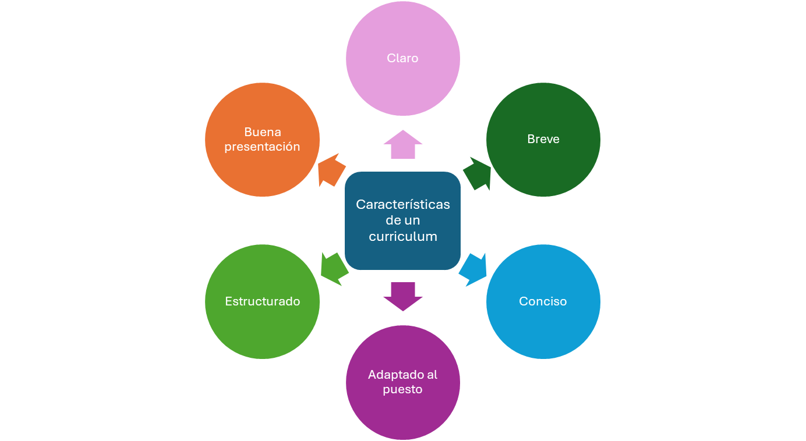{.img-preview}

Además, es importante tener en cuenta los siguientes aspectos:

1. 🗣️ Cada persona tiene un estilo propio de comunicación, por lo que, aunque existan modelos preestablecidos de CV y carta de presentación, cada candidato debe utilizar el formato que mejor se adapte a su situación y a sus puntos fuertes.

2. 🔄 El currículum evoluciona a medida que lo hace la vida laboral. Por ello, es necesario **actualizarlo periódicamente**.

3. 🧱 Elaborar un buen currículum requiere dedicación. Una forma de facilitar el proceso es partir de un **modelo general** previamente elaborado y adaptarlo después al puesto concreto al que se desea optar.

---

#### 4.3.3. Necesidad de adaptar el curriculum

El currículum crece con nuevos conocimientos y experiencias, pero para despertar el interés y conseguir una entrevista es imprescindible **adaptarlo a cada caso concreto**. No existe un único currículum válido para todo; debe ajustarse según la oferta o situación.

- 📨 **En respuesta a un anuncio**
  - 🔍 Analizar detenidamente el anuncio publicado en el medio correspondiente.  
  - 🎯 Reflexionar sobre las características del puesto, los requisitos solicitados y las competencias exigidas.  
  - 📄 Ajustar la información del currículum a las exigencias concretas del puesto ofertado.

- 👔 **Autocandidatura**
  - 🧭 El currículum debe orientarse a las necesidades principales del tipo de empleo que se solicita, aunque no exista una oferta publicada.  
  - 🧩 Es importante seleccionar y destacar la información que pueda tener más relación con los intereses de la empresa.  
  - 📌 Ajustar la información del currículum para mostrar afinidad con posibles necesidades futuras de la organización.

---

#### 4.3.4. Estructura del CV

1. 🧍 **Datos personales**  
   Deben aparecer claramente los datos de contacto (teléfono y correo electrónico), así como la identidad de la persona: nombre, apellidos, domicilio y fecha de nacimiento.

2. 💼 **Experiencia profesional**  
   Experiencia laboral relacionada con los estudios realizados o con el puesto ofertado. Se deben indicar las empresas, fechas, funciones, tareas y responsabilidades.

3. 🎓 **Formación reglada**  
   Estudios realizados, indicando la fecha de obtención del título y la institución que lo imparte. Debe incluirse el título o certificación obtenida.

4. 📚 **Formación complementaria**  
   Cursos, seminarios y congresos. Es importante señalar la fecha de finalización, duración y centro de estudios.

5. 🌍 **Idiomas**  
   Destacar los idiomas, nivel y titulaciones. Conviene indicar la fecha de obtención o de actualización del estudio.

6. 💻 **Informática**  
   Sistemas operativos, programas específicos, diseño, internet y redes sociales.

7. 📌 **Otros datos de interés**  
   Permiso de conducir, vehículo propio, movilidad geográfica o funcional, disponibilidad, etc.

---

#### 4.3.5. Tipos de curriculum

Podemos distinguir básicamente dos tipos de currículum: el **cronológico** y el **funcional**.  
El primero permite ver con claridad la evolución profesional del candidato y, en el segundo, se destacan las actividades por áreas profesionales.

- 🗂️ **Cronológico**  
  Es el más común. Puede ser:

  - **Directo:** se empieza por los datos más antiguos y se termina por los más recientes, siguiendo una cronología natural.  
  - **Inverso:** se inicia por la experiencia más reciente y se retrocede hacia el inicio. Este modelo permite destacar la última ocupación, lo cual es útil si coincide con el puesto al que se aspira.

  **Ventajas:**  
  Este tipo de organización permite ver la evolución profesional y aporta claridad y orden.

- 📚 **Temático o funcional**  
  Agrupa las actividades o funciones en bloques independientes a los que se puede poner título.

  **Ventajas:**  
  Agrupa tareas y actividades por áreas profesionales, oculta lagunas laborales y es muy útil si se tiene mucha experiencia profesional y poca formación académica.  
  En estos casos, suele colocarse primero la experiencia profesional y después la formación.

---

🟨**Tabla comparativa**

|                   | 🗂️ CRONOLÓGICO                                                | 📚 FUNCIONAL                                                  |
| ----------------- | ------------------------------------------------------------ | ------------------------------------------------------------ |
| **Información**   | Por fechas, de lo más reciente a lo más antiguo. Claro y preciso. | Por funciones desarrolladas según su importancia.            |
| **Ventajas**      | - Resalta logros y responsabilidades.  - Bien valorado por seleccionadores. | - Selecciona puntos positivos.  - Omite lagunas y cambios.  - Útil para trabajos acordes con el puesto. |
| **Cuándo usarlo** | - Funciones similares, pocos trabajos.  - Empresas de prestigio.  - Última experiencia relacionada con el puesto. | - Mucha experiencia.  - Puestos de poca relevancia.  - Cambios frecuentes de trabajo.  - Responde a necesidades del empresario. |

---

🟨 **Ejemplo modelo básico de CV**

    

---

🟨 **¿Qué buscan los expertos en un currículum?**

1. 👀 Que de un solo vistazo se vea lo importante. Debe ser fácil de leer y visualmente atractivo.  
2. 📈 Percibir vida e interés por el desarrollo personal y profesional. Que refleje interés por la empresa en concreto.  
3. 🧩 Originalidad en el planteamiento. Diferenciarse de los demás.  
4. ✔️ Honestidad en la información. Exactitud en fechas y datos.  
5. ⚖️ No restar importancia a los logros: evitar tanto la falsa humildad como el exceso de pedantería.  
6. 🎯 Adaptar el CV a cada puesto al que se presente el candidato, alineando la experiencia con las necesidades de la empresa.  
7. 🔎 Que proporcione claves que sirvan de guía al entrevistador.

---

> [!tip]
>
> En el siguiente vídeo se explica cómo estructurar un currículum y qué aspectos valoran más las empresas:
>
> 

>   <iframe 
>     src="https://www.youtube.com/embed/aIYC8TMIUmo"
>     title="Como hacer un buen curriculum"
>     style="position: absolute; top: 0; left: 0; width: 100%; height: 100%;"
>     frameborder="0"
>     allow="accelerometer; autoplay; encrypted-media; gyroscope; picture-in-picture; web-share"
>     referrerpolicy="strict-origin-when-cross-origin"
>     allowfullscreen>
>   </iframe>
> 

---

#### 4.3.6. Modelos de curriculum especiales

> [!note] Definición
>
> 📢Son *curriculums* centrados en proporcionar mayor información sobre un aspecto concreto porque así lo solicita la organización a la que se envían.

En algunos casos, la organización pide que el currículum ponga el énfasis en un aspecto determinado. Es lo que ocurre, por ejemplo, con los modelos que solicitan las universidades y centros de formación para acceder a becas, puestos de investigación o plazas de profesorado, donde el foco se sitúa en la **formación académica**.

También existen modelos de currículum que se apartan de los formatos habituales para resaltar habilidades o recursos muy específicos:

- 🧾 **Currículum tipo carta personal**  
  Se presenta a modo de carta en la que se transmite un mensaje muy claro sobre lo que la persona candidata puede aportar a la empresa, en términos muy concretos.

- 🎨 **Currículum creativo**  
  Es un tipo de currículum que se aleja de los modelos tradicionales y donde la **creatividad** es especialmente relevante. Resulta adecuado para escritores, artistas, personas de relaciones públicas o del ámbito de la comunicación.

  > [!tip] Ejemplo
  >
  >  Aquí puedes encontrar un ejemplo de curriculum creativo de un desarrollador de videojuegos. 
  > https://retrojourney.dev/
  
- 🌐 **Currículum online y plantillas**  
  En la actualidad, también podemos enviar nuestros datos profesionales y académicos a través de internet.  
  En muchos casos, se utilizan las bases de datos de los portales de empleo, de forma que la persona que busca trabajo puede recibir en su correo electrónico ofertas relacionadas con su perfil. En otros casos, se usan las direcciones de correo que las empresas proporcionan en sus páginas corporativas.

  > [!tip] Ejemplo
  > Plantillas gratuitas de currículum: https://www.cvmaker.es/plantillas-de-curriculum

- 💻 **Currículum alojado en la web**  
  Actualmente los usuarios pueden alojar su currículum en un sitio web, de manera que los datos estén siempre disponibles para las empresas ofertantes de empleo y se puedan modificar o enviar desde cualquier lugar.

  > [!tip] Ejemplo
  >
  > Currículums online:  https://www.visualcv.com/examples/

---

En internet nos vamos a encontrar distintos tipos de recursos relacionados con el currículum y la búsqueda de empleo:

- 🌍 **Portales generalistas**  
  Páginas web especializadas en el mercado laboral en general, sin distinción de sectores. Funcionan como intermediarios entre las personas que buscan empleo y las empresas que necesitan personal.

  > [!tip] Ejemplo
  >
  > Algunos portales generalistas de empleo son **InfoJobs**, **Indeed** y **Empléate**:
  > - https://www.infojobs.net/  
  > - https://es.indeed.com/  
  > - https://www.empleate.gob.es
  
- 🎯 **Portales especializados**  
  Son páginas web centradas en un sector de actividad concreto, dirigidas a un perfil profesional o colectivo determinado.  
  
  > [!tip] Ejemplo
  >
  > A continuación se muestran algunos portales de empleo especializados en sectores o colectivos concretos:
  >
  > - Tecnoempleo (sector IT): https://www.tecnoempleo.com/  
  > - Domestika (diseño, creatividad y comunicación): https://www.domestika.org/es/jobs  
  > - Turijobs (sector turismo y hostelería): https://www.turijobs.com/  
  > - Farmacias (sector farmacéutico y sanitario): https://www.farmaempleo.es/  
  > - Infojobs Freelance (trabajo autónomo y proyectos): https://freelance.infojobs.net/  
  > - Jooble Educación (empleo en enseñanza y docencia): https://es.jooble.org/trabajo-docente  
  
- 🔗 **Redes sociales**  
  Constituyen una forma de comunicación y de intercambio entre personas que se organizan para potenciar sus recursos. Su utilidad depende de que el usuario mantenga su perfil actualizado y activo.  
  
  > [!tip] Ejemplo
  >
  > La red social profesional más utilizada en el ámbito laboral es **LinkedIn**: https://www.linkedin.es/
  
- ✍️ **Blogs**  
  La edición de un blog es una forma de ser proactivo en la búsqueda de empleo. Permite expresar opiniones, compartir conocimientos y construir una imagen profesional diferenciada que puede marcar la diferencia en un proceso de selección.

- 🎥 **Videocurrículum**  
  Es una presentación en vídeo en la que la persona describe sus aptitudes, habilidades, logros y objetivos, con la finalidad de mejorar sus posibilidades de contratación.

---

#### 4.3.7. Modelo de currículo Europeo o modelo de Curriculum Europass

> [!note] Definición
>
> 📢Se trata de un modelo común de currículum para presentar, de manera sistemática, cronológica y flexible, las capacidades, titulaciones, formación y experiencia laboral en toda la Unión Europea. Su objetivo principal es **facilitar la movilidad profesional** dentro de Europa.

La diferencia fundamental respecto a modelos tradicionales es la **importancia que concede a las competencias profesionales**, como la comunicación, la gestión de recursos, el liderazgo o la capacidad para trabajar en equipo.

Este modelo no permite modificar el diseño gráfico ni el tipo de letra.  
La fotografía es opcional, salvo que la empresa la exija expresamente.

**¿Cómo se completa?**

1. 🧑‍💼 Respecto a los datos personales, se indica primero el apellido y después el nombre. Debe aparecer la dirección completa, incluyendo el código del país si se solicita empleo en el extranjero. Ejemplo: **E-12345 Madrid**.

2. 📞 Los números de teléfono deben incluir el prefijo del país con el signo “+”, sin espacio detrás. Después del prefijo se deja un espacio y se escribe el número completo sin separaciones. Ejemplo: **+34 612345678**.

3. 🎯 En “empleo deseado/campo profesional” se expone el **perfil laboral**, destacando las principales competencias.

4. 💼 En la experiencia laboral se describe cada empleo relevante por separado, comenzando por el más reciente.

5. 🎓 En la educación o formación recibida también se comienza por el aprendizaje más reciente.

6. 🧠 En “aptitudes personales” se describen las habilidades adquiridas a lo largo de la trayectoria formativa y laboral, incluso si no están acreditadas con diplomas. Para indicar el nivel de idioma se puede usar la autoevaluación europea disponible en la plataforma Europass.

7. 🤝 Las aptitudes sociales se refieren a aquellas que permiten trabajar y convivir con otras personas, especialmente en situaciones que requieren comunicación, trabajo en equipo o entornos multiculturales. Ejemplos: **capacidad para el trabajo en equipo**, **dotes de comunicación**.

8. 📋 Las aptitudes organizativas son las relacionadas con coordinar personas, proyectos o recursos, tanto en el trabajo como en voluntariados o actividades culturales o deportivas. Ejemplos: **dotes de liderazgo**, **experiencia en gestión de grupos**.

9. 🛠️ Las aptitudes técnicas son aquellas (no informáticas) que permiten manejar equipos, instalaciones o maquinaria específica, o conocimientos técnicos aplicados a un campo concreto. Ejemplo: **control de calidad**.

10. 🗑️ Finalmente, cualquier apartado que no se utilice debe eliminarse del CV.

> [!tip] Ejemplo
>
> 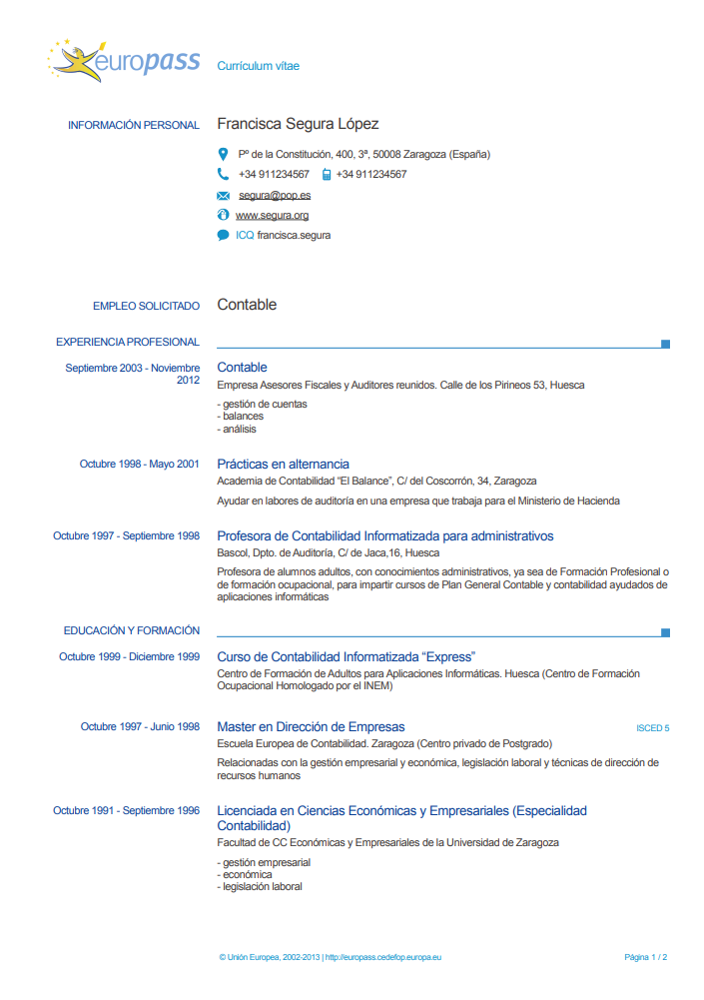{.img-preview}
>
> 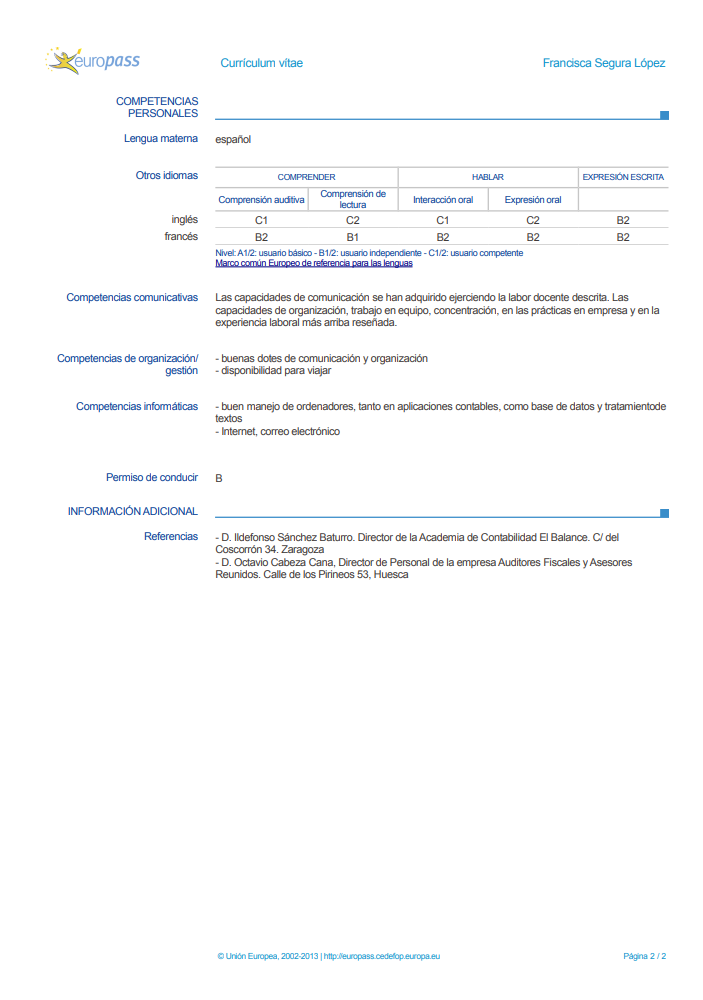{.img-preview}

---

#### 4.4. Agenda de búsqueda de empleo

> [!note] Definición
>
> 📢La **agenda de búsqueda de empleo** es una herramienta donde se registran, de manera sistemática, todas las actividades realizadas durante el proceso de búsqueda: empresas contactadas, currículums enviados, fuentes de información consultadas, acciones de autocandidatura, etc.

Su utilidad principal es llevar un control claro y ordenado del proceso, evitando duplicidades u olvidos y permitiendo evaluar si el método de búsqueda está funcionando.

📅 **Objetivos de la agenda**
- Organizar el tiempo de búsqueda siguiendo una metodología establecida.  
- Planificar y programar las actividades para evitar omisiones.  
- Realizar un seguimiento de resultados para comprobar si el método está siendo eficaz.  
- Crear un archivo con las cartas enviadas y los datos completos de las empresas contactadas.

> [!tip] Ejemplo
>
> **Registro semanal**
>
> |                           | Lunes | Martes | Miércoles | Jueves | Viernes |
> | ------------------------- | ----- | ------ | --------- | ------ | ------- |
> | **Fecha**                 |       |        |           |        |         |
> | **Empresa**               |       |        |           |        |         |
> | **Fuente de información** |       |        |           |        |         |
> | **Vía de contacto**       |       |        |           |        |         |
> | **Puesto de trabajo**     |       |        |           |        |         |
> | **Resultado**             |       |        |           |        |         |

---

## 5. Canales de acceso a la información

> [!caution]
>
> Algunos de los enlaces y portales mencionados en este epígrafe pueden estar desactualizados o haber cambiado de nombre con el paso del tiempo. Conviene verificar siempre su disponibilidad y buscar alternativas actuales en caso necesario.

### 5.1. Introducción

El tratamiento de la información, su actualización y selección, son tareas fundamentales en la búsqueda de empleo. Las/os Técnicos en Orientación Laboral deben conocer bien las fuentes y facilitar datos y estrategias de manejo de la información eficaces. En este sentido, cobra cada vez más relevancia el uso de internet y de las nuevas tecnologías.

**Canales de acceso a la información**

- 🌐 El uso de internet se ha convertido en un recurso esencial para identificar ofertas, contactar con empresas, consultar portales de empleo, recibir alertas, acceder a servicios públicos y utilizar herramientas de autocandidatura.
- 📱 Las nuevas tecnologías permiten un acceso más rápido, variado y actualizado a la información laboral.
- 🗂️ El profesional de la orientación debe dominar estas fuentes para ofrecer una búsqueda estructurada y eficaz.

Veamos un interesantísimo vídeo que nos dice **donde tenemos que estar** cuando buscamos empleo:

<iframe src="https://secure-embed.rtve.es/drmn/embed/video/2466913" name="La entrevista de trabajo en grupo" style="width:100%;height:90%;position:absolute;left:0;top:0;overflow:hidden;border:none;background-color:transparent;" scrolling="no" allowfullscreen="allowfullscreen"></iframe>
<a style="color:#333;font-weight:bold;" title="La entrevista de trabajo en grupo" href="https://www.rtve.es/play/videos/aqui-hay-trabajo/entrevista-trabajo-grupo/2466913/"><strong>La entrevista de trabajo en grupo</strong></a>

---

### 5.2. La Web: portales

> [!note] Definición
>
> 📢Los portales son sitios web dedicados a servir de intermediarios entre las personas que buscan un trabajo y las empresas en proceso de selección. 

Reúnen vacantes de distintas empresas e instituciones y requieren que las personas en búsqueda de empleo se inscriban para acceder a todos los servicios o a la información completa de las ofertas.

Algunos ejemplos de portales son **Infojobs**, **Monster**, **Laboris**, **Infoempleo**, etc.

🟥 **Ventajas de los servicios a través de un portal de empleo**

- 🌐 Amplia oferta de trabajo.  
- 🔍 Facilidad de búsqueda mediante buscadores por categorías.  
- ⚡ Agiliza la comunicación entre empresas y demandantes.  
- 📤 Envío del currículum a través del canal indicado en el portal.  
- 🔔 Seguimiento de ofertas y recepción de notificaciones por correo o móvil.  

En un portal de empleo se puede encontrar información relativa a:

1. Ofertas de empleo más recientes y un buscador general.  
2. Inscripción y envío de candidaturas directamente.  
3. Registro del CV en formato electrónico.  
4. Suscripción a boletines para recibir ofertas por e-mail o SMS.  
5. Información laboral para personas trabajadoras y para creación de empresas.  

---

🟥 **Tipos de portales**

- 🌐 **Portales generalistas**  
  Son portales de empleo genéricos que abarcan todo el mercado laboral.

  > [!tip] Ejemplos  
  > Infoempleo.com  
  > Laboris.net  
  > Monster.com  
  > Infojobs.net  

- 🧭 **Portales especializados**  
  Centran su actividad en uno o varios sectores profesionales.

  > [!tip] Ejemplos  
  > Primerempleo.com  
  > Tecnoempleo.com  
  > Educajob.com  
  > Secretarias.com  
  > Turijobs.com  

- 🏢 **Páginas de empresas**  
  Las webs corporativas aportan información sobre ofertas de empleo y vías de contacto.

  > [!tip] Ejemplos  
  > Randstad.es  
  > Addeco.es  
  > Servicio Público de Empleo (sepe.es)  
  > Ayuntamientos  
  > Camarasdecomercio.es  
  > Telefonica.net  

---

### 5.3. Redes de contactos

Dado que muchas ofertas no llegan a ser publicadas, resulta de gran utilidad activar nuestra red de conocidos para informarles de que nos encontramos buscando trabajo activamente y de qué es lo que buscamos. Con las personas que vemos a diario cara a cara, conviene especificar brevemente nuestra trayectoria formativa y experiencia, así como el puesto o puestos que nos interesan.

En Internet nos movemos dentro de lo que se denomina **“Redes Sociales y de Networking”**.

**Tipos de redes**

- 🌐 **Redes sociales generalistas**  
  Las redes sociales generalistas tienen un origen principalmente lúdico. Son un lugar de encuentro para amigos, conocer gente nueva y mantener contactos.

- 💼 **Redes profesionales**  
  Surgen con la necesidad de gestionar la confianza y las referencias personales a la hora de buscar empleo. Los perfiles profesionales de estas plataformas mantienen similitudes con un CV y, en la actualidad, se han convertido en un escaparate internacional que facilita el trabajo de las consultoras de RRHH.
  
  > [!tip] Principales redes de networking  
  > LinkedIn  
  > XING  
  > Viadeo

---

### 5.4. Otros

- 💼 **Las web corporativas**  
  Desde sus páginas han evolucionado hasta incorporar aplicaciones que permiten canalizar todas sus ofertas de empleo y los currículos que reciben. Esto facilita la clasificación de perfiles, el archivo y la notificación a los candidatos. Además, permite a la empresa presentar sus valores y atraer a profesionales afines.

- 🧩 **Las empresas de selección**  
  Realizan la selección de personal para otras empresas, proponiendo varios candidatos por proceso, pero sin contratar directamente. Están especializadas en describir el perfil profesional de las ofertas e identificar al candidato idóneo. Suelen seleccionar perfiles medios y altos. Sus webs han evolucionado de un formato más orientado a imagen corporativa a uno más operativo, aunque no siempre publican todas sus ofertas.

- 🏫 **Bolsas de trabajo de centros de formación**  
  Institutos, universidades (a través de los COIEs), colegios profesionales, asociaciones y centros de formación profesional suelen contar con bolsas de empleo. Intermedian entre las ofertas de empresas colaboradoras y el alumnado formado en esa institución.

- 🌍 **Red EURES**  
  Portal con información sobre condiciones de vida y trabajo en países de la Unión Europea, además de ofertar vacantes. Organiza sesiones informativas con consejeros de distintos países.  
  El portal ofrece:  
  - Información sobre ofertas de empleo en el Espacio Económico Europeo y Suiza.  
  - Tendencias del mercado laboral en todos los países y regiones.  
  - Base de datos en línea con currículos de solicitantes.  

  Cualquier usuario puede buscar empleo sin registrarse en “Mi EURES”, pero registrarse ofrece más servicios:  
  - Introducir el CV y ser contactado por empresas.  
  - Crear el CV en una lengua comunitaria, con opción de traducción.  
  - Definir el perfil y recibir avisos por correo electrónico con nuevas ofertas adecuadas.

- 🎒 **PLOTEUS**  
  Es el portal europeo de oportunidades de aprendizaje. Su objetivo es ayudar a estudiantes, personas buscadoras de empleo, trabajadores, familias y orientadores a encontrar información sobre cómo estudiar en Europa.  
  En **ec.europa.eu/ploteus** se puede encontrar información sobre:  
  
  - Oportunidades de aprendizaje y posibilidades de formación.  
  - Sistemas de educación y formación.  
  - Programas de intercambio y becas.  
  - Información para vivir en el extranjero.

---

## 6. Procesos de selección

### 6.1. Fases del proceso de selección

> [!note] Definición
>
> 📢El **proceso de selección** es el que siguen las empresas para contar con los trabajadores más adecuados a los puestos que necesitan cubrir. 

Comienza cuando la empresa detecta una vacante y analiza las características del puesto, definiendo el perfil personal y profesional requerido. A partir de ahí se determinan las pruebas necesarias: entrevistas, exámenes, pruebas psicotécnicas, etc.

**Fases del proceso de selección**

1. 📝 **Detección de la necesidad de contratación**  
    Origen: sustitución de un trabajador, expansión o acumulación de trabajo.  
    Se define el perfil profesional y personal del candidato.

2. 🔍 **Reclutamiento de candidatos**  
    La empresa puede optar por cubrir el puesto con personal interno o externo.

3. 📄 **Preselección de candidatos**  
    Revisión y preselección de currículos que pasarán a la siguiente fase.

4. 👥 **Entrevista de selección**  
    La empresa puede añadir pruebas adicionales, como pruebas psicotécnicas.

5. 🤝 **Contratación e incorporación**  
    Incorporación del candidato seleccionado al puesto de trabajo.

---

### 6.2. Entrevistas

#### 6.2.1. Definición

> [!note] Definición
>
> 📢La **entrevista de trabajo** es un diálogo entre dos personas (entrevistador y entrevistado) en el que la comunicación verbal y no verbal (gestos, posturas, tono, etc.) forman parte del intercambio de información.

El entrevistador se plantea dos preguntas fundamentales:

1. ¿Puede el candidato desempeñar el puesto?  
2. ¿Cómo se compara con respecto a otras personas que han solicitado el puesto?

> [!tip] 
>
> En el siguiente vídeo de *Hablemos en Positivo* se explica cómo hacer una buena entrevista de trabajo:

  <iframe 
    src="https://www.youtube.com/embed/vI-bIwN3AY0"
    title="Cómo hacer una buena entrevista de trabajo"
    style="position: absolute; top: 0; left: 0; width: 100%; height: 100%;"
    frameborder="0"
    allow="accelerometer; autoplay; encrypted-media; gyroscope; picture-in-picture; web-share"
    referrerpolicy="strict-origin-when-cross-origin"
    allowfullscreen>
  </iframe>

---

#### 6.2.2. Tipos de entrevistas

🟪 **Tipos de entrevista**

- 🎯 **Individual**
- 👥 **Grupal**
- 📋 **Directa o dirigida**
- 🗣️ **Abierta no dirigida**

Actualmente, las empresas realizan la **entrevista por competencias**.  
Las competencias se definen como el conjunto de comportamientos observables relacionados con un desempeño excelente en el trabajo.

La entrevista por competencias se centra en obtener **ejemplos conductuales** de la vida laboral o personal.  
Para ello, el entrevistador formula preguntas sobre hechos concretos (por ejemplo: *“cuéntame una situación en la que hayas tenido que tratar con un cliente difícil”*).

> [!note]
>
> Cuando se pretende recoger información objetiva, la entrevista tenderá a ser cerrada (dirigida).  
> Si se pretende conocer el carácter y la personalidad, se usará más la entrevista abierta.

---

- 🌀 **La entrevista mixta**  
  Combinación entre entrevista dirigida y entrevista abierta.  
  El entrevistador puede comenzar con un guion y continuar con preguntas generales, dejando que la persona candidata amplíe libremente.

- ⚡ **La entrevista de tensión**  
  No es muy frecuente. Su objetivo es evaluar la reacción del candidato ante situaciones de presión, estrés o tensión (críticas, interrupciones o actitud hostil), especialmente cuando el puesto exige alta resistencia al estrés.

- 🔄 **Las dinámicas de grupo**  
  Se reúne a varios candidatos (entre 6 y 15) para que resuelvan una situación y alcancen un objetivo común dentro de un tiempo límite.  
  No se dan normas, por lo que el grupo debe autorregularse.  
  Los seleccionadores observan comportamientos como:

  - Capacidad de comunicación  
  - Trabajo en equipo  
  - Resolución de problemas  
  - Capacidad de persuasión  
  - Iniciativa  
  - Control emocional  
  - Actitudes  
  - Habilidades sociales  

🟪 **Tipos de dinámicas**

- Ejercicios de presentación (presentar el currículo mediante un juego)  
- Debate  
- Juegos de cooperación: resolución de una situación  

---

#### 6.2.3. Fases de la entrevista

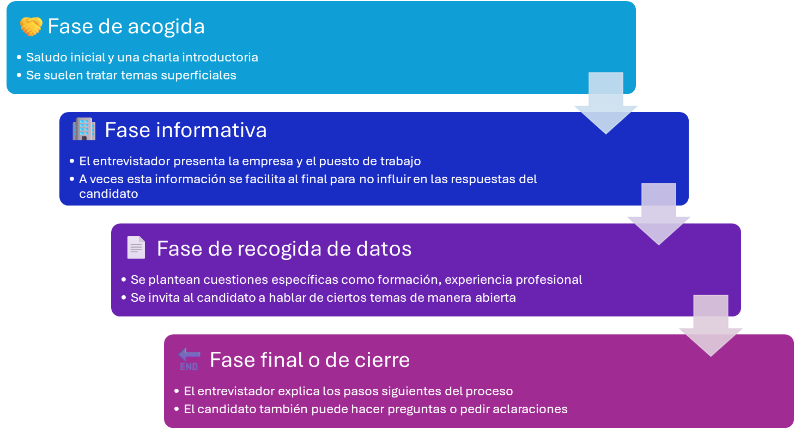

1. 🤝 **Fase de acogida**  
   Consiste en un saludo cordial y una charla introductoria en la que se suelen tratar temas superficiales.

2. 🏢 **Fase informativa**  
   El entrevistador presenta la empresa y el puesto de trabajo, aunque en algunos casos esta información se facilita al final para no influir en las respuestas del candidato.

3. 📄 **Fase de recogida de datos**  
   Se plantean cuestiones específicas como formación, experiencia profesional o se invita al candidato a hablar de ciertos temas de manera abierta.

4. 🔚 **Fase final o de cierre**  
   El entrevistador explica los pasos siguientes del proceso: pruebas adicionales, otra entrevista, plazos de decisión, etc.  
   El candidato también puede hacer preguntas o pedir aclaraciones.

---

#### 6.2.4. Enfrentarse con éxito a una entrevista de trabajo

1. 🎯 **Demostrar interés por el puesto**  
   El/la candidato/a debe conocer los motivos por los que está interesado en el puesto y así podrá demostrar sus habilidades o conocimientos profesionales y lo que puede aportar a la empresa.

2. 🏢 **Conocer la empresa a la que se dirige**  
   Demostrar este conocimiento al entrevistador genera una buena impresión.

3. ❓ **Estar preparado para las preguntas**  
   Debe saber defenderse poniendo en valor su interés y sus opciones.

4. 🌟 **Demostración de cualidades personales**  
   Algunas de ellas son: energía, motivación, seguridad en uno mismo, responsabilidad, organización, etc.

5. 🔚 **Finalizar la entrevista**  
   El candidato puede preguntar si debe ampliar algún punto tratado, si habrá otra entrevista o cómo será informado sobre los resultados.

> [!tip]
> En este vídeo se ofrecen consejos prácticos para preparar la entrevista de trabajo:
>
> 

> <iframe 
>  src="https://www.youtube.com/embed/vmJvWtyeQG0"
>  title="Consejos para preparar una entrevista de trabajo"
>  style="position: absolute; top: 0; left: 0; width: 100%; height: 100%;"
>  frameborder="0"
>  allow="accelerometer; autoplay; encrypted-media; gyroscope; picture-in-picture; web-share"
>  referrerpolicy="strict-origin-when-cross-origin"
>  allowfullscreen>
> </iframe>
> 

---

### 6.3. Pruebas profesionales

Otros tipos de ejercicios que pueden plantearse son las llamadas **pruebas profesionales, psicotécnicas o de personalidad**.

Estas pruebas están relacionadas con los requisitos del puesto de trabajo. Evalúan factores psicológicos (inteligencia, aptitudes, capacidades, personalidad, valores personales, etc.) y competencias profesionales.

- 🧪 **Pruebas profesionales**  
  Valoran los conocimientos específicos de una profesión.  
  
  > [!tip] Ejemplo
  >
  > Pruebas de Word y Excel, cuestionarios, idiomas, programas informáticos, etc.  
  > Se utilizan para discriminar entre candidatos con experiencia o para medir conocimientos imprescindibles para el puesto.
  
- 🧠 **Pruebas psicotécnicas**  
  Evalúan aptitudes, intereses o valores del candidato.  
  Pueden medir razonamiento espacial, razonamiento numérico, memoria, resolución de problemas, inteligencia, etc.  
  Son útiles cuando participan muchos aspirantes, ya que permiten evaluar a varias personas en poco tiempo.

---

🟧 **Dentro de las pruebas psicotécnicas encontramos:**

- 🎯 **Test de intereses y motivación**  
  Buscan conocer preferencias y aptitudes generales del candidato.

- 🌟 **Test de personalidad**  
  Evalúan rasgos como autocontrol, liderazgo, responsabilidad, introversión/extroversión, etc.  
  Útiles para perfiles donde la personalidad es clave (policía, guardia civil…).

> [!important]
>
> - 🛠️ Las pruebas profesionales evalúan conocimientos y aptitudes directamente relacionados con el puesto.  
> - ✔️ Suelen calificarse como *apto* o *no apto*.

---

🟧 **Existe una gran diversidad de pruebas profesionales, como:**

1. 🌍 Pruebas de idiomas.  
2. 💻 Pruebas de programas informáticos (procesadores de texto, diseño gráfico…).  
3. 🔧 Reparación de componentes eléctricos.  
4. 🧩 Ensamblaje de piezas.  
5. 📝 Exámenes orales o escritos de conocimientos relacionados con el empleo.  
6. 📊 Ejercicios de contabilidad.

> [!note] Diferencias con los test de aptitudes  
>
> - 🔮 **Test de aptitudes**: miden la capacidad futura de desempeño.  
> - 🎓 **Pruebas profesionales**: predicen el desempeño inmediato basado en conocimientos y habilidades demostradas.

---

🟧 **Recomendaciones para enfrentarse a las pruebas**

- 📌 Asegúrate de entender correctamente las instrucciones. Si dudas, pregunta.  
- ⏱️ Organiza el tiempo según el plazo asignado.  
- 🧠 Cuida toda la ejecución: también se evalúa el proceso, no solo el resultado.

---

🟧 **Más información**

> [!tip] Recursos  
>
> - 🧪 Ejemplos de test psicotécnicos: https://www.psicoactiva.com/tests  
> - 📚 Resumen de pruebas de selección: https://www.educaweb.com

---

---

# Ejercicios

## Ejercicio 8: V ó F

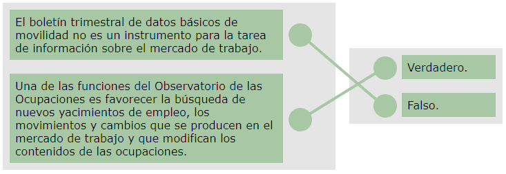

---
## Ejercicio 9: Pinta y colorea

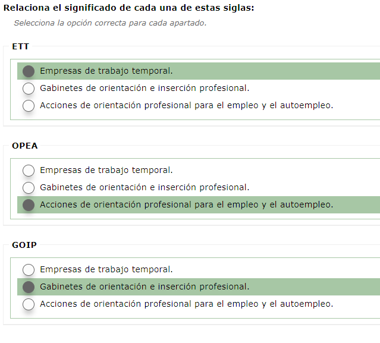

---
## Ejercicio 10: Relaciona tipos de curriculums y cartas

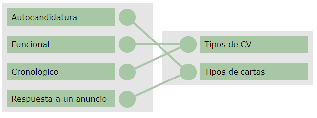

---
## Ejercicio 11: Selecciona las correctas (estrategias y búsqueda de empleo)

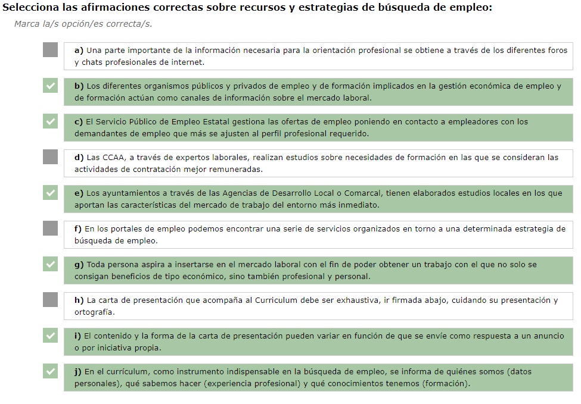

---
## Ejercicio 12: Las entrevistas se pueden clasificar en:

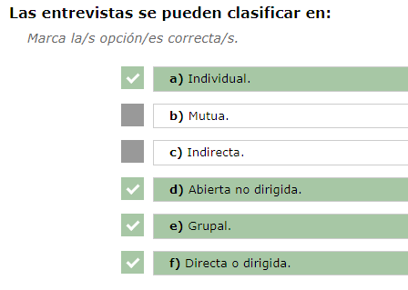

---
## Ejercicio 13: Selecciona afirmaciones correctas (proceso de selección)

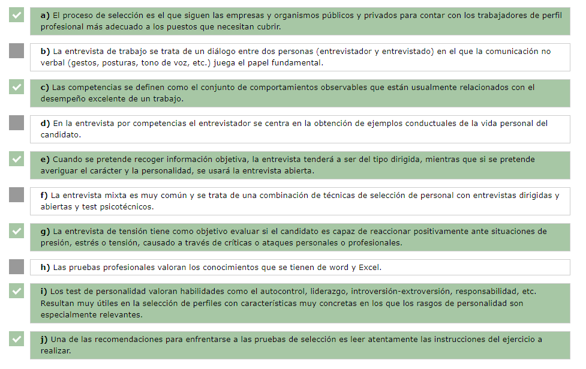

| Opción | V/F         | Justificación                                                |
| ------ | ----------- | ------------------------------------------------------------ |
| a      | ✔️ Verdadera | El proceso de selección busca cubrir un puesto con el perfil profesional más adecuado. |
| b      | ❌ Falsa     | La comunicación no verbal es importante, pero no es “el elemento fundamental” ni excluye la verbal. |
| c      | ✔️ Verdadera | El temario define las competencias como comportamientos observables vinculados al desempeño excelente. |
| d      | ❌ Falsa     | La entrevista por competencias recoge ejemplos tanto laborales como formativos o personales, no solo personales. |
| e      | ✔️ Verdadera | El temario indica que la entrevista dirigida se usa para obtener información objetiva y la abierta para conocer la personalidad. |
| f      | ❌ Falsa     | La entrevista mixta combina entrevista dirigida y abierta, no incluye test psicotécnicos. |
| g      | ✔️ Verdadera | La entrevista de tensión evalúa la reacción ante presión, críticas o estrés. |
| h      | ❌ Falsa     | Las pruebas profesionales no “valoran Word y Excel” como única cosa; valoran conocimientos específicos del puesto (idiomas, programas, tareas técnicas, etc.). |
| i      | ✔️ Verdadera | Los test de personalidad evalúan rasgos como autocontrol, liderazgo o responsabilidad, útil en puestos donde la personalidad es clave. |
| j      | ✔️ Verdadera | Una de las recomendaciones es entender bien las instrucciones antes de comenzar la prueba. |

---
## Ejercicio 14: Relaciona cada tipo prueba con su explicación

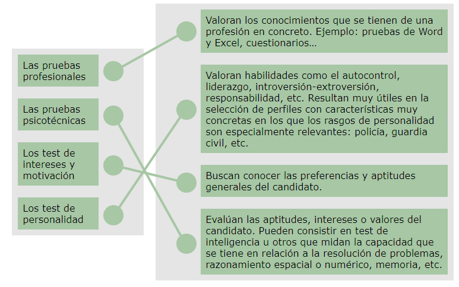

---
## Ejercicio Ponte a prueba

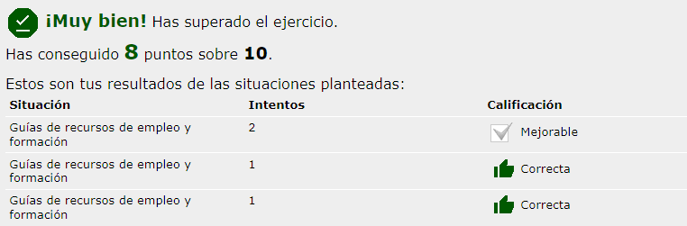

### Caso 1 – Guías de recursos de empleo y formación

Carlos quiere que su alumnado realice una Guía de Recursos de Empleo y Formación. ¿Cómo debe enfocarlo?

1️⃣ **OPCIÓN 1 – Correcta**  
Carlos pide que elaboren una guía enfocada en **recursos para trabajar como docentes**, porque el objetivo del módulo es insertarse laboralmente en la **docencia**. Cada persona puede adaptarla a su área profesional.

2️⃣ **OPCIÓN 2 – Incorrecta**  
Enfocar la guía a la profesión de origen (cocina, enfermería…) desvía el propósito. El objetivo es buscar empleo **como docente**, no en el sector previo.

3️⃣ **OPCIÓN 3 – Incorrecta**  
Dejar elegir libremente rompe la coherencia formativa. La guía debe centrarse en **recursos del ámbito docente**.

---

### Caso 2 – Nivel de concreción en la guía

El alumnado está siendo muy generalista y no concreta empresas ni entidades. ¿Qué debe hacer Carlos?

1️⃣ **OPCIÓN 1 – Incorrecta**  
Aceptar que la guía sea generalista no cumple la finalidad. Una guía debe incluir **recursos reales y concretos**, no solo descripciones teóricas.

2️⃣ **OPCIÓN 2 – Correcta**  
Carlos debe orientarles a concretar **empresas, centros y entidades específicas**, además de acciones formativas o eventos reales. La guía debe ser **práctica y aplicable**.

3️⃣ **OPCIÓN 3 – Incorrecta**  
Dar una guía ya hecha impide que aprendan a **investigar y elaborar sus propios recursos**.

---

### Caso 3 – Cómo fomentar que consulten la guía

Una vez recopilada la información, ¿qué puede hacer Carlos para que las guías sean consultadas?

1️⃣ **OPCIÓN 1 – Incorrecta**  
Dejarla como está no resuelve nada. La guía debe facilitar la consulta y ser **fácil de usar**.

2️⃣ **OPCIÓN 2 – Correcta**  
Mejorar la guía con **esquemas, cuadros y estructura visual clara** facilita su consulta. La funcionalidad aumenta su utilidad real.

3️⃣ **OPCIÓN 3 – Incorrecta**  
Hacerla más llamativa no necesariamente mejora su uso. La estética no sustituye a la **claridad y practicidad**.

---
