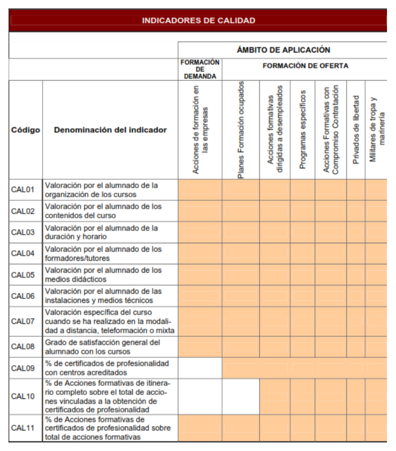
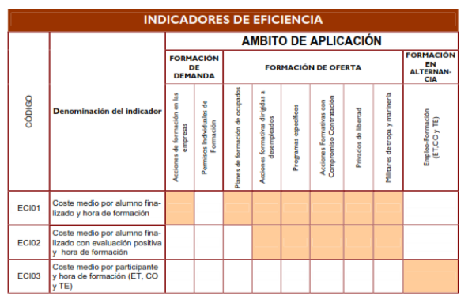
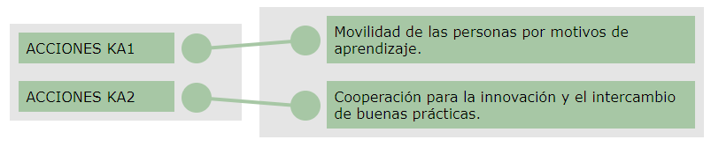

[TOC]

# MF1446 - Orientación laboral y promoción de la calidad en la formación profesional para el empleo

# Unidad 03 - Calidad de las acciones formativas. Innovación y actualización docente

---

## Introducción y objetivos

El **Real Decreto 1722/2007, de 21 de diciembre**, define el **Sistema Nacional de Empleo** como el conjunto de estructuras, medidas y acciones necesarias para promover y desarrollar la política de empleo. Está integrado por el **Servicio Público de Empleo Estatal** y los **Servicios Públicos de Empleo de las Comunidades Autónomas**.

Según lo establecido en este Real Decreto, y con el fin de garantizar el mejor cumplimiento de los fines asignados al Sistema Nacional de Empleo, todas sus estructuras, medidas y acciones deben someterse a **evaluaciones periódicas**, tanto **internas** como **externas**, dirigidas a mejorar su adecuación a las necesidades reales del mercado laboral siguiendo criterios de **calidad**, **eficacia** y **eficiencia**.

> [!important]
>
> El Real Decreto 1722/2007 establece que esas el Sistema Nacional de Empleo se someterá a una **evaluación externa cada tres años**, para garantizar la calidad, eficacia y eficiencia del sistema.

**Temas que trataremos:**

1. 📊 **La eficacia, eficiencia y calidad** de las actuaciones de colaboración entre entidades públicas y privadas con los Servicios Públicos de Empleo.  
2. 🧩 **La calidad del servicio** ofrecido a empresas y trabajadores, el impacto de las medidas y el grado de satisfacción de los usuarios.  
3. 💻 **El aprovechamiento de las nuevas tecnologías** por parte de los Servicios Públicos de Empleo para mejorar la atención.  
4. 🎯 **La aplicación de las políticas activas de empleo** dirigidas a beneficiarios de prestaciones y subsidios por desempleo.  

**🎯 Objetivo de la unidad:**  
Analizar mecanismos que garanticen la calidad de las acciones formativas.

---

## 1. Procesos y mecanismos de evaluación de la calidad formativa

{.rounded-4}

### 1.1. Conceptos generales

El **Servicio Público de Empleo** y los órganos competentes de las **Comunidades Autónomas** evaluarán el impacto de la formación realizada en:

- 📈 **El acceso y mantenimiento del empleo**  
- 🏭 **La mejora de la competitividad de las empresas**  
- 🎯 **La eficacia del sistema**, en cuanto al alcance y adecuación de la formación a las necesidades del mercado laboral  
- 💰 **La eficiencia en el uso de los recursos económicos y medios empleados**

> [!important]
>
> En la evaluación de la calidad de las acciones formativas participará el alumnado, según los estándares establecidos por las Administraciones Públicas competentes.

Asimismo, el **Servicio Público de Empleo Estatal**, junto con los órganos o entidades correspondientes de las Comunidades Autónomas, elaborará anualmente un **plan de evaluación de la calidad, impacto, eficacia y eficiencia** del subsistema de formación profesional para el empleo. Este plan servirá para **introducir mejoras en su funcionamiento**.

Este plan se someterá a informe de la **Comisión Estatal de Formación para el Empleo**.

🟩 **Aspectos clave del proceso de evaluación**
1. 📝 **Participación del alumnado:** se realiza mediante el *Cuestionario de evaluación de calidad*, cuyo contenido mínimo se recoge en la **Resolución de 27 de abril de 2009** del SEPE.  
2. 📄 **Obligaciones de las entidades:** las entidades beneficiarias y subcontratadas deberán facilitar a los órganos concedentes los cuestionarios y documentos necesarios para la evaluación.  
3. 🔍 **Enfoque integrador:** la evaluación no solo analiza cada acción formativa, sino que contempla el conjunto del subsistema de Formación Profesional para el Empleo.  

🟩 **Concepto de evaluación**
- 🔎 Trata de analizar los factores que influyen en los programas y los efectos externos alcanzados.  
- 🧩 Tiene una finalidad explicativa al buscar las causas de posibles desviaciones y proponer mejoras para el funcionamiento de la FPE.  
- 📢 Debe aportar la información necesaria para facilitar la **rendición de cuentas** de la Administración Pública ante la ciudadanía, dentro de un marco de transparencia.  
- 🔄 Posee un **enfoque integrador**, considerando no solo cada iniciativa (oferta, demanda, formación en alternancia y acciones de apoyo y acompañamiento), sino el subsistema completo de la FPE.  

---

### 1.2. Planes anuales de evaluación de la calidad

El desarrollo del **Plan de Evaluación de la Formación Profesional para el Empleo (FPE)** debe contemplar dos fines principales:

- 🎯 **Favorecer la formación** de personas ocupadas y desempleadas.  
- 🏭 **Proporcionar conocimientos y prácticas** ajustadas a las necesidades reales de las empresas.

---

🟪 **Finalidades del Plan de Evaluación de la FPE**

1. 📘 **Favorecer la formación a lo largo de la vida** de trabajadores ocupados y desempleados, mejorando su capacitación profesional y desarrollo personal.  
2. 🧩 **Proporcionar conocimientos y prácticas adecuados** a las competencias profesionales demandadas por el mercado laboral y las empresas.  
3. 📈 **Contribuir a la mejora de la productividad y competitividad** de las empresas.  
4. 🎓 **Mejorar la empleabilidad** de los trabajadores, especialmente de quienes tienen mayores dificultades de inserción o mantenimiento del empleo.  
5. 🪪 **Promover la acreditación de competencias profesionales** adquiridas mediante formación (formal y no formal) o experiencia laboral.  

Tal y como establece el **artículo 2 del RD 694/2017**, dentro del escenario plurianual de tres años del sistema de FPE, el **Plan Anual del SEPE** debe incluir la evaluación de **calidad, impacto, eficacia y eficiencia**, según el **art. 21.1 de la Ley 30/2015**.  
Se presenta **el primer trimestre del año siguiente** al ejercicio evaluado.

---

🟪 **Elementos del Plan de Evaluación Anual**

1. 📊 **Evaluación de la calidad** de las acciones formativas.  
2. 🔎 **Evaluación del impacto** en empleo y competitividad.  
3. 🎯 **Evaluación de la eficacia** en el alcance y adecuación de la formación.  
4. 💰 **Evaluación de la eficiencia** en recursos económicos y medios utilizados.  

---

🟪 **Objetivos del proceso de evaluación**

- **Objetivos de calidad:**  
  Medir contenidos, duración, profesorado, instalaciones y satisfacción de participantes.

- **Objetivos de eficacia / realización:**  
  Identificar resultados del subsistema y analizar el alcance y adecuación de la formación.

- **Objetivos de eficiencia:**  
  Determinar el grado de optimización entre resultados y recursos empleados.

- **Objetivos de impacto:**  
  Valorar efectos de la FPE sobre empleo y competitividad de las empresas.

---

🟪 **Criterios y modelo de evaluación**
El modelo es **de resultados**, aplicado tras finalizar la programación anual, con un enfoque **cuantitativo**, apoyado en registros y datos estadísticos.

Los criterios evaluados son:

- 📘 **Calidad:** organización, contenidos, duración, profesorado, instalaciones y satisfacción.  
- 🎯 **Eficacia:** ejecución, alcance, cobertura y abandono.  
- 💰 **Eficiencia:** costes medios.  
- 📈 **Impacto:** empleo, acreditación de cualificaciones y competitividad empresarial.  

> [!tip]
>
> Puedes consultar el **Real Decreto 649/2017**, de 3 de julio:  
> https://www.boe.es/buscar/act.php?id=BOE-A-2017-7769

> [!warning]
>
> En este epígrafe notarás que ciertos conceptos —**calidad, eficacia, eficiencia e impacto**— aparecen repetidos varias veces a lo largo del texto.  
> Esta redundancia no es un error del temario ni del desarrollo, sino que responde a la **estructura oficial** del sistema de evaluación de la Formación Profesional para el Empleo.
>
> Las normativas que regulan este proceso (Ley 30/2015 y RD 694/2017) organizan todos los planes, informes y mecanismos de evaluación alrededor de estos **cuatro ejes centrales**, analizándolos desde distintos enfoques:
>
> - Finalidades  
> - Elementos del plan  
> - Objetivos del proceso  
> - Criterios de evaluación  
> - Modelo de análisis  
>
> Por eso, aunque pueda parecer repetitivo, cada apartado ofrece una **perspectiva diferente** de los mismos conceptos clave.  
> La repetición forma parte del diseño oficial de la evaluación en el subsistema de FPE.

---

## 2. Realización de propuestas de los docentes para la mejora de la acción formativa

### 2.1. Introducción

En relación con la calidad de la formación, el **Real Decreto 395/2007, de 23 de marzo**, establece que tanto las acciones formativas como las de apoyo y acompañamiento deben impartirse con la **calidad necesaria** para que la Formación Profesional para el Empleo responda a las necesidades de trabajadores ocupados, desempleados y empresas.  

La formación debe desarrollarse aplicando **procedimientos y metodologías apropiadas**, y contando con el **personal, medios didácticos, técnicos y materiales** más adecuados a sus características.

Las Administraciones Públicas competentes deben **promover la mejora de la calidad** de la Formación Profesional para el Empleo en aspectos como contenidos, duración, profesorado, instalaciones y medición de resultados.

---

🟧 **Planes de perfeccionamiento del profesorado**

- 🧑‍🏫 El **Servicio Público de Empleo Estatal (SEPE)**, teniendo en cuenta las propuestas de las Comunidades Autónomas, elaborará un **plan para el perfeccionamiento del profesorado** que imparte acciones formativas, así como para el desarrollo de una metodología técnico-didáctica acorde.  
  - 🏫 Cuando las acciones del plan se dirigen a formadores de **dos o más Comunidades Autónomas**, se ejecutan a través de los **Centros de Referencia Nacional**.  
  - 🏢 Cuando van específicamente dirigidas a formadores de **una única Comunidad Autónoma**, se gestionan en el ámbito autonómico.  

> [!important]
> Para que la formación sea eficaz, el docente debe ser un profesional **comprometido con la realidad social** y en constante proceso de actualización, evolucionando al mismo ritmo que el contexto en el que trabaja.

---

🟧 **Aspectos esenciales para la actualización docente**

1. 🧭 **El mercado de trabajo**.  
2. 🏭 **Las organizaciones empresariales**: cualificaciones, competencias, tareas, etc.  
3. 🏢 **La formación en la empresa**.  
4. 🎓 **La orientación profesional y laboral**.  
5. 📘 **Metodologías de formación**.  
6. 🧰 **Recursos para la formación**.  
7. 📊 **La evaluación y la calidad de la formación**.  

> [!tip]
>
> Para llevar a cabo dicha actualización e innovación el docente puede optar por:
>
> - 📚 **Desarrollar aprendizaje autónomo**.  
> - 🏛️ **Realizar cursos de formación, actualización o renovación docente**, ofertados por las Comunidades Autónomas o por planes de perfeccionamiento técnico.  
> - 🤝 **Participar en redes profesionales**, encuentros, seminarios y congresos.  

---

### 2.2. Indicadores de evaluación de la calidad de la acción formativa

> [!note] Definición
>
> 📢 Un **indicador** es un dato o conjunto de datos que permite **medir objetivamente** la evolución de un proceso o actividad.

Cada indicador queda definido a través de una ficha donde se recoge la siguiente información:

| Información incluida en la ficha del indicador               |
| :----------------------------------------------------------- |
| Criterio de evaluación con que corresponde (calidad, eficacia/eficiencia, impacto). |
| Denominación y codificación del indicador:  CAL = calidad  REA = realización  ECA = eficacia  ECI = eficiencia  IMP = impacto |
| Justificación del indicador.                                 |
| Definición del indicador.                                    |
| Cálculo del indicador.                                       |
| Unidad de medida.                                            |
| Ámbito de aplicación.                                        |
| Fuentes de información.                                      |
| Variables de desagregación.                                  |

> [!tip] Ejemplo de indicadores de calidad  
>
> {.img-preview}

> [!tip] Ejemplo indicadores del criterio eficiencia  
>
> {.img-preview}

---

## 3. Centros de referencia nacional

### 3.1. ¿Qué son los Centros de Referencia Nacional?

Los **Centros de Referencia Nacional (CRN)** son **centros públicos** autorizados para impartir Formación Profesional para el Empleo en las especialidades propias del sector productivo y de la familia profesional a la que pertenezcan.

Según el **Real Decreto 229/2008, de 15 de febrero**, que regula los CRN en el ámbito de la Formación Profesional, el artículo 2.3 establece que estos centros pueden incluir acciones formativas dirigidas a:

Los Centros de Referencia Nacional podrán incluir acciones formativas dirigidas a:

- 👩‍🎓 **Estudiantes**  
- 🧑‍🔧 **Trabajadores ocupados**  
- 👨‍💼 **Personas desempleadas**  
- 🏭 **Empresarios**  
- 👨‍🏫 **Formadores y profesores**

Estas acciones están relacionadas con la **innovación** y la **experimentación** en Formación Profesional, y siempre vinculadas al **Catálogo Nacional de Cualificaciones Profesionales**.

> [!note]
> Los **Centros de Referencia Nacional** son centros públicos que desarrollan acciones de **innovación y experimentación** en materia de formación profesional. 
>
> Están especializados en diferentes sectores productivos a través de sus familias profesionales.

---

### 3.2. Funciones de los Centros de Referencia Nacional

Los **Centros de Referencia Nacional (CRN)**, dentro de la familia profesional que tengan asignada, tienen entre sus funciones principales:

1. 📐**Contribuir al diseño y desarrollo de planes de perfeccionamiento técnico y metodológico** dirigidos al personal docente o formador.
2. 🔍 **Analizar nuevas tendencias formativas** y experimentar su puesta en práctica. Participar en programas e iniciativas internacionales dentro de su ámbito de actuación.  
3. 🤝 **Promover redes de colaboración** con organizaciones empresariales, sindicales y universidades, estableciendo vínculos estables de cooperación.  
4. 🛠️ **Colaborar con el Instituto Nacional de las Cualificaciones (INCUAL)** en la actualización del Catálogo Nacional de Cualificaciones Profesionales, además de realizar estudios necesarios para elaborar **Certificados de Profesionalidad**.  
5. 🏫 **Evaluar instalaciones, equipamiento y medios didácticos**, desarrollar técnicas de organización y gestión de la formación, y proponer criterios, indicadores y dispositivos de calidad para centros y entidades formativas.  
6. 🎓 **Diseñar y desarrollar planes de perfeccionamiento técnico y metodológico** dirigidos a personal docente, formadores, expertos, orientadores profesionales y evaluadores que participen en procesos de reconocimiento de competencias profesionales.  

---

### 3.3. Perfeccionamiento y actualización técnico-pedagógica de los/las formadores/as. Planes de perfeccionamiento técnico

La docencia es un elemento clave en la mejora de la calidad de la formación. Para conseguir esta calidad, la **formación continua y el reciclaje del personal docente** son fundamentales.  

El **Servicio Público de Empleo Estatal (SEPE)**, a través de la Subdirección General de Políticas Activas de Empleo (SGPAE), establece un **Plan anual de Perfeccionamiento Técnico para Formadores (PTF)** de la Formación Profesional para el Empleo, en colaboración con:

- Los **Servicios Públicos de Empleo Autonómicos**  
- Los **Centros de Referencia Nacional (CRN)**  
- Las **Direcciones Provinciales del SEPE**  

El objetivo es dar respuesta a las necesidades de **perfeccionamiento** y **actualización técnico-pedagógica** del profesorado que imparte FPE.

🟫 **Cursos de Perfeccionamiento Técnico de Formadores**
1. 📘 Incluyen contenidos **teóricos y prácticos** específicos.  
2. 🧩 Incorporan cursos de **actualización de habilidades y competencias técnico-pedagógicas**, orientados a nuevas técnicas, procesos innovadores o áreas prioritarias.  

🟫 **Origen de las demandas de cursos de Perfeccionamiento Técnico**
1. 🏫 **Propuestas de los responsables de formación** de los CRN y de las Comunidades Autónomas.  
2. 🔍 **Estudios sobre necesidades específicas y transversales** de perfeccionamiento técnico.  
3. 📈 **Identificación de nuevas tendencias** en formación profesional.  
4. 🛠️ **Materias innovadoras o vinculadas a nuevas tecnologías**, herramientas, procesos industriales, recursos didácticos, contenidos o metodologías.  
5. 🇪🇺 **Directrices de la Unión Europea**, especialmente en ámbitos como medio ambiente, prevención de riesgos laborales, TIC, calidad y otras políticas públicas.  

---

## 4. Centros Integrados de Formación Profesional

> [!important]
> Los **Centros Integrados** son centros que imparten **todas** las ofertas formativas que conducen a la obtención de **Títulos de Formación Profesional** y/o **Certificados de Profesionalidad**.
>
> Su regulación aparece en el **RD 1558/2005, de 23 de diciembre**, y en su modificación posterior mediante el **RD 564/2010, de 7 de mayo**.

🟧 **Grandes objetivos de los Centros Integrados**
1. 🎓 **Diseñar, gestionar y desarrollar planes formativos** de Formación Profesional Inicial y para el empleo, acciones de inserción y reinserción laboral, y formación continua en empresas, ajustados a las necesidades del entorno del centro.  
2. 📈 **Aumentar la cualificación y recualificación** de las personas mediante una oferta formativa de calidad adaptada a las necesidades individuales y del sistema productivo.  
3. 🪪 **Facilitar la evaluación y acreditación de competencias profesionales** adquiridas a través de la experiencia laboral u otros procedimientos distintos de las enseñanzas formales.  

La red de Centros Integrados centra su atención en los **destinatarios de la formación**, independientemente de si la oferta depende de la Administración educativa o laboral.

🟧 **Funciones de los Centros Integrados**
1. 📚 **Integrar toda la oferta de Formación Profesional** existente.  
2. 🤝 **Vincularse con el sistema productivo** de su entorno, colaborando con organizaciones empresariales y sindicales para detectar necesidades formativas.  
3. 🌍 **Favorecer relaciones** con otros centros integrados a nivel estatal o internacional, y con otras administraciones como los <abbr title="Centros de Referencia Nacional">CRN</abbr>.  
4. 💡 **Desarrollar proyectos de innovación y desarrollo**, especialmente relacionados con competencias profesionales emergentes.  
5. 🔎 **Conocer la evolución del empleo** y los cambios tecnológicos y organizativos del sistema productivo de su entorno.  

> [!tip]
> Puedes consultar los **Centros Integrados de FP** disponibles actualmente en el siguiente enlace:  
> www.todofp.es

---

## 5. Programas europeos e iniciativas comunitarias: Erasmus+

### 5.1. Marco general

Durante el periodo **2007–2013** estuvo vigente el **Programa de Aprendizaje Permanente**, aprobado por el Parlamento Europeo en noviembre de 2006.  
A partir de enero de **2014** entró en vigor el programa **Erasmus+ (2014–2020)**.

El objetivo de esta nueva iniciativa es crear un **programa de movilidad unificado** que englobe todos los subprogramas anteriores (Erasmus, Leonardo da Vinci, Comenius, Youth in Action, Grundtvig…).  
Erasmus+ busca reforzar y ampliar todo lo que cubría el programa Erasmus tradicional.

Erasmus+ tiene como meta facilitar a **cuatro millones de europeos** la posibilidad de estudiar, enseñar, hacer prácticas o participar en voluntariados en distintos países europeos.

🟨 **Objetivos del programa Erasmus+**
- 🌍 **Ayudar a los jóvenes** a adquirir nuevas habilidades mediante estudios y formación en el extranjero.  
- 🎓 **Mejorar la calidad de la enseñanza** dentro y fuera de la Unión Europea.  
- 🏫 **Modernizar los sistemas de educación y formación profesional** de los Estados miembros y países socios.  
- 🗣️ **Fomentar la participación de los jóvenes** en la sociedad.  
- 📘 **Favorecer la enseñanza y la investigación** relacionadas con la integración europea.  
- 🏅 **Apoyar el deporte europeo de base**.  

Este programa se centra en el **aprendizaje formal e informal**, con el objetivo de mejorar las capacidades educativas y formativas para la **empleabilidad de estudiantes, profesorado y trabajadores/as**.  
A nivel educativo abarca **todos los niveles**: escolar, formación profesional, enseñanza superior y formación de personas adultas.

> [!note]
> Erasmus+ integra los programas del antiguo Programa de Aprendizaje Permanente y también otros de educación superior internacional:  
> **Mundus, Tempus, ALFA, Edulink**, programas bilaterales, además del programa **Juventud en Acción**.

---

### 5.2. Acciones KA1 y KA2

#### 5.2.1. Introducción

Dentro del programa Erasmus+ existen dos tipos principales de acciones: **KA1** y **KA2**. Cada una de ellas abarca distintos ámbitos y tipos de actividades relacionadas con la educación y la formación.

🟩 **ACCIONES KA1 – Movilidad de las personas por motivos de aprendizaje**
- 🎓 Educación Superior  
- 🛠️ Formación Profesional  
- 🏫 Educación Escolar  
- 👥 Educación de Personas Adultas  

🟩 **ACCIONES KA2 – Cooperación para la innovación y el intercambio de buenas prácticas**
- 🎓 Educación Superior  
- 🛠️ Formación Profesional  
- 🏫 Educación Escolar  
- 👥 Educación de Personas Adultas  
- 🤝 Asociaciones Intersectoriales  

A continuación se realiza un repaso de cada una de estas acciones.

---

#### 5.2.2. Acciones KA1: Movilidad de las personas por motivos de aprendizaje

🟦 **Educación Superior**
1. 🌍 Las becas de movilidad Erasmus+ en Educación Superior son **internacionales**, permitiendo movilidad dentro de Europa y en otras regiones del mundo. Se dirigen a estudiantes, personal académico y personal de administración y servicios.  
2. 🎓 Son **becas académicas**, lo que significa que los estudiantes están exentos de pagar tasas académicas o administrativas en la institución de destino.  
3. 🔄 Aumenta el número de movilidades posibles: antes solo podían realizarse dos (una de estudios y otra de prácticas), y ahora puede realizarse un número mayor distribuido entre los **tres ciclos de estudios**.  
4. 🕒 La duración de las movilidades es **flexible**.  
5. 🆓 Los estudiantes pueden disfrutar de una **beca Erasmus+ sin financiación** (beca cero) siempre que sean seleccionados por su universidad.  
6. 🧭 En los **Máster conjuntos internacionales Erasmus Mundus** son posibles movilidades para estudios y prácticas en dos o tres países diferentes con **becas completas** que cubren todos los gastos.  

---

🟦 **Educación escolar y Educación de personas adultas**

1. 🏫 En estos sectores se introduce un cambio importante: se adopta un **enfoque institucional**, por lo que las solicitudes de movilidad ya no son individuales.  
2. 🧾 El centro educativo o institución debe elaborar un **proyecto de movilidad** (de uno o dos años) para el desarrollo personal y profesional del personal educativo, docente o no docente.  
3. 🧭 Se debe elaborar un **Plan de Desarrollo Europeo (European Development Plan)** con un análisis de las necesidades de mejora, desarrollo profesional e internacionalización del centro.  
4. 🕒 La movilidad puede tener una duración de **hasta dos meses**.  

---

🟦 **Formación Profesional**

1. 💼 Erasmus+ busca **mejorar la empleabilidad** mediante la cualificación, reforzando la relación entre educación y empleo.  
2. 🤝 Mayor **vinculación entre la formación y el mundo laboral**, potenciando:  
   - Modelos de FP con **periodos de prácticas y movilidad**.  
   - **Asociaciones Estratégicas** entre instituciones educativas y empresas.  
   - **Alianzas para las Competencias Sectoriales**, orientadas al desarrollo de capacidades específicas en sectores clave de la economía europea.  

---

#### 5.2.3. Acciones KA2: Cooperación para la innovación y el intercambio de buenas prácticas

Las **Acciones KA2** se aplican a todos los sectores educativos y están orientadas a fomentar la cooperación, la innovación y el intercambio de buenas prácticas entre organizaciones de distintos países.

🟪 **Características principales de las Acciones KA2**
1. 🎓 **Refuerzo del carácter internacional** en la educación superior.  
2. 🔄 **Impulso del enfoque crossectorial**, permitiendo que participen varios sectores educativos en un mismo proyecto, con objetivos dirigidos a uno o varios de ellos.  
3. 🤝 **Mayor colaboración entre el mundo empresarial y el académico**, fortaleciendo la relación entre formación y realidad productiva.  
4. 🌍 **Amplia variedad de participantes**, pudiendo intervenir:  
   - Organizaciones de educación, formación y juventud  
   - Entidades de sectores socioeconómicos  
   - Autoridades locales y regionales  
   - Centros de validación y reconocimiento  
   - Cámaras de comercio  
   - Organizaciones culturales  
   - ONGs  
   - Otros agentes relevantes en los países del programa  
5. 🧩 **Configuración del consorcio:**  
   - Mínimo **tres instituciones de tres países socios diferentes**  
   - Todas las organizaciones deben estar identificadas en el momento de la solicitud  
   - Las Instituciones de Educación Superior deben contar con una **Carta Erasmus (ECHE)** válida  
6. 🧭 **Proyectos priorizados**, especialmente aquellos que:  
   - Desarrollen el asesoramiento en **competencias transversales** y promuevan experiencias emprendedoras para los jóvenes  
   - Impulsen el desarrollo de **TIC** y la creación de **recursos educativos abiertos** en diversas lenguas europeas  
   - Faciliten la **validación del aprendizaje formal y no formal** y la permeabilidad entre distintos itinerarios educativos  
7. 🎯 Los proyectos pueden dirigirse a **políticas, desafíos y necesidades** de un campo específico (educación superior, formación profesional, educación escolar, educación de adultos, juventud) o abarcar **varios campos a la vez**.

> [!tip]
> En el siguiente enlace puedes descargar la guía actualizada del programa Erasmus+
> https://erasmus-plus.ec.europa.eu/es/erasmus-programme-guide

---

# Resumen

El **Sistema Nacional de Empleo** es el conjunto de estructuras, medidas y acciones destinadas a promover y desarrollar la política de empleo. Está integrado por el **Servicio Público de Empleo Estatal** y los **Servicios Públicos de Empleo de las Comunidades Autónomas**.

Todas sus actuaciones deben someterse a **evaluaciones periódicas**, internas y externas, para garantizar su adecuación a las necesidades reales del mercado laboral, siguiendo criterios de **calidad**, **eficacia** y **eficiencia**.

Según el **artículo 37 del RD 395/2007**, el **Plan de Evaluación Anual** debe contemplar:

📌**Aspectos evaluados**

1. 📘 Evaluación de la **calidad** de las acciones formativas.  
2. 📈 Evaluación del **impacto** de la formación en el acceso y mantenimiento del empleo y en la competitividad de las empresas.  
3. 🎯 Evaluación de la **eficacia** del sistema respecto al alcance de la formación y su adecuación a las necesidades del mercado laboral y empresarial.  
4. 💰 Evaluación de la **eficiencia** de los recursos económicos y medios empleados.  

Los **Centros de Referencia Nacional** pueden incluir acciones formativas dirigidas a estudiantes, trabajadores/as ocupados/as y desempleados/as, así como a empresarios, formadores/as y docentes. Estas acciones están orientadas a la **innovación** y **experimentación** en Formación Profesional y vinculadas al **Catálogo Nacional de Cualificaciones Profesionales**.

Los **Centros Integrados** son centros que imparten **todas** las ofertas formativas que conducen a **Títulos de Formación Profesional** y/o **Certificados de Profesionalidad**.

En enero de 2014 entró en vigor el programa **Erasmus+ (2014–2020)**, cuyo objetivo es unificar los subprogramas anteriores (Erasmus, Leonardo da Vinci, Comenius, Youth in Action, Grundtvig, etc.) en un único programa de movilidad que gestione **todas las modalidades de movilidad en Europa**, reforzando y ampliando lo que ofrecía el programa Erasmus tradicional.

---

# Ejercicios

## Ejercicio 15: Completa el texto (evaluación)

La evaluación tiene un enfoque `integrador` ya que no solo estudia cada `iniciativa` (oferta, demanda, en alternancia y acciones de apoyo y `acompañamiento`) sino que aborda el subsistema de FPE en su `conjunto`.

---
## Ejercicio 15: Completa el texto (Centros de Referencia Nacional)

Una de las `funciones` de los Centros de Referencia Nacional, es contribuir al diseño y desarrollo de planes de `perfeccionamiento` técnico y `metodológico` dirigidos al personal docente o formador, expertos y `orientadores` profesionales, así como a evaluadores que intervengan en procesos de reconocimiento de `competencias` profesionales.

---
## Ejercicio 16: Relaciona Acciones K1 y K2

---
